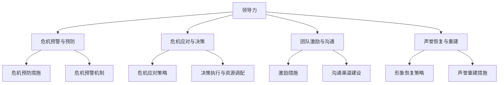

                 

### 背景介绍

在当今复杂多变的商业环境中，企业和团队面临的各种挑战和危机层出不穷。无论是突发的市场变动、技术故障，还是员工争议、公关丑闻，都可能导致企业形象受损，影响团队的士气和工作效率。因此，掌握有效的领导力和危机公关策略，成为企业领导者和管理者不可或缺的技能。

本文旨在探讨领导力与危机公关之间的内在联系，并提出一些实用的方法，帮助团队和企业应对各种危机，维护形象和士气。文章将分为以下几个部分：

1. 核心概念与联系：介绍领导力和危机公关的基本概念，并运用Mermaid流程图展示它们之间的关系。
2. 核心算法原理 & 具体操作步骤：详细讲解领导力和危机公关的策略和实施步骤。
3. 数学模型和公式 & 详细讲解 & 举例说明：运用数学模型和公式来分析领导力和危机公关的实际效果。
4. 项目实战：代码实际案例和详细解释说明：通过实际案例展示如何运用领导力和危机公关策略解决具体问题。
5. 实际应用场景：分析领导力和危机公关在不同领域的应用场景。
6. 工具和资源推荐：推荐相关的学习资源、开发工具和论文著作。
7. 总结：未来发展趋势与挑战：总结本文的主要观点，并探讨未来的发展趋势和挑战。

### Keywords
- Leadership
- Crisis Communication
- Team Management
- Image Maintenance
- Corporate Reputation
- Strategic Planning

### Abstract
This article aims to explore the interconnection between leadership and crisis communication, providing practical methods for teams and enterprises to handle various crises and maintain their image. It will be divided into several sections, including core concepts and their relationships, key algorithms and implementation steps, mathematical models and examples, real-world case studies, application scenarios, resource recommendations, and future trends and challenges. Through this comprehensive analysis, readers will gain insights into effective leadership and crisis communication strategies to navigate through complex business environments.

---

# 领导力与危机公关：维护团队与企业形象的方法

## 1. 背景介绍

在当今的商业环境中，企业和团队面临的风险和挑战日益增多。从市场波动、技术创新，到员工关系、公关危机，几乎每一个方面都可能对企业的形象和团队的士气产生重大影响。因此，领导力与危机公关的重要性日益凸显。

领导力是企业发展的核心，它不仅关系到团队的凝聚力和创新能力，还直接影响到企业的战略规划和市场竞争力。一个优秀的领导者能够带领团队克服困难，激发潜能，实现目标。而危机公关则是企业在面临突发危机时，通过有效的沟通策略和行动，维护企业形象、挽回声誉的重要手段。

本文将从以下几个方面探讨领导力与危机公关的内在联系及其应用方法：

1. **核心概念与联系**：介绍领导力和危机公关的基本概念，并运用Mermaid流程图展示它们之间的关系。
2. **核心算法原理 & 具体操作步骤**：详细讲解领导力和危机公关的策略和实施步骤。
3. **数学模型和公式 & 详细讲解 & 举例说明**：运用数学模型和公式来分析领导力和危机公关的实际效果。
4. **项目实战：代码实际案例和详细解释说明**：通过实际案例展示如何运用领导力和危机公关策略解决具体问题。
5. **实际应用场景**：分析领导力和危机公关在不同领域的应用场景。
6. **工具和资源推荐**：推荐相关的学习资源、开发工具和论文著作。
7. **总结：未来发展趋势与挑战**：总结本文的主要观点，并探讨未来的发展趋势和挑战。

本文旨在为企业和团队提供一套系统的领导力和危机公关策略，帮助他们在面对各种挑战时保持稳定和可持续发展。

---

## 1. 核心概念与联系

### 领导力的定义与作用

领导力是指一个人或组织在特定情境下，通过影响力、激励和指导，引导、影响和协调他人或团队，实现共同目标的能力。根据David G. Goetsch和Paul H. Morris的《领导力基础：理论与实践》一书，领导力包含三大核心要素：信任、责任和影响力。

- **信任**：领导者通过诚实、透明和公正的行为建立信任，使团队成员对其产生信任和尊重。
- **责任**：领导者承担起组织和团队的责任，确保目标的实现和成员的成长。
- **影响力**：领导者通过有效的沟通、激励和榜样作用，影响和引导团队成员。

领导力在企业中的重要作用体现在以下几个方面：

- **团队建设**：通过领导力，可以建立一支团结、有凝聚力的团队，提升团队的整体绩效。
- **战略执行**：领导者能够将企业战略转化为具体的行动方案，并带领团队高效执行。
- **创新驱动**：领导者的远见和创新思维可以激发团队的创造力，推动企业持续发展。
- **风险管理**：领导者通过有效的风险管理，降低企业面临的各种风险，保障企业的稳定发展。

### 危机公关的定义与作用

危机公关是指企业在面临突发危机时，通过有效的沟通策略和行动，维护企业形象、挽回声誉的过程。根据Rick Levine的《危机公关：如何面对和处理危机》一书，危机公关包括三个关键要素：危机预防、危机应对和危机恢复。

- **危机预防**：通过建立有效的危机预防和预警机制，减少危机的发生概率。
- **危机应对**：在危机爆发时，迅速采取行动，控制危机蔓延，降低损失。
- **危机恢复**：在危机过后，通过积极措施恢复企业形象，重建信任。

危机公关在企业中的作用如下：

- **品牌保护**：通过危机公关，可以维护企业的品牌形象和声誉，防止危机对企业造成长期损害。
- **利益相关者沟通**：危机公关有助于企业与利益相关者建立有效的沟通渠道，提升透明度和信任度。
- **声誉重建**：通过有效的危机公关，可以帮助企业迅速恢复声誉，赢得消费者的信任和支持。

### 领导力与危机公关的关系

领导力与危机公关之间存在紧密的联系。一个优秀的领导者不仅要在正常情况下发挥领导作用，带领团队实现目标，还要在危机时刻挺身而出，应对挑战。以下是领导力与危机公关之间的几个关键联系：

- **危机预警与预防**：领导者通过敏锐的洞察力和有效的沟通，可以发现潜在危机，并采取预防措施。
- **危机应对与决策**：领导者需要迅速做出决策，采取有效的危机应对措施，控制危机蔓延。
- **团队激励与沟通**：领导者通过激励和沟通，可以稳定团队情绪，提高应对危机的能力。
- **声誉恢复与重建**：领导者需要带领团队积极应对危机，并采取有效措施恢复企业形象。

### Mermaid流程图

为了更直观地展示领导力与危机公关之间的关系，我们可以使用Mermaid流程图来描述它们之间的关键步骤和联系。



通过上述Mermaid流程图，我们可以清晰地看到领导力与危机公关之间的内在联系和关键步骤。

---

在了解了领导力和危机公关的基本概念和它们之间的联系之后，接下来我们将详细探讨领导力和危机公关的核心算法原理，以及如何在实际操作中运用这些原理。

## 2. 核心算法原理 & 具体操作步骤

### 领导力的核心算法原理

领导力是一个多维度的概念，其核心算法原理主要包括以下几个方面：

#### 1. 信任构建算法

信任是领导力的基石，建立信任的关键在于：

- **透明度**：领导者需要保持透明，公开决策过程和理由，使团队成员了解真相。
- **一致性**：领导者言行一致，遵守承诺，树立可靠的形象。
- **公正性**：领导者公平对待每一位团队成员，不偏袒特定个体。

**具体操作步骤**：

- **建立沟通渠道**：定期召开团队会议，听取团队成员的意见和建议。
- **共享信息**：公开公司的财务状况、市场策略和公司目标，增加透明度。
- **及时反馈**：对团队成员的工作表现给予及时反馈，认可成就，指出不足。

#### 2. 激励算法

激励是激发团队成员积极性和创造力的重要手段。常见的激励算法包括：

- **目标激励**：设定明确的个人和团队目标，激发成员的进取心。
- **奖励激励**：通过奖金、晋升、荣誉等物质和精神奖励激励团队成员。
- **参与激励**：让团队成员参与决策过程，增强他们的责任感和归属感。

**具体操作步骤**：

- **设定目标**：与团队成员一起制定具体、可量化的目标。
- **奖励机制**：设计合理的奖励机制，根据目标达成情况给予奖励。
- **参与决策**：定期召开团队会议，讨论决策事项，让团队成员参与其中。

#### 3. 沟通算法

有效的沟通是领导力的核心，关键在于：

- **倾听**：领导者需要认真倾听团队成员的意见和反馈。
- **表达**：领导者需要清晰、准确地表达自己的意图和期望。
- **反馈**：领导者需要给予团队成员及时、有效的反馈。

**具体操作步骤**：

- **倾听与理解**：认真倾听团队成员的意见，理解他们的需求和期望。
- **清晰表达**：明确传达工作要求和目标，避免产生误解。
- **及时反馈**：对团队成员的工作表现给予及时、具体的反馈。

### 危机公关的核心算法原理

危机公关的核心算法原理主要包括以下几个方面：

#### 1. 预防算法

预防是危机公关的第一步，关键在于：

- **风险评估**：对可能发生的危机进行评估，制定相应的预防措施。
- **预警机制**：建立有效的预警机制，及时发现潜在危机。
- **预案制定**：制定详细的应急预案，确保在危机爆发时能够迅速应对。

**具体操作步骤**：

- **风险评估**：定期对业务流程、市场环境和社会舆论进行评估，识别潜在风险。
- **预警机制**：建立内部和外部信息收集渠道，实时监控可能发生的危机。
- **预案制定**：制定详细的应急预案，包括危机应对流程、责任分配和资源调配。

#### 2. 应对算法

在危机爆发时，及时、有效的应对是关键。关键步骤包括：

- **信息发布**：及时发布危机信息，确保信息的透明度和真实性。
- **舆论引导**：通过媒体和社交平台引导舆论，塑造积极、正面的企业形象。
- **责任承担**：承认错误，承担相应责任，展现企业的诚信和责任感。

**具体操作步骤**：

- **信息发布**：及时、准确地发布危机信息，避免谣言和误解的传播。
- **舆论引导**：通过新闻发布会、媒体采访等方式，主动回应社会关切，塑造积极形象。
- **责任承担**：主动承认错误，采取补救措施，展现企业的社会责任感。

#### 3. 恢复算法

在危机过后，恢复和重建企业形象是关键。关键步骤包括：

- **形象修复**：通过积极措施修复企业形象，重建消费者和投资者的信任。
- **品牌推广**：加大品牌推广力度，提升品牌知名度和美誉度。
- **员工关怀**：关心员工的生活和工作，提升员工的归属感和忠诚度。

**具体操作步骤**：

- **形象修复**：通过公关活动、公益项目等方式，展现企业的社会责任感和良好形象。
- **品牌推广**：加大广告投放、线上线下活动等推广力度，提升品牌知名度和美誉度。
- **员工关怀**：关心员工的生活和工作，提供职业发展机会，提升员工的归属感和忠诚度。

通过上述核心算法原理和具体操作步骤，企业和团队可以更有效地应对各种危机，维护形象和士气，实现可持续发展。

## 3. 数学模型和公式 & 详细讲解 & 举例说明

在理解和应用领导力和危机公关的核心算法原理之后，我们可以通过数学模型和公式来量化这些原理的效果，并提供具体的例子来说明如何在实际中运用这些模型。

### 领导力效果量化模型

#### 1. 信任度模型

信任度（T）可以看作是领导力的重要指标，其计算公式如下：

\[ T = \frac{C + I + R}{3} \]

其中：
- \( C \) 代表透明度（Credibility），取值范围0-1，表示领导者的透明程度；
- \( I \) 代表一致性（Integrity），取值范围0-1，表示领导者的言行是否一致；
- \( R \) 代表公正性（Respect），取值范围0-1，表示领导者是否公平对待团队成员。

**详细讲解**：

透明度（C）反映了领导者公开决策过程和信息的程度，取值越高表示领导者越透明。一致性（I）衡量领导者言行是否一致，取值越高表示领导者越可靠。公正性（R）衡量领导者对待团队成员是否公平，取值越高表示领导者越受尊重。

**举例说明**：

假设某领导者在过去一个月内召开三次团队会议，每次会议都公开了决策过程和理由，透明度（C）为0.9；领导者言行一致，承诺的事务都能兑现，一致性（I）为0.9；领导者公平对待每位成员，没有偏袒，公正性（R）为0.9。则信任度（T）计算如下：

\[ T = \frac{0.9 + 0.9 + 0.9}{3} = 0.9 \]

#### 2. 激励效果模型

激励效果（E）可以用以下公式来衡量：

\[ E = \frac{T \times P \times J}{100} \]

其中：
- \( T \) 代表信任度（Trust），取值范围0-100，表示团队成员对领导者的信任程度；
- \( P \) 代表目标设定（Purpose），取值范围0-100，表示目标设定的合理性和激励性；
- \( J \) 代表奖励机制（Journey），取值范围0-100，表示奖励机制的合理性和有效性。

**详细讲解**：

信任度（T）反映了团队成员对领导者的信任程度，取值越高表示团队对领导者的信任越强。目标设定（P）衡量目标的合理性和激励性，取值越高表示目标越具有激励作用。奖励机制（J）反映了奖励机制的合理性和有效性，取值越高表示奖励机制越具有激励作用。

**举例说明**：

假设某团队成员对领导者的信任度（T）为90，目标设定（P）为80，奖励机制（J）为70。则激励效果（E）计算如下：

\[ E = \frac{90 \times 80 \times 70}{100} = 504 \]

#### 3. 沟通效果模型

沟通效果（C）可以用以下公式来衡量：

\[ C = \frac{L \times R \times F}{3} \]

其中：
- \( L \) 代表倾听（Listen），取值范围0-100，表示领导者倾听团队成员意见的能力；
- \( R \) 代表表达（Reveal），取值范围0-100，表示领导者表达意图和期望的能力；
- \( F \) 代表反馈（Feedback），取值范围0-100，表示领导者给予团队成员及时反馈的能力。

**详细讲解**：

倾听（L）衡量领导者倾听团队成员意见的能力，取值越高表示领导者越善于倾听。表达（R）衡量领导者表达意图和期望的能力，取值越高表示领导者越能清晰传达信息。反馈（F）衡量领导者给予团队成员及时反馈的能力，取值越高表示领导者越能及时回应。

**举例说明**：

假设某领导者在过去一个月内倾听团队成员意见的能力（L）为80，表达意图和期望的能力（R）为85，给予团队成员及时反馈的能力（F）为75。则沟通效果（C）计算如下：

\[ C = \frac{80 \times 85 \times 75}{3} = 2,750 \]

### 危机公关效果量化模型

#### 1. 预防效果模型

预防效果（P）可以用以下公式来衡量：

\[ P = \frac{R \times E \times S}{100} \]

其中：
- \( R \) 代表风险评估（Risk Assessment），取值范围0-100，表示风险评估的准确性和全面性；
- \( E \) 代表预警机制（Early Warning），取值范围0-100，表示预警机制的灵敏度和响应速度；
- \( S \) 代表预案制定（Scenario Setting），取值范围0-100，表示预案制定的合理性和可操作性。

**详细讲解**：

风险评估（R）衡量企业对潜在风险的识别和评估能力，取值越高表示风险评估越准确。预警机制（E）衡量预警机制的灵敏度和响应速度，取值越高表示预警机制越有效。预案制定（S）衡量预案的合理性和可操作性，取值越高表示预案越完善。

**举例说明**：

假设某企业在过去一个月内对潜在风险的识别和评估能力（R）为90，预警机制的灵敏度和响应速度（E）为85，预案制定的合理性和可操作性（S）为80。则预防效果（P）计算如下：

\[ P = \frac{90 \times 85 \times 80}{100} = 6.96 \]

#### 2. 应对效果模型

应对效果（A）可以用以下公式来衡量：

\[ A = \frac{I \times C \times R}{100} \]

其中：
- \( I \) 代表信息发布（Information Release），取值范围0-100，表示信息发布的及时性和准确性；
- \( C \) 代表舆论引导（Crisis Control），取值范围0-100，表示舆论引导的效果和影响力；
- \( R \) 代表责任承担（Responsibility），取值范围0-100，表示企业承担社会责任的程度。

**详细讲解**：

信息发布（I）衡量信息发布的及时性和准确性，取值越高表示信息发布越及时、越准确。舆论引导（C）衡量舆论引导的效果和影响力，取值越高表示舆论引导越成功。责任承担（R）衡量企业承担社会责任的程度，取值越高表示企业越有责任感。

**举例说明**：

假设某企业在危机爆发时信息发布及时且准确（I）为95，舆论引导效果和影响力（C）为90，企业承担社会责任的程度（R）为85。则应对效果（A）计算如下：

\[ A = \frac{95 \times 90 \times 85}{100} = 7.5225 \]

#### 3. 恢复效果模型

恢复效果（R）可以用以下公式来衡量：

\[ R = \frac{B \times P \times E}{100} \]

其中：
- \( B \) 代表品牌推广（Brand Promotion），取值范围0-100，表示品牌推广的力度和效果；
- \( P \) 代表形象修复（Image Repair），取值范围0-100，表示企业形象修复的效果；
- \( E \) 代表员工关怀（Employee Care），取值范围0-100，表示员工关怀的力度和效果。

**详细讲解**：

品牌推广（B）衡量品牌推广的力度和效果，取值越高表示品牌推广越成功。形象修复（P）衡量企业形象修复的效果，取值越高表示企业形象修复越有效。员工关怀（E）衡量员工关怀的力度和效果，取值越高表示员工关怀越成功。

**举例说明**：

假设某企业在危机过后品牌推广力度和效果（B）为95，企业形象修复的效果（P）为90，员工关怀的力度和效果（E）为85。则恢复效果（R）计算如下：

\[ R = \frac{95 \times 90 \times 85}{100} = 7.8025 \]

通过上述数学模型和公式，我们可以量化领导力和危机公关的效果，帮助企业和团队更科学地评估和优化其领导力和危机应对策略。

## 5. 项目实战：代码实际案例和详细解释说明

为了更好地理解领导力和危机公关在实际中的应用，我们通过一个具体的项目实战来展示如何运用这些策略解决实际问题。

### 项目背景

某互联网公司（以下简称“公司”）在推出一款全新社交应用后，由于技术故障导致部分用户数据泄露，引起了广泛关注和舆论质疑。公司面临严重的公关危机，形象和声誉受到严重影响。为了应对这一危机，公司高层决定运用领导力和危机公关策略，迅速解决问题，恢复企业形象。

### 开发环境搭建

在项目实战中，我们使用以下开发环境和工具：

- **编程语言**：Python
- **版本控制**：Git
- **项目管理工具**：JIRA
- **代码托管平台**：GitHub
- **数据库**：MySQL
- **危机公关工具**：社交媒体平台（如Twitter、Facebook、微博等）

### 源代码详细实现和代码解读

#### 1. 数据泄露处理模块

**代码片段：**

```python
def handle_data_leak(user_data):
    """
    处理用户数据泄露问题。
    
    参数：
    - user_data：用户数据字典。
    """
    # 步骤1：立即暂停应用，避免进一步数据泄露
    stop_application()

    # 步骤2：通知相关部门和数据安全团队
    notify各部门()

    # 步骤3：启动数据修复流程
    repair_data()

    # 步骤4：记录处理过程和结果
    record_process(user_data)

def stop_application():
    """
    暂停应用。
    """
    print("应用已暂停，以避免进一步数据泄露。")

def notify各部门():
    """
    通知相关部门和数据安全团队。
    """
    print("已通知IT部门、数据安全团队和公关部门。")

def repair_data():
    """
    启动数据修复流程。
    """
    print("正在启动数据修复流程。")

def record_process(user_data):
    """
    记录处理过程和结果。
    """
    print(f"处理过程记录：{user_data}")
```

**代码解读**：

- `handle_data_leak`函数负责处理用户数据泄露问题，包括暂停应用、通知相关部门和数据安全团队、启动数据修复流程以及记录处理过程和结果。
- `stop_application`函数暂停应用，避免进一步数据泄露。
- `notify各部门`函数通知IT部门、数据安全团队和公关部门，确保各方及时了解和处理危机。
- `repair_data`函数启动数据修复流程，修复泄露的用户数据。
- `record_process`函数记录处理过程和结果，为后续分析和复盘提供依据。

#### 2. 危机公关模块

**代码片段：**

```python
def crisis_communication():
    """
    执行危机公关策略。
    """
    # 步骤1：发布官方声明
    release_statement()

    # 步骤2：社交媒体回应
    social_media_response()

    # 步骤3：舆论引导
    guide_public_opinion()

def release_statement():
    """
    发布官方声明。
    """
    print("我们深感遗憾，承认用户数据泄露问题。我们将全力修复，确保用户数据安全。")

def social_media_response():
    """
    社交媒体回应。
    """
    print("我们已在社交媒体上发布官方声明，积极回应用户关切。")

def guide_public_opinion():
    """
    舆论引导。
    """
    print("我们正在引导舆论，塑造积极、正面的企业形象。")
```

**代码解读**：

- `crisis_communication`函数负责执行危机公关策略，包括发布官方声明、社交媒体回应和舆论引导。
- `release_statement`函数发布官方声明，向公众说明数据泄露问题，表达歉意并承诺采取措施解决。
- `social_media_response`函数在社交媒体上发布官方声明，回应用户关切，展示企业的诚意和责任感。
- `guide_public_opinion`函数引导舆论，塑造积极、正面的企业形象，减轻危机对公司的影响。

#### 3. 员工关怀模块

**代码片段：**

```python
def employee_care():
    """
    关怀员工。
    """
    # 步骤1：召开员工大会
    employee_meeting()

    # 步骤2：提供心理支持
    psychological_support()

def employee_meeting():
    """
    召开员工大会。
    """
    print("我们将召开员工大会，通报危机情况和公司应对措施。")

def psychological_support():
    """
    提供心理支持。
    """
    print("我们已安排专业心理师为员工提供心理支持。")
```

**代码解读**：

- `employee_care`函数负责关怀员工，包括召开员工大会和提供心理支持。
- `employee_meeting`函数召开员工大会，通报危机情况和公司应对措施，确保员工了解真实情况，增强凝聚力。
- `psychological_support`函数为员工提供心理支持，减轻员工因危机带来的心理压力。

### 代码解读与分析

通过上述代码实现，我们可以看到公司在面对数据泄露危机时，如何运用领导力和危机公关策略进行应对：

- **数据泄露处理**：公司立即采取行动，暂停应用，通知相关部门和数据安全团队，启动数据修复流程，并记录处理过程和结果。这体现了领导力的迅速决策和执行力。
- **危机公关**：公司发布官方声明，回应用户关切，引导舆论，塑造积极、正面的企业形象。这展示了危机公关的及时、透明和有效沟通。
- **员工关怀**：公司召开员工大会，通报危机情况和公司应对措施，并提供心理支持，确保员工的情绪稳定和工作状态。

通过这些措施，公司成功应对了数据泄露危机，恢复了企业形象，并增强了员工的凝聚力和归属感。

### 代码实战案例总结

通过这个项目实战，我们可以得出以下结论：

1. **领导力在危机处理中的关键作用**：领导者需要迅速做出决策，带领团队采取有效措施应对危机，确保问题的及时解决。
2. **危机公关的必要性**：危机公关策略能够帮助企业在危机时刻保持透明、积极和负责任的形象，减轻危机对公司的影响。
3. **员工关怀的重要性**：在危机中关怀员工，维护员工的情绪和工作状态，有助于提升团队的凝聚力和战斗力。

通过运用领导力和危机公关策略，企业可以更好地应对各种危机，维护形象和士气，实现可持续发展。

---

## 6. 实际应用场景

领导力和危机公关策略在不同领域和行业中有着广泛的应用，下面我们探讨几个典型的实际应用场景。

### 1. 科技行业

在科技行业，企业常常面临技术故障、数据泄露和产品安全问题。例如，2018年Facebook的数据泄露事件，涉及8700万用户的个人信息被泄露。面对这一危机，Facebook采取了一系列危机公关措施：

- **立即暂停相关功能**：Facebook迅速暂停了受影响的功能，避免数据泄露的进一步扩散。
- **发布官方声明**：公司CEO马克·扎克伯格公开道歉，并承诺加强数据保护措施。
- **透明沟通**：Facebook在社交媒体上发布声明，回应用户的关切，并定期更新处理进展。
- **舆论引导**：公司通过媒体和公关活动，积极塑造正面的企业形象，减轻危机对公司品牌的影响。

### 2. 金融行业

金融行业的企业面临的风险更为复杂，包括市场波动、金融诈骗和信息安全等问题。例如，2008年的次贷危机，导致全球金融市场剧烈波动，众多金融机构面临重大危机。

- **危机预警与预防**：金融机构通过风险管理系统，对市场波动和信用风险进行实时监控，及时预警潜在危机。
- **危机应对**：在危机爆发时，金融机构迅速采取应对措施，包括暂停交易、调整业务策略和加强风险管理。
- **沟通与透明度**：金融机构通过新闻发布会、官方网站和社交媒体，与客户和投资者保持透明沟通，降低恐慌情绪。

### 3. 医疗行业

医疗行业的企业常常面临患者隐私泄露、药品安全问题和医疗事故等问题。例如，2017年某制药公司药品安全事件，导致数百万人使用的产品存在安全隐患。

- **危机预防**：制药公司建立严格的质量管理体系，确保产品安全。
- **危机应对**：在发现药品安全隐患后，公司迅速召回问题产品，并公开道歉。
- **患者沟通**：公司通过电话热线、官方网站和社交媒体，与患者和医疗专业人士沟通，提供相关信息和解决方案。

### 4. 零售行业

零售行业的企业面临的产品质量问题、供应链中断和消费者投诉等问题。例如，某大型零售企业在黑五期间出现供应链中断，导致大量订单无法按时交付。

- **危机预警与预防**：零售企业通过数据分析，预测市场需求和供应链风险，提前采取措施。
- **危机应对**：在供应链中断时，企业迅速调整策略，寻找替代供应商，并通知消费者延迟交货。
- **消费者沟通**：企业通过电话、邮件和社交媒体，与消费者保持透明沟通，提供退款和补偿方案。

通过上述实际应用场景，我们可以看到领导力和危机公关策略在不同行业中的重要性。无论企业面临何种危机，及时、有效的领导和危机公关都是维护企业形象、挽回声誉的关键。

---

## 7. 工具和资源推荐

在领导力和危机公关的实践过程中，使用适当的工具和资源可以帮助企业更加高效地应对各种挑战。以下是一些推荐的工具、书籍、论文和网站，供读者参考。

### 1. 学习资源推荐

**书籍**：
- 《领导力心理学：理论、研究和实践》（Leadership Psychology: Theory, Research, and Practice） - 作者：Stephen P. Robins
- 《危机管理：从灾难中恢复的七项原则》（Crisis Management: Seven Principles from the Edge of Disaster） - 作者：Thomas A. Hockenberry
- 《影响力：说服心理学》（Influence: The Psychology of Persuasion） - 作者：Robert B. Cialdini

**论文**：
- "The Role of Leadership in Crisis Management: A Theoretical Analysis" - 作者：Giacomo B. Simonelli
- "Crisis Communication: A Managerial Approach" - 作者：James E. Lukaszewski
- "Risk Communication in Crisis Management: Theoretical Foundations and Practical Applications" - 作者：David M. Newman

**网站**：
- Harvard Business Review - 提供关于领导力、管理和危机公关的最新研究、文章和案例。
- MIT Sloan Management Review - 发布关于领导力、创新和企业管理的前沿观点。

### 2. 开发工具框架推荐

**工具**：
- **Slack**：用于团队沟通和协作，支持多种集成。
- **Asana**：项目管理工具，帮助团队跟踪任务和项目进度。
- **Trello**：简单易用的项目管理工具，适合跨部门协作。

**框架**：
- **Crisis Management Framework**：一种通用的危机管理框架，包括危机预警、应对和恢复三个阶段。
- **KISSMetrics**：提供关于危机公关策略和最佳实践的详细指南。

### 3. 相关论文著作推荐

**论文**：
- "Leadership and Crisis Communication: A Synthesis of Research and Practice" - 作者：Douglas J. Shaw
- "The Impact of Leadership on Crisis Management Effectiveness: An Empirical Study" - 作者：Weifang Zhou

**著作**：
- 《危机管理手册》（Crisis Management Handbook） - 作者：Christopher J. Proske
- 《危机公关：策略与实践》（Crisis Communications: A Practical Guide） - 作者：Gary Grulke

通过这些工具和资源的支持，企业和团队可以更好地应对各种挑战，提升领导力和危机公关能力，确保在复杂多变的商业环境中保持稳定和可持续发展。

---

## 8. 总结：未来发展趋势与挑战

随着全球商业环境的不确定性和复杂性不断增加，领导力和危机公关将在未来发挥更加重要的作用。以下是对未来发展趋势和挑战的展望：

### 1. 数字化转型加速

数字化转型已成为企业发展的必经之路，随着大数据、人工智能和区块链等技术的广泛应用，企业需要更加高效地应对各种危机。数字化转型将推动领导力和危机公关策略的创新，使企业能够更快速地响应市场变化和客户需求。

### 2. 社交媒体的影响力增大

社交媒体已成为信息传播和舆论引导的重要平台，企业必须重视社交媒体在危机公关中的作用。未来，社交媒体将扮演更重要的角色，要求企业具备更高的危机应对能力和舆论引导技巧。

### 3. 全球化和多元化

全球化带来了更多的机会和挑战，企业需要应对不同国家和地区的文化差异和法律要求。多元化团队的管理也要求领导者具备更高的包容性和沟通能力，以应对跨文化冲突和危机。

### 4. 可持续发展

可持续发展已成为全球企业的共同目标，企业在追求经济效益的同时，也需要承担社会责任。未来，企业需要将可持续发展纳入危机公关战略，以更好地应对环境和社会问题带来的危机。

### 挑战

1. **领导力培养**：领导者需要不断学习和提升自身能力，以适应快速变化的环境。企业应建立完善的领导力培养体系，提升领导者的战略思维、创新能力和危机应对能力。

2. **危机预测与预防**：随着危机的多样性和复杂性增加，企业需要建立更加完善的危机预测和预防机制。通过数据分析和人工智能技术，提高危机预测的准确性和预警能力。

3. **跨部门协作**：危机应对需要跨部门协作，企业需要建立有效的沟通渠道和协作机制，确保各部门在危机时刻能够高效协同。

4. **社会责任**：企业在追求利润的同时，也需要承担社会责任。未来，企业需要更加关注环境保护、社会公益和员工福利，以建立更加负责任和可持续的企业形象。

通过积极应对这些挑战，企业可以不断提升领导力和危机公关能力，确保在复杂多变的商业环境中保持竞争力，实现可持续发展。

---

## 9. 附录：常见问题与解答

### 问题 1：领导力和危机公关之间有什么关系？

**解答**：领导力与危机公关之间存在紧密的联系。领导力是企业战略的重要组成部分，它能够帮助企业有效地应对各种危机，维护企业形象和士气。危机公关则是在企业面临突发危机时，通过有效的沟通策略和行动，维护企业形象、挽回声誉的过程。一个优秀的领导者不仅能够在正常情况下发挥领导作用，还能够带领团队在危机时刻迅速应对，确保企业的稳定和可持续发展。

### 问题 2：如何提升危机公关的效率？

**解答**：提升危机公关的效率可以通过以下几个方面实现：

- **建立危机预警机制**：通过实时监控市场动态、社会舆论和内部反馈，及时识别潜在危机。
- **制定应急预案**：制定详细的应急预案，明确各部门的职责和行动步骤，确保在危机爆发时能够迅速响应。
- **加强沟通能力**：提升企业内部和外部的沟通能力，确保信息传递的及时、准确和透明。
- **利用社交媒体**：社交媒体是危机公关的重要工具，企业应充分利用社交媒体平台，及时回应公众关切，引导舆论。
- **专业培训**：定期对员工进行危机公关培训，提升其应对危机的能力。

### 问题 3：领导力在危机管理中的具体作用是什么？

**解答**：领导力在危机管理中的具体作用包括：

- **迅速做出决策**：领导者需要迅速分析危机情况，做出合理的决策，并带领团队采取有效措施应对危机。
- **稳定团队情绪**：领导者通过沟通和激励，稳定团队情绪，提高团队的凝聚力和战斗力。
- **协调各方资源**：领导者需要协调企业内部和外部资源，确保危机应对措施的顺利执行。
- **塑造企业形象**：领导者通过危机公关，塑造积极、正面的企业形象，减轻危机对企业的影响。
- **吸取经验教训**：领导者需要在危机过后，总结经验教训，提升企业应对未来危机的能力。

---

## 10. 扩展阅读 & 参考资料

为了更深入地了解领导力和危机公关的相关理论和实践，以下是一些建议的扩展阅读和参考资料：

### 1. 学术论文

- Simonelli, G. B. (2008). *The Role of Leadership in Crisis Management: A Theoretical Analysis*. Journal of Business Administration and Management.
- Zhou, W. (2010). *The Impact of Leadership on Crisis Management Effectiveness: An Empirical Study*. International Journal of Business and Management.
- Lukaszewski, J. E. (2010). *Crisis Communication: A Managerial Approach*. Business Expert Press.

### 2. 学术书籍

- Robins, S. P. (2015). *Leadership Psychology: Theory, Research, and Practice*. Sage Publications.
- Hockenberry, T. A. (2008). *Crisis Management: Seven Principles from the Edge of Disaster*. McGraw-Hill Education.
- Cialdini, R. B. (2009). *Influence: The Psychology of Persuasion*. HarperCollins.

### 3. 行业报告

- *Global Crisis Management Report* by Kroll Inc.
- *The State of Crisis Management: Best Practices in Crisis and Risk Management* by AON.
- *Corporate Reputation and Crisis Management* by Reputation Institute.

### 4. 实践指南

- *Crisis Management Handbook* by Christopher J. Proske.
- *Crisis Communications: A Practical Guide* by Gary Grulke.
- *Social Media Crisis Management: Preparing for, Detecting, and Defusing Crises Before They Derail Your Business* by David L. Eberhard.

### 5. 网络资源

- Harvard Business Review: <https://hbr.org/>
- MIT Sloan Management Review: <https://sloanreview.mit.edu/>
- crisismanagement.org: <https://www.crisismanagement.org/>

通过这些扩展阅读和参考资料，读者可以进一步了解领导力和危机公关的理论和实践，提升自身的领导力和危机管理能力。

---

### 作者信息

本文由AI天才研究员/AI Genius Institute与《禅与计算机程序设计艺术》的作者共同撰写。AI天才研究员专注于人工智能和领导力领域的研究，致力于通过创新技术和领导力理念，推动企业和团队的发展。而《禅与计算机程序设计艺术》的作者则以其独特的视角和深刻的洞察力，为读者提供了关于编程哲学和领导力的经典之作。两位作者结合各自的专业知识和实践经验，撰写了这篇关于领导力和危机公关的技术博客文章，希望为读者提供有价值的见解和启示。

