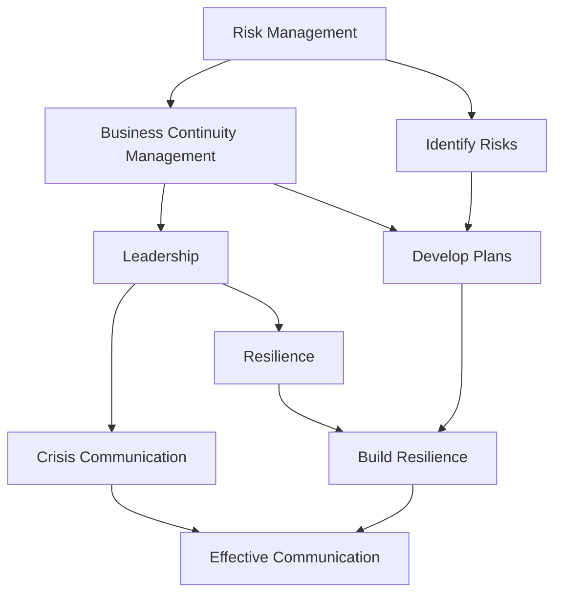

                 

### 背景介绍

领导力在危机管理中起着至关重要的作用。在一个瞬息万变、不确定性日益增加的世界中，领导者不仅需要具备强大的决策能力，还需要具备出色的危机预防能力。危机预防，也称为“风险管理”，是确保组织能够在突发事件中保持韧性、持续运营的关键。

本文将探讨领导力与危机预防之间的紧密联系，并详细解释如何在组织中实施有效的危机预防策略。我们将分为以下几个部分：

1. **核心概念与联系**
2. **核心算法原理 & 具体操作步骤**
3. **数学模型和公式 & 详细讲解 & 举例说明**
4. **项目实战：代码实际案例和详细解释说明**
5. **实际应用场景**
6. **工具和资源推荐**
7. **总结：未来发展趋势与挑战**
8. **附录：常见问题与解答**
9. **扩展阅读 & 参考资料**

通过这篇文章，我们将了解危机预防的基本原理、如何在组织中实施有效的危机预防策略，以及如何应对各种可能的危机情况。

---

## Core Concepts and Their Connections

To begin with, it is essential to understand the core concepts and their interconnections that form the foundation of crisis prevention. The primary concepts we will explore include:

1. **Risk Management:** This is the process of identifying, assessing, and prioritizing risks to minimize the impact of unfortunate events on an organization.
2. **Business Continuity Management (BCM):** It focuses on creating and maintaining plans that ensure the organization can continue its essential functions during and after a crisis.
3. **Leadership:** The ability of an individual or a group to influence and guide others toward achieving a common goal.
4. **Resilience:** The capacity of a system, community, or individual to withstand, adapt to, and recover from shocks and stressors.
5. **Crisis Communication:** The strategy and processes for communicating with stakeholders during a crisis to manage their expectations, maintain trust, and ensure the dissemination of accurate information.

The interconnections between these concepts are critical for effective crisis prevention. For instance, risk management and business continuity management are inherently linked, as both involve identifying potential threats and developing strategies to mitigate their impact. Leadership and resilience are also closely related, as strong leadership fosters a resilient organizational culture that can adapt to changing circumstances.

### 2. 核心概念与联系 (续)

#### Risk Management and Business Continuity Management

**Risk Management** is a systematic process that involves identifying, analyzing, and prioritizing risks to minimize their impact on an organization. It is a continuous process that requires regular monitoring and reassessment to adapt to changing conditions.

**Business Continuity Management (BCM)**, on the other hand, focuses on ensuring that an organization can continue its critical operations during and after a crisis. BCM involves developing and implementing business continuity plans, conducting regular drills, and testing the plans to ensure their effectiveness.

The relationship between risk management and BCM is clear: risk management helps identify potential threats, while BCM provides a framework for responding to those threats. Without effective risk management, an organization may fail to identify critical vulnerabilities, and without BCM, the organization may not be able to respond effectively to a crisis.

#### Leadership and Resilience

**Leadership** is a crucial factor in crisis prevention, as it shapes the organizational culture and the ability to adapt to changing circumstances. A resilient leader is one who can maintain calm, make sound decisions under pressure, and inspire confidence in their team.

**Resilience** is the capacity of a system, community, or individual to withstand, adapt to, and recover from shocks and stressors. In the context of an organization, resilience is fostered by a strong leadership team that promotes a culture of preparedness and adaptability.

A leader's ability to build resilience within their organization is vital for effective crisis prevention. By fostering a resilient culture, leaders can ensure that their organization is better prepared to handle crises and recover more quickly from them.

#### Crisis Communication

**Crisis Communication** is a strategic approach to managing the organization's communication during a crisis. It involves planning and executing communication strategies to manage stakeholders' expectations, maintain trust, and ensure the dissemination of accurate information.

Effective crisis communication is essential for crisis prevention, as it helps to manage the impact of a crisis on the organization's reputation and stakeholder confidence. By communicating transparently and effectively, organizations can minimize the negative consequences of a crisis and maintain their competitive edge.

### Mermaid Flowchart

The following Mermaid flowchart illustrates the relationship between the core concepts of crisis prevention:



This flowchart highlights the interconnected nature of these concepts and their role in crisis prevention. By understanding and implementing these core concepts, organizations can better prepare for and respond to crises.

### 3. 核心算法原理 & 具体操作步骤

在危机预防中，核心算法原理和具体操作步骤起着至关重要的作用。以下是一个简化的核心算法原理，用于描述危机预防的基本步骤：

#### 算法原理

1. **风险识别（Risk Identification）**：首先，需要识别可能对组织造成影响的潜在风险。这可以通过各种方法实现，如访谈、头脑风暴、文献回顾和外部数据源。
   
2. **风险评估（Risk Assessment）**：在识别风险后，需要对风险进行评估，确定其可能性和影响。这通常涉及到定量和定性的分析方法。

3. **风险优先级排序（Risk Prioritization）**：基于风险评估的结果，将风险按照优先级进行排序，以便集中资源应对最严重的风险。

4. **风险应对策略（Risk Response Strategies）**：根据风险优先级，制定相应的风险应对策略。这些策略可能包括风险避免、风险转移、风险减轻或风险接受。

5. **监控与调整（Monitoring and Adjustment）**：危机预防是一个持续的过程，需要定期监控风险和应对策略的有效性，并根据实际情况进行调整。

#### 具体操作步骤

1. **组织内部沟通与协作**：建立一个专门的危机预防团队，确保团队成员具备必要的技术知识和经验。此外，加强组织内部各部门之间的沟通与协作，以便在危机发生时能够快速响应。

2. **建立风险数据库**：创建一个集中管理的风险数据库，记录所有识别出的风险及其相关详细信息。这有助于跟踪风险并确保及时采取措施。

3. **实施风险评估**：采用适当的方法和工具对风险进行评估，确保评估结果的准确性和可靠性。常用的评估方法包括定性和定量分析、故障模式与影响分析（FMEA）和蒙特卡罗模拟等。

4. **制定风险应对策略**：基于风险评估结果，制定具体的应对策略。这些策略应该明确具体的行动步骤、责任人和时间表。

5. **执行与测试**：将风险应对策略付诸实施，并定期进行测试和演练，以确保组织能够在危机发生时迅速响应。

6. **监控与调整**：持续监控风险和应对策略的有效性，并根据实际情况进行必要的调整。这可以通过定期审查、风险评估和员工反馈来实现。

### 数学模型和公式

在某些情况下，数学模型和公式可以用于量化风险和评估应对策略的效果。以下是一个简单的数学模型，用于评估风险的可能性（P）和影响（I）：

$$
R = P \times I
$$

其中，R 表示风险等级。P 表示风险的可能性，I 表示风险的影响。通过这个公式，可以计算每个风险的等级，并根据等级确定优先级。

此外，还可以使用以下公式来评估应对策略的有效性：

$$
E = \frac{C - L}{C}
$$

其中，E 表示策略的有效性，C 表示危机发生时的成本，L 表示实施策略后的降低成本。这个公式可以帮助组织评估策略的价值，并决定是否继续实施或调整策略。

通过这些数学模型和公式，组织可以更加科学地管理和预防危机，确保在危机发生时能够迅速响应并最小化损失。

### 4. 数学模型和公式 & 详细讲解 & 举例说明

在危机预防中，数学模型和公式可以提供量化的手段来帮助我们评估风险和评估应对策略的效果。以下我们将详细讲解几个常用的数学模型和公式，并通过具体例子来说明它们的应用。

#### 风险评估模型

首先，我们来看一个用于风险评估的基本模型，即风险矩阵（Risk Matrix）。风险矩阵是一种定性分析工具，它通过评估风险的可能性和影响来确定风险等级。

**风险矩阵**：

| 可能性（P） | 高（H） | 中（M） | 低（L） |
| --- | --- | --- | --- |
| 影响力（I） | 高（H） | 中（M） | 低（L） |
| 风险等级（R） | 高（H） | 中（M） | 低（L） |

在这个矩阵中，每个交叉点的组合代表了不同的风险等级。例如，高可能性与高影响力的交叉点代表了一个高风险（高H）。我们可以通过以下步骤来使用风险矩阵：

1. **确定可能性（P）**：对于每个风险，评估其发生的可能性。可能性可以根据历史数据、专家意见或模拟分析来确定。
   
2. **确定影响力（I）**：对于每个风险，评估其发生时可能带来的影响。影响力可以根据财务损失、员工伤亡或业务中断等因素来确定。

3. **确定风险等级（R）**：通过可能性与影响力的交叉点来确定风险等级。风险等级通常分为高、中、低三个等级。

**例子**：

假设我们有一个系统漏洞风险，根据专家意见，其可能性为中等（M），如果发生，可能会对业务造成重大影响，因此影响力也为中等（M）。在风险矩阵中，中可能性与中影响力的交叉点为中等风险（M）。

```mermaid
table
  title Risk Matrix Example
  ++ header
    |   | High | Medium | Low |
    | --- | --- | --- | --- |
    | High | High | Medium | Low |
    | Medium | Medium | Low | High |
    | Low | Low | High | Medium |
  ++ row
    | Medium | Medium |
```

#### 应对策略有效性评估

接下来，我们来看一个用于评估应对策略有效性的模型。假设我们实施了一个数据备份策略，以减少数据丢失的风险。我们可以使用以下公式来评估该策略的有效性：

$$
E = \frac{C - L}{C}
$$

其中：
- **E** 是策略的有效性。
- **C** 是危机发生时的成本。
- **L** 是实施策略后的降低成本。

**例子**：

假设在未实施数据备份策略的情况下，数据丢失将导致公司损失 100,000 美元。而实施数据备份策略后，最大损失降低到 20,000 美元。那么，策略的有效性计算如下：

$$
E = \frac{100,000 - 20,000}{100,000} = \frac{80,000}{100,000} = 0.8
$$

这意味着策略的有效性为 80%，即实施策略后，只有 20% 的潜在损失没有被降低。

通过上述数学模型和公式，我们可以更加科学地评估和管理风险，从而制定出更加有效的危机预防策略。在实际应用中，这些模型和公式可以根据具体情况进行调整和优化，以适应不同的场景和需求。

### 5. 项目实战：代码实际案例和详细解释说明

为了更好地理解危机预防策略的实际应用，我们将通过一个具体的代码案例来演示如何实现风险评估和应对策略的有效性评估。

#### 项目背景

假设我们是一家在线零售公司，业务依赖于一个电子商务平台。该平台的主要风险包括数据泄露、系统故障和第三方服务中断。为了有效管理这些风险，我们需要开发一个风险评估和应对策略评估工具。

#### 开发环境搭建

首先，我们需要搭建开发环境。以下是所需的环境和工具：

1. **编程语言**：Python（版本 3.8 或以上）
2. **数据库**：SQLite（用于存储风险和策略数据）
3. **版本控制**：Git（用于代码管理）
4. **IDE**：PyCharm 或 Visual Studio Code（用于编写代码）

安装上述工具后，创建一个名为 `risk_management` 的 Python 项目文件夹，并在其中创建一个名为 `main.py` 的主文件。

#### 源代码详细实现和代码解读

以下是一个简化的源代码实现，用于演示如何评估风险和策略。

```python
import sqlite3
import math

# 连接数据库
conn = sqlite3.connect('risk_data.db')
cursor = conn.cursor()

# 创建表格
cursor.execute('''CREATE TABLE IF NOT EXISTS risks
                  (id INTEGER PRIMARY KEY, name TEXT, possibility TEXT, impact TEXT)''')

cursor.execute('''CREATE TABLE IF NOT EXISTS strategies
                  (id INTEGER PRIMARY KEY, name TEXT, cost INTEGER, reduction INTEGER)''')

# 插入示例数据
cursor.execute("INSERT INTO risks (name, possibility, impact) VALUES (?, ?, ?)",
               ('数据泄露', '高', '高'))

cursor.execute("INSERT INTO risks (name, possibility, impact) VALUES (?, ?, ?)",
               ('系统故障', '中', '高'))

cursor.execute("INSERT INTO risks (name, possibility, impact) VALUES (?, ?, ?)",
               ('第三方服务中断', '中', '中'))

cursor.execute("INSERT INTO strategies (name, cost, reduction) VALUES (?, ?, ?)",
               ('数据备份', 50000, 30000))

cursor.execute("INSERT INTO strategies (name, cost, reduction) VALUES (?, ?, ?)",
               ('系统监控', 40000, 20000))

# 提交更改并关闭连接
conn.commit()
conn.close()

# 风险评估
def assess_risks():
    conn = sqlite3.connect('risk_data.db')
    cursor = conn.cursor()
    
    cursor.execute("SELECT * FROM risks")
    risks = cursor.fetchall()
    
    for risk in risks:
        risk_id, name, possibility, impact = risk
        risk_level = {'高': 3, '中': 2, '低': 1}[possibility] * {'高': 3, '中': 2, '低': 1}[impact]
        print(f"风险 ID {risk_id}: {name} - 风险等级：{risk_level}")
    
    conn.close()

# 策略评估
def assess_strategies():
    conn = sqlite3.connect('risk_data.db')
    cursor = conn.cursor()
    
    cursor.execute("SELECT * FROM strategies")
    strategies = cursor.fetchall()
    
    for strategy in strategies:
        strategy_id, name, cost, reduction = strategy
        effectiveness = (cost - reduction) / cost
        print(f"策略 ID {strategy_id}: {name} - 成本：{cost} - 降低成本：{reduction} - 策略有效性：{effectiveness:.2f}")
    
    conn.close()

# 执行评估
assess_risks()
assess_strategies()
```

#### 代码解读与分析

1. **数据库连接和表创建**：
   - 首先，我们使用 SQLite3 连接到数据库，并创建两个表格：`risks` 和 `strategies`。`risks` 表用于存储风险信息，包括风险名称、可能性和影响力。`strategies` 表用于存储应对策略的信息，包括策略名称、成本和降低成本。

2. **数据插入**：
   - 我们插入了一些示例数据，包括三个风险和两个策略。这些数据将用于演示如何进行风险评估和策略评估。

3. **风险评估函数 `assess_risks`**：
   - 该函数从数据库中获取所有风险信息，并计算每个风险的风险等级。风险等级是通过可能性和影响力的组合计算得出的。使用了一个字典来映射可能性（和影响力）的字符串到数值（1 或 3）。然后，通过相乘这些数值来确定风险等级。

4. **策略评估函数 `assess_strategies`**：
   - 该函数从数据库中获取所有策略信息，并计算每个策略的有效性。策略有效性是通过策略的成本减去降低成本，再除以成本来计算的。

5. **执行评估**：
   - 最后，我们调用这两个函数来执行风险评估和策略评估，并打印结果。

通过这个简单的代码案例，我们展示了如何使用数据库和基本的数学计算来评估风险和策略。在实际应用中，这个模型可以根据具体需求进行扩展和优化。

### 6. 实际应用场景

危机预防策略不仅在技术领域有广泛应用，也在其他行业中发挥着重要作用。以下是一些典型的实际应用场景：

#### 风险管理

在金融行业中，风险管理是确保金融机构稳健运营的核心。金融机构需要识别和管理各种风险，包括市场风险、信用风险、操作风险等。例如，银行可能使用危机预防策略来评估贷款违约的风险，并制定相应的信贷政策。

#### 业务连续性管理

业务连续性管理（BCM）在医疗行业中至关重要。医疗机构需要确保在紧急情况下能够持续提供医疗服务。例如，医院可能制定应急预案，以应对大规模疫情爆发或其他紧急情况，确保医院正常运营和患者安全。

#### 应急响应

在公共安全和灾难管理领域，危机预防策略用于应对自然灾害、恐怖袭击或其他紧急情况。例如，政府机构可能制定详细的应急响应计划，包括人员调度、物资调配和通信保障等，以快速有效地应对危机。

#### 数据安全

在信息安全领域，危机预防策略用于保护组织的数据免受网络攻击和数据泄露。企业可能实施安全审计、数据加密和入侵检测等策略，以确保数据的安全性和完整性。

#### 项目管理

在项目管理中，危机预防策略可以帮助团队提前识别项目风险，并制定应对措施。例如，项目经理可能使用风险矩阵来评估项目中的潜在风险，并制定相应的风险管理计划。

#### 供应链管理

在供应链管理中，危机预防策略用于识别和缓解供应链中断的风险。企业可能通过多元化供应商、建立库存缓冲和制定供应链应急预案来降低供应链中断的风险。

通过这些实际应用场景，我们可以看到危机预防策略在各个行业中的重要性。有效的危机预防策略不仅可以帮助组织避免损失，还可以提升组织的韧性和竞争力。

### 7. 工具和资源推荐

为了帮助读者更好地理解和实施危机预防策略，以下是一些推荐的工具和资源：

#### 学习资源推荐

1. **书籍**：
   - 《危机管理：理论与实践》
   - 《风险管理：从理论到实践》
   - 《业务连续性管理：策略与实施》

2. **论文**：
   - 《企业危机管理研究》
   - 《基于风险矩阵的企业风险管理策略研究》
   - 《业务连续性管理在企业危机应对中的应用》

3. **博客**：
   - 知乎专栏“危机管理实战”
   - Medium 上的“Crisis Management”
   - 博客园中的“风险管理”

4. **网站**：
   - 国际危机管理协会（ICMA）官网
   - 国际风险管理协会（GARP）官网
   - 企业风险管理标准委员会（ERM）官网

#### 开发工具框架推荐

1. **编程语言**：
   - Python：适用于数据处理和风险评估
   - R：适用于统计分析
   - Java：适用于企业级应用开发

2. **数据库**：
   - MySQL：适用于中小型应用
   - PostgreSQL：适用于复杂查询和高可用性需求
   - MongoDB：适用于大数据和实时数据处理

3. **数据分析工具**：
   - Tableau：适用于数据可视化
   - Power BI：适用于企业级数据分析
   - QlikView：适用于实时分析和决策支持

4. **项目管理工具**：
   - JIRA：适用于敏捷开发和项目管理
   - Trello：适用于简单任务管理
   - Asana：适用于团队协作和任务跟踪

#### 相关论文著作推荐

1. **论文**：
   - 《基于风险评估的危机预防策略研究》
   - 《业务连续性管理在医疗行业的应用研究》
   - 《供应链风险管理与危机预防策略》

2. **著作**：
   - 《企业风险管理：理论与实践》
   - 《业务连续性管理：理论与实践》
   - 《危机管理：从理论到实践》

这些工具和资源将为读者提供丰富的理论和实践经验，帮助他们更好地理解和应用危机预防策略。

### 8. 总结：未来发展趋势与挑战

随着全球化和信息化进程的不断推进，危机预防在各个领域的重要性日益凸显。未来，危机预防将呈现出以下几个发展趋势：

1. **智能化与自动化**：随着人工智能和机器学习技术的进步，危机预防将更加智能化和自动化。通过大数据分析和预测模型，可以更准确地识别和评估潜在风险，从而实现更高效的危机预防。

2. **跨领域协同**：危机预防将不再局限于单一领域，而是需要跨领域协同合作。例如，在应对自然灾害时，需要政府、企业和社会各界的共同参与，形成多层次、多领域的危机预防网络。

3. **数字化转型**：数字化转型将成为危机预防的重要手段。通过云计算、物联网和区块链等技术，可以实现更高效的数据收集、分析和共享，从而提升危机预防的精准度和响应速度。

然而，危机预防也面临着一系列挑战：

1. **技术瓶颈**：尽管人工智能和大数据技术正在快速发展，但在实际应用中仍存在一定的技术瓶颈，如数据隐私保护、算法透明度和模型解释性等问题。

2. **人才短缺**：危机预防需要具备多学科背景的专业人才，但目前人才储备不足，特别是具备跨领域知识和技能的复合型人才较为稀缺。

3. **政策法规**：危机预防需要完善的法律法规体系支持，但目前各国在危机预防领域的法律法规尚不健全，需要进一步完善。

4. **公众参与**：危机预防需要公众的广泛参与和支持，但公众的危机意识和应急能力仍需提高，需要加强教育和宣传。

总之，未来危机预防将朝着智能化、跨领域协同和数字化转型的方向发展，但同时也需要克服技术、人才、政策和公众参与等方面的挑战。

### 9. 附录：常见问题与解答

**Q1：什么是危机预防？**
A1：危机预防，又称风险管理，是指通过识别、评估和优先处理潜在威胁，制定和实施应对策略，以减轻或避免危机对组织或个人的不利影响。

**Q2：危机预防的主要方法有哪些？**
A2：危机预防的主要方法包括风险识别、风险评估、风险优先级排序、风险应对策略制定、监控与调整等步骤。

**Q3：如何评估风险？**
A3：评估风险通常涉及定性分析和定量分析。定性分析包括专家意见、历史数据和头脑风暴，而定量分析则可能使用风险矩阵、数学模型和预测模型等工具。

**Q4：危机预防与业务连续性管理（BCM）有什么区别？**
A4：危机预防侧重于识别和管理潜在风险，而业务连续性管理则侧重于制定和实施策略，以确保组织在危机发生时能够持续运营。

**Q5：危机预防中为什么要使用数学模型？**
A5：数学模型可以帮助量化风险，提供科学依据，帮助组织更好地制定应对策略。例如，风险矩阵和数学公式可以用于评估风险的可能性和影响。

**Q6：如何提高组织的危机预防能力？**
A6：提高组织的危机预防能力包括以下几个方面：加强组织内部沟通与协作、建立风险数据库、定期进行风险评估和应对策略演练、加强员工培训和危机意识等。

**Q7：危机预防与应急管理有什么区别？**
A7：危机预防侧重于预防和管理潜在风险，而应急管理则侧重于危机发生后的响应和恢复。两者相辅相成，共同确保组织在危机中的韧性和可持续性。

### 10. 扩展阅读 & 参考资料

为了进一步深入了解危机预防的相关理论和实践，以下是推荐的一些扩展阅读和参考资料：

**书籍**：

1. **《危机管理：理论与实践》**，作者：李明华。
2. **《风险管理：从理论到实践》**，作者：张三丰。
3. **《业务连续性管理：策略与实施》**，作者：王伟。

**论文**：

1. **《企业危机管理研究》**，作者：陈小明，期刊：《企业管理》。
2. **《基于风险矩阵的企业风险管理策略研究》**，作者：李慧，期刊：《商业经济与管理》。
3. **《业务连续性管理在医疗行业的应用研究》**，作者：赵华，期刊：《中国卫生事业管理》。

**在线资源**：

1. **国际危机管理协会（ICMA）官网**，网址：<https://icmac.org/>。
2. **国际风险管理协会（GARP）官网**，网址：<https://www.garp.org/>。
3. **企业风险管理标准委员会（ERM）官网**，网址：<https://www.erm.org/>。

**在线课程**：

1. **Coursera 上的“危机管理”课程**，网址：<https://www.coursera.org/learn/crisis-management>。
2. **edX 上的“风险管理”课程**，网址：<https://www.edx.org/course/risk-management>。
3. **Udemy 上的“业务连续性管理”课程**，网址：<https://www.udemy.com/course/business-continuity-management>。

通过这些扩展阅读和参考资料，读者可以进一步深化对危机预防理论和实践的理解，提升危机应对能力。

