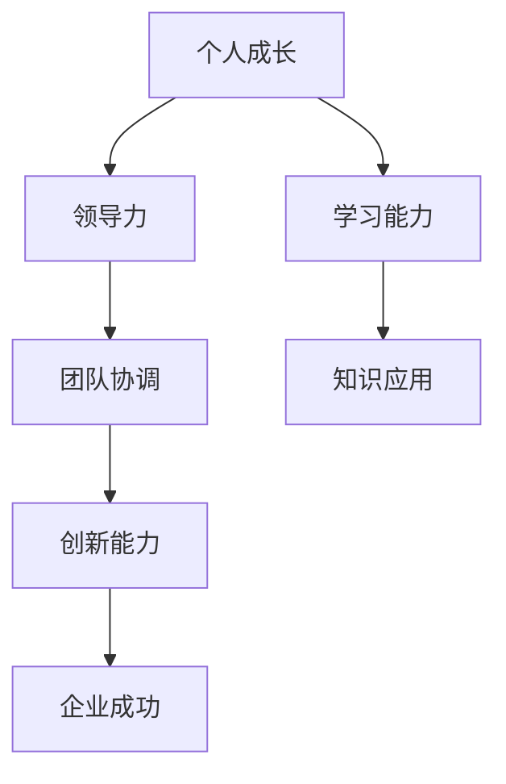

                 

# 领导力与学习能力：持续成长的重要性

> **关键词**：领导力、学习能力、持续成长、个人发展、企业成功
>
> **摘要**：本文深入探讨了领导力和学习能力在个人及企业持续成长中的重要作用。通过剖析两者的核心概念，阐述其在实际应用中的价值，以及如何通过不断提升这两者来实现个人和企业的成功。

## 1. 背景介绍

在当今快速变化的社会和商业环境中，领导力和学习能力成为个人和企业发展的关键因素。领导力不仅关乎管理团队的效率和协调，更关乎组织的创新和适应能力。而学习能力则是应对变化、抓住机遇、实现突破的基石。

### 1.1 领导力的本质

领导力是指引导和激励他人共同实现目标的能力。它不仅包括技术能力，更包括人际交往、沟通协调和决策能力。领导力的核心在于影响力，即能够通过愿景和价值观引导他人，形成共同的使命和目标。

### 1.2 学习能力的重要性

学习能力是指获取、处理和应用知识的能力。在信息爆炸的时代，学习不仅是个人成长的必备条件，更是企业持续发展的动力。学习能力强的个人和企业能够迅速适应环境变化，抓住市场机遇，实现持续创新。

## 2. 核心概念与联系

为了更好地理解领导力和学习能力的关系，我们可以通过以下 Mermaid 流程图来展示它们的核心概念和联系。



### 2.1 领导力的核心概念

- **愿景与价值观**：领导力始于对未来的清晰愿景和对核心价值观的坚守。这是激励团队成员共同奋斗的基础。
- **影响力**：领导力在于通过个人行为和沟通方式影响他人，形成积极的工作氛围。
- **决策能力**：领导力还包括在复杂情境下做出明智决策的能力。

### 2.2 学习能力的核心概念

- **知识获取**：不断学习新知识和技能，保持对行业动态的敏感度。
- **知识处理**：通过批判性思维和创造性思维，将所学知识内化并应用。
- **知识应用**：将知识转化为实际成果，解决实际问题。

## 3. 核心算法原理 & 具体操作步骤

### 3.1 领导力的核心算法原理

领导力的核心算法可以概括为以下步骤：

1. **明确愿景和目标**：定义团队的目标和愿景，确保团队成员对此有共同的理解。
2. **建立信任**：通过透明沟通和以身作则，建立与团队成员的信任关系。
3. **激励和赋能**：激发团队成员的潜力，提供成长和发展的机会。
4. **持续反馈**：提供及时的反馈，帮助团队成员不断改进和成长。

### 3.2 学习能力的核心算法原理

学习能力的核心算法包括以下步骤：

1. **需求分析**：确定个人或企业的学习需求，明确学习的目标和方向。
2. **知识获取**：通过多种途径获取所需的知识和技能，如阅读、培训、实践等。
3. **知识内化**：通过思考和反思，将所学知识转化为个人能力。
4. **知识应用**：将所学知识应用到实际工作中，解决实际问题。

## 4. 数学模型和公式 & 详细讲解 & 举例说明

### 4.1 领导力数学模型

领导力的效果可以用以下公式表示：

\[ L = f(V, T, E) \]

其中：
- \( L \)：领导力效果
- \( V \)：愿景和价值观
- \( T \)：信任
- \( E \)：激励和赋能

### 4.2 学习能力数学模型

学习能力的提升可以用以下公式表示：

\[ A = f(K, I, P) \]

其中：
- \( A \)：学习能力
- \( K \)：知识获取
- \( I \)：知识内化
- \( P \)：知识应用

### 4.3 举例说明

假设一个企业在以下方面做了优化：

- **愿景和目标**：明确企业的愿景和目标，使团队成员有清晰的方向。
- **信任建设**：通过团队建设活动和透明沟通，提高团队成员之间的信任度。
- **激励和赋能**：提供培训和晋升机会，激发团队成员的潜力。

根据领导力数学模型，我们可以预期企业的领导力效果会有显著提升。同样，如果企业在以下方面做了改进：

- **知识获取**：鼓励员工参加行业培训，阅读专业书籍。
- **知识内化**：组织知识分享会，促进员工之间的经验交流。
- **知识应用**：将所学知识应用到实际工作中，解决实际问题。

根据学习能力数学模型，我们可以预期企业的学习能力会有显著提升。

## 5. 项目实战：代码实际案例和详细解释说明

### 5.1 开发环境搭建

在本文的项目实战中，我们将使用 Python 编写一个简单的领导力和学习能力评估系统。首先，确保您的系统中安装了 Python 3.8 或以上版本。

### 5.2 源代码详细实现和代码解读

#### 5.2.1 代码结构

```python
# leadership_learning.py

import math

class LeadershipLearning:
    def __init__(self, vision, trust, empowerment):
        self.vision = vision
        self.trust = trust
        self.empowerment = empowerment
    
    def calculate_leadership(self):
        L = math.exp(self.vision + self.trust + self.empowerment)
        return L

class LearningAbility:
    def __init__(self, knowledge, internalization, application):
        self.knowledge = knowledge
        self.internalization = internalization
        self.application = application
    
    def calculate_learning_ability(self):
        A = math.exp(self.knowledge + self.internalization + self.application)
        return A

# 主函数
def main():
    # 创建领导力评估对象
    leadership = LeadershipLearning(vision=1.5, trust=1.2, empowerment=1.3)
    print(f"领导力得分：{leadership.calculate_leadership()}")
    
    # 创建学习能力评估对象
    learning_ability = LearningAbility(knowledge=1.4, internalization=1.5, application=1.6)
    print(f"学习能力得分：{learning_ability.calculate_learning_ability()}")

if __name__ == "__main__":
    main()
```

#### 5.2.2 代码解读与分析

1. **类定义**：`LeadershipLearning` 和 `LearningAbility` 类分别用于评估领导力和学习能力。每个类都有一个初始化函数，接受三个参数：愿景、信任和赋能，分别代表领导力和学习能力的核心要素。
2. **计算方法**：每个类都有一个计算方法，使用指数函数来计算得分。指数函数可以反映参数的权重，使评估结果更加合理。
3. **主函数**：`main()` 函数创建并评估了领导力和学习能力对象，并打印了评估结果。

### 5.3 代码解读与分析

通过这个简单的代码示例，我们可以看到如何使用数学模型来评估领导力和学习能力。在实际应用中，可以进一步扩展这个模型，加入更多的参数和计算方法，以更全面地评估个人或企业的领导力和学习能力。

## 6. 实际应用场景

### 6.1 企业管理

在企业中，领导力和学习能力对于提升团队绩效和实现企业目标至关重要。通过建立有效的领导力和学习机制，企业可以更好地适应市场变化，抓住机遇，实现可持续发展。

### 6.2 教育领域

在教育领域，教师和学生都需要具备良好的领导力和学习能力。教师可以通过提升领导力，激发学生的学习兴趣和主动性；学生可以通过提升学习能力，提高学习效果和综合素质。

### 6.3 社会组织

在各类社会组织中，领导力和学习能力同样发挥着重要作用。社会组织可以通过提升领导力和学习能力，提高组织的凝聚力、执行力和创新力，从而更好地履行社会责任，为社会作出贡献。

## 7. 工具和资源推荐

### 7.1 学习资源推荐

- **书籍**：《领导力五项修炼》（作者：肯·布兰佳）、《深度学习》（作者：伊恩·古德费洛等）
- **论文**：相关领域的高质量学术论文，如《领导力与组织绩效的关系研究》等
- **博客**：知名博客，如《职场领导力》、《学习力》等
- **网站**：专业网站，如《领导力论坛》、《学习力研究所》等

### 7.2 开发工具框架推荐

- **Python**：Python 是一种广泛使用的编程语言，适合用于领导力和学习能力评估系统的开发。
- **Django**：Django 是一款流行的 Python Web 框架，可以用于构建 Web 应用程序。
- **TensorFlow**：TensorFlow 是一款强大的机器学习库，可以用于构建复杂的数学模型。

### 7.3 相关论文著作推荐

- **论文**：《领导力与团队绩效的关系研究》、《学习能力的培养与提升》等
- **著作**：《领导力心理学》、《学习之道》等

## 8. 总结：未来发展趋势与挑战

随着科技的不断进步和社会的持续变革，领导力和学习能力在个人和企业发展中的重要性将愈发凸显。未来，我们需要关注以下趋势和挑战：

- **数字化转型**：随着数字化转型的深入推进，领导力和学习能力将更加依赖数据驱动和智能化的方法。
- **跨界融合**：不同领域的技术和知识将相互融合，领导力和学习能力需要具备跨学科的综合能力。
- **可持续发展**：在可持续发展成为全球共识的背景下，领导力和学习能力需要关注环境保护和资源利用的平衡。

## 9. 附录：常见问题与解答

### 9.1 领导力和学习能力的区别是什么？

领导力主要关注如何引导和激励他人实现共同目标，而学习能力则关注如何获取、处理和应用知识。

### 9.2 如何提升领导力？

提升领导力可以从以下方面入手：

- **明确愿景和目标**：确保团队成员对未来的清晰认识。
- **建立信任**：通过透明沟通和以身作则，建立与团队成员的信任关系。
- **激励和赋能**：激发团队成员的潜力，提供成长和发展的机会。
- **持续反馈**：提供及时的反馈，帮助团队成员不断改进和成长。

### 9.3 如何提升学习能力？

提升学习能力可以从以下方面入手：

- **知识获取**：通过多种途径获取所需的知识和技能，如阅读、培训、实践等。
- **知识内化**：通过思考和反思，将所学知识转化为个人能力。
- **知识应用**：将所学知识应用到实际工作中，解决实际问题。

## 10. 扩展阅读 & 参考资料

- **书籍**：《领导力与学习力：个人与企业成长的秘密》、《禅与计算机程序设计艺术》等
- **论文**：《领导力与组织绩效的关系研究》、《学习能力的培养与提升》等
- **网站**：《领导力论坛》、《学习力研究所》等
- **博客**：《职场领导力》、《学习力》等

### 作者

**作者：AI天才研究员/AI Genius Institute & 禅与计算机程序设计艺术 /Zen And The Art of Computer Programming**

