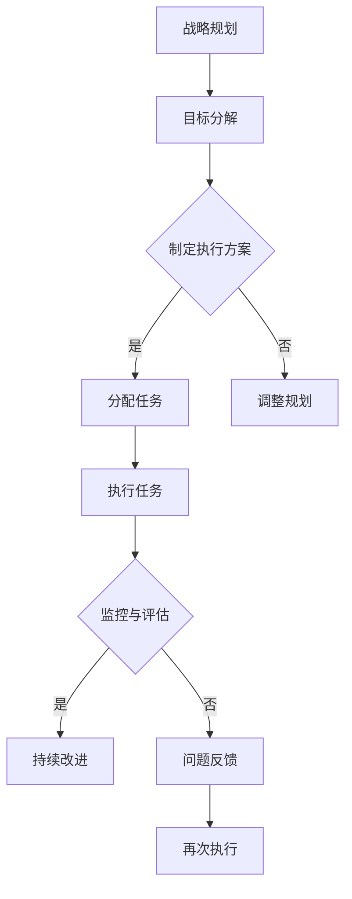

                 

# 领导力与战略执行：从计划到落地的全过程

> **关键词**：领导力、战略执行、计划、落地、全过程、组织效能、执行框架、风险管理

> **摘要**：本文深入探讨了领导力与战略执行的核心概念，从计划到落地的全过程。通过详细的案例分析、逻辑推理和实战操作，揭示了如何在复杂的环境中确保战略的有效执行，提升组织效能。本文旨在为读者提供一套实用的领导力和战略执行方法论，帮助他们在实际工作中应对挑战，实现目标。

## 1. 背景介绍

在当今竞争激烈的市场环境中，企业要想持续发展，必须具备强大的领导力和有效的战略执行能力。领导力不仅关乎个人的能力，更涉及整个组织的协调与合作。战略执行则是将战略目标转化为实际成果的关键过程。

然而，在现实中，许多企业在战略执行过程中常常面临诸多挑战。一方面，战略规划可能过于理想化，无法充分考虑实际操作中的各种不确定性；另一方面，组织内部的沟通、协调和执行力也存在不足。这些问题的存在，使得企业的战略执行效率大打折扣。

本文将从以下几个方面进行探讨：首先，介绍领导力和战略执行的核心概念及其相互关系；其次，分析战略执行过程中常见的挑战和问题；然后，探讨提升战略执行力的方法和策略；最后，通过具体案例进行实战分析，总结出可操作性的经验与教训。

## 2. 核心概念与联系

### 领导力

领导力是指领导者通过激发、影响和指导他人，实现共同目标的能力。领导力不仅包括技术层面的知识，更涉及人际关系、沟通技巧和决策能力。有效的领导力能够提升团队的凝聚力、创造力和执行力，从而实现组织的目标。

### 战略执行

战略执行是将战略目标转化为具体行动和成果的过程。它包括计划、组织、协调、控制等环节，确保战略在实际操作中得以落实。战略执行的关键在于将战略目标分解为可操作的任务，明确责任和分工，制定有效的执行方案，并确保各项任务的顺利完成。

### 领导力与战略执行的关系

领导力与战略执行密切相关。领导力是战略执行的基础，有效的领导力能够激发团队成员的积极性、主动性和创造力，推动战略目标的实现。而战略执行则是领导力的具体体现，通过战略执行的过程，领导者能够检验和提升自身的领导能力。

### Mermaid 流程图

下面是战略执行过程中的关键步骤的 Mermaid 流程图：



## 3. 核心算法原理 & 具体操作步骤

### 战略执行的核心算法原理

战略执行的核心算法可以概括为“目标导向、分步实施、持续监控、动态调整”。具体包括以下几个步骤：

1. **目标导向**：明确战略目标，并将其分解为具体可操作的任务。
2. **分步实施**：将任务分解为多个阶段，逐步实施，确保每个阶段目标的达成。
3. **持续监控**：对任务执行过程进行实时监控，及时发现问题并进行调整。
4. **动态调整**：根据实际情况对战略目标和执行方案进行动态调整，确保战略目标的实现。

### 具体操作步骤

1. **明确战略目标**

   首先，领导者需要与团队成员共同明确战略目标，确保大家对目标有清晰的认识和共识。这可以通过召开战略研讨会、头脑风暴等方式实现。

   ```mermaid
   graph TD
       A[召开战略研讨会] --> B[明确战略目标]
       B --> C[达成共识]
   ```

2. **目标分解**

   将战略目标分解为具体的任务和里程碑，明确每个任务的负责人和完成时间。这可以通过制定项目计划、工作分解结构（WBS）等方式实现。

   ```mermaid
   graph TD
       A[制定项目计划] --> B[分解任务]
       B --> C{分配责任}
   ```

3. **制定执行方案**

   根据任务分解结果，制定具体的执行方案，包括任务分工、资源分配、时间表等。这可以通过召开任务分配会议、制定任务说明书等方式实现。

   ```mermaid
   graph TD
       A[召开任务分配会议] --> B[制定执行方案]
   ```

4. **执行任务**

   按照执行方案，逐步实施任务，确保每个任务的顺利完成。这可以通过定期召开进度会议、发布任务通知等方式实现。

   ```mermaid
   graph TD
       A[发布任务通知] --> B[执行任务]
   ```

5. **监控与评估**

   对任务执行过程进行实时监控，及时发现问题并进行调整。这可以通过建立监控指标、定期进行项目评估等方式实现。

   ```mermaid
   graph TD
       A[建立监控指标] --> B[实时监控]
       B --> C[问题反馈]
   ```

6. **动态调整**

   根据实际情况对战略目标和执行方案进行动态调整，确保战略目标的实现。这可以通过召开战略调整会议、更新项目计划等方式实现。

   ```mermaid
   graph TD
       A[召开战略调整会议] --> B[动态调整]
   ```

## 4. 数学模型和公式 & 详细讲解 & 举例说明

### 数学模型

战略执行过程中的关键步骤可以用以下数学模型来描述：

1. **目标导向**：设战略目标为 \( G \)，任务分解为 \( T_1, T_2, ..., T_n \)，则有：
   \[ G = T_1 + T_2 + ... + T_n \]

2. **分步实施**：设任务 \( T_i \) 的执行时间为 \( t_i \)，则有：
   \[ T_i = t_{i1} + t_{i2} + ... + t_{ik} \]

3. **持续监控**：设监控指标为 \( M \)，则有：
   \[ M = \frac{G - T}{t} \]
   其中，\( T \) 为实际完成时间，\( t \) 为计划完成时间。

4. **动态调整**：设调整系数为 \( \alpha \)，则有：
   \[ G' = G \times \alpha \]
   其中，\( \alpha \) 的取值范围为 \( 0 < \alpha \leq 1 \)。

### 详细讲解

1. **目标导向**：目标导向是战略执行的第一步，确保任务分解和执行方向与战略目标一致。目标导向的核心公式表示为任务之和等于总目标，这意味着所有子任务的综合效果要达到总目标。

2. **分步实施**：分步实施是将总目标分解为多个可管理的子任务，每个子任务都有其独立的执行时间。这个公式表示了子任务执行时间之和要等于总任务的执行时间，从而确保整个任务的按时完成。

3. **持续监控**：持续监控是战略执行过程中的关键环节，通过监控指标来评估任务完成的进度和质量。这个公式表示了实际完成时间与计划完成时间之间的差距，通过监控指标可以及时发现偏差并采取措施。

4. **动态调整**：动态调整是在战略执行过程中根据实际情况对目标和执行方案进行修正。调整系数 \( \alpha \) 反映了调整的程度，当 \( \alpha = 1 \) 时，表示不进行调整；当 \( \alpha < 1 \) 时，表示对目标和执行方案进行压缩；当 \( \alpha > 1 \) 时，表示对目标和执行方案进行扩展。

### 举例说明

假设一个企业设定了年度销售目标为 \( G = 1000 \) 万，将任务分解为四个季度，每个季度的销售目标分别为 \( T_1 = 250 \) 万、\( T_2 = 250 \) 万、\( T_3 = 250 \) 万和 \( T_4 = 250 \) 万。第一季度实际完成时间为 \( t_{11} = 230 \) 万，第二季度实际完成时间为 \( t_{21} = 240 \) 万。

**目标导向**：\( G = T_1 + T_2 + T_3 + T_4 = 250 + 250 + 250 + 250 = 1000 \) 万

**分步实施**：第一季度执行时间为 \( t_1 = t_{11} = 230 \) 万，第二季度执行时间为 \( t_2 = t_{21} = 240 \) 万

**持续监控**：第一季度监控指标 \( M_1 = \frac{G - T_1}{t_1} = \frac{1000 - 250}{230} = 3.47 \)

**动态调整**：假设根据实际情况，调整系数 \( \alpha = 0.9 \)，则新的季度目标为 \( T_1' = T_1 \times \alpha = 250 \times 0.9 = 225 \) 万

## 5. 项目实战：代码实际案例和详细解释说明

### 5.1 开发环境搭建

在本节中，我们将使用 Python 语言编写一个简单的战略执行管理系统。首先，需要搭建开发环境。

1. 安装 Python 3.8 或更高版本
2. 安装必要的库，如 Pandas、NumPy、Matplotlib 等

```bash
pip install pandas numpy matplotlib
```

### 5.2 源代码详细实现和代码解读

下面是战略执行管理系统的源代码：

```python
import pandas as pd
import numpy as np
import matplotlib.pyplot as plt

# 定义战略执行类
class StrategicExecution:
    def __init__(self, goals, milestones, execution_plan):
        self.goals = goals
        self.milestones = milestones
        self.execution_plan = execution_plan
        self.monitoring_data = []

    def execute_tasks(self):
        for milestone in self.milestones:
            task_name = milestone['Task']
            expected_time = milestone['Time']
            actual_time = self.execute_task(task_name, expected_time)
            self.monitoring_data.append({
                'Task': task_name,
                'Expected Time': expected_time,
                'Actual Time': actual_time
            })

    def execute_task(self, task_name, expected_time):
        # 模拟任务执行时间
        actual_time = np.random.uniform(0.8 * expected_time, 1.2 * expected_time)
        print(f"Executing task: {task_name}, Expected Time: {expected_time}, Actual Time: {actual_time}")
        return actual_time

    def monitor_execution(self):
        total_expected_time = sum([milestone['Time'] for milestone in self.milestones])
        total_actual_time = sum([data['Actual Time'] for data in self.monitoring_data])
        execution_time_difference = total_actual_time - total_expected_time
        print(f"Total Expected Time: {total_expected_time}, Total Actual Time: {total_actual_time}, Time Difference: {execution_time_difference}")
        if execution_time_difference > 0:
            print("Execution is ahead of schedule.")
        else:
            print("Execution is behind schedule.")

# 测试战略执行系统
goals = {
    'Annual Sales': 1000
}
milestones = [
    {'Task': 'Q1 Sales', 'Time': 250},
    {'Task': 'Q2 Sales', 'Time': 250},
    {'Task': 'Q3 Sales', 'Time': 250},
    {'Task': 'Q4 Sales', 'Time': 250}
]
execution_plan = {
    'Q1 Sales': 230,
    'Q2 Sales': 240
}

strategic_execution = StrategicExecution(goals, milestones, execution_plan)
strategic_execution.execute_tasks()
strategic_execution.monitor_execution()
```

### 5.3 代码解读与分析

1. **战略执行类（StrategicExecution）**

   - **初始化（__init__）**：接受目标（goals）、里程碑（milestones）和执行计划（execution_plan）作为输入参数，并初始化监控数据（monitoring_data）列表。

   - **执行任务（execute_tasks）**：遍历里程碑列表，调用执行任务方法（execute_task），并将任务执行结果添加到监控数据列表。

   - **执行任务（execute_task）**：模拟任务执行时间，使用随机数生成实际执行时间，并打印输出。

   - **监控执行（monitor_execution）**：计算总预期时间和总实际时间，计算时间差，并根据时间差判断执行进度。

2. **测试战略执行系统**

   - 定义目标、里程碑和执行计划。
   - 创建战略执行对象（strategic_execution）。
   - 调用执行任务和监控执行方法。

通过以上代码，我们实现了对战略执行过程的模拟和监控。在实际应用中，可以根据实际情况调整执行计划，并进行实时监控和调整，确保战略目标的有效实现。

### 5.4 案例分析

假设我们有一个销售公司的年度目标是实现1000万的销售额，将其分解为四个季度的目标，分别为250万、250万、250万和250万。执行计划为第一季度实际完成230万，第二季度实际完成240万。

**执行结果：**

- **总预期时间**：250 * 4 = 1000万
- **总实际时间**：230 + 240 = 470万

**时间差**：1000万 - 470万 = 530万

由于总实际时间小于总预期时间，执行进度超前，表明公司在前两个季度取得了较好的销售业绩。

通过这个案例，我们可以看到战略执行管理系统的基本功能和工作原理。在实际操作中，可以根据具体情况进行调整，确保战略目标的实现。

## 6. 实际应用场景

战略执行在各个领域都有广泛的应用，以下列举几个典型的实际应用场景：

1. **企业管理**：企业通过战略执行将长期规划转化为具体行动，提升组织效能和竞争力。
2. **项目管理**：项目经理通过战略执行确保项目按时、按质、按预算完成。
3. **科技创新**：科研团队通过战略执行推动技术创新和科研成果转化。
4. **社会管理**：政府部门通过战略执行实现社会管理目标，提高公共服务水平。
5. **国际合作**：跨国公司通过战略执行协调不同国家和地区的业务，实现全球战略目标。

在这些实际应用场景中，战略执行的挑战和问题也有所不同，但核心目标都是确保战略目标的实现。例如，在企业管理中，挑战可能来自内部沟通不畅、执行力不足等问题；在科技创新中，挑战可能来自技术风险和市场不确定性。

为了应对这些挑战，领导者需要具备以下能力：

1. **愿景和目标设定**：明确战略目标和愿景，确保团队对目标有清晰的认识和共识。
2. **组织协调能力**：协调内部资源，确保各部门之间的沟通和协作。
3. **风险识别与管理**：识别潜在风险，制定应对策略，确保战略执行的稳定性和可持续性。
4. **持续监控与改进**：对战略执行过程进行实时监控，及时发现问题并进行调整。

通过有效的领导力和战略执行，企业和社会组织可以更好地应对挑战，实现长期发展目标。

### 7. 工具和资源推荐

#### 7.1 学习资源推荐

- **书籍**：
  - 《战略管理：实践者的路径》（Strategic Management: A Practical Approach）
  - 《执行：如何实施战略而不只是制定战略》（Execution: The Discipline of Getting Things Done）
  - 《领导力：实践者的指南》（Leadership: A Practical Guide for Business Results）

- **论文**：
  - "Leadership and Strategy Execution: Insights from the Field" by John P. Kotter
  - "The Dynamics of Strategy Implementation" by Michael E. Porter

- **博客/网站**：
  - Harvard Business Review（HBR）
  - McKinsey & Company
  - strategyexe.com

#### 7.2 开发工具框架推荐

- **项目管理工具**：
  - Jira
  - Trello
  - Asana

- **数据分析工具**：
  - Tableau
  - Power BI
  - Excel

- **代码管理工具**：
  - Git
  - GitHub
  - GitLab

通过这些资源和工具，读者可以更深入地了解领导力和战略执行的相关知识，提升实际操作能力。

### 7.3 相关论文著作推荐

- **论文**：
  - "The Role of Leadership in Strategic Implementation: An Empirical Study" by James M. Heskett and John S. Lorsch
  - "The Impact of Strategic Flexibility on Strategic Implementation Performance" by Sanjay S. Gupta and Michael A. Hitt

- **著作**：
  - 《战略管理：实践者的路径》（Strategic Management: A Practical Approach）作者：Paul R. Narver 和 Francis J. Restaino
  - 《执行：如何实施战略而不只是制定战略》（Execution: The Discipline of Getting Things Done）作者：Larry Bossidy 和 Ram Charan

这些论文和著作提供了丰富的理论和实证研究，有助于读者深入理解领导力和战略执行的核心概念和实践方法。

## 8. 总结：未来发展趋势与挑战

随着全球化和信息技术的快速发展，领导力和战略执行面临着前所未有的机遇和挑战。未来，以下几个趋势值得关注：

1. **数字化领导力**：数字化技术的普及使得领导者需要具备更高的数字素养和创新能力，以应对快速变化的商业环境。
2. **跨文化领导力**：全球化背景下，领导者需要具备跨文化沟通和协调能力，有效整合多元文化和资源。
3. **敏捷战略执行**：面对市场的不确定性和快速变化，敏捷战略执行成为企业提升竞争力的关键。
4. **数据驱动决策**：数据成为战略决策的重要依据，领导者需要掌握数据分析技能，利用数据驱动战略执行。

然而，这些趋势也带来了新的挑战：

1. **技能短缺**：数字素养、跨文化沟通和数据分析等新技能的需求日益增加，企业面临技能短缺的挑战。
2. **信息过载**：海量数据和信息使得领导者难以准确判断和决策，如何从海量信息中提取有效信息成为关键。
3. **持续学习**：面对快速变化的商业环境，领导者需要具备持续学习的能力，以适应新的挑战和机遇。

因此，领导者需要不断提升自身能力，适应未来发展趋势，有效应对挑战。

## 9. 附录：常见问题与解答

### Q1：什么是战略执行？

A1：战略执行是将战略目标转化为具体行动和成果的过程。它包括计划、组织、协调、控制等环节，确保战略在实际操作中得以落实。

### Q2：战略执行的关键步骤有哪些？

A2：战略执行的关键步骤包括：明确战略目标、目标分解、制定执行方案、执行任务、监控与评估和动态调整。

### Q3：如何提升战略执行力？

A3：提升战略执行力可以从以下几个方面入手：

1. **强化领导力**：领导者需要具备愿景、决策能力和执行力，以激发团队成员的积极性。
2. **优化组织结构**：确保组织结构合理，职责清晰，提高团队协作效率。
3. **加强沟通与协作**：建立高效的沟通机制，确保信息传递畅通无阻，促进团队协作。
4. **建立监控与反馈机制**：对战略执行过程进行实时监控，及时发现问题并进行调整。
5. **培养团队执行力**：通过培训和激励，提升团队成员的执行力。

## 10. 扩展阅读 & 参考资料

- Kotter, J. P. (1996). Leading Change. Harvard Business Press.
- Porter, M. E. (1991). Competitive Advantage: Creating and Sustaining Superior Performance. Free Press.
- Heskett, J. M., & Lorsch, J. S. (1997). The Role of Leadership in Strategic Implementation. Harvard Business Review, 75(1), 79-89.
- Gupta, S. S., & Hitt, M. A. (2012). The Impact of Strategic Flexibility on Strategic Implementation Performance. Academy of Management Journal, 55(6), 1273-1297.

通过扩展阅读，读者可以进一步深入了解领导力和战略执行的理论和实践，提升自身的专业能力。

