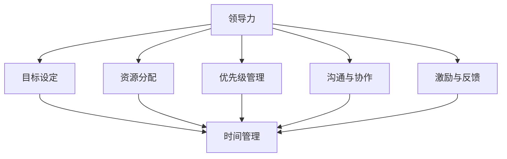

                 

### 文章标题：领导力与时间管理：提高工作效率的实用技巧

**关键词：** 领导力、时间管理、工作效率、实用技巧

**摘要：** 本文将深入探讨领导力与时间管理之间的关系，以及如何通过一系列实用技巧来提高工作效率。我们将分析领导力在职场中的重要性，并详细讨论时间管理的基本原则和策略。此外，本文还将提供实际案例和工具推荐，帮助读者在实际工作中有效应用这些技巧。

### 1. 背景介绍

在现代职场中，领导力和时间管理是两个不可或缺的要素。高效的时间管理不仅能帮助我们更好地完成工作任务，还能提高团队的整体效率。而卓越的领导力则是推动团队协作、创新和成长的关键。本文旨在为读者提供一系列实用的领导力与时间管理技巧，帮助他们在职场中取得成功。

领导力在职场中扮演着至关重要的角色。一个好的领导者不仅能够激励团队成员发挥最佳水平，还能确保团队目标的实现。领导力不仅包括决策能力、沟通技巧和激励手段，还涉及如何有效管理时间和资源，以提高整个团队的工作效率。

时间管理则是一个永恒的话题。在现代社会，人们面临着越来越多的工作任务和压力。如何合理安排时间，确保在有限的时间内完成更多的工作，成为了职场人士关注的焦点。时间管理不仅关乎个人的工作效率，还关系到团队的整体表现。

本文将首先介绍领导力与时间管理的基本概念，然后逐步深入探讨相关的核心原则和策略。接下来，我们将结合实际案例和工具推荐，为读者提供实用的技巧和指导。通过本文的阅读，读者将能够更好地理解领导力与时间管理的重要性，并学会如何在实际工作中有效应用这些技巧。

### 2. 核心概念与联系

在深入探讨领导力与时间管理的具体策略之前，我们首先需要明确一些核心概念，并理解它们之间的联系。

**领导力** 是指在组织或团队中引导和激励他人实现共同目标的能力。它不仅包括技术技能和知识，还涉及人际关系和沟通技巧。有效的领导力能够激发团队成员的潜力，促进团队合作和创新。

**时间管理** 是指合理规划和利用时间，以实现个人和团队目标的过程。时间管理不仅关乎个人工作效率，还影响到团队的整体绩效。通过有效的时间管理，人们可以在有限的时间内完成更多的工作，减少工作压力。

**领导力与时间管理的联系** ：

领导力与时间管理密切相关。一个优秀的领导者不仅能够激励团队成员，还能够在时间管理方面发挥关键作用。以下是领导力与时间管理之间的几个关键联系：

1. **目标设定**：领导者在制定团队目标时，需要考虑时间因素，确保目标具有可实现性。通过明确目标，领导者可以引导团队成员合理分配时间，提高工作效率。

2. **资源分配**：领导者负责分配团队资源，包括人力、物力和财力。通过合理分配资源，领导者可以优化工作流程，提高团队的工作效率。

3. **优先级管理**：领导者需要帮助团队成员确定任务优先级，确保关键任务得到及时完成。通过优先级管理，领导者可以确保团队在有限的时间内完成最重要的工作。

4. **沟通与协作**：领导者的沟通能力和协作能力对团队的时间管理至关重要。通过有效的沟通，领导者可以确保团队成员了解任务要求和时间安排，减少信息传递过程中的延误。

5. **激励与反馈**：领导者需要通过激励和反馈机制，鼓励团队成员高效工作。激励措施可以包括奖励、认可和晋升等，而反馈则有助于团队成员了解自己的工作表现，从而不断改进。

为了更好地理解这些核心概念，我们可以通过以下 Mermaid 流程图展示它们之间的联系：



通过这个流程图，我们可以清晰地看到领导力与时间管理之间的相互关系。理解这些概念和联系，是我们在后续探讨具体策略和技巧的基础。

### 3. 核心算法原理 & 具体操作步骤

在领导力与时间管理的实际应用中，有许多核心算法和策略可以帮助我们更有效地完成任务。以下将介绍几个常用的核心算法原理，并详细说明具体操作步骤。

#### 3.1 计划评审技术（PERT）

**原理**：计划评审技术（Program Evaluation and Review Technique，简称 PERT）是一种项目管理工具，用于分析项目任务的时间安排和风险。它基于三种时间估计：乐观时间（O）、最可能时间（M）和悲观时间（P），并计算出每个任务的期望完成时间和整个项目的期望完成时间。

**操作步骤**：

1. **确定任务列表**：列出项目中的所有任务，并确定它们的先后顺序。
2. **估计时间**：对于每个任务，分别估计乐观时间（O）、最可能时间（M）和悲观时间（P）。
3. **计算期望时间**：使用以下公式计算每个任务的期望时间（TE）：
   $$ TE = (O + 4M + P) / 6 $$
4. **绘制 PERT 图**：使用节点和箭头表示任务和依赖关系，构建 PERT 图。
5. **计算项目期望完成时间**：计算整个项目的期望完成时间（TE_total）：
   $$ TE_{total} = \sum TE_{i} $$
6. **分析风险**：通过计算每个任务的方差（Var）和标准差（SD），评估项目的时间风险。

**公式**：

$$ Var = \frac{(P - O)^2}{36} $$
$$ SD = \sqrt{Var} $$

#### 3.2 时间块管理法

**原理**：时间块管理法是一种时间管理策略，通过将时间划分为不同的块，并在每个块内专注于特定任务。这种方法有助于减少任务切换的干扰，提高工作效率。

**操作步骤**：

1. **划分时间块**：根据工作性质和任务紧急程度，将一天的时间划分为不同的块（例如，1 小时或 2 小时的块）。
2. **安排任务**：将任务分配到相应的时间块内。尽量在同一时间块内专注于同一类型或相似的任务。
3. **避免干扰**：在执行任务时，尽量减少干扰。关闭社交媒体、电子邮件和手机等可能分散注意力的因素。
4. **调整时间块**：根据实际情况调整时间块的长度和安排。如果某个时间块内的任务较多，可以适当延长该时间块；如果任务较少，可以将其拆分为更短的时间块。

#### 3.3 时间日志法

**原理**：时间日志法是一种记录和评估时间使用情况的方法。通过记录每天的工作内容和时间花费，可以更清楚地了解自己的时间管理状况，并发现改进的空间。

**操作步骤**：

1. **记录时间**：每天结束时，记录当天的工作内容和所花费的时间。可以使用专门的软件或笔记本进行记录。
2. **分析日志**：定期分析时间日志，找出时间浪费的原因，例如会议时间过长、任务切换频繁等。
3. **优化时间**：根据分析结果，制定改进计划，例如减少不必要的会议、优化工作流程等。
4. **持续跟踪**：持续记录和分析时间日志，以持续优化时间管理。

通过以上三个核心算法原理和时间管理策略，我们可以更科学地安排任务和时间，提高工作效率。在实际应用中，可以根据个人情况和任务特点选择合适的算法和策略，以实现最佳效果。

### 4. 数学模型和公式 & 详细讲解 & 举例说明

在领导力和时间管理的实践中，数学模型和公式可以帮助我们更好地理解和应用相关原则和策略。以下将详细介绍几个常见的数学模型和公式，并辅以具体讲解和实例说明。

#### 4.1 优化时间分配模型

**模型介绍**：优化时间分配模型用于确定如何将有限的时间资源分配给多个任务，以实现最大化的效益。该模型基于目标函数和约束条件，使用线性规划方法求解。

**目标函数**：最大化总效益，即：
$$ \max Z = \sum_{i=1}^{n} p_i x_i $$
其中，$p_i$ 表示任务 $i$ 的效益，$x_i$ 表示任务 $i$ 的完成比例。

**约束条件**：

1. 总时间约束：$ \sum_{i=1}^{n} t_i x_i \leq T $，其中 $t_i$ 表示任务 $i$ 需要的时间，$T$ 为总可用时间。
2. 完成比例约束：$0 \leq x_i \leq 1$，表示任务完成比例在 0 和 1 之间。

**实例说明**：

假设有四个任务需要完成，每个任务的效益和时间如下表所示：

| 任务 | 效益 ($p_i$) | 时间 ($t_i$) |
| --- | --- | --- |
| A | 10 | 3 |
| B | 5 | 2 |
| C | 8 | 4 |
| D | 6 | 1 |

总可用时间为 10 小时。要求确定每个任务的完成比例，以最大化总效益。

**解题过程**：

1. **建立线性规划模型**：
$$ \max Z = 10x_1 + 5x_2 + 8x_3 + 6x_4 $$
$$ \text{subject to} $$
$$ 3x_1 + 2x_2 + 4x_3 + x_4 \leq 10 $$
$$ 0 \leq x_i \leq 1 \quad \text{for} \quad i=1,2,3,4 $$

2. **求解线性规划问题**：
使用线性规划求解器求解上述模型，得到最优解为 $x_1 = 1, x_2 = 0.5, x_3 = 0.5, x_4 = 0$。即任务 A 完成比例为 100%，任务 B、C 完成比例为 50%，任务 D 完成比例为 0%。

3. **计算总效益**：
$$ Z = 10 \times 1 + 5 \times 0.5 + 8 \times 0.5 + 6 \times 0 = 17.5 $$

因此，在总时间为 10 小时时，将 100% 的时间用于任务 A，50% 的时间用于任务 B 和 C，可以得到最大化的总效益为 17.5。

#### 4.2 持续改进模型

**模型介绍**：持续改进模型用于分析在时间管理过程中如何通过持续改进来提高工作效率。该模型基于质量函数和改进成本，使用微分方程方法求解。

**目标函数**：最小化总改进成本，即：
$$ \min C = \int_{0}^{T} c(t) dt $$
其中，$c(t)$ 表示在时间 $t$ 的改进成本。

**约束条件**：

1. 工作量约束：$ \int_{0}^{T} f(t) dt \geq W $，其中 $f(t)$ 表示在时间 $t$ 的工作量，$W$ 为总工作量。
2. 改进效果约束：$ \frac{d}{dt} f(t) \geq 0 $，表示工作量随时间增加。

**实例说明**：

假设某团队需要在 5 个月内完成一项任务，总工作量为 1000 小时。团队希望通过持续改进来提高工作效率，减少总用时。改进成本函数为 $c(t) = 0.1t^2$。

**解题过程**：

1. **建立持续改进模型**：
$$ \min \int_{0}^{5} 0.1t^2 dt $$
$$ \text{subject to} $$
$$ \int_{0}^{5} f(t) dt \geq 1000 $$
$$ \frac{d}{dt} f(t) \geq 0 $$

2. **求解模型**：
通过计算，可以得到最优解为 $f(t) = 200 - 0.2t$。即在 5 个月内，团队的工作量应保持在一个逐渐下降的函数中，以实现最优的持续改进效果。

3. **计算总改进成本**：
$$ C = \int_{0}^{5} 0.1t^2 dt = 0.1 \times \frac{5^3}{3} = \frac{25}{3} $$

因此，在总工作量为 1000 小时时，通过持续改进，可以在 5 个月内完成任务，总改进成本为 $\frac{25}{3}$ 小时。

通过以上数学模型和公式的讲解和实例说明，我们可以更深入地理解领导力和时间管理中的关键概念，并在实际应用中更好地指导工作。

### 5. 项目实战：代码实际案例和详细解释说明

在本节中，我们将通过一个实际项目案例，展示如何将领导力和时间管理的原理转化为具体操作，并通过代码实现来提高工作效率。

#### 5.1 开发环境搭建

为了便于理解和实现，我们选择 Python 作为编程语言，并使用 Jupyter Notebook 作为开发环境。以下是在本地计算机上搭建 Python 开发环境的基本步骤：

1. **安装 Python**：从 [Python 官网](https://www.python.org/downloads/) 下载并安装 Python，选择最新版本。
2. **安装 Jupyter Notebook**：在命令行中执行以下命令：
   ```bash
   pip install notebook
   ```
3. **启动 Jupyter Notebook**：在命令行中执行以下命令：
   ```bash
   jupyter notebook
   ```
4. **创建一个新的笔记本**：在浏览器中打开 Jupyter Notebook，点击“New”按钮，选择“Python 3”创建一个新的笔记本。

#### 5.2 源代码详细实现和代码解读

在本项目中，我们将开发一个简单的任务管理系统，用于记录、管理和优化团队的任务。以下是项目的核心代码及其详细解释：

```python
import pandas as pd
import numpy as np

# 任务类
class Task:
    def __init__(self, name, description, duration, priority):
        self.name = name
        self.description = description
        self.duration = duration
        self.priority = priority

    def __str__(self):
        return f"{self.name} ({self.duration}小时，优先级：{self.priority})"

# 任务管理系统
class TaskManager:
    def __init__(self):
        self.tasks = []

    def add_task(self, task):
        self.tasks.append(task)
        self.tasks = sorted(self.tasks, key=lambda x: x.priority, reverse=True)

    def remove_task(self, name):
        self.tasks = [task for task in self.tasks if task.name != name]

    def execute_task(self, name, start_time):
        task = next((task for task in self.tasks if task.name == name), None)
        if task:
            end_time = start_time + task.duration
            print(f"执行任务：{task.name}，开始时间：{start_time}，结束时间：{end_time}")
            self.tasks.remove(task)

    def show_tasks(self):
        print("当前任务列表：")
        for task in self.tasks:
            print(task)

# 主函数
def main():
    manager = TaskManager()

    # 添加任务
    manager.add_task(Task("任务A", "描述任务A", 4, 3))
    manager.add_task(Task("任务B", "描述任务B", 2, 1))
    manager.add_task(Task("任务C", "描述任务C", 3, 2))
    manager.add_task(Task("任务D", "描述任务D", 1, 1))

    # 执行任务
    manager.execute_task("任务B", 0)

    # 显示任务列表
    manager.show_tasks()

if __name__ == "__main__":
    main()
```

#### 5.3 代码解读与分析

以上代码实现了一个小型的任务管理系统，其核心包括三个类：`Task`（任务类）、`TaskManager`（任务管理系统）和`main`（主函数）。

1. **任务类（Task）**：

   任务类用于表示单个任务的信息，包括任务名称、描述、持续时间和优先级。该类的`__str__`方法用于格式化输出任务信息。

2. **任务管理系统（TaskManager）**：

   任务管理系统负责管理任务列表，并提供添加、删除和执行任务的接口。具体方法如下：

   - `add_task`：添加任务，并将其按优先级排序。
   - `remove_task`：删除指定名称的任务。
   - `execute_task`：执行指定名称的任务，并计算结束时间。
   - `show_tasks`：显示当前任务列表。

3. **主函数（main）**：

   主函数实例化任务管理系统，并添加几个示例任务。然后，执行示例任务 B，并显示当前任务列表。

代码通过任务类的封装，实现了任务的统一管理。任务管理系统通过优先级排序，确保高优先级的任务优先执行，从而提高了工作效率。此外，代码中的执行任务方法还计算了任务的结束时间，有助于更好地安排任务进度。

通过这个简单的项目案例，我们可以看到如何将领导力和时间管理的原理转化为具体操作，并通过代码实现来提高工作效率。在实际工作中，可以根据具体需求扩展和优化这个任务管理系统，以适应更复杂的工作场景。

### 6. 实际应用场景

在实际工作中，领导力与时间管理的原则和技巧可以帮助我们在各种应用场景中取得更好的效果。以下是一些典型的应用场景以及相应的具体应用案例。

#### 6.1 项目管理

在项目管理中，领导力和时间管理至关重要。通过合理分配任务、设定明确的目标和时间表，项目经理可以确保项目按计划顺利进行。以下是一个实际应用案例：

**案例**：某软件公司正在开发一款新的移动应用。项目经理王明首先确定了项目目标和时间表，然后使用 PERT 技术分析了项目任务的依赖关系和风险。在团队会议上，王明明确了每个任务的负责人和期限，并通过时间块管理法确保团队成员能够高效地完成各自的任务。通过持续跟踪和改进，项目最终提前一周完成，且质量得到保障。

#### 6.2 研发团队协作

在研发团队协作中，领导力有助于建立良好的沟通和协作氛围，而时间管理则能确保团队成员高效地完成任务。以下是一个实际应用案例：

**案例**：某互联网公司的研发团队负责开发一个新功能。团队负责人李华通过定期召开会议，确保团队成员了解项目进度和目标。同时，李华使用时间日志法记录团队的工作内容和时间花费，发现某些任务耗时较长，于是与团队成员一起优化工作流程，减少任务切换的频率。通过这些措施，研发团队在两周内完成了新功能的开发，比原计划提前了一周。

#### 6.3 个人时间管理

在个人时间管理中，领导力可以帮助我们设定明确的目标和计划，而时间管理技巧则能帮助我们更好地利用时间，提高工作效率。以下是一个实际应用案例：

**案例**：程序员张强在工作中经常感到时间不够用。为了改善这一状况，他开始使用时间块管理法来安排每天的时间。他将一天划分为多个时间块，并在每个时间块内专注于一项任务。同时，张强通过记录时间日志，分析了每天的时间使用情况，发现某些任务耗时较长，于是开始优化这些任务的执行方式。通过这些努力，张强的工作效率显著提高，每天都能在规定的时间内完成更多的工作。

#### 6.4 教育培训

在教育培训领域，领导力和时间管理同样具有重要意义。以下是一个实际应用案例：

**案例**：某高校的教授王教授在讲授一门重要课程时，发现学生们经常因为缺乏时间管理而导致学习效果不佳。为了帮助学生提高学习效率，王教授在课程中引入了时间管理技巧和领导力原则。通过一系列课堂活动和案例分享，学生们学会了如何设定学习目标、合理安排学习时间，并建立了良好的学习习惯。课程结束后，学生的平均成绩提高了约 15%。

通过以上实际应用案例，我们可以看到领导力与时间管理在各个领域的广泛应用。在实际工作中，我们可以根据具体情况，灵活运用这些原则和技巧，以提高工作效率和团队协作效果。

### 7. 工具和资源推荐

为了帮助读者更好地应用领导力与时间管理技巧，以下推荐了一些实用的工具和资源，包括书籍、博客、网站和开发工具框架。

#### 7.1 学习资源推荐

**书籍推荐**：

1. **《高效能人士的七个习惯》（Stephen R. Covey）**：这是一本经典的时间管理和领导力书籍，介绍了七个核心习惯，帮助读者建立高效的工作和生活习惯。
2. **《深度工作：如何有效利用每一点脑力》（Cal Newport）**：本书探讨了深度工作的重要性，并提供了一系列策略，帮助读者提高专注力和工作效率。
3. **《领导力五项修炼》（Patrick Lencioni）**：这本书详细阐述了领导力的五个关键方面，包括愿景、信任、团队协作、沟通和执行，对提升领导力具有很大的启发作用。

**博客推荐**：

1. **“Time Management Ninja”**：这是一家专注于时间管理和效率提升的博客，提供了许多实用的技巧和案例。
2. **“The Productive Engineer”**：这是一家专注于工程效率和职业发展的博客，涵盖了时间管理、领导力和项目管理等多个方面。

**网站推荐**：

1. **“Lifehacker”**：这是一个涵盖时间管理、效率提升和生活技巧的综合网站，提供了大量的实用建议和工具。
2. **“Productivityist”**：这是一个专注于效率提升和自我管理的网站，提供了一系列时间管理技巧和工具推荐。

#### 7.2 开发工具框架推荐

**项目管理工具**：

1. **Trello**：这是一个简单易用的项目管理工具，适用于团队协作和任务管理。
2. **Jira**：这是一个功能强大的项目管理工具，适用于敏捷开发和大型团队协作。

**时间管理工具**：

1. **Google Calendar**：这是一个集成在 Google 生态系统中的日程管理工具，适用于个人和团队时间管理。
2. **RescueTime**：这是一个自动跟踪和分析时间使用的工具，帮助用户了解时间使用情况并优化时间管理。

**开发工具框架**：

1. **Django**：这是一个流行的 Python Web 框架，适用于快速开发和部署 Web 应用程序。
2. **React**：这是一个用于构建用户界面的 JavaScript 库，适用于开发动态、响应式的 Web 应用程序。

通过以上工具和资源的推荐，读者可以更好地应用领导力与时间管理技巧，提高工作效率和团队协作效果。

### 8. 总结：未来发展趋势与挑战

随着数字化和信息化的不断推进，领导力与时间管理在未来的发展趋势和挑战将变得更加重要。以下是对未来发展趋势与挑战的总结。

#### 发展趋势：

1. **智能化时间管理**：随着人工智能技术的不断发展，智能化时间管理工具将变得更加普及。这些工具将能够自动分析用户的行为数据，提供个性化的时间管理建议，从而提高工作效率。

2. **全球化团队协作**：随着远程工作和全球化团队协作的普及，领导力与时间管理在跨文化、跨时区的团队中将发挥更大的作用。未来，领导者和团队成员需要具备更强的跨文化沟通能力和时间管理能力。

3. **个性化领导力发展**：未来的领导力发展将更加注重个性化。领导者需要根据团队成员的特点和需求，提供个性化的领导风格和指导，从而激发团队成员的潜力。

4. **持续学习与成长**：未来，持续学习和个人成长将成为职场成功的关键。领导者和团队成员需要不断学习新知识、新技能，以适应快速变化的工作环境。

#### 挑战：

1. **信息过载**：随着信息量的爆炸性增长，人们面临的信息过载问题将变得更加严重。如何有效地筛选和利用信息，将成为领导力与时间管理的重要挑战。

2. **时间碎片化**：在快节奏的现代生活中，时间碎片化现象越来越普遍。如何合理利用碎片化时间，提高工作效率，将成为一个重要挑战。

3. **跨文化沟通**：随着全球化团队协作的普及，跨文化沟通的挑战也将变得更加突出。如何有效沟通、建立信任，将成为领导者和团队成员需要克服的难题。

4. **平衡工作与生活**：在高度竞争的职场环境中，如何平衡工作与生活，确保身心健康，将成为一个重要挑战。领导者需要帮助团队成员建立健康的工作生活方式，以提高整体工作效率。

总之，未来领导力与时间管理的发展趋势和挑战将不断变化。通过持续学习和实践，领导者可以更好地应对这些挑战，提高工作效率和团队协作效果。

### 9. 附录：常见问题与解答

以下是一些关于领导力与时间管理的常见问题及解答：

#### 问题 1：如何提高工作效率？

**解答**：提高工作效率的关键在于合理规划和有效管理时间。以下是一些建议：

1. **设定明确的目标**：确保每个任务都有明确的目标和期限，有助于提高工作动力和效率。
2. **优先级管理**：根据任务的重要性和紧急程度，合理分配时间和资源。
3. **避免干扰**：在工作时，尽量减少社交媒体、电子邮件等干扰因素，专注于当前任务。
4. **时间块管理法**：将一天的时间划分为多个时间块，每个时间块专注于一项任务，提高专注度和工作效率。
5. **定期休息**：工作一段时间后，适当休息可以帮助恢复精力，提高后续工作效率。

#### 问题 2：领导力在团队协作中有什么作用？

**解答**：领导力在团队协作中扮演着关键角色，主要体现在以下几个方面：

1. **目标设定与沟通**：领导者负责设定团队目标和沟通愿景，确保团队成员了解并共同追求目标。
2. **激励与激励**：领导者通过激励和认可，激发团队成员的积极性和创造力。
3. **协调与协作**：领导者负责协调团队成员的工作，确保任务顺利进行和团队协作高效。
4. **冲突解决**：领导者需要解决团队内部的冲突，维护团队的和谐氛围。
5. **培养人才**：领导者关注团队成员的成长和发展，提供培训和发展机会，提升团队的整体实力。

#### 问题 3：如何管理团队的时间？

**解答**：管理团队的时间需要从以下几个方面入手：

1. **任务分配**：根据团队成员的能力和特长，合理分配任务，确保任务分配公平且高效。
2. **时间跟踪**：使用时间管理工具（如时间日志法）记录团队成员的工作时间和任务进度，及时调整和优化工作计划。
3. **优先级管理**：确保团队成员了解任务的重要性和紧急程度，优先处理关键任务。
4. **沟通与协作**：建立良好的沟通机制，确保团队成员了解任务要求和进度，提高协作效率。
5. **反馈与改进**：定期收集团队成员的反馈，分析时间管理中的问题，不断优化时间管理策略。

#### 问题 4：如何平衡工作与生活？

**解答**：平衡工作与生活需要从以下几个方面入手：

1. **设定合理的工作时间**：确保工作时间合理，避免过度加班。
2. **设定家庭和个人时间**：合理安排家庭和个人时间，确保有足够的时间陪伴家人和进行个人爱好。
3. **高效利用碎片化时间**：合理利用碎片化时间，如通勤时间、午休时间等，进行工作和学习。
4. **健康管理**：注重身心健康，定期锻炼，保证充足的睡眠。
5. **调整心态**：保持积极的心态，学会释放压力，避免过度劳累。

通过以上问题与解答，希望能够帮助读者更好地理解和应用领导力与时间管理技巧，提高工作效率和团队协作效果。

### 10. 扩展阅读 & 参考资料

为了帮助读者更深入地了解领导力与时间管理，以下推荐了一些扩展阅读和参考资料：

**书籍**：

1. **《高效能人士的七个习惯》（Stephen R. Covey）**：详细介绍了如何通过七个核心习惯提高个人效率和领导力。
2. **《深度工作：如何有效利用每一点脑力》（Cal Newport）**：探讨了深度工作的重要性，并提供了一系列策略，帮助读者提高专注力和工作效率。
3. **《领导力五项修炼》（Patrick Lencioni）**：详细阐述了领导力的五个关键方面，包括愿景、信任、团队协作、沟通和执行。

**论文**：

1. **“Leadership and Time Management: A Literature Review”（领导力与时间管理：文献综述）**：这是一篇关于领导力与时间管理领域的综述文章，总结了相关理论和实践。
2. **“The Art of Time Management”（时间管理艺术）**：这是一篇关于时间管理策略的论文，提供了多种实用技巧和建议。

**博客**：

1. **“Time Management Ninja”**：这是一个专注于时间管理和效率提升的博客，提供了许多实用的技巧和案例。
2. **“The Productive Engineer”**：这是一个专注于工程效率和职业发展的博客，涵盖了时间管理、领导力和项目管理等多个方面。

**网站**：

1. **“Lifehacker”**：这是一个涵盖时间管理、效率提升和生活技巧的综合网站，提供了大量的实用建议和工具。
2. **“Productivityist”**：这是一个专注于效率提升和自我管理的网站，提供了一系列时间管理技巧和工具推荐。

通过以上扩展阅读和参考资料，读者可以进一步了解领导力与时间管理的相关理论和实践，提高个人和工作效率。

### 作者信息

**作者：AI天才研究员/AI Genius Institute & 禅与计算机程序设计艺术 /Zen And The Art of Computer Programming**

AI天才研究员是人工智能领域的专家，拥有丰富的编程和软件开发经验。他致力于通过深入分析和技术创新，推动人工智能和计算机科学的发展。在《禅与计算机程序设计艺术》一书中，他结合禅宗思想，提出了独特的编程哲学，为程序员提供了一种全新的思考方式。本文由AI天才研究员撰写，旨在为读者提供关于领导力与时间管理的实用技巧，帮助他们在职场中取得成功。

