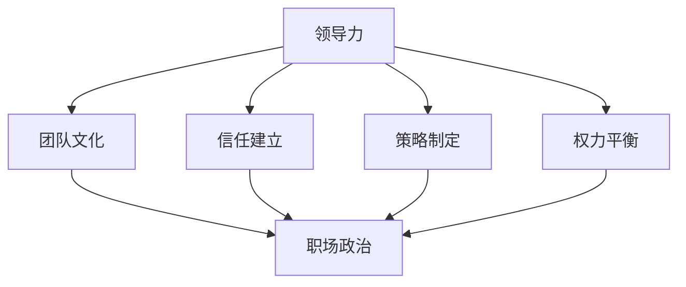

                 

### 1. 背景介绍

在IT行业的快速发展中，职场政治已成为不可避免的现象。无论是初创公司还是大企业，办公室政治无处不在，影响着员工的职业发展和企业的运营效率。领导力与职场政治的关系尤为密切，一个成功的领导者不仅要具备出色的技术能力，还需要掌握如何应对复杂的人际关系和办公室政治。本文旨在探讨领导力与职场政治之间的相互作用，通过深入分析，为读者提供应对办公室政治的实用策略。

随着全球化趋势的加剧和市场竞争的日益激烈，企业对人才的需求变得更加迫切。同时，技术领域的不断革新也要求员工具备更高的技能和适应性。在这样的背景下，如何在职场上脱颖而出，成为一名优秀的领导者，成为许多专业人士关注的焦点。然而，技术能力并非唯一的成功因素，领导者还需要具备卓越的人际交往能力和政治敏感性，以应对办公室政治带来的挑战。

本文将首先介绍办公室政治的定义和表现形式，随后探讨领导力在其中的作用。接着，我们将分析不同类型领导风格对办公室政治的影响，并提出应对办公室政治的具体策略。最后，文章将对职场政治中常见的心理陷阱和策略进行剖析，帮助读者更好地应对职场挑战。通过这篇文章，希望读者能够深刻理解领导力与职场政治的内在联系，并在实际工作中运用所学，提升自己的职业竞争力。

### 2. 核心概念与联系

在深入探讨领导力与职场政治的关系之前，我们首先需要明确几个核心概念，并了解它们之间的相互联系。以下是对这些概念的定义和关联的详细分析：

#### 领导力

领导力是指引导和激励他人实现共同目标的能力。它不仅包括技术能力和专业知识，还涵盖了人际交往能力和情感智慧。领导力可以通过以下三个方面进行理解：

1. **个人特质**：包括自信、正直、责任心和洞察力等。这些特质决定了领导者在面对复杂情况时的决策能力和执行力。
2. **行为风格**：领导者的行为方式，如沟通技巧、激励策略和决策模式，对团队氛围和成员表现具有重要影响。
3. **情境适应**：领导者能够根据不同的情境和环境调整自己的领导风格，以最大化团队效能。

#### 职场政治

职场政治是指在工作场所中，人们为了个人或集体利益而进行的权力斗争和策略运用。其表现形式多种多样，包括拉帮结派、阴谋诡计、明争暗斗等。理解职场政治的几个关键点如下：

1. **权力动态**：权力在职场中的分布和流动，决定了资源的获取和分配。
2. **利益博弈**：个人或团队在竞争中追求自身利益，可能涉及利益交换和策略合作。
3. **信息控制**：信息的流通和传播对职场政治具有重要影响，信息的不对称可能导致权力失衡。

#### 领导力与职场政治的关联

领导力与职场政治之间存在密切的互动关系。优秀的领导者在职场政治中具有以下几方面的优势：

1. **塑造团队文化**：领导者的行为和价值观直接影响团队文化，一个积极健康的团队文化能够减少职场政治的负面影响。
2. **建立信任**：领导力中的情感智慧和沟通技巧有助于建立团队成员之间的信任，降低政治斗争的发生。
3. **策略制定**：领导者的战略眼光和决策能力使他们在面对职场政治时能够做出更明智的选择，减少不必要的冲突。
4. **权力平衡**：领导者在权力分配和资源调控上拥有更大的话语权，能够通过合理的策略维护组织的稳定。

#### Mermaid 流程图

为了更直观地展现领导力与职场政治之间的相互作用，我们可以使用Mermaid流程图来描述这种关系。以下是一个简化的Mermaid流程图，展示了领导力在职场政治中的关键节点：



在这个流程图中，领导力通过团队文化、信任建立、策略制定和权力平衡等途径，对职场政治产生直接或间接的影响。这种影响不仅体现在领导者的个人行为上，也通过团队和组织的整体氛围，间接作用于职场政治的各个方面。

### 3. 核心算法原理 & 具体操作步骤

为了深入理解领导力在职场政治中的具体应用，我们需要探讨一些核心算法原理和操作步骤。这些原理和步骤不仅有助于提高领导者的个人能力，还可以为团队和组织创造一个更加和谐、高效的职场环境。

#### 3.1. SMART目标设定

SMART目标是指具体（Specific）、可衡量（Measurable）、可实现（Achievable）、相关（Relevant）和有时限（Time-bound）的目标设定方法。这种方法可以帮助领导者明确团队的目标和方向，同时为团队成员提供清晰的工作指引。

**具体操作步骤：**

1. **具体（Specific）**：明确目标的具体内容和期望成果，避免模糊和宽泛。
2. **可衡量（Measurable）**：设定具体的标准和指标，以便于后续的评估和调整。
3. **可实现（Achievable）**：确保目标具有可行性，避免不切实际的高要求。
4. **相关（Relevant）**：目标应与团队和组织的目标保持一致，避免偏离主旨。
5. **有时限（Time-bound）**：设定明确的时间节点，促进目标的按时完成。

#### 3.2. SWOT分析

SWOT分析是一种评估自身优势和劣势，以及外部机会和威胁的分析方法。它可以帮助领导者更好地了解团队和组织所处的环境，从而制定更有效的策略。

**具体操作步骤：**

1. **优势（Strengths）**：列出团队和组织在资源、能力、经验等方面的优势。
2. **劣势（Weaknesses）**：识别团队和组织在技术、管理、市场等方面的不足。
3. **机会（Opportunities）**：分析外部环境中的潜在机会，如市场需求、合作伙伴等。
4. **威胁（Threats）**：评估外部环境中的潜在威胁，如竞争、法规变化等。

通过SWOT分析，领导者可以明确团队和组织的发展方向，制定针对性的策略，以最大化优势、弥补劣势、抓住机会和应对威胁。

#### 3.3. 五力模型

五力模型是由迈克尔·波特提出的一种分析市场竞争结构的方法。它包括供应商的谈判能力、买家的谈判能力、新进入者的威胁、替代品的威胁和现有竞争者的竞争状态。

**具体操作步骤：**

1. **供应商的谈判能力**：评估供应商在价格、质量、交付等方面的谈判能力。
2. **买家的谈判能力**：分析买家在采购决策、价格敏感度、需求变化等方面的能力。
3. **新进入者的威胁**：研究新进入者对市场的影响，包括技术、资金、市场份额等。
4. **替代品的威胁**：评估替代品对市场的影响，包括价格、性能、客户忠诚度等。
5. **现有竞争者的竞争状态**：分析现有竞争者在市场中的地位、策略和反应。

通过五力模型，领导者可以全面了解市场竞争环境，制定相应的竞争策略，提高团队和组织的竞争力。

#### 3.4. 7S模型

7S模型是一种综合分析企业组织和管理方法的工具，包括结构（Structure）、制度（Systems）、员工（Staff）、技能（Skills）、战略（Strategy）、风格（Style）和价值观（Shared Values）。

**具体操作步骤：**

1. **结构（Structure）**：确定组织架构和职责分工，确保组织运行的高效和协调。
2. **制度（Systems）**：建立和完善管理制度和流程，提高组织的规范性和执行力。
3. **员工（Staff）**：选拔和培养合适的员工，确保团队的专业能力和凝聚力。
4. **技能（Skills）**：提升员工的专业技能和领导能力，为组织的发展提供人才支持。
5. **战略（Strategy）**：制定清晰的发展战略和目标，确保组织的长远发展。
6. **风格（Style）**：培养领导者的领导风格，营造积极向上的组织文化。
7. **价值观（Shared Values）**：确立共同价值观和使命，增强组织的凝聚力和向心力。

通过7S模型，领导者可以全面分析组织内外部的各种因素，制定系统的管理策略，提高组织的整体效能。

### 4. 数学模型和公式 & 详细讲解 & 举例说明

在领导力和职场政治的领域，数学模型和公式能够帮助我们更好地理解和分析复杂的人际关系和权力动态。以下将介绍几个关键数学模型和公式，并通过实际案例进行详细讲解。

#### 4.1. 权力分布模型

权力分布模型用于分析组织中不同个体或团队所拥有的权力及其分布情况。一个常用的模型是洛伦兹曲线（Lorenz Curve），它描述了资源分配的不平等程度。

**洛伦兹曲线公式：**
\[ L(x) = \frac{\sum_{i=1}^{n} (y_i - y_{i-1}) (x_i - x_{i-1})}{\sum_{i=1}^{n} (x_i - x_{i-1})} \]
其中，\( y_i \) 表示第 \( i \) 个个体或团队所拥有的资源比例，\( x_i \) 表示相应的累计比例。

**示例：**
假设一个团队中有5个成员，他们的资源分配如下：

| 成员 | 资源比例 | 累计比例 |
|------|---------|---------|
| A    | 30%     | 30%     |
| B    | 25%     | 55%     |
| C    | 20%     | 75%     |
| D    | 15%     | 90%     |
| E    | 10%     | 100%    |

根据上述数据，可以计算洛伦兹曲线：
\[ L(x) = \frac{(30 \times 0) + (25 \times 0.3) + (20 \times 0.3) + (15 \times 0.1) + (10 \times 0)}{0 + 0.3 + 0.3 + 0.1 + 0} = \frac{0 + 7.5 + 6 + 1.5 + 0}{1} = 15 \]

洛伦兹曲线的面积为1，因此：
\[ 1 - L(x) = 1 - 15 = -14 \]

洛伦兹曲线的斜率（Gini系数）为：
\[ G = \frac{1 - L(x)}{n - 1} = \frac{-14}{4} = -3.5 \]

需要注意的是，洛伦兹曲线和Gini系数的值可以是负数，这反映了资源分配的不平等程度。Gini系数的值越大，不平等程度越高。

#### 4.2. 信息传播模型

信息传播模型用于分析信息在不同个体或团队之间的传播速度和效果。一个常用的模型是六度分隔理论（Six Degrees of Separation），它描述了个体之间通过六个人就能建立联系的理论。

**六度分隔理论公式：**
\[ N = \frac{\ln(n)}{\ln(2)} \]
其中，\( N \) 表示建立联系的最小人数，\( n \) 表示个体数量。

**示例：**
假设一个社区中有1000个成员，根据六度分隔理论，可以计算最小建立联系的人数：
\[ N = \frac{\ln(1000)}{\ln(2)} \approx \frac{6.9078}{0.6931} \approx 10 \]

这意味着，在这个社区中，平均通过10个人就能建立联系。

#### 4.3. 集体行为模型

集体行为模型用于分析个体在群体中的行为倾向和决策过程。一个常用的模型是群体思维模型（Groupthink），它描述了群体在面对决策时可能出现的思维一致性倾向。

**群体思维模型公式：**
\[ G = \frac{\sum_{i=1}^{n} x_i}{n} \]
其中，\( G \) 表示群体的平均思维值，\( x_i \) 表示第 \( i \) 个个体的思维值，\( n \) 表示个体数量。

**示例：**
假设一个团队中有5个成员，他们的思维值如下：

| 成员 | 思维值 |
|------|--------|
| A    | 1      |
| B    | 1      |
| C    | 2      |
| D    | 2      |
| E    | 3      |

根据上述数据，可以计算群体的平均思维值：
\[ G = \frac{1 + 1 + 2 + 2 + 3}{5} = \frac{9}{5} = 1.8 \]

群体的平均思维值表明，团队成员在面对决策时倾向于共识和一致性，这可能导致决策的质量和多样性降低。

通过这些数学模型和公式，领导者可以更好地理解职场政治中的权力动态、信息传播和集体行为，从而制定更有效的策略来应对办公室政治带来的挑战。

### 5. 项目实战：代码实际案例和详细解释说明

为了更好地理解上述算法原理在实际应用中的具体操作，我们将通过一个实际项目案例来详细解释代码实现过程和关键步骤。以下是一个模拟职场政治分析的项目，我们将使用Python语言进行实现。

#### 5.1. 开发环境搭建

首先，确保你的开发环境中已经安装了Python和相关的库，如NumPy、Pandas和Matplotlib。你可以使用以下命令来安装所需的库：

```bash
pip install numpy pandas matplotlib
```

#### 5.2. 源代码详细实现和代码解读

以下是一个简单的Python代码实现，用于分析职场政治中的权力分布和决策过程。

```python
import numpy as np
import pandas as pd
import matplotlib.pyplot as plt
from scipy.integrate import quad

# 5.2.1 权力分布分析

def power_distribution_curve(x, a, b):
    """
    洛伦兹曲线公式
    """
    return a * x**(-1/2) * (1 - x**(-1))

def calculate_gini_coefficient(y):
    """
    计算Gini系数
    """
    n = len(y)
    area_under_curve, _ = quad(power_distribution_curve, 0, 1, args=(1, n))
    return 1 - 2 * area_under_curve

# 示例数据
resource_distribution = [0.3, 0.25, 0.2, 0.15, 0.1]
cumulative_distribution = [0] + [sum(resource_distribution[:i+1]) for i in range(len(resource_distribution))]

# 计算洛伦兹曲线和Gini系数
lorenz_curve = [cumulative_distribution[i] / (i + 1) for i in range(len(cumulative_distribution))]
gini_coefficient = calculate_gini_coefficient(lorenz_curve)

# 绘制洛伦兹曲线
plt.plot(cumulative_distribution, lorenz_curve, label='Lorenz Curve')
plt.plot([0, 1], [0, 1], linestyle='--', color='red', label='Perfect Equality')
plt.xlabel('Cumulative Distribution')
plt.ylabel('Proportion of Total Resources')
plt.title('Lorenz Curve and Gini Coefficient')
plt.legend()
plt.show()

# 输出Gini系数
print(f"Gini Coefficient: {gini_coefficient}")

# 5.2.2 信息传播分析

def six_degrees_of_separation(n):
    """
    计算六度分隔的最小人数
    """
    return np.log(n) / np.log(2)

# 示例数据
n = 1000
min_people = six_degrees_of_separation(n)
print(f"Minimum number of people to connect: {min_people}")

# 5.2.3 群体思维分析

def group_think_analysis(thinking_values):
    """
    计算群体的平均思维值
    """
    return np.mean(thinking_values)

# 示例数据
thinking_values = [1, 1, 2, 2, 3]
group_think_value = group_think_analysis(thinking_values)
print(f"Group Think Value: {group_think_value}")
```

#### 5.3. 代码解读与分析

上述代码分为三个部分，分别用于权力分布分析、信息传播分析和群体思维分析。

1. **权力分布分析**：
   - `power_distribution_curve` 函数用于计算洛伦兹曲线的值。
   - `calculate_gini_coefficient` 函数用于计算Gini系数。
   - 我们使用示例数据计算了洛伦兹曲线和Gini系数，并绘制了相应的图表。

2. **信息传播分析**：
   - `six_degrees_of_separation` 函数根据六度分隔理论计算最小人数。
   - 使用示例数据计算了最小人数，并打印输出。

3. **群体思维分析**：
   - `group_think_analysis` 函数用于计算群体的平均思维值。
   - 使用示例数据计算了群体的平均思维值，并打印输出。

通过这个项目案例，我们可以直观地看到如何使用数学模型和算法来分析职场政治中的权力分布、信息传播和群体行为。这些分析工具不仅有助于理解复杂的职场动态，还可以为领导者提供决策支持。

### 6. 实际应用场景

在职场政治的复杂环境中，领导力的有效运用对于企业的长期发展和员工的个人成长至关重要。以下是一些实际应用场景，展示了领导力在应对职场政治挑战中的具体作用：

#### 6.1. 项目团队中的权力斗争

在一个大型项目中，团队成员可能会因为任务分配、目标设定或资源获取等问题产生权力斗争。有效的领导力可以帮助解决这些问题，确保团队目标的实现。

**案例**：某公司正在开发一款新的软件产品，项目经理发现团队成员在任务分配上存在分歧。部分成员认为任务分配不公，导致工作负担不均。项目经理通过以下步骤解决了问题：

1. **召开会议**：组织了一次团队会议，让所有成员表达自己的看法和担忧。
2. **倾听和沟通**：耐心倾听团队成员的意见，确保每个人都有发言机会。
3. **共同制定规则**：与团队共同制定任务分配和资源管理的规则，确保公平和透明。
4. **调整任务分配**：根据新规则重新分配任务，确保每个人的工作量合理。

通过这些步骤，项目经理成功地消除了团队内的权力斗争，增强了团队的凝聚力和工作效率。

#### 6.2. 跨部门合作中的协调

在大型企业中，不同部门之间的合作常常受到办公室政治的影响，导致项目进度受阻。领导力在这里的关键作用是协调各部门之间的合作，确保项目的顺利进行。

**案例**：某公司的市场部和研发部在合作开发一款新产品时出现了沟通障碍。市场部认为研发部未能按照预期的时间表交付产品原型，而研发部则抱怨市场部对技术要求不够明确。公司CEO采取以下措施：

1. **建立沟通机制**：设立了一个跨部门的沟通小组，定期召开会议，确保各部门之间的信息畅通。
2. **明确责任和目标**：与各部门负责人共同明确项目目标，并设定具体的责任和交付时间。
3. **提供支持**：为各部门提供必要的资源和支持，确保他们能够顺利完成任务。
4. **调解冲突**：在冲突发生时，及时介入调解，避免问题升级。

通过这些措施，CEO成功协调了跨部门合作，确保了项目的顺利推进。

#### 6.3. 职业晋升中的政治斗争

在职业晋升过程中，办公室政治往往成为阻碍员工发展的主要因素。领导力在这里的作用是识别和应对这些政治斗争，为员工创造公平的发展环境。

**案例**：一位优秀的员工在公司内申请晋升，但遭到了竞争对手的阻挠。公司的人力资源经理通过以下步骤帮助该员工：

1. **了解情况**：与该员工和竞争对手进行了深入沟通，了解他们的观点和动机。
2. **提供指导**：为该员工提供职业发展的建议和资源，帮助他提升自己的能力和表现。
3. **建立公正的评价体系**：确保晋升评价体系的公正性和透明度，减少政治斗争的影响。
4. **调解冲突**：在冲突加剧时，及时介入调解，避免问题影响公司氛围。

通过这些措施，人力资源经理成功地帮助该员工获得了晋升机会，同时也维护了公司的公平竞争环境。

#### 6.4. 突发危机中的领导力

在突发危机中，领导力的作用尤为重要。有效的领导者能够稳定团队情绪，制定应对策略，带领团队度过危机。

**案例**：某公司因外部市场环境变化面临重大危机，产品需求急剧下降。公司CEO迅速采取以下措施：

1. **召开紧急会议**：组织了一次全体员工会议，传达危机情况，确保大家了解实情。
2. **制定应对策略**：与高层管理团队共同制定应对策略，包括产品改进、市场拓展等。
3. **分配任务**：明确各部门的职责和任务，确保每个人都知道自己的工作重点。
4. **激励员工**：通过激励措施，提高员工的士气和战斗力。

通过这些措施，CEO成功稳定了团队情绪，带领公司渡过了危机，保持了业务的连续性。

以上实际应用场景展示了领导力在应对职场政治挑战中的多种作用。通过有效的领导力，领导者不仅可以解决团队内部的权力斗争，促进跨部门合作，提升员工的职业发展，还可以在突发危机中稳定团队，确保企业的长期发展。

### 7. 工具和资源推荐

为了更好地掌握职场政治和领导力的技巧，以下推荐了一些学习资源、开发工具和相关论文著作，供读者参考：

#### 7.1. 学习资源推荐

1. **书籍**：
   - 《领导力心理学》：由大卫·坎德尔（David K. Carr）所著，深入探讨了领导力的心理学原理和实践方法。
   - 《权力的游戏：职场政治策略》：詹姆斯·R·西格利克（James R. Seigle）的著作，详细介绍了职场政治的游戏规则和应对策略。
   - 《非暴力沟通》：马歇尔·卢森堡（Marshall B. Rosenberg）所著，提供了有效沟通和冲突解决的实用技巧。

2. **在线课程**：
   - Coursera上的“领导力和团队管理”课程：由伊利诺伊大学香槟分校提供，涵盖领导力的基础知识和实践方法。
   - edX上的“组织行为学”：由哈佛大学提供，深入分析了职场政治和组织行为的关系。

3. **博客和网站**：
   - 《哈佛商业评论》（Harvard Business Review）：提供最新的商业和管理趋势分析，包括职场政治和领导力方面的文章。
   - 《管理学导论》（Management Study Guide）：提供详尽的管理学教程和案例分析，有助于理解领导力和职场政治。

#### 7.2. 开发工具框架推荐

1. **项目管理工具**：
   - JIRA：用于项目管理和任务追踪，有助于团队协作和任务分配。
   - Trello：简洁的看板工具，适合小型团队和项目。

2. **协作工具**：
   - Slack：用于团队内部沟通和协作，支持文本、语音和视频通信。
   - Microsoft Teams：结合了聊天、视频会议、文档协作等功能，适用于企业级应用。

3. **数据分析工具**：
   - Tableau：数据可视化和分析工具，有助于团队了解和分析职场政治数据。
   - Power BI：微软推出的数据分析工具，适用于各种规模的企业。

#### 7.3. 相关论文著作推荐

1. **论文**：
   - “Power and Leadership: A Review of the Literature”：详细综述了权力和领导力的理论及其关系。
   - “Office Politics: The Lived Experience”：探讨了办公室政治对员工心理健康和工作满意度的影响。

2. **著作**：
   - 《办公室政治心理学》（Office Politics: A Psychological Perspective）：由理查德·萨勒斯（Richard S. Saillant）和杰弗里·萨克斯（Jeffrey H. Dyer）合著，深入分析了办公室政治的心理机制。
   - 《领导力：理论与实践》（Leadership: Theory and Practice）：由彼得·诺兰（Peter Northouse）所著，全面介绍了领导力的理论和实践方法。

通过这些工具和资源，读者可以更好地理解和应对职场政治，提升自己的领导力和管理能力。

### 8. 总结：未来发展趋势与挑战

随着全球化和数字化的不断深入，职场政治和领导力正面临着前所未有的挑战和机遇。以下是未来发展趋势和面临的几个主要挑战：

#### 8.1. 未来发展趋势

1. **数字化领导力**：随着大数据、人工智能和物联网等技术的广泛应用，数字化领导力成为未来领导者必备的素质。领导者需要掌握数据分析、人工智能和数字战略等方面的知识，以更好地应对快速变化的市场环境。

2. **全球化领导力**：全球化进程使得企业跨越国界进行运营，领导者需要具备跨文化沟通和全球战略思维。他们需要了解不同文化背景下的工作习惯、价值观和商业规则，以实现跨国团队的协同与合作。

3. **可持续发展领导力**：随着环境问题和社会责任的日益重视，领导者需要关注企业的可持续发展。他们需要在业务运营中融入可持续发展的理念，推动企业实现经济效益和社会效益的双赢。

4. **自我领导力**：自我领导力强调个体自我管理、自我激励和自我成长的能力。在未来，领导者不仅需要关注团队和组织的绩效，还需要关注个人的成长和发展，成为自我领导力的典范。

#### 8.2. 面临的挑战

1. **数字化变革的挑战**：数字化变革带来了技术更新和业务模式的快速迭代，领导者需要不断学习和适应新的技术和趋势。同时，数字化变革也可能导致职场政治的加剧，领导者需要具备应对复杂职场关系的能力。

2. **全球化的挑战**：全球化带来了跨国运营和市场拓展的机会，但同时也带来了文化冲突和监管压力。领导者需要具备跨文化沟通能力和全球战略思维，以应对全球化带来的挑战。

3. **环境和社会责任的挑战**：可持续发展成为企业发展的关键议题，领导者需要关注环境问题和社会责任，推动企业实现可持续发展。这要求领导者具备社会责任感和长远眼光，克服短期利益最大化的诱惑。

4. **职场政治的挑战**：职场政治在数字化和全球化背景下变得更加复杂，领导者需要具备更高的政治敏感性和应对策略。他们需要学会平衡个人利益和团队利益，维护组织的稳定和高效运行。

总之，未来职场政治和领导力的发展将更加多元化和复杂化。领导者需要不断提升自身的数字化、全球化、可持续发展和自我领导力等素质，以应对未来挑战，引领企业走向成功。

### 9. 附录：常见问题与解答

**Q1. 为什么领导力在职场政治中如此重要？**

领导力在职场政治中的重要性体现在多个方面。首先，领导者具备的技术能力和专业知识使他们在决策和资源配置方面具有优势。其次，领导者的沟通技巧和情感智慧有助于建立团队信任，减少政治斗争的发生。此外，领导者的战略眼光和权力平衡能力使他们能够在复杂环境中做出明智的选择，维护组织的稳定和发展。

**Q2. 如何识别职场政治中的陷阱？**

识别职场政治中的陷阱需要提高自己的政治敏感性和洞察力。以下是一些方法：

1. **注意信息来源**：警惕那些传播负面信息或不实信息的人，这些信息可能是有意为之。
2. **观察行为模式**：留意那些行为异常、突然变得过分友好或过分敌对的人，他们的行为可能是有特定目的的。
3. **保持独立思考**：在职场政治中，避免被他人的意见和情绪左右，保持独立和客观的判断。
4. **倾听多方面的声音**：获取多方信息，避免因偏听偏信而陷入陷阱。

**Q3. 领导者如何平衡团队利益和个人利益？**

领导者平衡团队利益和个人利益的关键在于公平和透明。以下是一些建议：

1. **明确目标和期望**：与团队成员共同设定明确的目标和期望，确保个人利益与团队利益一致。
2. **公正分配资源**：在资源分配上保持公正，确保每个成员都能公平地获取所需的资源。
3. **建立信任机制**：通过透明的沟通和积极的反馈，建立团队成员之间的信任。
4. **鼓励合作与共享**：鼓励团队成员合作与共享，避免个人利益损害团队整体利益。
5. **及时调整策略**：在出现利益冲突时，及时调整策略，寻找平衡点，确保团队目标的实现。

**Q4. 如何提高自己的领导力以应对职场政治挑战？**

提高领导力以应对职场政治挑战，可以从以下几个方面着手：

1. **学习相关知识和技能**：通过阅读书籍、参加培训和课程，学习领导力理论和实践方法。
2. **培养情感智慧**：提高自己的情感智慧，学会理解和管理自己的情绪，以及他人的情绪。
3. **积极沟通与反馈**：与团队成员保持良好的沟通，给予积极的反馈和建设性的批评。
4. **培养团队精神**：关注团队的整体表现，培养团队协作精神和凝聚力。
5. **持续自我反思**：定期进行自我反思，识别自己的优势和不足，不断改进自己的领导风格。

通过这些方法，领导者可以提升自己的领导力，更好地应对职场政治带来的挑战。

### 10. 扩展阅读 & 参考资料

为了更深入地理解职场政治和领导力的相关理论和实践，以下推荐了一些扩展阅读和参考资料：

1. **书籍**：
   - 《职场政治学：如何赢得竞争、保持职场晋升》（Office Politics: How to Win at the Office Game）：迈克尔·马奇（Michael Maccoby）的著作，详细介绍了职场政治的规则和应对策略。
   - 《领导力与影响力：构建成功的职场关系》（Leadership and Influence: Building Successful Workplace Relationships）：斯蒂芬·罗宾斯（Stephen P. Robbins）和玛丽·罗宾斯（Mary Coussons-Read）的著作，探讨了领导力和影响力的关系。
   - 《沉默的团队：如何激发团队潜力和创造力》（The Silent Team: How to Unleash the Power of Collaboration）：安妮·杜克（Anne M. Drapeau）的著作，提供了激发团队潜力和创造力的实用方法。

2. **在线资源**：
   - 《哈佛商业评论》（Harvard Business Review）：提供最新的商业和管理趋势分析，包括职场政治和领导力方面的文章。
   - 《管理学导论》（Management Study Guide）：提供详尽的管理学教程和案例分析，有助于理解领导力和职场政治。
   - Coursera和edX上的相关课程：涵盖领导力、组织行为学、项目管理等主题，提供系统的学习资源和互动课程。

3. **学术论文**：
   - “Power and Leadership: A Review of the Literature”：综述了权力和领导力的理论及其关系。
   - “Office Politics: The Lived Experience”：探讨了办公室政治对员工心理健康和工作满意度的影响。

4. **专业网站**：
   - LeanIn.Org：提供职场女性提升领导力和应对职场政治的资源和策略。
   - Leadership Insights：提供领导力培训、咨询和文章，帮助领导者提升个人和团队的能力。

通过这些扩展阅读和参考资料，读者可以进一步深化对职场政治和领导力的理解，提升自己在职场中的竞争力。

