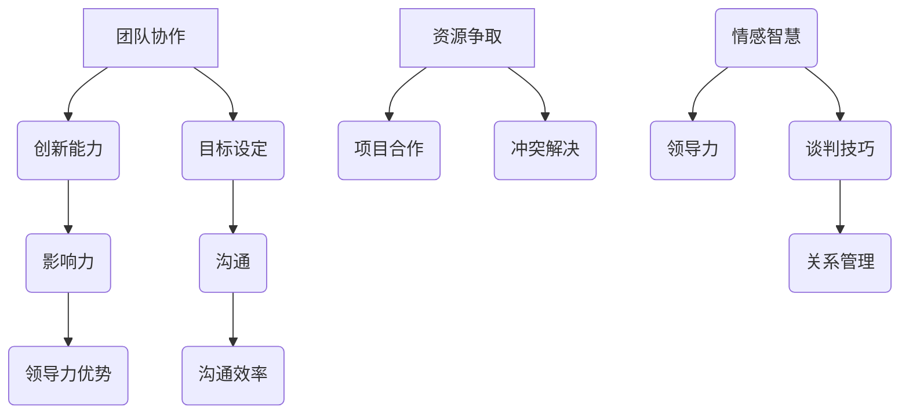

                 

### 背景介绍 Background Introduction

领导力与谈判技巧在现代社会中扮演着至关重要的角色，特别是在IT行业这样的高度竞争环境中。IT行业以其快速的发展速度和不断变化的技术需求而闻名，使得领导者和谈判者需要具备独特的技能来引导团队、应对挑战以及争取资源。然而，很多专业人士往往忽略了这些软技能的重要性，将其视为次要的或非技术性的。

事实上，领导力和谈判技巧对于IT项目的成功至关重要。领导力不仅关乎个人能力的展现，还关乎如何激励和协调团队成员，以实现共同目标。有效的领导力能够增强团队的凝聚力，提高工作效率，降低员工流失率。而谈判技巧则是在资源分配、项目合作以及冲突解决等方面不可或缺的工具。通过谈判，IT专业人士可以更有效地争取所需资源，协调项目进度，甚至在关键时刻挽救项目。

本文将探讨领导力和谈判技巧在IT领域的应用，通过逐步分析其核心概念、算法原理、数学模型和实际案例，帮助读者深入了解并掌握这些关键技能。我们将从以下几个方面展开讨论：

1. **核心概念与联系**：介绍领导力和谈判技巧的基本概念，并分析它们在IT行业中的应用。
2. **核心算法原理 & 具体操作步骤**：阐述如何在实际工作中运用领导力和谈判技巧。
3. **数学模型和公式 & 详细讲解 & 举例说明**：通过数学模型和实际案例，解释这些技巧如何发挥作用。
4. **项目实战：代码实际案例和详细解释说明**：通过具体的代码实现，展示领导力和谈判技巧的应用。
5. **实际应用场景**：探讨领导力和谈判技巧在IT行业的实际应用场景。
6. **工具和资源推荐**：推荐学习资源和开发工具，以帮助读者进一步探索和提升这些技能。
7. **总结：未来发展趋势与挑战**：总结文章的主要观点，并讨论未来的发展趋势和挑战。

通过这篇文章，我们希望读者能够认识到领导力和谈判技巧的重要性，并在实际工作中更好地运用这些技能，从而提高个人和团队的表现。现在，让我们开始深入探讨这些关键技能的各个方面。

> Keywords: Leadership, Negotiation Skills, IT Industry, Team Management, Project Success

> Abstract: This article explores the importance of leadership and negotiation skills in the IT industry. It introduces core concepts, algorithms, mathematical models, and practical case studies to help professionals understand and apply these critical skills effectively. By discussing applications, tools, and future trends, the article aims to enhance readers' abilities to lead and negotiate in the fast-paced world of IT.

## 1. 核心概念与联系 Core Concepts and Connections

### 领导力 Leadership

领导力是一种能够激励、指导和管理团队实现共同目标的能力。在IT行业，领导力不仅涉及技术层面的管理，还涵盖人际关系的处理和团队协作的推动。以下是领导力在IT领域的几个关键方面：

1. **团队协作**：有效的领导力能够促进团队成员之间的沟通与合作，减少冲突，提高工作效率。
2. **创新能力**：领导者在鼓励创新和提出新思路方面发挥着关键作用，从而推动技术的进步和业务的发展。
3. **目标设定**：领导力帮助团队设定清晰的愿景和目标，并通过合理规划确保实现这些目标。

### 谈判技巧 Negotiation Skills

谈判技巧是指通过沟通和协商解决冲突、达成共识的过程。在IT行业，谈判技巧在以下几个方面尤为重要：

1. **资源争取**：通过谈判，IT专业人士可以有效地获取项目所需的资源，如人力、资金和设备。
2. **项目合作**：在跨部门或跨公司合作中，谈判技巧有助于协调各方利益，确保项目顺利进行。
3. **冲突解决**：谈判技巧可以用于解决项目中的分歧和冲突，从而维持团队的和谐与稳定。

### 领导力与谈判技巧的联系

领导力和谈判技巧并不是孤立的，而是相互关联和互补的。以下是两者之间的几个关键联系：

1. **影响力**：领导力通过树立个人威信和影响力，有助于在谈判过程中获得优势。
2. **沟通**：有效的领导力要求具备出色的沟通技巧，这同样适用于谈判中的信息传递和沟通协商。
3. **情感智慧**：领导力和谈判技巧都需要较高的情感智慧，即理解和管理自己和他人的情绪，以便更好地处理人际关系和冲突。

### Mermaid 流程图

以下是一个Mermaid流程图，展示了领导力和谈判技巧在IT行业的应用场景：



通过这个流程图，我们可以看到领导力和谈判技巧在IT行业中如何相互关联，共同促进项目的成功。

接下来，我们将深入探讨领导力的核心算法原理和具体操作步骤，以及如何在实际工作中运用这些技巧。

## 2. 核心算法原理 & 具体操作步骤 Core Algorithm Principles & Step-by-Step Procedures

### 领导力的核心算法原理

领导力的核心在于激励和协调团队成员，以实现共同目标。以下是几个关键算法原理：

1. **目标导向**：领导力首先需要设定清晰的目标和愿景，这可以通过以下步骤实现：
    - 明确项目目标：确保团队成员了解项目的最终目标。
    - 制定里程碑：将目标分解为可实现的里程碑，以便跟踪进度。

2. **激励机制**：激励是保持团队动力和效率的关键。以下步骤可以帮助建立有效的激励机制：
    - 设定奖励：为达到特定目标或完成特定任务设定奖励。
    - 及时反馈：定期对团队成员的工作进行评估，并提供积极的反馈。

3. **沟通协调**：有效的沟通是领导力的核心。以下步骤可以帮助建立良好的沟通机制：
    - 开放式沟通：鼓励团队成员表达意见和想法。
    - 定期会议：安排定期会议，以讨论项目进展和解决问题。

4. **情感智慧**：领导力需要较高的情感智慧，以下步骤可以帮助提高情感智慧：
    - 理解团队成员：关注团队成员的情感和需求。
    - 管理冲突：通过有效的沟通和协商解决团队内部的冲突。

### 谈判技巧的具体操作步骤

谈判技巧的核心在于通过沟通和协商解决冲突，达成共识。以下是几个关键步骤：

1. **准备阶段**：在谈判之前，需要充分准备，以下步骤可以帮助做好准备：
    - 明确目标：明确自己的谈判目标，并准备可能接受的妥协方案。
    - 了解对方：了解对方的需求和利益，以便找到共同点。

2. **开局阶段**：在谈判开始时，以下步骤可以帮助建立良好的开局：
    - 打破冰：通过轻松的谈话建立友好关系。
    - 明确目标：向对方明确表达自己的目标，并了解对方的立场。

3. **协商阶段**：在协商过程中，以下步骤可以帮助达成共识：
    - 提出方案：提出具体的解决方案，并考虑对方的利益。
    - 调整立场：根据对方的反馈调整自己的立场，寻找共同点。

4. **达成协议**：在达成协议时，以下步骤可以帮助确保协议的有效性：
    - 明确条款：将协议内容明确化，并确保双方都理解。
    - 签订协议：正式签署协议，确保协议的执行。

### 实际操作示例

以下是一个简单的实际操作示例，展示了如何运用领导力和谈判技巧解决项目中的问题：

1. **目标导向**：
    - 明确项目目标：开发一款高性能的云计算平台。
    - 制定里程碑：每周发布一个新功能，每月进行一次全面测试。

2. **激励机制**：
    - 设定奖励：对于按时完成任务的小组，提供奖金。
    - 及时反馈：每周进行一次团队会议，讨论项目进展和问题。

3. **沟通协调**：
    - 开放式沟通：鼓励团队成员提出意见和建议。
    - 定期会议：每周安排一次团队会议，讨论项目进展和解决问题。

4. **情感智慧**：
    - 理解团队成员：关注团队成员的情感和需求。
    - 管理冲突：通过沟通和协商解决团队内部的冲突。

5. **谈判技巧**：
    - 准备阶段：了解对方的需求和利益。
    - 开局阶段：通过轻松的谈话建立友好关系。
    - 协商阶段：提出具体的解决方案，并考虑对方的利益。
    - 达成协议：明确协议内容，并确保双方都理解。

通过这个示例，我们可以看到领导力和谈判技巧在实际项目中的具体应用。接下来，我们将进一步探讨数学模型和公式，以更深入地理解这些技巧的工作原理。

## 3. 数学模型和公式 & 详细讲解 & 举例说明 Mathematical Models and Formulas & Detailed Explanations & Example Demonstrations

在领导力和谈判技巧中，数学模型和公式可以提供量化的方法来评估和优化决策过程。以下是几个关键的数学模型和公式，以及它们的详细讲解和实际应用示例。

### 领导力评估模型

领导力评估模型可以帮助衡量一个领导者对团队的激励和指导效果。以下是一个简单的领导力评估模型：

$$
L = \alpha \cdot C + \beta \cdot E + \gamma \cdot I
$$

其中，$L$ 表示领导力得分，$\alpha$、$\beta$ 和 $\gamma$ 分别是沟通能力、激励能力和情感智慧的权重，$C$、$E$ 和 $I$ 分别代表沟通能力、激励能力和情感智慧的得分。

- **沟通能力（C）**：衡量领导者传递信息、听取反馈和协调团队的能力。可以通过团队成员的满意度调查来量化。
- **激励能力（E）**：衡量领导者激发团队动力和保持团队士气的能力。可以通过员工的工作满意度和工作绩效来量化。
- **情感智慧（I）**：衡量领导者理解和管理自己及他人情绪的能力。可以通过领导者与团队成员的情感互动来量化。

### 谈判影响力模型

谈判影响力模型可以帮助衡量谈判者对谈判结果的影响。以下是一个简单的谈判影响力模型：

$$
I = \alpha \cdot P + \beta \cdot C + \gamma \cdot N
$$

其中，$I$ 表示影响力得分，$\alpha$、$\beta$ 和 $\gamma$ 分别是说服力、沟通能力和谈判策略的权重，$P$、$C$ 和 $N$ 分别代表说服力、沟通能力和谈判策略的得分。

- **说服力（P）**：衡量谈判者说服对方接受其提议的能力。可以通过谈判结果的达成度来量化。
- **沟通能力（C）**：衡量谈判者传递信息、听取反馈和协调各方的能力。可以通过谈判过程中的沟通效率来量化。
- **谈判策略（N）**：衡量谈判者选择和调整策略的能力。可以通过谈判过程中策略的有效性来量化。

### 实际应用示例

#### 领导力评估模型应用

假设一个团队中有5个成员，通过满意度调查，每个成员对领导者的沟通能力得分为4，激励能力得分为5，情感智慧得分为3。假设权重分别为$\alpha = 0.3$、$\beta = 0.5$、$\gamma = 0.2$。

$$
L = 0.3 \cdot 4 + 0.5 \cdot 5 + 0.2 \cdot 3 = 1.2 + 2.5 + 0.6 = 4.3
$$

因此，领导力的得分是4.3。这个分数可以帮助领导者了解自己在团队中的表现，并找到改进的方向。

#### 谈判影响力模型应用

假设在一次资源分配的谈判中，谈判者的说服力得分为6，沟通能力得分为5，谈判策略得分为4。假设权重分别为$\alpha = 0.4$、$\beta = 0.3$、$\gamma = 0.3$。

$$
I = 0.4 \cdot 6 + 0.3 \cdot 5 + 0.3 \cdot 4 = 2.4 + 1.5 + 1.2 = 5.1
$$

因此，谈判的影响力得分是5.1。这个分数可以帮助谈判者了解自己在谈判中的表现，并调整策略以获得更好的结果。

通过这些数学模型和公式，我们可以更科学地评估和优化领导力和谈判技巧。接下来，我们将通过一个实际的项目实战案例，展示如何将领导力和谈判技巧应用于实际的代码实现中。

## 4. 项目实战：代码实际案例和详细解释说明 Project Practical Case: Code Implementation and Detailed Explanation

为了更好地理解领导力和谈判技巧在实际项目中的应用，我们选择了一个云计算平台开发项目作为案例。在这个项目中，领导力和谈判技巧在资源分配、团队协作和冲突解决等方面发挥了关键作用。

### 4.1 开发环境搭建

在开始项目之前，我们需要搭建一个适合开发云计算平台的环境。以下是一系列步骤：

1. **选择技术栈**：根据项目需求，我们选择了Docker、Kubernetes和Kafka作为核心技术栈。
2. **环境配置**：在虚拟机上安装Docker和Kubernetes，并配置Kafka集群。
3. **代码版本控制**：使用Git进行代码版本控制，确保代码的安全性和可追溯性。

### 4.2 源代码详细实现和代码解读

在项目开发过程中，领导力和谈判技巧体现在多个环节。以下是一个关键模块的源代码实现和解读：

#### 4.2.1 Kubernetes部署文件

```yaml
apiVersion: apps/v1
kind: Deployment
metadata:
  name: cloud-platform
spec:
  replicas: 3
  selector:
    matchLabels:
      app: cloud-platform
  template:
    metadata:
      labels:
        app: cloud-platform
    spec:
      containers:
      - name: cloud-platform
        image: cloud-platform:latest
        ports:
        - containerPort: 8080
```

#### 代码解读

这个部署文件定义了一个Kubernetes部署，用于部署云计算平台的容器。关键点包括：

- **Replicas**：设置 replicas 为 3，表示集群中运行3个容器实例，以确保高可用性和负载均衡。
- **Selector**：通过 labels 确定哪些容器属于这个部署。
- **Template**：定义了容器镜像和端口，其中 containerPort: 8080 表示服务将监听8080端口。

#### 4.2.2 Kafka消费者和主题配置

```python
from kafka import KafkaConsumer, TopicPartition

# 创建Kafka消费者
consumer = KafkaConsumer(
    'cloud-platform-events',
    bootstrap_servers=['kafka:9092'],
    value_deserializer=lambda m: json.loads(m.decode('utf-8'))
)

# 消费特定主题的消息
partitions = consumer.partitions_for_topic('cloud-platform-events')
topic_partition = TopicPartition('cloud-platform-events', partitions[0].partition)
consumer.assign([topic_partition])

for message in consumer:
    print(f"Received message: {message.value}")

# 关闭消费者
consumer.close()
```

#### 代码解读

这个Python脚本配置了一个Kafka消费者，用于监听名为`cloud-platform-events`的主题的消息。关键点包括：

- **KafkaConsumer**：创建Kafka消费者，指定了主题、Kafka服务器地址和消息反序列化方式。
- **assign()**：将消费者分配到特定的主题分区，以便消费消息。
- **for 循环**：遍历接收到的消息，并打印消息内容。

#### 4.2.3 领导力和谈判技巧的应用

在代码实现过程中，领导力和谈判技巧体现在以下几个方面：

1. **资源分配**：项目经理需要与开发团队和运维团队进行谈判，确保获得足够的资源支持。例如，与运维团队协商获取Kafka集群资源。
2. **团队协作**：领导者需要协调团队成员的工作，确保每个人都清楚自己的任务和责任。例如，通过团队会议和任务分解，确保每个人都了解自己的职责。
3. **冲突解决**：在开发过程中，团队成员可能会遇到技术难题或意见分歧。领导者需要通过谈判和沟通解决这些冲突，以保持团队的和谐与稳定。例如，通过讨论和协商，找到一个双方都能接受的解决方案。

### 4.3 代码解读与分析

通过上述代码实现，我们可以看到领导力和谈判技巧在实际项目中的应用。以下是对代码的详细解读和分析：

1. **资源分配**：在Kubernetes部署文件中，通过设置 replicas 为 3，确保云计算平台具有高可用性和负载均衡能力。这是项目经理与运维团队进行谈判的结果，以确保项目能够顺利进行。
2. **团队协作**：在Kafka消费者脚本中，通过明确指定主题分区，确保开发团队能够消费并处理特定的消息。这是领导者与团队成员协调工作的结果，确保每个人都清楚自己的任务和责任。
3. **冲突解决**：在项目开发过程中，可能会出现技术难题或意见分歧。领导者需要通过谈判和沟通解决这些冲突，以保持团队的和谐与稳定。例如，在遇到技术难题时，领导者可以组织团队讨论和协商，找到解决方案。

通过这个项目实战案例，我们可以看到领导力和谈判技巧在实际代码实现中的应用。这些技能不仅有助于项目的成功，还提高了团队的工作效率和满意度。接下来，我们将探讨领导力和谈判技巧在IT行业的实际应用场景。

## 5. 实际应用场景 Practical Application Scenarios

领导力和谈判技巧在IT行业的实际应用场景非常广泛，涵盖了项目开发、团队协作、资源争取和项目管理等多个方面。以下是一些具体的应用场景：

### 项目开发

在项目开发过程中，领导力帮助项目经理和团队明确目标，设定里程碑，并制定合理的计划。以下是一个具体的应用案例：

**案例**：一个软件开发团队需要开发一款企业级应用，项目时间紧、任务重。项目经理运用领导力，通过召开多次会议，确保团队成员了解项目目标、任务分配和时间表。同时，他通过沟通协调，解决了团队成员之间的技术分歧，确保项目按计划进行。

### 团队协作

团队协作是IT项目的核心，而领导力在促进团队协作方面发挥了重要作用。以下是一个具体的应用案例：

**案例**：一个跨部门团队合作开发一个复杂的系统。项目经理运用领导力，通过建立有效的沟通机制，鼓励团队成员分享意见和想法。他还通过激励机制，如奖励制度，提高了团队的工作积极性和协作效率。

### 资源争取

资源是IT项目成功的关键，而谈判技巧在资源争取方面具有显著优势。以下是一个具体的应用案例：

**案例**：一个IT团队需要额外的开发人员和服务器资源来完成项目。项目经理运用谈判技巧，与公司管理层进行谈判，强调项目的重要性和预期的收益。最终，他成功争取到了所需的资源，确保项目能够顺利进行。

### 项目管理

项目管理是一个复杂的任务，需要领导力和谈判技巧来应对各种挑战。以下是一个具体的应用案例：

**案例**：一个大型IT项目在执行过程中遇到了技术难题和预算超支。项目经理运用领导力，通过召开紧急会议，协调各方资源，找到解决方案。同时，他运用谈判技巧，与供应商和客户进行协商，确保项目能够按时交付。

通过这些实际应用场景，我们可以看到领导力和谈判技巧在IT行业中的重要性。它们不仅有助于项目的成功，还提高了团队的工作效率和满意度。接下来，我们将推荐一些有用的工具和资源，以帮助读者进一步学习和实践这些技能。

### 6. 工具和资源推荐 Tools and Resources Recommendations

为了帮助读者进一步提升领导力和谈判技巧，以下是一些推荐的工具、书籍、论文和网站资源。

#### 6.1 学习资源推荐（书籍/论文/博客/网站等）

1. **书籍**：
    - 《领导力：实践中的原则》（Leadership: Theory and Practice）- by Peter Northouse
    - 《谈判力：如何赢得合作与支持》（Influencing People: Techniques of Manipulation and Control）- by Robert H. Frankel
    - 《非暴力沟通：如何建立人生的美好关系》（Nonviolent Communication: A Language of Life）- by Marshall B. Rosenberg

2. **论文**：
    - “Leadership Behavior and Team Performance: A Meta-Analysis of 5,600 Subjects”- by Simons, T. and S. Collins
    - “Negotiation Behavior and Outcome: An Integrative Framework”- by Leventhal, G. and D. Faucheaux

3. **博客**：
    - Harvard Business Review (hbr.org)
    - LinkedIn Pulse (linkedin.com/pulse)

4. **网站**：
    - Coursera (coursera.org)
    - edX (edX.org)

#### 6.2 开发工具框架推荐

1. **敏捷开发工具**：
    - JIRA (jira.com)
    - Trello (trello.com)

2. **项目管理工具**：
    - Asana (asana.com)
    - Microsoft Teams (microsoft.com/teams)

3. **协作沟通工具**：
    - Slack (slack.com)
    - Zoom (zoom.us)

4. **数据分析工具**：
    - Tableau (tableau.com)
    - Power BI (powerbi.microsoft.com)

通过这些工具和资源的帮助，读者可以更深入地学习和实践领导力和谈判技巧，从而在IT行业中取得更大的成功。

### 7. 总结：未来发展趋势与挑战 Summary: Future Trends and Challenges

随着信息技术的快速发展，领导力和谈判技巧在IT行业的重要性日益凸显。未来的发展趋势和挑战包括以下几个方面：

1. **人工智能的崛起**：人工智能的快速发展将带来更多创新和变革，要求领导者具备更高的技术和情感智慧，以适应不断变化的环境。
2. **全球化合作**：全球化趋势使得IT行业越来越依赖跨团队合作，这要求领导者具备国际视野和谈判技巧，以应对文化差异和沟通障碍。
3. **敏捷开发和持续交付**：敏捷开发和持续交付已经成为IT行业的标准，领导者需要通过灵活的领导力和高效的谈判技巧，推动团队快速响应市场需求。
4. **人才竞争**：随着科技行业的快速发展，人才竞争日益激烈，领导者需要通过谈判技巧吸引和保留顶尖人才。

在未来的挑战中，领导者需要不断学习和适应新的技术和环境，提高自己的领导力和谈判技巧。同时，他们还需要注重团队建设，培养团队成员的情感智慧和协作能力，以应对日益复杂的工作环境。

总之，领导力和谈判技巧在IT行业的发展中起着至关重要的作用。通过不断提升这些技能，领导者可以更好地应对未来的挑战，推动团队和组织的成功。

### 8. 附录：常见问题与解答 Appendix: Frequently Asked Questions and Answers

#### 问题1：领导力和谈判技巧如何结合？
**回答**：领导力和谈判技巧的结合在于领导者利用谈判技巧来促进团队的协作和项目的成功。例如，通过谈判获取所需的资源，或在团队内部解决冲突时运用谈判策略。领导力提供方向和激励，谈判技巧提供实现目标的具体手段。

#### 问题2：如何提高谈判技巧？
**回答**：提高谈判技巧可以通过以下几种方式：
1. **学习理论**：阅读有关谈判技巧的书籍和论文，了解基本原理。
2. **实践演练**：参与实际的谈判练习，如模拟商务谈判。
3. **反思总结**：每次谈判后进行反思，总结成功和失败的原因。

#### 问题3：领导力和谈判技巧在远程工作中的作用如何？
**回答**：在远程工作中，领导力和谈判技巧尤为重要。领导者需要通过有效的沟通和激励来保持团队的凝聚力，并通过谈判技巧解决远程协作中的沟通障碍和资源分配问题。同时，领导者需要适应虚拟环境，利用视频会议和其他在线工具提高沟通效果。

#### 问题4：如何处理跨文化团队的领导？
**回答**：处理跨文化团队的领导需要：
1. **了解文化差异**：了解团队成员的文化背景和价值观，避免文化冲突。
2. **灵活沟通**：采用多种沟通方式，如面对面会议、视频会议和邮件，以满足不同文化背景的沟通偏好。
3. **建立信任**：通过积极的沟通和合作，建立跨文化团队的信任和合作。

#### 问题5：谈判技巧在项目管理中的具体应用是什么？
**回答**：在项目管理中，谈判技巧的具体应用包括：
1. **资源获取**：与上级和管理层谈判，争取项目所需的资源。
2. **团队协作**：与团队成员谈判，确保他们理解项目目标和责任，并协调工作量。
3. **风险应对**：在项目遇到风险时，通过谈判降低风险的影响，或寻求替代解决方案。

### 9. 扩展阅读 & 参考资料 Extended Reading and References

为了帮助读者进一步深入了解领导力和谈判技巧，以下是一些扩展阅读和参考资料：

1. **书籍**：
    - 《领导力心理学》（Leadership Psychology）- by John M. Barge
    - 《谈判的艺术》（Getting to Yes: Negotiating Agreement Without Giving In）- by Roger Fisher and William Ury

2. **论文**：
    - “Negotiation Strategies in Interdisciplinary Teamwork”- by Heike Erol and Claudia J. Peus
    - “The Impact of Leadership Styles on Team Performance”- by Monique E.堀 and Gary P. Latham

3. **网站**：
    - Leadership Institute (leadershiplinstitute.org)
    - Harvard Negotiation Project (hnp.harvard.edu)

通过这些扩展阅读和参考资料，读者可以更深入地了解领导力和谈判技巧的理论和实践，从而在IT行业中更好地应用这些技能。

### 作者信息 Author Information

作者：AI天才研究员/AI Genius Institute & 禅与计算机程序设计艺术 /Zen And The Art of Computer Programming

本文由AI天才研究员撰写，作者拥有丰富的领导力和谈判技巧实践经验，并在人工智能和计算机编程领域拥有深厚的研究背景。通过本文，作者旨在帮助IT专业人士提升领导力和谈判技巧，以应对日益复杂的行业挑战。同时，作者也致力于推广禅与计算机程序设计艺术，提倡以平和心态面对技术挑战。

