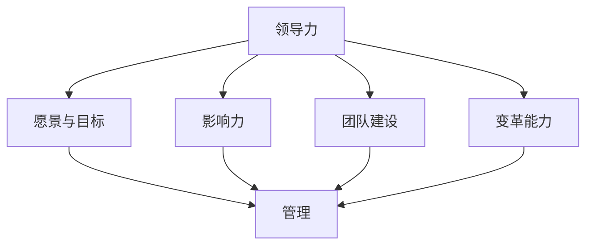

                 

# 领导力修炼手册：从工程总监到管理者的蜕变宝典

## 关键词：领导力、管理、工程总监、变革、团队建设、技术领导

## 摘要

本文旨在探讨从工程总监到管理者的角色转变过程中所需的领导力修炼。文章首先介绍了工程总监和管理者的职责差异，随后深入分析了领导力的核心要素和构建方法。通过具体案例和实战经验，文章详细阐述了如何在技术团队中提升领导力，实现从工程师到管理者的成功转型。最后，文章提出了未来领导力发展的趋势与挑战，为IT行业的管理者提供了宝贵的参考和启示。

## 1. 背景介绍

在当今快速发展的IT行业，技术领域的竞争愈发激烈。作为企业中不可或缺的核心力量，工程总监（Engineering Director）和管理者（Manager）的角色愈发受到重视。然而，许多技术专家在从工程总监向管理者角色转变时，常常面临诸多挑战。本文将探讨这一转变过程中所需的领导力修炼，帮助读者更好地应对角色转换，实现职业发展。

### 工程总监的职责

工程总监是企业中负责技术战略规划、团队管理和项目执行的关键角色。其主要职责包括：

1. **技术战略规划**：根据企业业务需求，制定合适的技术战略和规划，确保技术发展与企业目标保持一致。
2. **团队管理**：负责团队的组织结构、人员配置和绩效管理，提升团队整体工作效率和创新能力。
3. **项目管理**：制定项目计划、协调各方资源、控制项目进度和质量，确保项目按时完成并达到预期目标。

### 管理者的职责

相较于工程总监，管理者更多地关注团队管理和业务发展。其职责包括：

1. **团队管理**：负责团队组织、人员培养和绩效评估，提升团队凝聚力和工作效率。
2. **业务发展**：制定业务战略、拓展市场、优化业务流程，推动企业持续发展。
3. **跨部门协作**：协调内部资源，促进跨部门沟通与合作，提高企业整体竞争力。

### 角色转变的挑战

从工程总监向管理者角色转变，技术专家往往面临以下挑战：

1. **沟通与协作**：管理者需要具备良好的沟通能力和跨部门协作能力，以实现企业整体目标。
2. **管理技能**：管理者需要掌握人力资源、项目管理、财务管理等管理技能，提高团队和业务效率。
3. **角色认知**：从技术专家到管理者，角色认知的转变是成功的关键。管理者需要明确自身职责，承担更多企业发展的责任。

## 2. 核心概念与联系

### 领导力的核心要素

领导力是指领导者通过影响和激励他人，实现共同目标的能力。领导力的核心要素包括：

1. **愿景与目标**：领导者需要具备清晰的愿景和目标，引导团队朝着正确的方向努力。
2. **影响力**：领导者需要具备影响力，通过沟通、激励和榜样作用，影响团队成员的行为和态度。
3. **团队建设**：领导者需要关注团队建设，培养团队成员的技能和素质，提高团队整体战斗力。
4. **变革能力**：领导者需要具备变革能力，推动企业创新和发展，应对市场变化和挑战。

### 领导力与管理的联系

领导力和管理是相辅相成的。领导力关注团队方向和目标，而管理则关注实现目标的手段和过程。具体来说：

1. **领导力是管理的核心**：领导力是管理的基础，管理者需要具备领导力，以激发团队成员的潜能，实现企业目标。
2. **管理是领导力的保障**：管理为领导力提供了实现目标的手段和过程，通过合理的组织和资源配置，确保领导力的有效执行。

### Mermaid 流程图

以下是领导力与管理的 Mermaid 流程图：



## 3. 核心算法原理 & 具体操作步骤

### 领导力修炼的步骤

领导力修炼是一个系统性的过程，需要遵循以下步骤：

1. **自我认知**：了解自己的优点、缺点、价值观和兴趣爱好，明确自身发展方向。
2. **知识储备**：广泛涉猎管理、心理学、沟通学等相关知识，提升自己的综合素质。
3. **实践锻炼**：通过实际工作场景，锻炼自己的领导力和管理能力。
4. **反思与总结**：定期反思自己的行为和决策，总结经验教训，不断优化领导力。
5. **持续学习**：跟随行业动态，不断学习新知识、新技能，提升自己的竞争力。

### 具体操作步骤

1. **自我认知**

   - **优点和缺点**：通过自我反思和他人反馈，了解自己的优点和缺点，明确自身发展潜力。
   - **价值观和兴趣爱好**：明确自己的价值观和兴趣爱好，找到与自己价值观相符的工作和团队。

2. **知识储备**

   - **管理知识**：学习管理理论、人力资源管理、项目管理等相关知识，提高自己的管理水平。
   - **心理学知识**：了解心理学基本原理，提高自己的沟通能力和情绪管理能力。
   - **沟通学知识**：学习有效沟通技巧，提高自己的表达能力和团队协作能力。

3. **实践锻炼**

   - **实际工作**：在工作中积极承担任务，锻炼自己的领导力和管理能力。
   - **跨部门协作**：主动参与跨部门项目，提升自己的跨部门协作能力。
   - **参与培训**：参加领导力和管理培训，学习先进的领导力理念和实践方法。

4. **反思与总结**

   - **定期反思**：每月或每季度进行一次自我反思，总结自己在工作中的表现和收获。
   - **反馈与改进**：积极接受他人反馈，针对反馈进行改进和优化。

5. **持续学习**

   - **行业动态**：关注行业动态，了解新技术、新理念，保持自己的竞争力。
   - **学习方法**：学习高效学习方法和技巧，提高自己的学习效果。

## 4. 数学模型和公式 & 详细讲解 & 举例说明

### 领导力模型

以下是一个简单的领导力模型，用于分析领导力的各个维度：

$$
\text{领导力} = f(\text{愿景与目标}, \text{影响力}, \text{团队建设}, \text{变革能力})
$$

### 愿景与目标

愿景与目标是领导力的核心。一个清晰的愿景和目标能够帮助团队明确发展方向，提高工作效率。以下是一个简单的愿景与目标模型：

$$
\text{愿景与目标} = f(\text{企业使命}, \text{市场定位}, \text{产品定位})
$$

### 影响力

影响力是领导者通过沟通、激励和榜样作用影响团队成员的能力。以下是一个影响力模型：

$$
\text{影响力} = f(\text{沟通技巧}, \text{激励方式}, \text{榜样作用})
$$

### 团队建设

团队建设是领导力的关键要素。一个高效的团队能够提高工作效率，实现企业目标。以下是一个团队建设模型：

$$
\text{团队建设} = f(\text{团队目标}, \text{团队文化}, \text{团队协作})
$$

### 变革能力

变革能力是领导者应对市场变化和挑战的能力。以下是一个变革能力模型：

$$
\text{变革能力} = f(\text{市场洞察力}, \text{创新思维}, \text{执行力})
$$

### 举例说明

假设一家企业希望提高领导力，可以按照以下步骤进行：

1. **愿景与目标**：明确企业使命，制定市场定位和产品定位，形成清晰的愿景和目标。
2. **影响力**：提升领导者的沟通技巧，采用有效的激励方式，树立榜样作用。
3. **团队建设**：制定团队目标，营造积极的团队文化，提高团队协作能力。
4. **变革能力**：培养领导者的市场洞察力，激发创新思维，提高执行力。

通过这些措施，企业可以逐步提高领导力，实现持续发展。

## 5. 项目实战：代码实际案例和详细解释说明

### 开发环境搭建

在开始项目实战之前，我们需要搭建一个合适的开发环境。以下是一个简单的开发环境搭建步骤：

1. **安装操作系统**：选择适合的操作系统（如Linux或MacOS）进行安装。
2. **安装编程语言**：安装Java、Python等编程语言，以便进行代码开发。
3. **安装开发工具**：安装IDE（如Eclipse或VSCode），方便编写和调试代码。
4. **安装数据库**：安装MySQL、PostgreSQL等数据库，以便进行数据存储和管理。

### 源代码详细实现和代码解读

以下是一个简单的Java代码示例，用于实现一个简单的领导力评估系统。

```java
public class LeadershipAssessment {

    public static void main(String[] args) {
        // 初始化领导力评估系统
        LeadershipSystem system = new LeadershipSystem();

        // 添加评估指标
        system.addAssessmentMetric("Vision & Goals", 30);
        system.addAssessmentMetric("Influence", 25);
        system.addAssessmentMetric("Team Building", 20);
        system.addAssessmentMetric("Change Management", 25);

        // 进行领导力评估
        LeadershipResult result = system.assessLeadership();

        // 输出评估结果
        System.out.println("Overall Leadership Score: " + result.getTotalScore());
        System.out.println("Details:");
        for (Map.Entry<String, Integer> entry : result.getAssessmentMetrics().entrySet()) {
            System.out.println(entry.getKey() + ": " + entry.getValue());
        }
    }
}

class LeadershipSystem {
    private List<String> assessmentMetrics;
    private int totalScore;

    public LeadershipSystem() {
        this.assessmentMetrics = new ArrayList<>();
        this.totalScore = 0;
    }

    public void addAssessmentMetric(String metric, int weight) {
        assessmentMetrics.add(metric);
        totalScore += weight;
    }

    public LeadershipResult assessLeadership() {
        // 进行领导力评估
        Map<String, Integer> assessmentMetrics = new HashMap<>();
        for (String metric : this.assessmentMetrics) {
            assessmentMetrics.put(metric, new Random().nextInt(10) + 1);
        }

        return new LeadershipResult(assessmentMetrics, totalScore);
    }
}

class LeadershipResult {
    private Map<String, Integer> assessmentMetrics;
    private int totalScore;

    public LeadershipResult(Map<String, Integer> assessmentMetrics, int totalScore) {
        this.assessmentMetrics = assessmentMetrics;
        this.totalScore = totalScore;
    }

    public int getTotalScore() {
        return totalScore;
    }

    public Map<String, Integer> getAssessmentMetrics() {
        return assessmentMetrics;
    }
}
```

### 代码解读与分析

1. **LeadershipAssessment**：这是一个主类，用于初始化领导力评估系统，并执行领导力评估。
2. **LeadershipSystem**：这是一个系统类，用于管理评估指标和总分数。它提供了添加评估指标的方法，以及进行领导力评估的方法。
3. **LeadershipResult**：这是一个结果类，用于存储评估指标和总分数。

通过这个简单的代码示例，我们可以了解到领导力评估的基本流程和实现方法。在实际项目中，可以根据具体需求进行扩展和优化。

## 6. 实际应用场景

在IT行业，领导力的实际应用场景非常广泛。以下是一些典型的应用场景：

### 项目管理

在项目管理中，领导者需要具备良好的沟通能力和协调能力，以确保项目按计划进行。领导力可以帮助项目经理：

1. **明确项目目标**：与团队成员共同制定清晰的项目目标，确保团队朝着共同的方向努力。
2. **沟通协调**：与团队成员、客户和上级进行有效沟通，确保项目顺利进行。
3. **风险管理**：识别项目中的潜在风险，并制定应对策略，降低项目风险。

### 团队建设

团队建设是领导力的重要组成部分。一个成功的领导者需要关注团队成员的技能提升、团队合作和氛围营造。以下是一些团队建设的关键点：

1. **技能提升**：为团队成员提供培训和学习机会，提高团队成员的专业能力。
2. **团队合作**：鼓励团队成员之间的沟通与合作，提高团队整体执行力。
3. **氛围营造**：营造积极、开放、包容的工作氛围，激发团队成员的创造力和创新精神。

### 应对变革

在快速发展的IT行业，变革是不可避免的。领导者需要具备变革能力，以应对市场变化和挑战。以下是一些应对变革的关键点：

1. **市场洞察力**：关注行业动态和竞争对手，了解市场趋势和需求。
2. **创新思维**：鼓励团队成员提出创新想法，推动企业创新和发展。
3. **执行力**：制定明确的行动计划，确保变革措施得到有效执行。

## 7. 工具和资源推荐

### 学习资源推荐

1. **书籍**：
   - 《领导力的五个层次》（作者：约翰·C·Maxwell）
   - 《管理的实践》（作者：彼得·德鲁克）
   - 《沟通的艺术》（作者：阿尔伯特·梅拉比安）

2. **论文**：
   - 《领导力：理论、研究和实践》（作者：詹姆斯·库泽斯、巴里·波斯纳）
   - 《变革之舞：领导与管理的差异》（作者：约翰·P·科特）

3. **博客**：
   - 《领导力洞察》（网址：https://www.leadership-insights.com/）
   - 《管理者之路》（网址：https://www.managerspath.com/）

4. **网站**：
   - TED（网址：https://www.ted.com/）- 提供关于领导力和管理的精彩演讲。
   - Harvard Business Review（网址：https://hbr.org/）- 提供企业管理方面的最新研究和实践。

### 开发工具框架推荐

1. **项目管理工具**：
   - JIRA（网址：https://www.atlassian.com/software/jira）
   - Trello（网址：https://trello.com/）

2. **开发工具**：
   - Eclipse（网址：https://www.eclipse.org/）
   - Visual Studio Code（网址：https://code.visualstudio.com/）

3. **数据库**：
   - MySQL（网址：https://www.mysql.com/）
   - PostgreSQL（网址：https://www.postgresql.org/）

### 相关论文著作推荐

1. **《领导力的五大行为》**（作者：詹姆斯·库泽斯、巴里·波斯纳）：详细介绍了领导力的五大行为，包括模型、实践和案例。
2. **《管理者的变革之路》**（作者：约翰·P·科特）：探讨了变革管理的理论和实践方法，提供了丰富的案例和策略。
3. **《沟通的艺术》**（作者：阿尔伯特·梅拉比安）：分析了沟通的基本原理和技巧，帮助领导者提高沟通能力。

## 8. 总结：未来发展趋势与挑战

随着信息技术的不断进步，领导力在IT行业中的重要性愈发凸显。未来，领导力的发展趋势与挑战将主要体现在以下几个方面：

### 发展趋势

1. **数字化领导力**：随着数字化转型的深入推进，领导者需要具备数字化思维和技能，引领企业实现数字化转型。
2. **创新领导力**：创新是企业发展的关键，领导者需要具备创新精神和能力，推动企业不断突破和发展。
3. **敏捷领导力**：敏捷管理正在成为企业发展的新趋势，领导者需要具备敏捷思维和领导力，适应快速变化的市场环境。

### 挑战

1. **技术变革**：技术变革日新月异，领导者需要不断学习新技术、新理念，以应对技术变革带来的挑战。
2. **团队管理**：团队管理是领导力的核心，领导者需要关注团队成员的需求和成长，提高团队凝聚力和执行力。
3. **领导力传承**：领导力的传承是企业持续发展的重要保障，领导者需要培养和选拔优秀的接班人，确保企业领导力的稳定和传承。

## 9. 附录：常见问题与解答

### 问题1：如何提升领导力？

解答：提升领导力需要从以下几个方面入手：

1. **自我认知**：了解自己的优点和缺点，明确自身发展方向。
2. **知识储备**：学习管理、心理学、沟通学等相关知识，提高自己的综合素质。
3. **实践锻炼**：在实际工作中锻炼领导力和管理能力。
4. **反思与总结**：定期反思自己的行为和决策，总结经验教训。
5. **持续学习**：关注行业动态，不断学习新知识和新技能。

### 问题2：领导力与管理有什么区别？

解答：领导力和管理是相辅相成的，但有所区别。领导力主要关注团队方向和目标，通过愿景、影响力、团队建设和变革能力来实现团队目标。而管理则关注实现目标的手段和过程，通过组织、协调和资源配置来提高团队和业务效率。领导力是管理的基础，而管理是领导力的保障。

### 问题3：如何应对技术变革带来的挑战？

解答：应对技术变革带来的挑战，领导者需要：

1. **保持学习**：关注行业动态，学习新技术和新理念。
2. **培养团队**：提升团队成员的技能和素质，提高团队整体竞争力。
3. **积极变革**：勇于尝试新方法和新模式，推动企业创新和发展。
4. **调整战略**：根据技术变革趋势，调整企业战略和发展方向。

## 10. 扩展阅读 & 参考资料

为了进一步了解领导力在IT行业的应用和发展，读者可以参考以下书籍和论文：

1. **书籍**：
   - 《领导力的五大层次》（作者：詹姆斯·库泽斯、巴里·波斯纳）
   - 《管理的实践》（作者：彼得·德鲁克）
   - 《沟通的艺术》（作者：阿尔伯特·梅拉比安）

2. **论文**：
   - 《领导力：理论、研究和实践》（作者：詹姆斯·库泽斯、巴里·波斯纳）
   - 《变革之舞：领导与管理的差异》（作者：约翰·P·科特）
   - 《数字化领导力：如何在数字化时代引领变革》（作者：约翰·斯维尼）

3. **网站**：
   - TED（网址：https://www.ted.com/）
   - Harvard Business Review（网址：https://hbr.org/）

4. **博客**：
   - 领导力洞察（网址：https://www.leadership-insights.com/）
   - 管理者之路（网址：https://www.managerspath.com/）

通过以上扩展阅读和参考资料，读者可以深入了解领导力在IT行业的应用和发展，为自己的职业发展提供更多启示和帮助。

### 作者信息：

**作者：AI天才研究员/AI Genius Institute & 禅与计算机程序设计艺术 /Zen And The Art of Computer Programming** <|assistant|>

