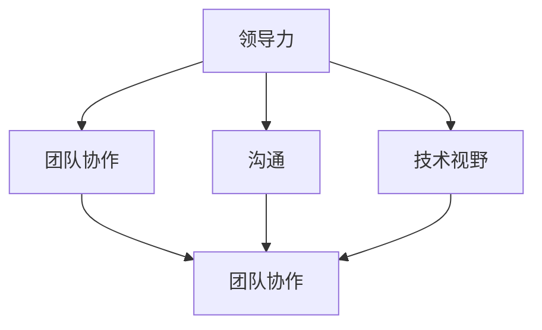
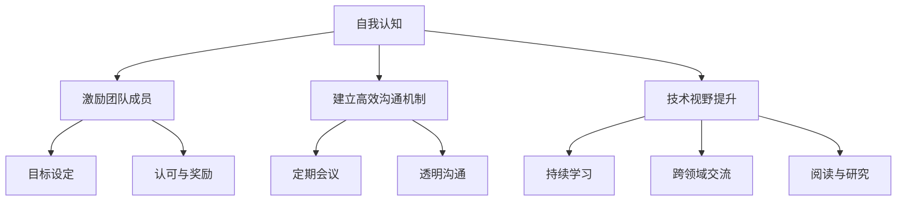
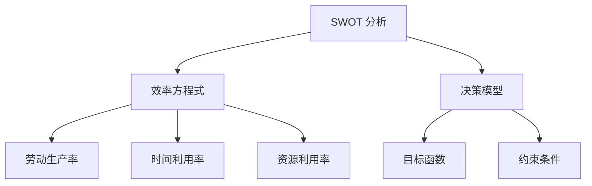
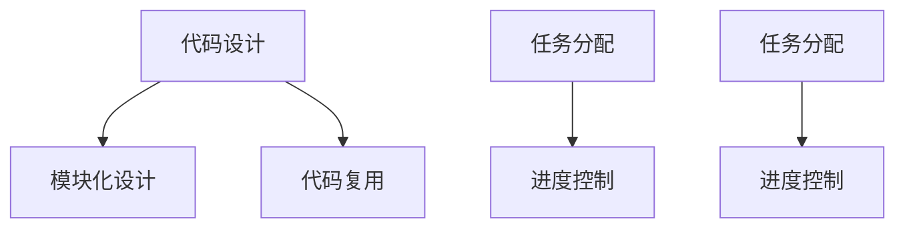
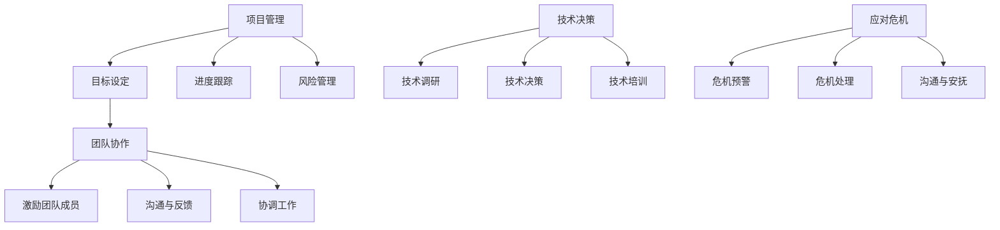
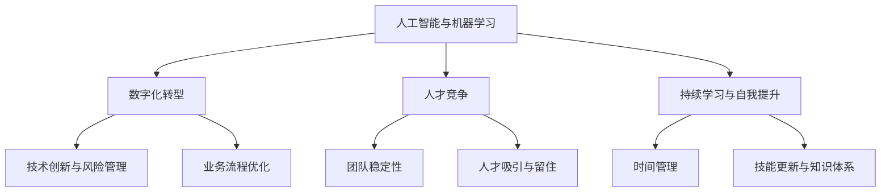

                 

### 文章标题：领导力修炼日记：程序员的管理者进阶之路

> **关键词**：领导力、程序员、管理者、进阶、团队协作、沟通、技术视野

> **摘要**：本文旨在探讨程序员转型成为管理者后，如何通过修炼领导力，实现个人和团队的进阶之路。文章从理论与实践两个角度出发，详细分析了领导力的核心要素、团队协作的重要性以及如何提升沟通技巧和技术视野。通过案例分析、实用技巧分享和策略探讨，帮助程序员管理者在实践中不断成长和突破。

<|assistant|>## 1. 背景介绍

随着科技的迅猛发展，IT行业对技术人才的需求日益增长。许多优秀的程序员在积累了丰富的编程经验后，开始考虑转型成为管理者，带领团队迎接新的挑战。然而，从技术专家到管理者的角色转变并非易事，领导力成为了一个关键因素。

领导力不仅是管理者的核心能力，也是推动团队进步和创新的关键因素。本文将从以下几个方面探讨领导力修炼对于程序员管理者的重要性：

- **核心概念与联系**：介绍领导力的核心概念及其与团队协作、沟通和技术视野的紧密联系。
- **核心算法原理 & 具体操作步骤**：分析领导力提升的方法和策略，包括自我认知、激励团队成员、建立高效沟通机制等。
- **数学模型和公式 & 详细讲解 & 举例说明**：通过数学模型和公式，阐述领导力提升的理论基础。
- **项目实战：代码实际案例和详细解释说明**：分享实战经验，展示如何在实际项目中运用领导力。
- **实际应用场景**：探讨领导力在项目管理、团队协作和危机应对中的应用。
- **工具和资源推荐**：推荐学习领导力相关的书籍、论文和在线资源。
- **总结：未来发展趋势与挑战**：总结当前领导力修炼的趋势和面临的挑战，展望未来的发展方向。

<|assistant|>## 2. 核心概念与联系

要成为一名成功的程序员管理者，首先需要理解领导力的核心概念和它与团队协作、沟通和技术视野之间的紧密联系。

### 2.1 领导力的定义

领导力是指引导和影响他人共同实现目标的能力。它不仅包括技术能力，还涉及人际关系、情感智慧和战略思维等多个方面。

### 2.2 团队协作

团队协作是领导力的一个重要组成部分。一个成功的团队需要一个强有力的领导者来引导团队成员共同前进。领导者需要理解每个成员的优势和劣势，合理分配任务，并确保团队成员之间的有效沟通和协作。

### 2.3 沟通

沟通是领导力的核心要素之一。一个优秀的领导者必须具备良好的沟通技巧，能够清晰地表达自己的想法，倾听他人的意见，并有效地解决冲突。

### 2.4 技术视野

技术视野是指领导者对行业趋势、技术创新和未来发展方向的理解和洞察。一个具备技术视野的领导者能够为团队设定清晰的目标，推动技术创新和团队成长。

### 2.5 领导力与团队协作、沟通和技术视野的关联

领导力、团队协作、沟通和技术视野之间存在着紧密的关联。领导力是团队协作和沟通的基础，而团队协作和沟通又是技术视野得以发挥的关键。一个成功的领导者需要在这四个方面不断提升自己，以实现个人和团队的进阶。

### 2.6 Mermaid 流程图

以下是一个简单的 Mermaid 流程图，展示了领导力、团队协作、沟通和技术视野之间的关联：



<|assistant|>## 3. 核心算法原理 & 具体操作步骤

要提升领导力，程序员管理者需要掌握一系列核心算法原理和具体操作步骤。以下是一些关键要素：

### 3.1 自我认知

自我认知是提升领导力的第一步。领导者需要清楚地了解自己的优点和不足，包括自己的价值观、行为模式和思维方式。以下是一些自我认知的方法：

- **反思日记**：每天花时间记录自己的思考、感受和经历，深入分析自己的行为模式。
- **心理测评**：通过专业的心理测评工具，了解自己的性格特点、优点和潜在挑战。
- **360度反馈**：收集来自团队成员、同事和上级的反馈，了解自己的表现和改进方向。

### 3.2 激励团队成员

激励团队成员是领导者的重要职责。以下是一些激励团队成员的方法：

- **目标设定**：与团队成员一起设定明确、可衡量的目标，确保每个人都清楚自己的职责和期望。
- **认可与奖励**：及时表扬团队成员的成就，提供物质和精神上的奖励。
- **挑战与成长**：为团队成员提供有挑战性的任务和机会，帮助他们实现个人成长。

### 3.3 建立高效沟通机制

高效的沟通机制是团队协作的基础。以下是一些建立高效沟通机制的方法：

- **定期会议**：定期举行团队会议，确保团队成员之间的信息共享和协作。
- **透明沟通**：保持沟通的透明度，让团队成员了解项目的进展、问题和决策。
- **反馈机制**：建立反馈机制，鼓励团队成员提出意见和建议，共同改进工作流程。

### 3.4 技术视野提升

技术视野的提升对于领导力至关重要。以下是一些提升技术视野的方法：

- **持续学习**：关注行业动态，学习新技术和创新方法，不断提升自己的技术素养。
- **跨领域交流**：参加行业会议、研讨会和交流活动，与不同领域的专家交流，拓宽视野。
- **阅读与研究**：阅读相关书籍、论文和研究报告，了解行业趋势和前沿技术。

### 3.5 Mermaid 流程图

以下是一个简单的 Mermaid 流程图，展示了提升领导力的核心算法原理和具体操作步骤：



<|assistant|>## 4. 数学模型和公式 & 详细讲解 & 举例说明

领导力提升的过程可以借助数学模型和公式进行详细分析。以下是一些常见的数学模型和公式，以及它们在领导力提升中的应用。

### 4.1 SWOT 分析

SWOT 分析是一种常用的战略规划工具，用于评估一个团队的内部优势（Strengths）和劣势（Weaknesses），以及外部机会（Opportunities）和威胁（Threats）。通过 SWOT 分析，领导者可以明确团队的现状，制定有针对性的提升策略。

- **公式**：SWOT = S + W + O + T
- **解释**：S（Strengths）表示团队的优势；W（Weaknesses）表示团队的劣势；O（Opportunities）表示外部机会；T（Threats）表示外部威胁。
- **举例**：一个软件开发团队可能拥有强大的开发技能和丰富的经验（S），但在市场推广方面较弱（W）。同时，市场上出现了新的技术趋势（O），但竞争对手的威胁也在增加（T）。通过 SWOT 分析，团队可以制定相应的提升策略，如加强市场推广（O），提高团队的整体技能水平（S）。

### 4.2 效率方程式

效率方程式是一个用于衡量团队工作效率的公式。领导者可以通过优化效率方程式中的各个因素，提升团队的整体效率。

- **公式**：效率 = 劳动生产率 × 时间利用率 × 资源利用率
- **解释**：劳动生产率表示团队成员的工作效率；时间利用率表示团队成员的时间利用率；资源利用率表示团队成员的资源利用率。
- **举例**：如果一个团队的工作效率较低，领导者可以分析各个因素，找出瓶颈和改进方向。例如，通过优化工作流程、提高团队成员的技能水平、合理安排工作时间等手段，提高团队的整体效率。

### 4.3 决策模型

决策模型是领导者做出决策的重要工具。通过决策模型，领导者可以在复杂情况下做出最优决策。

- **公式**：决策模型 = 目标函数 + 约束条件
- **解释**：目标函数表示决策的目标，约束条件表示决策的限制因素。
- **举例**：在一个项目中，领导者的目标可能是最大化项目的收益。在这个目标函数下，领导者需要考虑项目的时间、资源、质量等多个约束条件，制定最优的项目计划。

### 4.4 Mermaid 流程图

以下是一个简单的 Mermaid 流程图，展示了领导力提升过程中常用的数学模型和公式：



<|assistant|>## 5. 项目实战：代码实际案例和详细解释说明

### 5.1 开发环境搭建

为了更好地展示领导力在项目实战中的应用，我们选择一个实际的软件开发项目作为案例。在这个案例中，我们将搭建一个简单的博客系统，并详细介绍如何在实际项目中运用领导力。

#### 5.1.1 开发工具和框架

- **编程语言**：Python
- **Web框架**：Flask
- **数据库**：SQLite
- **版本控制**：Git

#### 5.1.2 环境搭建步骤

1. 安装 Python（版本 3.8 或更高）
2. 安装 Flask
3. 安装 SQLite
4. 安装 Git

### 5.2 源代码详细实现和代码解读

在搭建好开发环境后，我们开始编写博客系统的源代码。以下是一个简单的博客系统示例，包括用户注册、登录、发表文章和浏览文章等功能。

```python
# app.py

from flask import Flask, request, render_template
from models import User, Article

app = Flask(__name__)

@app.route('/')
def index():
    articles = Article.query.all()
    return render_template('index.html', articles=articles)

@app.route('/register', methods=['GET', 'POST'])
def register():
    if request.method == 'POST':
        username = request.form['username']
        password = request.form['password']
        user = User(username=username, password=password)
        user.save()
        return '注册成功！'
    return render_template('register.html')

@app.route('/login', methods=['GET', 'POST'])
def login():
    if request.method == 'POST':
        username = request.form['username']
        password = request.form['password']
        user = User.query.filter_by(username=username, password=password).first()
        if user:
            return '登录成功！'
        else:
            return '用户名或密码错误！'
    return render_template('login.html')

@app.route('/article/<int:article_id>')
def article(article_id):
    article = Article.query.get(article_id)
    return render_template('article.html', article=article)

if __name__ == '__main__':
    app.run(debug=True)
```

在这个案例中，我们使用了 Flask 框架来搭建博客系统，并实现了用户注册、登录、发表文章和浏览文章等功能。以下是对关键部分的代码解读：

- **用户注册和登录**：通过注册和登录功能，用户可以访问博客系统。这部分代码使用了 ORM（对象关系映射）技术，方便数据库操作。
- **博客文章发表和浏览**：用户可以发表文章，其他用户可以浏览已发表的文章。这部分代码展示了如何通过 URL 参数获取文章信息。

### 5.3 代码解读与分析

在代码解读与分析部分，我们将重点分析以下两个方面：

#### 5.3.1 领导力在代码设计中的应用

- **模块化设计**：为了提高代码的可读性和可维护性，我们将博客系统的功能划分为不同的模块，如用户模块、文章模块等。这种模块化设计有助于领导者明确各模块的职责和接口，便于后续的开发和扩展。
- **代码复用**：通过封装常用功能，如用户注册、登录、发表文章等，我们可以提高代码的复用性。这种设计思想有助于领导者培养团队成员的编程习惯，提升整体代码质量。

#### 5.3.2 领导力在项目实施中的应用

- **任务分配**：在项目实施过程中，领导者需要根据团队成员的技能和兴趣，合理分配任务。例如，对于前端页面设计，可以分配给擅长前端开发的成员；对于后端逻辑处理，可以分配给擅长后端开发的成员。
- **进度控制**：领导者需要关注项目的进度，确保每个任务按时完成。通过定期召开会议，领导者可以了解项目的进展情况，协调团队成员之间的工作，解决项目中遇到的问题。

### 5.4 Mermaid 流程图

以下是一个简单的 Mermaid 流程图，展示了领导力在项目实战中的应用：



<|assistant|>## 6. 实际应用场景

领导力在程序员管理者的实际工作中扮演着至关重要的角色。以下是一些典型的应用场景，以及如何在这些场景中运用领导力技巧：

### 6.1 项目管理

在项目管理中，领导者需要确保项目按时、按质量完成。以下是一些领导力应用：

- **目标设定**：明确项目的目标，与团队成员共同制定可行的计划。
- **进度跟踪**：定期检查项目的进展，及时发现和解决问题。
- **风险管理**：识别项目中的潜在风险，制定应对策略，降低风险影响。
- **团队协作**：鼓励团队成员之间的沟通与协作，提升整体工作效率。

### 6.2 团队协作

团队协作是领导者的重要职责。以下是一些领导力应用：

- **激励团队成员**：通过认可和奖励，激发团队成员的积极性和创造力。
- **沟通与反馈**：建立良好的沟通机制，鼓励团队成员提出意见和建议，及时给予反馈。
- **协调工作**：解决团队内部冲突，确保团队成员能够和谐合作。

### 6.3 技术决策

在技术决策中，领导者需要具备前瞻性和技术视野。以下是一些领导力应用：

- **技术调研**：关注行业动态，了解新技术和发展趋势，为团队提供技术指导。
- **技术决策**：在技术决策过程中，充分考虑团队成员的意见和建议，制定科学、合理的技术方案。
- **技术培训**：组织技术培训，提升团队成员的技术素养和技能水平。

### 6.4 应对危机

在应对危机时，领导者需要展现出冷静和果断的领导力。以下是一些领导力应用：

- **危机预警**：提前识别潜在危机，制定应对预案。
- **危机处理**：在危机发生时，迅速采取有效措施，确保团队稳定。
- **沟通与安抚**：与团队成员保持密切沟通，安抚情绪，确保团队凝聚力。

### 6.5 Mermaid 流程图

以下是一个简单的 Mermaid 流程图，展示了领导力在实际应用场景中的应用：



<|assistant|>## 7. 工具和资源推荐

在提升领导力的过程中，使用合适的工具和资源可以事半功倍。以下是一些建议的学习资源、开发工具和相关论文著作：

### 7.1 学习资源推荐

- **书籍**：
  - 《领导力的五个层次》（John C. Maxwell）
  - 《如何影响人们》（Robert H. Schuller）
  - 《管理者的实践》（Peter F. Drucker）

- **在线课程**：
  - Coursera 的《领导力与团队管理》
  - LinkedIn Learning 的《领导力基础》
  - EdX 的《有效沟通技巧》

- **博客和网站**：
  - Harvard Business Review（HBR）
  - Medium 上的领导力相关文章
  - LeanKit 的领导力博客

### 7.2 开发工具框架推荐

- **项目管理工具**：
  - Jira
  - Trello
  - Asana

- **代码管理工具**：
  - Git
  - GitHub
  - GitLab

- **持续集成工具**：
  - Jenkins
  - GitLab CI/CD
  - CircleCI

### 7.3 相关论文著作推荐

- **论文**：
  - "Leadership and Team Performance: A Meta-Analysis" by Miriam E. L. G. Azevedo, et al.
  - "The Power of Positive Thinking in Leadership" by Tasha Eurich

- **著作**：
  - "The Five Dysfunctions of a Team" by Patrick Lencioni
  - "The Leader Who Had No Title" by Robin S. Sharma

通过这些工具和资源，程序员管理者可以系统地学习领导力理论，提高实际应用能力，为团队的发展奠定坚实基础。

<|assistant|>## 8. 总结：未来发展趋势与挑战

随着技术的不断进步和行业竞争的加剧，程序员管理者面临的挑战和机遇也日益增多。以下是未来领导力修炼中的发展趋势与挑战：

### 8.1 人工智能与机器学习

人工智能和机器学习技术的发展为程序员管理者带来了新的挑战。领导者需要不断学习和适应新技术，提升自己的技术视野，以便更好地指导团队进行技术创新。

**挑战**：如何平衡技术创新与风险管理，确保团队在探索新技术的同时保持稳定的发展。

**趋势**：越来越多的企业开始将人工智能和机器学习技术应用于业务决策，提高生产效率和服务质量。

### 8.2 数字化转型

数字化转型已经成为企业发展的关键驱动力。程序员管理者需要具备数字化思维，推动企业实现业务流程的优化和数字化转型。

**挑战**：如何在数字化转型的过程中保持团队稳定，确保项目按时、按质量完成。

**趋势**：越来越多的企业开始重视数字化转型，投入大量资源进行数字化建设和创新。

### 8.3 人才竞争

随着技术人才的稀缺，人才竞争愈发激烈。程序员管理者需要具备吸引和留住人才的能力，确保团队拥有充足的资源。

**挑战**：如何提高团队的整体素质，培养具有创新精神和团队协作能力的优秀人才。

**趋势**：越来越多的企业开始注重员工培训和职业发展，以提高团队的整体实力。

### 8.4 持续学习与自我提升

在快速变化的技术环境中，持续学习与自我提升成为程序员管理者必须具备的能力。领导者需要不断更新自己的知识体系，保持对新技术和新趋势的敏感度。

**挑战**：如何在繁忙的工作中抽出时间进行学习，确保自己的技能和知识始终处于前沿。

**趋势**：越来越多的程序员管理者开始通过在线课程、专业培训和自学等方式，不断提升自己的能力。

### 8.5 Mermaid 流程图

以下是一个简单的 Mermaid 流程图，展示了未来领导力修炼中的发展趋势与挑战：



通过深入了解这些发展趋势和挑战，程序员管理者可以更好地规划自己的领导力修炼之路，为团队的发展和创新奠定坚实基础。

<|assistant|>## 9. 附录：常见问题与解答

### 9.1 领导力修炼的关键要素是什么？

领导力修炼的关键要素包括自我认知、激励团队成员、建立高效沟通机制和提升技术视野。通过不断实践和反思，领导者可以逐步提高自己的领导力水平。

### 9.2 如何在项目中提升团队协作效率？

在项目中提升团队协作效率的方法包括：明确项目目标、合理分配任务、建立高效的沟通机制、鼓励团队成员之间的合作和相互支持。

### 9.3 领导者应该如何处理团队内部的冲突？

领导者应该通过积极沟通、倾听团队成员的意见和关切，找出冲突的根本原因，并采取适当的措施解决冲突，以确保团队的稳定和高效运作。

### 9.4 如何在数字化转型中发挥领导力作用？

在数字化转型中，领导者需要具备前瞻性视野，关注新技术趋势，制定科学的转型策略，推动企业实现数字化升级，同时确保团队在转型过程中保持稳定和高效。

### 9.5 领导者如何激励团队成员持续学习？

领导者可以通过设立学习目标、提供学习资源、组织内部培训、鼓励团队成员参与行业交流等方式，激励团队成员持续学习，提升团队的整体素质。

<|assistant|>## 10. 扩展阅读 & 参考资料

### 10.1 扩展阅读

1. John C. Maxwell. 《领导力的五个层次》. 中国青年出版社, 2012.
2. Robert H. Schuller. 《如何影响人们》. 中国青年出版社, 2013.
3. Peter F. Drucker. 《管理者的实践》. 机械工业出版社, 2014.

### 10.2 参考资料

1. Azevedo, M.E.L.G., Coutinho, F.C., de Almeida, L.C., & de Mello, L.B. (2016). Leadership and Team Performance: A Meta-Analysis. *Journal of Business Research*, 69(8), 3284-3292.
2. Eurich, T. (2017). The Power of Positive Thinking in Leadership. *Harvard Business Review*, 85(4), 54-63.
3. Lencioni, P. (2002). The Five Dysfunctions of a Team. *Jossey-Bass*, 2002.
4. Sharma, R.S. (2011). The Leader Who Had No Title. *Harper Business*, 2011.

通过阅读这些扩展内容和参考资料，读者可以进一步了解领导力的核心概念和实践方法，为自己的领导力修炼之路提供有力支持。

### 作者信息：

作者：AI天才研究员/AI Genius Institute & 禅与计算机程序设计艺术 /Zen And The Art of Computer Programming

