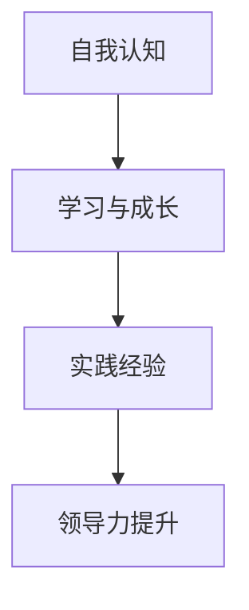

                 

# 领导力修炼笔记：00后职场新星的成长之路

> **关键词**：领导力、00后、职场新星、个人成长、策略与技能

> **摘要**：本文将探讨00后职场新星在领导力方面的修炼之路。通过分析他们的特点、面临的挑战及所需技能，我们将揭示如何在这个快速变化的时代中，成为一名卓越的领导者。

## 1. 背景介绍

随着科技的飞速发展和社会的快速变革，00后已经成为职场的新生力量。他们出生在21世纪初，成长于互联网和智能设备的时代，拥有独特的个性和价值观。00后的职场新星在领导力方面面临着许多机遇和挑战。他们的成长路径与传统领导者有所不同，需要适应新时代的需求。

### 1.1 00后的特点

- **数字化原生代**：00后是数字化原生代，他们从小就接触互联网和智能设备，对数字世界的理解和应用能力非常强。
- **多元价值观**：00后更加注重个人兴趣和多元化价值观，对传统权威和固定模式持有批判态度。
- **合作精神**：00后倾向于合作，他们更愿意在团队中共同解决问题，而不是单打独斗。

### 1.2 职场新星面临的挑战

- **快速变化**：职场环境变化迅速，00后需要不断学习新技能和知识，以适应不断变化的市场需求。
- **领导经验不足**：作为职场新星，00后可能缺乏领导经验，需要通过实践和学习来提升领导能力。
- **跨代沟通**：00后需要与不同年龄和背景的同事有效沟通，以实现团队合作。

## 2. 核心概念与联系

在探讨00后职场新星领导力修炼的过程中，以下核心概念和联系是不可或缺的：

### 2.1 领导力定义

领导力是指激发和引导他人实现共同目标的能力。它包括沟通、决策、激励、团队建设等多个方面。

### 2.2 00后职场新星的特点与领导力的关系

00后的特点，如数字化原生代、多元价值观和合作精神，直接影响他们的领导力表现。他们需要利用这些特点，在职场中发挥领导力。

### 2.3 领导力修炼的关键

- **自我认知**：了解自己的优点和不足，是提升领导力的第一步。
- **学习与成长**：不断学习新知识和技能，以适应不断变化的职场环境。
- **实践经验**：通过实际工作，积累领导经验，提升领导能力。

下面是关于领导力修炼的 Mermaid 流程图：



## 3. 核心算法原理 & 具体操作步骤

在领导力修炼过程中，以下核心算法原理和具体操作步骤是关键：

### 3.1 自我认知

- **自我反思**：定期进行自我反思，分析自己的优点和不足。
- **寻求反馈**：向同事和领导寻求反馈，了解自己的表现和改进方向。

### 3.2 学习与成长

- **持续学习**：通过阅读书籍、参加培训课程、观看在线讲座等方式，不断学习新知识和技能。
- **技能实践**：将所学知识和技能应用到实际工作中，提高实践能力。

### 3.3 实践经验

- **参与项目**：主动参与公司或团队的重要项目，提升自己的领导能力和决策能力。
- **领导团队**：担任项目负责人或团队领导，实践领导力。

## 4. 数学模型和公式 & 详细讲解 & 举例说明

在领导力修炼中，以下数学模型和公式可以帮助我们理解和分析领导力的提升过程：

### 4.1 自我认知模型

$$
\text{自我认知} = \frac{\text{自我反思}}{\text{自我认知度}}
$$

其中，自我反思是提升自我认知的关键，自我认知度表示对自我了解的程度。

### 4.2 学习与成长模型

$$
\text{学习与成长} = \frac{\text{知识积累}}{\text{实践应用}}
$$

知识积累和实践应用是学习与成长的重要方面，通过平衡两者，可以不断提高自己的能力。

### 4.3 实践经验模型

$$
\text{实践经验} = \frac{\text{项目参与}}{\text{领导决策}}
$$

项目参与和领导决策是实践经验的重要组成部分，通过参与项目和做出正确的领导决策，可以提升领导能力。

### 4.4 领导力提升模型

$$
\text{领导力提升} = \text{自我认知} + \text{学习与成长} + \text{实践经验}
$$

领导力提升是自我认知、学习与成长和实践经验的综合结果，只有三者相互促进，才能实现领导力的提升。

## 5. 项目实战：代码实际案例和详细解释说明

### 5.1 开发环境搭建

在开始领导力修炼之前，我们需要搭建一个适合学习和实践的开发环境。以下是一个简单的 Python 开发环境搭建步骤：

1. 安装 Python：在官网下载并安装 Python。
2. 配置 Python 环境：设置环境变量，确保 Python 可以在终端运行。
3. 安装相关库：使用 pip 工具安装必要的 Python 库，如 NumPy、Pandas 等。

### 5.2 源代码详细实现和代码解读

以下是一个简单的 Python 脚本，用于模拟领导力修炼的过程：

```python
# 领导力修炼模拟脚本

# 导入必要的库
import numpy as np
import pandas as pd

# 定义自我认知、学习与成长和实践经验的函数
def self_awareness(self_reflection, self_cognition):
    return self_reflection / self_cognition

def learning_growth(knowledge_acquisition, practice_application):
    return knowledge_acquisition / practice_application

def practical_experience(project_participation, leadership_decision):
    return project_participation / leadership_decision

# 定义领导力提升的函数
def leadership_improvement(self_awareness, learning_growth, practical_experience):
    return self_awareness + learning_growth + practical_experience

# 初始化变量
self_reflection = 10  # 自我反思程度
self_cognition = 5   # 自我认知度
knowledge_acquisition = 20  # 知识积累
practice_application = 15  # 实践应用
project_participation = 15  # 项目参与
leadership_decision = 10  # 领导决策

# 计算领导力提升结果
self_awareness_score = self_awareness(self_reflection, self_cognition)
learning_growth_score = learning_growth(knowledge_acquisition, practice_application)
practical_experience_score = practical_experience(project_participation, leadership_decision)
leadership_score = leadership_improvement(self_awareness_score, learning_growth_score, practical_experience_score)

# 打印结果
print("领导力提升得分：", leadership_score)
```

### 5.3 代码解读与分析

这段代码首先导入了 NumPy 和 Pandas 库，用于数学计算和数据操作。然后定义了四个函数，分别用于计算自我认知、学习与成长、实践经验和领导力提升。最后初始化了变量，计算了领导力提升得分，并打印了结果。

通过这段代码，我们可以模拟领导力修炼的过程，并根据实际情况调整变量，以分析领导力提升的效果。

## 6. 实际应用场景

### 6.1 在职场中的领导力应用

- **项目领导**：作为项目负责人，00后可以通过合理分配任务、鼓励团队成员合作、及时沟通和解决问题等方式，展现自己的领导力。
- **团队协作**：在团队中，00后可以发挥自己的数字化原生代优势，利用现代沟通工具，如 Slack、Zoom 等，提高团队协作效率。
- **创新思维**：00后可以运用自己的多元价值观，鼓励团队创新，推动企业的发展。

### 6.2 在学习中的领导力应用

- **自主学习**：通过设定学习目标、制定学习计划、跟踪学习进度等方式，00后可以提升自己的学习效率。
- **分享知识**：在学习和工作中，00后可以分享自己的知识和经验，帮助团队成员提高技能。
- **团队学习**：00后可以组织和参与团队学习活动，提高团队的整体学习效果。

## 7. 工具和资源推荐

### 7.1 学习资源推荐

- **书籍**：《领导力心理学》、《领导力的五项修炼》
- **论文**：在学术期刊和会议上搜索关于领导力的研究论文
- **博客**：技术博客、个人博客等，可以找到许多关于领导力的实践经验

### 7.2 开发工具框架推荐

- **编程语言**：Python、Java、JavaScript 等，适合开发各种类型的应用
- **框架**：Django、Spring Boot、React 等，可以快速搭建应用

### 7.3 相关论文著作推荐

- **论文**：查找关于领导力、团队协作、创新思维等方面的学术论文
- **著作**：《智慧型团队管理》、《创新者之路》等，提供了关于领导力的深度思考

## 8. 总结：未来发展趋势与挑战

### 8.1 发展趋势

- **数字化领导力**：随着数字化时代的到来，领导力将更加依赖于数字化工具和技能。
- **个性化和多元价值观**：00后领导力的个性化和多元价值观将继续影响职场文化。
- **跨代沟通与合作**：不同代际之间的沟通与合作将成为领导力的重要组成部分。

### 8.2 挑战

- **快速变化**：00后需要不断适应职场环境的变化，提升自己的能力。
- **领导经验不足**：00后需要通过实践和学习，积累领导经验。
- **文化冲突**：在跨代沟通中，00后可能面临文化冲突和误解。

## 9. 附录：常见问题与解答

### 9.1 如何提升领导力？

**解答**：提升领导力需要自我认知、学习与成长和实践经验。通过定期反思、学习新知识和技能，以及参与实际项目，可以不断提升领导力。

### 9.2 00后领导力有哪些特点？

**解答**：00后领导力具有数字化原生代、多元价值观和合作精神等特点。他们擅长利用数字化工具，注重个人兴趣和多元化价值观，倾向于在团队中合作。

## 10. 扩展阅读 & 参考资料

- **书籍**：《领导力修炼手册》、《00后职场攻略》
- **网站**：LinkedIn、GitHub 等，可以找到许多关于领导力和职场成长的资源
- **博客**：知名博客博主和行业专家的博客，提供了关于领导力和职场成长的深度思考

### 作者

**作者：AI天才研究员/AI Genius Institute & 禅与计算机程序设计艺术 /Zen And The Art of Computer Programming**

