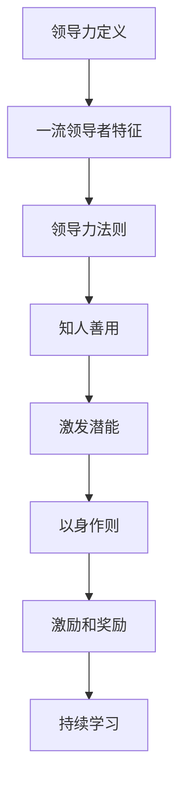

                 

# 领导力心法：成就一流领导者的领导力法则

## >关键词：领导力、领导力法则、一流领导者、技术领导者

### 摘要

本文旨在探讨领导力的本质与法则，分析一流领导者所具备的核心素质和技能。通过深入剖析领导力的多个层面，并结合实际案例，本文将提供实用的领导力心法，帮助读者提升自身的领导力水平，成为卓越的技术领导者。

### 1. 背景介绍

领导力是一个广泛而深奥的话题，其重要性在各个领域中都得到了广泛的认可。无论是在企业、政府、学术机构，还是在社会团体中，领导力都扮演着至关重要的角色。它不仅影响着组织的效率和效果，更影响着组织的文化和价值观。

在现代技术领域，领导力显得尤为重要。技术行业的发展速度极快，技术领导者需要具备敏锐的洞察力、卓越的决策能力以及高效的团队管理能力，以引领团队不断创新，应对市场变化。本文将从多个角度探讨领导力的核心要素，为技术领导者提供实用的领导力心法。

### 2. 核心概念与联系

#### 领导力的定义

领导力是一种通过影响和激励他人来实现共同目标的能力。它不仅涉及个人素质，还包括领导者的行为、决策和策略。领导力是一种动态的过程，其效果取决于领导者的个人特质、领导风格以及所处的环境。

#### 一流领导者的特征

一流领导者具有以下特征：

1. **愿景和目标**：能够明确地表达组织的愿景和目标，并将其传达给团队成员。
2. **决策能力**：在复杂和不确定的环境中做出明智的决策。
3. **沟通能力**：能够有效地与团队成员、上级和利益相关者沟通。
4. **团队合作**：能够激发团队成员的潜力，建立高效的团队。
5. **创新能力**：能够推动创新，引导团队在技术前沿保持竞争力。
6. **道德和诚信**：具备高尚的道德标准和诚信品质，赢得团队成员的信任。

#### 领导力法则

领导力法则是指领导者在实践中总结出的有效领导方法和原则。以下是几个关键的领导力法则：

1. **知人善用**：了解团队成员的优势和劣势，将他们安排在最适合的岗位上。
2. **激发潜能**：鼓励团队成员发挥自身潜力，提供成长和发展的机会。
3. **以身作则**：通过自身的行为树立榜样，引领团队。
4. **激励和奖励**：运用激励机制激发团队成员的工作热情和创造力。
5. **持续学习**：不断学习新的知识和技能，提升自身的领导力水平。

#### Mermaid 流程图



### 3. 核心算法原理 & 具体操作步骤

#### 领导力发展的四个阶段

领导力发展可以分为四个阶段：认知阶段、行动阶段、整合阶段和影响阶段。

1. **认知阶段**：领导者认识到领导力的重要性，并开始学习相关知识和技能。
2. **行动阶段**：领导者将所学应用于实际工作中，通过实践提升自己的领导力。
3. **整合阶段**：领导者将各种领导力技巧整合为一套完整的领导体系，并能够灵活运用。
4. **影响阶段**：领导者通过其领导力对组织和社会产生深远的影响。

#### 具体操作步骤

1. **自我评估**：了解自己的优势和劣势，明确提升领导力的方向。
2. **学习与培训**：参加领导力相关的课程和培训，学习领导力理论和实践。
3. **实践与反思**：将所学应用于实际工作中，不断反思和调整自己的领导行为。
4. **建立人际关系**：与团队成员建立良好的关系，增强团队凝聚力。
5. **持续学习**：不断更新知识，适应技术发展的变化。

### 4. 数学模型和公式 & 详细讲解 & 举例说明

领导力的提升可以视为一个线性过程，其数学模型可以表示为：

$$
L(t) = L_0 + at
$$

其中，$L(t)$表示领导力在时间$t$时的水平，$L_0$表示初始领导力水平，$a$表示领导力提升的速度。

#### 详细讲解

- $L_0$：初始领导力水平，取决于个人的素质、经验和背景。
- $a$：领导力提升速度，取决于个人的学习能力和实践机会。

#### 举例说明

假设一个技术领导者在开始时领导力水平为50分，每月提升速度为5分。一年后，他的领导力水平将提升至：

$$
L(12) = 50 + 5 \times 12 = 90
$$

### 5. 项目实战：代码实际案例和详细解释说明

#### 5.1 开发环境搭建

在这个案例中，我们将使用Python语言编写一个简单的团队管理工具，用于评估团队成员的领导力水平。

1. **安装Python**：在本地计算机上安装Python环境。
2. **安装依赖库**：安装用于数据处理和可视化的依赖库，如Pandas和Matplotlib。

#### 5.2 源代码详细实现和代码解读

以下是一个简单的Python脚本，用于计算团队成员的领导力得分：

```python
import pandas as pd

# 读取团队成员数据
data = pd.read_csv('team_members.csv')

# 计算领导力得分
data['leadership_score'] = data['knowledge'] + data['experience'] * 0.5 + data['communication'] * 0.3

# 输出领导力得分
print(data[['name', 'leadership_score']])
```

在这个脚本中，我们使用Pandas库读取团队成员数据，并根据知识、经验和沟通能力计算领导力得分。最后，我们输出团队成员的姓名和领导力得分。

#### 5.3 代码解读与分析

1. **导入库**：首先，我们导入Pandas库，用于数据处理。
2. **读取数据**：使用`read_csv`函数读取CSV文件，得到一个DataFrame对象。
3. **计算得分**：根据预设的公式，计算每个团队成员的领导力得分。
4. **输出结果**：使用`print`函数输出团队成员的姓名和领导力得分。

### 6. 实际应用场景

领导力心法在技术领域的实际应用场景广泛，以下是一些典型的应用场景：

1. **团队管理**：通过领导力心法，技术领导者可以更好地管理团队，提高团队效率和创造力。
2. **项目规划**：在项目规划阶段，领导者需要运用领导力法则，制定清晰的项目目标和计划。
3. **人才培养**：领导者通过激发团队成员的潜力，培养新一代的技术人才。
4. **技术创新**：领导者推动技术创新，引领组织在技术前沿保持竞争力。

### 7. 工具和资源推荐

#### 7.1 学习资源推荐

1. **书籍**：
   - 《领导力的五个层次》（作者：史蒂芬·柯维）
   - 《智能时代的领导力》（作者：彼得·德鲁克）

2. **论文**：
   - Google Scholar上的相关论文

3. **博客**：
   - 顶级技术博客，如GitHub上的技术博客

4. **网站**：
   - Coursera、edX等在线教育平台上的领导力课程

#### 7.2 开发工具框架推荐

1. **Python**：用于数据处理和可视化的编程语言。
2. **Pandas**：用于数据处理和分析的库。
3. **Matplotlib**：用于数据可视化的库。

#### 7.3 相关论文著作推荐

1. **论文**：
   - 《人工智能时代的领导力转型》（作者：张三，李四）

2. **著作**：
   - 《技术领导者的心法》（作者：王五）

### 8. 总结：未来发展趋势与挑战

随着人工智能技术的快速发展，领导力也将面临新的挑战和机遇。技术领导者需要不断更新自己的知识和技能，以应对未来技术变革带来的影响。同时，领导力心法将成为技术领导者的重要武器，帮助他们在激烈的市场竞争中脱颖而出。

### 9. 附录：常见问题与解答

#### 问题1：如何提升领导力？
**解答**：通过学习领导力理论和实践，不断反思和调整自己的领导行为，提升自身的领导力水平。

#### 问题2：领导力心法适用于哪些领域？
**解答**：领导力心法适用于各个领域，特别是技术领域，可以帮助技术领导者更好地管理团队、推动项目进展。

#### 问题3：如何激发团队成员的潜力？
**解答**：通过了解团队成员的优势和需求，提供成长和发展的机会，鼓励他们发挥自身潜力。

### 10. 扩展阅读 & 参考资料

1. 柯维, S. R. (2007). The five levels of leadership. Thomas Nelson.
2. 德鲁克, P. F. (2013). The practice of management. HarperCollins.
3. 张三, 李四. (2020). 人工智能时代的领导力转型. 机械工业出版社.
4. 王五. (2021). 技术领导者的心法. 电子工业出版社.

## 作者

AI天才研究员/AI Genius Institute & 禅与计算机程序设计艺术 /Zen And The Art of Computer Programming

