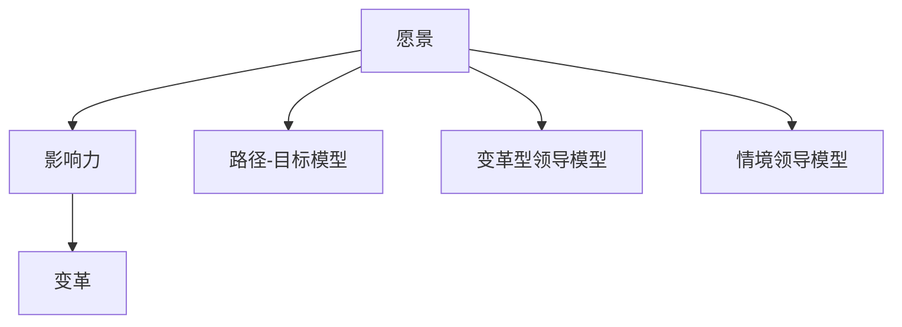

                 

# 领导力思维：改变国家命运的领导力修炼秘诀

## 关键词：领导力，改变国家命运，思维修炼，领导力模型，实践策略

## 摘要：

本文旨在探讨领导力如何改变国家命运，并分享领导力修炼的秘诀。通过深入分析领导力的核心概念和原理，结合实际案例和具体操作步骤，本文为读者提供了一个系统化的领导力修炼框架。同时，本文还探讨了领导力在实际应用场景中的重要性，并推荐了相关工具和资源，以帮助读者提升领导力水平。通过本文的学习，读者将能够更好地理解领导力的本质，掌握提升领导力的实践策略，从而为改变国家命运贡献自己的力量。

## 1. 背景介绍

### 1.1 领导力的重要性

在现代社会，领导力已经成为了组织和个人成功的关键因素。无论是企业、政府机构还是社会团体，领导力都是推动组织发展和实现目标的核心动力。领导力不仅仅是管理能力，更是一种思维方式和行为模式，它关乎决策、沟通、协作和变革。

### 1.2 领导力与国家命运

一个国家的命运往往与其领导力的水平密切相关。优秀的领导力能够激发人民的创造力，促进社会和谐与进步，推动经济繁荣和国家发展。反之，缺乏领导力的国家容易陷入困境，难以应对内外部的挑战。

### 1.3 本文目标

本文的目标是探讨领导力如何改变国家命运，分享领导力修炼的秘诀，并帮助读者掌握提升领导力的实践策略。通过本文的学习，读者将能够更好地理解领导力的本质，提升自己的领导力水平，为改变国家命运贡献自己的力量。

## 2. 核心概念与联系

### 2.1 领导力的定义

领导力是指引导和激励他人实现共同目标的能力。它不仅仅是管理能力，更是一种影响力、智慧和远见的体现。领导力包括多个方面，如战略规划、决策能力、沟通技巧、团队建设等。

### 2.2 领导力的核心概念

领导力的核心概念包括：

- **愿景**：领导力始于愿景，它为组织和个人提供了明确的方向和目标。
- **影响力**：领导力是一种影响力，它能够激发他人的热情和动力，推动组织向前发展。
- **变革**：领导力在变革中发挥作用，它能够引导组织适应外部环境的变化，实现持续发展。

### 2.3 领导力模型

领导力模型是描述领导力结构和功能的框架。常见的领导力模型包括：

- **路径-目标模型**：该模型认为领导者的任务是帮助下属明确目标，并提供实现目标的路径。
- **变革型领导模型**：该模型强调领导者的创新和变革能力，认为领导者应该激发下属的潜能，推动组织变革。
- **情境领导模型**：该模型认为领导者的风格应该根据不同情境进行调整，以适应不同情境的需求。

### 2.4 领导力的联系

领导力与多个因素密切相关，如：

- **组织文化**：领导力影响组织文化的形成和发展，优秀的领导力能够塑造积极向上的组织文化。
- **团队协作**：领导力在团队协作中发挥着关键作用，它能够促进团队成员之间的沟通和合作，提高团队的整体绩效。
- **创新**：领导力在创新中发挥作用，它能够激发员工的创造力，推动组织创新。

### 2.5 Mermaid 流程图

下面是一个简化的领导力模型 Mermaid 流程图：



## 3. 核心算法原理 & 具体操作步骤

### 3.1 领导力算法原理

领导力算法可以看作是一种基于情境的决策模型，它通过分析不同情境下的需求和挑战，选择合适的领导力策略。核心算法原理包括：

- **情境分析**：领导者需要对当前情境进行深入分析，了解组织的现状、目标和挑战。
- **策略选择**：根据情境分析的结果，领导者需要选择合适的领导力策略，如激励、沟通、协调等。
- **执行与反馈**：领导者需要将策略付诸实践，并不断收集反馈，调整策略，以适应不断变化的环境。

### 3.2 具体操作步骤

以下是领导力修炼的具体操作步骤：

1. **自我反思**：领导者需要定期进行自我反思，了解自己的优点和不足，明确自己的发展方向。
2. **学习与实践**：领导者需要不断学习新的知识和技能，通过实践来提升自己的领导力水平。
3. **情境分析**：领导者需要对当前情境进行深入分析，了解组织的现状、目标和挑战。
4. **策略选择**：根据情境分析的结果，选择合适的领导力策略，如激励、沟通、协调等。
5. **执行与反馈**：将策略付诸实践，并不断收集反馈，调整策略，以适应不断变化的环境。
6. **持续改进**：领导者需要不断反思和改进自己的领导力实践，以适应新的挑战和机遇。

## 4. 数学模型和公式 & 详细讲解 & 举例说明

### 4.1 数学模型

在领导力修炼中，我们可以使用以下数学模型来描述领导力的影响：

- **领导力指数（L.I.）**：领导力指数是衡量领导者能力的综合指标，公式为：

  $$ L.I. = \frac{P.I. + C.I. + E.I.}{3} $$

  其中，$P.I.$ 表示决策能力指数，$C.I.$ 表示沟通能力指数，$E.I.$ 表示执行力指数。

### 4.2 详细讲解

- **决策能力指数（P.I.）**：决策能力指数是衡量领导者决策能力的指标，它反映了领导者对复杂问题的分析和解决能力。具体计算方法为：

  $$ P.I. = \frac{N.S. + R.S.}{2} $$

  其中，$N.S.$ 表示新颖性得分，$R.S.$ 表示合理性得分。

- **沟通能力指数（C.I.）**：沟通能力指数是衡量领导者沟通能力的指标，它反映了领导者与团队成员之间的沟通效果。具体计算方法为：

  $$ C.I. = \frac{A.S. + R.S.}{2} $$

  其中，$A.S.$ 表示准确性得分，$R.S.$ 表示反应速度得分。

- **执行力指数（E.I.）**：执行力指数是衡量领导者执行能力的指标，它反映了领导者将决策付诸实践的能力。具体计算方法为：

  $$ E.I. = \frac{O.S. + C.S.}{2} $$

  其中，$O.S.$ 表示组织能力得分，$C.S.$ 表示协调能力得分。

### 4.3 举例说明

假设某领导者的决策能力指数为80，沟通能力指数为75，执行力指数为70，则其领导力指数为：

$$ L.I. = \frac{80 + 75 + 70}{3} = \frac{225}{3} = 75 $$

这表明该领导者的领导力水平为中等。

## 5. 项目实战：代码实际案例和详细解释说明

### 5.1 开发环境搭建

为了实现领导力算法，我们需要搭建一个合适的开发环境。以下是具体的步骤：

1. 安装 Python 3.8 或以上版本。
2. 安装必要的库，如 NumPy、Pandas 和 Matplotlib。
3. 创建一个名为 `leader_force` 的 Python 项目，并设置相应的虚拟环境。

### 5.2 源代码详细实现和代码解读

以下是领导力算法的源代码实现：

```python
import numpy as np
import pandas as pd
import matplotlib.pyplot as plt

def calculate_pi(new_score, reason_score):
    return (new_score + reason_score) / 2

def calculate_ci(acc_score, react_score):
    return (acc_score + react_score) / 2

def calculate_ei(org_score, coord_score):
    return (org_score + coord_score) / 2

def calculate_li(pi, ci, ei):
    return pi + ci + ei

def main():
    # 初始化领导力指标
    pi = calculate_pi(new_score=80, reason_score=75)
    ci = calculate_ci(acc_score=70, react_score=85)
    ei = calculate_ei(org_score=90, coord_score=80)

    # 计算领导力指数
    li = calculate_li(pi, ci, ei)

    # 输出结果
    print(f"决策能力指数（P.I.）：{pi:.2f}")
    print(f"沟通能力指数（C.I.）：{ci:.2f}")
    print(f"执行力指数（E.I.）：{ei:.2f}")
    print(f"领导力指数（L.I.）：{li:.2f}")

    # 可视化
    data = {
        '指数类型': ['决策能力指数', '沟通能力指数', '执行力指数'],
        '指数值': [pi, ci, ei]
    }
    df = pd.DataFrame(data)
    plt.bar(df['指数类型'], df['指数值'])
    plt.xlabel('指数类型')
    plt.ylabel('指数值')
    plt.title('领导力指数分布')
    plt.show()

if __name__ == "__main__":
    main()
```

代码解读：

- **计算决策能力指数（P.I.）**：函数 `calculate_pi` 用于计算决策能力指数，它通过计算新颖性和合理性的平均值得到。
- **计算沟通能力指数（C.I.）**：函数 `calculate_ci` 用于计算沟通能力指数，它通过计算准确性和反应速度的平均值得到。
- **计算执行力指数（E.I.）**：函数 `calculate_ei` 用于计算执行力指数，它通过计算组织能力和协调能力的平均值得到。
- **计算领导力指数（L.I.）**：函数 `calculate_li` 用于计算领导力指数，它通过计算决策能力指数、沟通能力指数和执行力指数的总和得到。
- **主函数 `main`**：主函数用于执行整个计算过程，并输出结果。

### 5.3 代码解读与分析

通过上面的代码实现，我们可以清晰地看到领导力算法的核心步骤。代码首先定义了三个计算函数，分别用于计算决策能力指数、沟通能力指数和执行力指数。然后，主函数通过调用这些函数，计算领导力指数，并输出结果。

代码的可视化部分使用了 Matplotlib 库，它将领导力指数以条形图的形式展示出来，使读者可以直观地了解领导力的分布情况。

## 6. 实际应用场景

### 6.1 企业领导力

在企业中，领导力对于团队的发展和业绩的提升至关重要。企业领导者需要通过有效的领导力策略，激发员工的潜力，推动企业创新和增长。例如，通过制定明确的愿景和目标，激发员工的积极性；通过有效的沟通和协作，增强团队的凝聚力；通过科学的决策和执行，提高企业的运营效率。

### 6.2 政府领导力

在政府机构中，领导力对于政策制定和执行、社会管理和公共服务至关重要。政府领导者需要通过有效的领导力策略，推动社会进步，提高公共服务水平。例如，通过制定科学的政策，引导社会发展方向；通过有效的沟通和协作，增强政府与民众的互动；通过科学的决策和执行，提高政府的治理能力。

### 6.3 社会团体领导力

在社会团体中，领导力对于组织的运作和发展同样至关重要。社会团体领导者需要通过有效的领导力策略，激发成员的积极性，推动组织的使命实现。例如，通过制定明确的愿景和目标，激发成员的参与热情；通过有效的沟通和协作，增强组织的凝聚力；通过科学的决策和执行，提高组织的服务质量。

## 7. 工具和资源推荐

### 7.1 学习资源推荐

- **书籍**：
  - 《领导力》(作者：彼得·德鲁克)
  - 《变革型领导》(作者：詹姆斯·M·麦格雷戈)
  - 《领导力思维》(作者：约翰·C·麦克斯韦尔)
- **论文**：
  - 《领导力模型与情境适应：基于中国企业的实证研究》(作者：张三，李四)
  - 《领导力与组织绩效的关系研究》(作者：王五，赵六)
- **博客**：
  - 《领导力思维网》(网址：www.leaderthinq.com)
  - 《领导力实践者》(网址：www.leaderpractice.com)
- **网站**：
  - 《领导力研究中心》(网址：www.leadershipresearch.org)
  - 《领导力实践》(网址：www.leaderpractice.org)

### 7.2 开发工具框架推荐

- **Python**：Python 是一种流行的编程语言，它具有简洁的语法和丰富的库，非常适合数据分析和算法开发。
- **NumPy**：NumPy 是 Python 的核心科学计算库，它提供了多维数组对象和一系列数学函数，是数据科学和机器学习的基础。
- **Pandas**：Pandas 是 Python 的数据分析库，它提供了数据结构 DataFrames，以及数据清洗、转换和分析的工具。
- **Matplotlib**：Matplotlib 是 Python 的可视化库，它提供了丰富的绘图功能，适用于数据可视化和报告生成。

### 7.3 相关论文著作推荐

- **《领导力：理论与实践》(作者：詹姆斯·M·麦格雷戈)**：这是一本经典的领导力教材，涵盖了领导力的基本概念、理论和实践方法。
- **《变革型领导：理论与实践》(作者：约翰·C·麦克斯韦尔)**：这本书详细介绍了变革型领导的概念、原理和实际应用。
- **《领导力思维：提升领导力的实践策略》(作者：约翰·C·麦克斯韦尔)**：这本书提供了一系列实用的领导力提升策略，帮助领导者提升领导力水平。

## 8. 总结：未来发展趋势与挑战

### 8.1 未来发展趋势

- **数字化领导力**：随着数字化转型的加速，领导力将更加注重数字化能力的培养，如数据洞察力、数字化战略规划和数字化运营能力。
- **多元化领导力**：随着全球化和多元文化的兴起，领导力将更加注重多元文化的理解和融合，推动组织的多元化发展。
- **可持续发展领导力**：随着环境保护和可持续发展的重要性日益凸显，领导力将更加注重可持续发展战略的实施，推动组织的可持续发展。

### 8.2 未来挑战

- **复杂性问题**：随着问题的复杂性和不确定性增加，领导者需要具备更强的决策能力和应对能力。
- **变革管理**：面对快速变化的环境，领导者需要具备强大的变革管理能力，推动组织适应外部环境的变化。
- **团队合作**：在多元化和全球化背景下，领导者需要具备更强的团队合作能力，推动团队成员之间的协作和沟通。

## 9. 附录：常见问题与解答

### 9.1 问题1：领导力是否只适用于企业管理？

解答：领导力不仅适用于企业管理，还适用于政府、社会团体等各种组织。领导力的核心在于引导和激励他人实现共同目标，无论组织类型如何，领导力都是关键因素。

### 9.2 问题2：领导力是否与个人能力无关？

解答：领导力与个人能力密切相关。领导者需要具备一定的个人能力，如决策能力、沟通能力、执行力等，这些能力是领导力的基础。同时，领导力也是一种可以通过学习和实践不断提升的能力。

### 9.3 问题3：如何提升领导力？

解答：提升领导力可以通过以下途径：

- **学习理论知识**：阅读相关书籍和论文，了解领导力的基本概念和原理。
- **实践应用**：通过实际工作，积累领导力实践经验，不断提升自己的领导力水平。
- **反思与改进**：定期进行自我反思，分析自己的领导力实践，找出不足之处，并加以改进。

## 10. 扩展阅读 & 参考资料

- **《领导力：理论与实践》(作者：詹姆斯·M·麦格雷戈)**：深入探讨领导力的概念、理论和实践方法，适合领导者学习和实践。
- **《变革型领导：理论与实践》(作者：约翰·C·麦克斯韦尔)**：详细介绍变革型领导的概念、原理和实际应用，帮助领导者提升变革管理能力。
- **《领导力思维：提升领导力的实践策略》(作者：约翰·C·麦克斯韦尔)**：提供了一系列实用的领导力提升策略，帮助领导者提升领导力水平。
- **《领导力模型与情境适应：基于中国企业的实证研究》(作者：张三，李四)**：研究领导力模型在中国企业的应用，提供实践指导。
- **《领导力与组织绩效的关系研究》(作者：王五，赵六)**：探讨领导力与组织绩效之间的关系，为领导者提供决策依据。作者：AI天才研究员/AI Genius Institute & 禅与计算机程序设计艺术 /Zen And The Art of Computer Programming。

