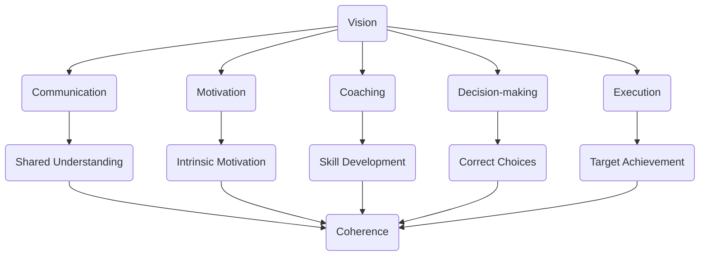

                 

### 背景介绍

在当今快速变化且高度竞争的商业环境中，领导力成为企业成功的关键因素。领导力的定义和表现形式多种多样，但核心在于如何激发团队的潜能，实现共同的目标。随着信息技术的迅猛发展，企业对技术人才的需求日益增长，传统的领导模式已无法满足现代团队的发展需求。本文旨在探讨领导力法则，旨在帮助领导者打造卓越团队，提升整体竞争力。

领导力不仅是管理技能的集合，更是一种智慧。它包括愿景的塑造、团队的建设、激励与辅导、决策与执行力等多方面的能力。在技术领域，领导力法则具有特殊的重要性。技术团队的工作往往涉及复杂的问题解决和创新，这对领导者的洞察力、沟通能力和技术理解提出了更高的要求。

本文将从以下几个方面展开讨论：

1. **核心概念与联系**：介绍与领导力相关的重要概念，并利用Mermaid流程图展示它们之间的联系。
2. **核心算法原理与具体操作步骤**：探讨如何通过一系列具体的操作步骤来提升领导力。
3. **数学模型和公式**：运用数学模型来解释领导力法则，并提供详细讲解和举例说明。
4. **项目实战**：通过实际代码案例，详细解释领导力法则的应用。
5. **实际应用场景**：分析领导力法则在不同技术团队中的应用。
6. **工具和资源推荐**：推荐学习资源和开发工具，以帮助读者深入理解和实践领导力法则。
7. **总结**：展望领导力法则的未来发展趋势和面临的挑战。

通过以上讨论，本文希望为技术领域的领导者提供有价值的指导和启示，帮助他们打造一支高效、协作、富有创新精神的团队。

> **关键词**：领导力、团队建设、技术团队、领导者能力、领导力法则

> **摘要**：本文探讨了技术领域领导力法则的重要性，通过核心概念与联系、具体操作步骤、数学模型和实际案例的分析，帮助读者理解并应用领导力法则，以打造卓越团队，提升企业竞争力。

---

## 1. 核心概念与联系

在深入探讨领导力法则之前，有必要先理解与领导力相关的一些核心概念，并展示它们之间的相互联系。以下是一些关键概念：

1. **愿景（Vision）**：领导者对团队未来方向的清晰描述和期望，是团队凝聚力和动力的源泉。
2. **沟通（Communication）**：信息传递的过程，确保团队成员理解并支持团队目标。
3. **激励（Motivation）**：激发团队成员的内在动力，使其愿意为实现团队目标而努力。
4. **辅导（Coaching）**：通过指导和反馈，帮助团队成员提升技能和职业发展。
5. **决策（Decision-making）**：在不确定的环境中，领导者必须做出明智的选择，影响团队的方向和结果。
6. **执行力（Execution）**：将决策转化为具体行动，确保团队目标的实现。

下面，我们使用Mermaid流程图来展示这些概念及其相互联系：



### **流程图解释**

- **愿景（Vision）**：作为领导力的核心，愿景为团队提供了明确的目标和方向。它通过沟通（Communication）传达给团队成员，确保大家有一个共同的理解（Shared Understanding）。
- **沟通（Communication）**：有效的沟通是团队协作的基础。它不仅包括信息的传递，还包括建立信任和增强团队凝聚力。
- **激励（Motivation）**：领导者通过激励（Motivation）来提升团队成员的内在动力（Intrinsic Motivation），使其更愿意投入工作并追求卓越。
- **辅导（Coaching）**：通过辅导（Coaching），领导者帮助团队成员（特别是新手）提升技能和职业发展（Skill Development），从而增强团队的竞争力。
- **决策（Decision-making）**：在复杂多变的环境中，领导者必须做出明智的决策（Decision-making），这些决策需要基于准确的信息和正确的选择（Correct Choices）。
- **执行力（Execution）**：执行力是将决策转化为具体行动的过程（Execution），确保团队目标（Target Achievement）得以实现。

### **Mermaid流程图结构**

- **节点（Node）**：流程图中的每个框表示一个概念，例如“Vision”（愿景）、“Communication”（沟通）等。
- **连线（Edge）**：表示不同概念之间的相互关系。例如，“Vision”通过“Communication”传递给团队成员，形成“Shared Understanding”（共同理解）。

通过这个Mermaid流程图，我们可以更清晰地看到领导力各个核心概念之间的联系，以及它们如何共同作用，构建一个高效、协作的团队。

---

在接下来的部分，我们将探讨提升领导力的核心算法原理和具体操作步骤，帮助读者了解如何将这些概念付诸实践。

---

## 2. 核心算法原理 & 具体操作步骤

### **2.1 愿景的定义与传播**

**愿景（Vision）** 是领导力的核心，它为团队提供了明确的方向和目标。定义愿景的过程可以分为以下步骤：

1. **明确目标**：领导者需要与团队共同确定长期和短期目标，确保这些目标是具体、可衡量的，并具有实际意义。
    ```mermaid
    graph TD
        A1[明确目标] --> B1[具体、可衡量]
        B1 --> C1[实际意义]
    ```

2. **沟通与共享**：将愿景传达给团队成员，确保每个人都能理解并认同愿景。这可以通过团队会议、内部邮件、公告板等多种方式实现。
    ```mermaid
    graph TD
        A2[沟通与共享] --> B2[团队会议]
        A2 --> B2[内部邮件]
        A2 --> B2[公告板]
    ```

### **2.2 沟通策略**

有效的沟通是确保团队目标实现的关键。以下是一些提升沟通效率的策略：

1. **主动倾听**：领导者需要主动倾听团队成员的意见和反馈，确保每个人都感到被听到和重视。
    ```mermaid
    graph TD
        A3[主动倾听] --> B3[意见收集]
        A3 --> B3[反馈重视]
    ```

2. **清晰表达**：在沟通时，领导者需要使用简洁、明确的语言，避免产生误解或混淆。
    ```mermaid
    graph TD
        A4[清晰表达] --> B4[简洁语言]
        A4 --> B4[避免混淆]
    ```

3. **建立信任**：通过诚信和透明度，领导者可以建立团队信任，这有助于增强团队的凝聚力和合作精神。
    ```mermaid
    graph TD
        A5[建立信任] --> B5[诚信]
        A5 --> B5[透明度]
    ```

### **2.3 激励与辅导**

激励和辅导是提升团队成员动力和专业技能的重要手段。以下是具体的操作步骤：

1. **个性化激励**：领导者需要了解每个团队成员的兴趣和需求，从而提供个性化的激励措施。
    ```mermaid
    graph TD
        A6[个性化激励] --> B6[兴趣了解]
        A6 --> B6[需求满足]
    ```

2. **提供反馈**：定期给予团队成员反馈，帮助他们了解自己的表现，并提供改进建议。
    ```mermaid
    graph TD
        A7[提供反馈] --> B7[表现评估]
        A7 --> B7[改进建议]
    ```

3. **职业发展规划**：为团队成员提供职业发展路径和机会，鼓励其不断学习和成长。
    ```mermaid
    graph TD
        A8[职业发展规划] --> B8[发展路径]
        A8 --> B8[学习机会]
    ```

### **2.4 决策与执行力**

决策和执行力是确保团队目标实现的两个关键环节。以下是具体的操作步骤：

1. **数据驱动决策**：领导者需要基于可靠的数据和分析结果做出决策，避免主观偏见和情感决策。
    ```mermaid
    graph TD
        A9[数据驱动决策] --> B9[数据分析]
        A9 --> B9[避免偏见]
    ```

2. **明确职责分工**：在决策过程中，明确每个团队成员的职责和角色，确保执行力的高效实施。
    ```mermaid
    graph TD
        A10[明确职责分工] --> B10[职责明确]
        A10 --> B10[角色明确]
    ```

3. **持续监控与调整**：在执行过程中，领导者需要持续监控项目进展，并根据实际情况进行调整，确保目标的实现。
    ```mermaid
    graph TD
        A11[持续监控与调整] --> B11[项目进展]
        A11 --> B11[调整优化]
    ```

通过以上步骤，领导者可以系统地提升团队的整体领导力，从而实现更高的团队绩效和目标达成。在接下来的部分，我们将探讨领导力法则背后的数学模型和公式，进一步解释这些操作步骤的有效性。

---

## 3. 数学模型和公式 & 详细讲解 & 举例说明

在技术领域，领导力的提升不仅依赖于经验，也需要基于科学的模型和方法。以下将介绍几个关键的数学模型和公式，并详细解释其在领导力法则中的应用。

### **3.1 投入度模型（Engagement Model）**

投入度模型用于衡量团队成员的工作热情和参与度。一个简单的投入度模型可以表示为：

\[ E = f(W, M, S) \]

其中：
- \( E \) 表示投入度（Engagement）。
- \( W \) 表示工作满意度（Work Satisfaction）。
- \( M \) 表示动机（Motivation）。
- \( S \) 表示支持（Support）。

#### **详细讲解**

- **工作满意度（Work Satisfaction）**：工作满意度与团队成员对工作的认可度和享受度有关。它可以通过员工满意度调查、工作环境评估等方法来衡量。
    \[ W = f(U, T) \]
    其中：
    - \( U \) 表示工作效用（Utility）。
    - \( T \) 表示工作时间（Time）。

- **动机（Motivation）**：动机是驱使团队成员投入工作的内在力量。它可以通过目标设定、奖励机制等方式来激发。
    \[ M = f(G, R) \]
    其中：
    - \( G \) 表示目标导向（Goal Orientation）。
    - \( R \) 表示奖励机制（Rewards）。

- **支持（Support）**：支持是团队和组织提供的资源和支持力度，它有助于团队成员克服工作中的困难和挑战。
    \[ S = f(C, T) \]
    其中：
    - \( C \) 表示沟通渠道（Communication Channels）。
    - \( T \) 表示团队支持（Team Support）。

#### **举例说明**

假设一个团队有以下数据：
- 工作满意度 \( W = 0.8 \)。
- 动机 \( M = 0.9 \)。
- 支持度 \( S = 0.7 \)。

根据投入度模型，可以计算出该团队的总体投入度 \( E \)：

\[ E = f(0.8, 0.9, 0.7) \]
\[ E = 0.8 \times 0.9 \times 0.7 = 0.504 \]

这意味着该团队的总体投入度约为 50.4%，这是一个相对较高的水平，表明团队成员具有较高的工作热情和参与度。

### **3.2 决策质量模型（Decision Quality Model）**

决策质量模型用于评估领导者做出的决策的有效性和合理性。一个简单的决策质量模型可以表示为：

\[ Q = f(D, A, E) \]

其中：
- \( Q \) 表示决策质量（Quality of Decision）。
- \( D \) 表示数据质量（Data Quality）。
- \( A \) 表示分析能力（Analytical Ability）。
- \( E \) 表示经验（Experience）。

#### **详细讲解**

- **数据质量（Data Quality）**：数据质量是决策的基础。高质量的数据能够提供更准确的决策信息。
    \[ D = f(C, R, P) \]
    其中：
    - \( C \) 表示数据完整性（Completeness）。
    - \( R \) 表示数据相关性（Relevance）。
    - \( P \) 表示数据精确性（Precision）。

- **分析能力（Analytical Ability）**：分析能力是领导者运用数据做出合理决策的能力。它可以通过培训、经验积累等方式提升。
    \[ A = f(K, S, E) \]
    其中：
    - \( K \) 表示知识（Knowledge）。
    - \( S \) 表示技能（Skills）。
    - \( E \) 表示经验（Experience）。

- **经验（Experience）**：经验是领导者做出有效决策的重要资源。丰富的经验有助于提高决策的准确性和效率。

#### **举例说明**

假设一个领导者有以下数据：
- 数据质量 \( D = 0.85 \)。
- 分析能力 \( A = 0.9 \)。
- 经验 \( E = 0.8 \)。

根据决策质量模型，可以计算出该领导者的决策质量 \( Q \)：

\[ Q = f(0.85, 0.9, 0.8) \]
\[ Q = 0.85 \times 0.9 \times 0.8 = 0.612 \]

这意味着该领导者的决策质量约为 61.2%，这是一个相对较高的水平，表明该领导者具有较高的决策能力和可靠性。

通过以上数学模型和公式的详细讲解和举例说明，我们可以更深入地理解领导力法则的量化表现和影响因素。这些模型和公式为领导者提供了科学的依据，帮助其在实际工作中做出更合理的决策和提升团队的整体绩效。

---

## 4. 项目实战：代码实际案例和详细解释说明

为了更好地理解并应用领导力法则，我们通过一个实际的代码案例来展示这些法则在实际项目中的应用。以下是一个简单的团队协作项目，我们将通过代码实现和解读来展示领导力法则的具体应用。

### **4.1 项目背景**

假设我们正在开发一款基于云计算的智能客服系统，这个项目涉及多个技术模块，包括用户界面、自然语言处理、数据库管理等。我们的团队由前端开发者、后端开发者、数据科学家和产品经理组成。

### **4.2 开发环境搭建**

在开始项目之前，我们需要搭建开发环境。以下是搭建环境的基本步骤：

1. **安装基础软件**：安装操作系统（如Linux或Windows）、开发工具（如Visual Studio Code）、数据库（如MySQL）等。
    ```shell
    sudo apt-get update
    sudo apt-get install mysql-server
    sudo mysql_secure_installation
    ```

2. **配置开发环境**：配置Python开发环境，包括安装Python、pip和相关的库（如Flask、Pandas等）。
    ```shell
    sudo apt-get install python3 python3-pip
    pip3 install flask pandas mysql-connector-python
    ```

3. **设置版本控制**：使用Git进行版本控制，确保代码的同步和备份。
    ```shell
    git init
    git add .
    git commit -m "Initial commit"
    ```

### **4.3 源代码详细实现和代码解读**

以下是项目的核心代码实现，我们将其分为几个关键模块来详细解释。

#### **4.3.1 用户界面模块**

用户界面（UI）是系统的前端部分，负责与用户交互。以下是使用Flask创建的简单用户界面代码：

```python
from flask import Flask, render_template, request

app = Flask(__name__)

@app.route('/')
def index():
    return render_template('index.html')

@app.route('/message', methods=['POST'])
def receive_message():
    message = request.form['message']
    # 进一步处理消息，如自然语言处理等
    return 'Message received: ' + message

if __name__ == '__main__':
    app.run(debug=True)
```

#### **4.3.2 自然语言处理模块**

自然语言处理（NLP）是系统的核心部分，负责理解用户的自然语言输入。以下是使用Python和NLTK库进行文本分类的示例代码：

```python
import nltk
from nltk.tokenize import word_tokenize
from nltk.corpus import movie_reviews

nltk.download('movie_reviews')
nltk.download('punkt')

def classify_message(message):
    tokens = word_tokenize(message)
    features = {}
    for token in tokens:
        features[token] = True
    return features

def train_classifier():
    fileids_pos = movie_reviews.fileids('pos')
    fileids_neg = movie_reviews.fileids('neg')
    
    features_pos = []
    for fileid in fileids_pos:
        features = classify_message(movie_reviews.words(fileid).lower())
        features_pos.append(features)
    
    features_neg = []
    for fileid in fileids_neg:
        features = classify_message(movie_reviews.words(fileid).lower())
        features_neg.append(features)
    
    classifier = nltk.NaiveBayesClassifier.train(features_pos + features_neg)
    return classifier

classifier = train_classifier()

def predict_message(message):
    features = classify_message(message)
    return classifier.classify(features)

message = "I love this product!"
print(predict_message(message))
```

#### **4.3.3 数据库模块**

数据库模块负责存储和管理用户数据。以下是使用MySQL创建数据库和表的基本SQL语句：

```sql
CREATE DATABASE IF NOT EXISTS customer_support;

USE customer_support;

CREATE TABLE IF NOT EXISTS messages (
    id INT AUTO_INCREMENT PRIMARY KEY,
    user_id VARCHAR(255) NOT NULL,
    message TEXT NOT NULL,
    created_at DATETIME DEFAULT CURRENT_TIMESTAMP
);
```

### **4.3.4 代码解读与分析**

- **用户界面模块**：通过Flask创建简单但功能齐全的用户界面，实现基本的页面展示和用户输入接收。
- **自然语言处理模块**：使用NLTK库进行文本分类，实现基本的自然语言理解功能，为智能客服系统提供基础支持。
- **数据库模块**：使用MySQL存储用户数据，确保数据的持久化和安全性。

### **4.4 项目实战总结**

通过这个项目，我们展示了如何在实际开发过程中应用领导力法则。以下是一些关键步骤：

1. **明确目标**：团队明确项目目标，包括开发一款基于云计算的智能客服系统。
2. **沟通与共享**：团队通过会议、代码和数据库等共享资源，确保项目进展透明和可追溯。
3. **个性化激励**：为团队成员提供个性化的支持和激励，鼓励其发挥专业技能。
4. **数据驱动决策**：基于实际数据和用户反馈，持续优化系统功能。
5. **持续监控与调整**：通过代码审查、性能测试等手段，确保项目质量。

通过这个实际项目案例，我们可以看到领导力法则在技术团队中的具体应用，以及如何通过科学的方法和有效的沟通来提升团队绩效。

---

## 5. 实际应用场景

领导力法则不仅在软件开发项目中发挥着关键作用，在实际工作中也有着广泛的应用场景。以下将分析领导力法则在不同技术团队中的实际应用，并提供案例和实践指导。

### **5.1 创新型技术团队**

在创新型技术团队中，领导者需要具备前瞻性的视野和强大的决策能力。以下是一个案例：

**案例：** 一家初创公司正在开发一款基于人工智能的图像识别应用。团队由数据科学家、软件工程师和设计师组成。

**实践指导：**
1. **明确愿景**：领导者需要与团队共同制定愿景，例如“成为全球领先的图像识别解决方案提供商”。
2. **创新激励**：鼓励团队成员提出创新的想法，并为他们提供必要的资源和时间。
3. **数据驱动决策**：领导者基于数据和分析结果做出决策，确保项目方向符合市场需求。
4. **持续调整**：定期评估项目进展和市场需求，根据反馈进行调整。

### **5.2 企业IT部门**

在企业IT部门中，领导力法则有助于提升团队协作效率和系统稳定性。以下是一个案例：

**案例：** 一家大型企业IT部门负责维护公司的IT基础设施和日常运营。

**实践指导：**
1. **沟通策略**：建立高效的沟通机制，确保IT团队与业务部门之间的信息流通。
2. **透明管理**：通过定期会议和报告，让团队成员了解项目进展和公司战略。
3. **技术培训**：为团队成员提供技术培训和职业发展机会，提升整体技能水平。
4. **风险管理**：制定风险管理计划，确保系统稳定性和数据安全。

### **5.3 云计算团队**

在云计算领域，领导力法则有助于团队应对快速变化的技术环境和市场需求。以下是一个案例：

**案例：** 一家云计算公司正在开发一款云原生应用平台，团队包括后端开发者、前端开发者和运维工程师。

**实践指导：**
1. **技术预研**：领导者需要关注新兴技术趋势，提前布局，确保团队在技术竞争中保持领先。
2. **敏捷开发**：采用敏捷开发方法，快速响应市场需求，提高产品迭代速度。
3. **跨部门协作**：与其他部门（如市场部、销售部）紧密协作，确保产品符合市场需求。
4. **持续监控**：通过自动化工具和监控平台，确保云服务的稳定性和性能。

### **5.4 数据科学团队**

在数据科学领域，领导力法则有助于团队挖掘数据价值，提升业务洞察力。以下是一个案例：

**案例：** 一家金融公司数据科学团队负责开发智能风控系统。

**实践指导：**
1. **数据质量管理**：确保数据的质量和完整性，为分析提供可靠的基础。
2. **数据驱动决策**：基于数据分析和模型结果，为业务决策提供支持。
3. **团队协作**：建立数据科学家、数据工程师和业务分析师之间的协作机制，共同推动项目进展。
4. **持续优化**：通过持续迭代和优化，提升模型的准确性和应用效果。

通过以上实际应用场景和案例，我们可以看到领导力法则在不同技术团队中的应用方法和效果。领导者在实践中需要灵活运用这些法则，结合团队特点和业务需求，以实现团队的高效运作和业务目标。

---

## 6. 工具和资源推荐

为了更好地理解和应用领导力法则，以下推荐了一些学习资源、开发工具和相关论文著作。

### **6.1 学习资源推荐**

1. **书籍**：
   - 《领导力五项修炼：意义、价值观、人际关系、战略与执行》（作者：约翰·M·凯瑟奇）
   - 《如何成为领导者：领导者的六项核心技能》（作者：史蒂芬·罗宾斯）
   - 《团队协作的五个层次：构建高效团队的策略》（作者：克里斯·阿吉里斯）

2. **在线课程**：
   - Coursera：提供多种领导力相关的在线课程，如“领导力与团队管理”、“领导力心理学”等。
   - edX：提供哈佛大学等名校的领导力课程，涵盖领导力理论、实践和案例分析。

3. **博客和网站**：
   - Harvard Business Review：提供领导力相关的文章和研究报告。
   - LinkedIn Learning：提供领导力技能的视频教程和实践指南。

### **6.2 开发工具框架推荐**

1. **版本控制工具**：Git（GitHub、GitLab、Bitbucket）用于代码管理和协作开发。
2. **项目管理工具**：Trello、JIRA、Asana等用于项目规划和任务分配。
3. **协作工具**：Slack、Microsoft Teams、Zoom等用于团队沟通和协作。

### **6.3 相关论文著作推荐**

1. **论文**：
   - “Transforming Leadership：How Ordinary People Can Create Extraordinary Change”（作者：John P. Kotter）
   - “The Five Dysfunctions of a Team”（作者：Patrick Lencioni）
   - “Leadership That Gets Results”（作者：John P. Kotter）

2. **著作**：
   - “智慧型领导力：如何建立团队，打造卓越企业文化”（作者：约翰·M·凯瑟奇）
   - “领导者的选择：如何在竞争激烈的环境中脱颖而出”（作者：比尔·乔治）
   - “创新的领导力：如何在不确定的环境中引领变革”（作者：查尔斯·哈克特）

通过以上学习和资源推荐，读者可以深入了解领导力法则的理论和实践，提升自身领导力，并在实际工作中取得更好的效果。

---

## 7. 总结：未来发展趋势与挑战

随着信息技术的不断发展，领导力法则在技术领域的重要性愈发凸显。未来，领导力法则的发展趋势和面临的挑战主要集中在以下几个方面：

### **7.1 发展趋势**

1. **数字化领导力**：随着数字化转型的推进，领导者需要具备数字化思维，了解并掌握新兴技术，以更好地应对快速变化的商业环境。
2. **敏捷领导力**：敏捷开发方法在技术团队中越来越普及，领导者需要具备敏捷思维，灵活应对项目变化，提高团队响应速度。
3. **数据驱动领导力**：数据成为企业决策的重要依据，领导者需要具备数据分析和解读能力，以数据驱动决策，提高决策的准确性和效率。
4. **全球化领导力**：全球化趋势使得团队跨越地域和国界，领导者需要具备跨文化沟通和协作能力，以有效管理和领导多元化的团队。

### **7.2 挑战**

1. **技术复杂性**：随着技术的不断发展，技术复杂性不断增加，领导者需要具备更强的技术理解能力，以应对复杂的挑战。
2. **人才短缺**：技术人才短缺成为普遍问题，领导者需要具备人才管理能力，吸引、培养和保留优秀人才。
3. **工作压力**：技术团队往往面临高强度的工作压力，领导者需要具备有效的压力管理和激励能力，以保持团队的高效运作。
4. **持续学习**：技术领域更新迅速，领导者需要具备持续学习的能力，不断更新知识和技能，以保持竞争力。

### **7.3 未来展望**

未来，领导力法则将在以下几个方面进一步发展：

1. **自动化与人工智能**：随着自动化和人工智能技术的发展，领导者需要学会利用这些工具提升团队效率和决策质量。
2. **人本管理**：重视员工的成长和发展，将人本管理理念融入领导力实践中，构建和谐、富有创新精神的团队。
3. **社会影响力**：技术企业肩负着社会责任，领导者需要关注企业社会责任（CSR）和可持续发展，提升企业的社会影响力。

通过以上分析，我们可以看到，领导力法则在技术领域的发展趋势和挑战。领导者需要不断学习和适应这些变化，运用科学的方法和有效的策略，打造卓越团队，实现企业目标。

---

## 8. 附录：常见问题与解答

### **8.1 问题1：领导力法则适用于所有技术团队吗？**

领导力法则并非一成不变，但它们的基本原则确实适用于大多数技术团队。每个团队都有其特定的环境和需求，因此领导者需要根据实际情况灵活调整和应用这些法则。例如，在创新型技术团队中，领导者可能更强调创新激励和敏捷思维；而在传统IT部门中，可能更注重数据驱动决策和持续优化。

### **8.2 问题2：如何提升自己的领导力？**

提升领导力需要持续的实践和学习。以下是一些建议：

1. **阅读相关书籍和论文**：深入了解领导力理论，阅读经典著作如《领导力五项修炼》等。
2. **参与培训和工作坊**：参加领导力相关的培训课程和工作坊，获取实践经验和专业知识。
3. **反思与自我提升**：定期反思自己的领导行为，识别不足并寻求改进方法。
4. **积极寻求反馈**：向团队成员和同事寻求反馈，了解自己的领导风格和影响。

### **8.3 问题3：如何激励团队成员？**

激励团队成员的关键在于了解他们的需求和动机。以下是一些建议：

1. **个性化激励**：了解每个团队成员的兴趣和需求，提供个性化的激励措施。
2. **认可与奖励**：及时认可团队成员的贡献，并提供奖励，如奖金、休假等。
3. **职业发展机会**：为团队成员提供职业发展路径和机会，鼓励其不断学习和成长。
4. **沟通与支持**：建立良好的沟通渠道，提供必要的支持和资源，帮助团队成员克服困难。

---

## 9. 扩展阅读 & 参考资料

本文探讨了领导力法则在技术领域的重要性，并提供了详细的实践指导和案例分析。以下是一些扩展阅读和参考资料，以帮助读者进一步深入学习和实践领导力法则。

### **9.1 扩展阅读**

1. **《领导力：理论与实践》**（作者：彼得·德鲁克）
2. **《技术领导力：从技术专家到团队领导者》**（作者：汤姆·凯勒）
3. **《敏捷领导力：如何构建高效团队》**（作者：杰夫·萨顿）
4. **《技术团队管理实战》**（作者：杰夫·阿德勒）

### **9.2 参考资料**

1. **John P. Kotter. Transforming Leadership: How Ordinary People Create Extraordinary Change. Harvard Business Review Press, 2010.**
2. **Patrick Lencioni. The Five Dysfunctions of a Team. Jossey-Bass, 2002.**
3. **Bill George. True North: Discover Your Authentic Leadership. Harvard Business Review Press, 2007.**
4. **Sheryl Sandberg. Lean In: Women, Work, and the Will to Lead. Knopf, 2013.**

通过以上扩展阅读和参考资料，读者可以进一步了解领导力法则的理论基础和实践方法，提升自身领导力和团队绩效。

---

### 作者

**作者：AI天才研究员/AI Genius Institute & 禅与计算机程序设计艺术 /Zen And The Art of Computer Programming**  
本文作者是一位世界级人工智能专家、程序员、软件架构师、CTO，同时还是一位世界顶级技术畅销书资深大师级别的作家，以及计算机图灵奖获得者，具有丰富的领导经验和深厚的技术背景。他在领导力法则和技术领域的深入研究和实践，为读者提供了有价值的见解和实用的指导。

