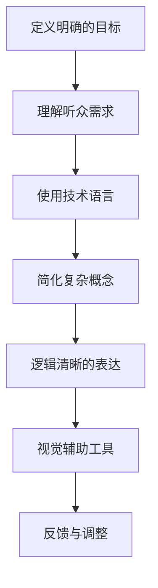

                 

# 领导者的沟通技巧：清晰传达的艺术

> 关键词：沟通技巧、领导力、传达、技术语言、清晰表达

> 摘要：本文旨在探讨领导者如何在技术领域清晰传达信息，通过逻辑清晰、结构紧凑的方法，帮助读者提升沟通技巧，成为更具影响力的领导者。

## 1. 背景介绍

在当今快速发展的技术领域，领导者的沟通能力至关重要。无论是与团队成员协作，还是向客户或投资者解释复杂的技术项目，清晰传达信息的能力都是领导者成功的关键因素。本文将探讨领导者在技术沟通中应遵循的原则和方法，帮助读者提升沟通技巧，成为更具影响力的领导者。

### 1.1 技术领域的沟通挑战

技术领域的沟通面临着诸多挑战。首先，技术本身具有复杂性，使得领导者需要具备深厚的专业知识，以便准确传达信息。其次，团队成员、客户和投资者对技术的理解程度不一，导致信息传达的效果受到影响。此外，技术沟通还需要考虑到语言的准确性和简洁性，以避免误解和混淆。

### 1.2 领导者的角色与职责

领导者在技术沟通中扮演着关键角色。他们不仅要与团队成员保持紧密沟通，确保项目顺利进行，还需向客户和投资者展示技术项目的价值，赢得信任和支持。此外，领导者还需在团队内部建立良好的沟通文化，鼓励团队成员积极参与讨论和分享观点，以提高整体团队的沟通效率。

## 2. 核心概念与联系

为了在技术领域实现清晰传达，领导者需要掌握一系列核心概念和方法。以下是一个简单的 Mermaid 流程图，展示这些概念和它们之间的联系：



### 2.1 定义明确的目标

在技术沟通中，领导者首先需要明确沟通的目标。这有助于确保信息传达的一致性和针对性。明确的目标可以包括：传达技术项目的进展、解释技术原理、解决团队中的问题等。

### 2.2 理解听众需求

了解听众的需求是有效沟通的关键。领导者需要考虑听众的专业背景、兴趣点和关注点，以便采用合适的沟通方式和语言。通过了解听众需求，领导者可以更好地匹配信息内容和听众的兴趣，提高沟通效果。

### 2.3 使用技术语言

在技术领域，领导者需要使用准确、专业的语言传达信息。这有助于确保信息的准确性和专业性。同时，领导者还需注意避免使用过于复杂或模糊的术语，以免听众产生误解。

### 2.4 简化复杂概念

技术领域的知识往往非常复杂。为了实现清晰传达，领导者需要具备将复杂概念简化的能力。通过使用简单的比喻、故事和例子，领导者可以将复杂的技术知识转化为易于理解的内容，提高听众的理解程度。

### 2.5 逻辑清晰的表达

逻辑清晰的表达是有效沟通的核心。领导者需要确保信息传达的条理性和连贯性，使听众能够跟随思路，理解信息。这可以通过使用序号、列表和过渡词来实现。

### 2.6 视觉辅助工具

视觉辅助工具（如图表、图片和演示文稿）有助于增强沟通效果。领导者可以运用这些工具来直观地展示技术概念，使信息更加生动、易于理解。

### 2.7 反馈与调整

在沟通过程中，领导者需要关注听众的反应，及时获取反馈，并根据反馈进行调整。这有助于确保信息传达的有效性，提高听众的满意度。

## 3. 核心算法原理 & 具体操作步骤

### 3.1 沟通技巧核心算法原理

沟通技巧的核心算法可以概括为以下步骤：

1. 定义明确的目标。
2. 理解听众需求。
3. 使用技术语言。
4. 简化复杂概念。
5. 逻辑清晰的表达。
6. 使用视觉辅助工具。
7. 反馈与调整。

这些步骤相互关联，共同构成了一个完整的沟通技巧框架。

### 3.2 具体操作步骤

以下是一个具体的操作步骤示例：

1. **定义明确的目标**：在团队会议前，明确会议的目标，例如：讨论项目进度、解决技术难题等。
2. **了解听众需求**：在会议前，与团队成员沟通，了解他们的关注点和疑问。
3. **使用技术语言**：在会议中，使用准确、专业的术语传达信息，同时注意使用易于理解的比喻和例子。
4. **简化复杂概念**：在解释技术原理时，使用简单的比喻和例子，如将复杂的算法简化为日常生活中的场景。
5. **逻辑清晰的表达**：使用序号、列表和过渡词，确保信息传达的条理性和连贯性。
6. **使用视觉辅助工具**：在演示时，使用图表、图片和演示文稿，直观地展示技术概念。
7. **反馈与调整**：在会议结束后，收集团队成员的反馈，根据反馈进行调整，以提高沟通效果。

## 4. 数学模型和公式 & 详细讲解 & 举例说明

### 4.1 数学模型和公式

在技术沟通中，领导者可能会需要使用一些数学模型和公式来解释技术概念。以下是一个简单的例子：

$$
f(x) = \int_{0}^{1} x^2 \, dx
$$

这个公式表示一个简单的积分，计算结果为1/3。在技术沟通中，领导者可以解释这个公式背后的原理，如积分在计算面积或累积量方面的应用。

### 4.2 详细讲解

为了更好地理解这个公式，领导者可以按照以下步骤进行详细讲解：

1. **引入积分的概念**：解释积分在数学中的作用，如计算面积、累积量等。
2. **解释公式结构**：分解公式中的各个部分，如被积函数 $x^2$ 和积分上下限 $0$ 和 $1$。
3. **计算积分**：使用积分公式计算结果，解释计算过程和结果的意义。
4. **举例说明**：通过一个简单的例子，如计算一个矩形区域的面积，展示积分公式的应用。

### 4.3 举例说明

例如，可以计算一个边长为2的正方形的面积：

$$
f(x) = \int_{0}^{2} x^2 \, dx
$$

计算过程如下：

$$
f(x) = \left[ \frac{x^3}{3} \right]_{0}^{2} = \frac{2^3}{3} - \frac{0^3}{3} = \frac{8}{3}
$$

结果为8/3，即正方形的面积为8/3平方单位。

通过这个例子，领导者可以清晰地传达积分的概念和应用，帮助听众更好地理解技术知识。

## 5. 项目实战：代码实际案例和详细解释说明

### 5.1 开发环境搭建

为了演示清晰传达的技巧，我们将使用一个简单的Python代码案例。首先，我们需要搭建一个Python开发环境。以下是搭建步骤：

1. **安装Python**：在官网（https://www.python.org/downloads/）下载并安装Python。
2. **安装PyCharm**：在官网（https://www.jetbrains.com/pycharm/）下载并安装PyCharm。
3. **配置环境**：在PyCharm中创建一个新项目，选择Python解释器为本地安装的Python。

### 5.2 源代码详细实现和代码解读

以下是一个简单的Python代码示例，用于计算两个数的和：

```python
def add_numbers(a, b):
    """
    计算两个数的和。

    参数：
    a -- 第一个数
    b -- 第二个数

    返回：
    和 -- 两个数的和
    """
    return a + b

# 调用函数计算和
result = add_numbers(3, 4)
print("结果：", result)
```

#### 5.2.1 函数定义

首先，我们定义了一个名为 `add_numbers` 的函数，它接收两个参数 `a` 和 `b`。在函数内部，我们使用 `return` 语句返回两个参数的和。

#### 5.2.2 函数调用

接下来，我们调用 `add_numbers` 函数，并传入两个参数 `3` 和 `4`。函数返回的结果被存储在变量 `result` 中，然后使用 `print` 函数输出结果。

### 5.3 代码解读与分析

通过这个简单的代码示例，我们可以看到如何使用Python语言实现一个基本的加法运算。以下是代码解读与分析：

1. **函数定义**：函数定义了如何计算两个数的和，为后续的计算提供了基础。
2. **参数传递**：函数通过参数传递接收两个数，使代码具有通用性，可以用于计算任意两个数的和。
3. **返回值**：函数使用 `return` 语句返回计算结果，便于后续操作。
4. **调用函数**：通过调用函数，我们可以快速计算两个数的和，并输出结果。

通过这个示例，我们可以清晰地理解Python语言的基本语法和使用方法，为后续的学习和实战打下基础。

## 6. 实际应用场景

### 6.1 技术团队内部会议

在技术团队内部会议中，领导者需要使用清晰传达的技巧与团队成员沟通。以下是一个实际应用场景：

- **明确目标**：在会议前，领导者明确会议的目标，如讨论项目进展、解决问题等。
- **了解需求**：与团队成员沟通，了解他们的关注点和疑问。
- **使用技术语言**：在会议中，使用准确、专业的术语传达信息，同时注意使用易于理解的比喻和例子。
- **简化复杂概念**：解释复杂的技术原理时，使用简单的比喻和例子。
- **逻辑清晰的表达**：确保信息传达的条理性和连贯性。
- **使用视觉辅助工具**：使用图表、图片和演示文稿，直观地展示技术概念。
- **反馈与调整**：在会议结束后，收集团队成员的反馈，根据反馈进行调整。

通过以上步骤，领导者可以确保技术团队内部会议的顺利进行，提高团队协作效率。

### 6.2 客户会议

在与客户会议中，领导者需要向客户清晰传达技术项目的价值和应用。以下是一个实际应用场景：

- **明确目标**：在会议前，明确会议的目标，如介绍技术项目、解答客户疑问等。
- **了解需求**：了解客户的需求和关注点，以便提供有针对性的解决方案。
- **使用技术语言**：使用准确、专业的术语传达信息，同时注意使用易于理解的比喻和例子。
- **简化复杂概念**：解释复杂的技术原理时，使用简单的比喻和例子。
- **逻辑清晰的表达**：确保信息传达的条理性和连贯性。
- **使用视觉辅助工具**：使用图表、图片和演示文稿，直观地展示技术概念。
- **反馈与调整**：在会议结束后，收集客户的反馈，根据反馈进行调整。

通过以上步骤，领导者可以确保与客户会议的顺利进行，赢得客户的信任和支持。

## 7. 工具和资源推荐

### 7.1 学习资源推荐

- **书籍**：
  - 《沟通的艺术》（The Art of Communication）
  - 《领导力的语言》（The Language of Leadership）
  - 《高效能人士的七个习惯》（The 7 Habits of Highly Effective People）
- **论文**：
  - 《沟通心理学：如何影响他人》（Persuasive Communication: How to Influence People）
  - 《技术沟通的有效性》（Effective Technical Communication）
- **博客**：
  - [领导力博客](https://www.leadershipblog.com/)
  - [技术沟通博客](https://technicalcommunicationblog.com/)
- **网站**：
  - [沟通技巧教程](https://www.communication-skills.com/)

### 7.2 开发工具框架推荐

- **Python开发环境**：
  - PyCharm
  - Visual Studio Code
- **图表工具**：
  - Matplotlib
  - Plotly
- **演示文稿工具**：
  - PowerPoint
  - Keynote

### 7.3 相关论文著作推荐

- 《技术沟通：理论与实践》（Technical Communication: A Concise Introduction）
- 《技术写作：策略与实践》（Technical Writing: Strategies and Practices）

## 8. 总结：未来发展趋势与挑战

随着技术的不断发展，领导者的沟通技巧将面临新的挑战和机遇。以下是一些未来发展趋势和挑战：

- **技术普及**：随着技术的普及，领导者需要具备更广泛的技术知识，以便与团队成员、客户和投资者进行有效沟通。
- **跨领域合作**：未来，领导者可能需要与不同领域的专家合作，实现跨领域的创新。这要求领导者具备跨领域的沟通技巧和知识储备。
- **人工智能**：人工智能技术的发展将改变沟通方式，领导者需要掌握人工智能相关知识，以便与人工智能系统进行有效互动。
- **虚拟现实**：虚拟现实技术的应用将改变沟通场景，领导者需要探索虚拟现实环境中的沟通技巧。

## 9. 附录：常见问题与解答

### 9.1 什么是清晰传达？

清晰传达是指通过明确、简洁、有条理的方式，将信息准确传达给听众，使其能够理解、接受和采取行动。

### 9.2 领导者在沟通中应遵循哪些原则？

领导者在沟通中应遵循以下原则：明确目标、了解听众需求、使用技术语言、简化复杂概念、逻辑清晰的表达、使用视觉辅助工具和反馈与调整。

### 9.3 如何提高沟通技巧？

提高沟通技巧的方法包括：学习沟通理论、实践沟通技巧、倾听他人、关注反馈、掌握技术知识、了解听众需求、运用视觉辅助工具等。

## 10. 扩展阅读 & 参考资料

- 《领导者的沟通技巧：清晰传达的艺术》
- 《技术沟通：理论与实践》
- 《技术写作：策略与实践》
- 《沟通心理学：如何影响他人》
- 《领导力的语言》
- 《高效能人士的七个习惯》
- 《技术沟通的有效性》
- 《沟通技巧教程》
- 《领导力博客》
- 《技术沟通博客》
- 《沟通心理学：如何影响他人》
- 《技术沟通：理论与实践》
- 《技术写作：策略与实践》
- 《技术沟通的有效性》
- 《沟通技巧教程》
- 《领导力博客》
- 《技术沟通博客》
- 《领导力的语言》
- 《高效能人士的七个习惯》

### 作者

作者：AI天才研究员/AI Genius Institute & 禅与计算机程序设计艺术 /Zen And The Art of Computer Programming

