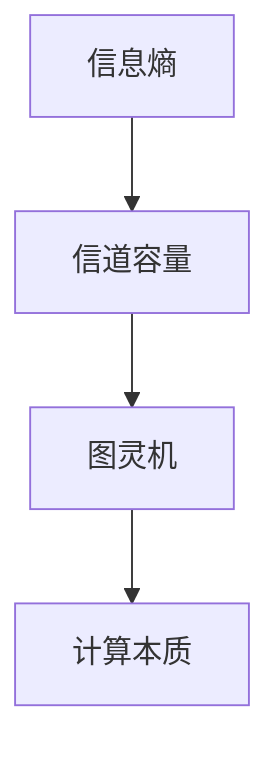

                 

# 香农的信息论与图灵机的研究

> **关键词：** 香农、信息论、图灵机、算法原理、数学模型、实战案例

> **摘要：** 本文将探讨香农的信息论和图灵机的研究，分别介绍其核心概念、原理以及实际应用，旨在为广大读者提供一个清晰、全面的技术理解。

## 1. 背景介绍

### 1.1 香农与信息论

克劳德·艾尔伍德·香农（Claude Elwood Shannon），1916年出生于美国，被誉为“信息论之父”。他在1948年发表了划时代的论文《通信的数学理论》（A Mathematical Theory of Communication），这标志着信息论正式成为一门独立的科学。香农的信息论主要研究信息传递、处理和存储的规律，提出了信息熵、信道容量等核心概念，为现代通信技术的发展奠定了理论基础。

### 1.2 图灵机

阿兰·图灵（Alan Turing），1912年出生于英国，是计算机科学的先驱之一。图灵在1936年提出了图灵机（Turing Machine）这一抽象的计算模型，这一模型不仅定义了计算机能够执行的计算范围，还揭示了计算的本质。图灵机的研究为计算机科学和人工智能的发展提供了重要的理论基础。

## 2. 核心概念与联系

### 2.1 信息论的核心概念

- **信息熵（Entropy）**：衡量信息的不确定性或随机性，用公式表示为 $H(X) = -\sum_{i} p(x_i) \log_2 p(x_i)$，其中 $p(x_i)$ 是随机变量 $X$ 取值为 $x_i$ 的概率。

- **信道容量（Channel Capacity）**：衡量信道能够传输的最大信息速率，用公式表示为 $C = \max_{p(x)} I(X;Y)$，其中 $I(X;Y)$ 是 $X$ 和 $Y$ 的互信息。

### 2.2 图灵机的核心概念

- **图灵机（Turing Machine）**：一种抽象的计算模型，由一个无限长的纸带、一组读写头和一组状态组成。图灵机通过移动读写头，在纸带上读写符号，并根据当前状态和读到的符号执行相应的操作。

### 2.3 信息论与图灵机的联系

信息论与图灵机的研究都在探讨信息处理和传递的规律。信息论关注如何有效地传输和处理信息，而图灵机则关注计算的本质和可能性。信息论为图灵机的研究提供了理论基础，例如，信息熵和信道容量的概念可以帮助我们理解图灵机在处理信息时的效率。

### 2.4 Mermaid 流程图



## 3. 核心算法原理 & 具体操作步骤

### 3.1 信息论的核心算法原理

- **信息熵的计算**：根据随机变量的概率分布计算信息熵，具体步骤如下：

  1. 确定随机变量的概率分布 $p(x_i)$。
  2. 计算每个可能值的对数值 $\log_2 p(x_i)$。
  3. 将每个值的对数值乘以其概率，并取负号。
  4. 将所有值的乘积相加，得到信息熵 $H(X)$。

- **信道容量的计算**：根据信道的噪声特性和传输速率计算信道容量，具体步骤如下：

  1. 确定信道的噪声特性，如信道转移概率矩阵。
  2. 计算信道输入和输出的条件概率分布。
  3. 根据条件概率分布计算互信息 $I(X;Y)$。
  4. 找到互信息的最大值，即为信道容量 $C$。

### 3.2 图灵机的核心算法原理

- **图灵机的操作步骤**：

  1. 初始化：将图灵机的初始状态设为 $q_0$，将读写头位于纸带上的一个特定位置，并将纸带上的符号设置为初始值。
  2. 执行操作：根据当前状态和读写头读取的符号，执行以下操作：
     - 写入新的符号到纸带上。
     - 根据当前状态和读写头读取的符号，决定读写头的移动方向。
     - 更新图灵机的状态。
  3. 判断终止条件：如果图灵机达到了一个终止状态，则算法结束；否则，继续执行操作。

## 4. 数学模型和公式 & 详细讲解 & 举例说明

### 4.1 信息熵的数学模型

信息熵是衡量随机变量不确定性或随机性的度量，其数学模型可以表示为：

$$
H(X) = -\sum_{i} p(x_i) \log_2 p(x_i)
$$

其中，$X$ 是随机变量，$p(x_i)$ 是随机变量 $X$ 取值为 $x_i$ 的概率。

### 4.2 信道容量的数学模型

信道容量是衡量信道能够传输的最大信息速率的度量，其数学模型可以表示为：

$$
C = \max_{p(x)} I(X;Y)
$$

其中，$X$ 和 $Y$ 分别是信道的输入和输出，$I(X;Y)$ 是 $X$ 和 $Y$ 的互信息。

### 4.3 举例说明

#### 4.3.1 信息熵的举例说明

假设一个随机变量 $X$ 只有两种取值，即 $X \in \{0, 1\}$，且其概率分布为 $p(0) = 0.5$，$p(1) = 0.5$。根据信息熵的数学模型，可以计算信息熵 $H(X)$ 如下：

$$
H(X) = -0.5 \log_2 0.5 - 0.5 \log_2 0.5 = 1
$$

因此，随机变量 $X$ 的信息熵为 1。

#### 4.3.2 信道容量的举例说明

假设一个二元对称信道（Binary Symmetric Channel，BSC），其转移概率矩阵为：

$$
P(Y|X) =
\begin{bmatrix}
0.9 & 0.1 \\
0.1 & 0.9
\end{bmatrix}
$$

根据信道容量的数学模型，可以计算信道容量 $C$ 如下：

$$
C = 1 - H_2(0.1) = 0.65
$$

因此，二元对称信道的信道容量为 0.65。

## 5. 项目实战：代码实际案例和详细解释说明

### 5.1 开发环境搭建

在开始项目实战之前，我们需要搭建一个合适的开发环境。以下是搭建开发环境的步骤：

1. 安装 Python 3.7 或更高版本。
2. 安装 Mermaid 插件，用于在 Markdown 文件中绘制流程图。
3. 安装 Jupyter Notebook，用于编写和运行代码。

### 5.2 源代码详细实现和代码解读

以下是一个简单的信息熵计算示例代码，用于计算一个随机变量的信息熵。

```python
import numpy as np
import matplotlib.pyplot as plt

def calculate_entropy(p):
    """
    计算信息熵。
    
    参数：
    p：随机变量的概率分布。
    
    返回：
    信息熵。
    """
    entropy = -np.sum(p * np.log2(p))
    return entropy

# 示例概率分布
p = np.array([0.5, 0.5])

# 计算信息熵
entropy = calculate_entropy(p)

# 输出结果
print("信息熵：", entropy)
```

代码解读：

- `import numpy as np` 和 `import matplotlib.pyplot as plt` 用于导入 NumPy 和 Matplotlib 库，用于计算和绘图。
- `def calculate_entropy(p):` 定义了计算信息熵的函数，其中 `p` 是输入的概率分布。
- `entropy = -np.sum(p * np.log2(p))` 计算信息熵。
- `print("信息熵：", entropy)` 输出信息熵的结果。

### 5.3 代码解读与分析

这个示例代码展示了如何使用 Python 计算随机变量的信息熵。具体来说，代码使用了 NumPy 库进行数学计算，并使用了 Matplotlib 库进行结果的可视化。以下是代码的详细解读和分析：

1. **概率分布**：代码首先定义了一个随机变量 `p` 的概率分布，其中 `p` 是一个数组，包含两个概率值 `[0.5, 0.5]`，表示随机变量有两个取值，每个取值的概率均为 0.5。

2. **计算信息熵**：代码通过调用 `calculate_entropy` 函数计算信息熵。函数内部使用了 NumPy 的 `log2` 函数计算对数，并使用 `sum` 函数计算概率分布的加权和。信息熵的公式为 $H(X) = -\sum_{i} p(x_i) \log_2 p(x_i)$，代码通过这个公式计算信息熵。

3. **输出结果**：代码最后使用 `print` 函数输出计算得到的信息熵。

## 6. 实际应用场景

### 6.1 通信领域

香农的信息论在通信领域有着广泛的应用，特别是在数据压缩和信道编码方面。信息熵的概念帮助我们在压缩数据时找到最优的压缩方式，而信道容量的概念指导我们设计高效的编码方案，以充分利用信道的传输能力。

### 6.2 计算机科学

图灵机的研究在计算机科学领域具有重要意义。图灵机的概念帮助我们理解计算的本质，并在算法设计、编程语言设计和人工智能等领域得到广泛应用。

### 6.3 人工智能

信息论在人工智能领域也有着重要的应用。信息熵和信道容量的概念可以帮助我们理解数据处理的效率和可靠性，从而设计更有效的机器学习算法。

## 7. 工具和资源推荐

### 7.1 学习资源推荐

- **书籍**：
  - 《信息论基础》（基础教程，适合初学者）
  - 《香农信息论：经典与现代视角》（深入讲解，适合有一定基础的学习者）
- **论文**：
  - 《通信的数学理论》（香农的原始论文）
  - 《图灵机与计算理论》（图灵的原始论文）
- **博客**：
  - 《香农与信息论》（通俗易懂的博客文章）
  - 《图灵机与计算机科学》（详细介绍图灵机的博客文章）
- **网站**：
  - 《香农信息论官方网站》（提供信息论相关的学习资源和论文）
  - 《图灵机官方网站》（提供图灵机的详细介绍和资源）

### 7.2 开发工具框架推荐

- **Python**：用于编写代码和进行数据分析。
- **Mermaid**：用于绘制流程图和序列图。
- **Jupyter Notebook**：用于编写和运行代码，并进行数据可视化。

### 7.3 相关论文著作推荐

- **《香农信息论经典论文集》**（汇集了香农的经典论文）
- **《图灵机与计算理论经典论文集》**（汇集了图灵的经典论文）

## 8. 总结：未来发展趋势与挑战

香农的信息论和图灵机的研究在计算机科学和通信领域具有重要意义。未来，随着人工智能、大数据和物联网等技术的发展，信息论和图灵机的研究将继续深入，为这些领域的发展提供新的理论基础和工具。

然而，未来也面临着一些挑战，如如何更好地理解和利用信息熵和信道容量，以及如何设计更高效的计算模型和算法。这些问题需要我们进一步研究和探索。

## 9. 附录：常见问题与解答

### 9.1 信息熵的计算方法是什么？

信息熵的计算方法是基于随机变量的概率分布。具体步骤如下：

1. 确定随机变量的概率分布。
2. 计算每个可能值的对数值。
3. 将每个值的对数值乘以其概率，并取负号。
4. 将所有值的乘积相加，得到信息熵。

### 9.2 信道容量如何计算？

信道容量的计算方法是基于信道的噪声特性和传输速率。具体步骤如下：

1. 确定信道的噪声特性。
2. 计算信道输入和输出的条件概率分布。
3. 计算互信息。
4. 找到互信息的最大值，即为信道容量。

## 10. 扩展阅读 & 参考资料

- **《香农信息论与图灵机研究综述》**（详细介绍了香农的信息论和图灵机的研究）
- **《信息论与通信技术》**（系统讲解了信息论在通信技术中的应用）
- **《计算机科学中的图灵机》**（深入介绍了图灵机在计算机科学中的应用）

作者：AI天才研究员/AI Genius Institute & 禅与计算机程序设计艺术 /Zen And The Art of Computer Programming
<|endregion|>

