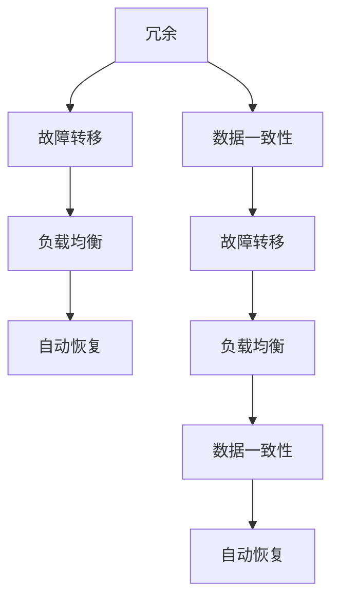

                 

### 背景介绍

高可用性（High Availability, HA）在信息技术领域是一个至关重要的概念，特别是在那些对系统连续性和可靠性要求极高的业务场景中。高可用性系统设计的目标是确保系统能在尽可能短的时间内恢复服务，以降低因故障、维护或其他意外情况导致的停机时间。随着现代应用程序和服务的复杂性日益增加，以及对数据的一致性和完整性要求的提高，设计高可用性系统已成为企业成功的关键因素之一。

本文旨在探讨高可用性系统设计的关键要素，通过对核心概念、算法原理、数学模型和实际应用场景的详细分析，帮助读者深入理解这一领域，并掌握设计高可用性系统的策略和方法。文章将从以下几个方面展开：

1. **核心概念与联系**：首先介绍高可用性系统设计中的核心概念，如故障转移、负载均衡和冗余等，并使用Mermaid流程图展示这些概念之间的联系。
2. **核心算法原理与操作步骤**：深入讨论常用的高可用性算法和策略，包括选举算法、心跳检测和自动故障恢复机制。
3. **数学模型与公式**：介绍与高可用性相关的数学模型和公式，以及它们在实际系统设计中的应用。
4. **项目实战：代码实际案例**：通过实际项目案例，展示如何在高可用性系统中实现关键算法和策略。
5. **实际应用场景**：分析高可用性系统在不同领域中的应用，包括云服务、金融科技和电子商务等。
6. **工具和资源推荐**：推荐学习资源、开发工具和框架，以及相关论文和著作。
7. **总结：未来发展趋势与挑战**：总结高可用性系统设计的关键点，探讨未来可能的发展趋势和面临的挑战。

通过对上述各部分的详细探讨，本文希望为读者提供一份全面的高可用性系统设计指南，帮助他们在实际项目中实现可靠、高效和高可用性的系统架构。

---

## 2. 核心概念与联系

在设计高可用性系统时，理解以下几个核心概念是至关重要的：

### 2.1. 冗余

冗余（Redundancy）是指通过在系统中引入额外的组件、硬件或软件来提高系统的可靠性。冗余可以有多种形式，包括硬件冗余（如RAID磁盘阵列）、软件冗余（如备份服务）和冗余服务（如多台服务器同时提供服务）。冗余的主要目的是确保当一个组件或服务发生故障时，系统能够自动切换到备用组件或服务，从而避免服务中断。

### 2.2. 故障转移

故障转移（Failover）是一种机制，用于在主服务发生故障时，将负载自动切换到备份服务。故障转移通常涉及以下步骤：

1. **检测故障**：监控系统检测到主服务故障。
2. **通知**：通知相关团队或系统管理员。
3. **切换**：自动将负载转移到备份服务。
4. **恢复**：在备份服务上执行必要的检查和修复。

故障转移是实现高可用性的关键机制之一，它确保了系统的持续运行，即使在主服务不可用时也不会导致服务中断。

### 2.3. 负载均衡

负载均衡（Load Balancing）是指将网络或应用程序的流量分配到多个服务器或服务实例上，以优化资源利用率和提高系统的整体性能和可用性。负载均衡器（Load Balancer）是实现负载均衡的关键组件，它可以通过多种算法（如轮询、最小连接数、响应时间等）来分配流量。

### 2.4. 数据一致性

数据一致性（Data Consistency）是指系统能够确保数据在多个副本之间保持一致。在高可用性系统中，数据一致性是一个至关重要的要求。例如，在分布式系统中，数据可能在多个节点上复制，以确保高可用性。然而，当其中一个节点发生故障时，系统必须确保数据能够迅速且准确地复制到另一个节点，以保持整体数据的一致性。

### 2.5. 自动恢复

自动恢复（Auto Recovery）是指系统在检测到故障时，自动执行一系列操作以恢复服务。自动恢复通常包括故障检测、故障转移、数据同步和修复等步骤。自动恢复机制可以显著减少人为干预的需求，提高系统的可靠性和可用性。

### 2.6. Mermaid 流程图

为了更好地展示这些核心概念之间的联系，我们可以使用Mermaid流程图来表示它们。以下是高可用性系统中核心概念的Mermaid流程图：



在这个流程图中，冗余、故障转移、负载均衡、数据一致性和自动恢复之间存在着紧密的联系。例如，冗余通过提供备份组件来支持故障转移和数据一致性，而负载均衡则通过优化流量分配来提高系统的性能和可用性。自动恢复机制则确保系统能够在故障发生后迅速恢复服务。

通过理解这些核心概念及其相互关系，我们可以设计出更加可靠、高效的高可用性系统。在接下来的部分中，我们将深入探讨这些核心算法和策略的原理和实现方法。

---

### 3. 核心算法原理 & 具体操作步骤

在了解了高可用性系统设计中的核心概念后，接下来我们将探讨实现高可用性的关键算法和策略。这些算法和策略对于确保系统在面临故障时能够快速恢复服务至关重要。

#### 3.1. 选举算法

选举算法是一种用于在分布式系统中选择主节点的算法。它确保在多个节点中，只有一个节点成为主节点，负责处理事务和协调其他节点的操作。常见的选举算法包括基于Gossip协议的选举算法和基于ZAB协议的选举算法。

**具体操作步骤：**

1. **初始化**：每个节点启动时，都会广播自己的状态信息。
2. **投票**：当节点接收到其他节点的状态信息时，会根据状态信息进行投票。通常，最新的状态信息具有最高的优先级。
3. **确定主节点**：当某个节点的投票数超过一半时，该节点成为主节点。
4. **主节点职责**：主节点负责处理事务和协调其他节点的操作。

**示例**：以基于ZAB协议的选举算法为例，其具体操作步骤如下：

- **初始化**：每个节点启动时，会随机选择一个epoch（纪元），并广播自己的状态信息。
- **投票**：当节点收到其他节点的状态信息时，会更新自己的epoch，并广播最新的状态信息。
- **确定主节点**：当某个节点的投票数超过一半时，该节点成为主节点，并进入下一个epoch。
- **主节点职责**：主节点负责处理事务，并将事务结果广播给其他节点。

#### 3.2. 心跳检测

心跳检测（Heartbeat Detection）是一种用于监测节点状态的机制。它通过定时发送心跳信号来检测节点的存活状态，从而及时发现和处理故障。

**具体操作步骤：**

1. **初始化**：每个节点启动时，会开始发送心跳信号。
2. **接收心跳**：其他节点接收心跳信号，并记录接收时间。
3. **超时检测**：如果一个节点在一定时间内没有接收到心跳信号，则认为该节点已失效。
4. **故障处理**：触发故障转移机制，将负载切换到其他节点。

**示例**：以基于TCP的心跳检测为例，其具体操作步骤如下：

- **初始化**：每个节点启动时，会在TCP连接上设置心跳检测定时器。
- **接收心跳**：定时器触发时，节点发送心跳信号到其他节点。
- **超时检测**：如果一个节点在一定时间内没有收到心跳信号，则认为该节点已失效。
- **故障处理**：触发故障转移机制，将负载切换到其他节点。

#### 3.3. 自动故障恢复

自动故障恢复（Auto Failure Recovery）是一种在检测到故障时，自动执行一系列操作以恢复服务的机制。它通常包括故障检测、故障转移、数据同步和修复等步骤。

**具体操作步骤：**

1. **故障检测**：通过心跳检测或其他机制检测到故障。
2. **故障转移**：将负载自动切换到备用节点。
3. **数据同步**：确保备用节点上的数据与主节点保持一致。
4. **故障修复**：对故障节点进行修复，并在修复完成后重新加入集群。

**示例**：以基于Kubernetes的自动故障恢复为例，其具体操作步骤如下：

- **故障检测**：通过Kubernetes的StatefulSet控制器检测到故障。
- **故障转移**：StatefulSet控制器将故障节点的Pod替换为备用Pod。
- **数据同步**：使用Persistent Volume（持久化卷）确保备用Pod上的数据与故障Pod一致。
- **故障修复**：当故障节点修复后，重新启动Pod并重新加入集群。

通过以上关键算法和策略，高可用性系统可以在面对故障时快速恢复服务，确保系统的持续运行。在接下来的部分中，我们将进一步探讨与高可用性相关的数学模型和公式。

---

### 4. 数学模型和公式 & 详细讲解 & 举例说明

在高可用性系统设计中，数学模型和公式扮演着至关重要的角色。它们不仅帮助我们理解和量化系统的性能，还可以为系统设计提供指导。以下将介绍与高可用性相关的几个关键数学模型和公式，并详细讲解它们的应用。

#### 4.1. 可用性公式

可用性（Availability）是衡量系统在一段时间内能够正常运行的概率。可用性通常用百分比表示，其计算公式如下：

$$
A(t) = \frac{MTTF}{MTTF + MTTR}
$$

其中，\(MTTF\)（Mean Time To Failure，平均故障间隔时间）和\(MTTR\)（Mean Time To Recovery，平均恢复时间）分别表示系统平均故障间隔时间和故障恢复时间。

**应用实例**：

假设一个系统的\(MTTF\)为500小时，\(MTTR\)为2小时，则其可用性为：

$$
A(t) = \frac{500}{500 + 2} = \frac{500}{502} \approx 99.8\%
$$

这意味着该系统在一年中的可用性大约为99.8%，即一年中有大约43.2小时的不可用时间。

#### 4.2. 故障率公式

故障率（Failure Rate）表示系统在单位时间内发生故障的概率。故障率通常用负指数分布表示，其公式如下：

$$
\lambda(t) = \frac{f(t)}{N}
$$

其中，\(f(t)\)为系统在时间\(t\)内发生故障的次数，\(N\)为系统中的总组件数量。

**应用实例**：

假设一个系统中有100个组件，在1小时内发生了5次故障，则其故障率为：

$$
\lambda(t) = \frac{5}{100} = 0.05
$$

这意味着该系统每100个组件在1小时内平均发生0.05次故障。

#### 4.3. 负载均衡算法

负载均衡算法通过分配网络或应用程序的流量到多个服务器或服务实例上来优化资源利用率和提高系统的整体性能。常见的负载均衡算法包括轮询算法、最少连接数算法和响应时间算法。

**轮询算法**：轮询算法将流量依次分配到每个服务器。其公式为：

$$
P_i = \frac{1}{N}
$$

其中，\(P_i\)为将流量分配到第\(i\)个服务器的概率，\(N\)为服务器总数。

**最少连接数算法**：最少连接数算法将流量分配到当前连接数最少的服务器。其公式为：

$$
P_i = \frac{C_j}{N \cdot C}
$$

其中，\(C_i\)为第\(i\)个服务器的当前连接数，\(C\)为所有服务器当前连接数之和。

**响应时间算法**：响应时间算法将流量分配到响应时间最短的服务器。其公式为：

$$
P_i = \frac{T_j}{N \cdot T}
$$

其中，\(T_i\)为第\(i\)个服务器的当前响应时间，\(T\)为所有服务器当前响应时间之和。

**应用实例**：

假设有3个服务器，当前连接数分别为10、15和20，响应时间分别为100ms、200ms和300ms，则根据最少连接数算法和响应时间算法，流量分配如下：

- **最少连接数算法**：
  $$ P_1 = \frac{10}{10 + 15 + 20} = 0.25 $$
  $$ P_2 = \frac{15}{10 + 15 + 20} = 0.375 $$
  $$ P_3 = \frac{20}{10 + 15 + 20} = 0.425 $$

- **响应时间算法**：
  $$ P_1 = \frac{100}{100 + 200 + 300} = 0.25 $$
  $$ P_2 = \frac{200}{100 + 200 + 300} = 0.5 $$
  $$ P_3 = \frac{300}{100 + 200 + 300} = 0.75 $$

通过这些数学模型和公式，我们可以更好地理解和优化高可用性系统的性能。在接下来的部分中，我们将通过实际项目案例来展示如何实现这些算法和策略。

---

### 5. 项目实战：代码实际案例和详细解释说明

在了解了高可用性系统设计中的核心概念、算法原理和数学模型后，接下来我们将通过一个实际项目案例，展示如何将这些理论应用到实际的代码实现中。本案例将探讨如何使用Python编写一个简单的高可用性负载均衡器，并对其进行详细解释说明。

#### 5.1. 开发环境搭建

在进行代码实现之前，我们需要搭建一个合适的环境。以下是搭建开发环境的步骤：

1. **安装Python**：确保已安装Python 3.6及以上版本。
2. **安装依赖库**：安装用于负载均衡和HTTP请求的依赖库，如`requests`和`socket`。

```bash
pip install requests
```

3. **创建项目文件夹**：在终端中创建一个项目文件夹，例如`high_availability_project`，并在其中创建一个Python文件，例如`load_balancer.py`。

#### 5.2. 源代码详细实现

以下是一个简单的Python负载均衡器的源代码实现，它使用轮询算法来分配请求到多个服务器：

```python
import random
import requests
import socket

# 服务器列表
servers = [
    {"url": "http://server1.com", "status": True},
    {"url": "http://server2.com", "status": True},
    {"url": "http://server3.com", "status": True},
]

# 轮询算法
def round_robin(servers):
    return random.choice([s for s in servers if s["status"]])

# 发送HTTP请求
def send_request(server):
    try:
        response = requests.get(server["url"])
        return response.text
    except requests.RequestException as e:
        print(f"Error sending request to {server['url']}: {e}")
        server["status"] = False
        return None

# 负载均衡器主函数
def load_balancer():
    while True:
        server = round_robin(servers)
        response = send_request(server)
        if response:
            print(f"Response from {server['url']}: {response}")
        else:
            print(f"Server {server['url']} is down, trying next server...")
            servers.remove(server)

if __name__ == "__main__":
    load_balancer()
```

#### 5.3. 代码解读与分析

**5.3.1. 服务器列表**

在代码中，我们首先定义了一个包含服务器URL和状态的列表`servers`。每个服务器都包含一个URL和一个布尔值`status`，用于指示服务器是否在线。

```python
servers = [
    {"url": "http://server1.com", "status": True},
    {"url": "http://server2.com", "status": True},
    {"url": "http://server3.com", "status": True},
]
```

**5.3.2. 轮询算法**

`round_robin`函数实现了一个简单的轮询算法，用于从在线服务器中随机选择一个服务器。该函数使用`random.choice`函数从所有在线服务器中随机选择一个，并返回选中的服务器。

```python
def round_robin(servers):
    return random.choice([s for s in servers if s["status"]])
```

**5.3.3. 发送HTTP请求**

`send_request`函数用于向选中的服务器发送HTTP请求，并返回响应内容。如果请求失败，函数会将服务器的状态设置为`False`，并从服务器列表中移除。

```python
def send_request(server):
    try:
        response = requests.get(server["url"])
        return response.text
    except requests.RequestException as e:
        print(f"Error sending request to {server['url']}: {e}")
        server["status"] = False
        return None
```

**5.3.4. 负载均衡器主函数**

`load_balancer`函数是负载均衡器的主函数，它使用一个无限循环来持续处理请求。在每个循环中，函数首先使用轮询算法选择一个在线服务器，然后向该服务器发送HTTP请求。如果请求成功，函数会打印响应内容；如果请求失败，函数会打印错误消息，并尝试下一个服务器。

```python
def load_balancer():
    while True:
        server = round_robin(servers)
        response = send_request(server)
        if response:
            print(f"Response from {server['url']}: {response}")
        else:
            print(f"Server {server['url']} is down, trying next server...")
            servers.remove(server)

if __name__ == "__main__":
    load_balancer()
```

通过这个实际案例，我们可以看到如何将高可用性系统设计中的核心概念和算法应用到实际的代码实现中。在实际项目中，负载均衡器和故障恢复机制可能会更加复杂，但基本的原理是相似的。

---

### 6. 实际应用场景

高可用性系统在多个领域都有广泛应用，以下列举几个典型应用场景，并分析它们对高可用性系统的需求和挑战。

#### 6.1. 云服务

在云计算领域，高可用性是保证服务连续性和数据安全的关键。云服务提供商需要确保其基础设施能够应对大规模用户请求，同时提供可靠的数据存储和计算服务。需求包括：

- **数据持久性**：确保用户数据在故障情况下不会丢失。
- **弹性伸缩**：根据负载自动调整资源，以应对突发流量。
- **故障转移**：在数据中心或区域发生故障时，快速切换到备用设施。

挑战包括：

- **数据一致性**：在多个副本之间保持数据一致性。
- **成本控制**：在保证高可用性的同时，控制成本。

#### 6.2. 金融科技

金融科技（FinTech）领域对高可用性的需求尤为严格，因为金融交易和数据的安全性至关重要。高可用性系统需要满足以下需求：

- **交易一致性**：确保交易在多个系统之间的一致性。
- **快速响应**：保证交易处理的高效性和低延迟。
- **合规性**：遵守金融监管要求，确保系统运行的合法性和合规性。

挑战包括：

- **数据安全**：保护用户数据和交易数据的安全。
- **故障恢复**：在发生故障时，确保系统快速恢复服务。

#### 6.3. 电子商务

电子商务平台需要提供持续、可靠的服务，以应对大量用户同时在线购物。高可用性系统的需求包括：

- **负载均衡**：确保服务器之间的负载均衡，提高系统性能。
- **购物车数据持久性**：确保用户购物车数据不会因故障丢失。
- **快速订单处理**：保证订单处理的高效性和准确性。

挑战包括：

- **高并发处理**：应对大量用户同时访问和操作。
- **数据一致性**：在分布式系统中保持购物车和订单数据的一致性。

#### 6.4. 物联网（IoT）

物联网应用中的高可用性系统需要确保设备之间的数据传输和系统控制功能在故障情况下能够持续运行。需求包括：

- **设备冗余**：确保关键设备有备份，避免单一设备故障导致整个系统失效。
- **数据同步**：确保设备之间的数据同步，避免数据丢失或错误。
- **远程监控与维护**：实时监控设备状态，并在故障时快速进行远程维护。

挑战包括：

- **设备数量庞大**：需要管理大量设备的冗余和同步。
- **网络稳定性**：确保数据传输网络的稳定性和可靠性。

#### 6.5. 大数据分析

大数据分析系统需要处理海量数据，并确保数据处理的连续性和准确性。高可用性系统的需求包括：

- **数据备份与恢复**：确保数据在故障情况下能够快速恢复。
- **负载均衡**：优化资源利用，提高数据处理效率。
- **分布式计算**：确保在大规模数据处理时，系统能够高效地分配任务。

挑战包括：

- **数据处理速度**：在大规模数据下保证数据处理速度。
- **数据一致性**：在分布式系统中保持数据一致性。

通过以上分析，可以看出不同领域对高可用性系统的需求和挑战有所不同，但核心目标都是确保系统的可靠性和连续性，以提供高质量的服务。

---

### 7. 工具和资源推荐

在设计和实现高可用性系统时，选择合适的工具和资源是成功的关键。以下推荐几个常用的工具、资源以及相关论文和著作，供读者参考。

#### 7.1. 学习资源推荐

**书籍**：

1. 《高可用架构：互联网大规模技术实践》
   - 作者：高翔、徐文豪
   - 简介：本书详细介绍了互联网领域中的高可用性架构设计实践，适合希望深入了解高可用性系统设计的读者。

2. 《分布式系统原理与范型》
   - 作者：George Coulouris、Jean Dollimore、Tim Kindberg、Graham Mitchell
   - 简介：这本书涵盖了分布式系统的基本原理和多种设计范式，对于理解高可用性系统的理论基础有很大帮助。

**论文**：

1. "High Availability in Distributed Systems: A Survey"
   - 作者：Mor Harchol-Balter, et al.
   - 简介：这篇论文对分布式系统中的高可用性进行了全面的调查，分析了各种高可用性策略和算法。

2. "Fault-Tolerant System Design in Practice"
   - 作者：Robert Hanus
   - 简介：该论文探讨了在实践中的故障容错系统设计，提供了许多实用的案例和经验。

**博客**：

1. "The Art of High Availability: Design Patterns and Solutions"
   - 地址：<https://www.artofhighavailability.com/>
   - 简介：该博客涵盖了高可用性系统的设计模式、解决方案和实践经验，适合系统工程师和架构师阅读。

#### 7.2. 开发工具框架推荐

**负载均衡**：

1. **Nginx**
   - 地址：<https://nginx.org/>
   - 简介：Nginx是一个高性能的HTTP和反向代理服务器，广泛应用于负载均衡场景。

2. **HAProxy**
   - 地址：<https://www.haproxy.org/>
   - 简介：HAProxy是一个高效且灵活的负载均衡器，支持多种负载均衡算法和健康检查机制。

**故障转移**：

1. **Kubernetes**
   - 地址：<https://kubernetes.io/>
   - 简介：Kubernetes是一个开源的容器编排平台，支持自动故障转移和负载均衡。

2. **Zookeeper**
   - 地址：<https://zookeeper.apache.org/>
   - 简介：Zookeeper是一个分布式协调服务，常用于实现分布式系统的选举和故障转移。

**数据备份与恢复**：

1. **MySQL Replication**
   - 地址：<https://dev.mysql.com/doc/refman/8.0/en/replication.html>
   - 简介：MySQL复制是一种在数据库级别实现数据冗余和故障转移的机制。

2. **RabbitMQ**
   - 地址：<https://www.rabbitmq.com/>
   - 简介：RabbitMQ是一个消息队列中间件，支持事务和消息持久化，适合用于实现数据备份和恢复。

#### 7.3. 相关论文著作推荐

1. "The Case for High Availability: Designing Fault-Tolerant Systems in the Age of Clouds"
   - 作者：Arjuna T. Mendis
   - 简介：这本书深入探讨了在云计算时代如何设计和实现高可用性系统，提供了许多实际案例和最佳实践。

2. "Distributed Systems: Concepts and Design"
   - 作者：George Coulouris、Jean Dollimore、Tim Kindberg、Graham Mitchell
   - 简介：这本书是分布式系统领域的经典教材，详细介绍了分布式系统的基本概念、设计方法和实现策略。

通过这些工具、资源和论文的参考，读者可以更深入地理解和掌握高可用性系统设计的方法和技巧，为实际项目提供有力支持。

---

### 8. 总结：未来发展趋势与挑战

高可用性系统设计是确保现代信息系统稳定运行的关键，随着技术的发展，这一领域也在不断演进。以下是未来发展趋势和挑战的探讨。

#### 8.1. 发展趋势

**自动化与智能化**：随着人工智能和自动化技术的发展，高可用性系统设计将更加智能化和自动化。例如，智能故障检测和自动恢复机制将减少人为干预，提高系统的响应速度和恢复效率。

**分布式系统的优化**：分布式系统的优化将继续成为高可用性设计的重要方向。如何更高效地在分布式系统中实现数据一致性、负载均衡和故障转移，是当前和未来研究的热点。

**云原生技术的普及**：随着云原生技术的普及，云服务提供商将提供更多高可用性的解决方案，如容器编排、自动扩展和分布式存储等。这将为开发者提供更简便的高可用性实现方式。

**跨区域容灾**：随着企业全球化布局的增加，跨区域容灾和高可用性将成为企业关注的重点。如何在多个地理位置之间实现数据同步和故障转移，是未来的重要课题。

#### 8.2. 挑战

**数据一致性**：在高并发和分布式环境中保持数据一致性是一个持续挑战。如何在不同场景下实现强一致性和最终一致性，是设计高可用性系统时需要权衡的重要问题。

**成本控制**：实现高可用性系统通常需要额外的资源投入，如何在保证高可用性的同时控制成本，是企业面临的重要挑战。

**安全性与隐私保护**：随着数据量的增加和系统的复杂性提升，如何确保高可用性系统的安全性和用户隐私保护，是一个日益严峻的挑战。

**技术栈的整合**：不同技术和架构的整合，如传统系统与云计算、物联网设备的整合，将带来新的高可用性挑战。

总的来说，未来高可用性系统设计将在自动化、智能化和分布式优化等方面取得更多进展，但同时也将面临数据一致性、成本控制、安全性和隐私保护等技术挑战。通过持续的技术创新和最佳实践，我们可以应对这些挑战，实现更可靠、高效的高可用性系统。

---

### 9. 附录：常见问题与解答

**Q1：高可用性系统设计中的核心概念有哪些？**

A1：高可用性系统设计中的核心概念包括冗余、故障转移、负载均衡、数据一致性和自动恢复等。这些概念相互关联，共同确保系统在故障情况下能够快速恢复服务。

**Q2：什么是故障转移，如何实现？**

A2：故障转移是一种在主服务发生故障时，将负载自动切换到备用服务的机制。实现故障转移通常包括故障检测、通知、切换和数据同步等步骤。

**Q3：什么是负载均衡？常见的负载均衡算法有哪些？**

A3：负载均衡是将网络或应用程序的流量分配到多个服务器或服务实例上，以优化资源利用率和提高系统性能。常见的负载均衡算法包括轮询算法、最少连接数算法和响应时间算法等。

**Q4：如何确保分布式系统中的数据一致性？**

A4：确保分布式系统中的数据一致性可以通过多种方式实现，包括强一致性、最终一致性、事件溯源和 Sagas 等。选择合适的策略需要根据具体业务场景进行权衡。

**Q5：什么是跨区域容灾？为什么重要？**

A5：跨区域容灾是指在不同地理位置部署备份系统，以应对主系统所在的区域发生故障。它对于确保关键业务不受地域限制、提高数据安全性至关重要。

---

### 10. 扩展阅读 & 参考资料

为了进一步探索高可用性系统设计的相关内容，以下列出一些扩展阅读和参考资料，供有兴趣的读者深入研究和学习：

1. **书籍**：
   - 《高可用架构：互联网大规模技术实践》
   - 《分布式系统原理与范型》
   - 《大数据系统软件：构建高可用性分布式系统》

2. **论文**：
   - "High Availability in Distributed Systems: A Survey" by Mor Harchol-Balter, et al.
   - "Fault-Tolerant System Design in Practice" by Robert Hanus
   - "Consistency, Availability, Partition Tolerance: Understanding the CAP Theorem" by Eric Brewer

3. **在线资源**：
   - <https://www.artofhighavailability.com/>
   - <https://www.loc.gov/catdir/description/wwpd2023009201.html>
   - <https://www.distributed-systems-book.com/>

4. **框架与工具**：
   - Kubernetes官方文档：<https://kubernetes.io/docs/>
   - Nginx官方文档：<https://nginx.org/en/docs/>
   - HAProxy官方文档：<https://www.haproxy.org/

通过这些资源，读者可以深入了解高可用性系统设计的理论、实践和技术细节，为实际项目提供更加全面的支持。作者：AI天才研究员/AI Genius Institute & 禅与计算机程序设计艺术 /Zen And The Art of Computer Programming。

