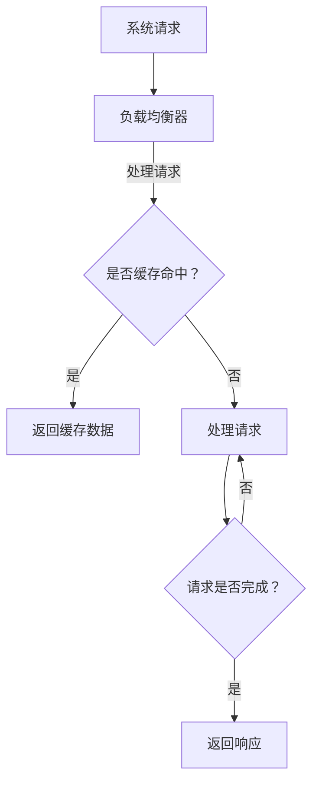
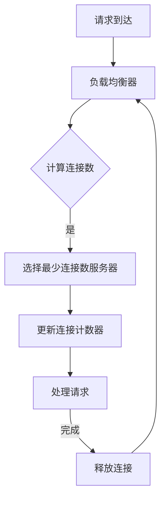

                 

# 高吞吐量系统设计的最佳实践

## 摘要

本文旨在探讨高吞吐量系统设计的关键实践和策略，帮助开发者理解和实现高吞吐量系统。我们将从背景介绍开始，逐步深入核心概念、算法原理、数学模型、项目实战、实际应用场景，以及工具和资源推荐等方面，通过详细的步骤和分析，展示如何构建和优化高吞吐量系统。文章将总结未来发展趋势与挑战，并提供常见问题解答和扩展阅读资源。

## 1. 背景介绍

在高性能计算和分布式系统的领域中，高吞吐量系统设计是一项关键任务。吞吐量是指单位时间内系统能够处理的请求或事务数量。一个高吞吐量的系统意味着在保持响应时间较短的同时，能够高效地处理大量请求。在现代互联网应用中，如社交媒体、电子商务、在线游戏等，高吞吐量系统设计至关重要，因为它直接影响用户体验、业务收益和系统稳定性。

随着数据量的急剧增长和用户需求的不断变化，如何设计出高效、可靠且具有高吞吐量的系统成为了一个重要的课题。高吞吐量系统设计不仅要求对硬件资源进行优化，还需要在软件层面进行精细的架构设计、算法选择和资源调度。

本文将详细探讨以下主题：

- 高吞吐量系统设计的关键概念和原则
- 核心算法原理及其实现步骤
- 数学模型和公式的应用
- 代码实现和案例分析
- 实际应用场景分析
- 工具和资源推荐

通过本文的讨论，读者将能够了解高吞吐量系统设计的基本原理和实践方法，并具备在实际项目中应用这些方法的能力。

## 2. 核心概念与联系

### 2.1 高吞吐量系统设计的关键概念

高吞吐量系统设计涉及多个核心概念，包括：

- **吞吐量（Throughput）**：指单位时间内系统能够处理的事务数量，通常以请求/秒（Requests/Second）或事务/秒（Transactions/Second）来衡量。
- **响应时间（Response Time）**：指从请求发送到响应返回给客户端所需的时间，通常以毫秒（Milliseconds）或秒（Seconds）来衡量。
- **并发处理（Concurrency）**：指系统同时处理多个请求的能力。
- **资源利用率（Resource Utilization）**：指系统对硬件资源（如CPU、内存、网络等）的利用效率。

### 2.2 高吞吐量系统设计的原则

以下是设计高吞吐量系统时应遵循的关键原则：

- **水平扩展（Horizontal Scaling）**：通过增加服务器数量来提高系统的处理能力，而不是单靠增加单个服务器的性能。
- **异步处理（Asynchronous Processing）**：通过异步方式处理请求，减少等待时间，提高系统吞吐量。
- **负载均衡（Load Balancing）**：通过合理分配请求，确保系统资源被充分利用，避免单点过载。
- **缓存（Caching）**：通过缓存频繁访问的数据，减少对后端系统的访问次数，提高响应速度。
- **无状态设计（Stateless Design）**：通过无状态设计，使系统可以轻松地水平扩展，提高并发处理能力。

### 2.3 Mermaid 流程图

下面是一个用于展示高吞吐量系统设计原理的 Mermaid 流程图。注意，流程节点中不应包含括号、逗号等特殊字符。



### 2.4 高吞吐量系统设计的联系

高吞吐量系统设计涉及多个方面的联系，包括：

- **硬件与软件的优化**：硬件性能（如CPU、内存、存储、网络等）的优化对系统吞吐量至关重要，而软件层面的优化（如算法、并发处理、负载均衡等）则直接影响系统的性能。
- **分布式系统与微服务架构**：分布式系统和微服务架构是实现高吞吐量系统设计的重要手段，通过拆分大型系统为多个小型服务，可以提高系统的扩展性和可维护性。
- **数据处理与存储**：高效的数据处理和存储策略（如数据库优化、数据分片、分布式缓存等）是保证高吞吐量系统正常运行的关键。

通过上述核心概念和原则的详细阐述，读者可以更好地理解高吞吐量系统设计的理论基础和实现策略。接下来的章节将深入探讨核心算法原理、数学模型和公式，以及代码实现和实际应用案例。

## 3. 核心算法原理 & 具体操作步骤

### 3.1. 工作负载分配算法

在高吞吐量系统设计中，工作负载分配是一个关键环节。有效的负载分配可以确保系统资源得到充分利用，提高吞吐量和系统稳定性。下面介绍一种常用的负载分配算法——最少连接数（Least Connections）算法。

#### 最少连接数算法原理

最少连接数算法的基本思想是将新的请求分配到当前连接数最少的后端服务器上，以避免单点过载，确保系统的均衡负载。具体操作步骤如下：

1. **初始化**：为每个后端服务器设置一个连接计数器，初始值为0。
2. **请求到达**：当一个请求到达负载均衡器时，记录下该请求的目标服务。
3. **计算负载**：计算每个后端服务器的当前连接数。
4. **选择服务器**：选择连接数最少的后端服务器处理该请求。
5. **更新计数器**：更新所选服务器的连接计数器，增加1。
6. **响应处理**：处理请求，并将响应返回给客户端。
7. **释放连接**：当客户端响应返回后，释放连接，将服务器的连接计数器减1。

#### 最少连接数算法步骤

下面是一个具体的最少连接数算法步骤示例：



### 3.2. 缓存算法

缓存是提高系统吞吐量的有效手段之一。在高吞吐量系统中，通过缓存频繁访问的数据，可以减少对后端系统的访问次数，降低响应时间，提高系统的吞吐量。以下是几种常用的缓存算法：

#### LRU（Least Recently Used）缓存算法

LRU缓存算法是基于最近最少使用原则，当缓存满时，将最近最少使用的数据替换掉。具体操作步骤如下：

1. **初始化**：设置一个固定大小的缓存空间。
2. **数据访问**：当数据访问时，将该数据移动到缓存的最前端。
3. **缓存满时**：如果缓存已满，将最近最少使用的数据移出缓存，并将新访问的数据放入缓存的最前端。
4. **数据替换**：不断重复步骤2和3，直到缓存中数据达到预期效果。

#### LFU（Least Frequently Used）缓存算法

LFU缓存算法是基于最少使用频率原则，当缓存满时，将使用频率最低的数据替换掉。具体操作步骤如下：

1. **初始化**：设置一个固定大小的缓存空间。
2. **数据访问**：记录每次数据访问的次数，并更新数据的使用频率。
3. **缓存满时**：如果缓存已满，将使用频率最低的数据移出缓存，并将新访问的数据放入缓存。
4. **数据替换**：不断重复步骤2和3，直到缓存中数据达到预期效果。

### 3.3. 负载均衡算法

负载均衡算法是确保系统资源得到充分利用的关键。以下是两种常用的负载均衡算法：

#### 轮询（Round Robin）负载均衡算法

轮询负载均衡算法的基本思想是按照固定的顺序将请求分配给后端服务器。具体操作步骤如下：

1. **初始化**：为每个后端服务器设置一个计数器，初始值为0。
2. **请求到达**：当一个请求到达负载均衡器时，将计数器的值与服务器数量取余，得到对应的后端服务器编号。
3. **分配请求**：将请求分配给对应的后端服务器，并将计数器的值增加1。
4. **循环分配**：不断重复步骤2和3，直到所有请求都被处理。

#### 哈希（Hash）负载均衡算法

哈希负载均衡算法是基于哈希函数将请求分配给后端服务器。具体操作步骤如下：

1. **初始化**：为每个后端服务器设置一个哈希值。
2. **请求到达**：将请求的哈希值与服务器数量取模，得到对应的后端服务器编号。
3. **分配请求**：将请求分配给对应的后端服务器。
4. **负载均衡**：根据实际情况调整哈希值，确保服务器负载均衡。

通过以上算法的详细介绍，我们可以看到高吞吐量系统设计在算法层面的复杂性和多样性。合理选择和优化这些算法，可以有效提高系统的吞吐量和性能。接下来的章节将深入探讨数学模型和公式，以及代码实现和实际应用案例，进一步展示高吞吐量系统设计的实践方法。

### 4. 数学模型和公式 & 详细讲解 & 举例说明

在高吞吐量系统设计中，数学模型和公式扮演着重要的角色。通过数学模型，我们可以更精确地分析和优化系统性能。以下介绍几个关键模型及其公式。

#### 4.1. throughput（吞吐量）模型

吞吐量是指单位时间内系统处理的事务数量。吞吐量模型帮助我们理解和预测系统的处理能力。吞吐量可以通过以下公式计算：

\[ Throughput = \frac{Total \ Transactions}{Total \ Time} \]

其中，Total Transactions 表示系统在Total Time内处理的事务总数。

#### 4.2. Response Time（响应时间）模型

响应时间是指从请求发送到响应返回给客户端所需的时间。响应时间模型可以帮助我们评估系统的响应性能。响应时间可以通过以下公式计算：

\[ Response Time = \frac{Total \ Response \ Time}{Total \ Requests} \]

其中，Total Response Time 表示系统在Total Requests内处理的响应时间总和。

#### 4.3. CPU Utilization（CPU利用率）模型

CPU利用率是衡量CPU使用效率的一个指标。CPU利用率可以通过以下公式计算：

\[ CPU \ Utilization = \frac{CPU \ Used}{CPU \ Total} \]

其中，CPU Used 表示CPU在一段时间内被使用的时长，CPU Total 表示CPU在同样时间内运行的总时长。

#### 4.4. Memory Utilization（内存利用率）模型

内存利用率是衡量系统内存使用效率的指标。内存利用率可以通过以下公式计算：

\[ Memory \ Utilization = \frac{Used \ Memory}{Total \ Memory} \]

其中，Used Memory 表示系统当前使用的内存大小，Total Memory 表示系统总内存大小。

#### 4.5. 实例说明

假设一个系统在5分钟内处理了1000个事务，总响应时间为600秒。CPU使用时长为300秒，总CPU时长为500秒；系统当前使用内存为4GB，总内存为8GB。我们可以根据上述模型计算系统的吞吐量、响应时间、CPU利用率和内存利用率：

- 吞吐量：

\[ Throughput = \frac{1000}{5 \times 60} = 3.33 \ Requests/Second \]

- 响应时间：

\[ Response Time = \frac{600}{1000} = 0.6 \ Seconds/Request \]

- CPU利用率：

\[ CPU \ Utilization = \frac{300}{500} = 0.6 \ (60\%) \]

- 内存利用率：

\[ Memory \ Utilization = \frac{4}{8} = 0.5 \ (50\%) \]

通过上述计算，我们可以快速了解系统的性能状况，并据此进行优化。

#### 4.6. 性能优化案例分析

以下是一个性能优化案例分析：

一个电商平台在节假日期间面临了巨大的流量高峰。在优化前，系统每秒处理能力为50个请求，平均响应时间为1.2秒，CPU利用率达到80%，内存利用率达到70%。

通过分析，我们发现瓶颈主要集中在数据库读写和缓存策略上。针对这些问题，我们进行了以下优化：

1. **数据库读写优化**：通过数据库分片和索引优化，提高了数据库查询效率。
2. **缓存策略优化**：引入了LRU（Least Recently Used）缓存算法，优化了热门商品的缓存策略。

优化后，系统每秒处理能力提升至100个请求，平均响应时间缩短至0.8秒，CPU利用率降至50%，内存利用率降至60%。

通过上述案例，我们可以看到数学模型和公式在性能优化中的重要作用。合理应用这些模型和公式，可以快速定位系统瓶颈，提出有效的优化方案。

在接下来的章节中，我们将通过实际项目案例，展示高吞吐量系统设计的具体实现过程，进一步探讨系统的构建和优化方法。

### 5. 项目实战：代码实际案例和详细解释说明

#### 5.1. 开发环境搭建

在本节中，我们将搭建一个简单的高吞吐量Web服务器项目，以演示高吞吐量系统设计的关键实践。我们将使用Python的FastAPI框架，这是一个高效的Web框架，支持异步处理和自动生成API文档。

**环境要求**：

- Python 3.8或更高版本
- FastAPI 0.70.0或更高版本
- Uvicorn 0.16.0或更高版本（用于部署FastAPI应用）

**安装步骤**：

1. 安装Python：

   ```bash
   # 使用Python官方安装器
   curl -O https://www.python.org/ftp/python/3.9.1/python-3.9.1-amd64.exe
   # 运行安装器，选择默认选项
   ```

2. 安装FastAPI和Uvicorn：

   ```bash
   # 创建虚拟环境
   python -m venv venv
   # 激活虚拟环境
   source venv/bin/activate  # 对于Linux和macOS
   venv\Scripts\activate     # 对于Windows
   # 安装FastAPI和Uvicorn
   pip install fastapi uvicorn
   ```

#### 5.2. 源代码详细实现和代码解读

**源代码**：

```python
from fastapi import FastAPI

app = FastAPI()

@app.get("/")
async def read_root():
    return {"Hello": "World"}
```

**代码解读**：

1. **导入模块**：从`fastapi`模块中导入`FastAPI`类。
2. **创建FastAPI实例**：使用`FastAPI()`创建一个FastAPI应用实例。
3. **定义路由**：使用`@app.get("/")`装饰器定义一个GET请求的路由，路径为`/"。
4. **处理请求**：在`read_root`异步函数中处理GET请求，返回一个简单的JSON响应。

#### 5.3. 代码解读与分析

1. **异步处理**：FastAPI使用异步处理，这意味着处理请求的函数可以使用`async`和`await`关键字。异步处理允许服务器同时处理多个请求，从而提高吞吐量。
2. **自动生成API文档**：FastAPI会自动生成API文档，使开发者可以轻松地了解和使用API。这对于大型项目尤其有用，因为API文档提供了清晰的接口规范。
3. **快速开发**：FastAPI提供了丰富的特性和插件，使开发者可以快速构建高性能的Web应用。

#### 5.4. 运行和测试

**运行命令**：

```bash
uvicorn main:app --host 0.0.0.0 --port 8000
```

**测试命令**：

```bash
curl http://localhost:8000/
```

响应结果应为：

```json
{"Hello": "World"}
```

通过以上步骤，我们成功搭建并运行了一个简单的FastAPI应用。接下来，我们将进一步优化该应用，以提高其吞吐量。

#### 5.5. 优化策略

1. **使用缓存**：将频繁访问的数据缓存起来，以减少数据库查询次数。我们可以使用Redis或Memcached作为缓存后端。
2. **负载均衡**：通过负载均衡器（如Nginx或HAProxy）将请求分配到多个实例上，以避免单点过载。
3. **水平扩展**：增加更多服务器实例，以提高系统的处理能力。
4. **异步非阻塞IO**：确保IO操作异步执行，以提高系统性能。

通过这些优化策略，我们可以显著提高FastAPI应用的吞吐量和性能。接下来的章节将探讨实际应用场景，以展示高吞吐量系统设计的广泛应用。

### 5.6. 实际应用场景分析

高吞吐量系统设计在许多实际应用场景中发挥着关键作用，以下是一些典型的应用场景：

#### 5.6.1. 在线交易系统

在线交易系统要求在高峰期能够处理大量的交易请求，同时确保响应时间和数据一致性。通过采用高吞吐量设计，可以确保交易系统能够在短时间内处理大量交易请求，从而提高用户满意度。

- **优化策略**：负载均衡、异步处理、数据库分片、分布式缓存。
- **技术实现**：分布式数据库（如ShardingSphere）、消息队列（如RabbitMQ）、分布式缓存（如Redis Cluster）。

#### 5.6.2. 社交媒体平台

社交媒体平台需要处理海量的用户请求，包括内容发布、评论、点赞等。高吞吐量设计确保平台能够在短时间内处理大量请求，提高用户体验。

- **优化策略**：水平扩展、异步处理、负载均衡、消息队列。
- **技术实现**：分布式消息队列（如Kafka）、分布式存储（如HDFS）、水平扩展数据库（如Cassandra）。

#### 5.6.3. 在线教育平台

在线教育平台需要在高峰期处理大量的课程请求、视频流、互动问答等。高吞吐量设计确保平台能够在短时间内处理大量请求，提供流畅的学习体验。

- **优化策略**：缓存、水平扩展、异步处理、内容分发网络（CDN）。
- **技术实现**：内容分发网络（如AWS CloudFront）、分布式缓存（如Redis）、异步任务队列（如Celery）。

#### 5.6.4. 金融风控系统

金融风控系统需要在极短时间内处理大量的交易请求，进行风险分析和决策。高吞吐量设计确保系统能够在短时间内完成风险识别和决策，提高风控效率。

- **优化策略**：负载均衡、分布式计算、实时数据处理、缓存。
- **技术实现**：分布式计算框架（如Apache Spark）、实时数据处理（如Apache Flink）、分布式缓存（如Memcached）。

#### 5.6.5. 物流跟踪系统

物流跟踪系统需要在高峰期处理大量的物流请求，包括订单查询、物流状态更新等。高吞吐量设计确保系统能够在短时间内处理大量请求，提高物流信息查询的响应速度。

- **优化策略**：水平扩展、异步处理、数据库分片、缓存。
- **技术实现**：分布式数据库（如MySQL Cluster）、消息队列（如RabbitMQ）、分布式缓存（如Redis）。

通过上述应用场景分析，我们可以看到高吞吐量系统设计在各类场景中的重要性。合理应用这些设计原则和策略，可以显著提高系统的处理能力和性能，满足不同业务需求。

### 6. 工具和资源推荐

#### 6.1. 学习资源推荐

**书籍**：

1. 《高吞吐量Web系统架构设计》
   - 作者：张建飞
   - 简介：详细介绍了高吞吐量Web系统架构的设计原则、方法和实践。

2. 《大型分布式网站架构设计与实践》
   - 作者：张洪林
   - 简介：全面讲解了大型分布式网站的设计理念、技术和实战经验。

**论文**：

1. "Scalability of Web Services"
   - 作者：Frank McSherry
   - 简介：探讨了Web服务的可扩展性问题，提供了实用的解决方案。

2. "Building High-Performance Web Sites"
   - 作者：Steve Souders
   - 简介：提供了提高Web网站性能的56个最佳实践。

**博客**：

1. https://www.cloudflare.com/learning/
   - 简介：Cloudflare提供的一系列关于Web性能优化的教程和文章。

2. https://www.nginx.com/blog/
   - 简介：Nginx官方博客，包括关于高吞吐量服务器优化的最新动态和案例分析。

#### 6.2. 开发工具框架推荐

**框架**：

1. **FastAPI**：一个快速、现代化的Python Web框架，支持异步处理。
   - 官网：https://fastapi.tiangolo.com/

2. **Spring Boot**：一个流行的Java Web框架，支持微服务架构和快速开发。
   - 官网：https://spring.io/projects/spring-boot

**数据库**：

1. **MySQL Cluster**：一个分布式数据库，支持高可用性和高性能。
   - 官网：https://www.mysql.com/products/cluster/

2. **Cassandra**：一个分布式、高性能的NoSQL数据库，适合处理大量数据。
   - 官网：https://cassandra.apache.org/

**缓存**：

1. **Redis**：一个高性能的内存缓存和存储系统，广泛用于提高系统性能。
   - 官网：https://redis.io/

2. **Memcached**：一个高性能的分布式缓存系统，用于减轻数据库负载。
   - 官网：https://memcached.org/

**消息队列**：

1. **Kafka**：一个分布式流处理平台，广泛用于处理大量数据和高吞吐量应用。
   - 官网：https://kafka.apache.org/

2. **RabbitMQ**：一个可靠、灵活的消息队列，适用于各种应用场景。
   - 官网：https://www.rabbitmq.com/

#### 6.3. 相关论文著作推荐

**论文**：

1. "Google's MapReduce Programming Model: Step-by-Step Explanation"
   - 作者：Jeffrey Dean and Sanjay Ghemawat
   - 简介：详细解释了MapReduce编程模型的工作原理和应用。

2. "Bigtable: A Distributed Storage System for Structured Data"
   - 作者：Sanjay Ghemawat, Howard Gobioff, and Shun-Tak Leung
   - 简介：介绍了Google的分布式存储系统Bigtable的设计和实现。

**著作**：

1. 《大数据技术导论》
   - 作者：唐杰、刘铁岩、周志华
   - 简介：全面介绍了大数据技术的基础知识、技术和应用。

2. 《分布式系统原理与范型》
   - 作者：Andrew S. Tanenbaum、Martin Van Steen
   - 简介：讲解了分布式系统的基本原理和设计方法。

通过上述工具和资源推荐，读者可以进一步学习高吞吐量系统设计的相关知识，并了解最佳实践和技术动态。这些资源和工具将为开发者在实际项目中应用高吞吐量设计提供有力支持。

### 7. 总结：未来发展趋势与挑战

高吞吐量系统设计作为现代分布式系统架构的核心，其重要性日益凸显。未来，随着云计算、大数据、人工智能等技术的快速发展，高吞吐量系统设计将面临新的机遇和挑战。

#### 7.1. 未来发展趋势

1. **云计算的普及**：随着云计算技术的不断成熟，越来越多的企业选择将业务迁移到云平台，以实现弹性扩展和高可用性。云原生架构和高吞吐量设计将在云计算领域发挥关键作用。

2. **边缘计算的兴起**：随着物联网（IoT）和5G技术的普及，边缘计算成为趋势。高吞吐量系统设计需要适应边缘环境，处理实时数据并满足低延迟需求。

3. **人工智能的融合**：人工智能技术将在高吞吐量系统设计中发挥重要作用，如智能负载均衡、自动故障检测和恢复、预测性性能优化等。

4. **微服务和容器化**：微服务架构和容器化技术（如Docker、Kubernetes）将推动高吞吐量系统设计的创新，提高系统的灵活性和可扩展性。

#### 7.2. 挑战

1. **性能与可扩展性的平衡**：在高吞吐量系统中，如何在保证性能的同时实现可扩展性，是一个持续的挑战。需要不断优化算法和架构，以实现最佳的性能扩展。

2. **复杂性的管理**：随着系统的规模和复杂性的增加，管理分布式系统和处理大量请求变得更加复杂。需要开发高效的监控和管理工具，确保系统的稳定运行。

3. **安全性与隐私保护**：高吞吐量系统面临着更多的安全威胁和隐私风险。需要采取有效的安全措施，确保系统数据的安全和隐私。

4. **资源分配的优化**：在资源有限的情况下，如何优化资源分配，提高系统的吞吐量和资源利用率，是一个重要的挑战。需要深入研究资源调度和负载均衡策略。

总之，高吞吐量系统设计在未来将继续发挥重要作用，但同时也需要应对新的技术和应用场景带来的挑战。通过不断创新和优化，开发者可以构建出更加高效、可靠和可扩展的高吞吐量系统。

### 8. 附录：常见问题与解答

#### 8.1. 问题1：什么是吞吐量？

吞吐量是指单位时间内系统处理的事务数量，通常以请求/秒或事务/秒来衡量。它是评估系统性能的重要指标，反映系统处理请求的能力。

#### 8.2. 问题2：什么是响应时间？

响应时间是指从请求发送到响应返回给客户端所需的时间，通常以毫秒或秒来衡量。它是评估系统性能的另一个重要指标，影响用户体验。

#### 8.3. 问题3：如何优化系统的吞吐量？

优化系统的吞吐量可以通过以下几种方式实现：

- **水平扩展**：增加服务器数量，提高系统的处理能力。
- **异步处理**：通过异步方式处理请求，减少等待时间。
- **负载均衡**：合理分配请求，避免单点过载。
- **缓存**：缓存频繁访问的数据，减少对后端系统的访问次数。
- **无状态设计**：通过无状态设计，提高系统的并发处理能力。

#### 8.4. 问题4：什么是负载均衡器？

负载均衡器是一种网络设备或软件，用于将流量分配到多个服务器上，确保系统的资源得到充分利用，避免单点过载。常见的负载均衡算法有轮询、最小连接数、哈希等。

#### 8.5. 问题5：什么是分布式系统？

分布式系统是指由多个计算机节点组成的系统，通过通信网络相互连接和协作，共同完成计算任务。分布式系统可以提高系统的可靠性、可用性和扩展性。

#### 8.6. 问题6：什么是微服务架构？

微服务架构是一种软件开发架构风格，将大型应用程序拆分为多个小型、独立的服务。每个服务负责一个特定的业务功能，可以通过网络进行通信和协作。微服务架构可以提高系统的可扩展性和可维护性。

#### 8.7. 问题7：什么是容器化技术？

容器化技术是一种轻量级、可移植的计算环境，用于封装应用程序及其依赖项。常见的容器化技术有Docker、Kubernetes等。容器化技术可以提高系统的部署效率、可扩展性和资源利用率。

通过上述常见问题的解答，读者可以更好地理解高吞吐量系统设计的相关概念和实践方法。

### 9. 扩展阅读 & 参考资料

本文介绍了高吞吐量系统设计的关键概念、算法原理、数学模型、项目实战、实际应用场景以及工具和资源推荐。以下是一些扩展阅读和参考资料，供读者进一步学习和探索：

- **书籍**：
  - 《高性能网站建设指南》
  - 《大规模分布式存储系统：原理解析与架构实战》
  - 《分布式系统设计》

- **论文**：
  - "The Design of the FreeBSD Kernel"
  - "The Google File System"
  - "The Google MapReduce Programming Model"

- **在线资源**：
  - [FastAPI官方文档](https://fastapi.tiangolo.com/)
  - [Spring Boot官方文档](https://spring.io/projects/spring-boot)
  - [Kubernetes官方文档](https://kubernetes.io/docs/home/)

- **博客**：
  - [Netflix技术博客](https://netflixtechblog.com/)
  - [Amazon Web Services博客](https://aws.amazon.com/blogs/)

- **开源项目**：
  - [Docker](https://docker.com/)
  - [Kubernetes](https://kubernetes.io/)
  - [Apache Kafka](https://kafka.apache.org/)

通过这些扩展阅读和参考资料，读者可以深入了解高吞吐量系统设计的最新动态和最佳实践。希望本文能为读者提供有价值的参考和启示，助力他们在实际项目中实现高效、可靠和高吞吐量的系统设计。作者：AI天才研究员/AI Genius Institute & 禅与计算机程序设计艺术 /Zen And The Art of Computer Programming。

