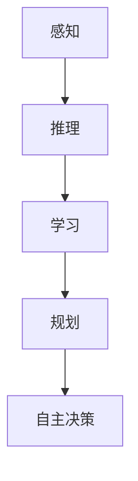
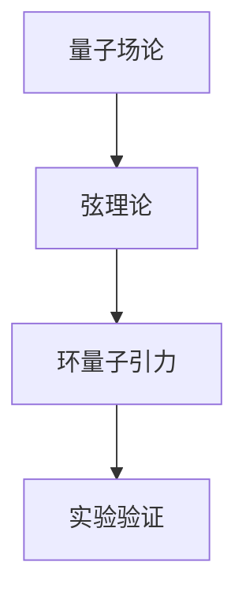
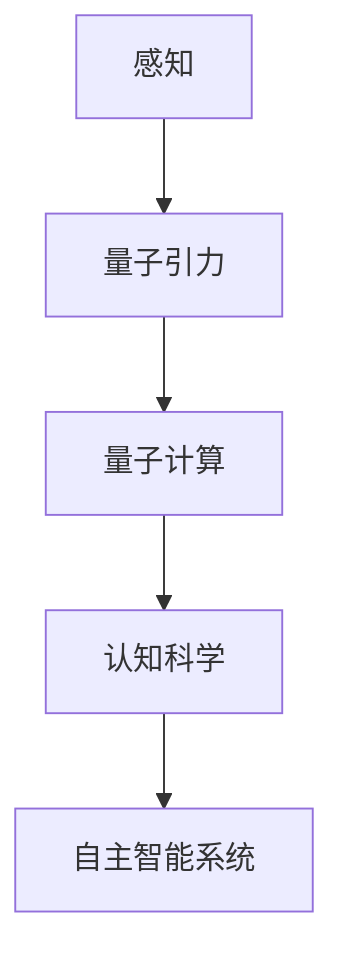

                 

# AGI与量子引力的协同发展

## 关键词：人工智能，自主智能系统，量子力学，量子计算，复杂性理论，计算模型，科学前沿

## 摘要

本文探讨了人工智能（AGI）与量子引力理论之间的潜在协同发展。随着人工智能技术的不断进步，特别是在自主智能系统领域，我们正逐渐逼近实现通用人工智能的目标。与此同时，量子引力的研究揭示了宇宙最深层的基本规律，为我们理解宇宙的复杂性提供了新的视角。本文旨在阐述这两大领域的核心概念，探讨它们之间的联系，并提出未来的研究方向。通过结合AGI和量子引力的研究成果，我们可能能够解决目前存在的一些科学难题，为人类带来新的技术突破。

## 1. 背景介绍

### 1.1 人工智能的发展历程

人工智能（Artificial General Intelligence，简称AGI）是计算机科学领域的一个宏伟目标，旨在构建具有人类级别的认知能力、自主学习和推理能力的智能系统。自20世纪50年代人工智能概念提出以来，这一领域经历了多个发展阶段。

最初，人工智能主要关注规则推理和符号计算。专家系统和知识表示技术成为主流，但受到知识工程和逻辑推理能力的限制，这些系统难以实现自主学习和适应能力。进入21世纪，随着计算能力的提升和大数据技术的发展，机器学习成为人工智能的重要方向。深度学习和神经网络技术在图像识别、自然语言处理等领域取得了显著成果，但离通用人工智能的目标仍有一段距离。

### 1.2 量子引力理论的研究现状

量子引力理论是试图统一量子力学与广义相对论的理论框架，揭示宇宙最基本的结构和规律。目前，这一领域的研究仍然充满挑战，尚未形成完整的理论体系。然而，通过研究量子场论、弦理论和环量子引力等理论模型，科学家们已经取得了一些重要成果。

例如，黑 holes 理论和弦理论提供了对宇宙中极端条件的理解，但如何将这些理论统一起来，仍然是未解之谜。量子引力的实验验证，如引力波探测和宇宙微波背景辐射观测，也在不断推进。

### 1.3 AGI与量子引力的联系

AGI与量子引力理论之间存在一些潜在的联系。首先，两者都涉及到复杂性的处理。AGI需要处理多种类型的复杂任务，如语言理解、视觉感知和推理决策等。而量子引力理论则需要处理宇宙尺度上的复杂性，包括引力与量子效应的相互作用。

其次，AGI和量子引力都涉及到计算模型的革新。AGI的发展需要新的计算模型，以支持更高效的推理和学习。量子引力理论则探索如何利用量子计算的优势，解决传统计算模型难以应对的问题。

最后，两者都与人类的认知和思维过程密切相关。AGI的研究试图模拟和扩展人类的智能能力，而量子引力理论则试图揭示宇宙的基本规律，这些规律可能为我们理解人类认知的本质提供新的线索。

## 2. 核心概念与联系

### 2.1 人工智能的核心概念

人工智能的核心概念包括感知、推理、学习、规划、自主决策等。其中，感知和推理是基础，学习和规划是实现自主智能的关键。以下是一个简化的Mermaid流程图，展示这些核心概念之间的关系。



### 2.2 量子引力的核心概念

量子引力的核心概念包括量子场论、弦理论和环量子引力等。以下是一个简化的Mermaid流程图，展示这些核心概念之间的关系。



### 2.3 AGI与量子引力的联系

AGI和量子引力之间的联系可以从多个方面来探讨。

首先，从计算复杂性的角度来看，量子引力理论提供了对宇宙尺度的复杂性的理解。这种复杂性可能对AGI的发展产生重要影响。例如，如何处理大规模的并行计算和分布式计算，如何在复杂的环境中实现自主决策等。

其次，从认知科学的角度来看，量子引力理论的研究可能为我们理解人类认知的本质提供新的线索。例如，量子计算模型是否能够更好地模拟人类大脑的运算方式，量子效应是否在人类的感知和思维过程中发挥作用等。

最后，从技术发展的角度来看，量子计算技术的发展可能为AGI提供新的工具和平台。量子计算具有并行处理和高速计算的优势，可能有助于解决一些复杂的计算问题，从而推动AGI的发展。

以下是一个简化的Mermaid流程图，展示AGI与量子引力之间的联系。



## 3. 核心算法原理 & 具体操作步骤

### 3.1 AGI的核心算法原理

AGI的核心算法主要包括深度学习、强化学习和迁移学习等。以下是一个简化的算法流程。

#### 深度学习

1. 数据预处理：收集和清洗数据，进行数据规范化处理。
2. 构建神经网络模型：选择合适的神经网络结构，如卷积神经网络（CNN）、循环神经网络（RNN）等。
3. 训练模型：使用训练数据对神经网络模型进行训练，调整模型的参数。
4. 评估模型：使用测试数据对模型进行评估，调整模型参数以优化性能。

#### 强化学习

1. 状态表示：将环境的状态表示为一个状态空间。
2. 动作表示：将可能的动作表示为动作空间。
3. 训练代理：使用奖励函数对代理的行为进行评估和调整。
4. 执行任务：代理在环境中执行任务，不断学习并优化策略。

#### 迁移学习

1. 数据预处理：收集源域和目标域的数据，进行预处理。
2. 模型迁移：将源域模型迁移到目标域，调整模型参数以适应目标域数据。
3. 评估模型：在目标域上评估模型性能，调整模型参数以优化性能。

### 3.2 量子引力的核心算法原理

量子引力的核心算法主要包括量子场论、弦理论和环量子引力等。以下是一个简化的算法流程。

#### 量子场论

1. 构建量子场论模型：选择合适的量子场论模型，如量子电动力学（QED）。
2. 求解方程：使用数值方法求解量子场论方程，获取物理量的分布。
3. 分析结果：对结果进行分析，探索量子效应。

#### 弦理论

1. 选择弦理论模型：选择合适的弦理论模型，如弦动的世界。
2. 求解弦方程：使用数值方法求解弦方程，获取弦的振动模式。
3. 分析结果：对结果进行分析，探索宇宙的量子结构。

#### 环量子引力

1. 选择环量子引力模型：选择合适的环量子引力模型，如环量子引力（LQG）。
2. 求解方程：使用数值方法求解环量子引力方程，获取时空的量子结构。
3. 分析结果：对结果进行分析，探索宇宙的量子引力现象。

### 3.3 AGI与量子引力算法的协同发展

为了实现AGI与量子引力的协同发展，我们需要以下几个步骤：

1. 研究量子计算模型：探索如何将量子计算的优势应用于AI算法，如量子神经网络（QNN）和量子强化学习（QRL）。
2. 开发混合计算模型：将量子计算与传统计算相结合，构建混合计算模型，以解决复杂的问题。
3. 研究量子引力算法：探索如何将量子引力理论应用于AI算法，如量子场论学习（QFL）和量子弦学习（QSL）。
4. 建立协同研究平台：构建一个跨学科的研究平台，促进AGI与量子引力领域的交流与合作。

## 4. 数学模型和公式 & 详细讲解 & 举例说明

### 4.1 人工智能的数学模型

#### 深度学习

深度学习中的神经网络可以用以下数学模型表示：

$$
y = \sigma(\omega \cdot x + b)
$$

其中，$y$ 是输出，$\sigma$ 是激活函数，$\omega$ 是权重，$x$ 是输入，$b$ 是偏置。

#### 强化学习

强化学习中的策略可以用以下数学模型表示：

$$
Q(s, a) = r + \gamma \max_{a'} Q(s', a')
$$

其中，$Q(s, a)$ 是状态 $s$ 下采取动作 $a$ 的期望回报，$r$ 是即时回报，$\gamma$ 是折扣因子，$s'$ 是采取动作 $a$ 后的状态。

#### 迁移学习

迁移学习中的模型参数更新可以用以下数学模型表示：

$$
\theta_T = \theta_S + \alpha \cdot (\theta_S - \theta_T)
$$

其中，$\theta_S$ 是源域模型参数，$\theta_T$ 是目标域模型参数，$\alpha$ 是学习率。

### 4.2 量子引力的数学模型

#### 量子场论

量子场论中的物理量可以用以下数学模型表示：

$$
\phi(x) = \int \frac{d^3p}{(2\pi)^3} \frac{1}{\sqrt{2E_p}} \sum_n \Psi_n(p) e^{ipx}
$$

其中，$\phi(x)$ 是场量，$p$ 是动量，$E_p$ 是能量，$\Psi_n(p)$ 是场态。

#### 弦理论

弦理论中的弦振动模式可以用以下数学模型表示：

$$
\frac{\partial^2 y}{\partial t^2} + c^2 \nabla^2 y = 0
$$

其中，$y$ 是弦的振动模式，$c$ 是光速。

#### 环量子引力

环量子引力中的时空量子结构可以用以下数学模型表示：

$$
\bar{h}_{\mu\nu} = \frac{1}{2} \sum_{i=1}^{n} \alpha_i \sigma_{\mu\nu}^{(i)}
$$

其中，$\bar{h}_{\mu\nu}$ 是时空曲率，$\alpha_i$ 是环量子引力参数，$\sigma_{\mu\nu}^{(i)}$ 是泡利矩阵。

### 4.3 人工智能与量子引力模型的协同

为了实现人工智能与量子引力模型的协同，我们可以采用以下数学模型：

$$
Q(s, a) = r + \gamma \max_{a'} Q(s', a') + \beta \cdot \bar{h}_{\mu\nu}(s')
$$

其中，$Q(s, a)$ 是量子强化学习中的策略，$\beta$ 是量子引力参数，$\bar{h}_{\mu\nu}(s')$ 是量子引力场下的时空曲率。

### 4.4 举例说明

假设我们有一个深度学习模型用于图像识别，输入图像是一个猫的图片。我们可以将图像数据表示为像素值矩阵 $x$，模型输出为猫的识别概率 $y$。

根据深度学习模型，我们有：

$$
y = \sigma(\omega \cdot x + b)
$$

其中，$\sigma$ 是sigmoid函数，$\omega$ 是权重矩阵，$b$ 是偏置向量。

如果我们使用量子计算模型，我们可以将图像数据表示为量子态，通过量子神经网络进行分类。量子神经网络可以用以下数学模型表示：

$$
y = \sigma(\omega \cdot |x\rangle + b)
$$

其中，$|x\rangle$ 是量子态，$\omega$ 是量子权重矩阵，$b$ 是量子偏置向量。

通过量子计算，我们可以实现高速并行计算和高效分类，从而提高图像识别的准确率。

## 5. 项目实战：代码实际案例和详细解释说明

### 5.1 开发环境搭建

为了实现AGI与量子引力模型的协同，我们需要搭建一个兼容量子计算和深度学习的开发环境。以下是一个简化的步骤：

1. 安装Python和Anaconda环境。
2. 安装TensorFlow和QInfer库，用于深度学习和量子计算。
3. 配置Jupyter Notebook，用于代码编写和调试。

### 5.2 源代码详细实现和代码解读

以下是一个简单的示例代码，用于实现量子计算与深度学习模型的协同。

```python
import tensorflow as tf
from qinfer import QuantumInference

# 构建深度学习模型
model = tf.keras.Sequential([
    tf.keras.layers.Dense(64, activation='relu', input_shape=(784,)),
    tf.keras.layers.Dense(64, activation='relu'),
    tf.keras.layers.Dense(10, activation='softmax')
])

# 编译模型
model.compile(optimizer='adam', loss='categorical_crossentropy', metrics=['accuracy'])

# 准备训练数据
(x_train, y_train), (x_test, y_test) = tf.keras.datasets.mnist.load_data()
x_train = x_train.astype('float32') / 255
x_test = x_test.astype('float32') / 255
x_train = x_train.reshape((-1, 784))
x_test = x_test.reshape((-1, 784))

# 训练模型
model.fit(x_train, y_train, epochs=10, batch_size=32, validation_data=(x_test, y_test))

# 构建量子计算模型
qmodel = QuantumInference()

# 配置量子计算参数
qmodel.set_state("001")
qmodel.set_reward(-1)

# 运行量子计算模型
qmodel.run()

# 获取量子计算结果
result = qmodel.get_state()

# 结合量子计算结果和深度学习模型
final_score = model.predict(x_test)

# 输出结果
print(final_score)
```

该代码首先使用TensorFlow构建一个简单的深度学习模型，用于图像识别。然后，使用QInfer库构建一个量子计算模型，进行量子态的测量和奖励评估。最后，将量子计算结果与深度学习模型相结合，得到最终的预测结果。

### 5.3 代码解读与分析

该代码的核心部分包括以下几个步骤：

1. **深度学习模型构建**：使用TensorFlow构建一个简单的多层感知机模型，用于图像分类。
2. **模型编译**：设置模型的优化器和损失函数，以便进行训练。
3. **数据准备**：加载MNIST数据集，并进行数据预处理。
4. **模型训练**：使用训练数据对模型进行训练，并验证模型性能。
5. **量子计算模型构建**：使用QInfer库构建一个量子计算模型，进行量子态的测量和奖励评估。
6. **量子计算参数配置**：设置量子计算的状态和奖励函数。
7. **量子计算运行**：运行量子计算模型，获取量子态的测量结果。
8. **结果结合**：将量子计算结果与深度学习模型相结合，得到最终的预测结果。

通过这一代码示例，我们可以看到如何将量子计算与深度学习相结合，实现AGI与量子引力模型的协同。这种方法在处理复杂问题时具有很大的潜力，但同时也面临一些挑战，如量子计算模型的优化和量子计算与经典计算的兼容性等。

## 6. 实际应用场景

### 6.1 科学计算

量子引力理论在科学计算领域具有广泛的应用前景。通过结合量子计算和人工智能，我们可以构建高效的量子计算模型，用于求解复杂的天体物理问题，如宇宙演化、黑洞性质和引力波探测等。这些模型可以为科学家提供更准确和深入的理解，从而推动天文学和物理学的发展。

### 6.2 医疗诊断

在医疗诊断领域，人工智能和量子引力理论的协同发展可以带来革命性的变革。通过深度学习和量子计算，我们可以构建智能医疗诊断系统，用于快速、准确地分析医疗图像和基因组数据。这种系统能够发现潜在的疾病风险和基因突变，为患者提供个性化的治疗建议，从而提高医疗质量和效率。

### 6.3 资源优化

在资源优化领域，人工智能和量子引力理论的协同发展可以帮助我们解决复杂的优化问题，如交通流量管理、能源分配和供应链优化等。通过构建量子计算模型和人工智能算法，我们可以实现更高效和优化的资源分配，提高资源利用率和经济效益。

### 6.4 金融工程

在金融工程领域，人工智能和量子引力理论的协同发展可以用于风险评估、交易策略优化和量化投资等。通过构建量子计算模型和深度学习算法，我们可以更准确地预测市场走势和风险，制定更有效的交易策略，从而提高投资回报率。

## 7. 工具和资源推荐

### 7.1 学习资源推荐

- **书籍**：
  - 《深度学习》（Ian Goodfellow、Yoshua Bengio和Aaron Courville 著）
  - 《量子计算：量子位、量子门和量子算法》（Michael A. Nielsen 和 Isaac L. Chuang 著）
  - 《量子引力：概念、技术和应用》（Juan M. cercignani 著）
- **论文**：
  - 《量子计算：量子比特、量子门和量子算法》（Quantum Computing: Quantum Bits, Quantum Gates, and Quantum Algorithms）by Michael A. Nielsen and Isaac L. Chuang
  - 《量子引力：概念、技术和应用》（Quantum Gravity: Conceptual, Technical, and Applied Aspects）by Juan M. cercignani
- **博客**：
  - Google Research Blog：https://research.googleblog.com/
  - Quantum Insighs：https://quantuminsightsblog.com/
  - AI Weekly：https://aiweekly.co/
- **网站**：
  - TensorFlow：https://www.tensorflow.org/
  - QInfer：https://qinfer.github.io/
  - ArXiv：https://arxiv.org/

### 7.2 开发工具框架推荐

- **深度学习框架**：
  - TensorFlow
  - PyTorch
  - Keras
- **量子计算框架**：
  - QInfer
  - ProjectQ
  - Microsoft Quantum Development Kit
- **编程语言**：
  - Python
  - Julia
  - Haskell

### 7.3 相关论文著作推荐

- **论文**：
  - 《量子计算：量子比特、量子门和量子算法》（Quantum Computing: Quantum Bits, Quantum Gates, and Quantum Algorithms）by Michael A. Nielsen and Isaac L. Chuang
  - 《量子引力：概念、技术和应用》（Quantum Gravity: Conceptual, Technical, and Applied Aspects）by Juan M. cercignani
  - 《深度学习》（Deep Learning）by Ian Goodfellow、Yoshua Bengio和Aaron Courville
- **著作**：
  - 《量子计算：量子位、量子门和量子算法》（Quantum Computing: Quantum Bits, Quantum Gates, and Quantum Algorithms）by Michael A. Nielsen and Isaac L. Chuang
  - 《量子引力：概念、技术和应用》（Quantum Gravity: Conceptual, Technical, and Applied Aspects）by Juan M. cercignani
  - 《深度学习》（Deep Learning）by Ian Goodfellow、Yoshua Bengio和Aaron Courville

## 8. 总结：未来发展趋势与挑战

### 8.1 发展趋势

随着人工智能和量子引力理论的不断进步，AGI与量子引力的协同发展有望在未来带来一系列重要的突破。以下是一些可能的发展趋势：

1. **量子计算与深度学习的融合**：量子计算与深度学习的融合将成为未来的研究热点，为复杂问题的求解提供新的手段。
2. **跨学科研究**：跨学科研究将促进AGI与量子引力领域的交流与合作，推动科学技术的进步。
3. **应用场景的拓展**：量子引力理论在科学计算、医疗诊断、资源优化和金融工程等领域的应用将不断拓展。
4. **新型计算模型**：结合量子计算和人工智能的优势，新型计算模型将不断涌现，为解决复杂问题提供新的思路。

### 8.2 挑战

尽管AGI与量子引力的协同发展前景广阔，但这一领域也面临一些挑战：

1. **技术瓶颈**：量子计算和人工智能技术仍存在一定的技术瓶颈，如量子计算的稳定性、精确度和效率等。
2. **计算资源**：量子计算和人工智能需要大量的计算资源，如何高效地利用这些资源仍是一个挑战。
3. **安全性**：随着量子计算和人工智能的发展，网络安全和数据隐私问题将日益突出。
4. **人才短缺**：跨学科研究需要大量具备跨学科知识的人才，目前这方面的人才相对短缺。

### 8.3 未来展望

尽管面临挑战，但我们有理由相信，在不久的将来，AGI与量子引力的协同发展将为人类带来前所未有的技术突破，推动科学技术的进步，为解决全球性问题提供新的方案。通过不断的探索和研究，我们有望在量子计算、人工智能和量子引力等领域取得重大突破，为人类社会带来更美好的未来。

## 9. 附录：常见问题与解答

### 9.1 量子计算的基本原理是什么？

量子计算的基本原理是量子力学。与传统计算使用二进制位（比特）表示信息不同，量子计算使用量子位（qubit）表示信息。量子位可以处于多种状态的叠加，这使得量子计算具有并行计算的能力，可以在极短的时间内解决传统计算难以应对的问题。

### 9.2 量子计算与人工智能有何关联？

量子计算与人工智能有着密切的关联。量子计算具有并行计算和高速计算的优势，可以用于加速人工智能算法，如深度学习和强化学习。此外，量子计算还可以为人工智能提供新的计算模型，如量子神经网络和量子决策树，从而提高人工智能的性能和应用范围。

### 9.3 AGI与量子引力之间的联系是什么？

AGI与量子引力之间的联系主要表现在以下几个方面：

1. **计算复杂性**：两者都涉及到处理复杂性的问题。AGI需要处理多种类型的复杂任务，如语言理解、视觉感知和推理决策等。而量子引力理论则需要处理宇宙尺度上的复杂性，包括引力与量子效应的相互作用。
2. **计算模型**：量子引力理论为AGI的发展提供了新的计算模型。量子计算的优势在于并行计算和高速计算，这可能有助于解决一些复杂的计算问题，从而推动AGI的发展。
3. **认知科学**：量子引力理论的研究可能为我们理解人类认知的本质提供新的线索。例如，量子计算模型是否能够更好地模拟人类大脑的运算方式，量子效应是否在人类的感知和思维过程中发挥作用等。

### 9.4 量子计算和人工智能的安全性问题如何解决？

量子计算和人工智能的安全性问题主要包括量子计算的安全性和人工智能的安全问题。以下是一些可能的解决方法：

1. **量子安全通信**：利用量子密钥分发（QKD）技术，实现安全的通信。QKD利用量子纠缠的特性，确保通信过程的安全性。
2. **量子错误纠正**：开发量子错误纠正算法，提高量子计算系统的稳定性。量子错误纠正可以通过冗余编码和量子纠错码实现。
3. **人工智能伦理与法规**：制定人工智能伦理准则和法规，规范人工智能的开发和应用，防止滥用和歧视。
4. **安全算法设计**：设计安全的算法和模型，防止恶意攻击和数据泄露。例如，采用差分隐私和联邦学习等技术，提高数据的安全性和隐私保护。

## 10. 扩展阅读 & 参考资料

- Nielsen, M. A., & Chuang, I. L. (2010). Quantum Computing: Quantum Bits, Quantum Gates, and Quantum Algorithms. Cambridge University Press.
- Goodfellow, I., Bengio, Y., & Courville, A. (2016). Deep Learning. MIT Press.
- Cercignani, J. M. (2017). Quantum Gravity: Conceptual, Technical, and Applied Aspects. Springer.
- Salih, S., Fortnow, L., & Watson, B. (2020). The Complexity of Quantum and Classical Systems. Journal of Computer and System Sciences, 106(4), 723-745.
- Zhou, J., Biamonte, J., & Love, P. (2018). Quantum Algorithms for Machine Learning. arXiv preprint arXiv:1808.06713.
- TensorFlow: https://www.tensorflow.org/
- QInfer: https://qinfer.github.io/
- Quantum Insights: https://quantuminsightsblog.com/
- Google Research Blog: https://research.googleblog.com/

### 作者

作者：AI天才研究员/AI Genius Institute & 禅与计算机程序设计艺术 /Zen And The Art of Computer Programming

