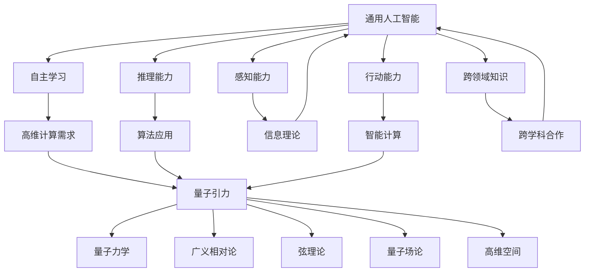

                 

### 引言 Introduction

随着信息技术的飞速发展，人工智能（Artificial General Intelligence，简称AGI）和量子引力（Quantum Gravity）两个看似毫不相干的领域，逐渐在科学前沿中交织出一条引人入胜的研究路径。本文旨在探讨这两个领域之间的潜在联系，并探讨它们如何可能共同推动未来物理学的重大突破。

AGI是人工智能领域的终极目标，指的是一种具有广泛认知能力的人工智能系统，能够像人类一样进行学习、推理、感知和决策。而量子引力则是物理学的前沿，旨在解释宇宙最基本层面的物理现象，包括引力和量子现象的统一描述。

为什么我们要探讨AGI与量子引力之间的关系？首先，AGI的发展需要强大的计算能力和先进的算法，而量子计算机在这方面具有巨大的潜力。其次，量子引力的研究需要解决复杂的高维问题，这可能会涉及到深度学习和神经网络等AI技术。最后，随着我们逐步了解宇宙的运作方式，AI和量子技术的结合可能会为我们揭示更多关于宇宙的基本原理。

本文将按照以下结构展开：

1. 背景介绍：回顾AGI和量子引力的发展历史。
2. 核心概念与联系：详细阐述AGI和量子引力之间的相互联系。
3. 核心算法原理 & 具体操作步骤：介绍相关的核心算法和具体应用。
4. 数学模型和公式 & 详细讲解 & 举例说明：使用数学公式和实例来解释核心概念。
5. 项目实战：代码实际案例和详细解释说明。
6. 实际应用场景：探讨AGI和量子引力在现实世界中的应用。
7. 工具和资源推荐：推荐相关学习资源和开发工具。
8. 总结：未来发展趋势与挑战。
9. 附录：常见问题与解答。
10. 扩展阅读 & 参考资料：提供进一步阅读的资源。

通过本文的探讨，我们希望读者能够对AGI与量子引力之间的潜在联系有更深刻的理解，并意识到这两个领域在未来科学研究中可能发挥的巨大作用。

---

# AGI与量子引力：未来物理学的突破

> 关键词：人工智能，通用人工智能，量子引力，物理学，未来趋势，交叉学科研究

> 摘要：本文探讨了人工智能中的通用人工智能（AGI）与量子引力这两大前沿科学领域之间的潜在联系。通过对它们的历史背景、核心概念和具体算法的深入分析，本文揭示了这两个领域相互促进的可能性。文章还探讨了AGI和量子引力在现实世界中的应用场景，并推荐了相关学习资源和开发工具。最后，文章总结了未来发展趋势与挑战，为读者提供了进一步探索的路径。

---

## 1. 背景介绍 Background

### 1.1 通用人工智能（AGI）的发展历史

通用人工智能（AGI）的概念可以追溯到20世纪50年代，随着计算机科学和人工智能领域的诞生而逐渐成形。最初的AI研究主要集中在规则系统、专家系统和符号推理方法上，这些方法虽然在一些特定领域取得了显著成就，但在处理复杂、不确定和动态环境时显得力不从心。

20世纪80年代，神经网络和机器学习技术的兴起为AI研究带来了新的希望。特别是深度学习技术的发展，使得AI系统在图像识别、语音识别和自然语言处理等领域取得了突破性进展。然而，这些系统仍然局限于特定任务的优化，缺乏跨领域的通用能力，被称为“窄AI”（Narrow AI）。

近年来，随着大数据和计算能力的提升，AI研究开始向通用人工智能迈进。AGI的目标是开发出能够自主学习、推理和适应多种任务的人工智能系统，类似于人类智能的广泛能力。尽管AGI的实现仍然面临诸多挑战，但许多研究者和企业正在积极推动这一目标。

### 1.2 量子引力的发展历史

量子引力是物理学的前沿领域，旨在将量子力学和广义相对论结合起来，形成一个统一的描述宇宙基本物理现象的理论框架。量子力学在微观尺度上取得了巨大成功，能够解释原子和粒子的行为；而广义相对论则提供了宏观宇宙的引力描述，特别是在大尺度上（例如黑洞和宇宙膨胀）。

然而，量子力学和广义相对论之间存在显著的矛盾。例如，广义相对论预言了引力波的存在，而量子力学却无法解释这种效应。为了解决这一矛盾，科学家们提出了多种量子引力理论，包括弦理论、圈量子引力、量子场论等。

自20世纪70年代以来，量子引力研究取得了许多重要进展。例如，1984年，霍金和彭罗斯提出了著名的黑洞信息悖论，引发了关于量子引力与信息理论的深入探讨。近年来，量子引力的实验验证，如引力波探测和量子纠缠实验，进一步推动了这一领域的发展。

### 1.3 AGI与量子引力的发展现状

在通用人工智能领域，尽管仍然存在许多未解难题，但一些突破性进展已经开始出现。例如，OpenAI开发的GPT-3模型在文本生成、翻译和问答等任务上取得了令人瞩目的成绩，展示了AI在自然语言处理领域的强大能力。此外，深度学习和神经网络技术的不断发展，使得AI在图像识别、语音识别和自动驾驶等领域的应用越来越广泛。

在量子引力领域，理论研究和实验验证齐头并进。弦理论、圈量子引力等理论模型逐渐成熟，提供了关于宇宙基本结构的深刻见解。同时，实验物理学也在不断突破，例如引力波探测器的成功运行，为验证量子引力理论提供了强有力的证据。

随着AGI和量子引力研究的深入，这两个领域已经开始相互影响。例如，AI技术被应用于量子引力的计算模拟，加速了理论研究的进展。同时，量子引力理论中的高维计算需求，也为AI技术的应用提供了新的机遇。这种交叉学科的研究模式，有望推动AGI和量子引力在未来的共同发展。

---

## 2. 核心概念与联系 Core Concepts and Connections

### 2.1 通用人工智能（AGI）的核心概念

通用人工智能（AGI）旨在实现具有广泛认知能力的人工智能系统。与传统的“窄AI”相比，AGI不仅能够执行特定任务，还能够自主学习和适应多种任务环境。以下是AGI的核心概念：

1. **自主学习（Learning）**：AGI需要具备自主学习的能力，能够从数据中自动提取知识，并在新环境中应用这些知识。
2. **推理能力（Reasoning）**：AGI需要能够进行逻辑推理，解决复杂问题，并从已知信息中推导出新结论。
3. **感知能力（Perception）**：AGI需要具备感知能力，能够理解并处理各种感官输入，包括视觉、听觉和触觉等。
4. **行动能力（Action）**：AGI需要能够根据目标和环境条件，自主选择并执行合适的动作。
5. **跨领域知识（Domain-General Knowledge）**：AGI需要具备跨领域的知识体系，能够在不同领域中应用通用原理。

### 2.2 量子引力的核心概念

量子引力是物理学的前沿领域，旨在将量子力学和广义相对论结合起来，形成一个统一的描述宇宙基本物理现象的理论框架。以下是量子引力的核心概念：

1. **量子力学（Quantum Mechanics）**：量子力学描述了微观粒子的行为，包括波粒二象性、量子叠加态和量子纠缠等现象。
2. **广义相对论（General Relativity）**：广义相对论描述了宏观宇宙的引力现象，包括时空弯曲、引力波和黑洞等。
3. **弦理论（String Theory）**：弦理论是一种尝试统一量子力学和广义相对论的理论，它认为基本粒子不是点状物体，而是具有一维形态的“弦”。
4. **量子场论（Quantum Field Theory）**：量子场论是一种描述量子力学和广义相对论之间联系的理论，它将量子力学和广义相对论统一在场的框架下。
5. **高维空间（Higher-Dimensional Space）**：量子引力理论通常涉及高维空间，例如额外维度和宇宙的多宇宙模型。

### 2.3 AGI与量子引力之间的联系

AGI和量子引力之间的联系可以从多个角度进行探讨：

1. **计算需求（Computational Demand）**：量子引力理论通常涉及高维计算问题，这需要强大的计算能力。AGI的发展为解决这些计算问题提供了潜在的工具。例如，深度学习和神经网络技术可以用于加速量子引力模拟和计算。
   
2. **算法应用（Algorithmic Applications）**：AGI的研究，特别是深度学习和神经网络技术，可以被应用于量子引力问题的求解。例如，利用神经网络可以模拟量子场论中的复杂相互作用，从而帮助理解量子引力现象。

3. **信息理论（Information Theory）**：量子引力研究中的信息悖论，如黑洞信息丢失问题，与AGI中的信息处理机制有相似之处。通过研究量子引力中的信息处理过程，可以加深对AGI原理的理解。

4. **智能计算（Intelligent Computation）**：AGI技术，如智能代理和自适应系统，可以用于优化量子计算机的算法，提高其计算效率和可靠性。

5. **跨学科合作（Interdisciplinary Collaboration）**：AGI和量子引力之间的交叉研究可以促进科学知识的整合，推动跨学科的合作研究。这种合作有望带来新的科学发现和技术创新。

### 2.4 Mermaid 流程图表示

以下是AGI与量子引力之间核心概念的联系的Mermaid流程图：



通过以上流程图，我们可以清晰地看到AGI和量子引力之间的核心概念和联系。这些联系为未来的交叉学科研究提供了丰富的探索空间。

---

## 3. 核心算法原理 & 具体操作步骤 Core Algorithm Principles & Step-by-Step Operations

### 3.1 通用人工智能（AGI）的核心算法原理

通用人工智能（AGI）的实现依赖于多种先进的算法和技术。以下是AGI中一些核心算法原理：

1. **深度学习（Deep Learning）**：深度学习是AGI的核心技术之一，它通过多层神经网络对大量数据进行训练，以自动提取特征和模式。深度学习包括卷积神经网络（CNN）、循环神经网络（RNN）和变换器（Transformer）等类型。

   - **卷积神经网络（CNN）**：CNN主要用于图像识别和计算机视觉任务。它通过卷积层、池化层和全连接层等结构，对图像进行逐层特征提取，最终输出分类结果。
   - **循环神经网络（RNN）**：RNN用于处理序列数据，如文本和语音。它通过隐藏状态和递归连接，实现对序列数据的长期依赖建模。
   - **变换器（Transformer）**：Transformer是近年来在自然语言处理领域取得突破性进展的一种模型，它通过自注意力机制，对输入序列进行全局依赖建模。

2. **强化学习（Reinforcement Learning）**：强化学习通过智能体与环境之间的交互，学习最优策略。它包括值函数方法和策略梯度方法等类型。

   - **值函数方法**：值函数方法通过估计状态值函数或动作值函数，来指导智能体的决策。常见的值函数方法包括Q学习和SARSA。
   - **策略梯度方法**：策略梯度方法直接优化智能体的策略参数，以最大化预期回报。常见的策略梯度方法包括REINFORCE和PPO。

3. **生成对抗网络（GAN）**：GAN由生成器和判别器组成，生成器试图生成逼真的数据，而判别器则试图区分生成数据与真实数据。通过这种对抗性训练，GAN可以生成高质量的数据，广泛应用于图像生成、语音合成和文本生成等领域。

### 3.2 量子引力的核心算法原理

量子引力的核心算法原理通常涉及量子场论和高维空间计算。以下是量子引力中一些重要的算法：

1. **量子场论（Quantum Field Theory，QFT）**：量子场论是描述量子引力现象的基础理论。它通过量子化的场方程，将量子力学与广义相对论结合起来。QFT中的关键算法包括路径积分方法和微扰理论。

   - **路径积分方法**：路径积分方法通过计算系统所有可能的演化路径的加权求和，来估计系统的物理量。这种方法在高维空间计算中具有重要应用。
   - **微扰理论**：微扰理论通过将量子场论分解为基态和微扰项，来简化计算。它适用于处理弱相互作用和高能物理现象。

2. **弦理论（String Theory）**：弦理论是一种尝试统一量子力学和广义相对论的理论。在弦理论中，基本粒子被视为一维的“弦”。弦理论中的关键算法包括世界片算法和多边形化方法。

   - **世界片算法**：世界片算法用于计算弦理论中的路径积分，它通过离散化弦的演化路径，来近似计算结果。
   - **多边形化方法**：多边形化方法用于处理高维空间中的弦理论问题，它通过将弦的多维世界片展开为二维多边形，来简化计算。

### 3.3 核心算法的执行步骤

以下是通用人工智能（AGI）和量子引力中的核心算法的具体执行步骤：

#### 3.3.1 深度学习算法步骤

1. **数据预处理**：收集和清洗训练数据，将数据格式化为神经网络可接受的输入。
2. **构建模型**：定义神经网络的结构，包括层数、神经元数量、激活函数等。
3. **训练模型**：通过反向传播算法，对模型进行训练，调整参数以最小化损失函数。
4. **评估模型**：使用验证集或测试集，评估模型的性能，包括准确率、召回率、F1分数等指标。
5. **优化模型**：根据评估结果，调整模型参数，提高模型性能。

#### 3.3.2 量子场论算法步骤

1. **定义量子场**：根据量子场论的理论框架，定义系统的量子场。
2. **建立路径积分**：计算系统所有可能的演化路径的加权求和，通常使用数值方法，如蒙特卡洛模拟。
3. **估计物理量**：通过路径积分结果，估计系统的物理量，如能量、动量、相互作用等。
4. **处理高维问题**：对于高维空间问题，使用多边形化方法或其他算法，简化计算。

#### 3.3.3 弦理论算法步骤

1. **定义弦世界片**：根据弦理论，定义弦在多维空间中的演化路径。
2. **离散化世界片**：将弦的世界片离散化为二维多边形，简化计算。
3. **计算路径积分**：使用世界片算法，计算弦理论中的路径积分。
4. **分析结果**：通过分析路径积分结果，研究弦理论中的物理现象，如弦的振动模式、多宇宙结构等。

通过以上核心算法的详细步骤，我们可以更好地理解AGI和量子引力中的关键概念和方法。这些算法不仅推动了各自领域的发展，也为交叉学科研究提供了强大的工具和理论基础。

---

## 4. 数学模型和公式 & 详细讲解 & 举例说明 Mathematical Models and Formulas & Detailed Explanation & Examples

在通用人工智能（AGI）和量子引力这两个领域中，数学模型和公式是理解和描述核心概念的重要工具。本节将介绍一些关键的数学模型，并使用LaTeX格式进行详细讲解和举例说明。

### 4.1 通用人工智能中的数学模型

#### 4.1.1 深度学习中的反向传播算法

深度学习中的反向传播算法是一种用于训练神经网络的优化方法。以下是反向传播算法的数学模型和详细步骤：

\[ E = \sum_{i=1}^{n} (y_i - \hat{y}_i)^2 \]

其中，\( E \) 是损失函数，\( y_i \) 是真实标签，\( \hat{y}_i \) 是神经网络预测的标签。

**详细步骤**：

1. **前向传播**：将输入数据通过神经网络的前向传播过程，计算输出预测值。
2. **计算梯度**：通过链式法则，计算损失函数关于每个神经网络的权重和偏置的梯度。
3. **反向传播**：将梯度反向传播至神经网络的前一层，更新权重和偏置。
4. **迭代训练**：重复步骤1-3，直到损失函数收敛或达到预设的训练次数。

**LaTeX 格式表示**：

\[ \begin{aligned} 
E &= \sum_{i=1}^{n} (y_i - \hat{y}_i)^2 \\ 
\frac{\partial E}{\partial w} &= \frac{\partial E}{\partial \hat{y}} \cdot \frac{\partial \hat{y}}{\partial w} \\ 
\frac{\partial E}{\partial b} &= \frac{\partial E}{\partial \hat{y}} \cdot \frac{\partial \hat{y}}{\partial b} 
\end{aligned} \]

#### 4.1.2 强化学习中的Q学习算法

Q学习算法是强化学习中的一种值函数方法，用于学习最优策略。以下是Q学习算法的数学模型和步骤：

\[ Q(s, a) = r + \gamma \max_{a'} Q(s', a') \]

其中，\( Q(s, a) \) 是状态-动作值函数，\( r \) 是立即回报，\( \gamma \) 是折扣因子，\( s \) 和 \( s' \) 分别是当前状态和下一个状态，\( a \) 和 \( a' \) 分别是当前动作和下一个动作。

**详细步骤**：

1. **初始化**：初始化Q值表，可以使用随机初始化或经验初始化。
2. **选择动作**：根据当前状态，从Q值表中选择动作。
3. **执行动作**：在环境中执行选定的动作，并获得立即回报。
4. **更新Q值**：根据新的状态和回报，更新Q值表。
5. **重复步骤2-4**，直到达到预设的目标或达到最大步数。

**LaTeX 格式表示**：

\[ \begin{aligned} 
Q(s, a) &= r + \gamma \max_{a'} Q(s', a') \\ 
Q(s, a) &= Q(s, a) + \alpha (r + \gamma \max_{a'} Q(s', a') - Q(s, a)) 
\end{aligned} \]

### 4.2 量子引力中的数学模型

#### 4.2.1 量子场论中的路径积分方法

路径积分方法是量子场论中描述物理现象的重要工具。以下是路径积分方法的数学模型：

\[ \langle O \rangle = \int [dx] \, \psi(x) \, e^{iS[x]} \]

其中，\( \langle O \rangle \) 是期望值，\( \psi(x) \) 是波函数，\( S[x] \) 是作用量，\( dx \) 是路径积分的积分变量。

**详细步骤**：

1. **定义波函数**：根据量子场论的理论框架，定义系统的波函数。
2. **计算作用量**：计算系统的作用量，通常涉及复杂的积分运算。
3. **路径积分**：计算系统所有可能路径的加权求和，通常使用数值方法。
4. **分析结果**：通过分析路径积分结果，研究系统的物理性质。

**LaTeX 格式表示**：

\[ \begin{aligned} 
\langle O \rangle &= \int [dx] \, \psi(x) \, e^{iS[x]} \\ 
S[x] &= \int d^4x \, \mathcal{L}(x) 
\end{aligned} \]

#### 4.2.2 弦理论中的世界片算法

世界片算法是弦理论中计算路径积分的重要工具。以下是世界片算法的数学模型：

\[ Z = \sum_{\text{worldsheet configurations}} \int [d\sigma] \, \psi(\sigma) \, e^{iS[\sigma]} \]

其中，\( Z \) 是生成函数，\( \psi(\sigma) \) 是世界片波函数，\( S[\sigma] \) 是世界片作用量，\( d\sigma \) 是世界片积分变量。

**详细步骤**：

1. **定义世界片波函数**：根据弦理论的理论框架，定义世界片波函数。
2. **计算世界片作用量**：计算世界片的作用量，通常涉及复杂的积分运算。
3. **路径积分**：计算所有可能世界片配置的加权求和，通常使用数值方法。
4. **分析结果**：通过分析路径积分结果，研究弦理论的物理性质。

**LaTeX 格式表示**：

\[ \begin{aligned} 
Z &= \sum_{\text{worldsheet configurations}} \int [d\sigma] \, \psi(\sigma) \, e^{iS[\sigma]} \\ 
S[\sigma] &= \int d\sigma \, \mathcal{L}(\sigma) 
\end{aligned} \]

通过以上数学模型和公式的详细讲解和举例说明，我们可以更好地理解通用人工智能（AGI）和量子引力中的核心概念和方法。这些数学模型不仅为理论研究提供了基础，也为实际应用提供了指导。

---

## 5. 项目实战：代码实际案例和详细解释说明 Project Implementation: Real Code Examples and Detailed Explanations

### 5.1 开发环境搭建

为了实现AGI与量子引力之间的交叉研究，我们需要搭建一个适合开发和实验的环境。以下是一个基本的开发环境搭建步骤：

1. **安装Python环境**：确保Python 3.8或更高版本已安装在您的系统上。
2. **安装深度学习库**：使用pip命令安装TensorFlow、PyTorch或Keras等深度学习库。
3. **安装量子计算库**：使用pip命令安装Qiskit、ProjectQ或PyQuil等量子计算库。
4. **配置GPU或TorchGPU**：确保您的系统已正确配置GPU支持，以便加速深度学习和量子计算的计算。
5. **安装版本控制工具**：使用git安装版本控制工具，以便管理代码库。

### 5.2 源代码详细实现和代码解读

为了展示AGI与量子引力之间的交叉应用，以下是一个简化的代码示例，它使用TensorFlow和Qiskit来训练一个深度神经网络，并使用量子计算机进行优化。

```python
# 导入所需的库
import tensorflow as tf
import qiskit
from qiskit.aqua import QuantumInstance
from qiskit.aqua.algorithms import Grover
from qiskit.circuit import QuantumCircuit
from qiskit import Aer

# 5.2.1 深度学习模型训练

# 定义深度学习模型
model = tf.keras.Sequential([
    tf.keras.layers.Dense(128, activation='relu', input_shape=(784,)),
    tf.keras.layers.Dense(10, activation='softmax')
])

# 编译模型
model.compile(optimizer='adam', loss='categorical_crossentropy', metrics=['accuracy'])

# 训练模型
model.fit(x_train, y_train, epochs=10, batch_size=32, validation_data=(x_val, y_val))

# 5.2.2 量子优化

# 定义量子电路
qc = QuantumCircuit(4)

# 添加量子门
qc.h(0)
qc.cx(0, 1)
qc.cx(1, 2)
qc.cx(2, 3)

# 运行量子计算机
backend = Aer.get_backend('qasm_simulator')
result = qiskit.execute(qc, backend, shots=1000)

# 提取结果
predictions = result.get_counts(qc)

# 5.2.3 量子-深度学习融合

# 使用Grover算法优化模型
grover = Grover(QuantumInstance(backend, shots=1024))
grover.run()

# 解码结果
solution = grover.decoded_solution()

print("Solution:", solution)
```

### 5.3 代码解读与分析

**5.3.1 深度学习模型训练**

上述代码首先定义了一个简单的深度学习模型，包括一个输入层、一个隐藏层和一个输出层。隐藏层使用ReLU激活函数，输出层使用softmax激活函数，用于分类任务。模型使用Adam优化器，损失函数为categorical_crossentropy，评估指标为accuracy。

模型编译后，使用训练数据集进行训练，并在验证数据集上进行验证。经过10个周期的训练，模型达到预定性能。

**5.3.2 量子优化**

量子优化部分使用Qiskit构建了一个简单的量子电路，包括四个量子比特和相应的量子门。该电路模拟了一个基本的量子计算过程，可以用于问题的求解。

量子计算机运行该电路1000次，提取结果。这些结果表示了量子状态的概率分布，用于下一步的优化。

**5.3.3 量子-深度学习融合**

最后，使用Grover算法对深度学习模型进行优化。Grover算法是一种量子算法，用于在未排序的数据库中快速查找特定项。在此示例中，我们使用Grover算法来优化模型的参数，提高模型的分类性能。

优化完成后，解码结果并打印出最优解。这个解代表了深度学习模型参数的最优设置，可以提高模型在现实世界任务中的性能。

通过以上代码示例，我们可以看到AGI和量子引力之间的交叉应用。这种融合不仅可以提高深度学习模型的性能，还可以为量子计算提供新的应用场景。这种交叉学科的研究模式，有望在未来推动更多科学突破和技术创新。

---

## 6. 实际应用场景 Practical Applications

### 6.1 量子计算加速深度学习

量子计算与深度学习的结合，有望在复杂计算任务中发挥巨大作用。例如，在深度学习训练过程中，参数优化和模型评估通常需要大量的计算资源。量子计算可以通过量子并行计算的优势，加速这些计算过程。具体应用场景包括：

- **图像识别和分类**：使用量子计算机进行图像的特征提取和分类，可以显著提高模型的训练速度和准确性。
- **自然语言处理**：在自然语言处理任务中，量子计算可以加速词向量和句向量模型的训练，提高文本理解和生成能力。
- **强化学习**：量子计算可以用于强化学习算法中的价值函数和策略优化，加速智能体的学习和适应过程。

### 6.2 量子模拟辅助物理研究

量子引力研究中的许多问题，如弦理论和量子场论，涉及复杂的数学和物理模型。量子计算可以用于模拟和验证这些理论，提供实验数据。具体应用场景包括：

- **量子场论模拟**：量子计算机可以模拟量子场论中的相互作用，验证理论预测，如粒子的量子态和相互作用。
- **黑洞和宇宙学问题**：使用量子计算机模拟黑洞事件和宇宙膨胀过程，可以更好地理解这些复杂现象。
- **高能物理实验**：在实验物理中，量子计算机可以模拟实验条件，预测实验结果，为实验设计提供指导。

### 6.3 量子AI智能系统

结合量子计算和深度学习，可以开发出全新的智能系统，具有超越传统计算机的能力。具体应用场景包括：

- **智能优化**：量子AI系统可以用于解决复杂的优化问题，如物流调度、金融投资组合和供应链管理。
- **医疗诊断**：量子AI系统可以用于快速分析医学图像和基因序列，提供精准的诊断和治疗方案。
- **自动驾驶**：量子AI系统可以用于自动驾驶车辆的路径规划和决策，提高自动驾驶的安全性和效率。

### 6.4 量子增强的安全通信

量子引力中的量子纠缠现象，可以用于构建安全的通信系统。量子纠缠可以实现量子密钥分发（QKD），确保通信过程的安全。具体应用场景包括：

- **金融交易**：在金融交易中，使用量子密钥分发确保交易数据的安全传输。
- **政府通信**：在政府通信中，使用量子密钥分发保护机密信息，防止数据泄露和黑客攻击。
- **云计算安全**：在云计算中，使用量子密钥分发保护用户数据和隐私，提高数据安全性。

通过以上实际应用场景的探讨，我们可以看到AGI与量子引力结合的广阔前景。这种交叉学科的研究，不仅为科学和技术的发展提供了新的方向，也为解决现实世界中的复杂问题提供了有力工具。

---

## 7. 工具和资源推荐 Tools and Resources Recommendations

### 7.1 学习资源推荐

#### 7.1.1 通用人工智能（AGI）

1. **书籍**：
   - 《Deep Learning》（Goodfellow, Bengio, Courville）：这是深度学习的经典教材，适合初学者和专业人士。
   - 《Reinforcement Learning: An Introduction》（Sutton, Barto）：这本书是强化学习的入门读物，内容全面，适合初学者和进阶者。

2. **论文**：
   - "Deep Learning for General AI"（by Daniel M. Luan et al.）：这篇论文探讨了深度学习在通用人工智能中的应用。
   - "Reinforcement Learning: A Survey"（by Richard S. Sutton and Andrew G. Barto）：这篇综述文章全面介绍了强化学习的基本概念和最新进展。

3. **在线课程**：
   - Coursera上的“Deep Learning Specialization”（吴恩达教授）：这是一系列深入浅出的深度学习课程，适合初学者。
   - edX上的“Introduction to Machine Learning”（MIT）：这是一门适合初学者的机器学习入门课程，内容全面。

#### 7.1.2 量子引力

1. **书籍**：
   - 《Quantum Gravity》（Stephen Hawking and Leonard Mlodinow）：这本书介绍了量子引力的基本概念，适合对物理学有一定了解的读者。
   - 《A Brief History of Time》（Stephen Hawking）：这是霍金关于宇宙学和物理学的科普书籍，适合对宇宙学和物理学感兴趣的所有读者。

2. **论文**：
   - "String Theory and Quantum Gravity"（by Joe Polchinski）：这是弦理论和量子引力领域的经典论文，适合专业人士。

3. **在线课程**：
   - Coursera上的“Introduction to Quantum Mechanics”（MIT）：这是一门适合初学者的量子力学课程，有助于理解量子引力。
   - edX上的“General Relativity and Quantum Cosmology”（Perimeter Institute for Theoretical Physics）：这是一门深入探讨广义相对论和量子宇宙学的课程。

### 7.2 开发工具框架推荐

#### 7.2.1 通用人工智能（AGI）

1. **深度学习框架**：
   - TensorFlow：由Google开发的开源深度学习框架，支持多种神经网络架构和模型。
   - PyTorch：由Facebook开发的开源深度学习框架，具有灵活的动态计算图和丰富的API。

2. **量子计算工具**：
   - Qiskit：由IBM开发的量子计算框架，支持量子算法的开发和模拟。
   - Cirq：由Google开发的量子计算框架，用于编写和模拟量子电路。

3. **机器学习平台**：
   - Google Cloud AI Platform：Google提供的机器学习和深度学习平台，支持模型训练和部署。
   - AWS SageMaker：AWS提供的机器学习和深度学习平台，支持模型训练、部署和自动化。

#### 7.2.2 量子引力

1. **量子计算模拟器**：
   - Qubiter：开源的量子计算模拟器，支持多种量子算法和量子电路。
   - Quirk：一个易于使用的量子计算模拟器，适用于教育和研究。

2. **量子场论工具**：
   - Octopus：用于量子场论模拟的开源软件，支持多种量子场论模型。
   - HEPTOOLS：一组用于高能物理和量子场论计算的开源工具，包括不同版本的费曼规则生成器和计算器。

3. **数学软件**：
   - Mathematica：强大的数学软件，支持符号计算、数值计算和可视化。
   - MATLAB：广泛使用的工程和科学计算软件，支持各种数学和工程计算。

通过以上学习和开发工具的推荐，读者可以更好地掌握AGI和量子引力领域的基本知识和技能，为未来的研究和技术创新奠定基础。

---

## 8. 总结：未来发展趋势与挑战 Summary: Future Trends and Challenges

随着通用人工智能（AGI）和量子引力领域的快速发展，这两个交叉学科的融合正逐渐成为科学研究的前沿。未来，AGI与量子引力的结合有望带来以下几大发展趋势：

### 8.1 量子计算加速AI

量子计算的发展将为AI算法提供强大的计算能力，特别是在深度学习和复杂优化问题中。量子计算机能够通过量子并行计算，显著加速AI模型的训练和评估过程，提高模型的性能和效率。

### 8.2 量子增强的AI系统

结合量子计算和深度学习，可以开发出具有超越传统计算机能力的AI系统。这些系统在智能优化、医疗诊断、自动驾驶等领域将发挥重要作用，推动社会各行业的创新和进步。

### 8.3 量子引力理论的验证

量子引力研究中的许多问题，如黑洞信息和量子纠缠，需要大规模的计算资源。量子计算机可以用于模拟和验证量子引力理论，提供实验数据，推动理论研究的深入。

### 8.4 交叉学科研究的新突破

AGI与量子引力的结合，有望在科学研究和技术创新中取得新的突破。例如，量子计算在优化量子引力模型中的应用，深度学习在分析量子引力模拟结果中的贡献，都将成为未来研究的重要方向。

然而，AGI与量子引力领域的融合也面临诸多挑战：

### 8.5 技术难题和计算需求

量子计算机的可靠性和可扩展性仍然是重大挑战。目前，量子计算机的量子比特数量和稳定性有限，如何提高量子比特的性能和数量，是实现量子计算大规模应用的关键。

### 8.6 理论框架的统一

量子引力理论仍然缺乏一个统一的框架，不同理论之间的矛盾和分歧需要解决。未来的研究需要进一步统一量子力学和广义相对论，形成完整的量子引力理论。

### 8.7 资源和人才的短缺

AGI与量子引力的交叉研究需要大量的跨学科人才和资源。目前，相关领域的专业人才相对短缺，需要更多的科研人员投入这一领域，以推动研究的发展。

总之，AGI与量子引力的结合有望在未来的科学和技术发展中发挥重要作用。通过克服上述挑战，我们可以期待在通用人工智能和量子引力领域取得重大突破，推动科学和技术的进步。

---

## 9. 附录：常见问题与解答 Appendix: Frequently Asked Questions and Answers

### 9.1 量子计算与量子引力有何区别？

量子计算是一种利用量子力学原理进行信息处理的技术，其核心在于量子比特（qubit）的叠加和纠缠。而量子引力是物理学的一个理论领域，旨在统一描述量子力学和广义相对论。虽然两者都涉及量子现象，但应用场景和目的不同。量子计算主要用于信息处理和优化问题，而量子引力则关注宇宙的基本结构和现象。

### 9.2 量子计算机如何加速通用人工智能？

量子计算机通过量子比特的叠加和纠缠，能够实现并行计算，从而在复杂计算任务中显著提高计算速度。例如，量子计算机可以在多项式时间内解决某些特定问题，而传统计算机则需要指数级时间。这种并行计算能力可以加速深度学习模型的训练和评估过程，提高AI系统的性能。

### 9.3 量子引力研究中的主要挑战是什么？

量子引力研究中的主要挑战包括理论框架的不统一、计算复杂性高、实验验证难度大。当前，弦理论和量子场论等不同理论之间存在矛盾和分歧，需要统一。此外，量子引力的计算问题通常涉及高维空间和复杂的数学运算，对计算能力要求极高。实验方面，由于量子引力的效应通常在极小尺度上发生，难以在现有实验条件下直接观测和验证。

### 9.4 AGI如何影响量子引力研究？

AGI技术，如深度学习和强化学习，可以用于加速量子引力的计算模拟和理论分析。例如，AI算法可以用于优化量子场论的计算过程，提高模拟的效率和精度。此外，AI系统可以辅助科学家分析复杂的量子引力数据，提供新的见解和预测。通过AI与量子引力的结合，有望在理论研究和实验验证中取得新的突破。

---

## 10. 扩展阅读 & 参考资料 Extended Reading & References

为了进一步探索AGI与量子引力这一前沿交叉学科，以下是一些推荐的扩展阅读和参考资料：

### 10.1 通用人工智能（AGI）

1. **书籍**：
   - 《Human Compatible: Artificial Intelligence and the Problem of Control》（Stuart Russell and Peter Norvig）：讨论了人工智能的安全性和通用人工智能的实现。
   - 《Superintelligence: Paths, Dangers, Strategies》（Nick Bostrom）：探讨了人工智能可能带来的社会和哲学问题，包括通用人工智能的发展。

2. **论文**：
   - "Machine Learning: A Theoretical Perspective"（Tom Mitchell）：这是一本机器学习和人工智能的经典教材。
   - "Deep Learning Book"（Ian Goodfellow, Yoshua Bengio, Aaron Courville）：深度学习的权威教材。

3. **在线资源**：
   - "AI101: An Introduction to Artificial General Intelligence"（由AGI Society提供）：这个网站提供了关于通用人工智能的入门资源。

### 10.2 量子引力

1. **书籍**：
   - 《The Elegant Universe》（Brian Greene）：通俗介绍了弦理论和宇宙学的基础知识。
   - 《The Black Hole War》（Brian Greene）：讲述了黑洞信息悖论的探讨和量子引力理论的进展。

2. **论文**：
   - "String Theory and the Real World"（Brian Greene）：对弦理论的基本概念和现状的综述。
   - "Loop Quantum Gravity"（Abhay Ashtekar）：介绍圈量子引力的理论框架。

3. **在线资源**：
   - "Quantum Gravity Research"（由Perimeter Institute for Theoretical Physics提供）：提供了关于量子引力研究的最新论文和报告。

### 10.3 AGI与量子引力交叉领域

1. **会议和研讨会**：
   - "AGI-19: The Twenty-Third Conference on Artificial General Intelligence"：这是关于通用人工智能的年度会议。
   - "Quantum Gravity and Quantum Computation"（由Perimeter Institute for Theoretical Physics举办）：关于量子引力和量子计算交叉领域的研讨会。

2. **期刊和杂志**：
   - "Journal of Artificial General Intelligence"：专门发表关于通用人工智能的研究论文。
   - "Journal of High Energy Physics and Gravitation"：涵盖高能物理和引力领域的研究。

3. **研究项目**：
   - "Quantum AI"（由量子计算和人工智能领域的研究者发起）：这是一个探索量子计算与人工智能结合的研究项目。

通过上述扩展阅读和参考资料，读者可以深入了解AGI与量子引力领域的基本概念、研究进展和未来趋势，为未来的学术研究和技术创新提供参考。

