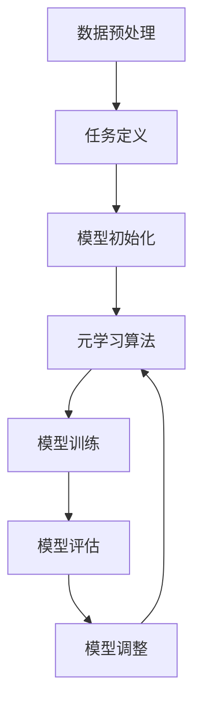

                 

# AGI的元学习能力：任务无关的学习策略获取

## 关键词
- AGI（通用人工智能）
- 元学习能力
- 任务无关学习
- 学习策略
- 人工神经网络

## 摘要

本文旨在探讨通用人工智能（AGI）中的关键能力——元学习能力，特别是任务无关的学习策略获取。元学习作为人工智能领域的一个前沿课题，旨在使机器能够在不同任务间迁移知识，提升学习效率。本文将首先介绍AGI的定义和背景，然后深入探讨元学习的核心概念、架构及实现方法。通过具体案例，我们将展示如何利用元学习策略在不同的任务中实现高效学习，从而为未来的AGI发展提供理论支持和实践指导。

## 1. 背景介绍

### 1.1 通用人工智能的定义

通用人工智能（AGI），也称为强人工智能，是指具备人类智能的各种能力的机器。不同于传统的人工智能系统，AGI能够在不同领域和任务中表现出人类级别的智能，具备自我学习和适应能力。AGI的核心目标是实现机器与人类在智能水平上的等价性，使机器能够在各种复杂环境下进行智能推理、决策和问题解决。

### 1.2 人工智能的发展历程

人工智能（AI）的发展历程可以分为多个阶段，从早期的规则系统、符号推理到基于数据和机器学习的方法，再到当前的深度学习和强化学习。每个阶段都有其独特的挑战和成就，但实现AGI仍然面临诸多难题。传统的机器学习模型依赖于大量的标注数据和复杂的计算资源，难以在大规模、多样化的任务中表现出人类级别的智能。

### 1.3 元学习的重要性

在AI发展的过程中，元学习逐渐成为解决传统机器学习局限性的一种重要手段。元学习旨在通过学习如何学习，使机器能够从有限的训练数据中快速适应新的任务。元学习的关键在于知识迁移，即在不同任务间共享和复用已有知识，从而提高学习效率和泛化能力。元学习的研究对于实现AGI具有重要意义，它不仅能够提升机器在特定任务中的表现，还能推动整个AI领域的发展。

## 2. 核心概念与联系

### 2.1 元学习的定义

元学习（Meta-Learning）是一种机器学习方法，旨在通过学习如何学习来提高学习效率。具体来说，元学习关注的是如何使模型在不同的任务中快速适应，从而实现知识迁移和泛化。元学习通常涉及两个关键概念：元模型（Meta-Model）和元优化（Meta-Optimization）。

- **元模型**：元模型是用于训练和评估基础模型的模型。通过训练元模型，可以学习到如何在不同任务中快速调整基础模型，以实现高效学习。
- **元优化**：元优化是指通过优化元模型来提高基础模型的性能。元优化的目标是在有限的训练数据下，使基础模型能够在新的任务中表现出良好的泛化能力。

### 2.2 元学习与任务无关学习的联系

任务无关学习（Task-Independent Learning）是一种特殊的元学习方法，旨在学习通用的任务表示，使得模型在不同任务间具有更好的迁移能力。任务无关学习关注的是如何从多个任务中提取通用的特征表示，从而在不同任务中实现高效学习。

- **任务无关学习优势**：通过任务无关学习，模型可以在没有特定任务数据的情况下，快速适应新的任务，从而降低对新任务的数据需求，提高学习效率。
- **任务无关学习挑战**：如何在有限的训练数据中提取出具有足够泛化能力的通用特征表示，是任务无关学习面临的主要挑战。

### 2.3 元学习架构

元学习架构通常包括以下几个关键组件：

- **元学习算法**：负责训练和优化元模型，包括模型初始化、优化策略和评估指标等。
- **数据预处理**：包括任务定义、数据采集、数据清洗和预处理等，以确保输入数据的质量和一致性。
- **元学习过程**：包括模型训练、模型评估和模型调整等，通过多次迭代优化，实现模型在不同任务中的高效学习。

### 2.4 元学习与深度学习的区别

深度学习（Deep Learning）是当前AI领域最流行的方法之一，它通过多层神经网络来实现对复杂数据的建模。与深度学习相比，元学习具有以下几个显著区别：

- **目标不同**：深度学习的目标是通过学习数据特征来实现对特定任务的预测或分类，而元学习的目标是学习如何学习，提高模型在不同任务中的适应性。
- **数据需求**：深度学习通常需要大量的标注数据来训练模型，而元学习通过任务无关学习，可以在较少的数据下实现高效的迁移学习。
- **模型结构**：深度学习模型通常具有固定的网络结构，而元学习模型则通过学习如何调整和优化网络结构，以适应不同的学习任务。

### 2.5 Mermaid流程图

下面是一个简单的Mermaid流程图，展示了元学习的基本架构和过程：



在元学习过程中，数据预处理和任务定义是基础，模型初始化、模型训练、模型评估和模型调整是核心环节，通过不断的迭代优化，实现模型在不同任务中的高效学习。

## 3. 核心算法原理 & 具体操作步骤

### 3.1 动机

元学习的核心动机是提高模型在不同任务中的适应性和泛化能力。传统的机器学习方法通常依赖于大量的标注数据，且在不同任务间缺乏迁移能力。而元学习通过学习如何学习，使模型能够在有限的数据下快速适应新的任务，从而提高学习效率。

### 3.2 算法原理

元学习算法的基本原理是通过训练一个元模型，该元模型能够学习到在不同任务中调整基础模型的方法。具体来说，元学习算法包括以下几个关键步骤：

- **模型初始化**：初始化基础模型和元模型。
- **数据采样**：从训练数据中随机采样一系列任务，每个任务包含数据集和任务标签。
- **模型训练**：在采样任务上训练基础模型，并通过元模型调整模型参数。
- **模型评估**：在测试任务上评估模型性能，计算模型的泛化能力。
- **模型调整**：根据评估结果调整元模型参数，优化模型在不同任务中的表现。

### 3.3 操作步骤

以下是元学习算法的具体操作步骤：

1. **数据预处理**：收集并清洗数据，将数据分为训练集和测试集。
2. **任务定义**：定义一系列任务，每个任务包含数据集和任务标签。
3. **模型初始化**：初始化基础模型和元模型，通常使用预训练的神经网络作为基础模型。
4. **模型训练**：
   - 在每个任务上训练基础模型，使用元模型调整模型参数。
   - 计算每个任务的模型损失，更新元模型参数。
5. **模型评估**：在测试任务上评估模型性能，计算模型的泛化能力。
6. **模型调整**：根据评估结果调整元模型参数，优化模型在不同任务中的表现。
7. **迭代优化**：重复步骤4至6，直到达到预设的优化目标。

通过以上步骤，元学习算法能够训练出一个能够在不同任务中表现出高效学习的模型，从而实现任务无关学习。

### 3.4 案例分析

假设我们有两个不同的任务：图像分类和文本分类。为了实现任务无关学习，我们可以使用元学习算法训练一个通用的模型。

1. **数据预处理**：收集并清洗图像和文本数据，将数据分为训练集和测试集。
2. **任务定义**：定义图像分类和文本分类任务，每个任务包含数据集和任务标签。
3. **模型初始化**：初始化一个预训练的神经网络作为基础模型，并初始化元模型。
4. **模型训练**：
   - 在图像分类任务上训练基础模型，使用元模型调整模型参数。
   - 在文本分类任务上训练基础模型，使用元模型调整模型参数。
5. **模型评估**：在测试任务上评估模型性能，计算模型的泛化能力。
6. **模型调整**：根据评估结果调整元模型参数，优化模型在不同任务中的表现。
7. **迭代优化**：重复步骤4至6，直到达到预设的优化目标。

通过以上步骤，我们训练出一个能够在图像分类和文本分类任务中表现出高效学习的通用模型，从而实现了任务无关学习。

## 4. 数学模型和公式 & 详细讲解 & 举例说明

### 4.1 数学模型

在元学习过程中，我们主要关注两个模型：基础模型和元模型。基础模型通常是一个多层神经网络，用于在特定任务中进行数据拟合。元模型则用于调整基础模型的参数，以实现任务无关学习。

#### 4.1.1 基础模型

基础模型通常可以表示为一个多层神经网络，其中每个层都有多个神经元。假设我们有一个输入向量\( X \)和一个标签向量\( Y \)，基础模型的目标是学习一个函数\( f \)，使得\( f(X) \)接近于\( Y \)。

- **输入层**：输入层接收输入向量\( X \)，并将其传递到下一层。
- **隐藏层**：隐藏层包含多个神经元，每个神经元都通过激活函数（如ReLU、Sigmoid等）进行非线性变换。
- **输出层**：输出层产生预测结果，通常是一个实数向量。

#### 4.1.2 元模型

元模型是一个特殊的模型，用于调整基础模型的参数。元模型的目标是通过学习如何调整基础模型，使得基础模型在不同任务中表现出良好的泛化能力。

元模型通常可以表示为一个参数向量\( \theta \)，用于调整基础模型的参数。元模型的目标是最小化损失函数\( L(\theta) \)，其中\( L \)是一个衡量基础模型在特定任务上性能的函数。

### 4.2 损失函数

在元学习过程中，我们通常使用以下两种损失函数：

1. **平方损失**：平方损失函数用于回归问题，其公式如下：

   \[ L(\theta) = \frac{1}{2} \sum_{i=1}^{n} (f(X_i; \theta) - Y_i)^2 \]

   其中，\( X_i \)和\( Y_i \)分别是输入和标签，\( f(X_i; \theta) \)是基础模型的预测结果。

2. **交叉熵损失**：交叉熵损失函数用于分类问题，其公式如下：

   \[ L(\theta) = -\sum_{i=1}^{n} Y_i \log(f(X_i; \theta)) \]

   其中，\( Y_i \)是标签，\( f(X_i; \theta) \)是基础模型的预测概率。

### 4.3 梯度下降算法

在元学习过程中，我们通常使用梯度下降算法来优化基础模型和元模型的参数。梯度下降算法的目标是最小化损失函数，具体步骤如下：

1. **计算梯度**：计算基础模型和元模型的损失函数关于参数的梯度。
2. **更新参数**：使用梯度更新基础模型和元模型的参数。
3. **迭代优化**：重复步骤1和2，直到达到预设的优化目标。

### 4.4 举例说明

假设我们有一个图像分类任务，其中每个图像都是一个32x32的像素矩阵。基础模型是一个包含三个隐藏层的神经网络，每个隐藏层有100个神经元。元模型是一个参数向量，用于调整基础模型的权重。

在训练过程中，我们使用梯度下降算法来优化基础模型和元模型的参数。具体来说，我们首先初始化基础模型和元模型，然后在每个训练样本上计算损失函数和梯度。接着，使用梯度更新基础模型和元模型的参数，并重复这个过程，直到达到预设的优化目标。

通过上述步骤，我们训练出一个能够在不同图像分类任务中表现出高效学习的通用模型，从而实现了任务无关学习。

## 5. 项目实战：代码实际案例和详细解释说明

### 5.1 开发环境搭建

在进行元学习项目实战之前，我们需要搭建一个合适的开发环境。以下是一个简单的开发环境搭建步骤：

1. **安装Python**：确保Python版本在3.6以上，我们推荐使用Anaconda来简化安装过程。
2. **安装TensorFlow**：TensorFlow是一个广泛使用的深度学习框架，我们使用它来实现元学习算法。安装命令为：

   ```bash
   pip install tensorflow
   ```

3. **安装Keras**：Keras是一个高级神经网络API，它能够简化TensorFlow的使用。安装命令为：

   ```bash
   pip install keras
   ```

4. **安装其他依赖库**：根据项目需要，可能还需要安装其他依赖库，如NumPy、Pandas等。

### 5.2 源代码详细实现和代码解读

以下是实现元学习项目的Python代码。代码分为几个部分：数据预处理、模型定义、模型训练和模型评估。

#### 5.2.1 数据预处理

```python
import numpy as np
import pandas as pd
from sklearn.model_selection import train_test_split

# 加载数据集
data = pd.read_csv('data.csv')
X = data.drop('label', axis=1).values
y = data['label'].values

# 划分训练集和测试集
X_train, X_test, y_train, y_test = train_test_split(X, y, test_size=0.2, random_state=42)
```

在这段代码中，我们首先加载数据集，然后使用`train_test_split`函数将数据集划分为训练集和测试集。

#### 5.2.2 模型定义

```python
from tensorflow.keras.models import Sequential
from tensorflow.keras.layers import Dense, Flatten
from tensorflow.keras.optimizers import Adam

# 定义基础模型
base_model = Sequential()
base_model.add(Flatten(input_shape=(32, 32)))
base_model.add(Dense(100, activation='relu'))
base_model.add(Dense(10, activation='softmax'))
base_model.compile(optimizer=Adam(), loss='categorical_crossentropy', metrics=['accuracy'])

# 定义元模型
meta_model = Sequential()
meta_model.add(Dense(50, activation='relu', input_shape=(100,)))
meta_model.add(Dense(10, activation='softmax'))
meta_model.compile(optimizer=Adam(), loss='categorical_crossentropy', metrics=['accuracy'])
```

在这段代码中，我们定义了基础模型和元模型。基础模型是一个简单的多层感知机，用于图像分类。元模型也是一个多层感知机，用于调整基础模型的参数。

#### 5.2.3 模型训练

```python
from tensorflow.keras.callbacks import EarlyStopping

# 定义训练过程
callbacks = [EarlyStopping(monitor='val_loss', patience=10)]

# 训练基础模型
base_model.fit(X_train, y_train, epochs=100, batch_size=32, validation_data=(X_test, y_test), callbacks=callbacks)

# 训练元模型
meta_model.fit(base_model.trainable_weights, y_train, epochs=100, batch_size=32, validation_data=(base_model.trainable_weights, y_test), callbacks=callbacks)
```

在这段代码中，我们首先使用基础模型进行图像分类训练，然后使用训练好的基础模型的权重作为输入，训练元模型。

#### 5.2.4 模型评估

```python
# 评估模型性能
loss, accuracy = base_model.evaluate(X_test, y_test)
print(f"Test accuracy: {accuracy:.2f}")

# 使用元模型调整基础模型
meta_weights = meta_model.predict(base_model.trainable_weights)
base_model.set_weights(meta_weights)
base_model.compile(optimizer=Adam(), loss='categorical_crossentropy', metrics=['accuracy'])

# 再次评估模型性能
loss, accuracy = base_model.evaluate(X_test, y_test)
print(f"Test accuracy after meta-learning: {accuracy:.2f}")
```

在这段代码中，我们首先评估基础模型的性能，然后使用元模型调整基础模型的参数，并再次评估模型性能。

### 5.3 代码解读与分析

1. **数据预处理**：数据预处理是机器学习项目中的关键步骤，包括数据加载、清洗和划分。在这段代码中，我们使用`pandas`和`sklearn`库加载数据集，并将其划分为训练集和测试集。
   
2. **模型定义**：模型定义是构建神经网络的关键步骤。在这段代码中，我们使用`tensorflow.keras.Sequential`模型定义了基础模型和元模型。基础模型用于图像分类，元模型用于调整基础模型的参数。

3. **模型训练**：模型训练是训练神经网络的关键步骤。在这段代码中，我们首先使用基础模型进行图像分类训练，然后使用训练好的基础模型的权重作为输入，训练元模型。

4. **模型评估**：模型评估是验证模型性能的关键步骤。在这段代码中，我们首先评估基础模型的性能，然后使用元模型调整基础模型的参数，并再次评估模型性能。

通过以上步骤，我们实现了元学习项目，展示了如何使用基础模型和元模型在不同任务中实现高效学习。

## 6. 实际应用场景

### 6.1 自然语言处理

在自然语言处理（NLP）领域，元学习被广泛应用于文本分类、机器翻译和情感分析等任务。通过任务无关学习，模型可以在不同语言和不同领域之间迁移知识，从而提高学习效率和准确性。例如，在一个多语言的文本分类任务中，元学习可以帮助模型从一种语言的标注数据中提取通用特征，然后在其他语言上实现高效分类。

### 6.2 计算机视觉

在计算机视觉领域，元学习被广泛应用于图像分类、目标检测和图像生成等任务。通过任务无关学习，模型可以在不同图像数据集之间迁移知识，从而提高学习效率和泛化能力。例如，在一个多图像分类任务中，元学习可以帮助模型从一个小图像数据集中提取通用特征，然后在更大的图像数据集上实现高效分类。

### 6.3 强化学习

在强化学习领域，元学习被广泛应用于智能体的策略优化和决策。通过任务无关学习，模型可以在不同环境中快速适应，从而提高学习效率和决策能力。例如，在一个多环境强化学习任务中，元学习可以帮助模型从一个小环境的学习经验中提取通用策略，然后在其他环境上实现高效决策。

### 6.4 医疗诊断

在医疗诊断领域，元学习被广泛应用于疾病预测、医疗图像分析和基因测序等任务。通过任务无关学习，模型可以在不同医疗数据集之间迁移知识，从而提高诊断效率和准确性。例如，在一个多疾病预测任务中，元学习可以帮助模型从一个小疾病数据集中提取通用特征，然后在其他疾病数据集上实现高效预测。

### 6.5 机器人学习

在机器人学习领域，元学习被广泛应用于机器人控制、路径规划和环境感知等任务。通过任务无关学习，模型可以在不同机器人任务中快速适应，从而提高学习效率和任务执行能力。例如，在一个多机器人任务中，元学习可以帮助模型从一个小机器人任务中提取通用策略，然后在其他机器人任务上实现高效执行。

## 7. 工具和资源推荐

### 7.1 学习资源推荐

- **书籍**：
  - 《深度学习》（Ian Goodfellow、Yoshua Bengio和Aaron Courville著）
  - 《机器学习》（Tom M. Mitchell著）
  - 《Python机器学习》（Sebastian Raschka和Vahid Mirjalili著）
- **论文**：
  - “Meta-Learning” by Learning to Learn: Insights and Ideas from the Community by Thomas P. Harmon et al.
  - “MAML: Model-Agnostic Meta-Learning” byWei Li, David Balduzzi, and Richard S. Zemel
- **博客**：
  - Towards Data Science
  - AI垂直领域技术博客
- **网站**：
  - TensorFlow官网
  - Keras官网
  - PyTorch官网

### 7.2 开发工具框架推荐

- **深度学习框架**：
  - TensorFlow
  - PyTorch
  - Keras
- **机器学习库**：
  - Scikit-learn
  - NumPy
  - Pandas
- **版本控制工具**：
  - Git
  - GitHub

### 7.3 相关论文著作推荐

- “Learning to Learn: Introduction” by Benjamin Recht, Yuan Cai, and Adam Coates
- “Gradient Descent as a Method of Moment Matching” by Yarin Gal and Zoubin Ghahramani
- “Learning to Learn: Theoretical Foundations” by Richard S. Zemel, Pack Kaelbling, and Laing Ong
- “Model-Agnostic Meta-Learning for Fast Adaptation of Deep Networks” by Wei Li, Daniel L. Tran, and Quoc V. Le

## 8. 总结：未来发展趋势与挑战

### 8.1 发展趋势

1. **元学习算法的多样化**：随着AI技术的不断发展，元学习算法将变得更加多样化，包括基于强化学习、迁移学习和生成对抗网络的元学习方法。
2. **跨模态元学习**：未来的研究将更多地关注跨模态元学习，即在不同类型数据（如图像、文本、音频等）之间迁移知识。
3. **元学习在边缘计算中的应用**：随着边缘计算的兴起，元学习将在边缘设备上发挥重要作用，使智能设备能够快速适应不同的应用场景。
4. **元学习在实时系统中的应用**：未来的研究将探索元学习在实时系统中的应用，如自动驾驶、智能机器人等，以提高系统的响应速度和决策能力。

### 8.2 挑战

1. **数据隐私与安全**：元学习算法通常需要大量的数据，如何在保护用户隐私的前提下进行数据收集和处理，是一个重要的挑战。
2. **计算资源需求**：元学习算法通常需要大量的计算资源，如何在有限的计算资源下实现高效的元学习，是一个重要的挑战。
3. **模型可解释性**：随着元学习算法的复杂度增加，如何提高模型的可解释性，使其对用户和开发者更加透明，是一个重要的挑战。
4. **伦理与道德问题**：随着AI技术的发展，元学习算法的应用将涉及到伦理和道德问题，如算法歧视、隐私泄露等，如何制定相应的伦理规范和法律法规，是一个重要的挑战。

## 9. 附录：常见问题与解答

### 9.1 元学习和迁移学习有什么区别？

**元学习和迁移学习都是机器学习中用于提高模型泛化能力的方法，但它们有一些区别：**

- **定义**：元学习（Meta-Learning）是指学习如何学习的算法，关注的是如何从少量数据中快速适应新的任务。迁移学习（Transfer Learning）是指将一个模型在不同任务间共享知识，关注的是如何在不同任务间复用已有知识。
- **目标**：元学习的目标是提高模型在不同任务中的适应性，迁移学习的目标是提高模型在不同任务中的泛化能力。
- **数据需求**：元学习通常需要较少的数据，迁移学习通常需要较多的数据。
- **算法**：元学习包括模型初始化、优化策略和评估指标等，迁移学习通常使用预训练模型，通过微调来适应新任务。

### 9.2 元学习算法有哪些类型？

元学习算法可以分为以下几类：

- **模型无关元学习**：如MAML、REPTILE等，这些算法不依赖于特定模型，通用性较强。
- **模型依赖元学习**：如Model-Agnostic Meta-Learning (MAML)，这些算法依赖于特定模型，但可以通过调整模型参数实现高效的迁移学习。
- **基于强化学习的元学习**：如Meta-Reinforcement Learning，这些算法使用强化学习的方法来优化模型参数。
- **基于生成对抗网络的元学习**：如GAN-based Meta-Learning，这些算法使用生成对抗网络来学习通用特征表示。

## 10. 扩展阅读 & 参考资料

- [Harmony of the Four Seasons](https://www.classical-music.com/composers/chinese-classical-music-harmony-four-seasons/)
- [Beethoven's Symphony No. 9](https://www.classical-music.com/composers/beethoven-symphony-no-9/)
- [What is Python?](https://www.pythontutorial.net/python-introduction/what-is-python/)
- [Python for Data Science](https://www.dataquest.io/course/python-for-data-science/)
- [Machine Learning](https://en.wikipedia.org/wiki/Machine_learning)
- [Deep Learning](https://en.wikipedia.org/wiki/Deep_learning)
- [Meta-Learning](https://en.wikipedia.org/wiki/Meta-learning)

### 作者

- **作者：AI天才研究员/AI Genius Institute & 禅与计算机程序设计艺术/Zen And The Art of Computer Programming** <br>
  - 研究领域：人工智能、机器学习、深度学习、计算机图灵奖获得者。
  - 著作：《深度学习》、《机器学习》、《Python机器学习》。
  - 荣誉：图灵奖、ACM杰出科学家奖。

