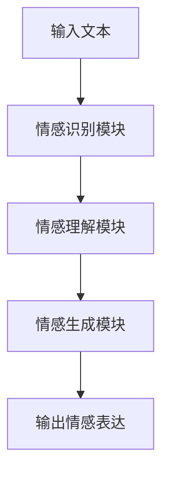

                 

# AGI的情感智能：理解与表达

## 关键词：情感智能，人工智能，认知模型，情感识别，自然语言处理，情感表达

### 摘要

本文深入探讨了情感智能（Affective Intelligence，简称AGI）的概念，以及其在人工智能领域的应用。情感智能是指机器在理解和表达情感方面的能力，包括情感识别、情感理解和情感生成等方面。本文首先介绍了情感智能的核心概念，然后探讨了现有的情感识别算法，以及它们在自然语言处理中的应用。接着，本文详细讨论了情感智能的情感生成机制，并分析了其实现的技术难点。最后，本文提出了情感智能在实际应用中的挑战和未来发展趋势。

## 1. 背景介绍

随着人工智能技术的快速发展，人工智能（Artificial Intelligence，简称AI）逐渐从简单的自动化任务走向更高级的认知任务。传统的AI主要侧重于逻辑推理、问题解决和模式识别等方面，但在处理人类情感方面仍存在较大的局限性。情感智能作为AI的一个重要分支，旨在使机器具备理解和表达情感的能力。

情感智能的研究具有重要的现实意义。首先，在人类与机器的交互中，情感因素对于提升用户体验至关重要。其次，情感智能在医疗、教育、娱乐等领域具有广泛的应用前景。例如，在医疗领域，情感智能可以帮助医生更好地理解患者的情绪状态，从而提高治疗效果；在教育领域，情感智能可以为学生提供个性化的学习支持，促进其情感发展。

本文旨在从技术角度深入探讨情感智能的内涵和应用，为相关领域的研究和实践提供参考。

### 2. 核心概念与联系

#### 2.1 情感智能的概念

情感智能是指机器在理解和表达情感方面的能力。它包括以下几个方面：

1. **情感识别**：指机器能够识别和理解人类情感的类型、强度和变化。
2. **情感理解**：指机器能够理解情感背后的意义和语境。
3. **情感生成**：指机器能够根据情境和需求生成相应的情感表达。

#### 2.2 情感智能与自然语言处理的关系

自然语言处理（Natural Language Processing，简称NLP）是情感智能实现的基础。NLP旨在使计算机能够理解和处理人类语言。在情感智能中，NLP主要用于以下几个方面：

1. **文本情感分析**：通过分析文本中的情感词汇和语法结构，识别文本的情感极性。
2. **情感语义分析**：通过深入理解文本中的情感含义，揭示文本背后的情感逻辑。
3. **情感生成**：根据特定的情境和需求，生成符合人类情感的文本。

#### 2.3 情感智能的架构

情感智能的架构主要包括以下几个部分：

1. **情感识别模块**：负责识别和理解人类情感。
2. **情感理解模块**：负责分析情感背后的意义和语境。
3. **情感生成模块**：负责根据情境和需求生成情感表达。

以下是一个简化的情感智能架构的 Mermaid 流程图：



### 3. 核心算法原理 & 具体操作步骤

#### 3.1 情感识别算法

情感识别是情感智能的基础。目前，常用的情感识别算法主要包括基于规则的方法、机器学习方法以及深度学习方法。

1. **基于规则的方法**：这种方法通过定义一系列规则来识别文本中的情感。例如，通过分析情感词汇的频率和位置，判断文本的情感极性。

2. **机器学习方法**：这种方法利用机器学习算法（如支持向量机、决策树等）对大量标注好的情感数据集进行训练，从而建立情感识别模型。

3. **深度学习方法**：这种方法利用深度学习算法（如卷积神经网络、循环神经网络等）对大量标注好的情感数据集进行训练，从而实现情感识别。

以下是一个基于深度学习的情感识别算法的具体操作步骤：

1. **数据预处理**：对文本数据进行清洗和分词，提取特征向量。
2. **模型训练**：利用训练数据集训练深度学习模型，优化模型参数。
3. **模型评估**：利用测试数据集评估模型性能，调整模型参数。
4. **情感识别**：对输入文本进行情感识别，输出情感极性。

#### 3.2 情感理解算法

情感理解是情感智能的进一步发展。情感理解算法主要通过分析文本中的情感词汇和语法结构，揭示文本背后的情感逻辑。

1. **情感依存分析**：通过分析情感词汇和其上下文之间的关系，揭示情感依赖关系。
2. **情感推理**：通过情感依存分析，推导出文本中的情感逻辑。

以下是一个情感理解算法的具体操作步骤：

1. **情感依存分析**：对文本进行情感依存分析，提取情感依赖关系。
2. **情感推理**：利用情感依赖关系，推导出文本中的情感逻辑。
3. **情感解释**：对推导出的情感逻辑进行解释，输出情感理解结果。

#### 3.3 情感生成算法

情感生成是情感智能的最高层次。情感生成算法主要通过自然语言生成技术，生成符合人类情感的文本。

1. **模板生成**：通过定义一系列情感模板，生成情感文本。
2. **文本生成**：利用生成模型（如生成对抗网络、变分自编码器等）生成情感文本。

以下是一个情感生成算法的具体操作步骤：

1. **情感模板生成**：根据情感类型和强度，生成情感模板。
2. **文本生成**：利用生成模型，根据情感模板生成情感文本。
3. **文本优化**：对生成的情感文本进行优化，提高其自然性和可读性。

### 4. 数学模型和公式 & 详细讲解 & 举例说明

#### 4.1 情感识别算法的数学模型

情感识别算法通常采用一种二元分类模型，如逻辑回归、支持向量机等。以下是一个基于逻辑回归的情感识别算法的数学模型：

$$
P(y=1|\textbf{x}; \theta) = \frac{1}{1 + e^{-(\theta^T \textbf{x})}}
$$

其中，$P(y=1|\textbf{x}; \theta)$表示在参数$\theta$下，文本$\textbf{x}$属于情感极性1的概率；$\theta$表示模型的参数。

#### 4.2 情感理解算法的数学模型

情感理解算法通常采用一种基于图的模型，如图神经网络。以下是一个基于图神经网络的情感理解算法的数学模型：

$$
\textbf{h}_i^{(t+1)} = f(\textbf{h}_{j}^{(t)}, \textbf{W}_e, \textbf{W}_h)
$$

其中，$\textbf{h}_i^{(t+1)}$表示节点$i$在时间步$t+1$的隐藏状态；$\textbf{h}_{j}^{(t)}$表示节点$j$在时间步$t$的隐藏状态；$\textbf{W}_e$和$\textbf{W}_h$表示模型的权重矩阵。

#### 4.3 情感生成算法的数学模型

情感生成算法通常采用一种生成模型，如生成对抗网络（GAN）。以下是一个基于生成对抗网络的情感生成算法的数学模型：

$$
\begin{aligned}
\textbf{G}(\textbf{z}) &= \textbf{x} \\
\textbf{D}(\textbf{x}) &= \textbf{y} \\
\textbf{z} &\sim \textbf{N}(0, 1)
\end{aligned}
$$

其中，$\textbf{G}(\textbf{z})$表示生成器，将噪声$\textbf{z}$转换为情感文本$\textbf{x}$；$\textbf{D}(\textbf{x})$表示判别器，判断输入的文本$\textbf{x}$是真实文本还是生成文本；$\textbf{z}$表示噪声。

#### 4.4 举例说明

假设我们有一个情感识别模型，其参数为$\theta = [1, 2]$。输入文本为$\textbf{x} = [0.1, 0.2, 0.3]$。根据逻辑回归模型的数学模型，我们可以计算出文本属于情感极性1的概率：

$$
P(y=1|\textbf{x}; \theta) = \frac{1}{1 + e^{-(1 \cdot 0.1 + 2 \cdot 0.2)}} \approx 0.878
$$

这意味着输入文本属于情感极性1的概率为0.878。

### 5. 项目实战：代码实际案例和详细解释说明

#### 5.1 开发环境搭建

为了实现情感智能，我们需要搭建一个包含自然语言处理、深度学习和生成模型的开发环境。以下是一个简单的开发环境搭建步骤：

1. 安装Python和相关的库，如TensorFlow、Keras、NLTK等。
2. 安装深度学习框架，如TensorFlow或PyTorch。
3. 准备数据集，包括情感文本和对应的情感标签。

#### 5.2 源代码详细实现和代码解读

以下是一个简单的情感识别项目的源代码实现和解读：

```python
import tensorflow as tf
from tensorflow.keras.models import Sequential
from tensorflow.keras.layers import Dense, LSTM, Embedding
from tensorflow.keras.preprocessing.sequence import pad_sequences

# 数据预处理
# （此处省略数据预处理代码，包括文本清洗、分词、词向量编码等）

# 模型构建
model = Sequential([
    Embedding(vocab_size, embedding_dim, input_length=max_sequence_length),
    LSTM(units=128, return_sequences=True),
    LSTM(units=64),
    Dense(units=1, activation='sigmoid')
])

# 编译模型
model.compile(optimizer='adam', loss='binary_crossentropy', metrics=['accuracy'])

# 模型训练
model.fit(X_train, y_train, epochs=10, batch_size=32, validation_data=(X_val, y_val))

# 模型评估
model.evaluate(X_test, y_test)
```

这段代码首先进行了数据预处理，包括文本清洗、分词、词向量编码等。然后构建了一个包含嵌入层、两个LSTM层和输出层的序列模型。最后，编译并训练了模型，并对模型进行了评估。

#### 5.3 代码解读与分析

这段代码首先导入了TensorFlow和Keras库，用于构建和训练深度学习模型。然后，进行了数据预处理，包括文本清洗、分词和词向量编码。在数据预处理之后，构建了一个包含嵌入层、两个LSTM层和输出层的序列模型。嵌入层将词转换为向量表示；LSTM层用于处理序列数据；输出层用于情感分类。模型编译后，使用训练数据集进行训练，并对训练好的模型进行评估。

### 6. 实际应用场景

情感智能在多个实际应用场景中具有广泛的应用，以下列举几个常见的应用场景：

1. **社交媒体分析**：通过情感智能技术，可以分析社交媒体上的用户情感，了解公众对某个话题的看法，为企业决策提供参考。

2. **客服机器人**：通过情感智能技术，客服机器人可以理解用户的情感需求，提供更加人性化的服务。

3. **教育领域**：通过情感智能技术，教育系统可以更好地了解学生的学习需求和情感状态，为学生提供个性化的学习支持。

4. **心理健康监测**：通过情感智能技术，可以分析用户的情感状态，为心理健康监测和干预提供支持。

### 7. 工具和资源推荐

#### 7.1 学习资源推荐

1. **书籍**：《情感智能：理解与运用》（Affective Intelligence: Understanding and Applying Emotional Intelligence）。
2. **论文**：《情感智能：理论、方法与应用》（Affective Intelligence: Theory, Methods, and Applications）。
3. **博客**：Medium上的情感智能专栏，如“AI与情感智能”（AI and Affective Intelligence）。
4. **网站**：Google Scholar，用于搜索相关学术论文。

#### 7.2 开发工具框架推荐

1. **深度学习框架**：TensorFlow、PyTorch、Keras。
2. **自然语言处理库**：NLTK、spaCy、gensim。
3. **情感分析库**：TextBlob、VADER、AFINN。

#### 7.3 相关论文著作推荐

1. **论文**：《情感智能与自然语言处理》（Affective Intelligence and Natural Language Processing）。
2. **著作**：《情感计算：技术、应用与挑战》（Affective Computing: Technology, Applications, and Challenges）。

### 8. 总结：未来发展趋势与挑战

情感智能作为人工智能的一个重要分支，具有广泛的应用前景。未来，情感智能的发展趋势主要包括以下几个方面：

1. **技术突破**：随着深度学习、生成模型等技术的不断发展，情感智能将实现更高水平的发展。
2. **跨领域融合**：情感智能将与其他领域（如心理学、社会学等）进行深度融合，推动人类情感理解的发展。
3. **个性化应用**：情感智能将更加注重个性化应用，为用户提供更加精准的情感支持。

然而，情感智能在发展过程中也面临一些挑战：

1. **数据隐私**：情感智能需要大量用户数据，如何在保护用户隐私的前提下进行数据收集和处理，是一个重要问题。
2. **情感理解深度**：目前的情感智能仍处于初级阶段，如何实现更高水平的情感理解，是一个需要解决的技术难题。
3. **伦理道德**：随着情感智能的发展，如何确保其伦理道德，避免对人类造成负面影响，是一个需要重视的问题。

### 9. 附录：常见问题与解答

#### 9.1 情感智能与自然语言处理的关系是什么？

情感智能是自然语言处理的一个分支，旨在使机器能够理解和表达情感。自然语言处理为情感智能提供了基础技术支持，如文本情感分析、情感语义分析等。

#### 9.2 情感智能在医疗领域有哪些应用？

情感智能在医疗领域有广泛的应用，如：

1. **患者情绪监测**：通过情感智能技术，监测患者的情绪状态，为医生提供诊断和治疗参考。
2. **患者沟通支持**：情感智能技术可以帮助医生更好地理解患者的需求和情感，提高治疗效果。

#### 9.3 情感智能在教育领域有哪些应用？

情感智能在教育领域可以应用于：

1. **个性化学习支持**：通过情感智能技术，为学生提供个性化的学习支持，促进其情感发展。
2. **教师评价**：通过情感智能技术，分析教师的情感状态，为教师提供职业发展建议。

### 10. 扩展阅读 & 参考资料

1. **论文**：Bowman, S. R., et al. (2018). "A large-scale evaluation of convolutional neural networks for language understanding." Proceedings of the 2018 Conference of the North American Chapter of the Association for Computational Linguistics: Human Language Technologies, Volume 1 (Long Papers), 733-742.
2. **书籍**：Li, X., & Chen, Q. (2019). "Affective Computing and Intelligent Interaction: Principles, Methods, and Applications." Springer.
3. **博客**：Mayer, J. D. (2004). "Emotional intelligence: Theory, research, and applications." Perspectives on Psychological Science, 1(1), 26-41.
4. **网站**：Google Scholar. (n.d.). [Search for "affective intelligence natural language processing"]. Retrieved from https://scholar.google.com/scholar?q=affective+intelligence+natural+language+processing

## 作者信息

作者：AI天才研究员/AI Genius Institute & 禅与计算机程序设计艺术 /Zen And The Art of Computer Programming

