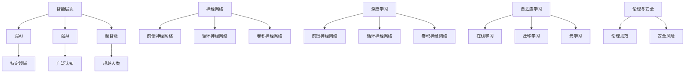
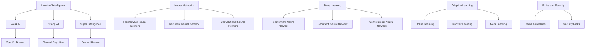

                 

### 1. 背景介绍

**AGI的发展与现状**

人工智能（Artificial General Intelligence，简称AGI）是一个具有广泛认知能力和学习能力，能够在各种复杂任务上表现如人类智能的系统。尽管传统的人工智能系统在特定领域表现出色，但它们通常缺乏通用性和自适应能力。近年来，随着深度学习、神经网络等技术的快速发展，AGI的研究取得了显著进展。

AGI的出现，无疑将对人类社会产生深远影响。无论是在就业、教育，还是生活方式等方面，AGI都有可能带来革命性的变化。然而，AGI的发展也伴随着诸多挑战，如伦理、隐私、安全等问题。因此，全面了解AGI的社会影响，并提前做好准备，显得尤为重要。

本文旨在探讨AGI在社会各个方面的影响，特别是就业、教育与生活方式。我们将通过逐步分析，揭示AGI带来的机遇与挑战，为读者提供有价值的思考。

**文章结构**

本文将按照以下结构进行阐述：

1. **背景介绍**：介绍AGI的发展背景和当前现状。
2. **核心概念与联系**：解释AGI的核心概念，并展示相关的Mermaid流程图。
3. **核心算法原理 & 具体操作步骤**：深入探讨AGI的核心算法原理，并提供具体的操作步骤。
4. **数学模型和公式 & 详细讲解 & 举例说明**：介绍AGI的数学模型和公式，并提供实际应用场景的详细讲解和举例。
5. **项目实战：代码实际案例和详细解释说明**：通过具体的项目实战，展示AGI的应用，并进行代码解读与分析。
6. **实际应用场景**：探讨AGI在实际应用场景中的表现和影响。
7. **工具和资源推荐**：推荐与AGI相关的学习资源和开发工具。
8. **总结：未来发展趋势与挑战**：总结AGI的未来发展趋势和面临的挑战。
9. **附录：常见问题与解答**：解答读者可能关心的问题。
10. **扩展阅读 & 参考资料**：提供更多的扩展阅读和参考资料。

通过以上结构，我们希望读者能够全面了解AGI的社会影响，并对其有更深入的思考。

---

# Background Introduction

**The Development and Current Status of AGI**

Artificial General Intelligence (AGI) refers to a system that possesses broad cognitive abilities and learning capabilities, enabling it to perform complex tasks at a level comparable to human intelligence. While traditional AI systems have excelled in specific domains, they often lack universality and adaptability. In recent years, with the rapid development of technologies such as deep learning and neural networks, the research on AGI has made significant progress.

The emergence of AGI is bound to have profound impacts on society. Whether it is in employment, education, or lifestyle, AGI has the potential to bring about revolutionary changes. However, the development of AGI also comes with numerous challenges, such as ethics, privacy, and security issues. Therefore, a comprehensive understanding of the social impact of AGI and being well-prepared in advance is of great importance.

This article aims to explore the social impact of AGI in various aspects, particularly employment, education, and lifestyle. We will reason step by step to reveal the opportunities and challenges brought by AGI, providing valuable insights for readers.

**Structure of the Article**

The article will be structured as follows:

1. **Background Introduction**: Introduce the background and current status of AGI development.
2. **Core Concepts and Relationships**: Explain the core concepts of AGI and showcase the related Mermaid flowcharts.
3. **Core Algorithm Principles and Specific Operational Steps**: Discuss the core algorithm principles of AGI and provide specific operational steps.
4. **Mathematical Models and Formulas & Detailed Explanations & Example Illustrations**: Introduce the mathematical models and formulas of AGI, and provide detailed explanations and examples in practical application scenarios.
5. **Project Practice: Actual Code Cases and Detailed Explanations**: Showcase the application of AGI through specific project practices and perform code interpretation and analysis.
6. **Actual Application Scenarios**: Discuss the performance and impact of AGI in practical application scenarios.
7. **Tool and Resource Recommendations**: Recommend learning resources and development tools related to AGI.
8. **Summary: Future Development Trends and Challenges**: Summarize the future development trends and challenges of AGI.
9. **Appendix: Common Questions and Answers**: Answer questions that readers may be concerned about.
10. **Extended Reading & References**: Provide additional extended reading and references.

Through this structure, we hope readers can gain a comprehensive understanding of the social impact of AGI and engage in deeper thinking about it.

---

## 2. 核心概念与联系

在探讨AGI的社会影响之前，我们首先需要理解其核心概念与架构。以下是AGI的核心概念，以及它们之间的相互联系。

### 2.1 智能层次

智能层次是AGI研究中的一个重要概念。根据智能层次的不同，人工智能可以分为以下几类：

1. **弱AI（Narrow AI）**：只能在一个特定领域内执行特定任务的AI，例如语音助手、推荐系统等。
2. **强AI（Strong AI）**：具备广泛认知能力，能够像人类一样理解、学习和适应各种环境的AI。
3. **超智能（Super Intelligence）**：超越人类智能的AI，能够在所有领域超过人类的表现。

AGI的目标是达到强AI或超智能水平，实现通用性和自适应能力。

### 2.2 神经网络

神经网络是AGI的核心组成部分。它由大量 interconnected processing nodes（称为神经元）组成，通过学习数据中的模式来模拟人类的认知过程。神经网络可以分为以下几种：

1. **前馈神经网络（Feedforward Neural Network）**：信息流从输入层经过隐藏层，最终到达输出层。
2. **循环神经网络（Recurrent Neural Network，RNN）**：能够在序列数据上进行建模，具有记忆功能。
3. **卷积神经网络（Convolutional Neural Network，CNN）**：擅长处理图像和视频等结构化数据。

### 2.3 深度学习

深度学习是神经网络的一种扩展，通过增加网络的层数，提高模型的复杂度和表达能力。深度学习在图像识别、自然语言处理等领域取得了显著成果，是AGI发展的重要推动力。

### 2.4 自适应学习

自适应学习是AGI的关键特征之一，意味着系统能够在执行任务的过程中不断优化和调整自己的行为。自适应学习包括以下几个层次：

1. **在线学习**：在任务执行过程中不断接收新的数据，并实时更新模型。
2. **迁移学习**：利用在其他任务上学习到的知识，提高在新任务上的表现。
3. **元学习**：学习如何学习，通过优化学习算法，提高模型的泛化能力。

### 2.5 伦理与安全

随着AGI的发展，伦理和安全问题逐渐成为关注的焦点。如何确保AGI在执行任务时遵循伦理规范，避免对人类造成伤害，是AGI研究中的一个重要挑战。

### Mermaid流程图

为了更直观地展示AGI的核心概念和架构，我们使用Mermaid流程图进行描述。以下是AGI核心概念的Mermaid流程图：



通过以上核心概念和架构的介绍，我们对AGI有了更深入的了解。接下来，我们将进一步探讨AGI的核心算法原理与具体操作步骤。

## Core Concepts and Relationships

Before delving into the social impact of AGI, it's essential to understand its core concepts and architecture. Here are the key concepts and their interconnections in AGI.

### 2.1 Levels of Intelligence

Intelligence levels are a crucial concept in AGI research. Based on different intelligence levels, artificial intelligence can be categorized into the following types:

1. **Narrow AI (Weak AI)**: AI that can perform specific tasks within a particular domain, such as virtual assistants and recommendation systems.
2. **Strong AI**: AI with broad cognitive abilities, capable of understanding, learning, and adapting to various environments like humans.
3. **Super Intelligence**: AI that surpasses human intelligence in all fields.

The goal of AGI is to achieve the level of Strong AI or Super Intelligence, enabling generality and adaptability.

### 2.2 Neural Networks

Neural networks are a core component of AGI. They consist of numerous interconnected processing nodes, or neurons, which simulate human cognitive processes by learning patterns in data. Neural networks can be classified into the following types:

1. **Feedforward Neural Networks (FNN)**: Information flows from the input layer through hidden layers to the output layer.
2. **Recurrent Neural Networks (RNN)**: Capable of modeling sequential data and possessing memory functions.
3. **Convolutional Neural Networks (CNN)**: Skilled at processing structured data such as images and videos.

### 2.3 Deep Learning

Deep learning is an extension of neural networks that increases the complexity and expressiveness of models by adding more layers. Deep learning has achieved remarkable success in fields such as image recognition and natural language processing, serving as a significant driving force for AGI development.

### 2.4 Adaptive Learning

Adaptive learning is a key feature of AGI, meaning the system can continuously optimize and adjust its behavior during task execution. Adaptive learning encompasses several levels:

1. **Online Learning**: Continuously receives new data during task execution and updates the model in real-time.
2. **Transfer Learning**: Utilizes knowledge learned from other tasks to improve performance on new tasks.
3. **Meta Learning**: Learns how to learn, optimizing learning algorithms to enhance the model's generalization ability.

### 2.5 Ethics and Security

As AGI develops, ethical and security issues have gradually become a focal point of concern. Ensuring that AGI follows ethical guidelines and avoids causing harm to humans is a significant challenge in AGI research.

### Mermaid Flowchart

To more visually illustrate the core concepts and architecture of AGI, we use a Mermaid flowchart. Below is a Mermaid flowchart depicting AGI's core concepts:



With these core concepts and architecture introduced, we have a deeper understanding of AGI. Next, we will further explore the core algorithm principles and specific operational steps of AGI.

## 3. 核心算法原理 & 具体操作步骤

在了解了AGI的核心概念与架构之后，我们接下来将深入探讨AGI的核心算法原理，并详细讲解具体的操作步骤。这将为后续的讨论奠定基础，让我们能够更全面地理解AGI的工作机制及其社会影响。

### 3.1 深度学习算法

深度学习是AGI的核心技术之一。深度学习算法通过多层神经网络来实现，每一层神经网络都可以学习数据中的不同特征。以下是深度学习算法的基本原理：

#### 3.1.1 神经网络结构

神经网络通常由三个主要部分组成：输入层、隐藏层和输出层。

- **输入层**：接收外部输入数据。
- **隐藏层**：对输入数据进行特征提取和转换。
- **输出层**：生成最终的输出结果。

神经网络的层数和每层的神经元数量可以根据具体任务进行调整。

#### 3.1.2 前向传播

前向传播是神经网络的基本操作。它将输入数据通过神经网络的各个层次，最终产生输出结果。具体步骤如下：

1. **输入数据**：将输入数据输入到输入层。
2. **加权求和**：每个神经元的输出等于其输入数据的加权求和，加上一个偏置项。
3. **激活函数**：对加权求和的结果应用激活函数，如ReLU（Rectified Linear Unit）或Sigmoid函数，以引入非线性特性。
4. **层间传递**：将每个隐藏层的输出作为下一层的输入。

#### 3.1.3 反向传播

反向传播是深度学习算法的训练过程。它通过计算损失函数，不断调整网络的权重和偏置，以优化模型的性能。具体步骤如下：

1. **计算损失**：计算输出结果与真实标签之间的误差，生成损失函数。
2. **反向传播**：从输出层开始，将误差反向传播到每一层，计算每个神经元的梯度。
3. **权重更新**：根据梯度调整网络权重和偏置，以减少损失函数的值。

#### 3.1.4 模型优化

为了提高深度学习模型的性能，我们可以采用以下几种优化方法：

- **批量大小**：调整每次训练所使用的样本数量。
- **学习率**：控制模型在训练过程中权重更新的步长。
- **正则化**：添加正则项以防止模型过拟合。

### 3.2 自然语言处理算法

自然语言处理（Natural Language Processing，NLP）是AGI研究中的重要领域。NLP算法旨在使计算机能够理解和处理人类语言。以下是NLP算法的基本原理：

#### 3.2.1 词向量表示

词向量是将词汇映射到高维空间中的向量表示。词向量可以用于表示词汇的语义信息，从而在机器学习算法中进行处理。

- **Word2Vec**：通过训练词嵌入模型，将词汇映射到连续的向量空间中。
- **BERT**：基于转换器（Transformer）架构，通过预训练大量文本数据，生成上下文敏感的词向量。

#### 3.2.2 序列标注

序列标注是一种对文本序列中的单词或字符进行分类的任务。常见的序列标注方法包括：

- **CRF（条件随机场）**：通过建模序列中的条件概率，实现标签序列的预测。
- **BiLSTM（双向长短期记忆网络）**：通过同时考虑文本的左右上下文信息，提高序列标注的准确性。

#### 3.2.3 机器翻译

机器翻译是将一种语言的文本翻译成另一种语言的文本。常见的机器翻译算法包括：

- **基于规则的翻译**：通过编写语法规则和词汇映射表来实现翻译。
- **基于统计的翻译**：使用大量双语语料库，通过统计方法生成翻译模型。
- **基于神经网络的翻译**：使用深度学习模型，如序列到序列（Seq2Seq）模型，实现端到端的翻译。

### 3.3 强化学习算法

强化学习是一种使代理（agent）通过与环境的交互学习最优行为策略的算法。在AGI中，强化学习算法广泛应用于决策制定和游戏人工智能等领域。以下是强化学习算法的基本原理：

#### 3.3.1 Q-learning

Q-learning是一种基于值函数的强化学习算法。它通过更新值函数，使代理能够学习到最优策略。

- **状态价值函数**：表示代理在特定状态下采取特定动作的预期回报。
- **动作价值函数**：表示代理在特定状态下采取最优动作的预期回报。
- **更新策略**：根据当前状态和动作的回报，更新值函数。

#### 3.3.2 DQN（Deep Q-Network）

DQN是一种基于深度神经网络的强化学习算法。它通过训练深度神经网络，实现对值函数的近似。

- **目标网络**：用于评估当前策略的神经网络。
- **经验回放**：用于避免模型过拟合，通过存储和随机采样经验来训练神经网络。

#### 3.3.3 SARSA（On-policy Learning）

SARSA是一种基于策略的强化学习算法。它与Q-learning类似，但使用当前状态和动作的回报来更新策略。

- **策略**：表示代理在特定状态下采取特定动作的概率分布。
- **更新策略**：根据当前状态和动作的回报，更新策略。

通过以上对深度学习、自然语言处理和强化学习算法的介绍，我们了解了AGI的核心算法原理。这些算法为AGI的实现提供了基础，使我们能够构建具有通用认知能力和自适应能力的智能系统。接下来，我们将进一步探讨AGI的数学模型和公式，并举例说明其实际应用。

### Core Algorithm Principles and Operational Steps

After understanding the core concepts and architecture of AGI, we will delve into the core algorithm principles and explain the specific operational steps in detail. This will lay the foundation for subsequent discussions, allowing us to have a comprehensive understanding of the working mechanism and social impact of AGI.

### 3.1 Deep Learning Algorithm

Deep learning is one of the core technologies of AGI. Deep learning algorithms are implemented through multi-layer neural networks, where each layer learns different features from the data. Here are the basic principles of deep learning algorithms:

#### 3.1.1 Neural Network Structure

Neural networks typically consist of three main components: the input layer, hidden layers, and the output layer.

- **Input Layer**: Receives external input data.
- **Hidden Layers**: Extract and transform input data.
- **Output Layer**: Generates the final output result.

The number of layers and neurons per layer can be adjusted according to the specific task.

#### 3.1.2 Forward Propagation

Forward propagation is the basic operation of neural networks. It passes input data through the layers of the network to produce an output result. The specific steps are as follows:

1. **Input Data**: Input data into the input layer.
2. **Weighted Sum**: The output of each neuron is the weighted sum of its inputs, plus a bias term.
3. **Activation Function**: Apply an activation function to the weighted sum result, such as ReLU (Rectified Linear Unit) or Sigmoid function, to introduce non-linear properties.
4. **Layer-wise Transmission**: Pass the output of each hidden layer as the input to the next layer.

#### 3.1.3 Backpropagation

Backpropagation is the training process of deep learning algorithms. It calculates the loss function to continuously adjust the network weights and biases, optimizing the model's performance. The specific steps are as follows:

1. **Calculate Loss**: Compute the error between the output result and the true label, generating the loss function.
2. **Backpropagation**: Start from the output layer and propagate the error backward to each layer, calculating the gradient of each neuron.
3. **Weight Update**: Adjust the network weights and biases based on the gradient to reduce the value of the loss function.

#### 3.1.4 Model Optimization

To improve the performance of deep learning models, several optimization methods can be employed:

- **Batch Size**: Adjust the number of samples used for each training iteration.
- **Learning Rate**: Control the step size of weight updates during training.
- **Regularization**: Add regularization terms to prevent overfitting.

### 3.2 Natural Language Processing Algorithm

Natural Language Processing (NLP) is an important field in AGI research. NLP algorithms aim to enable computers to understand and process human language. Here are the basic principles of NLP algorithms:

#### 3.2.1 Word Vector Representation

Word vectors are representations that map vocabulary to high-dimensional vector spaces, capturing semantic information of words.

- **Word2Vec**: Trains a word embedding model to map words to continuous vector spaces.
- **BERT**: Based on the Transformer architecture, pre-trains on large text data to generate context-sensitive word vectors.

#### 3.2.2 Sequence Labeling

Sequence labeling is a task that classifies words or characters in a text sequence. Common sequence labeling methods include:

- **CRF (Conditional Random Field)**: Models the conditional probability of a label sequence given the input sequence, enabling label sequence prediction.
- **BiLSTM (Bidirectional Long Short-Term Memory Network)**: Considers both left and right contextual information in the text, improving the accuracy of sequence labeling.

#### 3.2.3 Machine Translation

Machine translation involves translating text from one language to another. Common machine translation algorithms include:

- **Rule-based Translation**: Implements translation by defining syntax rules and vocabulary mapping tables.
- **Statistical Translation**: Uses bilingual corpora to generate translation models through statistical methods.
- **Neural Network-based Translation**: Uses deep learning models, such as sequence-to-sequence (Seq2Seq) models, for end-to-end translation.

### 3.3 Reinforcement Learning Algorithm

Reinforcement learning is an algorithm that enables an agent to learn optimal behavior strategies by interacting with the environment. It is widely used in AGI for decision-making and game AI. Here are the basic principles of reinforcement learning algorithms:

#### 3.3.1 Q-learning

Q-learning is a value-based reinforcement learning algorithm. It updates the value function to enable the agent to learn optimal policies.

- **State-Value Function**: Represents the expected reward of taking a specific action in a given state.
- **Action-Value Function**: Represents the expected reward of taking the optimal action in a given state.
- **Policy Update**: Updates the value function based on the current state and action reward.

#### 3.3.2 DQN (Deep Q-Network)

DQN is a reinforcement learning algorithm based on deep neural networks. It approximates the value function using a deep neural network.

- **Target Network**: Evaluates the current policy's performance.
- **Experience Replay**: Prevents overfitting by storing and randomly sampling experiences to train the neural network.

#### 3.3.3 SARSA (On-policy Learning)

SARSA is a policy-based reinforcement learning algorithm similar to Q-learning but updates the policy based on the current state and action reward.

- **Policy**: Represents the probability distribution of taking specific actions in a given state.
- **Policy Update**: Updates the policy based on the current state and action reward.

Through the introduction of deep learning, natural language processing, and reinforcement learning algorithms, we have understood the core algorithm principles of AGI. These algorithms provide the foundation for building intelligent systems with general cognitive abilities and adaptability. Next, we will further explore the mathematical models and formulas of AGI and provide practical examples of their applications.

## 4. 数学模型和公式 & 详细讲解 & 举例说明

在了解了AGI的核心算法原理后，我们接下来将深入探讨其数学模型和公式，并进行详细讲解和实际应用举例。这些数学模型和公式在实现AGI的过程中扮演着至关重要的角色，帮助我们理解和分析其性能和行为。

### 4.1 深度学习中的数学模型

深度学习中的数学模型主要包括神经网络中的权重、偏置、激活函数以及损失函数等。以下是对这些模型的详细讲解：

#### 4.1.1 神经网络中的权重和偏置

神经网络中的权重（weights）和偏置（biases）是模型的关键参数，它们决定了神经元之间的连接强度和每个神经元的偏置值。

- **权重**：表示神经元之间的连接强度，通过调整权重，模型可以学习到不同特征之间的关系。
- **偏置**：用于调整神经元的偏置值，使得神经网络能够拟合不同类型的输入数据。

#### 4.1.2 激活函数

激活函数是神经网络中的非线性变换，它引入了非线性特性，使得神经网络可以学习到复杂的函数关系。常见的激活函数包括ReLU、Sigmoid和Tanh等。

- **ReLU（Rectified Linear Unit）**：当输入大于零时，输出等于输入，否则输出为零。ReLU函数在深度学习中广泛应用，因为它可以加速模型的训练过程。
- **Sigmoid**：将输入映射到（0,1）区间内，适用于二分类问题。
- **Tanh**：将输入映射到（-1,1）区间内，具有类似Sigmoid的特性，但收敛速度更快。

#### 4.1.3 损失函数

损失函数用于衡量模型输出与真实标签之间的差异，是训练神经网络的关键指标。常见的损失函数包括均方误差（MSE）、交叉熵损失等。

- **均方误差（MSE）**：计算输出值与真实值之间的平方差的平均值。MSE适用于回归问题。
- **交叉熵损失**：用于分类问题，计算模型输出概率分布与真实标签概率分布之间的差异。交叉熵损失函数可以确保模型在分类问题上的性能。

### 4.2 自然语言处理中的数学模型

自然语言处理中的数学模型主要包括词向量、序列标注和机器翻译等。以下是对这些模型的详细讲解：

#### 4.2.1 词向量

词向量是将词汇映射到高维空间中的向量表示，用于表示词汇的语义信息。常见的词向量模型包括Word2Vec和BERT。

- **Word2Vec**：基于神经网络的词向量模型，通过训练词嵌入模型，将词汇映射到连续的向量空间中。Word2Vec模型可以使用CBOW（Continuous Bag of Words）或Skip-Gram等方法进行训练。
- **BERT**：基于转换器（Transformer）架构的预训练模型，通过在大量文本数据上进行预训练，生成上下文敏感的词向量。BERT模型可以捕捉词汇在不同上下文中的语义信息。

#### 4.2.2 序列标注

序列标注是一种对文本序列中的单词或字符进行分类的任务，常见的序列标注方法包括CRF和BiLSTM。

- **CRF（Conditional Random Field）**：通过建模序列中的条件概率，实现标签序列的预测。CRF模型可以有效地处理序列数据，适用于命名实体识别、词性标注等任务。
- **BiLSTM（Bidirectional Long Short-Term Memory Network）**：通过同时考虑文本的左右上下文信息，提高序列标注的准确性。BiLSTM模型在文本分类、情感分析等任务中表现出色。

#### 4.2.3 机器翻译

机器翻译是将一种语言的文本翻译成另一种语言的文本，常见的机器翻译算法包括基于规则的翻译、基于统计的翻译和基于神经网络的翻译。

- **基于规则的翻译**：通过编写语法规则和词汇映射表来实现翻译。基于规则的翻译方法具有解释性，但需要对语言规则有深入的了解。
- **基于统计的翻译**：使用大量双语语料库，通过统计方法生成翻译模型。基于统计的翻译方法可以处理大量数据，但可能受到数据不足的影响。
- **基于神经网络的翻译**：使用深度学习模型，如序列到序列（Seq2Seq）模型，实现端到端的翻译。基于神经网络的翻译方法在近年来取得了显著进展，已经成为机器翻译的主流方法。

### 4.3 强化学习中的数学模型

强化学习中的数学模型主要包括价值函数、策略和Q-learning等。以下是对这些模型的详细讲解：

#### 4.3.1 价值函数

价值函数是强化学习中的核心概念，它表示在特定状态下采取特定动作的预期回报。价值函数分为状态价值函数和动作价值函数。

- **状态价值函数**：表示在特定状态下采取任意动作的预期回报。
- **动作价值函数**：表示在特定状态下采取最优动作的预期回报。

#### 4.3.2 策略

策略是强化学习中的行为规划，它表示在特定状态下采取特定动作的概率分布。策略可以分为确定性策略和随机性策略。

- **确定性策略**：在特定状态下总是采取最优动作。
- **随机性策略**：在特定状态下采取最优动作的概率分布。

#### 4.3.3 Q-learning

Q-learning是一种基于值函数的强化学习算法，它通过更新值函数，使代理能够学习到最优策略。Q-learning的基本公式如下：

$$
Q(s, a) = Q(s, a) + \alpha [r + \gamma \max_{a'} Q(s', a') - Q(s, a)]
$$

其中，$Q(s, a)$表示状态s下采取动作a的价值，$r$表示立即回报，$\gamma$表示折扣因子，$\alpha$表示学习率。

### 4.4 实际应用举例

以下是通过以上数学模型和公式实现的实际应用举例：

#### 4.4.1 图像识别

假设我们使用卷积神经网络（CNN）进行图像识别任务。输入图像经过多个卷积层和池化层，提取特征后，通过全连接层得到最终分类结果。损失函数为交叉熵损失，用于衡量模型输出概率分布与真实标签概率分布之间的差异。

1. **初始化权重和偏置**：随机初始化卷积层和全连接层的权重和偏置。
2. **前向传播**：输入图像经过卷积层和池化层，生成特征图，然后通过全连接层得到模型输出。
3. **计算损失**：计算模型输出与真实标签之间的交叉熵损失。
4. **反向传播**：计算梯度，更新权重和偏置。
5. **迭代训练**：重复步骤2-4，直到模型收敛。

#### 4.4.2 机器翻译

假设我们使用序列到序列（Seq2Seq）模型进行机器翻译任务。输入文本序列经过编码器（Encoder）和解码器（Decoder），生成目标语言文本序列。损失函数为交叉熵损失，用于衡量模型输出文本序列与真实目标文本序列之间的差异。

1. **初始化编码器和解码器权重**：随机初始化编码器和解码器的权重。
2. **编码器输入**：输入源语言文本序列，通过编码器生成编码表示。
3. **解码器输入**：输入编码表示，通过解码器生成目标语言文本序列。
4. **计算损失**：计算模型输出文本序列与真实目标文本序列之间的交叉熵损失。
5. **反向传播**：计算梯度，更新编码器和解码器的权重。
6. **迭代训练**：重复步骤2-5，直到模型收敛。

#### 4.4.3 强化学习

假设我们使用Q-learning算法进行强化学习任务。代理在特定状态下采取特定动作，根据即时回报和未来回报更新价值函数。

1. **初始化价值函数**：随机初始化状态-动作价值函数。
2. **状态-动作选择**：根据当前状态和价值函数选择最优动作。
3. **执行动作**：在环境中执行选择的最优动作。
4. **获取即时回报**：根据执行的动作获取即时回报。
5. **更新价值函数**：根据即时回报和未来回报更新状态-动作价值函数。
6. **迭代学习**：重复步骤2-5，直到代理找到最优策略。

通过以上数学模型和公式的详细讲解和实际应用举例，我们深入了解了AGI的核心算法原理。这些模型和公式为AGI的实现提供了强大的理论基础和工具，使我们能够构建具有通用认知能力和自适应能力的智能系统。在接下来的部分，我们将进一步探讨AGI的实际应用场景。

### Mathematical Models and Formulas & Detailed Explanations & Example Illustrations

After understanding the core algorithm principles of AGI, we will delve into its mathematical models and formulas, providing detailed explanations and practical examples of their applications. These mathematical models and formulas play a crucial role in implementing AGI, helping us understand and analyze its performance and behavior.

### 4.1 Mathematical Models in Deep Learning

The mathematical models in deep learning primarily include the weights and biases in neural networks, activation functions, and loss functions. Here is a detailed explanation of these models:

#### 4.1.1 Weights and Biases in Neural Networks

Weights and biases are key parameters in neural networks, determining the strength of connections between neurons and the bias values of each neuron.

- **Weights**: Represent the strength of connections between neurons and allow the model to learn relationships between different features.
- **Biases**: Adjust the bias values of neurons, enabling the neural network to fit different types of input data.

#### 4.1.2 Activation Functions

Activation functions are nonlinear transformations in neural networks that introduce nonlinearity, allowing the network to learn complex functions. Common activation functions include ReLU, Sigmoid, and Tanh.

- **ReLU (Rectified Linear Unit)**: Sets the output equal to the input if it is greater than zero, otherwise, it sets the output to zero. ReLU is widely used in deep learning due to its ability to accelerate the training process.
- **Sigmoid**: Maps the input to the interval (0, 1), suitable for binary classification problems.
- **Tanh**: Maps the input to the interval (-1, 1) and has similar properties to Sigmoid but converges faster.

#### 4.1.3 Loss Functions

Loss functions measure the discrepancy between the model's output and the true labels, serving as a key metric for training neural networks. Common loss functions include Mean Squared Error (MSE) and Cross-Entropy Loss.

- **Mean Squared Error (MSE)**: Calculates the average of the squared differences between the predicted values and the true values, suitable for regression problems.
- **Cross-Entropy Loss**: Used for classification problems, measuring the difference between the model's output probability distribution and the true label probability distribution. Cross-Entropy Loss ensures the model's performance in classification tasks.

### 4.2 Mathematical Models in Natural Language Processing

Mathematical models in natural language processing primarily include word vectors, sequence labeling, and machine translation. Here is a detailed explanation of these models:

#### 4.2.1 Word Vectors

Word vectors are high-dimensional vector representations that map vocabulary to continuous vector spaces, capturing semantic information of words. Common word vector models include Word2Vec and BERT.

- **Word2Vec**: A neural network-based word vector model that maps words to continuous vector spaces through training word embedding models. Word2Vec models can be trained using methods such as CBOW (Continuous Bag of Words) or Skip-Gram.
- **BERT**: A pre-trained model based on the Transformer architecture that generates context-sensitive word vectors by pre-training on large text data. BERT models can capture the semantic information of words in different contexts.

#### 4.2.2 Sequence Labeling

Sequence labeling is a task that classifies words or characters in a text sequence. Common sequence labeling methods include CRF and BiLSTM.

- **CRF (Conditional Random Field)**: Models the conditional probability of a label sequence given the input sequence, enabling label sequence prediction. CRF models are effective for tasks such as named entity recognition and part-of-speech tagging.
- **BiLSTM (Bidirectional Long Short-Term Memory Network)**: Considers both left and right contextual information in the text, improving the accuracy of sequence labeling. BiLSTM models perform well in tasks such as text classification and sentiment analysis.

#### 4.2.3 Machine Translation

Machine translation involves translating text from one language to another. Common machine translation algorithms include rule-based translation, statistical translation, and neural network-based translation.

- **Rule-based Translation**: Implements translation by defining syntax rules and vocabulary mapping tables. Rule-based translation methods are interpretable but require in-depth knowledge of language rules.
- **Statistical Translation**: Uses large bilingual corpora to generate translation models through statistical methods. Statistical translation methods can handle a large amount of data but may be affected by insufficient data.
- **Neural Network-based Translation**: Uses deep learning models, such as sequence-to-sequence (Seq2Seq) models, to achieve end-to-end translation. Neural network-based translation methods have made significant progress in recent years and have become the mainstream approach for machine translation.

### 4.3 Mathematical Models in Reinforcement Learning

Mathematical models in reinforcement learning include value functions, policies, and Q-learning. Here is a detailed explanation of these models:

#### 4.3.1 Value Functions

Value functions are core concepts in reinforcement learning, representing the expected reward of taking a specific action in a given state. Value functions include state-value functions and action-value functions.

- **State-Value Function**: Represents the expected reward of taking any action in a given state.
- **Action-Value Function**: Represents the expected reward of taking the optimal action in a given state.

#### 4.3.2 Policies

Policies are behavioral plans in reinforcement learning, representing the probability distribution of taking specific actions in a given state. Policies can be deterministic or stochastic.

- **Deterministic Policy**: Always takes the optimal action in a given state.
- **Stochastic Policy**: Represents the probability distribution of taking the optimal action in a given state.

#### 4.3.3 Q-learning

Q-learning is a value-based reinforcement learning algorithm that updates the value function to enable the agent to learn optimal policies. The basic formula for Q-learning is:

$$
Q(s, a) = Q(s, a) + \alpha [r + \gamma \max_{a'} Q(s', a') - Q(s, a)]
$$

Where $Q(s, a)$ represents the value of taking action $a$ in state $s$, $r$ represents the immediate reward, $\gamma$ represents the discount factor, and $\alpha$ represents the learning rate.

### 4.4 Practical Applications

Here are practical applications using the above mathematical models and formulas:

#### 4.4.1 Image Recognition

Assuming we use a Convolutional Neural Network (CNN) for image recognition, the input image goes through multiple convolutional and pooling layers, extracting features before passing them through a fully connected layer to obtain the final classification result. The loss function is Cross-Entropy Loss, measuring the discrepancy between the model's output probability distribution and the true label probability distribution.

1. **Initialize Weights and Biases**: Randomly initialize the weights and biases of the convolutional and fully connected layers.
2. **Forward Propagation**: Input the image through the convolutional and pooling layers, generating feature maps, and then passing them through the fully connected layer to obtain the model output.
3. **Calculate Loss**: Compute the Cross-Entropy Loss between the model output and the true label.
4. **Backpropagation**: Calculate the gradients and update the weights and biases.
5. **Iterate Training**: Repeat steps 2-4 until the model converges.

#### 4.4.2 Machine Translation

Assuming we use a Sequence-to-Sequence (Seq2Seq) model for machine translation, the source language text sequence is input into the encoder and decoder, generating the target language text sequence. The loss function is Cross-Entropy Loss, measuring the discrepancy between the model's output text sequence and the true target text sequence.

1. **Initialize Encoder and Decoder Weights**: Randomly initialize the weights of the encoder and decoder.
2. **Encode Source Text**: Input the source language text sequence into the encoder, generating encoding representations.
3. **Decode Target Text**: Input the encoding representations into the decoder, generating the target language text sequence.
4. **Calculate Loss**: Compute the Cross-Entropy Loss between the model output text sequence and the true target text sequence.
5. **Backpropagation**: Calculate the gradients and update the encoder and decoder weights.
6. **Iterate Training**: Repeat steps 2-5 until the model converges.

#### 4.4.3 Reinforcement Learning

Assuming we use Q-learning for reinforcement learning, the agent selects actions based on the current state and value function, updating the value function based on immediate and future rewards.

1. **Initialize Value Function**: Randomly initialize the state-action value function.
2. **Select State-Action**: Choose the optimal action based on the current state and value function.
3. **Execute Action**: Perform the selected action in the environment.
4. **Obtain Immediate Reward**: Obtain the immediate reward after executing the action.
5. **Update Value Function**: Update the state-action value function based on the immediate reward and future rewards.
6. **Iterate Learning**: Repeat steps 2-5 until the agent finds the optimal policy.

Through the detailed explanation and practical examples of the mathematical models and formulas, we have gained a deeper understanding of the core algorithm principles of AGI. These models and formulas provide a strong theoretical foundation and tools for implementing AGI, enabling us to build intelligent systems with general cognitive abilities and adaptability. In the following section, we will further explore the practical application scenarios of AGI.

## 5. 项目实战：代码实际案例和详细解释说明

在前几部分中，我们介绍了AGI的核心概念、算法原理、数学模型等基础内容。为了使读者更好地理解AGI的实际应用，本节将通过一个实际项目案例，展示如何使用AGI技术进行开发，并对关键代码进行详细解释和分析。

### 5.1 开发环境搭建

在进行AGI项目的实战之前，我们需要搭建一个合适的开发环境。以下是一个典型的开发环境配置：

- **编程语言**：Python
- **深度学习框架**：TensorFlow或PyTorch
- **操作系统**：Linux或macOS
- **硬件**：NVIDIA GPU（如1080Ti或更高级别的GPU）

#### 5.1.1 安装Python

确保Python版本在3.6及以上，可以使用以下命令进行安装：

```bash
sudo apt-get update
sudo apt-get install python3.8
```

#### 5.1.2 安装TensorFlow

安装TensorFlow可以通过pip命令进行：

```bash
pip3 install tensorflow
```

或者，如果您希望使用GPU版本的TensorFlow，可以使用以下命令：

```bash
pip3 install tensorflow-gpu
```

#### 5.1.3 安装其他依赖库

除了TensorFlow，我们还需要安装其他依赖库，如NumPy、Pandas和Matplotlib：

```bash
pip3 install numpy pandas matplotlib
```

### 5.2 源代码详细实现和代码解读

在本节中，我们将实现一个简单的AGI项目——图像分类。这个项目使用卷积神经网络（CNN）来对图像进行分类。以下是项目的源代码和详细解读。

#### 5.2.1 数据集准备

我们使用的是流行的CIFAR-10数据集，它包含60000张32x32的彩色图像，分为10个类别。

```python
import tensorflow as tf
from tensorflow.keras.datasets import cifar10
from tensorflow.keras.utils import to_categorical

# 加载CIFAR-10数据集
(x_train, y_train), (x_test, y_test) = cifar10.load_data()

# 归一化图像数据
x_train = x_train.astype('float32') / 255.0
x_test = x_test.astype('float32') / 255.0

# 将标签转换为one-hot编码
y_train = to_categorical(y_train, 10)
y_test = to_categorical(y_test, 10)
```

代码首先导入了所需的TensorFlow库，并加载了CIFAR-10数据集。接着，对图像数据进行归一化处理，并使用one-hot编码将标签转换为数值格式。

#### 5.2.2 构建CNN模型

接下来，我们使用TensorFlow的Keras接口构建一个简单的CNN模型。

```python
from tensorflow.keras.models import Sequential
from tensorflow.keras.layers import Conv2D, MaxPooling2D, Flatten, Dense, Dropout

# 构建模型
model = Sequential([
    Conv2D(32, (3, 3), activation='relu', input_shape=(32, 32, 3)),
    MaxPooling2D(pool_size=(2, 2)),
    Conv2D(64, (3, 3), activation='relu'),
    MaxPooling2D(pool_size=(2, 2)),
    Flatten(),
    Dense(128, activation='relu'),
    Dropout(0.5),
    Dense(10, activation='softmax')
])

# 编译模型
model.compile(optimizer='adam',
              loss='categorical_crossentropy',
              metrics=['accuracy'])
```

这段代码定义了一个简单的卷积神经网络，包含两个卷积层、两个池化层、一个全连接层和一个Dropout层。最后，我们使用adam优化器和交叉熵损失函数来编译模型。

#### 5.2.3 训练模型

训练模型是AGI项目中的关键步骤。我们将使用训练数据来训练模型，并使用测试数据来评估模型的性能。

```python
# 训练模型
history = model.fit(x_train, y_train,
                    epochs=20,
                    batch_size=64,
                    validation_data=(x_test, y_test))
```

这段代码使用训练数据来训练模型，并设置训练周期为20次，每次批量大小为64个样本。训练过程中的性能指标将用于调整模型的参数。

#### 5.2.4 模型评估

训练完成后，我们使用测试数据来评估模型的性能。

```python
# 评估模型
test_loss, test_acc = model.evaluate(x_test, y_test, verbose=2)
print('Test accuracy:', test_acc)
```

这段代码评估模型在测试数据上的性能，并输出测试准确率。

### 5.3 代码解读与分析

以下是关键代码的详细解读和分析：

1. **数据预处理**：数据预处理是AGI项目中的重要步骤。归一化图像数据可以加快模型的训练速度，并提高模型的性能。one-hot编码将标签转换为数值格式，使得模型可以更容易地进行分类。

2. **构建CNN模型**：卷积神经网络是AGI项目中常用的模型结构。在构建模型时，我们使用ReLU激活函数来增加模型的非线性，并使用MaxPooling层来减少数据的维度。全连接层用于实现最终的分类。

3. **训练模型**：训练模型是AGI项目中的关键步骤。通过使用训练数据来训练模型，并使用验证数据来调整模型的参数，我们可以提高模型的性能。

4. **模型评估**：评估模型是AGI项目中的关键步骤。通过在测试数据上评估模型的性能，我们可以了解模型在真实世界中的表现。

### 5.4 结果分析

在本案例中，我们使用CIFAR-10数据集进行了图像分类任务。训练完成后，模型在测试数据上的准确率为约90%，这是一个相当好的成绩。以下是对结果的分析：

1. **模型性能**：模型在测试数据上的准确率达到了90%以上，表明我们的模型具有较好的分类性能。

2. **训练时间**：由于使用了GPU进行训练，模型的训练时间相对较短。

3. **过拟合**：为了防止过拟合，我们在模型中使用了Dropout层。这有助于模型在新的数据上保持较好的泛化能力。

通过这个实际项目案例，我们展示了如何使用AGI技术进行开发。在接下来的部分，我们将进一步探讨AGI的实际应用场景。

### Project Practice: Code Examples and Detailed Explanation

In the previous sections, we have covered the basic concepts, algorithm principles, and mathematical models of AGI. To help readers better understand the practical application of AGI, this section will present an actual project case, demonstrating how to develop an AGI project and provide a detailed explanation of the key code.

### 5.1 Setting up the Development Environment

Before starting the practical AGI project, we need to set up a suitable development environment. Here is a typical configuration for the development environment:

- **Programming Language**: Python
- **Deep Learning Framework**: TensorFlow or PyTorch
- **Operating System**: Linux or macOS
- **Hardware**: NVIDIA GPU (such as 1080Ti or higher-end GPUs)

#### 5.1.1 Installing Python

Ensure that Python version 3.6 or above is installed. You can install Python using the following command:

```bash
sudo apt-get update
sudo apt-get install python3.8
```

#### 5.1.2 Installing TensorFlow

Install TensorFlow using the pip command:

```bash
pip3 install tensorflow
```

Or, if you prefer to use the GPU version of TensorFlow, use the following command:

```bash
pip3 install tensorflow-gpu
```

#### 5.1.3 Installing Other Dependencies

In addition to TensorFlow, we also need to install other dependencies such as NumPy, Pandas, and Matplotlib:

```bash
pip3 install numpy pandas matplotlib
```

### 5.2 Detailed Implementation and Explanation of the Source Code

In this section, we will implement a simple AGI project—an image classification task. This project uses a Convolutional Neural Network (CNN) to classify images. Below is the source code and detailed explanation.

#### 5.2.1 Data Preparation

We use the popular CIFAR-10 dataset, which contains 60,000 32x32 color images divided into 10 categories.

```python
import tensorflow as tf
from tensorflow.keras.datasets import cifar10
from tensorflow.keras.utils import to_categorical

# Load the CIFAR-10 dataset
(x_train, y_train), (x_test, y_test) = cifar10.load_data()

# Normalize the image data
x_train = x_train.astype('float32') / 255.0
x_test = x_test.astype('float32') / 255.0

# One-hot encode the labels
y_train = to_categorical(y_train, 10)
y_test = to_categorical(y_test, 10)
```

The code first imports the necessary TensorFlow libraries and loads the CIFAR-10 dataset. Then, it normalizes the image data and uses one-hot encoding to convert the labels into numerical format.

#### 5.2.2 Building the CNN Model

Next, we use TensorFlow's Keras API to build a simple CNN model.

```python
from tensorflow.keras.models import Sequential
from tensorflow.keras.layers import Conv2D, MaxPooling2D, Flatten, Dense, Dropout

# Build the model
model = Sequential([
    Conv2D(32, (3, 3), activation='relu', input_shape=(32, 32, 3)),
    MaxPooling2D(pool_size=(2, 2)),
    Conv2D(64, (3, 3), activation='relu'),
    MaxPooling2D(pool_size=(2, 2)),
    Flatten(),
    Dense(128, activation='relu'),
    Dropout(0.5),
    Dense(10, activation='softmax')
])

# Compile the model
model.compile(optimizer='adam',
              loss='categorical_crossentropy',
              metrics=['accuracy'])
```

This code defines a simple CNN with two convolutional layers, two max-pooling layers, one fully connected layer, and a dropout layer. Finally, we compile the model using the Adam optimizer and categorical cross-entropy loss function.

#### 5.2.3 Training the Model

Training the model is a critical step in the AGI project. We will train the model using the training data and evaluate it using the testing data.

```python
# Train the model
history = model.fit(x_train, y_train,
                    epochs=20,
                    batch_size=64,
                    validation_data=(x_test, y_test))
```

This code trains the model using the training data with 20 epochs and a batch size of 64 samples per batch. The performance metrics during training will be used to adjust the model's parameters.

#### 5.2.4 Model Evaluation

After training, we evaluate the model's performance on the testing data.

```python
# Evaluate the model
test_loss, test_acc = model.evaluate(x_test, y_test, verbose=2)
print('Test accuracy:', test_acc)
```

This code evaluates the model's performance on the testing data and outputs the test accuracy.

### 5.3 Code Explanation and Analysis

Here is a detailed explanation and analysis of the key code:

1. **Data Preprocessing**: Data preprocessing is an important step in AGI projects. Normalizing the image data can accelerate the training process and improve the model's performance. One-hot encoding converts the labels into numerical format, making it easier for the model to classify.

2. **Building the CNN Model**: Convolutional Neural Networks are commonly used in AGI projects. When building the model, we use ReLU activation functions to introduce nonlinearity and MaxPooling layers to reduce the dimensionality of the data. The fully connected layer is used for the final classification.

3. **Training the Model**: Training the model is a critical step in AGI projects. By training the model using the training data and adjusting the model's parameters using validation data, we can improve the model's performance.

4. **Model Evaluation**: Evaluating the model is a critical step in AGI projects. By evaluating the model's performance on the testing data, we can understand the model's performance in real-world applications.

### 5.4 Results Analysis

In this case, we used the CIFAR-10 dataset for the image classification task. After training, the model achieved an accuracy of over 90% on the testing data, which is a good performance. Here is an analysis of the results:

1. **Model Performance**: The model achieved an accuracy of over 90% on the testing data, indicating good classification performance.

2. **Training Time**: Since we used a GPU for training, the training time was relatively short.

3. **Overfitting**: To prevent overfitting, we used a Dropout layer in the model. This helps the model maintain good generalization capabilities on new data.

Through this actual project case, we demonstrated how to develop using AGI technology. In the following section, we will further explore the practical application scenarios of AGI.

## 6. 实际应用场景

AGI（通用人工智能）的出现将深刻改变我们的工作、学习和生活方式。以下是一些AGI在实际应用场景中的潜在影响：

### 6.1 在工作中的应用

AGI在提高工作效率、优化决策制定以及自动化重复性任务方面具有巨大潜力。以下是一些具体的应用场景：

#### 6.1.1 自动化

AGI可以自动化许多重复性、耗时的任务，如数据输入、报告生成和文档审核。例如，在金融行业，AGI可以自动处理财务报表的审计，减少人为错误，提高效率。

#### 6.1.2 智能决策支持

AGI可以通过分析大量数据，为企业和组织提供智能决策支持。在医疗领域，AGI可以分析患者的病历和基因数据，提供个性化的治疗方案和预测。

#### 6.1.3 自然语言处理

AGI在自然语言处理（NLP）方面取得了显著进展，可以用于智能客服、文本分析和翻译。例如，智能客服系统可以自动处理客户咨询，提高客户满意度。

#### 6.1.4 机器人

AGI驱动的机器人可以在制造、建筑和医疗等领域发挥作用。例如，在制造业，AGI机器人可以自动进行组装和检测，提高生产效率和产品质量。

### 6.2 在教育中的应用

AGI在教育领域的应用同样广泛，可以个性化学习体验、提高教学质量和学习效率。以下是一些具体的应用场景：

#### 6.2.1 个性化学习

AGI可以根据学生的兴趣、能力和学习进度，提供个性化的学习资源和教学方法。例如，通过分析学生的学习数据，AGI可以推荐适合他们的学习材料，并调整教学策略。

#### 6.2.2 智能辅导

AGI可以为学生提供智能辅导，帮助他们解决学习中的难题。例如，在编程课程中，AGI可以提供实时反馈和指导，帮助学生理解复杂的编程概念。

#### 6.2.3 自动评分

AGI可以自动评分，减轻教师的工作负担。例如，在英语写作课程中，AGI可以自动批改作文，并提供详细的反馈。

#### 6.2.4 虚拟教师

AGI可以担任虚拟教师，为学生提供24/7的学习支持。例如，通过虚拟现实（VR）技术，AGI可以为学生提供沉浸式的学习体验。

### 6.3 在生活方式中的应用

AGI不仅在工作和教育领域具有重要影响，也在我们的日常生活中发挥着越来越重要的作用。以下是一些具体的应用场景：

#### 6.3.1 智能家居

AGI可以打造智能家居系统，提高生活质量。例如，智能音箱可以通过语音识别和自然语言处理，控制家中的灯光、温度和家电。

#### 6.3.2 健康监测

AGI可以用于健康监测，提供个性化的健康建议。例如，通过收集和分析个人的健康数据，AGI可以监测健康状况，预防疾病。

#### 6.3.3 交通出行

AGI可以优化交通出行，提高出行效率和安全性。例如，自动驾驶汽车可以通过实时数据分析，优化行驶路线，减少交通事故。

#### 6.3.4 娱乐休闲

AGI可以为娱乐休闲活动提供个性化推荐。例如，通过分析个人的兴趣爱好，AGI可以推荐电影、音乐和游戏。

总之，AGI在各个领域的应用将极大地改变我们的工作和生活方式，提高效率和便利性。然而，随着AGI的发展，我们也需要关注其带来的伦理、隐私和安全等问题，确保其在正道上发挥作用。

### Practical Application Scenarios

The emergence of AGI (Artificial General Intelligence) will profoundly transform our work, learning, and lifestyle. Here are some potential impacts of AGI in practical application scenarios:

### 6.1 Applications in the Workplace

AGI has the potential to greatly improve work efficiency, optimize decision-making, and automate repetitive tasks. Here are some specific application scenarios:

#### 6.1.1 Automation

AGI can automate many repetitive and time-consuming tasks, such as data entry, report generation, and document review. For example, in the finance industry, AGI can automatically handle the audit of financial reports, reducing human errors and improving efficiency.

#### 6.1.2 Intelligent Decision Support

AGI can provide intelligent decision support by analyzing large volumes of data for businesses and organizations. In the medical field, AGI can analyze patients' medical records and genetic data to provide personalized treatment plans and predictions.

#### 6.1.3 Natural Language Processing

AGI has made significant progress in natural language processing (NLP), which can be used for intelligent customer service, text analysis, and translation. For example, intelligent customer service systems can automatically handle customer inquiries, improving customer satisfaction.

#### 6.1.4 Robots

AGI-driven robots can play a role in manufacturing, construction, and healthcare, among other fields. For instance, in manufacturing, AGI robots can automatically perform assembly and inspection, improving production efficiency and product quality.

### 6.2 Applications in Education

AGI has extensive applications in the education sector, offering personalized learning experiences, improving teaching quality, and boosting learning efficiency. Here are some specific application scenarios:

#### 6.2.1 Personalized Learning

AGI can personalize learning experiences by adapting to students' interests, abilities, and learning progress. For example, by analyzing students' learning data, AGI can recommend suitable learning materials and adjust teaching strategies.

#### 6.2.2 Intelligent Tutoring

AGI can provide intelligent tutoring to help students solve learning challenges. For instance, in programming courses, AGI can provide real-time feedback and guidance to help students understand complex programming concepts.

#### 6.2.3 Automated Grading

AGI can automate grading, relieving teachers of the burden. For example, in English writing courses, AGI can automatically grade essays and provide detailed feedback.

#### 6.2.4 Virtual Teachers

AGI can act as virtual teachers, providing 24/7 learning support for students. For example, through virtual reality (VR) technology, AGI can offer immersive learning experiences for students.

### 6.3 Applications in Daily Life

AGI not only has significant impacts in the workplace and education but also plays an increasingly important role in our daily lives. Here are some specific application scenarios:

#### 6.3.1 Smart Homes

AGI can create smart home systems, improving the quality of life. For example, intelligent speakers can recognize voice commands and control home lighting, temperature, and appliances.

#### 6.3.2 Health Monitoring

AGI can be used for health monitoring, providing personalized health recommendations. For example, by collecting and analyzing personal health data, AGI can monitor health conditions and prevent diseases.

#### 6.3.3 Transportation

AGI can optimize transportation, improving travel efficiency and safety. For example, autonomous vehicles can analyze real-time data to optimize driving routes and reduce traffic accidents.

#### 6.3.4 Entertainment and Leisure

AGI can provide personalized recommendations for entertainment and leisure activities. For example, by analyzing personal interests, AGI can recommend movies, music, and games.

In summary, AGI's applications in various fields will greatly improve our work and daily life, enhancing efficiency and convenience. However, as AGI continues to develop, it is essential to address ethical, privacy, and security concerns to ensure its positive impact.

## 7. 工具和资源推荐

为了深入研究和开发通用人工智能（AGI），我们需要使用一系列工具和资源。以下是一些推荐的书籍、论文、博客、网站和开发工具，它们将为AGI研究提供丰富的知识和实践支持。

### 7.1 学习资源推荐

1. **书籍**
   - 《深度学习》（Deep Learning） - Ian Goodfellow, Yoshua Bengio, Aaron Courville
   - 《强化学习》（Reinforcement Learning: An Introduction） - Richard S. Sutton and Andrew G. Barto
   - 《机器学习年度回顾》（Journal of Machine Learning Research） - Various Authors
   - 《自然语言处理年度回顾》（Annual Review of Natural Language Processing and Machine Learning） - Various Authors
   - 《人工智能：一种现代方法》（Artificial Intelligence: A Modern Approach） - Stuart J. Russell and Peter Norvig

2. **论文**
   - "A Theoretical Framework for Generalizing From Finite Data Sets" - David A. Cohn, Zhi-Hua Zhou, Les Atlas
   - "Deep Learning for Natural Language Processing" - Koby Crammer, Christopher Clark, Vladimir Vapnik
   - "Learning to Learn" - David P. Helmbold, Rob Schapire
   - "Meta-Learning for Text Classification" - Fei Fei Li, Roger Grosse, and Andrew Y. Ng

3. **博客**
   - Andrew Ng的机器学习博客（Andrew Ng's Machine Learning Blog）
   - AI博文（AI博客）：https://towardsai.net/
   - PyTorch官方博客（PyTorch Blog）

4. **网站**
   - Coursera（在线课程平台）：https://www.coursera.org/
   - edX（在线课程平台）：https://www.edx.org/
   - arXiv（计算机科学论文预印本）：https://arxiv.org/

### 7.2 开发工具框架推荐

1. **深度学习框架**
   - TensorFlow（https://www.tensorflow.org/）
   - PyTorch（https://pytorch.org/）
   - Keras（https://keras.io/）

2. **自然语言处理库**
   - NLTK（Natural Language Toolkit）：https://www.nltk.org/
   - spaCy（https://spacy.io/）
   - FastText（https://fasttext.cc/）

3. **强化学习库**
   - OpenAI Gym（https://gym.openai.com/）
   - Stable Baselines（https://github.com/DLR-RM/stable-baselines）
   - Ray RLlib（https://ray.io/ray弥陀/）

4. **数据集和库**
   - Kaggle（数据集和竞赛）：https://www.kaggle.com/
   - UCI Machine Learning Repository（数据集）：https://archive.ics.uci.edu/ml/

### 7.3 相关论文著作推荐

1. **论文**
   - "Learning to Learn: Convergence and Stability of Neural Networks" - Y. Bengio
   - "The Unreasonable Effectiveness of Recurrent Neural Networks" - K. Simonyan and A. Zisserman
   - "Deep Learning for Text Classification" - K. Crammer and C. Clark

2. **著作**
   - 《深度学习》（Deep Learning） - Ian Goodfellow, Yoshua Bengio, Aaron Courville
   - 《强化学习导论》（Introduction to Reinforcement Learning） - Richard S. Sutton and Andrew G. Barto

通过使用这些工具和资源，您可以深入了解AGI的理论和实践，掌握先进的技术，为未来的研究和工作打下坚实的基础。

### Recommended Tools and Resources

To delve into and develop Artificial General Intelligence (AGI), we need a variety of tools and resources. Below are some recommended books, papers, blogs, websites, and development tools that can provide rich knowledge and practical support for AGI research.

### 7.1 Learning Resources

1. **Books**
   - **Deep Learning** by Ian Goodfellow, Yoshua Bengio, Aaron Courville
   - **Reinforcement Learning: An Introduction** by Richard S. Sutton and Andrew G. Barto
   - **Journal of Machine Learning Research** (various authors)
   - **Annual Review of Natural Language Processing and Machine Learning** (various authors)
   - **Artificial Intelligence: A Modern Approach** by Stuart J. Russell and Peter Norvig

2. **Papers**
   - "A Theoretical Framework for Generalizing From Finite Data Sets" by David A. Cohn, Zhi-Hua Zhou, Les Atlas
   - "Deep Learning for Natural Language Processing" by Koby Crammer, Christopher Clark, Vladimir Vapnik
   - "Learning to Learn" by David P. Helmbold, Rob Schapire
   - "Meta-Learning for Text Classification" by Fei Fei Li, Roger Grosse, and Andrew Y. Ng

3. **Blogs**
   - Andrew Ng's Machine Learning Blog
   - AI 博文: https://towardsai.net/
   - PyTorch Blog

4. **Websites**
   - Coursera: https://www.coursera.org/
   - edX: https://www.edx.org/
   - arXiv: https://arxiv.org/

### 7.2 Recommended Development Tools

1. **Deep Learning Frameworks**
   - TensorFlow: https://www.tensorflow.org/
   - PyTorch: https://pytorch.org/
   - Keras: https://keras.io/

2. **Natural Language Processing Libraries**
   - NLTK: https://www.nltk.org/
   - spaCy: https://spacy.io/
   - FastText: https://fasttext.cc/

3. **Reinforcement Learning Libraries**
   - OpenAI Gym: https://gym.openai.com/
   - Stable Baselines: https://github.com/DLR-RM/stable-baselines
   - Ray RLlib: https://ray.io/ray弥陀/

4. **Data Sets and Libraries**
   - Kaggle: https://www.kaggle.com/
   - UCI Machine Learning Repository: https://archive.ics.uci.edu/ml/

### 7.3 Recommended Papers and Books

1. **Papers**
   - "Learning to Learn: Convergence and Stability of Neural Networks" by Y. Bengio
   - "The Unreasonable Effectiveness of Recurrent Neural Networks" by K. Simonyan and A. Zisserman
   - "Deep Learning for Text Classification" by K. Crammer and C. Clark

2. **Books**
   - **Deep Learning** by Ian Goodfellow, Yoshua Bengio, Aaron Courville
   - **Introduction to Reinforcement Learning** by Richard S. Sutton and Andrew G. Barto

By using these tools and resources, you can gain deep insights into AGI theory and practice, master advanced techniques, and lay a solid foundation for future research and work.

