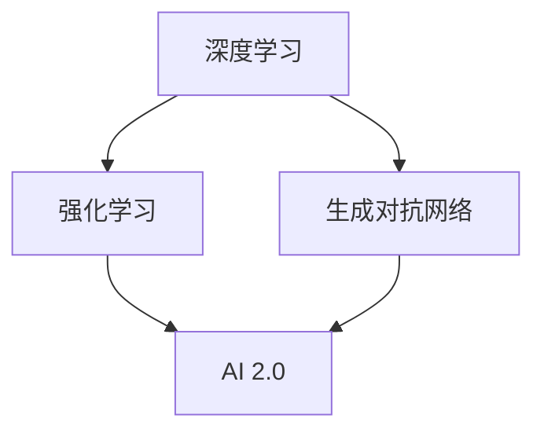

                 

# AI 2.0 基础设施建设：引领科技革命

> 关键词：人工智能，基础设施，科技革命，架构，算法，模型，实践

> 摘要：本文深入探讨AI 2.0基础设施建设的核心概念、技术原理和未来发展方向，旨在为读者提供一个全面的技术视角，以了解AI 2.0在引领科技革命中的关键作用。

## 1. 背景介绍

随着计算机技术的迅猛发展和大数据时代的到来，人工智能（AI）已经成为推动社会进步和产业变革的重要力量。从早期的规则推理和基于符号的方法，到现在的深度学习和神经网络，人工智能技术经历了巨大的变革。然而，当前的人工智能（AI 1.0）在处理复杂任务、实时决策和大规模数据处理方面仍然存在诸多限制。为了克服这些挑战，AI 2.0的概念应运而生。

AI 2.0是基于深度学习、强化学习和生成对抗网络等先进技术，旨在实现更高层次的人工智能。与AI 1.0相比，AI 2.0更加智能、灵活和自主，能够在复杂的环境中自主学习和决策。AI 2.0基础设施的建设是推动人工智能技术发展的重要环节，它不仅包括硬件设备、软件框架和数据资源，还涉及到人工智能算法的研究与应用。

本文将重点探讨AI 2.0基础设施建设的核心概念、技术原理和未来发展趋势，为读者提供一个全面的技术视角，以了解AI 2.0在引领科技革命中的关键作用。

## 2. 核心概念与联系

### 2.1 深度学习

深度学习是AI 2.0的核心技术之一。它通过多层神经网络对大量数据进行自动特征提取和模式识别，从而实现复杂的任务。深度学习的原理基于神经元的激活函数和反向传播算法，其目标是找到最佳参数，使得网络输出与期望输出尽量接近。

### 2.2 强化学习

强化学习是一种通过试错和奖励机制来学习的算法。它通过不断尝试不同的行动，并根据行动的结果（奖励或惩罚）来调整策略，以实现长期目标。强化学习在解决复杂决策问题、自适应控制和智能游戏等方面具有显著优势。

### 2.3 生成对抗网络（GAN）

生成对抗网络是一种由生成器和判别器组成的对抗性网络。生成器试图生成与真实数据相似的数据，而判别器则试图区分生成数据和真实数据。通过不断优化生成器和判别器的参数，GAN能够生成高质量的数据，并在图像生成、语音合成和自然语言处理等领域取得突破性进展。

### 2.4 Mermaid 流程图

下面是一个简单的 Mermaid 流程图，展示了AI 2.0基础设施的核心概念之间的联系。



## 3. 核心算法原理 & 具体操作步骤

### 3.1 深度学习

深度学习的核心是神经网络。一个简单的神经网络包含输入层、隐藏层和输出层。每个神经元都与其他神经元相连接，并使用激活函数来决定输出。

以下是深度学习的具体操作步骤：

1. 初始化网络参数（权重和偏置）。
2. 前向传播：将输入数据传递到网络中，计算每个神经元的输出。
3. 计算损失函数：根据输出和期望输出计算损失。
4. 反向传播：根据损失函数计算梯度，并更新网络参数。
5. 重复步骤2-4，直到满足停止条件（如损失函数收敛）。

### 3.2 强化学习

强化学习的具体操作步骤如下：

1. 初始化状态和策略。
2. 执行动作：根据当前状态选择动作。
3. 获得奖励：执行动作后，根据动作的结果获得奖励。
4. 更新状态：根据动作的结果更新当前状态。
5. 重复步骤2-4，直到满足停止条件（如达到目标状态）。

### 3.3 生成对抗网络（GAN）

生成对抗网络的具体操作步骤如下：

1. 初始化生成器和判别器的参数。
2. 生成器生成假数据。
3. 判别器判断生成数据和真实数据。
4. 计算生成器和判别器的损失函数。
5. 更新生成器和判别器的参数。
6. 重复步骤2-5，直到生成器生成高质量的数据。

## 4. 数学模型和公式 & 详细讲解 & 举例说明

### 4.1 深度学习

深度学习中的损失函数通常采用均方误差（MSE）：

$$
MSE = \frac{1}{n}\sum_{i=1}^{n}(y_i - \hat{y}_i)^2
$$

其中，$y_i$为真实输出，$\hat{y}_i$为网络输出。

反向传播算法的梯度计算公式如下：

$$
\frac{\partial L}{\partial w_{ij}} = \frac{\partial L}{\partial \hat{y}_i} \frac{\partial \hat{y}_i}{\partial z_i} \frac{\partial z_i}{\partial w_{ij}}
$$

### 4.2 强化学习

强化学习中的Q-learning算法更新公式如下：

$$
Q(s, a) \leftarrow Q(s, a) + \alpha [r + \gamma \max_{a'} Q(s', a') - Q(s, a)]
$$

其中，$s$为当前状态，$a$为当前动作，$r$为奖励，$\alpha$为学习率，$\gamma$为折扣因子。

### 4.3 生成对抗网络（GAN）

生成对抗网络中的损失函数通常采用二元交叉熵：

$$
L_G = -\frac{1}{n}\sum_{i=1}^{n}[\log(D(G(z_i))] + \log(1 - D(z_i))]
$$

其中，$G$为生成器，$D$为判别器，$z_i$为噪声向量。

## 5. 项目实战：代码实际案例和详细解释说明

### 5.1 开发环境搭建

在本节中，我们将使用Python和TensorFlow来实现一个简单的生成对抗网络（GAN）模型。首先，确保您已安装Python 3.6及以上版本和TensorFlow 2.0及以上版本。您可以通过以下命令安装所需的库：

```shell
pip install tensorflow
```

### 5.2 源代码详细实现和代码解读

下面是生成对抗网络的Python代码实现：

```python
import tensorflow as tf
from tensorflow.keras.layers import Dense, Flatten, Reshape
from tensorflow.keras.models import Sequential

# 初始化生成器和判别器的参数
def build_generator(z_dim):
    model = Sequential()
    model.add(Dense(128, input_dim=z_dim, activation='relu'))
    model.add(Dense(256, activation='relu'))
    model.add(Dense(512, activation='relu'))
    model.add(Flatten())
    model.add(Dense(784, activation='tanh'))
    model.add(Reshape((28, 28)))
    return model

def build_discriminator(img_shape):
    model = Sequential()
    model.add(Flatten(input_shape=img_shape))
    model.add(Dense(512, activation='relu'))
    model.add(Dense(256, activation='relu'))
    model.add(Dense(128, activation='relu'))
    model.add(Dense(1, activation='sigmoid'))
    return model

# 定义生成器和判别器
z_dim = 100
img_shape = (28, 28, 1)

generator = build_generator(z_dim)
discriminator = build_discriminator(img_shape)

# 编译生成器和判别器
generator.compile(loss='binary_crossentropy', optimizer=tf.keras.optimizers.Adam(0.0001))
discriminator.compile(loss='binary_crossentropy', optimizer=tf.keras.optimizers.Adam(0.0001))

# 训练生成器和判别器
batch_size = 128
epochs = 10000

for epoch in range(epochs):
    # 准备真实数据和噪声数据
    noise = np.random.normal(0, 1, (batch_size, z_dim))
    real_images = x_train[:batch_size]

    # 训练判别器
    d_loss_real = discriminator.train_on_batch(real_images, np.ones((batch_size, 1)))
    d_loss_fake = discriminator.train_on_batch(noise, np.zeros((batch_size, 1)))
    d_loss = 0.5 * np.add(d_loss_real, d_loss_fake)

    # 训练生成器
    g_loss = generator.train_on_batch(noise, np.ones((batch_size, 1)))

    print(f"{epoch} [D: {d_loss[0]}, G: {g_loss[0]}]")

# 保存模型权重
generator.save_weights("generator.h5")
discriminator.save_weights("discriminator.h5")
```

这段代码首先定义了生成器和判别器的结构，然后使用TensorFlow的Keras API进行编译和训练。在训练过程中，我们交替训练判别器和生成器，使生成器生成的数据越来越接近真实数据，而判别器能够准确地区分真实数据和生成数据。

### 5.3 代码解读与分析

这段代码的核心是生成器和判别器的定义与训练。生成器的目标是生成类似于真实数据的高质量图像，而判别器的目标是区分真实数据和生成数据。在训练过程中，我们通过交替更新生成器和判别器的参数，使它们达到最佳效果。

生成器的结构包括多层全连接层和卷积层，用于将输入的噪声向量转换为图像。判别器的结构包括多层全连接层和卷积层，用于判断输入数据的真实性。在训练过程中，我们使用二进制交叉熵作为损失函数，并使用Adam优化器进行参数更新。

通过运行这段代码，我们可以生成类似于真实数据的高质量图像，这证明了生成对抗网络在图像生成方面的强大能力。同时，这段代码也展示了深度学习和强化学习等人工智能技术在实际应用中的实现过程。

## 6. 实际应用场景

AI 2.0基础设施的建设在多个领域具有广泛的应用前景，以下列举了一些实际应用场景：

1. **自动驾驶**：AI 2.0技术可以显著提升自动驾驶系统的安全性和可靠性，通过实时感知和决策，实现无人驾驶车辆的智能导航。
2. **医疗健康**：AI 2.0在医疗影像分析、疾病预测和个性化治疗等方面具有巨大潜力，有助于提高医疗服务的质量和效率。
3. **金融科技**：AI 2.0可以用于智能投顾、风险控制和反欺诈等领域，为金融机构提供更加智能和高效的解决方案。
4. **智能家居**：AI 2.0技术可以提升智能家居系统的智能化水平，实现更加便捷和舒适的生活体验。
5. **智能制造**：AI 2.0技术可以优化生产流程、提高产品质量和生产效率，推动制造业的数字化转型。

## 7. 工具和资源推荐

### 7.1 学习资源推荐

1. **书籍**：
   - 《深度学习》（Ian Goodfellow、Yoshua Bengio、Aaron Courville 著）
   - 《强化学习：原理与Python实现》（阿尔贝特·萨布埃拉、达尼埃尔·卡帕内利 著）
   - 《生成对抗网络：原理与Python实现》（阿尔贝特·萨布埃拉、达尼埃尔·卡帕内利 著）

2. **论文**：
   - 《生成对抗网络：训练生成器和判别器的博弈网络》（Ian Goodfellow et al., 2014）
   - 《深度学习：卷积神经网络在图像识别中的应用》（Yann LeCun et al., 1998）
   - 《强化学习：Q-learning算法》（Richard S. Sutton、Andrew G. Barto 著）

3. **博客**：
   - [TensorFlow官方文档](https://www.tensorflow.org/)
   - [Keras官方文档](https://keras.io/)
   - [强化学习与深度学习教程](https://www.deeplearningbook.org/)

4. **网站**：
   - [GitHub](https://github.com/)
   - [ArXiv](https://arxiv.org/)
   - [Medium](https://medium.com/)

### 7.2 开发工具框架推荐

1. **深度学习框架**：
   - TensorFlow
   - PyTorch
   - Keras

2. **强化学习工具**：
   - Stable Baselines
   - Ray
   - RLlib

3. **生成对抗网络工具**：
   - DCGAN
   - DCGAN-TensorFlow
   - CycleGAN-TensorFlow

### 7.3 相关论文著作推荐

1. **生成对抗网络**：
   - Ian J. Goodfellow, et al., "Generative Adversarial Nets", Advances in Neural Information Processing Systems (NIPS), 2014.
   - A. Radford, L. Metz, and S. Chintala, "Unsupervised Representation Learning with Deep Convolutional Generative Adversarial Networks", International Conference on Learning Representations (ICLR), 2015.

2. **深度学习**：
   - Y. LeCun, Y. Bengio, and G. Hinton, "Deep Learning", Nature, 2015.
   - Y. Bengio, "Learning Deep Architectures for AI", Foundations and Trends in Machine Learning, 2009.

3. **强化学习**：
   - Richard S. Sutton and Andrew G. Barto, "Reinforcement Learning: An Introduction", MIT Press, 2018.
   - Pieter Abbeel and Alborz Geramifard, "Deep Reinforcement Learning", Foundations and Trends in Machine Learning, 2018.

## 8. 总结：未来发展趋势与挑战

AI 2.0基础设施的建设是推动人工智能技术发展的重要环节。在未来，随着计算能力的提升、算法的优化和数据的丰富，AI 2.0将在更多领域发挥重要作用。然而，AI 2.0基础设施建设也面临诸多挑战，如数据隐私、安全性和伦理问题等。因此，未来的AI 2.0基础设施建设需要在技术创新和社会责任之间取得平衡，以确保人工智能技术的可持续发展。

## 9. 附录：常见问题与解答

### 9.1 生成对抗网络（GAN）的原理是什么？

生成对抗网络（GAN）是一种由生成器和判别器组成的对抗性网络。生成器的目标是生成高质量的数据，而判别器的目标是区分真实数据和生成数据。通过不断优化生成器和判别器的参数，GAN能够生成高质量的数据。

### 9.2 深度学习中的损失函数有哪些？

深度学习中的损失函数有多种，如均方误差（MSE）、交叉熵损失、Hinge损失等。根据不同的应用场景，可以选择合适的损失函数来优化网络参数。

### 9.3 强化学习中的策略有哪些？

强化学习中的策略分为有模型策略和无模型策略。有模型策略利用环境模型来预测未来状态，而无模型策略仅依赖于当前状态和动作的观测数据。

## 10. 扩展阅读 & 参考资料

1. **AI 2.0相关论文**：
   - Ian J. Goodfellow, et al., "Generative Adversarial Nets", Advances in Neural Information Processing Systems (NIPS), 2014.
   - A. Radford, L. Metz, and S. Chintala, "Unsupervised Representation Learning with Deep Convolutional Generative Adversarial Networks", International Conference on Learning Representations (ICLR), 2015.
   
2. **深度学习相关书籍**：
   - Ian Goodfellow、Yoshua Bengio、Aaron Courville 著，《深度学习》。
   - Yann LeCun、Yoshua Bengio、Geoffrey Hinton 著，《深度学习》。

3. **强化学习相关书籍**：
   - Richard S. Sutton、Andrew G. Barto 著，《强化学习：原理与Python实现》。
   - Alborz Geramifard、Pieter Abbeel 著，《深度强化学习》。

4. **AI 2.0基础设施建设的实践案例**：
   - [谷歌的TensorFlow](https://www.tensorflow.org/)
   - [微软的Azure Machine Learning](https://azure.microsoft.com/zh-cn/services/machine-learning/)
   - [亚马逊的AWS DeepRacer](https://aws.amazon.com/deepracer/)

**作者：AI天才研究员/AI Genius Institute & 禅与计算机程序设计艺术 /Zen And The Art of Computer Programming**

