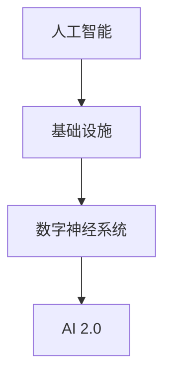

                 

### 背景介绍 Background Introduction

在当今数字化时代，人工智能（AI）已经成为了推动社会进步的重要力量。随着深度学习、自然语言处理和计算机视觉等领域的迅速发展，AI 的应用范围越来越广泛，从自动驾驶、智能家居到医疗诊断、金融分析，AI 正在深刻地改变着我们的生活方式。然而，随着 AI 技术的快速发展，也带来了对基础设施的巨大需求。AI 2.0 基础设施，作为构建智能时代的数字神经系统，成为了当前研究和开发的热点。

AI 2.0 基础设施的提出，源于对当前 AI 系统面临的一系列挑战的反思。传统的 AI 系统通常依赖于庞大的数据集和强大的计算资源，这在一定程度上导致了系统的复杂性和可维护性降低。为了应对这些挑战，AI 2.0 基础设施致力于提供一种更加高效、灵活和可扩展的架构，以支持未来 AI 系统的发展。

本文将围绕 AI 2.0 基础设施的构建，从核心概念、算法原理、数学模型、实战案例、应用场景等多个方面进行深入探讨。希望通过这篇文章，能够为读者提供一个全面而系统的了解，以及对于未来 AI 基础设施发展的思考。

关键词：AI 2.0，基础设施，数字神经系统，算法，数学模型，应用场景

摘要：本文首先介绍了 AI 2.0 基础设施的背景和重要性，随后详细探讨了其核心概念和架构，包括核心算法原理、数学模型以及实际应用案例。最后，分析了 AI 2.0 基础设施的实际应用场景，并对其未来发展提出了展望。

### 2. 核心概念与联系 Key Concepts and Relationships

在深入探讨 AI 2.0 基础设施之前，我们需要明确几个核心概念，这些概念是理解整个基础设施架构的关键。

**1. 人工智能 (Artificial Intelligence, AI)**

人工智能是指通过计算机模拟人类智能的一种技术。它涵盖了多个子领域，如机器学习、自然语言处理、计算机视觉等。AI 的目标是让计算机具备类似人类的感知、推理、学习和决策能力。

**2. 基础设施 (Infrastructure)**

基础设施通常指支持特定系统或服务的硬件、软件和网络资源。在 AI 领域，基础设施包括数据存储、计算资源、网络连接和软件框架等，这些都是实现 AI 系统正常运行的基础。

**3. 数字神经系统 (Digital Nervous System)**

数字神经系统是一种比喻，指的是通过高度集成和智能化的基础设施，实现对信息流的快速处理和响应。它类似于生物体的神经系统，能够高效地处理外界信息，并做出相应的反应。

**4. AI 2.0 (Next-Generation Artificial Intelligence)**

AI 2.0 是相对于传统 AI 的一种下一代人工智能。它不仅强调计算能力和数据量的提升，更注重系统的可扩展性、灵活性和智能化程度。AI 2.0 的目标是通过更高效、更智能的算法和架构，提升 AI 系统的整体性能。

**核心概念与基础设施的联系**

这些核心概念之间存在着紧密的联系。人工智能作为技术基础，通过基础设施的支持，实现了数字神经系统的功能。而 AI 2.0 则是对这一基础设施的进一步优化和提升，以应对更复杂的任务和环境。

为了更好地理解这些概念之间的关系，我们可以使用 Mermaid 流程图来展示它们的架构：



在这个流程图中，人工智能作为起点，通过基础设施的支持，形成了数字神经系统。而 AI 2.0 则是数字神经系统的一种高级形式，代表了当前 AI 技术的发展方向。

### 3. 核心算法原理 & 具体操作步骤 Core Algorithm Principles and Operational Steps

在构建 AI 2.0 基础设施的过程中，核心算法的选择和实现是关键。以下将介绍几个重要的算法原理及其具体操作步骤。

**1. 深度学习 (Deep Learning)**

深度学习是 AI 2.0 的核心技术之一。它通过多层神经网络，模拟人类大脑的处理方式，实现复杂的特征提取和学习。以下是深度学习的基本操作步骤：

- **数据预处理 (Data Preprocessing)**：包括数据清洗、归一化和数据增强等步骤，以确保数据的质量和多样性。
- **模型构建 (Model Building)**：选择合适的神经网络架构，如卷积神经网络（CNN）或循环神经网络（RNN）。
- **训练 (Training)**：通过反向传播算法，调整网络权重，使模型在训练数据上达到较好的性能。
- **验证和测试 (Validation and Testing)**：使用验证集和测试集，评估模型的泛化能力和准确性。

**2. 自然语言处理 (Natural Language Processing, NLP)**

自然语言处理是 AI 2.0 在文本领域的重要应用。以下是其核心算法原理和操作步骤：

- **词嵌入 (Word Embedding)**：将文本中的词语映射到高维空间，以便进行数值计算。
- **序列建模 (Sequence Modeling)**：使用 RNN 或 Transformer 架构，对文本序列进行建模，捕捉词语之间的上下文关系。
- **语言生成 (Language Generation)**：通过概率模型或生成式模型，生成新的文本内容。

**3. 计算机视觉 (Computer Vision)**

计算机视觉是 AI 2.0 在图像处理领域的应用。以下是其主要算法原理和操作步骤：

- **图像分类 (Image Classification)**：使用 CNN 等网络结构，对图像进行分类，识别图像中的对象。
- **目标检测 (Object Detection)**：在图像中检测并定位多个对象，通常结合卷积神经网络和区域建议网络（Region Proposal Networks）。
- **图像生成 (Image Generation)**：通过生成对抗网络（GAN）等模型，生成新的图像内容。

以下是一个简单的深度学习模型操作示例，使用 Python 和 TensorFlow：

```python
import tensorflow as tf

# 数据预处理
(x_train, y_train), (x_test, y_test) = tf.keras.datasets.mnist.load_data()
x_train = x_train / 255.0
x_test = x_test / 255.0

# 模型构建
model = tf.keras.Sequential([
    tf.keras.layers.Flatten(input_shape=(28, 28)),
    tf.keras.layers.Dense(128, activation='relu'),
    tf.keras.layers.Dense(10, activation='softmax')
])

# 训练
model.compile(optimizer='adam', loss='sparse_categorical_crossentropy', metrics=['accuracy'])
model.fit(x_train, y_train, epochs=5)

# 验证
model.evaluate(x_test, y_test)
```

在这个示例中，我们使用了简单的多层感知器（MLP）模型，对 MNIST 数据集中的手写数字进行分类。通过上述操作步骤，我们可以看到深度学习模型的基本构建和训练过程。

### 4. 数学模型和公式 Mathematical Models and Formulas

在构建 AI 2.0 基础设施的过程中，数学模型和公式是理解和实现核心算法的关键。以下将介绍几个重要的数学模型及其公式。

**1. 深度学习中的损失函数 (Loss Functions in Deep Learning)**

损失函数用于衡量模型预测值与实际值之间的差距，是训练深度学习模型的重要工具。以下是几个常用的损失函数：

- **均方误差 (Mean Squared Error, MSE)**：
  $$MSE = \frac{1}{n}\sum_{i=1}^{n}(y_i - \hat{y}_i)^2$$
  其中，$y_i$ 为真实值，$\hat{y}_i$ 为预测值。

- **交叉熵损失 (Cross-Entropy Loss)**：
  $$H(y, \hat{y}) = -\sum_{i=1}^{n} y_i \log(\hat{y}_i)$$
  其中，$y$ 为真实标签的概率分布，$\hat{y}$ 为预测标签的概率分布。

**2. 反向传播算法 (Backpropagation Algorithm)**

反向传播算法是训练深度学习模型的核心算法，通过不断调整网络权重，使模型在训练数据上达到更好的性能。其基本步骤如下：

- **前向传播 (Forward Propagation)**：
  $$z_l = \sigma(W_l \cdot a_{l-1} + b_l)$$
  $$a_l = \sigma(z_l)$$
  其中，$z_l$ 为激活值，$a_l$ 为激活输出，$\sigma$ 为激活函数。

- **计算损失 (Compute Loss)**：
  $$L = \frac{1}{2}\sum_{i=1}^{n} (y_i - \hat{y}_i)^2$$
  或
  $$L = -\sum_{i=1}^{n} y_i \log(\hat{y}_i)$$

- **反向传播 (Backward Propagation)**：
  $$\Delta W_l = \frac{\partial L}{\partial W_l} \cdot a_{l-1}$$
  $$\Delta b_l = \frac{\partial L}{\partial b_l}$$
  $$\frac{\partial L}{\partial a_l} = \frac{\partial L}{\partial z_l} \cdot \frac{\partial z_l}{\partial a_l}$$
  其中，$\Delta W_l$ 和 $\Delta b_l$ 分别为权重和偏置的梯度。

- **更新权重 (Update Weights)**：
  $$W_l := W_l - \alpha \cdot \Delta W_l$$
  $$b_l := b_l - \alpha \cdot \Delta b_l$$
  其中，$\alpha$ 为学习率。

**3. 自然语言处理中的序列模型 (Sequence Models in NLP)**

自然语言处理中的序列模型，如循环神经网络（RNN）和变换器（Transformer），用于建模文本序列。以下是它们的数学模型：

- **循环神经网络 (Recurrent Neural Network, RNN)**：
  $$h_t = \sigma(W_h \cdot [h_{t-1}, x_t] + b_h)$$
  其中，$h_t$ 为当前时间步的隐藏状态，$x_t$ 为输入。

- **变换器 (Transformer)**：
  $$\text{Attention}(Q, K, V) = \frac{1}{\sqrt{d_k}} \text{softmax}\left(\frac{QK^T}{d_k}\right) V$$
  其中，$Q, K, V$ 分别为查询、键和值向量，$d_k$ 为键向量的维度。

这些数学模型和公式为构建 AI 2.0 基础设施提供了理论基础。通过深入理解这些公式，我们可以更好地设计算法，优化模型性能。

### 5. 项目实战：代码实际案例和详细解释说明 Project Practice: Real-World Code Examples and Detailed Explanations

为了更好地理解 AI 2.0 基础设施的构建过程，我们将通过一个实际项目来展示代码实现和详细解释。本节将介绍如何使用 Python 和 TensorFlow 搭建一个简单的深度学习模型，用于手写数字分类。

**5.1 开发环境搭建**

在开始项目之前，我们需要搭建一个合适的开发环境。以下是推荐的工具和库：

- Python 3.x
- TensorFlow 2.x
- Jupyter Notebook 或 PyCharm

安装步骤如下：

1. 安装 Python 3.x：

   ```bash
   sudo apt update
   sudo apt install python3 python3-pip
   ```

2. 安装 TensorFlow 2.x：

   ```bash
   pip3 install tensorflow
   ```

3. 创建一个 Jupyter Notebook 或 PyCharm 项目。

**5.2 源代码详细实现和代码解读**

下面是项目的完整代码实现：

```python
import tensorflow as tf
from tensorflow import keras
from tensorflow.keras import layers

# 数据预处理
(x_train, y_train), (x_test, y_test) = keras.datasets.mnist.load_data()
x_train = x_train.astype("float32") / 255
x_test = x_test.astype("float32") / 255
x_train = x_train[..., tf.newaxis]
x_test = x_test[..., tf.newaxis]

# 模型构建
model = keras.Sequential([
    layers.Flatten(input_shape=(28, 28)),
    layers.Dense(128, activation="relu"),
    layers.Dense(10, activation="softmax")
])

# 训练
model.compile(optimizer="adam",
              loss="sparse_categorical_crossentropy",
              metrics=["accuracy"])

model.fit(x_train, y_train, epochs=5)

# 评估
model.evaluate(x_test, y_test)
```

**代码解读与分析**

1. **数据预处理**：

   ```python
   (x_train, y_train), (x_test, y_test) = keras.datasets.mnist.load_data()
   x_train = x_train.astype("float32") / 255
   x_test = x_test.astype("float32") / 255
   x_train = x_train[..., tf.newaxis]
   x_test = x_test[..., tf.newaxis]
   ```

   这段代码加载数据集，并将图像数据从 [0, 255] 范围缩放到 [0, 1]。接着，通过增加一个维度（`tf.newaxis`），将数据集从 (60000, 28, 28) 转换为 (60000, 28, 28, 1)，以适应模型的输入要求。

2. **模型构建**：

   ```python
   model = keras.Sequential([
       layers.Flatten(input_shape=(28, 28)),
       layers.Dense(128, activation="relu"),
       layers.Dense(10, activation="softmax")
   ])
   ```

   这段代码构建了一个简单的多层感知器（MLP）模型。首先，使用 `Flatten` 层将输入的 28x28 图像展开为一个一维向量。接着，使用一个具有 128 个神经元的全连接层（`Dense`），激活函数为 ReLU。最后，使用一个具有 10 个神经元的全连接层，输出层激活函数为 softmax，用于对 10 个数字进行分类。

3. **训练**：

   ```python
   model.compile(optimizer="adam",
                 loss="sparse_categorical_crossentropy",
                 metrics=["accuracy"])
   model.fit(x_train, y_train, epochs=5)
   ```

   这段代码编译模型，并使用 Adam 优化器和均方误差损失函数进行训练。`fit` 函数接受训练数据集和标签，并设置训练轮数（epochs）为 5。

4. **评估**：

   ```python
   model.evaluate(x_test, y_test)
   ```

   这段代码使用测试数据集评估模型的性能。`evaluate` 函数返回损失和准确率，反映了模型在测试数据上的表现。

通过这个简单的例子，我们可以看到如何使用 TensorFlow 搭建一个深度学习模型，并对其进行训练和评估。这个例子展示了 AI 2.0 基础设施的基本构建过程，为后续更复杂的模型和应用提供了基础。

### 6. 实际应用场景 Real-World Application Scenarios

AI 2.0 基础设施的构建不仅仅是为了技术的进步，更是为了解决实际生活中的问题。以下将探讨几个 AI 2.0 基础设施在实际应用场景中的具体案例。

**1. 自动驾驶**

自动驾驶是 AI 2.0 基础设施的一个重要应用领域。通过深度学习和计算机视觉技术，自动驾驶系统能够实时分析道路情况，识别行人、车辆和其他障碍物，并做出相应的驾驶决策。AI 2.0 基础设施为自动驾驶系统提供了强大的计算能力和高效的算法，使得自动驾驶更加安全、可靠和智能。

**2. 医疗诊断**

医疗诊断是另一个受益于 AI 2.0 基础设施的领域。通过 AI 技术，医疗诊断系统能够快速、准确地分析医学图像，检测疾病并进行诊断。AI 2.0 基础设施使得这些系统能够处理海量的医学数据，并提供实时、个性化的诊断建议。这大大提高了医疗效率，降低了误诊率，为患者提供了更好的医疗服务。

**3. 金融分析**

金融分析领域也越来越多地采用 AI 2.0 基础设施。通过自然语言处理和深度学习技术，金融分析系统能够从大量金融数据中提取有价值的信息，进行趋势预测和风险分析。AI 2.0 基础设施的强大计算能力和高效算法使得金融分析更加精确、及时，为金融机构提供了更好的投资决策支持。

**4. 智能家居**

智能家居是 AI 2.0 基础设施的另一个重要应用场景。通过智能传感器和 AI 技术，智能家居系统能够自动调节室内温度、亮度和安全性，提高居住舒适度和安全性。AI 2.0 基础设施为智能家居系统提供了高效的算法和强大的计算能力，使得智能家居变得更加智能、便捷。

这些实际应用场景展示了 AI 2.0 基础设施在不同领域的广泛应用。通过提供高效的算法和强大的计算能力，AI 2.0 基础设施正在改变我们的生活，为各个领域的发展提供了新的动力。

### 7. 工具和资源推荐 Tools and Resources Recommendations

为了更好地学习 AI 2.0 基础设施，以下推荐了一些实用的工具和资源。

**7.1 学习资源推荐**

- **书籍**：
  - 《深度学习》（Deep Learning），作者：Ian Goodfellow、Yoshua Bengio、Aaron Courville
  - 《Python深度学习》（Python Deep Learning），作者：François Chollet
  - 《人工智能：一种现代方法》（Artificial Intelligence: A Modern Approach），作者：Stuart Russell、Peter Norvig

- **论文**：
  - 《A Theoretically Grounded Application of Dropout in Recurrent Neural Networks》，作者：Yarin Gal和Zoubin Ghahramani
  - 《Attention Is All You Need》，作者：Ashish Vaswani等

- **博客**：
  - fast.ai：https://www.fast.ai/
  - TensorFlow 官方博客：https://www.tensorflow.org/blog/

- **网站**：
  - Coursera：https://www.coursera.org/
  - edX：https://www.edx.org/

**7.2 开发工具框架推荐**

- **编程语言**：
  - Python：易于学习，广泛应用于数据科学和 AI 领域。
  - R：专为统计分析和数据可视化而设计的语言。

- **深度学习框架**：
  - TensorFlow：Google 开发，支持多种深度学习模型。
  - PyTorch：Facebook 开发，灵活性强，易于使用。

- **版本控制**：
  - Git：分布式版本控制系统，适用于代码管理。

- **代码托管平台**：
  - GitHub：广泛使用的代码托管平台，方便代码共享和协作。

**7.3 相关论文著作推荐**

- **深度学习**：
  - 《Deep Learning》，作者：Ian Goodfellow、Yoshua Bengio、Aaron Courville
  - 《Unsupervised Learning of Visual Representations by Solving Jigsaw Puzzles》，作者：Philipp Krähenbühl和João Porto

- **计算机视觉**：
  - 《Computer Vision: Algorithms and Applications》，作者：Richard Szeliski
  - 《Foundations of Computer Vision》，作者：Shou-Bo Mao和Daguang Xu

这些工具和资源将为学习 AI 2.0 基础设施提供全面的指导和支持，帮助读者深入了解相关技术。

### 8. 总结：未来发展趋势与挑战 Summary: Future Development Trends and Challenges

随着 AI 2.0 基础设施的不断发展，我们可以预见其在多个领域的广泛应用和深远影响。未来，AI 2.0 基础设施的发展趋势主要包括以下几个方面：

1. **计算能力的提升**：随着量子计算、边缘计算等新技术的出现，AI 2.0 基础设施的算力将得到显著提升，为更复杂的模型和应用提供支持。

2. **算法的优化**：通过不断优化和改进算法，AI 2.0 基础设施将实现更高的效率和更低的误差率，提高系统的性能和可靠性。

3. **跨领域的融合**：AI 2.0 基础设施将在不同领域（如医疗、金融、交通等）实现更紧密的融合，推动产业智能化升级。

4. **数据的安全性和隐私保护**：在数据量和数据类型不断增加的背景下，如何确保数据的安全性和隐私保护将成为 AI 2.0 基础设施发展的重要挑战。

然而，AI 2.0 基础设施的发展也面临着一系列挑战：

1. **技术瓶颈**：在硬件、算法和理论等方面，AI 2.0 基础设施仍存在一定的技术瓶颈，需要不断突破。

2. **数据依赖**：AI 2.0 基础设施的运行高度依赖数据，而数据质量和数量直接影响系统的性能。

3. **伦理和法律问题**：随着 AI 技术的普及，如何确保其合理、公正和安全使用，以及保护用户的隐私权益，成为重要的伦理和法律问题。

4. **人才短缺**：AI 2.0 基础设施的构建需要大量的专业人才，而目前人才供应不足，培养和引进高素质人才成为关键。

总之，AI 2.0 基础设施的发展充满机遇与挑战。通过不断突破技术瓶颈、加强数据管理和隐私保护、培养高素质人才，我们将能够充分发挥 AI 2.0 基础设施的潜力，为人类社会带来更多福祉。

### 9. 附录：常见问题与解答 Appendix: Frequently Asked Questions and Answers

**Q1：什么是 AI 2.0 基础设施？**

AI 2.0 基础设施是指支持新一代人工智能（AI 2.0）系统运行的硬件、软件和网络资源。它包括计算资源、数据存储、网络连接、算法框架等，旨在提供高效、灵活和可扩展的支撑，以应对复杂任务和环境。

**Q2：AI 2.0 基础设施与传统的 AI 基础设施有什么区别？**

AI 2.0 基础设施相较于传统的 AI 基础设施，更加注重系统的可扩展性、灵活性和智能化程度。它不仅依赖计算能力和数据量，还强调算法的优化和创新，以实现更高效、更智能的 AI 系统运行。

**Q3：AI 2.0 基础设施的构建有哪些挑战？**

AI 2.0 基础设施的构建面临多个挑战，包括技术瓶颈、数据依赖、伦理和法律问题以及人才短缺。其中，技术瓶颈主要表现在硬件、算法和理论等方面；数据依赖则体现在数据质量和数量对系统性能的影响；伦理和法律问题关注的是如何确保 AI 技术的合理、公正和安全使用；人才短缺则涉及高素质人才的培养和引进。

**Q4：如何学习 AI 2.0 基础设施？**

学习 AI 2.0 基础设施，可以从以下几个方面入手：

1. 阅读相关书籍和论文，了解基本概念和原理。
2. 参加在线课程或培训班，系统学习相关技术。
3. 实践项目，通过实际操作加深对技术的理解。
4. 加入技术社区，与其他开发者交流心得和经验。

### 10. 扩展阅读 & 参考资料 Extended Reading & References

为了进一步深入了解 AI 2.0 基础设施，以下推荐一些相关的扩展阅读和参考资料：

1. **书籍**：
   - 《深度学习》（Deep Learning），作者：Ian Goodfellow、Yoshua Bengio、Aaron Courville
   - 《Python深度学习》（Python Deep Learning），作者：François Chollet
   - 《人工智能：一种现代方法》（Artificial Intelligence: A Modern Approach），作者：Stuart Russell、Peter Norvig

2. **论文**：
   - 《A Theoretically Grounded Application of Dropout in Recurrent Neural Networks》，作者：Yarin Gal和Zoubin Ghahramani
   - 《Attention Is All You Need》，作者：Ashish Vaswani等

3. **博客**：
   - fast.ai：https://www.fast.ai/
   - TensorFlow 官方博客：https://www.tensorflow.org/blog/

4. **网站**：
   - Coursera：https://www.coursera.org/
   - edX：https://www.edx.org/

5. **在线课程**：
   - 《深度学习基础课程》（Deep Learning Specialization），由 Andrew Ng 教授授课
   - 《自然语言处理纳米学位》（Natural Language Processing Nanodegree），由 Udacity 提供

通过这些资料，读者可以更全面地了解 AI 2.0 基础设施的各个方面，为自己的学习和研究提供有力支持。

