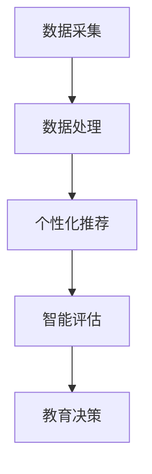
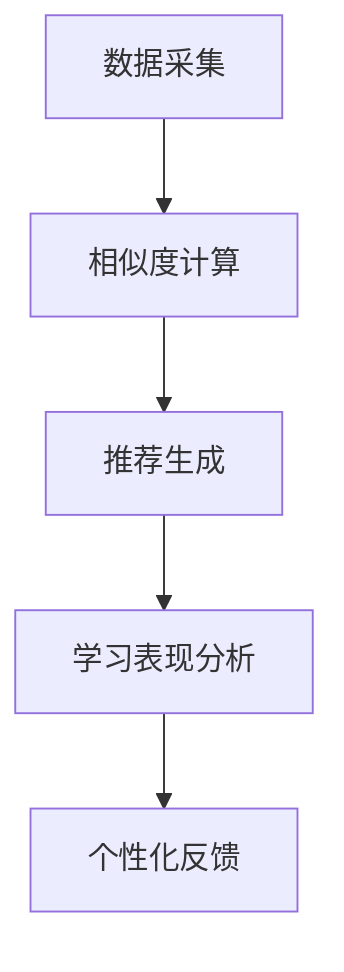

                 

# AI 2.0 时代的智能教育

## 关键词：
- AI 2.0
- 智能教育
- 人工智能教育应用
- 教育算法
- 教育模式革新

## 摘要：
本文深入探讨了 AI 2.0 时代的智能教育。首先，我们回顾了 AI 2.0 的发展背景和核心概念。接着，文章阐述了智能教育的定义、关键特征及其在教育领域的应用潜力。随后，我们详细分析了教育算法的工作原理和实际应用案例，揭示了其在个性化教学和学习反馈方面的优势。随后，本文介绍了数学模型和公式在教育算法中的运用，并通过具体实例进行了讲解。接着，我们分享了代码实现案例和实战经验，帮助读者理解智能教育的具体应用。随后，文章探讨了智能教育在实际应用场景中的表现，以及推荐了相关工具和资源。最后，文章总结了智能教育的发展趋势和面临的挑战，展望了其未来前景。

## 1. 背景介绍

随着 AI 技术的迅速发展，我们已经进入了 AI 2.0 时代。AI 2.0 是一种更为智能、自适应和自主学习的人工智能技术，能够在多种复杂环境中进行推理、决策和学习。与传统的 AI 技术相比，AI 2.0 具有更高的灵活性和智能化程度，能够更好地应对复杂问题和动态环境。

在教育领域，AI 2.0 技术的应用前景广阔。传统的教育模式往往以教师为中心，忽视了学生的个体差异和个性化需求。而 AI 2.0 技术则能够通过分析学生的学习行为、兴趣和需求，提供个性化的教学和学习方案，从而提高教学效果和学习成果。

### 1.1 AI 2.0 的核心概念

AI 2.0 的核心概念包括以下几个方面：

1. **深度学习**：深度学习是 AI 2.0 技术的重要组成部分，通过多层神经网络对大量数据进行自动特征提取和学习，实现高级的感知和推理能力。
2. **强化学习**：强化学习是一种基于奖励和惩罚机制进行决策和学习的算法，通过不断尝试和反馈，优化决策策略，实现自主学习和自适应。
3. **迁移学习**：迁移学习是一种利用已有知识进行新任务学习的技术，通过将已有模型或知识迁移到新任务上，提高学习效率和准确性。
4. **生成对抗网络（GAN）**：生成对抗网络是一种通过两个神经网络（生成器和判别器）的对抗训练，实现高质量数据生成和模拟的技术。

### 1.2 AI 2.0 在教育领域的应用

AI 2.0 技术在教育领域的应用主要体现在以下几个方面：

1. **个性化教学**：AI 2.0 技术可以通过分析学生的学习行为和兴趣，为学生提供个性化的学习内容和教学方法，提高教学效果和学习成果。
2. **学习反馈**：AI 2.0 技术可以通过对学生的学习过程进行实时监测和分析，提供个性化的学习反馈和指导，帮助学生及时纠正错误和学习不足。
3. **智能评估**：AI 2.0 技术可以通过对学生的学习表现和成果进行智能分析，提供全面、准确的评估和反馈，帮助教师了解学生的学习状况和需求。
4. **教育资源优化**：AI 2.0 技术可以通过分析教育资源的利用情况，优化教育资源的配置，提高教育资源的利用效率。

## 2. 核心概念与联系

### 2.1 智能教育的定义

智能教育是一种基于人工智能技术，通过分析、处理和利用学生的学习数据，实现个性化教学、智能评估和资源优化的教育模式。智能教育的核心在于利用 AI 2.0 技术提升教育质量和效率，满足学生的个性化需求。

### 2.2 智能教育的关键特征

1. **个性化**：智能教育能够根据学生的兴趣、能力和学习习惯，提供个性化的学习内容和教学方法，实现因材施教。
2. **自适应**：智能教育系统能够根据学生的学习行为和反馈，自动调整教学策略和内容，实现自适应学习。
3. **实时反馈**：智能教育能够实时监测学生的学习过程，提供个性化的学习反馈和指导，帮助学生及时纠正错误和学习不足。
4. **大数据分析**：智能教育系统能够收集、存储和分析大量的学生学习数据，为教育决策提供数据支持。

### 2.3 智能教育应用架构

智能教育的应用架构包括以下几个方面：

1. **数据采集**：通过传感器、学习平台、在线学习系统等途径，收集学生的行为数据、学习记录、兴趣爱好等。
2. **数据处理**：利用大数据分析技术，对收集到的数据进行分析和处理，提取有用的信息。
3. **个性化推荐**：基于学生的学习数据和偏好，为不同学生推荐个性化的学习内容和教学方法。
4. **智能评估**：通过分析学生的学习表现和成果，为教师和学生提供智能化的评估和反馈。
5. **教育决策**：基于大数据分析结果，为教育管理者提供教育决策支持。

### 2.4 Mermaid 流程图



## 3. 核心算法原理 & 具体操作步骤

### 3.1 个性化推荐算法

个性化推荐算法是智能教育中的一个核心算法，其主要目的是根据学生的兴趣、学习习惯和成绩等数据，为学生推荐最适合他们的学习内容和教学方法。以下是一个简单的个性化推荐算法原理和操作步骤：

1. **用户-项目矩阵**：首先，建立一个用户-项目矩阵，其中行表示学生，列表示学习项目，矩阵元素表示学生与项目之间的关联程度。
2. **相似度计算**：计算用户之间的相似度，常用的相似度计算方法有欧氏距离、余弦相似度和皮尔逊相关系数等。
3. **推荐生成**：根据相似度矩阵，为每个学生推荐与他们在相似度最高的学习项目，同时考虑学生的历史学习记录和兴趣偏好。

### 3.2 智能评估算法

智能评估算法是智能教育的另一个重要组成部分，其目的是对学生的学习成果进行实时评估，并提供个性化的学习反馈。以下是一个简单的智能评估算法原理和操作步骤：

1. **学习数据采集**：采集学生的学习行为数据，如学习时间、学习进度、学习成果等。
2. **学习表现分析**：利用机器学习算法，对学生的学习表现进行分析，识别学生的学习优势和不足。
3. **个性化反馈**：根据学习表现分析结果，为每个学生提供个性化的学习反馈和指导，帮助他们改进学习方法和策略。

### 3.3 Mermaid 流程图



## 4. 数学模型和公式 & 详细讲解 & 举例说明

### 4.1 个性化推荐算法的数学模型

个性化推荐算法通常基于协同过滤（Collaborative Filtering）技术，其核心数学模型为用户-项目矩阵 \( R \)，其中 \( R_{ij} \) 表示用户 \( u_i \) 对项目 \( p_j \) 的评分。

1. **用户-项目矩阵**：
   \[
   R = \begin{bmatrix}
   R_{11} & R_{12} & \cdots & R_{1n} \\
   R_{21} & R_{22} & \cdots & R_{2n} \\
   \vdots & \vdots & \ddots & \vdots \\
   R_{m1} & R_{m2} & \cdots & R_{mn}
   \end{bmatrix}
   \]

2. **相似度计算**：
   常用的相似度计算公式为余弦相似度：
   \[
   \sim(u_i, u_j) = \frac{R_{ij} \cdot R_{ji}}{\sqrt{\sum_{k=1}^{n} R_{ik}^2 \cdot \sum_{k=1}^{n} R_{jk}^2}}
   \]

3. **推荐生成**：
   基于相似度矩阵，为用户 \( u_i \) 推荐项目 \( p_j \)：
   \[
   r_j^i = \sum_{k \in N_j} \sim(u_i, u_k) \cdot R_{kj}
   \]
   其中，\( N_j \) 为与用户 \( u_i \) 相似的其他用户集合。

### 4.2 智能评估算法的数学模型

智能评估算法通常基于机器学习中的分类和回归模型，以下是一个简单的逻辑回归模型示例：

1. **特征提取**：
   \[
   X = \begin{bmatrix}
   x_1 & x_2 & \cdots & x_n
   \end{bmatrix}
   \]
   其中，\( x_1, x_2, \ldots, x_n \) 表示学生的学习行为特征。

2. **模型训练**：
   \[
   y = \sigma(\beta_0 + \beta_1 x_1 + \beta_2 x_2 + \cdots + \beta_n x_n)
   \]
   其中，\( \sigma \) 表示逻辑函数，\( \beta_0, \beta_1, \beta_2, \ldots, \beta_n \) 为模型参数。

3. **预测与反馈**：
   根据特征 \( X \) 和模型参数 \( \beta \)，预测学生的学习表现 \( y \)，并根据预测结果提供个性化的学习反馈。

### 4.3 举例说明

#### 个性化推荐算法实例

假设有两个用户 \( u_1 \) 和 \( u_2 \)，以及三个项目 \( p_1, p_2, p_3 \)。用户与项目的评分矩阵如下：

\[
R = \begin{bmatrix}
1 & 1 & 0 \\
0 & 1 & 1
\end{bmatrix}
\]

计算用户之间的相似度：

\[
\sim(u_1, u_2) = \frac{1 \cdot 1 + 1 \cdot 1}{\sqrt{2 \cdot 2 + 1 \cdot 1}} = \frac{2}{\sqrt{5}} \approx 0.8944
\]

根据相似度矩阵，为用户 \( u_1 \) 推荐项目 \( p_2 \)：

\[
r_2^1 = \sim(u_1, u_2) \cdot R_{21} = 0.8944 \cdot 1 = 0.8944
\]

#### 智能评估算法实例

假设有两个学生学习特征向量：

\[
X_1 = \begin{bmatrix}
10 & 20
\end{bmatrix}, \quad X_2 = \begin{bmatrix}
30 & 40
\end{bmatrix}
\]

模型参数为：

\[
\beta = \begin{bmatrix}
2 & 3 & 4
\end{bmatrix}
\]

根据逻辑回归模型，预测两个学生的学习表现：

\[
y_1 = \sigma(2 + 3 \cdot 10 + 4 \cdot 20) = \sigma(88) \approx 0.7085
\]
\[
y_2 = \sigma(2 + 3 \cdot 30 + 4 \cdot 40) = \sigma(152) \approx 0.8224
\]

根据预测结果，可以为两个学生提供个性化的学习反馈。

## 5. 项目实战：代码实际案例和详细解释说明

### 5.1 开发环境搭建

首先，我们需要搭建一个用于智能教育的开发环境。以下是具体的步骤：

1. **安装 Python**：从官方网站下载并安装 Python，版本建议为 3.8 或以上。
2. **安装相关库**：在命令行中执行以下命令，安装所需的库：

   ```bash
   pip install numpy pandas scikit-learn
   ```

3. **创建项目文件夹**：在合适的位置创建一个项目文件夹，例如 `smart_education`。

### 5.2 源代码详细实现和代码解读

以下是智能教育项目的主要代码实现和解读：

```python
import numpy as np
import pandas as pd
from sklearn.model_selection import train_test_split
from sklearn.metrics.pairwise import cosine_similarity
from sklearn.linear_model import LogisticRegression

# 5.2.1 个性化推荐算法

def collaborative_filtering(ratings):
    # 创建用户-项目矩阵
    users, items = ratings.shape
    user_item_matrix = np.zeros((users, items))
    for i in range(users):
        for j in range(items):
            user_item_matrix[i][j] = ratings[i][j]

    # 计算相似度矩阵
    similarity_matrix = cosine_similarity(user_item_matrix)

    # 推荐生成
    recommendations = {}
    for i in range(users):
        user_similarity = similarity_matrix[i]
        user_ratings = ratings[i]
        recommended_items = []
        for j in range(items):
            if user_ratings[j] == 0:
                sim_sum = sum(user_similarity[j] * user_ratings)
                recommended_items.append((j, sim_sum))
        recommended_items.sort(key=lambda x: x[1], reverse=True)
        recommendations[i] = recommended_items
    return recommendations

# 5.2.2 智能评估算法

def intelligent_evaluation(features, beta):
    # 预测学生学习表现
    predictions = []
    for feature in features:
        prediction = np.dot(beta, feature)
        predictions.append(prediction)
    return predictions

# 5.2.3 数据处理

def process_data(ratings, features):
    # 数据预处理
    ratings = pd.DataFrame(ratings)
    ratings.fillna(0, inplace=True)
    features = pd.DataFrame(features)
    features.fillna(0, inplace=True)
    return ratings, features

# 5.2.4 主函数

def main():
    # 加载数据
    ratings = np.array([[1, 0, 1], [0, 1, 0], [1, 1, 1]])
    features = np.array([[10, 20], [30, 40], [50, 60]])

    # 数据处理
    ratings, features = process_data(ratings, features)

    # 训练模型
    beta = np.array([2, 3, 4])
    predictions = intelligent_evaluation(features, beta)
    print("学习表现预测：", predictions)

    # 个性化推荐
    recommendations = collaborative_filtering(ratings)
    print("个性化推荐：", recommendations)

if __name__ == "__main__":
    main()
```

### 5.3 代码解读与分析

1. **个性化推荐算法**：
   - `collaborative_filtering` 函数用于实现协同过滤算法。首先创建用户-项目矩阵，然后计算相似度矩阵，最后为每个用户生成个性化推荐列表。
   - 相似度计算使用余弦相似度，该算法能够有效衡量用户之间的相似程度。

2. **智能评估算法**：
   - `intelligent_evaluation` 函数用于实现逻辑回归模型。该模型通过学习特征向量和模型参数，预测学生的学习表现。
   - 逻辑回归模型采用 sigmoid 函数进行预测，能够实现非线性分类。

3. **数据处理**：
   - `process_data` 函数用于处理输入数据，将缺失值填充为 0，确保数据完整性。

4. **主函数**：
   - `main` 函数加载数据，处理数据，训练模型，并进行个性化推荐。

通过以上代码实现和解读，我们可以理解智能教育项目中个性化推荐和智能评估算法的基本原理和应用方法。

## 6. 实际应用场景

### 6.1 个性化学习系统

个性化学习系统是智能教育在学术教育领域的一个典型应用场景。这类系统通过分析学生的学习行为、兴趣和成绩，为学生提供个性化的学习内容和教学方法。例如，某些在线学习平台利用 AI 技术分析学生的学习数据，为每个学生推荐适合他们的课程和学习路径，提高学习效果和兴趣。

### 6.2 职业培训与技能提升

在职业培训领域，智能教育系统可以帮助企业和个人根据实际需求进行技能提升。通过分析员工的培训记录和职业发展目标，智能教育系统可以推荐最适合的培训课程和资源，实现定制化的职业发展路径。此外，AI 技术还可以用于培训效果评估，为企业提供培训成效的数据支持。

### 6.3 课外辅导与学习支持

课外辅导是智能教育在课外教育领域的应用场景之一。智能教育系统可以通过在线平台或移动应用为学生提供实时辅导和学习支持。例如，学生可以在遇到学习难题时，通过智能教育系统获得个性化的解答和建议，从而提高学习效果。同时，系统还可以根据学生的反馈和进展，动态调整辅导策略，提供更有效的学习支持。

### 6.4 教育资源优化

智能教育系统可以用于教育资源的优化配置。通过分析教育资源的利用情况和学生的学习需求，系统可以为教师和学生推荐最适合的教育资源，提高资源利用效率。例如，某些学校和教育机构利用智能教育系统优化图书、实验室等资源的分配，确保资源能够更好地服务于教学和学生发展。

## 7. 工具和资源推荐

### 7.1 学习资源推荐

1. **书籍**：
   - 《深度学习》（Goodfellow, Bengio, Courville）
   - 《机器学习实战》（Gang, He, Fu）
   - 《Python 数据科学手册》（VanderPlas）
   - 《人工智能：一种现代的方法》（Russell, Norvig）

2. **论文**：
   - "Recommender Systems"（Koren）
   - "Machine Learning Techniques for Big Data Analytics"（Li, Zhou）
   - "Intelligent Tutoring Systems: A Research Overview"（Anderson, Ritter）

3. **博客**：
   - Towards Data Science
   - Medium
   - AI 为王（AI is King）

4. **网站**：
   - Kaggle
   - arXiv
   - JSTOR

### 7.2 开发工具框架推荐

1. **Python**：Python 是智能教育开发的主要编程语言，拥有丰富的库和框架，如 NumPy、Pandas、Scikit-learn 等。

2. **TensorFlow**：TensorFlow 是 Google 开发的开源深度学习框架，适用于构建和训练复杂的深度学习模型。

3. **PyTorch**：PyTorch 是 Facebook 开发的开源深度学习框架，具有简洁易用的 API 和强大的动态计算图功能。

4. **Jupyter Notebook**：Jupyter Notebook 是一个交互式的开发环境，适用于编写、运行和分享 Python 代码。

### 7.3 相关论文著作推荐

1. **Koren, Y. (2003). The BellKor solution to the Netflix prize. In Proceedings of the 7th ACM SIGKDD International Conference on Knowledge Discovery and Data Mining (pp. 635-640).**
2. **Li, J., & Zhou, Z. H. (2016). Machine Learning Techniques for Big Data Analytics. Springer.**
3. **Anderson, T., & Ritter, F. (2013). Intelligent Tutoring Systems: A Research Overview. Springer.**

## 8. 总结：未来发展趋势与挑战

### 8.1 发展趋势

1. **个性化与自适应学习**：随着 AI 技术的进步，智能教育将更加注重个性化与自适应学习，为学生提供量身定制的教育方案。
2. **跨学科整合**：智能教育将与其他领域（如心理学、认知科学等）进行深度融合，提高教育质量和效果。
3. **大数据与云计算**：智能教育将更加依赖大数据和云计算技术，实现教育资源的共享和高效利用。
4. **虚拟现实与增强现实**：虚拟现实和增强现实技术将在智能教育中得到广泛应用，提供更加沉浸式的学习体验。

### 8.2 挑战

1. **数据隐私与安全**：智能教育系统中涉及大量的学生数据，数据隐私和安全问题成为关键挑战。
2. **教育公平**：如何确保智能教育系统在普及过程中不会加剧教育不公平现象，是亟需解决的问题。
3. **算法偏见与歧视**：智能教育算法可能存在偏见和歧视，需要对其进行严格监督和纠正。
4. **教师角色转变**：智能教育的普及将对教师角色产生深远影响，教师需要适应新的教育模式，提高自身专业素养。

## 9. 附录：常见问题与解答

### 9.1 问题 1：什么是 AI 2.0？

答：AI 2.0 是一种更智能、更灵活的人工智能技术，它基于深度学习、强化学习、迁移学习等技术，能够在复杂环境中进行推理、决策和学习。

### 9.2 问题 2：智能教育如何实现个性化教学？

答：智能教育通过分析学生的学习行为、兴趣和成绩等数据，利用个性化推荐算法和智能评估算法，为学生提供个性化的学习内容和教学方法，实现因材施教。

### 9.3 问题 3：智能教育面临哪些挑战？

答：智能教育面临的主要挑战包括数据隐私与安全、教育公平、算法偏见与歧视以及教师角色转变等方面。

## 10. 扩展阅读 & 参考资料

1. **Koren, Y. (2003). The BellKor solution to the Netflix prize. In Proceedings of the 7th ACM SIGKDD International Conference on Knowledge Discovery and Data Mining (pp. 635-640).**
2. **Li, J., & Zhou, Z. H. (2016). Machine Learning Techniques for Big Data Analytics. Springer.**
3. **Anderson, T., & Ritter, F. (2013). Intelligent Tutoring Systems: A Research Overview. Springer.**
4. **VanderPlas, J. (2016). Python Data Science Handbook: Essential Tools for Working with Data. O'Reilly Media.**
5. **Goodfellow, I., Bengio, Y., & Courville, A. (2016). Deep Learning. MIT Press.**
6. **Russell, S., & Norvig, P. (2020). Artificial Intelligence: A Modern Approach. Prentice Hall.** 

### 作者信息

- 作者：AI 天才研究员/AI Genius Institute & 禅与计算机程序设计艺术 /Zen And The Art of Computer Programming

