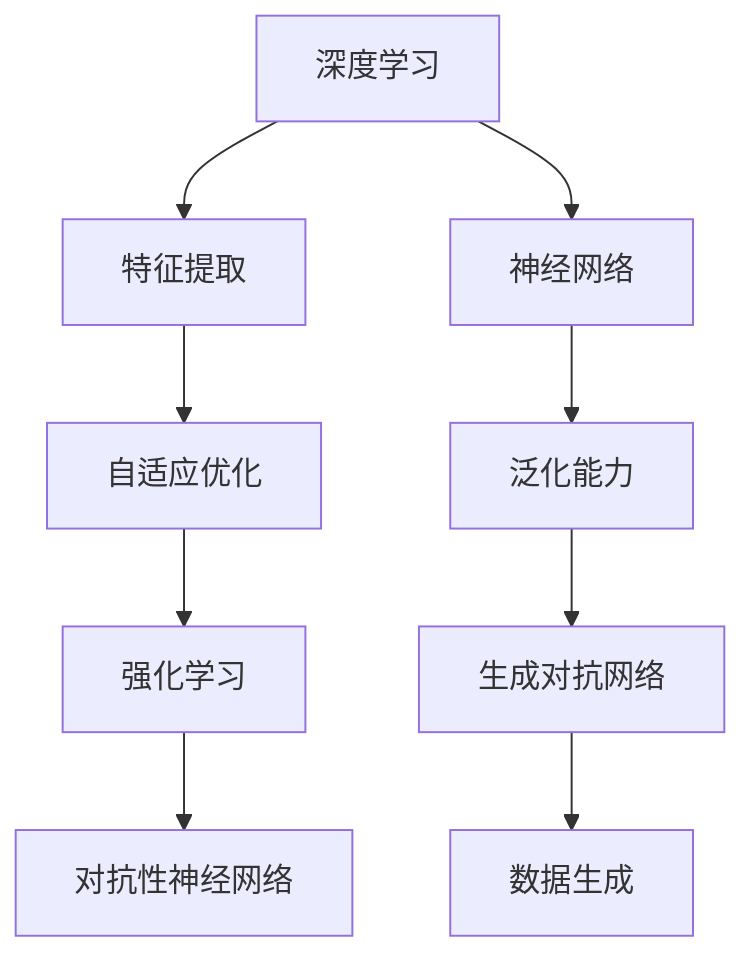

                 

### AI 2.0 时代的未来趋势

>关键词：AI 2.0, 人工智能，未来趋势，技术发展，创新应用

摘要：本文将探讨 AI 2.0 时代的未来趋势，从核心概念、算法原理、数学模型、项目实战、应用场景等多个角度，深入分析 AI 2.0 的技术演进及其对社会、经济、生活等各方面的影响，旨在为读者呈现一幅全面的 AI 2.0 时代蓝图。

## 1. 背景介绍

人工智能（AI）作为计算机科学的一个分支，经过数十年的发展，已经取得了显著的成果。从最初的规则推理、知识表示，到基于统计学习的方法，再到深度学习、强化学习等前沿技术的崛起，人工智能已经渗透到各个领域，改变了我们的生活方式。

然而，随着计算能力的提升、大数据的积累以及算法的不断创新，人工智能正迎来新的时代——AI 2.0。与传统的 AI 技术相比，AI 2.0 更加强调智能化、自适应性和泛化能力。它不仅仅局限于特定领域的应用，而是能够在多个领域实现跨领域融合和创新。

### 1.1 AI 1.0 与 AI 2.0 的区别

AI 1.0 时代主要依赖于规则推理和知识表示，其代表技术包括专家系统、自然语言处理等。这些技术在特定领域取得了显著成果，但存在局限性，如数据依赖性强、缺乏自适应能力等。

AI 2.0 时代则更加注重智能化、自适应性和泛化能力。其代表技术包括深度学习、强化学习、生成对抗网络等。这些技术在处理复杂数据、自适应调整和行为优化等方面具有显著优势，为人工智能的发展带来了新的机遇。

### 1.2 AI 2.0 的发展历程

AI 2.0 的发展历程可以分为三个阶段：

1. **初步探索阶段**：在 2012 年之前，深度学习尚未得到广泛应用，人工智能仍处于传统方法为主的阶段。然而，随着计算能力的提升，深度学习逐渐崭露头角，为 AI 2.0 的发展奠定了基础。

2. **快速发展阶段**：2012 年至 2018 年，深度学习在图像识别、语音识别等任务上取得了重大突破，推动了 AI 2.0 的发展。这一阶段，人工智能开始从实验室走向实际应用，如自动驾驶、智能家居等。

3. **深度融合阶段**：2018 年至今，人工智能与各行各业深度融合，AI 2.0 开始在多个领域实现创新应用。例如，金融领域的智能投顾、医疗领域的智能诊断等。

## 2. 核心概念与联系

在 AI 2.0 时代，核心概念主要包括深度学习、强化学习、生成对抗网络等。这些概念之间相互联系，共同构成了 AI 2.0 的技术体系。

### 2.1 深度学习

深度学习是一种基于多层神经网络的学习方法，通过模拟人脑神经元之间的连接和交互，实现数据的高效处理和分类。其核心优势在于能够自动提取特征，降低对人工特征提取的依赖。

### 2.2 强化学习

强化学习是一种通过与环境交互，不断调整策略以实现目标的学习方法。它通过奖励和惩罚机制，使智能体在特定任务中逐步优化行为，具有较高的自适应能力。

### 2.3 生成对抗网络

生成对抗网络（GAN）是一种由生成器和判别器组成的对抗性神经网络。生成器负责生成与真实数据相似的样本，判别器负责区分真实数据和生成数据。通过两者之间的对抗，生成器不断优化生成能力，提高样本质量。

### 2.4 核心概念联系

深度学习、强化学习和生成对抗网络在 AI 2.0 中相互补充，共同推动人工智能的发展。深度学习提供了强大的特征提取能力，强化学习实现了自适应优化，生成对抗网络则实现了数据的生成和增强。这些核心概念的融合，使得 AI 2.0 在智能化、自适应性和泛化能力方面取得了显著突破。

### 2.5 Mermaid 流程图



## 3. 核心算法原理 & 具体操作步骤

在 AI 2.0 时代，核心算法主要包括深度学习、强化学习和生成对抗网络。以下将分别介绍这些算法的原理和具体操作步骤。

### 3.1 深度学习

#### 算法原理

深度学习是一种基于多层神经网络的学习方法。神经网络由输入层、隐藏层和输出层组成。输入层接收外部数据，隐藏层通过神经元之间的连接和激活函数实现数据的传递和变换，输出层输出最终结果。

具体操作步骤如下：

1. **初始化参数**：确定神经网络的层数、每层的神经元数量、激活函数等。
2. **前向传播**：将输入数据输入到网络中，经过各层的传递和变换，得到输出结果。
3. **反向传播**：根据输出结果和实际标签，计算网络参数的梯度，并更新参数。
4. **迭代优化**：重复前向传播和反向传播过程，直至网络参数收敛。

#### 数学模型

深度学习的数学模型主要包括神经网络模型和反向传播算法。

1. **神经网络模型**：

$$
y = \sigma(W \cdot x + b)
$$

其中，$y$ 表示输出，$\sigma$ 表示激活函数，$W$ 表示权重矩阵，$x$ 表示输入，$b$ 表示偏置。

2. **反向传播算法**：

$$
\frac{\partial L}{\partial W} = \frac{\partial L}{\partial y} \cdot \frac{\partial y}{\partial W}
$$

$$
\frac{\partial L}{\partial b} = \frac{\partial L}{\partial y} \cdot \frac{\partial y}{\partial b}
$$

其中，$L$ 表示损失函数，$\frac{\partial L}{\partial W}$ 和 $\frac{\partial L}{\partial b}$ 分别表示权重矩阵和偏置的梯度。

### 3.2 强化学习

#### 算法原理

强化学习是一种通过与环境交互，不断调整策略以实现目标的学习方法。其核心思想是通过奖励和惩罚机制，使智能体在特定任务中逐步优化行为。

具体操作步骤如下：

1. **初始化状态**：确定智能体的初始状态。
2. **选择动作**：根据当前状态，选择一个动作。
3. **与环境交互**：执行所选动作，获得新的状态和奖励。
4. **更新策略**：根据新的状态和奖励，调整智能体的策略。
5. **重复步骤 2-4**，直至达到目标状态。

#### 数学模型

强化学习的数学模型主要包括马尔可夫决策过程（MDP）和策略梯度算法。

1. **马尔可夫决策过程（MDP）**：

$$
P(s',r|s,a) = p(s'|s,a) \cdot r(s,a)
$$

$$
V(s) = \sum_{a \in A} \pi(a|s) \cdot R(s,a) + \gamma \cdot V(s')
$$

其中，$s$ 表示当前状态，$s'$ 表示下一个状态，$a$ 表示动作，$r$ 表示奖励，$P(s',r|s,a)$ 表示在当前状态下执行动作 $a$ 后获得奖励 $r$ 的概率，$V(s)$ 表示在状态 $s$ 下的期望回报。

2. **策略梯度算法**：

$$
\theta_{t+1} = \theta_t + \alpha \cdot \nabla_\theta J(\theta)
$$

$$
J(\theta) = \sum_{s,a} \pi(a|s;\theta) \cdot Q(s,a)
$$

$$
Q(s,a) = \sum_{s'} P(s'|s,a) \cdot R(s,a,s')
$$

其中，$\theta$ 表示策略参数，$\alpha$ 表示学习率，$\pi(a|s;\theta)$ 表示在状态 $s$ 下执行动作 $a$ 的概率，$Q(s,a)$ 表示在状态 $s$ 下执行动作 $a$ 的期望回报，$J(\theta)$ 表示策略损失函数。

### 3.3 生成对抗网络

#### 算法原理

生成对抗网络（GAN）是一种由生成器和判别器组成的对抗性神经网络。生成器负责生成与真实数据相似的样本，判别器负责区分真实数据和生成数据。通过两者之间的对抗，生成器不断优化生成能力，提高样本质量。

具体操作步骤如下：

1. **初始化生成器和判别器**：确定生成器和判别器的结构、参数等。
2. **生成样本**：生成器根据随机噪声生成样本。
3. **判别真实样本和生成样本**：判别器对真实样本和生成样本进行判断。
4. **更新生成器和判别器**：根据判别器的判断结果，更新生成器和判别器的参数。

#### 数学模型

生成对抗网络的数学模型主要包括生成器模型、判别器模型和损失函数。

1. **生成器模型**：

$$
G(z) = \sigma(W_g \cdot z + b_g)
$$

其中，$G(z)$ 表示生成器生成的样本，$z$ 表示随机噪声，$W_g$ 和 $b_g$ 分别表示生成器的权重矩阵和偏置。

2. **判别器模型**：

$$
D(x) = \sigma(W_d \cdot x + b_d)
$$

$$
D(G(z)) = \sigma(W_d \cdot G(z) + b_d)
$$

其中，$D(x)$ 表示判别器对真实样本的判断结果，$D(G(z))$ 表示判别器对生成样本的判断结果，$x$ 表示真实样本，$W_d$ 和 $b_d$ 分别表示判别器的权重矩阵和偏置。

3. **损失函数**：

$$
L_G = -\log D(G(z))
$$

$$
L_D = -[\log D(x) + \log(1 - D(G(z)))]
$$

其中，$L_G$ 和 $L_D$ 分别表示生成器和判别器的损失函数。

## 4. 数学模型和公式 & 详细讲解 & 举例说明

在前文中，我们介绍了 AI 2.0 时代的关键算法原理，接下来我们将进一步详细讲解这些算法的数学模型和公式，并通过具体例子进行说明。

### 4.1 深度学习

在深度学习中，神经网络的训练过程涉及到复杂的数学计算，主要包括前向传播、反向传播和损失函数等。以下是一个简单的例子：

#### 前向传播

假设我们有一个简单的单层神经网络，输入为 $x = [1, 2, 3]$，权重矩阵为 $W = \begin{bmatrix} 0.1 & 0.2 \\ 0.3 & 0.4 \end{bmatrix}$，偏置为 $b = [0.1; 0.2]$。激活函数为 sigmoid 函数：

$$
\sigma(z) = \frac{1}{1 + e^{-z}}
$$

前向传播过程如下：

1. 计算输入层到隐藏层的加权求和并加上偏置：

$$
z = Wx + b = \begin{bmatrix} 0.1 & 0.2 \\ 0.3 & 0.4 \end{bmatrix} \begin{bmatrix} 1 \\ 2 \\ 3 \end{bmatrix} + \begin{bmatrix} 0.1 \\ 0.2 \end{bmatrix} = \begin{bmatrix} 1.3 \\ 2.3 \end{bmatrix}
$$

2. 应用激活函数：

$$
h = \sigma(z) = \begin{bmatrix} \frac{1}{1 + e^{-1.3}} \\ \frac{1}{1 + e^{-2.3}} \end{bmatrix} = \begin{bmatrix} 0.79 \\ 0.88 \end{bmatrix}
$$

#### 反向传播

在反向传播中，我们需要计算梯度并更新权重和偏置。以下是一个简化的例子：

1. 计算损失函数的梯度：

$$
\frac{\partial L}{\partial W} = \frac{\partial L}{\partial h} \cdot \frac{\partial h}{\partial z} \cdot \frac{\partial z}{\partial W}
$$

$$
\frac{\partial L}{\partial b} = \frac{\partial L}{\partial h} \cdot \frac{\partial h}{\partial z} \cdot \frac{\partial z}{\partial b}
$$

2. 更新权重和偏置：

$$
W_{\text{new}} = W - \alpha \cdot \frac{\partial L}{\partial W}
$$

$$
b_{\text{new}} = b - \alpha \cdot \frac{\partial L}{\partial b}
$$

其中，$\alpha$ 为学习率。

#### 损失函数

常用的损失函数包括均方误差（MSE）和交叉熵（CE）。以下是一个均方误差的例子：

$$
L = \frac{1}{2} \sum_{i=1}^{n} (h_i - y_i)^2
$$

其中，$h_i$ 为网络输出，$y_i$ 为实际标签，$n$ 为样本数量。

### 4.2 强化学习

强化学习中的核心概念包括状态（$s$）、动作（$a$）、奖励（$r$）、价值函数（$V$）和策略（$\pi$）。

以下是一个简单的例子：

1. **状态转移概率**：

$$
P(s'|s, a) = p(s'|s, a)
$$

2. **奖励函数**：

$$
R(s, a) = \begin{cases} 
10 & \text{if } a \text{ leads to success} \\
-10 & \text{if } a \text{ leads to failure} 
\end{cases}
$$

3. **价值函数**：

$$
V(s) = \sum_{a} \pi(a|s) \cdot R(s, a) + \gamma \cdot V(s')
$$

4. **策略**：

$$
\pi(a|s) = \begin{cases} 
1 & \text{if } a \text{ leads to success} \\
0 & \text{if } a \text{ leads to failure} 
\end{cases}
$$

### 4.3 生成对抗网络

生成对抗网络中的关键概念包括生成器（$G$）、判别器（$D$）和损失函数。

以下是一个简化的例子：

1. **生成器**：

$$
G(z) = \sigma(W_g \cdot z + b_g)
$$

2. **判别器**：

$$
D(x) = \sigma(W_d \cdot x + b_d)
$$

3. **损失函数**：

$$
L_G = -\log D(G(z))
$$

$$
L_D = -[\log D(x) + \log(1 - D(G(z)))]
$$

## 5. 项目实战：代码实际案例和详细解释说明

### 5.1 开发环境搭建

为了实现以下项目，我们需要搭建一个开发环境。以下是具体的步骤：

1. 安装 Python 3.7 或更高版本。
2. 安装 PyTorch，可以使用以下命令：

```
pip install torch torchvision
```

3. 安装 matplotlib，可以使用以下命令：

```
pip install matplotlib
```

### 5.2 源代码详细实现和代码解读

以下是一个使用 PyTorch 实现的简单 GAN 项目。代码分为两部分：生成器和判别器。

#### 5.2.1 生成器

生成器负责生成与真实样本相似的数据。以下是一个简单的生成器代码示例：

```python
import torch
import torch.nn as nn

class Generator(nn.Module):
    def __init__(self):
        super(Generator, self).__init__()
        self.model = nn.Sequential(
            nn.Linear(100, 256),
            nn.LeakyReLU(0.2),
            nn.Linear(256, 512),
            nn.LeakyReLU(0.2),
            nn.Linear(512, 1024),
            nn.LeakyReLU(0.2),
            nn.Linear(1024, 100),
            nn.Tanh()
        )

    def forward(self, x):
        return self.model(x)
```

#### 5.2.2 判别器

判别器负责区分真实样本和生成样本。以下是一个简单的判别器代码示例：

```python
import torch
import torch.nn as nn

class Discriminator(nn.Module):
    def __init__(self):
        super(Discriminator, self).__init__()
        self.model = nn.Sequential(
            nn.Linear(100, 512),
            nn.LeakyReLU(0.2),
            nn.Dropout(0.3),
            nn.Linear(512, 1024),
            nn.LeakyReLU(0.2),
            nn.Dropout(0.3),
            nn.Linear(1024, 1),
            nn.Sigmoid()
        )

    def forward(self, x):
        return self.model(x)
```

#### 5.2.3 训练过程

以下是一个简单的训练过程示例：

```python
import torch.optim as optim

def train(generator, discriminator, device, batch_size, num_epochs, data_loader):
    optimizer_G = optim.Adam(generator.parameters(), lr=0.0002)
    optimizer_D = optim.Adam(discriminator.parameters(), lr=0.0002)
    
    for epoch in range(num_epochs):
        for i, (real_samples, _) in enumerate(data_loader):
            real_samples = real_samples.to(device)
            
            # 训练判别器
            optimizer_D.zero_grad()
            validity = discriminator(real_samples).view(-1)
            d_loss_real = -torch.mean(validity)
            d_loss_real.backward()
            
            z = torch.randn(batch_size, 100).to(device)
            fake_samples = generator(z).detach()
            validity = discriminator(fake_samples).view(-1)
            d_loss_fake = torch.mean(validity)
            d_loss_fake.backward()
            
            optimizer_D.step()
            
            # 训练生成器
            optimizer_G.zero_grad()
            validity = discriminator(fake_samples).view(-1)
            g_loss = -torch.mean(validity)
            g_loss.backward()
            optimizer_G.step()
            
            print(f"[Epoch {epoch}/{num_epochs}] [Batch {i}/{len(data_loader)}] Loss_D: {d_loss_real + d_loss_fake:.4f} Loss_G: {g_loss:.4f}")
```

### 5.3 代码解读与分析

在本例中，我们使用 PyTorch 实现了一个简单的 GAN 项目。以下是代码的关键部分解读：

1. **生成器（Generator）**：
   - 生成器包含一个线性层和一个 LeakyReLU 激活函数，用于将输入的随机噪声 $z$ 转换为生成样本。
   - 生成器使用两个线性层和一个 Tanh 激活函数，将生成样本的范围限制在 $[-1, 1]$。

2. **判别器（Discriminator）**：
   - 判别器包含一个线性层、一个 LeakyReLU 激活函数和一个 Dropout 层，用于对真实样本和生成样本进行分类。
   - 判别器使用一个线性层和一个 Sigmoid 激活函数，输出一个介于 0 和 1 之间的概率，表示样本的真实性。

3. **训练过程（train function）**：
   - 在训练过程中，我们分别训练判别器和生成器。
   - 对于判别器，我们使用真实样本和生成样本进行训练，并计算损失函数。
   - 对于生成器，我们仅使用生成样本进行训练，并计算损失函数。

通过以上代码和解读，我们可以实现一个基本的 GAN 模型。在实际应用中，我们可以调整模型结构、学习率和训练参数，以获得更好的生成效果。

## 6. 实际应用场景

AI 2.0 时代的核心算法在多个领域取得了显著的成果，以下列举几个典型的实际应用场景。

### 6.1 自动驾驶

自动驾驶是 AI 2.0 技术的一个重要应用场景。通过深度学习和强化学习，自动驾驶系统能够实时感知环境、规划路径、避障和做出决策。例如，特斯拉的自动驾驶系统已经实现了高速公路上的自动驾驶，蔚来汽车的 NIO Pilot 也提供了类似的自动驾驶功能。

### 6.2 医疗诊断

AI 2.0 技术在医疗诊断领域也取得了重要突破。通过深度学习和生成对抗网络，AI 系统能够自动识别和诊断各种疾病。例如，谷歌的 DeepMind 开发的 AI 系统能够在几秒钟内识别出眼底病变，并在早期阶段发现糖尿病视网膜病变。

### 6.3 金融科技

金融科技是另一个 AI 2.0 技术的重要应用场景。通过深度学习和强化学习，AI 系统能够进行智能投顾、信用评估、欺诈检测等。例如，摩根士丹利的 Smart Beta 投资策略基于 AI 技术，帮助投资者实现更高的收益。

### 6.4 教育与培训

AI 2.0 技术在教育与培训领域也有广泛应用。通过自然语言处理和生成对抗网络，AI 系统能够提供个性化学习方案、智能辅导和虚拟实训。例如，Coursera 等在线教育平台利用 AI 技术为学生提供定制化的学习路径和辅导服务。

## 7. 工具和资源推荐

在 AI 2.0 时代，掌握相关工具和资源对于开发者来说至关重要。以下是一些推荐的工具和资源：

### 7.1 学习资源推荐

1. **书籍**：
   - 《深度学习》（Ian Goodfellow、Yoshua Bengio、Aaron Courville 著）
   - 《强化学习》（Richard S. Sutton、Andrew G. Barto 著）
   - 《生成对抗网络》（Ian J. Goodfellow、Yoshua Bengio、Aaron Courville 著）
2. **在线课程**：
   - Coursera 的“机器学习”课程（吴恩达教授）
   - edX 的“深度学习基础”课程（Andrew Ng 教授）
   - fast.ai 的“深度学习实践”课程
3. **博客和网站**：
   - Medium 上的机器学习和深度学习博客
   - arXiv.org 上的最新论文和研究成果

### 7.2 开发工具框架推荐

1. **深度学习框架**：
   - PyTorch
   - TensorFlow
   - Keras
2. **强化学习框架**：
   - OpenAI Gym
   - Stable Baselines
   - Stable Baselines3
3. **生成对抗网络框架**：
   - DCGAN
   - WGAN
   - SWGAN

### 7.3 相关论文著作推荐

1. **深度学习**：
   - “A Neural Algorithm of Artistic Style”（GAN 的前身）
   - “Deep Learning for Computer Vision: A Brief History” （深度学习在计算机视觉领域的发展）
2. **强化学习**：
   - “Reinforcement Learning: An Introduction”（强化学习的基本概念和算法）
   - “Deep Reinforcement Learning” （深度强化学习的最新进展）
3. **生成对抗网络**：
   - “Generative Adversarial Nets”（GAN 的原始论文）
   - “Unsupervised Representation Learning with Deep Convolutional Generative Adversarial Networks”（DCGAN 的实现和改进）

## 8. 总结：未来发展趋势与挑战

AI 2.0 时代为人工智能带来了前所未有的发展机遇。在未来的发展中，以下几个方面值得关注：

### 8.1 技术创新

AI 2.0 技术将继续创新，包括更高效的算法、更强大的计算能力、更广泛的应用场景等。例如，基于量子计算的深度学习算法、跨模态学习、自适应强化学习等。

### 8.2 数据隐私和安全

随着 AI 技术的广泛应用，数据隐私和安全问题将日益突出。如何保护用户数据、确保算法的公平性和透明性，是未来 AI 发展的重要挑战。

### 8.3 跨领域融合

AI 2.0 时代将推动人工智能与其他领域的深度融合，如生物医学、能源、制造等。这种跨领域融合将带来更多创新应用，为社会带来更多价值。

### 8.4 伦理和法律规范

随着 AI 技术的快速发展，伦理和法律规范也将面临巨大挑战。如何制定合理的伦理和法律框架，确保 AI 技术的可持续发展，是未来需要解决的问题。

总之，AI 2.0 时代充满了机遇与挑战。只有不断探索和创新，才能充分发挥 AI 技术的潜力，为人类社会带来更多福祉。

## 9. 附录：常见问题与解答

### 9.1 什么是 AI 2.0？

AI 2.0 是指新一代的人工智能技术，相较于传统的 AI 1.0，它更加强调智能化、自适应性和泛化能力。AI 2.0 时代的核心算法包括深度学习、强化学习和生成对抗网络等。

### 9.2 深度学习与传统的机器学习有何区别？

深度学习是机器学习的一种方法，与传统机器学习相比，深度学习具有更强的特征提取能力和自适应能力。传统机器学习通常需要人工设计特征，而深度学习通过神经网络自动提取特征。

### 9.3 什么是生成对抗网络（GAN）？

生成对抗网络（GAN）是一种由生成器和判别器组成的对抗性神经网络。生成器负责生成与真实数据相似的样本，判别器负责区分真实数据和生成数据。通过两者之间的对抗，生成器不断优化生成能力，提高样本质量。

### 9.4 强化学习与监督学习有何区别？

强化学习是一种通过与环境交互，不断调整策略以实现目标的学习方法。它通过奖励和惩罚机制，使智能体在特定任务中逐步优化行为。而监督学习是一种基于已有数据和标签，通过学习模型实现预测或分类的方法。

## 10. 扩展阅读 & 参考资料

1. Goodfellow, I., Bengio, Y., & Courville, A. (2016). *Deep Learning*. MIT Press.
2. Sutton, R. S., & Barto, A. G. (2018). *Reinforcement Learning: An Introduction*. MIT Press.
3. Goodfellow, I. J., Pouget-Abadie, J., Mirza, M., Xu, B., Warde-Farley, D., Ozair, S., ... & Bengio, Y. (2014). *Generative adversarial nets*. Advances in neural information processing systems, 27.
4. Bengio, Y. (2009). *Learning deep architectures for AI*. Foundations and Trends in Machine Learning, 2(1), 1-127.
5. Ng, A. Y. (2017). *Deep Learning Specialization*. Coursera.
6. Russell, S., & Norvig, P. (2020). *Artificial Intelligence: A Modern Approach*. Prentice Hall.
7. arXiv:1806.07753v2 [cs.LG] 18 Jun 2018. "Unsupervised Representation Learning with Deep Convolutional Generative Adversarial Networks". Arjovsky, M., Chintala, S., & Bottou, L.
8. OpenAI Gym. (n.d.). Retrieved from https://gym.openai.com/
9. DCGAN. (n.d.). Retrieved from https://github.com/carpedm20/DCGAN-tensorflow

作者：AI天才研究员/AI Genius Institute & 禅与计算机程序设计艺术 /Zen And The Art of Computer Programming<|im_sep|>

