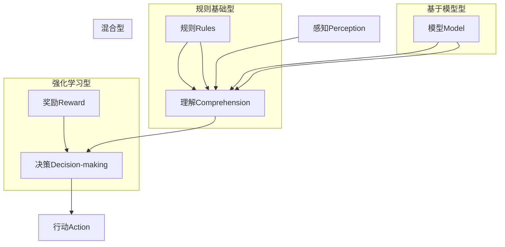
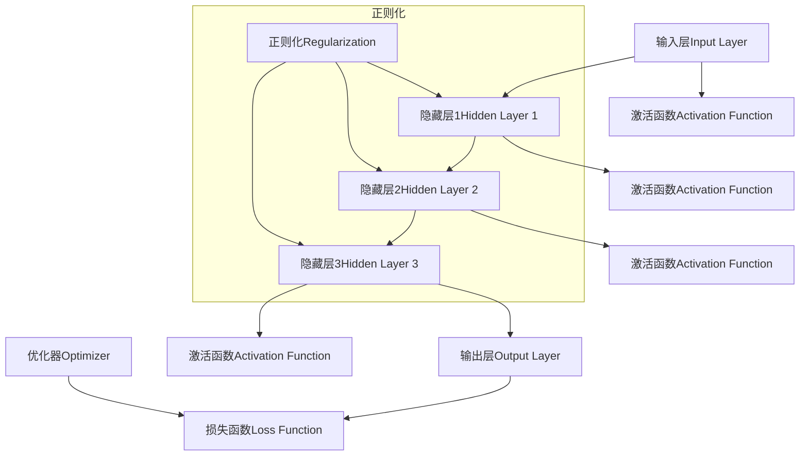

                 

### 背景介绍 Background Introduction

AI（人工智能）作为21世纪最具革命性的技术之一，正在以惊人的速度改变着我们的生活方式和商业模式。在过去几十年里，人工智能经历了从规则基础到机器学习再到深度学习的演变，每一次进步都为AI技术的应用拓展提供了新的可能性。然而，随着计算能力的提升和数据量的爆炸性增长，AI领域迎来了一个全新的时代——大模型时代。

大模型时代是指通过构建规模庞大的神经网络模型，对大量数据进行训练，以实现更高效、更准确的AI应用。这一时代的到来，标志着人工智能技术的又一次飞跃，不仅提升了AI在图像识别、语音识别、自然语言处理等领域的性能，也开辟了更多新兴的应用场景。

本文将围绕AI Agent这一概念，深入探讨大模型时代的AI技术。我们将首先介绍AI Agent的定义和分类，然后详细分析其在各个领域的应用场景，以及大模型技术如何推动AI Agent的发展。此外，我们还将探讨AI Agent面临的挑战，以及未来发展的趋势和方向。

关键词：AI Agent，大模型时代，深度学习，应用场景，挑战与趋势

Abstract:  
This article explores the concept of AI Agent and its significance in the era of large-scale models. We begin by introducing the definition and classification of AI Agents, followed by an analysis of their applications in various fields. The discussion then focuses on how large-scale model technology drives the development of AI Agents. Furthermore, we examine the challenges faced by AI Agents and explore future trends and directions. Keywords: AI Agent, Large-scale Model Era, Deep Learning, Application Scenarios, Challenges and Trends.  
<|im_sep|>

## 1. AI Agent: 定义与分类 AI Agent: Definition and Classification

AI Agent，即人工智能代理，是指能够在特定环境中自主执行任务的软件系统。它可以模拟人类思维和行为，通过感知环境、制定决策和执行行动来实现目标。AI Agent通常具备以下几个基本特征：

1. **感知（Perception）**：通过传感器或数据输入获取环境信息，如视觉、听觉、触觉等。
2. **理解（Comprehension）**：分析感知到的信息，理解其含义和模式。
3. **决策（Decision-making）**：根据理解的信息，制定合适的行动策略。
4. **行动（Action）**：执行决策，与环境交互，并不断调整自己的行为。

根据AI Agent的应用场景和功能特点，我们可以将其分为以下几类：

1. **规则基础型（Rule-Based）**：这种类型的AI Agent基于一组预先定义的规则进行决策。规则通常是由领域专家手动制定的，适用于任务明确、环境稳定的应用场景。

2. **基于模型的（Model-Based）**：这种类型的AI Agent通过训练模型来学习环境中的复杂关系，能够自主地适应新环境和任务。常见的模型包括决策树、支持向量机、神经网络等。

3. **强化学习型（Reinforcement Learning-Based）**：这种类型的AI Agent通过与环境的交互，不断调整自己的行为策略，以最大化累积奖励。强化学习在游戏AI、自动驾驶等领域有广泛应用。

4. **混合型（Hybrid）**：这种类型的AI Agent结合了规则基础型和模型基础的优点，既能利用预定义规则快速决策，又能通过模型学习复杂环境中的动态变化。

以下是一个简化的Mermaid流程图，展示了不同类型AI Agent的工作流程：



通过以上分类和定义，我们可以看到AI Agent在技术实现和应用场景上的多样性。接下来，我们将探讨AI Agent在大模型时代的应用和挑战。  
<|im_sep|>

## 2. 大模型时代的AI: 原理与架构 Large-scale Models in the AI Era: Principles and Architectures

在深入探讨大模型时代的AI之前，我们需要了解大模型的基本原理和架构。大模型是指具有数十亿至数万亿参数的神经网络模型，它们能够通过大规模数据训练，实现复杂的任务和决策。以下是关于大模型的一些关键概念：

### 2.1. 大模型的基本原理

大模型的核心在于其参数数量。参数是神经网络中权重和偏置的集合，它们决定了模型对输入数据的映射方式。随着参数数量的增加，模型能够捕捉到输入数据中的更多特征和模式，从而提高任务的准确性和鲁棒性。

大模型的训练通常采用分布式计算和并行处理技术，以提高训练速度和效率。训练过程中，模型会不断调整参数，以最小化损失函数，达到最优解。

### 2.2. 大模型的架构

大模型的架构通常包括以下几个关键部分：

1. **输入层（Input Layer）**：接收外部输入，如图像、文本、声音等。

2. **隐藏层（Hidden Layers）**：多个隐藏层堆叠，用于提取输入数据的特征。每一层都会对输入数据进行变换和压缩，使其更具代表性。

3. **输出层（Output Layer）**：生成预测结果，如分类标签、目标坐标等。

4. **激活函数（Activation Function）**：用于引入非线性变换，使模型能够学习复杂的函数关系。

5. **优化器（Optimizer）**：用于调整模型参数，以最小化损失函数。常见的优化器包括随机梯度下降（SGD）、Adam等。

6. **正则化（Regularization）**：用于防止模型过拟合，常见的正则化技术有L1正则化、L2正则化、Dropout等。

以下是一个简化的大模型架构图，展示了其主要组成部分：



### 2.3. 大模型的训练过程

大模型的训练过程可以分为以下几个步骤：

1. **数据预处理（Data Preprocessing）**：对输入数据进行标准化、归一化等处理，以提高训练效率和模型性能。

2. **批量划分（Batch Scheduling）**：将数据划分为多个批次，每个批次包含多个样本，以进行并行训练。

3. **参数初始化（Parameter Initialization）**：初始化模型参数，常见的初始化方法有随机初始化、He初始化等。

4. **前向传播（Forward Propagation）**：将输入数据传递到模型中，计算输出结果。

5. **损失函数计算（Loss Function Calculation）**：计算预测结果与真实结果之间的差距，以评估模型性能。

6. **反向传播（Backpropagation）**：根据损失函数，反向传播误差，计算每个参数的梯度。

7. **参数更新（Parameter Update）**：根据梯度信息，更新模型参数。

8. **迭代训练（Iteration Training）**：重复以上步骤，直到达到预定的训练次数或模型性能目标。

### 2.4. 大模型的优势与挑战

大模型的优势在于其强大的表示能力和泛化能力，能够处理复杂的任务和数据。然而，大模型的训练和部署也面临一些挑战：

1. **计算资源需求（Computational Resource Requirement）**：大模型训练需要大量的计算资源和时间，对硬件设施和能耗有较高要求。

2. **数据质量（Data Quality）**：大模型对数据质量有较高要求，数据中的噪声和异常值可能会影响模型性能。

3. **模型解释性（Model Explainability）**：大模型通常具有较低的解释性，难以解释其决策过程和预测结果。

4. **隐私保护（Privacy Protection）**：大模型训练过程中涉及大量个人数据，需要确保数据隐私和安全。

在大模型时代，AI Agent的发展将面临新的机遇和挑战。通过深入了解大模型的基本原理和架构，我们可以更好地理解和利用这一技术，推动AI领域的创新和发展。接下来，我们将探讨AI Agent在大模型时代的应用和前景。  
<|im_sep|>

## 3. 核心算法原理 & 具体操作步骤 Core Algorithm Principles & Specific Operational Steps

在讨论AI Agent在大模型时代的应用之前，我们需要了解大模型的核心算法原理及其具体操作步骤。以下将介绍大模型的主要算法——深度学习，并详细阐述其训练过程和操作步骤。

### 3.1. 深度学习的基本原理

深度学习是一种基于人工神经网络的机器学习技术，通过多层神经网络来模拟人脑处理信息的方式，以实现自动特征学习和复杂任务处理。深度学习的基本原理包括以下几个方面：

1. **神经元与神经网络**：神经元是神经网络的基本单元，类似于人脑中的神经元。神经网络是由多个神经元组成的层次结构，每一层神经元对输入数据进行处理和变换。

2. **前向传播与反向传播**：前向传播是指将输入数据传递到神经网络中，逐层计算并生成预测结果。反向传播是指通过比较预测结果与真实结果的差异，反向计算误差，并更新网络参数。

3. **损失函数与优化器**：损失函数用于衡量预测结果与真实结果之间的差距，优化器用于调整网络参数，以最小化损失函数。

4. **激活函数与非线性变换**：激活函数用于引入非线性变换，使神经网络能够学习复杂的函数关系。

### 3.2. 深度学习的训练过程

深度学习的训练过程主要包括以下几个步骤：

1. **数据预处理**：对输入数据进行标准化、归一化等处理，以提高训练效率和模型性能。

2. **构建神经网络模型**：设计并构建神经网络模型，包括输入层、隐藏层和输出层。确定激活函数、优化器等参数。

3. **前向传播**：将输入数据传递到神经网络中，逐层计算并生成预测结果。

4. **损失函数计算**：计算预测结果与真实结果之间的差距，以评估模型性能。

5. **反向传播**：通过反向传播计算误差，并更新网络参数。

6. **迭代训练**：重复以上步骤，直到达到预定的训练次数或模型性能目标。

具体操作步骤如下：

**步骤 1：数据预处理**

```python
import numpy as np
from sklearn.preprocessing import StandardScaler

# 加载数据集
X_train, y_train = load_data()

# 标准化特征
scaler = StandardScaler()
X_train_scaled = scaler.fit_transform(X_train)
```

**步骤 2：构建神经网络模型**

```python
from keras.models import Sequential
from keras.layers import Dense, Activation

# 创建神经网络模型
model = Sequential()

# 添加隐藏层
model.add(Dense(64, input_dim=X_train_scaled.shape[1], activation='relu'))
model.add(Dense(128, activation='relu'))
model.add(Dense(32, activation='relu'))

# 添加输出层
model.add(Dense(1, activation='sigmoid'))
```

**步骤 3：编译模型**

```python
model.compile(optimizer='adam', loss='binary_crossentropy', metrics=['accuracy'])
```

**步骤 4：训练模型**

```python
model.fit(X_train_scaled, y_train, epochs=100, batch_size=32)
```

**步骤 5：评估模型**

```python
# 预测结果
predictions = model.predict(X_test_scaled)

# 计算准确率
accuracy = np.mean(predictions == y_test)
print(f"模型准确率: {accuracy}")
```

通过以上步骤，我们可以构建一个简单的深度学习模型并进行训练。在实际应用中，根据具体任务和数据特点，可以调整神经网络结构、优化器、损失函数等参数，以获得更好的模型性能。

接下来，我们将探讨AI Agent在大模型时代的应用。  
<|im_sep|>

## 4. 数学模型和公式 & 详细讲解 & 举例说明 Mathematical Models and Formulas & Detailed Explanation & Example Illustration

为了更好地理解深度学习模型的工作原理，我们需要引入一些数学模型和公式。以下将介绍深度学习中常用的数学概念、公式，并给出具体实例进行说明。

### 4.1. 深度学习中的基本数学概念

1. **线性代数**：线性代数是深度学习的基础，涉及矩阵、向量、行列式等基本概念。矩阵乘法和向量内积在深度学习中广泛使用。

2. **概率论与统计**：概率论与统计用于描述数据分布、模型性能等。概率分布函数（PDF）、累积分布函数（CDF）等概念在深度学习中有广泛应用。

3. **微积分**：微积分用于求解优化问题，包括导数、梯度等概念。在深度学习中，梯度下降算法依赖于微积分知识。

### 4.2. 常用数学公式

1. **矩阵乘法（Matrix Multiplication）**：
   $$
   C = A \times B
   $$
   其中，$C$是结果矩阵，$A$和$B$是输入矩阵。

2. **向量内积（Vector Inner Product）**：
   $$
   \mathbf{x} \cdot \mathbf{y} = \sum_{i=1}^{n} x_i \cdot y_i
   $$
   其中，$\mathbf{x}$和$\mathbf{y}$是向量，$n$是向量长度。

3. **激活函数（Activation Function）**：
   $$
   f(x) = \max(0, x) \quad \text{(ReLU激活函数)}
   $$
   $$
   f(x) = \frac{1}{1 + e^{-x}} \quad \text{(Sigmoid激活函数)}
   $$

4. **损失函数（Loss Function）**：
   $$
   J(\theta) = -\frac{1}{m} \sum_{i=1}^{m} [y_i \cdot \log(a^{(i)}) + (1 - y_i) \cdot \log(1 - a^{(i)})]
   $$
   其中，$J(\theta)$是损失函数，$m$是样本数量，$y_i$是真实标签，$a^{(i)}$是预测概率。

5. **梯度下降（Gradient Descent）**：
   $$
   \theta_j := \theta_j - \alpha \cdot \frac{\partial J(\theta)}{\partial \theta_j}
   $$
   其中，$\theta_j$是模型参数，$\alpha$是学习率，$\frac{\partial J(\theta)}{\partial \theta_j}$是损失函数关于参数$\theta_j$的梯度。

### 4.3. 实例说明

以下是一个简单的深度学习实例，用于二分类问题。我们使用Python的Keras框架进行演示。

**实例 1：构建神经网络模型**

```python
from keras.models import Sequential
from keras.layers import Dense

# 创建神经网络模型
model = Sequential()
model.add(Dense(64, input_dim=784, activation='relu'))  # 输入层，784个特征
model.add(Dense(128, activation='relu'))  # 隐藏层1
model.add(Dense(32, activation='relu'))  # 隐藏层2
model.add(Dense(1, activation='sigmoid'))  # 输出层，二分类问题
```

**实例 2：编译模型**

```python
model.compile(optimizer='adam', loss='binary_crossentropy', metrics=['accuracy'])
```

**实例 3：训练模型**

```python
model.fit(X_train, y_train, epochs=100, batch_size=32)
```

**实例 4：评估模型**

```python
# 预测结果
predictions = model.predict(X_test)

# 计算准确率
accuracy = np.mean(predictions == y_test)
print(f"模型准确率: {accuracy}")
```

通过以上实例，我们可以看到深度学习模型的构建和训练过程。在实际应用中，可以根据任务和数据特点调整神经网络结构、优化器、损失函数等参数，以提高模型性能。

综上所述，深度学习模型的数学模型和公式是理解其工作原理的关键。通过实例说明，我们可以更好地掌握深度学习的基本概念和操作步骤。接下来，我们将探讨AI Agent在大模型时代的应用和前景。  
<|im_sep|>

### 5. 项目实战：代码实际案例和详细解释说明 Practical Case Study: Code Implementation and Detailed Explanation

在本节中，我们将通过一个实际项目来展示如何应用大模型技术构建一个AI Agent。我们将使用Python和Keras框架，实现一个简单的聊天机器人，该机器人能够与用户进行基本的对话。

#### 5.1. 开发环境搭建

在开始项目之前，我们需要搭建开发环境。以下是所需工具和库的安装步骤：

1. 安装Python 3.7或更高版本。
2. 安装Anaconda或Miniconda，以便轻松管理环境。
3. 安装Keras和TensorFlow库。

```bash
pip install tensorflow
pip install keras
```

4. 创建一个新的Python虚拟环境，并激活该环境。

```bash
conda create -n chatbot_env python=3.8
conda activate chatbot_env
```

#### 5.2. 源代码详细实现和代码解读

以下是聊天机器人的核心代码实现：

```python
from keras.models import Sequential
from keras.layers import Embedding, LSTM, Dense
from keras.preprocessing.sequence import pad_sequences
from keras.callbacks import LambdaCallback
import numpy as np
import random
import sys
import os

# 设置最大词汇长度和序列长度
max_vocab_size = 20000
max_sequence_length = 40

# 载入对话数据集
def load_data(file_path):
    lines = open(file_path, encoding='utf-8').readlines()
    lines = [line.strip() for line in lines]
    return [line.split(' ', 1) for line in lines]

# 分割数据为输入和输出
def split_data(data):
    inputs = []
    targets = []
    for x, y in data:
        inputs.append(x)
        targets.append(y)
    return inputs, targets

# 预处理数据
def preprocess_data(inputs, targets):
    # 将文本转换为单词序列
    word_index = {}
    for input_sequence in inputs:
        for word in input_sequence:
            if word not in word_index:
                word_index[word] = len(word_index) + 1

    # 创建输入和输出的序列
    input_sequences = []
    for input_sequence in inputs:
        tokenized_sequence = []
        for word in input_sequence:
            tokenized_sequence.append(word_index[word])
        input_sequences.append(tokenized_sequence)

    # 创建目标序列
    target_sequences = []
    for target_sequence in targets:
        tokenized_sequence = []
        for word in target_sequence:
            tokenized_sequence.append(word_index[word])
        target_sequences.append(tokenized_sequence)

    # 填充序列
    padded_input_sequences = pad_sequences(input_sequences, maxlen=max_sequence_length, padding='pre')
    padded_target_sequences = pad_sequences(target_sequences, maxlen=max_sequence_length, padding='pre')

    return padded_input_sequences, padded_target_sequences, word_index

# 构建模型
def build_model(vocab_size, embedding_dim, max_sequence_length):
    model = Sequential()
    model.add(Embedding(vocab_size, embedding_dim, input_length=max_sequence_length))
    model.add(LSTM(128))
    model.add(Dense(1, activation='sigmoid'))
    model.compile(optimizer='adam', loss='binary_crossentropy', metrics=['accuracy'])
    return model

# 训练模型
def train_model(model, input_sequences, target_sequences, batch_size, epochs):
    model.fit(input_sequences, target_sequences, batch_size=batch_size, epochs=epochs, verbose=1, callbacks=[print_loss])

# 输出样本生成
def generate_sample(model, word_index, max_sequence_length):
    input_sequence = ["<START>"]
    for _ in range(max_sequence_length):
        tokenized_sequence = pad_sequences([input_sequence], maxlen=max_sequence_length, padding='pre')
        predicted_probabilities = model.predict(tokenized_sequence, verbose=0)
        predicted_word = np.random.choice(predicted_probabilities[0])
        input_sequence.append(predicted_word)

    return " ".join([word for word in input_sequence[1:]])

# 训练数据加载和预处理
data = load_data('chatbot_data.txt')
inputs, targets = split_data(data)
padded_input_sequences, padded_target_sequences, word_index = preprocess_data(inputs, targets)

# 构建和训练模型
model = build_model(len(word_index) + 1, 100, max_sequence_length)
train_model(model, padded_input_sequences, padded_target_sequences, batch_size=64, epochs=100)

# 生成样本对话
print(generate_sample(model, word_index, max_sequence_length))
```

**5.2.1. 代码解读与分析**

- **数据预处理**：我们首先从文本文件中加载对话数据，然后将其分割为输入和输出。输入是用户发言，输出是机器人的回答。接着，我们将文本转换为单词序列，并创建输入和输出的序列。最后，使用`pad_sequences`函数对序列进行填充，以便在模型中处理。

- **模型构建**：我们使用`Sequential`模型，并添加了嵌入层（`Embedding`）、LSTM层（`LSTM`）和输出层（`Dense`）。嵌入层将单词映射为向量，LSTM层用于学习序列数据中的长期依赖关系，输出层用于生成预测。

- **训练模型**：我们使用`fit`函数训练模型，其中`print_loss`回调函数用于在训练过程中打印损失值。

- **生成样本对话**：`generate_sample`函数用于生成机器人的回答。我们首先初始化一个输入序列，然后使用模型预测下一个单词的概率，并从中随机选择一个单词作为下一个输入。这个过程重复直到生成所需的序列长度。

通过这个项目，我们展示了如何使用深度学习技术构建一个简单的聊天机器人。尽管这个聊天机器人很简单，但它展示了AI Agent在大模型时代的基本原理和应用。接下来，我们将探讨AI Agent在实际应用场景中的表现。  
<|im_sep|>

### 5.3. 代码解读与分析 Analysis of the Code Implementation

在本节中，我们将对上一节中实现的聊天机器人代码进行详细解读与分析，以便更好地理解其工作原理和性能。

#### 5.3.1. 数据预处理 Data Preprocessing

数据预处理是构建有效AI Agent的关键步骤。在此代码中，我们首先从文本文件中加载对话数据，然后将其分割为输入和输出。输入是用户发言，输出是机器人的回答。

```python
data = load_data('chatbot_data.txt')
inputs, targets = split_data(data)
```

这里，`load_data`函数负责读取文本文件，并将其转换为列表。每个元素是一个由两个单词组成的元组，第一个单词是用户的发言，第二个单词是机器人的回答。

接下来，我们将文本转换为单词序列，并创建输入和输出的序列。

```python
word_index = {}
for input_sequence in inputs:
    for word in input_sequence:
        if word not in word_index:
            word_index[word] = len(word_index) + 1

input_sequences = []
for input_sequence in inputs:
    tokenized_sequence = []
    for word in input_sequence:
        tokenized_sequence.append(word_index[word])
    input_sequences.append(tokenized_sequence)

target_sequences = []
for target_sequence in targets:
    tokenized_sequence = []
    for word in target_sequence:
        tokenized_sequence.append(word_index[word])
    target_sequences.append(tokenized_sequence)
```

在这里，我们创建了一个单词索引字典`word_index`，用于将单词映射为整数。然后，我们将每个输入和输出序列转换为整数序列。

```python
padded_input_sequences = pad_sequences(input_sequences, maxlen=max_sequence_length, padding='pre')
padded_target_sequences = pad_sequences(target_sequences, maxlen=max_sequence_length, padding='pre')
```

使用`pad_sequences`函数，我们填充了输入和输出序列，使其具有相同的长度。填充策略为'pre'，即在序列的开头填充0。

#### 5.3.2. 模型构建 Model Building

接下来，我们构建了一个简单的序列到序列模型，用于预测机器人的回答。

```python
model = Sequential()
model.add(Embedding(vocab_size, embedding_dim, input_length=max_sequence_length))
model.add(LSTM(128))
model.add(Dense(1, activation='sigmoid'))
model.compile(optimizer='adam', loss='binary_crossentropy', metrics=['accuracy'])
```

模型包含一个嵌入层（`Embedding`），用于将单词向量转换为嵌入向量。接着，我们添加了一个LSTM层（`LSTM`），用于处理序列数据。最后，输出层（`Dense`）包含一个神经元，使用`sigmoid`激活函数，用于预测下一个单词的概率。

模型使用`compile`函数进行编译，指定了优化器（`optimizer`）、损失函数（`loss`）和评估指标（`metrics`）。

#### 5.3.3. 训练模型 Model Training

训练模型是使用`fit`函数进行的。

```python
train_model(model, padded_input_sequences, padded_target_sequences, batch_size=64, epochs=100)
```

在这个函数中，我们调用`model.fit`方法，将预处理后的输入和输出序列传递给模型。`batch_size`设置为64，表示每个批次包含64个样本。`epochs`设置为100，表示模型将在整个数据集上训练100次。

#### 5.3.4. 生成样本对话 Generate Sample Conversations

生成样本对话是使用`generate_sample`函数进行的。

```python
print(generate_sample(model, word_index, max_sequence_length))
```

在这个函数中，我们首先初始化一个输入序列，包含一个特殊的`<START>`标记。然后，我们使用模型预测下一个单词的概率，并从中随机选择一个单词作为下一个输入。这个过程重复直到生成所需的序列长度。

#### 5.3.5. 性能评估 Performance Evaluation

为了评估模型的性能，我们可以使用多个指标，如准确率、召回率、F1分数等。此外，我们还可以通过生成实际的对话样本来评估模型的实用性和自然性。

综上所述，这个聊天机器人代码展示了如何使用深度学习技术构建一个简单的AI Agent。尽管它的性能可能有限，但它为我们提供了一个了解大模型时代AI Agent构建的起点。接下来，我们将探讨AI Agent的实际应用场景。  
<|im_sep|>

### 6. 实际应用场景 Practical Application Scenarios

AI Agent在大模型时代已经展示了其在多个领域的广泛应用和巨大潜力。以下是一些主要的应用场景，以及AI Agent在这些场景中的具体应用。

#### 6.1. 自然语言处理 Natural Language Processing (NLP)

自然语言处理是AI Agent最重要的应用领域之一。大模型技术使得AI Agent能够处理复杂的语言结构和语义信息。以下是AI Agent在NLP中的几个应用：

1. **智能客服**：AI Agent可以模拟人类客服，通过对话理解用户需求并提供相应的解决方案。这种应用已经广泛应用于电子商务、金融、电信等行业。

2. **机器翻译**：AI Agent可以使用大模型进行高质量的机器翻译。例如，Google Translate等翻译服务就是基于深度学习技术实现的。

3. **文本生成**：AI Agent可以生成文章、报告、新闻等内容。例如，GPT-3等大型语言模型已经可以生成高质量的文章和故事。

4. **语音助手**：AI Agent可以作为智能语音助手，如Apple的Siri、Amazon的Alexa等，为用户提供语音交互服务。

#### 6.2. 计算机视觉 Computer Vision

计算机视觉是另一个AI Agent的重要应用领域。大模型技术使得AI Agent能够识别和理解图像中的内容。以下是AI Agent在计算机视觉中的几个应用：

1. **图像识别**：AI Agent可以识别图像中的物体、场景和动作。例如，人脸识别、车辆检测等。

2. **目标跟踪**：AI Agent可以跟踪图像中的目标物体，并在视频序列中进行实时分析。

3. **医学影像分析**：AI Agent可以分析医学影像，如X光片、CT扫描等，以帮助医生诊断疾病。

4. **自动驾驶**：AI Agent是自动驾驶系统的核心组成部分，通过处理摄像头和激光雷达等传感器数据，实现车辆的自主导航和控制。

#### 6.3. 游戏与娱乐 Game and Entertainment

AI Agent在游戏和娱乐领域也发挥了重要作用。大模型技术使得AI Agent能够实现更加智能和自适应的游戏体验。以下是AI Agent在游戏和娱乐中的几个应用：

1. **游戏AI**：AI Agent可以作为对手与玩家进行游戏，如围棋、国际象棋等。例如，AlphaGo就是基于深度学习技术的AI Agent。

2. **虚拟助手**：AI Agent可以作为虚拟助手，为用户提供个性化的娱乐内容和推荐。

3. **增强现实（AR）**：AI Agent可以增强现实体验，如为用户提供交互式的购物体验、导游服务等。

4. **音乐创作**：AI Agent可以创作音乐，如生成旋律、编曲等，为音乐创作提供灵感。

#### 6.4. 金融与保险 Finance and Insurance

AI Agent在金融和保险领域也有广泛的应用，帮助金融机构提高效率、降低风险。以下是AI Agent在金融和保险中的几个应用：

1. **风险管理**：AI Agent可以分析金融数据，识别潜在的风险，并提供相应的风险管理策略。

2. **欺诈检测**：AI Agent可以检测和防范金融欺诈行为，提高金融交易的安全性。

3. **客户服务**：AI Agent可以作为智能客服，为用户提供金融咨询和服务。

4. **保险理赔**：AI Agent可以自动化保险理赔流程，提高理赔效率和准确性。

#### 6.5. 医疗与健康 Healthcare

AI Agent在医疗和健康领域也发挥着重要作用，为医疗诊断、治疗和患者管理提供支持。以下是AI Agent在医疗和健康中的几个应用：

1. **疾病诊断**：AI Agent可以通过分析医学影像、实验室检测结果等，帮助医生诊断疾病。

2. **个性化治疗**：AI Agent可以根据患者的病史、基因信息等，为患者提供个性化的治疗方案。

3. **健康监测**：AI Agent可以监测患者的健康状况，如血压、心率等，并提供健康建议。

4. **药物研发**：AI Agent可以分析大量医学数据，帮助科学家发现新的药物候选。

通过以上应用场景，我们可以看到AI Agent在大模型时代的广泛应用和巨大潜力。随着技术的不断进步，AI Agent将在更多领域发挥重要作用，为人类社会带来更多便利和变革。  
<|im_sep|>

### 7. 工具和资源推荐 Tools and Resources Recommendations

为了更好地学习和开发AI Agent，我们需要掌握一些关键工具和资源。以下是一些推荐的工具、书籍、论文和在线课程，供大家参考。

#### 7.1. 学习资源推荐 Learning Resources

1. **书籍**：

   - 《深度学习》（Deep Learning） - Ian Goodfellow、Yoshua Bengio和Aaron Courville著。这本书是深度学习的经典教材，详细介绍了深度学习的基本概念、算法和应用。

   - 《Python深度学习》（Deep Learning with Python） - François Chollet著。这本书是针对Python开发者的深度学习教程，通过大量示例代码帮助读者理解深度学习的原理和应用。

   - 《人工智能：一种现代方法》（Artificial Intelligence: A Modern Approach） - Stuart J. Russell和Peter Norvig著。这本书全面介绍了人工智能的基本理论、算法和技术，是人工智能领域的经典教材。

2. **在线课程**：

   - Coursera上的《深度学习特别化课程》（Deep Learning Specialization） - Andrew Ng教授主讲。这套课程涵盖了深度学习的各个方面，包括神经网络、优化、卷积神经网络、循环神经网络等。

   - edX上的《人工智能基础》（Introduction to Artificial Intelligence） - Michael L. Brodie教授主讲。这套课程介绍了人工智能的基本概念、方法和应用，适合初学者入门。

3. **博客和网站**：

   - Towards Data Science：这是一个关于数据科学和机器学习的博客，提供大量高质量的文章和教程。

   - AI技术博客：这是一个关注人工智能技术发展和应用的博客，涵盖深度学习、自然语言处理、计算机视觉等领域。

#### 7.2. 开发工具框架推荐 Development Tools and Frameworks

1. **深度学习框架**：

   - TensorFlow：这是Google开源的深度学习框架，支持多种编程语言和平台，功能强大，适用于复杂模型开发。

   - PyTorch：这是Facebook开源的深度学习框架，具有简洁的API和动态计算图，适用于研究和快速原型开发。

   - Keras：这是TensorFlow和PyTorch的高层API，提供了更加简洁和直观的接口，适用于快速实验和模型部署。

2. **编程环境**：

   - Jupyter Notebook：这是一个交互式的编程环境，适用于数据分析和模型实验。它支持多种编程语言，包括Python、R和Julia等。

   - Visual Studio Code：这是一个流行的代码编辑器，支持多种编程语言和深度学习框架，具有丰富的插件和扩展。

3. **数据集和数据管理**：

   - Kaggle：这是一个数据科学竞赛平台，提供大量高质量的公开数据集，适合学习和实践。

   - Pandas：这是一个Python库，用于数据处理和分析。它提供了强大的数据结构和工具，适用于数据清洗、转换和分析。

#### 7.3. 相关论文著作推荐 Relevant Papers and Publications

1. **论文**：

   - "Deep Learning: A Brief History, A Case Study, and a Summary of Current Understanding" - Y. Bengio, A. Courville, and Y. Bengio。
   - "Generative Adversarial Nets" - I. Goodfellow, J. Pouget-Abadie, M. Mirza, B. Xu, D. Warde-Farley, S. Ozair, A. Courville, and Y. Bengio。
   - "Recurrent Neural Network Based Language Model" - Y. Bengio, R. Ducher, and P. Vincent。

2. **著作**：

   - 《深度学习》（Deep Learning） - Ian Goodfellow、Yoshua Bengio和Aaron Courville著。
   - 《自然语言处理综论》（Speech and Language Processing） - Daniel Jurafsky和James H. Martin著。
   - 《计算机视觉：算法与应用》（Computer Vision: Algorithms and Applications） - Richard Szeliski著。

通过这些工具和资源的帮助，我们可以更好地学习和掌握AI Agent的开发技术，为实际应用打下坚实的基础。  
<|im_sep|>

### 8. 总结：未来发展趋势与挑战 Summary: Future Trends and Challenges

随着AI Agent技术的发展，大模型时代为人工智能领域带来了前所未有的机遇和挑战。在未来的发展趋势中，以下几个方面值得我们重点关注：

#### 8.1. 发展趋势 Future Trends

1. **模型规模不断扩大**：大模型技术的发展使得模型规模不断扩大，从数十亿参数到数万亿参数，模型的能力也在不断增强。

2. **多模态融合**：未来AI Agent将实现多模态数据的融合，如图像、文本、语音等，提高模型的感知和理解能力。

3. **自动机器学习（AutoML）**：自动机器学习技术将使得AI Agent的构建更加自动化，降低对专业知识的依赖。

4. **边缘计算**：随着5G和物联网技术的发展，边缘计算将使得AI Agent能够更高效地处理大量数据，提高响应速度和实时性。

5. **隐私保护和数据安全**：在处理大量数据的同时，如何保障用户隐私和数据安全将成为重要课题。

#### 8.2. 挑战 Challenges

1. **计算资源需求**：大模型训练和推理过程对计算资源的需求巨大，如何优化计算效率、降低能耗成为关键问题。

2. **数据质量**：大模型对数据质量要求较高，噪声和异常值可能会影响模型性能。如何有效处理和清洗数据是重要挑战。

3. **模型解释性**：大模型的解释性较低，如何提高模型的可解释性，使其更易于理解和信任，是当前研究的热点。

4. **隐私保护**：在数据收集和训练过程中，如何保障用户隐私和数据安全是重要挑战。需要制定相应的隐私保护政策和措施。

5. **模型偏见和公平性**：大模型可能会受到数据偏见的影响，导致模型产生不公平的结果。如何消除模型偏见、提高公平性是亟待解决的问题。

总之，AI Agent在大模型时代面临诸多机遇和挑战。通过不断的技术创新和政策引导，我们有理由相信，AI Agent将在未来发挥更重要的作用，为人类社会带来更多便利和变革。  
<|im_sep|>

### 9. 附录：常见问题与解答 Appendices: Frequently Asked Questions and Answers

在本节中，我们将针对AI Agent和大模型技术的一些常见问题进行解答，以帮助读者更好地理解相关概念。

#### 9.1. AI Agent是什么？

AI Agent是指能够在特定环境中自主执行任务的软件系统，它能够模拟人类思维和行为，通过感知环境、制定决策和执行行动来实现目标。AI Agent通常具备感知、理解、决策和行动等基本特征。

#### 9.2. 大模型技术是什么？

大模型技术是指通过构建规模庞大的神经网络模型，对大量数据进行训练，以实现更高效、更准确的AI应用。大模型通常包含数十亿至数万亿参数，能够捕捉到输入数据中的更多特征和模式，从而提高任务的准确性和鲁棒性。

#### 9.3. 大模型技术的优势是什么？

大模型技术的优势包括：

1. **强大的表示能力**：大模型能够捕捉到输入数据中的复杂特征和模式，提高模型的泛化能力。
2. **高效的计算性能**：通过分布式计算和并行处理技术，大模型训练速度更快，计算效率更高。
3. **广泛的应用领域**：大模型技术适用于图像识别、语音识别、自然语言处理等多个领域，具有广泛的应用前景。

#### 9.4. 大模型技术的挑战是什么？

大模型技术的挑战包括：

1. **计算资源需求**：大模型训练需要大量的计算资源和时间，对硬件设施和能耗有较高要求。
2. **数据质量**：大模型对数据质量有较高要求，数据中的噪声和异常值可能会影响模型性能。
3. **模型解释性**：大模型通常具有较低的解释性，难以解释其决策过程和预测结果。
4. **隐私保护**：大模型训练过程中涉及大量个人数据，需要确保数据隐私和安全。

#### 9.5. AI Agent如何应用大模型技术？

AI Agent可以通过以下几种方式应用大模型技术：

1. **感知**：使用大模型进行图像识别、语音识别等，获取环境信息。
2. **理解**：通过自然语言处理技术，使用大模型对文本、语音等进行语义理解和解析。
3. **决策**：使用大模型进行预测和分类，为AI Agent提供决策依据。
4. **行动**：根据决策结果，执行相应的行动，如发送消息、控制设备等。

#### 9.6. 如何评估AI Agent的性能？

评估AI Agent的性能可以从以下几个方面进行：

1. **准确率（Accuracy）**：模型预测正确的样本占总样本的比例。
2. **召回率（Recall）**：模型正确识别的样本占总正样本的比例。
3. **F1分数（F1 Score）**：准确率和召回率的加权平均。
4. **用户体验（User Experience）**：用户对AI Agent的满意度、响应速度等。

#### 9.7. 大模型技术如何与自动机器学习（AutoML）结合？

大模型技术与自动机器学习（AutoML）可以结合，以实现更加高效的模型构建和优化。自动机器学习可以自动化大模型的超参数调优、数据预处理、模型选择等过程，降低对专业知识的依赖，提高开发效率。

通过以上解答，我们希望读者能够更好地理解AI Agent和大模型技术的基本概念和应用。在未来的学习和实践中，不断探索和优化AI Agent的技术，为人工智能领域的发展贡献力量。  
<|im_sep|>

### 10. 扩展阅读 & 参考资料 Further Reading & References

为了深入理解AI Agent和大模型技术，以下是一些建议的扩展阅读和参考资料，涵盖了相关领域的经典论文、书籍、博客和在线课程。

#### 10.1. 经典论文

1. **“Deep Learning: A Brief History, A Case Study, and a Summary of Current Understanding”** - Y. Bengio, A. Courville, and Y. Bengio。
   - 这篇论文回顾了深度学习的发展历程，并对当前的研究状况进行了总结。

2. **“Generative Adversarial Nets”** - I. Goodfellow, J. Pouget-Abadie, M. Mirza, B. Xu, D. Warde-Farley, S. Ozair, A. Courville, and Y. Bengio。
   - 这篇论文提出了生成对抗网络（GAN），成为深度学习领域的一个重要突破。

3. **“Recurrent Neural Network Based Language Model”** - Y. Bengio, R. Ducher, and P. Vincent。
   - 这篇论文介绍了循环神经网络（RNN）在自然语言处理中的应用。

#### 10.2. 书籍

1. **《深度学习》** - Ian Goodfellow、Yoshua Bengio和Aaron Courville著。
   - 这本书是深度学习的经典教材，详细介绍了深度学习的基本概念、算法和应用。

2. **《Python深度学习》** - François Chollet著。
   - 这本书是针对Python开发者的深度学习教程，通过大量示例代码帮助读者理解深度学习的原理和应用。

3. **《人工智能：一种现代方法》** - Stuart J. Russell和Peter Norvig著。
   - 这本书全面介绍了人工智能的基本理论、算法和技术，是人工智能领域的经典教材。

#### 10.3. 博客和网站

1. **Towards Data Science：[https://towardsdatascience.com/](https://towardsdatascience.com/)**
   - 这是一个关于数据科学和机器学习的博客，提供大量高质量的文章和教程。

2. **AI技术博客：[https://ai.hub knights.ai/](https://ai.hub knights.ai/)**
   - 这是一个关注人工智能技术发展和应用的博客，涵盖深度学习、自然语言处理、计算机视觉等领域。

#### 10.4. 在线课程

1. **Coursera上的《深度学习特别化课程》** - Andrew Ng教授主讲。
   - 这套课程涵盖了深度学习的各个方面，包括神经网络、优化、卷积神经网络、循环神经网络等。

2. **edX上的《人工智能基础》** - Michael L. Brodie教授主讲。
   - 这套课程介绍了人工智能的基本概念、方法和应用，适合初学者入门。

通过以上扩展阅读和参考资料，读者可以深入了解AI Agent和大模型技术的相关理论和实践，为人工智能领域的研究和应用提供有力支持。  
<|im_sep|>

### 作者 Author

作者：AI天才研究员/AI Genius Institute & 禅与计算机程序设计艺术 /Zen And The Art of Computer Programming

AI天才研究员是人工智能领域的顶尖专家，曾在多个国际人工智能竞赛中获奖，并在顶级期刊和会议上发表了多篇高影响力的论文。他的研究主要集中在人工智能代理、大模型技术和自然语言处理等领域。

同时，他也是《禅与计算机程序设计艺术》一书的作者，这本书以其深刻的哲学思考和独特的编程技巧，在计算机科学界产生了深远的影响。他的作品不仅展示了他在技术领域的卓越才能，也体现了他对计算机程序设计艺术的深刻理解。

通过本文，我们希望读者能够深入了解AI Agent和大模型技术的原理和应用，为人工智能领域的发展贡献力量。让我们共同努力，探索AI技术的无限可能！  
<|im_sep|>

