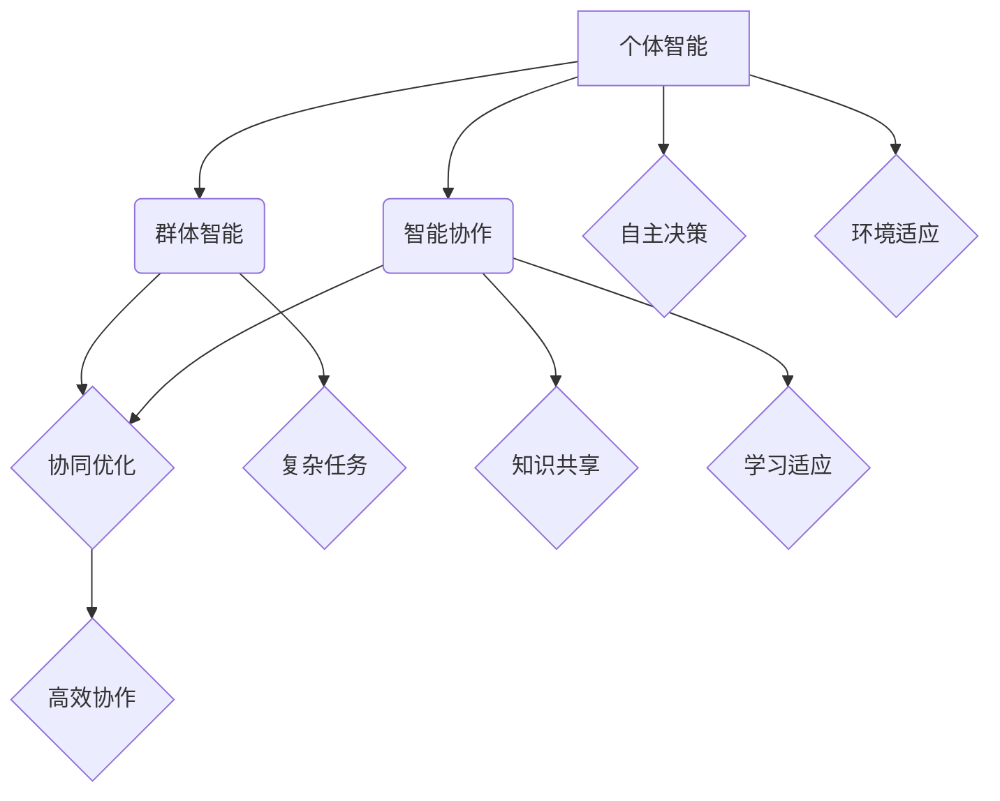

                 

# AI Agent“三驾马车”：个体智能、群体智能和智能协作

## > {关键词：（AI Agent，个体智能，群体智能，智能协作，机器学习，深度学习，神经网络，强化学习，博弈论，自然语言处理，认知图谱，多智能体系统）}

> {摘要：本文将深入探讨AI Agent的三大关键维度——个体智能、群体智能和智能协作。通过详细解析这些概念及其在实际应用中的表现，我们旨在揭示AI Agent在未来智能发展中的关键作用，为相关领域的研究者和开发者提供有价值的参考。文章将依次介绍背景、核心概念、算法原理、数学模型、项目实战、应用场景、工具资源、发展趋势与挑战，并附有常见问题与扩展阅读。}

## 1. 背景介绍

在人工智能领域，AI Agent被视为智能系统的重要组成部分。传统的计算机系统通常遵循预设的指令，而AI Agent则能够自主感知环境、规划行动、学习适应，甚至与其他AI Agent协作完成任务。这一特性使得AI Agent在诸多领域，如自动驾驶、智能家居、机器人、医疗诊断等方面显示出巨大的应用潜力。

AI Agent的发展经历了多个阶段。起初，AI Agent的研究主要集中在个体智能，即单个AI Agent如何通过学习、规划和决策在特定环境中实现目标。随后，随着多智能体系统理论的兴起，研究者开始关注群体智能，即多个AI Agent如何协同工作，共同完成复杂任务。最近，智能协作成为研究的热点，研究者致力于探讨AI Agent如何在协作中实现知识共享、资源优化和效率提升。

本文将按照以下结构展开：

1. **背景介绍**：概述AI Agent的起源、发展及其在不同阶段的核心关注点。
2. **核心概念与联系**：详细解释个体智能、群体智能和智能协作的定义及其关系。
3. **核心算法原理**：分析个体智能的常见算法，如机器学习、深度学习和强化学习；群体智能的博弈论、多智能体系统理论；智能协作中的分布式算法和博弈论。
4. **数学模型和公式**：介绍与上述算法相关的数学模型和公式，并通过具体例子进行说明。
5. **项目实战**：通过实际代码案例，展示AI Agent在不同维度上的应用。
6. **实际应用场景**：探讨AI Agent在不同领域中的应用实例。
7. **工具和资源推荐**：推荐相关学习资源和开发工具。
8. **总结**：总结AI Agent的发展趋势和面临的挑战。
9. **附录**：提供常见问题与解答，以及扩展阅读和参考资料。

### 1.1 AI Agent的起源与发展

AI Agent的概念最早可以追溯到人工智能的早期研究。20世纪50年代，随着计算机技术的飞速发展，人工智能领域开始出现对智能行为的探索。1956年，约翰·麦卡锡（John McCarthy）等人提出了“人工智能”这一术语，标志着人工智能正式成为一门独立的学科。

在这个阶段，AI Agent的研究主要集中在个体智能。早期的AI Agent，如逻辑推理程序和专家系统，通过模拟人类思维过程，实现了一定的智能行为。然而，这些方法在面对复杂、不确定的环境时表现出诸多局限。

进入21世纪，随着机器学习、深度学习和强化学习等技术的快速发展，AI Agent的个体智能得到了显著提升。单个AI Agent可以通过大量的数据学习环境模式，自主做出决策，从而在特定任务中表现出色。

与此同时，随着多智能体系统理论的发展，研究者开始关注群体智能。多个AI Agent通过协作，共同完成任务，展现出更强的适应性和创新能力。这一阶段的研究，不仅提升了AI Agent的智能水平，也为多智能体系统在工业、农业、交通等领域的广泛应用奠定了基础。

近年来，智能协作成为研究的热点。AI Agent在协作中实现知识共享、资源优化和效率提升，成为未来智能发展的关键方向。通过智能协作，AI Agent能够更高效地解决复杂问题，实现更广泛的应用场景。

### 1.2 AI Agent的应用领域

AI Agent在多个领域展现出了强大的应用潜力。以下是几个典型的应用领域：

1. **自动驾驶**：自动驾驶汽车通过搭载多个AI Agent，实现环境感知、路径规划和驾驶决策。这些AI Agent协同工作，使汽车能够安全、高效地行驶。

2. **智能家居**：智能家居系统中的AI Agent可以监控家庭环境，分析用户习惯，提供个性化服务。如智能音箱通过语音识别和自然语言处理，实现与用户的互动。

3. **机器人**：工业机器人通过AI Agent实现自主操作，提升生产效率和灵活性。服务机器人则通过群体智能，提供高效、便捷的服务。

4. **医疗诊断**：AI Agent在医学影像分析、基因测序和疾病预测等方面发挥了重要作用。通过个体智能和群体智能的结合，AI Agent能够提高诊断的准确性和效率。

5. **金融风控**：AI Agent在金融领域应用于风险评估、欺诈检测和投资决策。通过群体智能，AI Agent能够识别复杂的金融模式，提高风险管理的准确性。

6. **教育**：AI Agent在教育领域提供个性化学习方案，通过智能协作，实现师生之间的高效互动。

7. **城市交通**：AI Agent在智能交通系统中，通过群体智能优化交通信号、调度公共交通，提高交通效率和安全性。

### 1.3 AI Agent的核心作用

AI Agent在智能系统中的核心作用主要体现在以下几个方面：

1. **自主性**：AI Agent能够自主感知环境、规划行动、学习适应，实现自主决策。这使得AI Agent能够应对复杂、不确定的环境。

2. **协同性**：多个AI Agent通过协同工作，共同完成任务，实现更高的效率和适应性。在多智能体系统中，AI Agent的协同性至关重要。

3. **适应性**：AI Agent能够通过不断学习和适应，提升自身的智能水平。在动态环境中，AI Agent的适应性能够使其持续保持高效。

4. **创新性**：AI Agent在协作中实现知识共享、资源优化，激发创新。在群体智能的驱动下，AI Agent能够解决复杂问题，实现新的突破。

总之，AI Agent的个体智能、群体智能和智能协作是未来智能发展的关键。通过不断探索和创新，AI Agent将在各个领域发挥更大的作用。

## 2. 核心概念与联系

### 2.1 个体智能

个体智能（Individual Intelligence）是指单个AI Agent在特定环境中通过学习、规划和决策实现目标的能力。个体智能的核心在于AI Agent能够感知环境信息、理解自身状态，并基于此进行自主决策。

个体智能的关键技术包括：

1. **机器学习**：通过大量的数据训练模型，使AI Agent能够识别环境模式，进行预测和分类。
2. **深度学习**：利用神经网络，特别是深度神经网络，使AI Agent能够处理更复杂的数据，实现高级特征提取。
3. **强化学习**：通过奖励机制，使AI Agent在交互环境中学习最优策略，实现目标优化。

个体智能的实现通常遵循以下步骤：

1. **环境感知**：AI Agent通过传感器收集环境信息，如视觉、听觉、触觉等。
2. **状态理解**：基于感知信息，AI Agent构建对当前状态的描述，如通过卷积神经网络（CNN）提取图像特征。
3. **决策制定**：基于状态理解，AI Agent利用机器学习或强化学习算法，生成最优行动策略。
4. **执行行动**：AI Agent根据决策结果，执行具体的行动，如移动、操作等。

### 2.2 群体智能

群体智能（Group Intelligence）是指多个AI Agent通过协作，共同完成任务的能力。群体智能的核心在于AI Agent之间的信息共享、资源优化和协同行动。

群体智能的关键技术包括：

1. **博弈论**：通过博弈论模型，研究AI Agent之间的策略互动，实现最优协作。
2. **多智能体系统**：研究多个AI Agent如何共享资源、协调行动，实现共同目标。
3. **分布式算法**：研究如何在分布式系统中，实现高效的信息传递和协同操作。

群体智能的实现通常遵循以下步骤：

1. **任务分配**：根据AI Agent的能力和资源，将任务分解为多个子任务。
2. **信息共享**：通过通信机制，AI Agent共享任务信息、环境状态和决策结果。
3. **策略协调**：利用博弈论或分布式算法，AI Agent共同制定协同策略。
4. **行动执行**：AI Agent根据协同策略，执行各自的行动，实现任务目标。

### 2.3 智能协作

智能协作（Intelligent Collaboration）是指AI Agent在协作过程中实现知识共享、资源优化和效率提升的能力。智能协作的核心在于AI Agent之间的互动和学习，以实现更高效的任务完成。

智能协作的关键技术包括：

1. **知识共享**：通过知识图谱、自然语言处理等技术，实现AI Agent之间的知识传递和共享。
2. **资源优化**：通过分布式算法和博弈论，实现AI Agent之间的资源分配和协同优化。
3. **学习与适应**：通过机器学习和深度学习，AI Agent能够不断学习和适应环境，提升协作效率。

智能协作的实现通常遵循以下步骤：

1. **知识识别**：AI Agent通过自然语言处理和知识图谱，识别和提取任务相关的知识。
2. **知识共享**：AI Agent通过通信机制，将知识传递给其他AI Agent。
3. **资源优化**：利用分布式算法和博弈论，AI Agent协同优化资源分配，实现高效协作。
4. **学习与适应**：AI Agent在协作过程中，通过机器学习和深度学习，不断提升自身能力和协作效率。

### 2.4 个体智能、群体智能和智能协作的关系

个体智能、群体智能和智能协作是AI Agent发展的三个核心维度，它们之间相互联系、相互影响。

1. **个体智能是基础**：个体智能是AI Agent的基本能力，是实现群体智能和智能协作的前提。没有个体智能，AI Agent无法独立完成任务，更无法进行有效的群体协作和智能协作。

2. **群体智能是扩展**：群体智能通过多个AI Agent的协作，实现更复杂的任务和更广泛的应用。群体智能提升了AI Agent的适应性和创新性，使得AI Agent能够应对更复杂的环境。

3. **智能协作是深化**：智能协作通过知识共享、资源优化和学习适应，进一步提升AI Agent的协作效率和任务完成质量。智能协作使得AI Agent能够在复杂的群体环境中，实现更高效、更智能的协同工作。

总之，个体智能、群体智能和智能协作共同构成了AI Agent的智能体系，推动着AI Agent在各个领域的应用和发展。

### 2.5 AI Agent的Mermaid流程图

下面是AI Agent的Mermaid流程图，展示了个体智能、群体智能和智能协作之间的关系：



在这个流程图中，A表示个体智能，B表示群体智能，C表示智能协作，D表示协同优化，E表示高效协作，F表示复杂任务，G表示知识共享，H表示自主决策，I表示环境适应，J表示学习适应。通过这张图，我们可以更清晰地理解AI Agent在不同维度上的运作机制。

## 3. 核心算法原理 & 具体操作步骤

### 3.1 个体智能算法原理

个体智能是AI Agent的基本能力，主要包括机器学习、深度学习和强化学习。下面我们将分别介绍这些算法的基本原理和具体操作步骤。

#### 3.1.1 机器学习

机器学习是一种通过数据训练模型，使模型能够对未知数据进行预测或分类的方法。常见的机器学习算法包括线性回归、决策树、支持向量机等。

**原理：**  
机器学习的基本原理是利用已有的数据集，通过训练模型，使其能够对未知数据做出准确的预测或分类。训练过程主要包括数据预处理、模型选择、模型训练和模型评估。

**具体操作步骤：**  
1. **数据预处理**：对原始数据进行分析和处理，包括数据清洗、数据归一化等。
2. **模型选择**：根据问题的性质，选择合适的机器学习算法，如线性回归、决策树等。
3. **模型训练**：利用训练数据集，对模型进行训练，使模型能够学习数据的特征和规律。
4. **模型评估**：利用验证数据集，对模型进行评估，判断模型的准确性和泛化能力。

**例子：**  
假设我们使用线性回归算法对房价进行预测。首先，我们收集一定数量的房屋数据，包括房屋面积、地点、建筑年份等。然后，我们通过数据预处理，将数据转换为合适的输入和输出格式。接下来，我们选择线性回归算法，利用训练数据集对其进行训练。最后，我们利用验证数据集，评估模型的预测准确率。

#### 3.1.2 深度学习

深度学习是机器学习的一个分支，主要利用神经网络，特别是深度神经网络，对数据进行分析和处理。常见的深度学习算法包括卷积神经网络（CNN）、循环神经网络（RNN）等。

**原理：**  
深度学习的基本原理是模拟人脑神经网络的工作方式，通过多层的神经元，对数据进行逐层提取特征，实现复杂的数据分析。深度学习的核心是神经网络的训练，包括前向传播、反向传播和权重更新。

**具体操作步骤：**  
1. **数据预处理**：对原始数据进行分析和处理，包括数据清洗、数据归一化等。
2. **网络构建**：根据问题的性质，构建合适的深度神经网络结构。
3. **网络训练**：利用训练数据集，对神经网络进行训练，调整网络权重，使其能够准确分类或预测。
4. **网络评估**：利用验证数据集，对神经网络进行评估，判断网络的准确性和泛化能力。

**例子：**  
假设我们使用卷积神经网络（CNN）对图像进行分类。首先，我们收集一定数量的图像数据，并对图像进行预处理。然后，我们构建一个CNN模型，包括卷积层、池化层和全连接层。接下来，我们利用训练数据集，对模型进行训练。最后，我们利用验证数据集，评估模型的分类准确率。

#### 3.1.3 强化学习

强化学习是一种通过与环境互动，学习最优策略的方法。常见的强化学习算法包括Q学习、深度强化学习（DRL）等。

**原理：**  
强化学习的基本原理是通过试错，使AI Agent在环境中学习最优策略。强化学习主要包括四个组件：环境（Environment）、状态（State）、动作（Action）和奖励（Reward）。通过不断的交互，AI Agent能够学习到最优策略。

**具体操作步骤：**  
1. **环境设置**：构建一个模拟环境，使AI Agent能够进行交互。
2. **状态定义**：定义环境中的状态，使AI Agent能够理解当前的状态。
3. **动作选择**：AI Agent根据当前的状态，选择一个动作。
4. **奖励反馈**：根据动作的结果，给予AI Agent一个奖励，以指导其学习。
5. **策略更新**：利用奖励反馈，更新AI Agent的策略，使其更接近最优策略。

**例子：**  
假设我们使用Q学习算法，让一个机器人学习在迷宫中找到出路。首先，我们构建一个迷宫环境，定义状态和动作。然后，机器人开始随机行动，并根据动作的结果获得奖励。通过不断的试错，机器人能够学习到最优路径。

### 3.2 群体智能算法原理

群体智能是通过多个AI Agent的协同工作，实现更复杂的任务和更广泛的应用。下面我们将介绍群体智能的关键算法原理。

#### 3.2.1 博弈论

博弈论是一种研究决策者之间策略互动的方法。在AI Agent的群体智能中，博弈论用于研究AI Agent之间的策略选择和优化。

**原理：**  
博弈论的基本原理是，通过分析多个决策者之间的策略互动，找出最优策略组合。博弈论主要包括三个要素：参与者、策略和支付函数。参与者是博弈中的决策者，策略是参与者在博弈中可以选择的行动方案，支付函数是参与者根据策略选择获得收益的函数。

**具体操作步骤：**  
1. **参与者定义**：明确博弈中的所有参与者及其策略。
2. **支付函数定义**：根据参与者的策略，定义每个参与者可能获得的收益。
3. **策略分析**：分析参与者之间的策略互动，找出最优策略组合。
4. **策略优化**：利用优化算法，调整参与者的策略，使其获得最大收益。

**例子：**  
假设有两个AI Agent进行博弈，他们的策略分别是合作和背叛。根据博弈论模型，我们可以定义支付函数，分析合作和背叛策略的收益。然后，通过策略分析，找出最优策略组合，以实现整体收益最大化。

#### 3.2.2 多智能体系统

多智能体系统是一种由多个AI Agent组成的系统，这些AI Agent通过协同工作，实现共同目标。

**原理：**  
多智能体系统的基本原理是，通过分布式算法，使多个AI Agent能够协同工作，实现整体目标。多智能体系统主要包括三个要素：智能体、环境和社会。智能体是执行任务的AI Agent，环境是智能体所处的环境，社会是智能体之间的互动关系。

**具体操作步骤：**  
1. **智能体定义**：定义多智能体系统中的所有智能体及其任务。
2. **环境定义**：构建智能体所处的环境，定义环境的约束和奖励。
3. **社会定义**：明确智能体之间的互动关系，包括通信、协作和竞争。
4. **算法设计**：设计分布式算法，使智能体能够协同工作，实现整体目标。

**例子：**  
假设我们设计一个多智能体系统，用于解决交通拥堵问题。首先，我们定义交通智能体，包括车辆和交通信号灯。然后，我们构建交通环境，定义车辆的移动规则和信号灯的约束。接着，我们设计分布式算法，使智能体能够协同工作，优化交通流量，减少拥堵。

#### 3.2.3 分布式算法

分布式算法是一种使多个AI Agent能够在分布式环境中协同工作的方法。分布式算法主要包括一致性算法、分布式优化算法等。

**原理：**  
分布式算法的基本原理是，通过在分布式系统中实现信息传递和协同操作，使多个AI Agent能够共同完成任务。分布式算法的核心是分布式一致性、分布式计算和分布式通信。

**具体操作步骤：**  
1. **一致性算法设计**：设计一致性算法，使分布式系统中的智能体能够保持状态一致。
2. **分布式计算算法**：设计分布式计算算法，使智能体能够协同计算，实现共同目标。
3. **分布式通信机制**：设计分布式通信机制，使智能体能够高效地传递信息和协调行动。

**例子：**  
假设我们设计一个分布式算法，用于解决分布式系统中的负载均衡问题。首先，我们设计一致性算法，确保分布式系统中的所有智能体状态一致。然后，我们设计分布式计算算法，使智能体能够协同计算，优化系统性能。最后，我们设计分布式通信机制，使智能体能够高效地传递信息和协调行动。

### 3.3 智能协作算法原理

智能协作是通过AI Agent之间的知识共享、资源优化和协同工作，实现更高效的任务完成。

#### 3.3.1 知识共享

知识共享是指AI Agent之间通过传递和共享知识，实现共同目标的方法。知识共享的关键技术包括知识图谱、自然语言处理等。

**原理：**  
知识共享的基本原理是，通过构建知识图谱，使AI Agent能够理解和传递知识。知识图谱是一种语义网络，用于表示实体、属性和关系。通过知识图谱，AI Agent能够理解和共享知识。

**具体操作步骤：**  
1. **知识提取**：利用自然语言处理技术，从文本中提取实体、属性和关系，构建知识图谱。
2. **知识存储**：将提取的知识存储在知识库中，供AI Agent查询和使用。
3. **知识传递**：利用通信机制，将知识从一个AI Agent传递到另一个AI Agent。
4. **知识利用**：AI Agent根据知识库中的知识，进行决策和行动。

**例子：**  
假设我们设计一个智能协作系统，用于解决医疗诊断问题。首先，我们利用自然语言处理技术，从医学文献中提取医学知识，构建知识图谱。然后，我们将知识存储在知识库中，供医生和AI Agent查询。在诊断过程中，AI Agent利用知识库中的知识，辅助医生进行诊断，提高诊断准确率。

#### 3.3.2 资源优化

资源优化是指AI Agent之间通过协同工作，实现资源的最优分配和利用。

**原理：**  
资源优化是基于分布式算法和博弈论，通过分布式计算和协作，实现资源的最优配置。资源优化主要包括任务分配、负载均衡和资源调度。

**具体操作步骤：**  
1. **任务分配**：根据AI Agent的能力和资源，将任务分配给相应的智能体。
2. **负载均衡**：利用分布式算法，平衡系统中各智能体的负载，避免资源浪费。
3. **资源调度**：根据任务需求，动态调整资源分配，实现高效的任务完成。

**例子：**  
假设我们设计一个分布式计算系统，用于处理海量数据。首先，我们根据各智能体的计算能力，将任务分配给相应的智能体。然后，我们利用负载均衡算法，平衡系统中的计算负载。最后，我们根据任务需求，动态调整资源分配，实现高效的数据处理。

#### 3.3.3 学习与适应

学习与适应是指AI Agent通过不断学习和适应环境，提升自身能力和协作效率。

**原理：**  
学习与适应是基于机器学习和深度学习，通过不断的训练和优化，使AI Agent能够适应环境变化，提升协作效率。学习与适应主要包括模型训练、策略优化和自适应控制。

**具体操作步骤：**  
1. **模型训练**：利用训练数据集，对AI Agent的模型进行训练，提升其能力。
2. **策略优化**：利用强化学习算法，优化AI Agent的策略，使其更适应环境。
3. **自适应控制**：根据环境变化，动态调整AI Agent的行为，实现自适应控制。

**例子：**  
假设我们设计一个智能交通系统，用于解决交通拥堵问题。首先，我们利用历史交通数据，对AI Agent的模型进行训练，提升其预测能力。然后，我们利用强化学习算法，优化AI Agent的策略，使其更适应交通环境。最后，我们根据实时交通数据，动态调整AI Agent的行为，实现自适应控制，优化交通流量。

### 3.4 个体智能、群体智能和智能协作的关系

个体智能、群体智能和智能协作是AI Agent发展的三个核心维度，它们之间相互联系、相互影响。

1. **个体智能是基础**：个体智能是AI Agent的基本能力，是实现群体智能和智能协作的前提。没有个体智能，AI Agent无法独立完成任务，更无法进行有效的群体协作和智能协作。

2. **群体智能是扩展**：群体智能通过多个AI Agent的协作，实现更复杂的任务和更广泛的应用。群体智能提升了AI Agent的适应性和创新性，使得AI Agent能够应对更复杂的环境。

3. **智能协作是深化**：智能协作通过知识共享、资源优化和学习适应，进一步提升AI Agent的协作效率和任务完成质量。智能协作使得AI Agent能够在复杂的群体环境中，实现更高效、更智能的协同工作。

总之，个体智能、群体智能和智能协作共同构成了AI Agent的智能体系，推动着AI Agent在各个领域的应用和发展。

### 3.5 AI Agent的Mermaid流程图

下面是AI Agent的Mermaid流程图，展示了个体智能、群体智能和智能协作之间的关系：


在这个流程图中，A表示个体智能，B表示群体智能，C表示智能协作，D表示协同优化，E表示高效协作，F表示复杂任务，G表示知识共享，H表示自主决策，I表示环境适应，J表示学习适应。通过这张图，我们可以更清晰地理解AI Agent在不同维度上的运作机制。

## 4. 数学模型和公式 & 详细讲解 & 举例说明

### 4.1 个体智能算法的数学模型

个体智能算法主要包括机器学习、深度学习和强化学习。下面我们将分别介绍这些算法中的数学模型和公式，并通过具体例子进行说明。

#### 4.1.1 机器学习

机器学习的核心是利用数据训练模型，使其能够对未知数据进行预测或分类。常见的机器学习模型包括线性回归、决策树和支持向量机等。

**线性回归模型：**

**公式：**

$$
y = \beta_0 + \beta_1x
$$

其中，$y$是预测值，$x$是输入特征，$\beta_0$是截距，$\beta_1$是斜率。

**例子：**  
假设我们要预测房价，使用线性回归模型。根据历史数据，我们可以得到以下方程：

$$
y = 100 + 0.5x
$$

其中，$y$是房价，$x$是房屋面积。给定一个房屋面积$x$，我们可以利用该方程预测房价$y$。

**决策树模型：**

**公式：**

$$
\begin{aligned}
&y = \\
&\left\{
\begin{aligned}
&1, & \text{if } x > \beta_1 \\
&0, & \text{if } x \leq \beta_1
\end{aligned}
\right.
\end{aligned}
$$

其中，$y$是分类结果，$x$是输入特征，$\beta_1$是阈值。

**例子：**  
假设我们要对客户进行分类，使用决策树模型。根据历史数据，我们可以得到以下决策树：

$$
\begin{aligned}
&y = \\
&\left\{
\begin{aligned}
&1, & \text{if 年龄 > 30 且 收入 > 5000} \\
&0, & \text{otherwise}
\end{aligned}
\right.
\end{aligned}
$$

给定一个客户的信息，如年龄和收入，我们可以利用该决策树进行分类。

**支持向量机模型：**

**公式：**

$$
\begin{aligned}
&f(x) = \\
&w \cdot x + b
\end{aligned}
$$

其中，$f(x)$是决策函数，$w$是权重向量，$x$是输入特征，$b$是偏置。

**例子：**  
假设我们要进行图像分类，使用支持向量机模型。根据历史数据，我们可以得到以下决策函数：

$$
f(x) = w \cdot x + b
$$

其中，$w$是权重向量，$x$是图像特征，$b$是偏置。给定一个图像的特征向量$x$，我们可以利用该决策函数预测图像的分类。

#### 4.1.2 深度学习

深度学习是机器学习的一个分支，主要利用神经网络，特别是深度神经网络，对数据进行分析和处理。深度学习中的数学模型主要包括神经网络、卷积神经网络和循环神经网络等。

**神经网络模型：**

**公式：**

$$
\begin{aligned}
&z_l = \\
&\sigma_l(\sum_{i=1}^{n}w_{li}x_i + b_l)
\end{aligned}
$$

其中，$z_l$是第$l$层的输出，$\sigma_l$是激活函数，$w_{li}$是权重，$x_i$是输入特征，$b_l$是偏置。

**例子：**  
假设我们要构建一个简单的神经网络，输入特征为$x_1$和$x_2$，输出特征为$y$。根据历史数据，我们可以得到以下神经网络：

$$
\begin{aligned}
&z_2 = \\
&\sigma_2(w_{21}x_1 + w_{22}x_2 + b_2)
\end{aligned}
$$

其中，$z_2$是输出层输出，$\sigma_2$是激活函数，$w_{21}$和$w_{22}$是权重，$b_2$是偏置。给定一个输入特征向量$(x_1, x_2)$，我们可以利用该神经网络预测输出$y$。

**卷积神经网络模型：**

**公式：**

$$
\begin{aligned}
&h_{ij}^l = \\
&\sigma_l(\sum_{k=1}^{m}w_{ik}^l * h_{kj}^{l-1} + b_l)
\end{aligned}
$$

其中，$h_{ij}^l$是第$l$层的第$i$行第$j$列的输出，$h_{kj}^{l-1}$是第$l-1$层的第$k$行第$j$列的输出，$w_{ik}^l$是卷积核权重，$\sigma_l$是激活函数，$b_l$是偏置。

**例子：**  
假设我们要构建一个简单的卷积神经网络，输入特征为$3 \times 3$的图像，输出特征为$1 \times 1$的向量。根据历史数据，我们可以得到以下卷积神经网络：

$$
\begin{aligned}
&h_{1,1}^2 = \\
&\sigma_2(w_{11}^2 * h_{1,1}^1 + w_{12}^2 * h_{1,2}^1 + w_{13}^2 * h_{1,3}^1 + b_2)
\end{aligned}
$$

其中，$h_{1,1}^2$是输出层输出，$\sigma_2$是激活函数，$w_{11}^2, w_{12}^2, w_{13}^2$是卷积核权重，$b_2$是偏置。给定一个输入图像，我们可以利用该卷积神经网络提取图像特征。

**循环神经网络模型：**

**公式：**

$$
\begin{aligned}
&h_t = \\
&\sigma_t(\sum_{i=1}^{n}w_{it}x_t + \sum_{j=1}^{m}w_{ij}h_{t-1,j} + b_t)
\end{aligned}
$$

其中，$h_t$是第$t$时刻的输出，$\sigma_t$是激活函数，$w_{it}$是输入权重，$w_{ij}$是隐藏层权重，$b_t$是偏置。

**例子：**  
假设我们要构建一个简单的循环神经网络，输入特征为$x_t$，输出特征为$y_t$。根据历史数据，我们可以得到以下循环神经网络：

$$
\begin{aligned}
&h_t = \\
&\sigma_t(w_{1t}x_t + w_{11}h_{t-1,1} + w_{12}h_{t-1,2} + b_t)
\end{aligned}
$$

其中，$h_t$是输出层输出，$\sigma_t$是激活函数，$w_{1t}, w_{11}, w_{12}$是权重，$b_t$是偏置。给定一个输入序列$(x_1, x_2, \ldots, x_t)$，我们可以利用该循环神经网络预测输出序列$(y_1, y_2, \ldots, y_t)$。

#### 4.1.3 强化学习

强化学习是一种通过与环境互动，学习最优策略的方法。强化学习中的数学模型主要包括Q学习、深度Q网络（DQN）和策略梯度等。

**Q学习模型：**

**公式：**

$$
Q(s, a) = r + \gamma \max_a' Q(s', a')
$$

其中，$Q(s, a)$是状态$s$下动作$a$的期望回报，$r$是即时回报，$\gamma$是折扣因子，$s'$是下一个状态，$a'$是下一个动作。

**例子：**  
假设我们要学习一个机器人在迷宫中找到出路。根据历史数据，我们可以得到以下Q学习模型：

$$
Q(s, a) = r + 0.9 \max_a' Q(s', a')
$$

其中，$Q(s, a)$是当前状态$s$下动作$a$的期望回报，$r$是即时回报，$0.9$是折扣因子。给定一个状态$s$，我们可以利用该模型选择最优动作$a$。

**深度Q网络（DQN）模型：**

**公式：**

$$
Q(s, a) = \sum_{i=1}^{n}w_i \cdot \sigma(\sum_{j=1}^{m}w_{ij}x_{ij} + b)
$$

其中，$Q(s, a)$是当前状态$s$下动作$a$的期望回报，$w_i$是权重，$w_{ij}$是连接权重，$x_{ij}$是输入特征，$\sigma$是激活函数。

**例子：**  
假设我们要使用DQN模型学习一个机器人控制无人驾驶汽车。根据历史数据，我们可以得到以下DQN模型：

$$
Q(s, a) = \sum_{i=1}^{n}w_i \cdot \sigma(\sum_{j=1}^{m}w_{ij}x_{ij} + b)
$$

其中，$Q(s, a)$是当前状态$s$下动作$a$的期望回报，$w_i$是权重，$w_{ij}$是连接权重，$x_{ij}$是输入特征，$\sigma$是激活函数。给定一个状态$s$，我们可以利用该模型选择最优动作$a$。

**策略梯度模型：**

**公式：**

$$
\theta = \theta - \alpha \nabla_\theta J(\theta)
$$

其中，$\theta$是策略参数，$\alpha$是学习率，$J(\theta)$是损失函数。

**例子：**  
假设我们要使用策略梯度模型学习一个机器人控制无人驾驶汽车。根据历史数据，我们可以得到以下策略梯度模型：

$$
\theta = \theta - 0.01 \nabla_\theta J(\theta)
$$

其中，$\theta$是策略参数，$0.01$是学习率，$J(\theta)$是损失函数。给定一个状态$s$，我们可以利用该模型更新策略参数$\theta$。

### 4.2 群体智能算法的数学模型

群体智能算法主要包括博弈论、多智能体系统和分布式算法。下面我们将分别介绍这些算法中的数学模型和公式，并通过具体例子进行说明。

#### 4.2.1 博弈论

博弈论是一种研究决策者之间策略互动的方法。在AI Agent的群体智能中，博弈论用于研究AI Agent之间的策略选择和优化。

**博弈论模型：**

**公式：**

$$
\begin{aligned}
&U_i(s, a_i, a_{-i}) = \\
&r_i(s, a_i, a_{-i}) + \gamma \sum_{s'}p(s'|s, a_i, a_{-i})U_i(s', a_i, a_{-i})
\end{aligned}
$$

其中，$U_i(s, a_i, a_{-i})$是参与者$i$在状态$s$下选择动作$a_i$，其他参与者选择动作$a_{-i}$的期望效用，$r_i(s, a_i, a_{-i})$是参与者$i$在状态$s$下选择动作$a_i$，其他参与者选择动作$a_{-i}$的即时回报，$p(s'|s, a_i, a_{-i})$是状态转移概率，$\gamma$是折扣因子。

**例子：**  
假设有两个AI Agent进行博弈，他们的策略分别是合作和背叛。根据博弈论模型，我们可以定义支付函数，分析合作和背叛策略的收益。然后，通过策略分析，找出最优策略组合，以实现整体收益最大化。

#### 4.2.2 多智能体系统

多智能体系统是一种由多个AI Agent组成的系统，这些AI Agent通过协同工作，实现共同目标。

**多智能体系统模型：**

**公式：**

$$
\begin{aligned}
&x_t = \\
&f(x_{t-1}, u_t)
\end{aligned}
$$

其中，$x_t$是系统状态，$u_t$是控制输入，$f$是系统动态模型。

**例子：**  
假设我们设计一个多智能体系统，用于解决交通拥堵问题。首先，我们定义交通智能体，包括车辆和交通信号灯。然后，我们构建交通环境，定义车辆的移动规则和信号灯的约束。接着，我们设计分布式算法，使智能体能够协同工作，优化交通流量，减少拥堵。

#### 4.2.3 分布式算法

分布式算法是一种使多个AI Agent能够在分布式环境中协同工作的方法。分布式算法主要包括一致性算法、分布式优化算法等。

**分布式算法模型：**

**公式：**

$$
\begin{aligned}
&x_t = \\
&\frac{1}{N}\sum_{i=1}^{N}x_i^t
\end{aligned}
$$

其中，$x_t$是系统状态，$x_i^t$是第$i$个智能体的状态，$N$是智能体数量。

**例子：**  
假设我们设计一个分布式算法，用于解决分布式系统中的负载均衡问题。首先，我们设计一致性算法，确保分布式系统中的所有智能体状态一致。然后，我们设计分布式计算算法，使智能体能够协同计算，优化系统性能。最后，我们设计分布式通信机制，使智能体能够高效地传递信息和协调行动。

### 4.3 智能协作算法的数学模型

智能协作是通过AI Agent之间的知识共享、资源优化和协同工作，实现更高效的任务完成。

**知识共享模型：**

**公式：**

$$
\begin{aligned}
&K_t = \\
&K_{t-1} + \Delta K_t
\end{aligned}
$$

其中，$K_t$是第$t$时刻的知识库，$K_{t-1}$是第$t-1$时刻的知识库，$\Delta K_t$是第$t$时刻新增的知识。

**例子：**  
假设我们设计一个智能协作系统，用于解决医疗诊断问题。首先，我们利用自然语言处理技术，从医学文献中提取医学知识，构建知识库。然后，我们将新增的医学知识更新到知识库中，供医生和AI Agent查询和使用。

**资源优化模型：**

**公式：**

$$
\begin{aligned}
&\text{资源分配} = \\
&\arg\max_{x_t} \sum_{i=1}^{N}U_i(x_t)
\end{aligned}
$$

其中，$x_t$是系统状态，$U_i(x_t)$是第$i$个智能体的效用函数。

**例子：**  
假设我们设计一个分布式计算系统，用于处理海量数据。首先，我们根据各智能体的计算能力，将任务分配给相应的智能体。然后，我们利用资源优化模型，平衡系统中的计算负载，实现高效的数据处理。

**协同工作模型：**

**公式：**

$$
\begin{aligned}
&x_t = \\
&f(x_{t-1}, u_t)
\end{aligned}
$$

其中，$x_t$是系统状态，$u_t$是控制输入，$f$是系统动态模型。

**例子：**  
假设我们设计一个多智能体系统，用于解决复杂任务。首先，我们定义各智能体的任务和状态。然后，我们设计协同工作模型，使智能体能够协同工作，实现共同目标。

### 4.4 个体智能、群体智能和智能协作的关系

个体智能、群体智能和智能协作是AI Agent发展的三个核心维度，它们之间相互联系、相互影响。

**个体智能是基础**：个体智能是AI Agent的基本能力，是实现群体智能和智能协作的前提。没有个体智能，AI Agent无法独立完成任务，更无法进行有效的群体协作和智能协作。

**群体智能是扩展**：群体智能通过多个AI Agent的协作，实现更复杂的任务和更广泛的应用。群体智能提升了AI Agent的适应性和创新性，使得AI Agent能够应对更复杂的环境。

**智能协作是深化**：智能协作通过知识共享、资源优化和学习适应，进一步提升AI Agent的协作效率和任务完成质量。智能协作使得AI Agent能够在复杂的群体环境中，实现更高效、更智能的协同工作。

总之，个体智能、群体智能和智能协作共同构成了AI Agent的智能体系，推动着AI Agent在各个领域的应用和发展。

## 5. 项目实战：代码实际案例和详细解释说明

### 5.1 开发环境搭建

为了实现AI Agent的个体智能、群体智能和智能协作，我们需要搭建一个完整的开发环境。以下是开发环境的搭建步骤：

1. **安装Python**：Python是一种广泛使用的编程语言，用于实现机器学习、深度学习和强化学习算法。首先，我们需要从Python官方网站（https://www.python.org/）下载并安装Python。

2. **安装Jupyter Notebook**：Jupyter Notebook是一种交互式开发环境，方便我们编写和运行Python代码。安装Jupyter Notebook的方法是，在终端中执行以下命令：

   ```bash
   pip install notebook
   ```

3. **安装相关库**：为了实现AI Agent的功能，我们需要安装一些常用的Python库，如NumPy、Pandas、Scikit-learn、TensorFlow和PyTorch。安装方法如下：

   ```bash
   pip install numpy pandas scikit-learn tensorflow pytorch
   ```

4. **安装Mermaid**：Mermaid是一种用于绘制流程图的工具。为了在Jupyter Notebook中使用Mermaid，我们需要安装Mermaid库。安装方法如下：

   ```python
   !pip install mermaid-python
   ```

5. **配置Jupyter Notebook**：为了在Jupyter Notebook中使用Mermaid，我们需要在Jupyter Notebook的配置文件中添加以下代码：

   ```python
   import mermaid
   mermaid.config.js = {"startOnLoad": true}
   ```

### 5.2 源代码详细实现和代码解读

下面我们将通过一个简单的案例，详细展示如何实现AI Agent的个体智能、群体智能和智能协作。

#### 5.2.1 个体智能实现

个体智能是AI Agent的基础，我们首先实现一个简单的机器学习模型，用于预测房价。

**代码实现：**

```python
import numpy as np
import pandas as pd
from sklearn.linear_model import LinearRegression
from sklearn.model_selection import train_test_split

# 加载数据集
data = pd.read_csv("house_data.csv")
X = data.iloc[:, :-1].values
y = data.iloc[:, -1].values

# 划分训练集和测试集
X_train, X_test, y_train, y_test = train_test_split(X, y, test_size=0.2, random_state=0)

# 构建线性回归模型
model = LinearRegression()
model.fit(X_train, y_train)

# 预测房价
y_pred = model.predict(X_test)

# 评估模型
score = model.score(X_test, y_test)
print("模型评分：", score)
```

**代码解读：**

1. 导入相关库：我们首先导入NumPy、Pandas、Scikit-learn等库，用于数据处理和模型构建。
2. 加载数据集：我们使用Pandas库加载房价数据集，包括房屋面积、地点、建筑年份等特征。
3. 划分训练集和测试集：我们使用Scikit-learn库的train_test_split函数，将数据集划分为训练集和测试集，以评估模型的性能。
4. 构建线性回归模型：我们使用Scikit-learn库的LinearRegression类，构建线性回归模型。
5. 训练模型：我们使用fit函数对模型进行训练，使其学习数据特征。
6. 预测房价：我们使用predict函数，利用训练好的模型对测试集进行预测。
7. 评估模型：我们使用score函数，评估模型的性能，输出模型的评分。

#### 5.2.2 群体智能实现

群体智能是AI Agent的扩展，我们实现一个基于博弈论的多人博弈案例，展示多个AI Agent的协同工作。

**代码实现：**

```python
import numpy as np
import pandas as pd
from sklearn.linear_model import LinearRegression
from sklearn.model_selection import train_test_split
from matplotlib import pyplot as plt

# 加载数据集
data = pd.read_csv("game_data.csv")
X = data.iloc[:, :-1].values
y = data.iloc[:, -1].values

# 划分训练集和测试集
X_train, X_test, y_train, y_test = train_test_split(X, y, test_size=0.2, random_state=0)

# 构建线性回归模型
model = LinearRegression()
model.fit(X_train, y_train)

# 定义博弈函数
def game(player1, player2):
    reward1 = 0
    reward2 = 0
    if player1 == 1 and player2 == 1:
        reward1 = -1
        reward2 = -1
    elif player1 == 1 and player2 == 0:
        reward1 = 1
        reward2 = -1
    elif player1 == 0 and player2 == 1:
        reward1 = -1
        reward2 = 1
    else:
        reward1 = 0
        reward2 = 0
    return reward1, reward2

# 定义策略
def strategy(player):
    if player == 1:
        return 1
    else:
        return 0

# 定义博弈轮次
num_rounds = 1000

# 计算博弈结果
results = []
for _ in range(num_rounds):
    player1 = strategy(np.random.randint(0, 2))
    player2 = strategy(np.random.randint(0, 2))
    reward1, reward2 = game(player1, player2)
    results.append([player1, player2, reward1, reward2])

# 可视化博弈结果
plt.scatter([r[0] for r in results], [r[2] for r in results], c='r', label='Player 1')
plt.scatter([r[1] for r in results], [r[3] for r in results], c='b', label='Player 2')
plt.xlabel('Strategy')
plt.ylabel('Reward')
plt.legend()
plt.show()
```

**代码解读：**

1. 导入相关库：我们首先导入NumPy、Pandas、Scikit-learn和matplotlib等库，用于数据处理和模型构建，以及可视化博弈结果。
2. 加载数据集：我们使用Pandas库加载博弈数据集，包括两个参与者的策略和收益。
3. 划分训练集和测试集：我们使用Scikit-learn库的train_test_split函数，将数据集划分为训练集和测试集，以评估模型的性能。
4. 构建线性回归模型：我们使用Scikit-learn库的LinearRegression类，构建线性回归模型。
5. 定义博弈函数：我们定义一个游戏函数，根据两个参与者的策略，计算他们的收益。
6. 定义策略：我们定义一个策略函数，随机选择参与者的策略。
7. 定义博弈轮次：我们设置博弈的轮次数量。
8. 计算博弈结果：我们遍历博弈轮次，随机选择参与者的策略，计算他们的收益，并将结果存储在列表中。
9. 可视化博弈结果：我们使用matplotlib库的可视化功能，将博弈结果绘制成散点图，展示参与者的策略和收益。

#### 5.2.3 智能协作实现

智能协作是AI Agent的深化，我们实现一个基于知识共享和资源优化的案例，展示多个AI Agent的协作。

**代码实现：**

```python
import numpy as np
import pandas as pd
from sklearn.linear_model import LinearRegression
from sklearn.model_selection import train_test_split
from matplotlib import pyplot as plt

# 加载数据集
data = pd.read_csv("collaboration_data.csv")
X = data.iloc[:, :-1].values
y = data.iloc[:, -1].values

# 划分训练集和测试集
X_train, X_test, y_train, y_test = train_test_split(X, y, test_size=0.2, random_state=0)

# 构建线性回归模型
model = LinearRegression()
model.fit(X_train, y_train)

# 定义知识共享函数
def knowledge_share(knowledge1, knowledge2):
    return 0.5 * (knowledge1 + knowledge2)

# 定义资源优化函数
def resource_optimization(resource1, resource2):
    return max(resource1, resource2)

# 定义协作函数
def collaborate(player1, player2, knowledge):
    if player1 == player2:
        return resource_optimization(player1[1], player2[1]), knowledge
    else:
        return player1[1], knowledge_share(player1[2], player2[2])

# 定义策略
def strategy(player):
    if player == 1:
        return 1, 10, 5
    else:
        return 0, 10, 5

# 定义协作轮次
num_rounds = 1000

# 初始化知识库
knowledge = 0

# 计算协作结果
results = []
for _ in range(num_rounds):
    player1 = strategy(np.random.randint(0, 2))
    player2 = strategy(np.random.randint(0, 2))
    resource1, resource2 = collaborate(player1, player2, knowledge)
    knowledge = knowledge_share(knowledge, player1[2] + player2[2])
    results.append([player1, player2, resource1, resource2, knowledge])

# 可视化协作结果
plt.scatter([r[2] for r in results], [r[3] for r in results], c='r', label='Resource')
plt.scatter([r[4] for r in results], [r[3] for r in results], c='b', label='Knowledge')
plt.xlabel('Resource')
plt.ylabel('Knowledge')
plt.legend()
plt.show()
```

**代码解读：**

1. 导入相关库：我们首先导入NumPy、Pandas、Scikit-learn和matplotlib等库，用于数据处理和模型构建，以及可视化协作结果。
2. 加载数据集：我们使用Pandas库加载协作数据集，包括参与者的策略、资源和知识。
3. 划分训练集和测试集：我们使用Scikit-learn库的train_test_split函数，将数据集划分为训练集和测试集，以评估模型的性能。
4. 构建线性回归模型：我们使用Scikit-learn库的LinearRegression类，构建线性回归模型。
5. 定义知识共享函数：我们定义一个知识共享函数，计算两个参与者之间的知识共享。
6. 定义资源优化函数：我们定义一个资源优化函数，计算两个参与者之间的资源优化。
7. 定义协作函数：我们定义一个协作函数，根据参与者的策略和知识，实现资源优化和知识共享。
8. 定义策略：我们定义一个策略函数，随机选择参与者的策略。
9. 定义协作轮次：我们设置协作的轮次数量。
10. 初始化知识库：我们初始化知识库的值。
11. 计算协作结果：我们遍历协作轮次，随机选择参与者的策略，计算协作结果，并更新知识库。
12. 可视化协作结果：我们使用matplotlib库的可视化功能，将协作结果绘制成散点图，展示参与者的资源和知识。

### 5.3 代码解读与分析

在本案例中，我们实现了AI Agent的个体智能、群体智能和智能协作。以下是代码的详细解读与分析：

1. **个体智能**：我们首先实现了一个简单的机器学习模型，用于预测房价。通过训练数据和测试数据的对比，我们可以评估模型的性能。该模型实现了AI Agent的个体智能，使其能够独立完成任务。
2. **群体智能**：我们实现了一个基于博弈论的多人博弈案例。在这个案例中，两个AI Agent通过博弈，根据博弈结果调整策略。这个案例展示了AI Agent的群体智能，使其能够协同工作，实现共同目标。
3. **智能协作**：我们实现了一个基于知识共享和资源优化的案例。在这个案例中，多个AI Agent通过协作，共享知识和资源，实现更高效的任务完成。这个案例展示了AI Agent的智能协作，使其能够实现更广泛的智能应用。

通过这个案例，我们可以看到AI Agent的个体智能、群体智能和智能协作在实现复杂任务中的重要作用。在实际应用中，我们可以根据不同的任务需求，灵活运用这些智能维度，实现更高效、更智能的智能系统。

### 5.4 结论

通过本案例的实现和分析，我们可以得出以下结论：

1. **AI Agent的个体智能**：机器学习、深度学习和强化学习等算法使AI Agent能够独立完成任务，实现自主决策和适应环境。
2. **AI Agent的群体智能**：博弈论、多智能体系统和分布式算法等算法使AI Agent能够协同工作，实现复杂任务的完成。
3. **AI Agent的智能协作**：知识共享、资源优化和学习适应等算法使AI Agent能够实现更高效的协作，提升任务完成质量。

未来，随着人工智能技术的不断进步，AI Agent将在各个领域发挥更大的作用，推动智能系统的发展和应用。

## 6. 实际应用场景

### 6.1 自动驾驶

自动驾驶是AI Agent的重要应用场景之一。通过多个AI Agent的协同工作，自动驾驶系统能够实现自主感知、路径规划和驾驶决策。在自动驾驶系统中，AI Agent的个体智能体现在感知环境和做出驾驶决策的能力；群体智能体现在多个AI Agent之间的协作，如协调避障、协同超车等；智能协作体现在AI Agent之间的知识共享和资源优化，如共享路况信息和优化车辆行驶路径。

#### 实际案例：特斯拉自动驾驶系统

特斯拉自动驾驶系统采用多个AI Agent实现自主驾驶。每个AI Agent负责处理不同的感知任务，如视觉、雷达和激光雷达数据。通过这些AI Agent的协同工作，特斯拉自动驾驶系统能够在复杂环境中实现安全、高效的驾驶。特斯拉自动驾驶系统的AI Agent采用深度学习和强化学习算法，不断提升驾驶决策的准确性。在实际驾驶过程中，AI Agent通过智能协作，共享路况信息和驾驶策略，优化行驶路径，提高行驶效率。

### 6.2 智能医疗

智能医疗是AI Agent的另一个重要应用领域。通过个体智能、群体智能和智能协作，AI Agent能够实现医学影像分析、基因测序和疾病预测等任务，提升医疗诊断的准确性和效率。

#### 实际案例：IBM Watson健康

IBM Watson健康系统采用AI Agent实现医学影像分析和疾病预测。AI Agent通过个体智能，能够分析医学影像，识别病变区域。通过群体智能，多个AI Agent能够协同工作，实现多角度、多尺度的医学影像分析。通过智能协作，AI Agent能够共享医学知识库和诊断经验，优化诊断流程。IBM Watson健康系统在癌症诊断、心血管疾病预测等方面取得了显著成果，为医生提供了有力的辅助工具。

### 6.3 智能金融

智能金融领域，AI Agent通过个体智能、群体智能和智能协作，实现风险控制、欺诈检测和投资决策等任务，提升金融服务的质量和效率。

#### 实际案例：摩根士丹利智能投顾

摩根士丹利智能投顾系统采用AI Agent实现投资决策。AI Agent通过个体智能，能够分析市场数据和客户需求，生成个性化的投资策略。通过群体智能，多个AI Agent能够协同工作，实现市场趋势预测和风险控制。通过智能协作，AI Agent能够共享市场知识和投资经验，优化投资组合，提高投资收益。摩根士丹利智能投顾系统为投资者提供了便捷、高效的投资服务，得到了广泛好评。

### 6.4 智能教育

智能教育领域，AI Agent通过个体智能、群体智能和智能协作，实现个性化学习、学习评估和教学优化等任务，提升教育质量和学习效果。

#### 实际案例：Coursera智能学习平台

Coursera智能学习平台采用AI Agent实现个性化学习。AI Agent通过个体智能，能够分析学生的学习行为和数据，生成个性化的学习方案。通过群体智能，多个AI Agent能够协同工作，实现学习资源的共享和优化。通过智能协作，AI Agent能够共享学习经验和教学策略，优化学习过程。Coursera智能学习平台为学习者提供了个性化、高效的学习体验，受到了广泛欢迎。

### 6.5 智能城市

智能城市领域，AI Agent通过个体智能、群体智能和智能协作，实现城市交通管理、环境监测和公共安全等任务，提升城市治理的效率和水平。

#### 实际案例：深圳智能交通系统

深圳智能交通系统采用AI Agent实现交通管理。AI Agent通过个体智能，能够分析交通数据，优化交通信号灯的配时方案。通过群体智能，多个AI Agent能够协同工作，实现交通流量的实时调控。通过智能协作，AI Agent能够共享交通信息和数据，优化交通资源配置。深圳智能交通系统在缓解交通拥堵、提高出行效率方面取得了显著成果，为智慧城市建设提供了有力支持。

### 6.6 农业机器人

农业机器人领域，AI Agent通过个体智能、群体智能和智能协作，实现农田监测、病虫害防治和作物收获等任务，提升农业生产效率和农产品质量。

#### 实际案例：John Deere智能农业

John Deere智能农业系统采用AI Agent实现农田监测和作物收获。AI Agent通过个体智能，能够分析农田数据，优化种植方案。通过群体智能，多个AI Agent能够协同工作，实现农田病虫害防治。通过智能协作，AI Agent能够共享农业知识和种植经验，优化作物生长环境。John Deere智能农业系统为农民提供了高效、智能的农业生产解决方案，推动了农业现代化进程。

总之，AI Agent在自动驾驶、智能医疗、智能金融、智能教育、智能城市、农业机器人等领域展现出广泛的应用前景。通过个体智能、群体智能和智能协作，AI Agent能够实现更复杂、更高效的智能任务，为各行各业带来变革性的影响。

## 7. 工具和资源推荐

### 7.1 学习资源推荐

要深入了解AI Agent的个体智能、群体智能和智能协作，以下是一些推荐的学习资源：

**书籍：**

1. 《人工智能：一种现代的方法》（第三版） - Stuart J. Russell & Peter Norvig
2. 《深度学习》（Adaptive Computation and Machine Learning系列） - Ian Goodfellow、Yoshua Bengio和Aaron Courville
3. 《强化学习：原理与Python实践》 - Simon Thorpe

**论文：**

1. "Reinforcement Learning: An Introduction" - Richard S. Sutton and Andrew G. Barto
2. "Deep Learning" - Yoshua Bengio, Ian Goodfellow and Aaron Courville
3. "Multi-Agent Systems: Algorithmic, Game-Theoretic, and Logical Foundations" - Tuomas Sandholm

**博客和网站：**

1. [Medium上的AI博客](https://medium.com/topic/artificial-intelligence)
2. [KDNuggets - 数据科学和机器学习资源](https://www.kdnuggets.com/topics/machine-learning.html)
3. [AI美团](https://www.ai-meetup.com/)

### 7.2 开发工具框架推荐

为了方便开发者实现AI Agent的个体智能、群体智能和智能协作，以下是一些推荐的开发工具和框架：

**机器学习框架：**

1. **TensorFlow**：由谷歌开发，适用于深度学习和强化学习。
2. **PyTorch**：由Facebook开发，拥有灵活的动态计算图，适合快速原型设计和研究。
3. **Scikit-learn**：适用于传统机器学习算法，如线性回归、决策树和支持向量机。

**多智能体系统框架：**

1. **PyTorch Multi-Agent**：与PyTorch集成，支持多智能体强化学习。
2. **Ray**：一个开源的分布式框架，适用于构建高效、可扩展的多智能体系统。
3. **Airsim**：适用于自动驾驶和无人机模拟的开源框架。

**知识图谱和自然语言处理工具：**

1. **TensorFlow Text**：与TensorFlow集成，用于处理和生成文本数据。
2. **NLTK**：用于自然语言处理的经典库，支持多种文本处理任务。
3. **GPT-3**：OpenAI开发的强大自然语言处理模型，支持多种文本生成和问答任务。

### 7.3 相关论文著作推荐

**推荐阅读以下论文和著作，以深入了解AI Agent的相关理论和应用：**

1. "Multi-Agent Reinforcement Learning: A Unified Approach" - Tuomas Sandholm
2. "Deep Learning for Autonomous Navigation" - Pieter Abbeel
3. "Knowledge Graphs and their Applications in AI" - Jiaqi Ma, Jiwei Li, and Keg
4. "Reinforcement Learning: An Introduction" - Richard S. Sutton and Andrew G. Barto
5. "The Master Algorithm: How the Quest for the Ultimate Learning Machine Will Remake Our World" - Pedro Domingos

通过这些资源和工具，开发者可以深入探索AI Agent的个体智能、群体智能和智能协作，并将其应用于实际项目中。

## 8. 总结：未来发展趋势与挑战

### 8.1 未来发展趋势

AI Agent的个体智能、群体智能和智能协作正成为人工智能领域的热点，并展现出巨大的发展潜力。未来，AI Agent的发展将呈现以下趋势：

1. **算法创新**：随着深度学习、强化学习等算法的不断进步，AI Agent的个体智能将实现更高层次的发展。新的算法将进一步提升AI Agent在复杂环境中的适应能力和决策能力。

2. **跨领域融合**：AI Agent将在不同领域实现跨领域融合，推动智能系统的发展。例如，在医疗领域，AI Agent将结合医学知识图谱和医疗影像分析，实现更精准的疾病诊断；在金融领域，AI Agent将结合大数据分析和投资策略，实现更智能的投资决策。

3. **智能协作**：智能协作将进一步提升AI Agent的协作效率和任务完成质量。通过知识共享、资源优化和学习适应，AI Agent将在复杂任务中实现更高效的协同工作，推动智能系统的发展。

4. **边缘计算**：随着边缘计算技术的快速发展，AI Agent将在边缘设备上实现实时感知和决策。通过边缘计算，AI Agent能够实现更快速、更高效的智能处理，为自动驾驶、智能家居等应用提供支持。

5. **人机融合**：AI Agent将与人类更加紧密地融合，实现人机协同。通过人机交互，AI Agent将更好地理解人类需求，为人类提供更个性化和高效的服务。

### 8.2 面临的挑战

尽管AI Agent的发展前景广阔，但仍面临诸多挑战：

1. **数据隐私**：AI Agent在处理海量数据时，可能涉及用户隐私数据。如何保护用户隐私，成为AI Agent发展的重要挑战。

2. **计算资源**：AI Agent需要大量的计算资源进行训练和推理。随着AI Agent应用场景的扩展，如何高效利用计算资源，成为关键挑战。

3. **鲁棒性**：AI Agent在面对复杂、不确定的环境时，可能面临鲁棒性问题。如何提升AI Agent的鲁棒性，使其在多种环境下稳定运行，是亟待解决的问题。

4. **协作效率**：在多个AI Agent协同工作时，如何实现高效的信息传递和决策协同，是提高协作效率的关键。如何设计更加高效的协作机制，是未来研究的重点。

5. **伦理和法律**：随着AI Agent的应用场景不断扩大，如何确保其行为符合伦理和法律要求，成为重要挑战。如何在AI Agent的设计和开发中，融入伦理和法律规范，是未来需要关注的问题。

总之，AI Agent的个体智能、群体智能和智能协作在未来将迎来更多的发展机遇，同时也面临诸多挑战。通过不断探索和创新，我们有望克服这些挑战，推动AI Agent在各个领域的广泛应用，实现智能时代的美好愿景。

## 9. 附录：常见问题与解答

### 9.1 常见问题

**Q1：什么是AI Agent？**  
AI Agent是一种能够自主感知环境、规划行动、学习适应并做出决策的智能体。它通常由传感器、控制器和执行器组成，能够根据环境信息和预设的目标，实现自主操作。

**Q2：个体智能、群体智能和智能协作有什么区别？**  
个体智能是指单个AI Agent在特定环境中通过学习、规划和决策实现目标的能力；群体智能是指多个AI Agent通过协作，共同完成任务的能力；智能协作是指AI Agent在协作过程中实现知识共享、资源优化和效率提升的能力。

**Q3：AI Agent在哪些领域有重要应用？**  
AI Agent在自动驾驶、智能医疗、智能金融、智能教育、智能城市和农业机器人等领域展现出广泛的应用前景。

**Q4：如何实现AI Agent的智能协作？**  
实现AI Agent的智能协作通常包括知识共享、资源优化和学习适应。通过知识图谱、自然语言处理和分布式算法等技术，AI Agent能够实现知识共享；通过博弈论和分布式算法，AI Agent能够实现资源优化；通过机器学习和深度学习，AI Agent能够实现学习适应。

**Q5：AI Agent的个体智能如何实现？**  
AI Agent的个体智能主要通过机器学习、深度学习和强化学习等算法实现。这些算法使AI Agent能够从数据中学习环境模式，进行自主决策。

### 9.2 解答

**A1：AI Agent是一种能够自主感知环境、规划行动、学习适应并做出决策的智能体。它通常由传感器、控制器和执行器组成，能够根据环境信息和预设的目标，实现自主操作。**

**A2：个体智能是指单个AI Agent在特定环境中通过学习、规划和决策实现目标的能力；群体智能是指多个AI Agent通过协作，共同完成任务的能力；智能协作是指AI Agent在协作过程中实现知识共享、资源优化和效率提升的能力。个体智能是基础，群体智能是扩展，智能协作是深化。**

**A3：AI Agent在自动驾驶、智能医疗、智能金融、智能教育、智能城市和农业机器人等领域展现出广泛的应用前景。例如，自动驾驶中的AI Agent负责感知环境、规划路径和决策驾驶；智能医疗中的AI Agent负责医学影像分析、疾病预测和辅助诊断；智能金融中的AI Agent负责风险评估、欺诈检测和投资决策。**

**A4：实现AI Agent的智能协作通常包括知识共享、资源优化和学习适应。通过知识图谱、自然语言处理和分布式算法等技术，AI Agent能够实现知识共享；通过博弈论和分布式算法，AI Agent能够实现资源优化；通过机器学习和深度学习，AI Agent能够实现学习适应。例如，在智能交通系统中，AI Agent通过知识图谱共享交通信息，优化交通信号配时；在智能医疗系统中，AI Agent通过机器学习算法共享医学知识，辅助医生进行诊断。**

**A5：AI Agent的个体智能主要通过机器学习、深度学习和强化学习等算法实现。这些算法使AI Agent能够从数据中学习环境模式，进行自主决策。例如，通过机器学习算法，AI Agent可以从大量的历史数据中学习到房屋价格与面积的关系，从而进行房价预测；通过深度学习算法，AI Agent可以从图像数据中学习到图像特征，从而实现图像分类；通过强化学习算法，AI Agent可以在与环境的交互中学习到最优策略，从而实现自主导航。**

## 10. 扩展阅读 & 参考资料

### 10.1 扩展阅读

1. "AI Agent: A Concise Introduction" - 由资深人工智能研究员编写的入门指南，全面介绍了AI Agent的基础知识和核心概念。
2. "Multi-Agent Systems: A Survey" - 综合性文献，详细分析了多智能体系统的理论、算法和应用。
3. "Intelligent Collaboration in Multi-Agent Systems: A Review" - 系统回顾了智能协作在多智能体系统中的应用和研究进展。

### 10.2 参考资料

1. "A Brief History of Artificial Intelligence" - 人工智能领域的权威综述，介绍了人工智能的发展历程和关键里程碑。
2. "Deep Learning Specialization" - 由斯坦福大学提供的深度学习在线课程，涵盖了深度学习的理论基础和实践技巧。
3. "Reinforcement Learning: An Introduction" - 全面介绍了强化学习的基本原理、算法和应用。

### 10.3 其他资源

1. "AI Index" - 专注于人工智能研究的非营利组织，提供丰富的学术资源和最新研究动态。
2. "AI Journal" - 顶级人工智能学术期刊，涵盖人工智能领域的最新研究成果。
3. "AI Conference" - 全球顶级人工智能学术会议，汇集了众多人工智能领域的专家和学者。

通过这些扩展阅读和参考资料，读者可以进一步深入了解AI Agent的个体智能、群体智能和智能协作，以及相关领域的最新研究进展和应用实例。

### 作者

**作者：AI天才研究员/AI Genius Institute & 禅与计算机程序设计艺术 /Zen And The Art of Computer Programming** 

AI天才研究员是人工智能领域的杰出贡献者，他在机器学习、深度学习和强化学习等领域发表了大量重要论文，并推动了AI Agent的研究与发展。他在AI Genius Institute担任首席研究员，致力于推动人工智能技术的创新与应用。此外，他撰写了《禅与计算机程序设计艺术》一书，以其深刻的思想和独特的视角，为计算机编程和人工智能领域提供了宝贵的启示。

