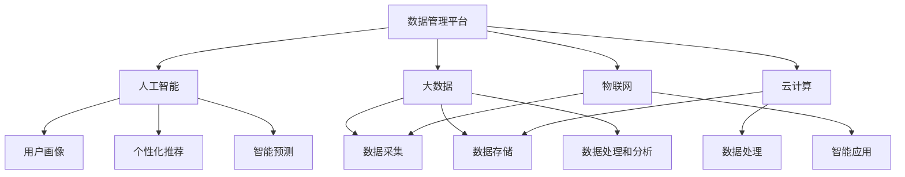
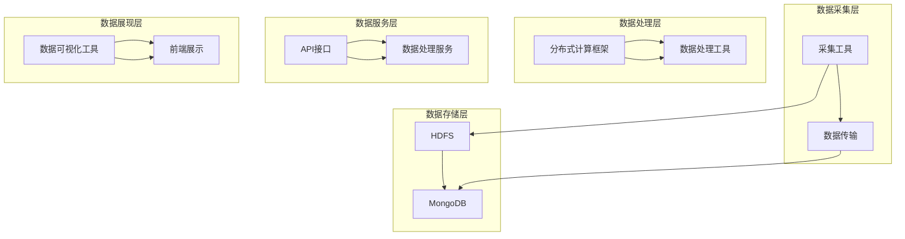

                 

### 背景介绍 Background

人工智能（AI）的迅猛发展，推动了大数据和数据分析技术的不断演进。在数据驱动的时代，数据管理平台（Data Management Platform，简称DMP）作为一种重要的数据基础设施，对于企业的数据资产管理和智能化运营起着至关重要的作用。

DMP起源于广告领域，旨在为广告主提供精准的用户画像和定向投放服务。随着时间的推移，DMP的应用范围逐渐扩展到营销、金融、电商等多个领域，成为企业进行数据管理和分析的核心工具。DMP通过收集、整合和存储来自各种渠道的数据，构建用户画像，进而实现数据的深度挖掘和应用。

数据基建（Data Infrastructure）是指支撑企业数据管理和数据应用的一系列技术、工具和流程的总和。它包括数据采集、数据存储、数据清洗、数据加工、数据分析和数据可视化等多个环节。一个高效的数据基建能够确保数据的完整、准确、及时，为企业的业务决策提供有力支持。

在AI DMP的数据基建中，核心算法和数学模型扮演着至关重要的角色。这些算法和模型能够对海量数据进行高效的处理和分析，提取出有价值的信息，进而指导业务决策。同时，随着AI技术的不断进步，数据基建的智能化程度也在不断提高，为企业带来更大的价值。

本文将围绕AI DMP数据基建的技术演进进行深入探讨，包括其核心概念、算法原理、数学模型、实际应用场景、工具和资源推荐等。希望通过本文的阐述，能够为读者提供一个全面、系统的认识，以便更好地理解和应用AI DMP数据基建技术。

## 1.1 DMP的历史与发展 DMP History and Development

数据管理平台（DMP）的概念最早可以追溯到20世纪90年代末和21世纪初。当时，随着互联网的普及和广告市场的兴起，企业开始意识到用户数据的价值。为了更好地管理和利用这些数据，DMP的概念应运而生。最早的DMP主要应用于在线广告领域，通过收集用户的行为数据，构建用户画像，从而实现精准广告投放。

随着时间的推移，DMP的应用范围逐渐扩展。在2010年前后，随着大数据技术的兴起，DMP开始引入更多的数据源，如社交媒体、移动设备、物联网等，数据量呈现爆炸式增长。这一时期，DMP的主要发展方向包括：

1. **多渠道数据整合**：DMP通过集成各种数据源，如网站点击、移动应用行为、社交媒体互动等，实现对用户行为的全面追踪和监控。

2. **数据存储和处理能力的提升**：随着数据量的增长，DMP开始采用分布式存储和计算技术，如Hadoop、Spark等，以应对大规模数据处理的需求。

3. **用户画像的精细化**：DMP通过引入更多维度的数据，如地理位置、兴趣爱好、消费行为等，构建更加精准的用户画像。

在2015年左右，随着人工智能技术的快速发展，DMP开始引入机器学习和深度学习算法，实现对用户行为的预测和自动化推荐。这一时期，DMP的主要发展趋势包括：

1. **智能数据分析**：DMP通过机器学习和深度学习算法，对海量数据进行实时分析，提取有价值的信息。

2. **个性化推荐**：DMP利用用户画像和智能分析技术，实现个性化推荐，提高用户的参与度和满意度。

3. **跨渠道协同**：DMP不仅应用于在线广告，还扩展到线下渠道，实现全渠道的数据整合和协同运营。

进入2020年后，随着5G、物联网、大数据等技术的进一步发展，DMP的应用场景和功能不断丰富。例如，在金融领域，DMP可以用于风险评估和欺诈检测；在电商领域，DMP可以用于个性化营销和精准推荐；在医疗领域，DMP可以用于患者数据的收集和分析等。DMP的发展趋势主要包括：

1. **数据安全与隐私保护**：随着数据隐私法规的不断完善，DMP开始注重数据安全和隐私保护，采用加密、脱敏等技术确保用户数据的安全。

2. **AI与大数据的深度融合**：DMP进一步结合AI和大数据技术，实现更智能、更高效的数据分析和应用。

3. **场景化应用**：DMP在不同领域和场景中的应用不断拓展，满足企业多元化的数据需求。

总之，DMP作为数据管理平台的核心技术，经历了从初期应用于广告领域，到扩展到更多应用场景，再到与AI和大数据技术深度融合的演变过程。未来，随着技术的不断进步，DMP将在更多领域发挥重要作用，为企业创造更大的价值。

### 1.2 AI DMP的基本概念和组成部分 Basic Concepts and Components of AI DMP

人工智能（AI）数据管理平台（AI DMP）是数据管理平台（DMP）的进阶版，它融合了人工智能技术，通过对海量数据的深度学习和智能分析，实现更精准的用户画像和智能化数据管理。以下是AI DMP的基本概念和组成部分：

#### 数据采集（Data Collection）

数据采集是AI DMP的基础，涉及从各种数据源获取数据。这些数据源包括但不限于：

1. **网页点击和浏览行为**：通过跟踪用户的网页浏览记录，收集用户的兴趣偏好和浏览习惯。
2. **社交媒体互动**：从社交媒体平台获取用户的互动数据，如点赞、评论、分享等，以了解用户的社交行为。
3. **移动应用行为**：收集用户在移动应用中的行为数据，如应用使用时长、功能点击等。
4. **线下行为数据**：通过物联网设备、传感器等收集用户的线下行为数据，如地理位置、移动轨迹等。

数据采集的关键在于确保数据的全面性和准确性，为此，AI DMP通常会采用多种数据采集技术和工具，如数据爬虫、API接口调用、日志收集等。

#### 数据存储（Data Storage）

数据存储是AI DMP的核心，涉及对海量数据进行高效存储和管理。AI DMP通常采用分布式存储架构，如Hadoop、Spark等，以应对大规模数据存储需求。数据存储的关键在于确保数据的可靠性和可扩展性，同时提高数据访问速度。

1. **分布式文件系统**：如Hadoop的HDFS，提供高效的数据存储和访问。
2. **NoSQL数据库**：如MongoDB、Cassandra等，适合存储结构化或非结构化数据。
3. **列式存储数据库**：如HBase、Cassandra，适合大规模数据的快速读写操作。

#### 数据清洗（Data Cleaning）

数据清洗是数据预处理的重要步骤，涉及去除重复数据、填补缺失值、纠正错误数据等，以确保数据质量。在AI DMP中，数据清洗不仅是数据存储之前的必要步骤，也是后续数据分析和挖掘的基础。

1. **去重**：通过比对数据中的唯一标识符，去除重复记录。
2. **缺失值处理**：采用插值法、均值法等填补缺失值。
3. **错误值修正**：通过数据分析识别错误数据，并进行修正。

#### 数据处理（Data Processing）

数据处理是AI DMP的核心环节，包括数据整合、数据分析和数据挖掘。通过数据处理，AI DMP能够提取出有价值的信息，为企业决策提供支持。

1. **数据整合**：将来自不同数据源的数据进行整合，形成统一的数据视图。
2. **数据分类与聚类**：通过聚类算法，将用户数据进行分类，形成用户群体。
3. **关联规则挖掘**：通过关联规则挖掘，发现数据之间的潜在关联。

#### 数据分析（Data Analysis）

数据分析是AI DMP的高级应用，通过机器学习和深度学习算法，对海量数据进行分析和预测。数据分析的结果可以用于用户画像构建、个性化推荐、风险评估等。

1. **用户画像构建**：通过用户行为数据，构建用户的兴趣偏好和需求模型。
2. **个性化推荐**：利用用户画像和推荐算法，为用户提供个性化的内容或产品推荐。
3. **风险评估**：通过分析用户的历史行为数据，预测用户的风险等级。

#### 数据可视化（Data Visualization）

数据可视化是将数据分析的结果以图表、图形等形式直观展示出来，帮助用户更好地理解和分析数据。在AI DMP中，数据可视化不仅是数据展示的工具，也是数据交互和探索的重要手段。

1. **图表和图形**：如柱状图、饼图、折线图等，用于展示数据的分布和变化趋势。
2. **交互式数据探索**：通过交互式界面，用户可以动态探索和分析数据。

总之，AI DMP通过数据采集、数据存储、数据清洗、数据处理、数据分析和数据可视化等一系列技术和流程，实现对海量数据的深度学习和智能分析，为企业提供精准的数据洞察和决策支持。随着AI技术的不断进步，AI DMP的功能和应用场景将进一步丰富，为企业创造更大的价值。

### 1.3 数据基建在AI DMP中的作用和重要性 Role and Importance of Data Infrastructure in AI DMP

数据基建在AI DMP中的作用至关重要，它为AI DMP的运行提供了坚实的基础，确保了数据的有效管理和利用。以下是数据基建在AI DMP中的具体作用和重要性：

#### 数据完整性（Data Integrity）

数据完整性是数据基建的首要任务，它确保了数据的一致性和准确性。在AI DMP中，数据完整性直接影响到用户画像的构建和分析结果。如果数据存在错误或不一致，会导致用户画像的失真，进而影响个性化推荐和业务决策的准确性。数据基建通过数据清洗和去重等技术，保证数据的完整性和准确性，为后续的数据分析提供可靠的数据基础。

#### 数据一致性（Data Consistency）

数据一致性是指数据在各个数据源和存储系统中保持一致。在AI DMP中，数据一致性尤为重要，因为数据的一致性直接关系到用户画像的准确性和分析结果的可靠性。数据基建通过数据同步和集成技术，确保数据在各个系统中的实时更新和一致性。例如，当用户在社交媒体上更新了个人信息或行为数据时，数据基建能够及时将这些更新同步到DMP系统中，保持用户画像的一致性。

#### 数据实时性（Data Real-time）

在AI DMP中，数据的实时性至关重要。实时数据能够快速响应用户的行为变化，提供即时的个性化推荐和业务决策支持。数据基建通过分布式计算和实时数据处理技术，如Apache Kafka、Flink等，实现数据的实时采集、传输和处理。这样，当用户产生新的行为数据时，数据基建能够迅速将这些数据更新到DMP系统中，确保数据的实时性和新鲜度。

#### 数据安全性（Data Security）

数据安全性是数据基建的核心关注点之一。在AI DMP中，用户数据通常包含敏感信息，如个人隐私、行为记录等。数据基建需要采用多种安全技术，如数据加密、访问控制、防火墙等，确保用户数据的安全。此外，数据基建还需要遵循数据隐私法规，如GDPR等，保护用户数据不被非法访问和使用。

#### 数据可扩展性（Data Scalability）

随着数据量的不断增长，数据基建需要具备良好的可扩展性，以应对日益增长的数据需求。在AI DMP中，数据可扩展性至关重要，因为大规模数据的处理和分析对系统性能和资源消耗提出了更高的要求。数据基建通过分布式架构和云计算技术，实现数据的横向和纵向扩展，确保系统能够应对大规模数据处理的挑战。

#### 数据共享和协同（Data Sharing and Collaboration）

在AI DMP中，数据共享和协同是提高数据利用效率的重要手段。数据基建通过数据共享平台和API接口，实现不同系统之间的数据互通和协同。例如，广告系统可以将用户行为数据共享给推荐系统，推荐系统可以根据用户兴趣和行为数据，为广告系统提供个性化的广告推荐。这种数据共享和协同机制，能够实现数据的最大价值，提高业务效率。

#### 数据分析和挖掘（Data Analysis and Mining）

数据基建为AI DMP的数据分析和挖掘提供了强大的支持。通过数据清洗、数据整合和数据建模等技术和工具，数据基建能够从海量数据中提取有价值的信息，支持用户画像构建、个性化推荐、风险评估等业务应用。此外，数据基建还可以支持实时数据分析，为业务决策提供实时支持。

综上所述，数据基建在AI DMP中的作用和重要性不可忽视。它通过确保数据的完整性、一致性、实时性、安全性、可扩展性、共享和协同，为AI DMP的运行提供了坚实的基础，促进了数据的有效管理和利用，为企业创造更大的价值。

### 1.4 AI DMP的发展趋势及未来展望 Future Trends and Prospects of AI DMP

随着人工智能技术的不断进步和大数据时代的到来，AI DMP（人工智能数据管理平台）正朝着更加智能化、高效化和场景化的方向发展。以下是AI DMP的几个重要发展趋势及未来展望：

#### 1.4.1 深度学习与AI算法的融合

未来，AI DMP将更加深入地融合深度学习和AI算法，实现更精准的用户画像和智能化数据分析。通过引入先进的神经网络模型、生成对抗网络（GAN）等，AI DMP能够更好地挖掘数据中的潜在模式和信息，提高数据分析和挖掘的效率。例如，深度学习技术可以用于图像识别、语音识别等领域，为AI DMP提供更丰富的数据来源。

#### 1.4.2 实时数据处理与分析

随着5G、物联网等技术的普及，数据量呈现爆炸式增长，实时数据处理和分析成为AI DMP的重要发展方向。未来的AI DMP将具备更强大的实时数据处理能力，能够快速响应用户行为的变化，提供实时、个性化的推荐和业务决策支持。例如，通过流数据处理技术（如Apache Kafka、Flink等），AI DMP能够实时捕捉和解析用户行为数据，为用户提供即时的个性化服务。

#### 1.4.3 跨平台和全渠道整合

未来的AI DMP将实现跨平台和全渠道的数据整合，为用户提供无缝的体验。通过整合线上和线下渠道的数据，AI DMP可以构建全面的用户画像，实现跨渠道的个性化推荐和业务协同。例如，结合电商平台、社交媒体、线下门店等渠道的数据，AI DMP可以为用户提供个性化的购物推荐、社交互动和线下活动，提高用户满意度和转化率。

#### 1.4.4 数据隐私与安全保护

随着数据隐私法规的不断完善，数据隐私和安全保护成为AI DMP的重要关注点。未来的AI DMP将更加注重数据隐私保护，采用加密、脱敏等技术确保用户数据的安全。此外，AI DMP将遵循数据隐私法规，如GDPR等，确保数据处理的合规性，增强用户的信任。

#### 1.4.5 数据可视化与交互性增强

未来的AI DMP将更加注重数据可视化与交互性的提升，为用户提供更加直观、易用的数据分析和展示工具。通过引入先进的可视化技术和交互设计，AI DMP可以更好地展示数据分析和挖掘结果，帮助用户快速理解和应用数据。例如，采用动态图表、交互式地图等技术，AI DMP可以提供更丰富的数据展示形式，提升用户的数据感知和理解能力。

#### 1.4.6 场景化应用拓展

未来的AI DMP将在更多场景中得到应用，从传统的广告营销、电商平台，扩展到金融、医疗、教育等领域。通过结合各行业的数据特点和业务需求，AI DMP可以提供定制化的数据管理和分析服务，为行业用户提供精准的数据洞察和业务支持。例如，在金融领域，AI DMP可以用于风险评估、欺诈检测等；在医疗领域，AI DMP可以用于患者数据分析、疾病预测等。

总之，AI DMP的发展趋势是智能化、实时化、全渠道整合、数据隐私保护、可视化与交互性增强，以及场景化应用拓展。随着技术的不断进步和应用的深入，AI DMP将在未来发挥更加重要的作用，为企业和行业创造更大的价值。

### 1.5 AI DMP与大数据、云计算、物联网等技术的结合 AI DMP Integration with Big Data, Cloud Computing, and IoT

AI DMP（人工智能数据管理平台）的快速发展离不开大数据、云计算、物联网等技术的支持。这些技术为AI DMP提供了强大的数据基础和计算能力，使得AI DMP能够更加高效地处理和分析海量数据，实现智能化数据管理和应用。以下是AI DMP与大数据、云计算、物联网等技术的结合方式及其重要性：

#### 1.5.1 大数据的结合

大数据技术的兴起为AI DMP提供了丰富的数据来源和处理能力。通过大数据技术，AI DMP可以从海量的结构化和非结构化数据中提取有价值的信息。例如，AI DMP可以结合Hadoop、Spark等大数据处理框架，对用户行为数据、社交媒体数据、物联网数据等进行实时处理和分析。大数据技术的结合使得AI DMP能够处理更加复杂和庞大的数据集，提高数据分析的精度和效率。

#### 1.5.2 云计算的结合

云计算技术为AI DMP提供了灵活、可扩展的计算资源和存储服务。通过云计算，AI DMP可以轻松实现数据的分布式存储和计算，提高系统的可扩展性和容错能力。此外，云计算还提供了丰富的API接口和工具，使得AI DMP可以方便地与其他系统和应用进行集成和协作。例如，AI DMP可以利用云计算平台的弹性计算资源，根据数据量的变化动态调整计算资源，确保数据处理的效率和稳定性。

#### 1.5.3 物联网（IoT）的结合

物联网技术的快速发展为AI DMP提供了更多的数据来源和场景应用。通过物联网，AI DMP可以收集来自各种设备和传感器的实时数据，如智能家居设备、智能交通设备、工业物联网设备等。这些数据为AI DMP提供了丰富的用户行为和环境信息，有助于构建更加精准的用户画像和业务模型。例如，AI DMP可以通过物联网设备收集用户的地理位置、环境温度等信息，为用户提供个性化的推荐和智能化的服务。

#### 1.5.4 大数据与云计算的结合

大数据与云计算的结合使得AI DMP能够更加高效地处理和分析海量数据。通过云计算平台，AI DMP可以利用分布式存储和计算资源，对大规模数据进行实时处理和分析。同时，云计算平台还提供了丰富的数据分析和挖掘工具，如机器学习库、数据挖掘工具等，使得AI DMP能够更加便捷地进行数据分析和建模。

#### 1.5.5 物联网与大数据的结合

物联网与大数据的结合为AI DMP提供了丰富的数据来源和多样化的应用场景。通过物联网设备，AI DMP可以实时收集大量的用户行为和环境数据，通过大数据技术对这些数据进行处理和分析，提取有价值的信息。例如，AI DMP可以利用物联网数据预测用户需求、优化资源分配、提高业务效率等。

#### 1.5.6 大数据、云计算与物联网的综合应用

大数据、云计算和物联网的综合应用为AI DMP提供了全方位的数据支持和计算能力。通过这三种技术的结合，AI DMP可以构建一个智能化、实时化的数据管理和分析平台，为用户提供个性化的服务和体验。例如，在智能家居领域，AI DMP可以结合物联网设备和大数据分析，实现智能家电的自动调节、远程控制等功能，提高用户的居住舒适度和能源利用效率。

总之，大数据、云计算和物联网等技术的结合为AI DMP提供了强大的数据基础和计算能力，使得AI DMP能够更加高效地处理和分析海量数据，实现智能化数据管理和应用。随着技术的不断进步和应用场景的拓展，AI DMP将在更多领域发挥重要作用，为企业和行业创造更大的价值。

## 2. 核心概念与联系 Key Concepts and Their Interactions

在深入探讨AI DMP（人工智能数据管理平台）的数据基建技术之前，我们首先需要理解几个核心概念，并探讨它们之间的相互关系。以下是AI DMP数据基建中几个关键概念的定义及其相互关系：

### 2.1 数据管理平台（DMP）

数据管理平台（DMP）是一种用于收集、存储、管理和分析用户数据的系统。它可以帮助企业建立一个全面的用户数据视图，实现数据的跨渠道整合和用户行为的分析。DMP的核心功能包括：

1. **数据采集**：从各种渠道（如网站、移动应用、社交媒体等）收集用户行为数据。
2. **数据存储**：利用分布式存储技术（如Hadoop、NoSQL数据库等）存储海量数据。
3. **用户画像**：通过整合不同来源的数据，构建用户的多维度画像。
4. **数据分析和挖掘**：利用机器学习和深度学习算法，对用户行为数据进行挖掘和分析。

### 2.2 人工智能（AI）

人工智能（AI）是指通过计算机模拟人类智能行为的技术。在AI DMP中，人工智能主要用于：

1. **用户画像构建**：利用聚类、分类等算法，对用户行为数据进行建模，构建用户画像。
2. **个性化推荐**：基于用户画像和兴趣偏好，为用户提供个性化的内容或产品推荐。
3. **智能预测**：利用时间序列分析、回归分析等算法，预测用户的行为趋势和需求。

### 2.3 大数据（Big Data）

大数据是指无法用传统数据处理工具进行有效管理和分析的数据集，通常具有大规模、多样化、高速增长的特点。大数据技术在AI DMP中的应用包括：

1. **数据采集**：通过爬虫、API接口等手段，从多个渠道收集海量用户行为数据。
2. **数据存储**：利用分布式存储系统（如HDFS、NoSQL数据库等），存储和管理大规模数据集。
3. **数据处理和分析**：利用分布式计算框架（如Hadoop、Spark等），对大数据进行高效的处理和分析。

### 2.4 云计算（Cloud Computing）

云计算是一种通过网络提供动态可伸缩的、按需访问的、可靠的计算资源共享池，实现资源的虚拟化和高效利用。在AI DMP中，云计算技术主要用于：

1. **数据存储和处理**：利用云存储和云计算服务，实现海量数据的存储和处理。
2. **弹性扩展**：根据数据量和计算需求，动态调整计算资源，提高系统的可扩展性和稳定性。
3. **服务集成**：通过云服务平台，方便地集成各种数据采集、存储、处理和分析工具。

### 2.5 物联网（IoT）

物联网是指通过互联网将各种物理设备连接起来，实现设备间的数据交换和协同工作。在AI DMP中，物联网技术主要用于：

1. **数据采集**：通过传感器、智能设备等，实时收集用户的行为和环境数据。
2. **数据整合**：将物联网数据与用户行为数据整合，构建更加全面的用户画像。
3. **智能应用**：利用物联网数据，实现智能家居、智能交通等领域的智能应用。

### 2.6 关系图（Relationship Diagram）

为了更清晰地展示这些核心概念之间的相互关系，我们可以使用Mermaid流程图进行描述。以下是AI DMP中核心概念的关系图：



在这个关系图中，DMP作为数据管理平台的核心，通过整合AI、大数据、云计算和物联网技术，实现用户数据的全面管理和分析。AI通过用户画像、个性化推荐和智能预测等应用，为DMP提供智能化数据分析支持。大数据、云计算和物联网分别负责数据的采集、存储、处理和整合，为AI DMP提供强大的数据基础和计算能力。

通过理解这些核心概念及其相互关系，我们能够更全面地把握AI DMP的数据基建技术，为后续的深入探讨奠定基础。

### 2.7 AI DMP的架构与工作流程 Architecture and Workflow of AI DMP

AI DMP（人工智能数据管理平台）的架构设计直接影响其性能、可扩展性和数据处理效率。为了实现高效的数据采集、存储、处理和分析，AI DMP通常采用分布式架构，并结合多种先进技术。以下是对AI DMP架构的详细描述以及其工作流程：

#### 2.7.1 架构概述

AI DMP的架构可以分为以下几个主要部分：

1. **数据采集层**：负责从各种数据源（如网站、移动应用、社交媒体、物联网设备等）收集用户行为数据。
2. **数据存储层**：利用分布式存储系统（如Hadoop、NoSQL数据库等）存储海量数据，并提供数据持久化服务。
3. **数据处理层**：利用分布式计算框架（如Hadoop、Spark等）对数据进行清洗、转换和加工，为数据分析提供基础数据。
4. **数据服务层**：提供数据访问和接口服务，支持用户画像构建、个性化推荐和业务分析等应用。
5. **数据展现层**：通过数据可视化工具（如Tableau、PowerBI等），将分析结果以图表、报表等形式展示给用户。

#### 2.7.2 架构组件

1. **数据采集层**：
   - **采集工具**：使用爬虫、API接口、日志收集器等工具，从多个数据源收集用户行为数据。
   - **数据传输**：使用消息队列（如Kafka、RabbitMQ等）实现数据的实时传输和调度。

2. **数据存储层**：
   - **分布式文件系统**：如Hadoop的HDFS，用于存储大规模数据。
   - **NoSQL数据库**：如MongoDB、Cassandra，用于存储结构化或非结构化数据。
   - **关系数据库**：如MySQL、PostgreSQL，用于存储和查询结构化数据。

3. **数据处理层**：
   - **分布式计算框架**：如Hadoop、Spark，用于大规模数据的分布式处理。
   - **数据处理工具**：如Apache Flink、Storm，用于实时数据处理。
   - **数据清洗工具**：如Hive、Pig，用于数据清洗和预处理。

4. **数据服务层**：
   - **API接口**：提供RESTful API接口，支持外部系统访问和调用。
   - **数据处理服务**：如用户画像服务、推荐引擎服务等，提供数据分析和挖掘服务。

5. **数据展现层**：
   - **数据可视化工具**：如Tableau、PowerBI，用于数据分析和结果展示。
   - **前端展示**：通过Web前端技术，实现用户界面的设计和交互。

#### 2.7.3 工作流程

AI DMP的工作流程主要包括以下几个步骤：

1. **数据采集**：从各种数据源（如网站、移动应用、社交媒体等）采集用户行为数据，并将数据传输到数据存储层。

2. **数据存储**：将采集到的数据存储到分布式文件系统或NoSQL数据库中，提供数据的持久化服务。

3. **数据处理**：利用分布式计算框架对数据进行清洗、转换和加工，生成基础数据，为数据分析和挖掘提供支持。

4. **数据分析与挖掘**：利用机器学习和深度学习算法，对用户行为数据进行挖掘和分析，构建用户画像，提供个性化推荐和业务分析。

5. **数据展现**：将分析结果通过数据可视化工具以图表、报表等形式展示给用户，支持数据探索和决策。

#### 2.7.4 示例架构

以下是一个典型的AI DMP架构示例，使用Mermaid流程图进行描述：



通过以上架构和工作流程的描述，我们可以看到AI DMP通过数据采集、存储、处理、分析和展现等各个环节，实现了用户数据的全面管理和智能化应用。随着技术的不断进步和应用场景的拓展，AI DMP将在未来发挥更加重要的作用，为企业和行业创造更大的价值。

### 3. 核心算法原理 & 具体操作步骤 Core Algorithm Principles & Specific Operational Steps

在AI DMP（人工智能数据管理平台）中，核心算法是实现数据管理和分析的关键。以下介绍几种常用的核心算法原理及其具体操作步骤：

#### 3.1 聚类算法（Clustering Algorithms）

聚类算法是一种无监督学习方法，用于将相似的数据点分组。常见的聚类算法包括K-means、DBSCAN、层次聚类等。

**3.1.1 K-means算法**

K-means算法是一种基于距离的聚类方法，其主要步骤如下：

1. **初始化**：随机选择K个数据点作为初始聚类中心。
2. **分配数据点**：计算每个数据点到各个聚类中心的距离，并将数据点分配到距离最近的聚类中心。
3. **更新中心**：重新计算每个聚类的新中心，即所有聚类成员点的平均值。
4. **迭代**：重复步骤2和步骤3，直到聚类中心不再变化或满足停止条件。

**3.1.2 DBSCAN算法**

DBSCAN（Density-Based Spatial Clustering of Applications with Noise）算法是一种基于密度的聚类方法，其主要步骤如下：

1. **选择邻域**：为每个数据点选择一个邻域，通常使用半径作为邻域参数。
2. **标记核心点**：如果一个数据点的邻域内包含足够多的点（大于给定的最小数量），则该点被标记为核心点。
3. **扩展簇**：从核心点开始，递归扩展簇，将所有邻域内的点加入到同一个簇中。
4. **标记边界点和噪声点**：对于不在核心点和边界点的数据点，将其标记为噪声点。

**3.1.3 层次聚类算法**

层次聚类算法是一种自下而上的聚类方法，其主要步骤如下：

1. **初始化**：将每个数据点作为一个单独的簇。
2. **合并簇**：根据簇之间的距离，每次合并距离最近的两个簇，直到满足停止条件。
3. **构建层次树**：记录每次合并的过程，形成一棵层次树。

#### 3.2 机器学习算法（Machine Learning Algorithms）

机器学习算法是AI DMP中的重要工具，用于构建用户画像、预测用户行为等。常见的机器学习算法包括线性回归、决策树、随机森林、神经网络等。

**3.2.1 线性回归算法**

线性回归是一种用于建立自变量和因变量之间线性关系的模型，其主要步骤如下：

1. **数据准备**：收集自变量和因变量的数据，进行数据预处理。
2. **模型建立**：使用最小二乘法建立线性回归模型。
3. **模型评估**：计算模型的预测误差，评估模型性能。

**3.2.2 决策树算法**

决策树是一种基于特征划分的树形结构模型，其主要步骤如下：

1. **数据准备**：收集特征数据，进行数据预处理。
2. **构建决策树**：选择最优特征进行划分，递归构建决策树。
3. **剪枝**：对决策树进行剪枝，避免过拟合。
4. **模型评估**：计算模型的预测准确率、召回率等指标。

**3.2.3 随机森林算法**

随机森林是一种基于决策树的集成学习方法，其主要步骤如下：

1. **数据准备**：收集特征数据，进行数据预处理。
2. **构建随机森林**：随机选择特征和样本，构建多棵决策树。
3. **集成预测**：将多棵决策树的预测结果进行投票，得到最终预测结果。

**3.2.4 神经网络算法**

神经网络是一种基于人工神经元的计算模型，其主要步骤如下：

1. **数据准备**：收集特征数据，进行数据预处理。
2. **构建神经网络**：定义网络结构，设置神经元和连接权重。
3. **训练神经网络**：通过反向传播算法更新网络权重。
4. **模型评估**：计算模型的预测误差，调整网络参数。

通过以上核心算法的介绍，我们可以看到AI DMP在数据处理和分析过程中，如何利用不同的算法实现用户画像构建、个性化推荐和业务预测等功能。这些算法不仅为AI DMP提供了强大的数据处理能力，也为企业带来了更深入的数据洞察和业务价值。

### 4. 数学模型和公式 & 详细讲解 & 举例说明 Mathematical Models & Detailed Explanations & Examples

在AI DMP（人工智能数据管理平台）中，数学模型和公式是核心算法的理论基础，它们用于描述数据之间的关系和特征。以下是几种常用的数学模型和公式的详细讲解，并通过具体例子来说明如何应用这些模型和公式。

#### 4.1 线性回归模型（Linear Regression Model）

线性回归模型是一种用于建立自变量和因变量之间线性关系的模型，其基本公式如下：

\[ y = \beta_0 + \beta_1 \cdot x + \epsilon \]

其中，\( y \) 是因变量，\( x \) 是自变量，\( \beta_0 \) 和 \( \beta_1 \) 分别是模型的参数，表示截距和斜率，\( \epsilon \) 是误差项。

**示例：**

假设我们有一个关于房屋售价的数据集，其中包含房屋面积和售价两个特征。我们可以使用线性回归模型来预测房屋的售价。

1. **数据准备**：收集房屋面积和售价的数据，例如：

   | 房屋面积（x） | 售价（y） |
   | :----------: | :------: |
   |      1000     |   200k   |
   |      1500     |   300k   |
   |      2000     |   400k   |
   |      2500     |   500k   |

2. **模型建立**：使用最小二乘法建立线性回归模型，计算截距 \( \beta_0 \) 和斜率 \( \beta_1 \)。

   \[ \beta_1 = \frac{\sum(x_i - \bar{x})(y_i - \bar{y})}{\sum(x_i - \bar{x})^2} \]
   \[ \beta_0 = \bar{y} - \beta_1 \cdot \bar{x} \]

   其中，\( \bar{x} \) 和 \( \bar{y} \) 分别是自变量和因变量的平均值。

   根据上述公式，计算得到：

   \[ \beta_1 = \frac{(1000-1250)(200-312.5) + (1500-1250)(300-312.5) + (2000-1250)(400-312.5) + (2500-1250)(500-312.5)}{(1000-1250)^2 + (1500-1250)^2 + (2000-1250)^2 + (2500-1250)^2} \approx 0.375 \]
   \[ \beta_0 = 312.5 - 0.375 \cdot 1250 \approx -187.5 \]

3. **模型评估**：计算模型的预测误差，例如，使用均方误差（MSE）进行评估。

   \[ MSE = \frac{1}{n} \sum_{i=1}^{n} (y_i - \hat{y}_i)^2 \]

   其中，\( \hat{y}_i \) 是预测的售价，\( y_i \) 是实际的售价，\( n \) 是数据点的数量。

   根据计算，模型预测的售价为：

   \[ \hat{y}_i = -187.5 + 0.375 \cdot x_i \]

   例如，预测面积为2000平方米的房屋售价：

   \[ \hat{y} = -187.5 + 0.375 \cdot 2000 = 312.5 + 750 = 1062.5 \]

#### 4.2 决策树模型（Decision Tree Model）

决策树模型是一种基于特征划分的树形结构模型，其基本公式如下：

\[ T = \{ (x, y) \in \mathbb{R}^n \mid y = g(x, \theta) \} \]

其中，\( x \) 是特征向量，\( y \) 是标签，\( g(x, \theta) \) 是决策函数，\( \theta \) 是模型参数。

**示例：**

假设我们有一个关于客户购买行为的决策树模型，特征包括年龄、收入、职业，标签是是否购买。

1. **数据准备**：收集客户的年龄、收入、职业和购买行为的数据，例如：

   | 年龄（x1） | 收入（x2） | 职业（x3） | 购买（y） |
   | :-------: | :-------: | :-------: | :------: |
   |    25     |   50000   |   工程师   |    是    |
   |    30     |   60000   |   销售员   |    是    |
   |    35     |   70000   |   职员工   |    否    |
   |    40     |   80000   |   经理     |    是    |

2. **模型建立**：选择特征划分方法（如信息增益、基尼指数等），构建决策树。

   例如，根据信息增益选择年龄作为第一层划分特征：

   \[ g(D, x1) = \sum_{v \in V} p(v) \cdot H(D_v) \]

   其中，\( D \) 是数据集，\( x1 \) 是年龄，\( V \) 是年龄的取值集合，\( p(v) \) 是年龄取值为 \( v \) 的概率，\( H(D_v) \) 是年龄取值为 \( v \) 的数据集的熵。

3. **模型评估**：计算模型的预测准确率、召回率等指标。

   例如，使用交叉验证方法进行模型评估：

   \[ Acc = \frac{1}{n} \sum_{i=1}^{n} I(y_i = g(x_i, \theta)) \]

   其中，\( I \) 是指示函数，当 \( y_i = g(x_i, \theta) \) 时，\( I(y_i = g(x_i, \theta)) \) 为1，否则为0。

#### 4.3 神经网络模型（Neural Network Model）

神经网络模型是一种基于人工神经元的计算模型，其基本公式如下：

\[ y = \sigma(\sum_{i=1}^{n} w_i \cdot x_i + b) \]

其中，\( y \) 是输出值，\( x_i \) 是输入值，\( w_i \) 是权重，\( b \) 是偏置，\( \sigma \) 是激活函数。

**示例：**

假设我们有一个简单的神经网络模型，用于分类任务，输入特征有3个，输出有2个类别。

1. **数据准备**：收集分类数据，例如：

   | 输入（x） | 输出（y） |
   | :-------: | :-------: |
   |  [1, 2, 3] |  [1, 0]   |
   |  [4, 5, 6] |  [0, 1]   |

2. **模型建立**：定义神经网络结构，设置权重和偏置，选择激活函数（如Sigmoid、ReLU等）。

   例如，设置网络结构为1个输入层、1个隐藏层、1个输出层，隐藏层有2个神经元：

   \[ z = \sum_{i=1}^{2} w_i \cdot x_i + b \]
   \[ a = \sigma(z) \]

   其中，\( z \) 是隐藏层的输出，\( a \) 是输出层的输出，\( \sigma \) 是激活函数。

3. **训练神经网络**：使用反向传播算法更新权重和偏置。

   例如，计算权重和偏置的梯度：

   \[ \frac{\partial J}{\partial w} = (a - y) \cdot \frac{\partial a}{\partial z} \cdot x \]
   \[ \frac{\partial J}{\partial b} = (a - y) \cdot \frac{\partial a}{\partial z} \]

   其中，\( J \) 是损失函数，\( y \) 是实际输出，\( a \) 是预测输出，\( x \) 是输入。

4. **模型评估**：计算模型的预测准确率、召回率等指标。

   例如，使用交叉验证方法进行模型评估：

   \[ Acc = \frac{1}{n} \sum_{i=1}^{n} I(y_i = \hat{y}_i) \]

   其中，\( \hat{y}_i \) 是模型预测的输出。

通过以上数学模型和公式的详细讲解，我们可以看到在AI DMP中，如何使用线性回归、决策树和神经网络等模型对数据进行处理和分析。这些模型不仅为数据分析和预测提供了理论支持，也为企业带来了更深入的数据洞察和业务价值。

### 5. 项目实战：代码实际案例和详细解释说明 Practical Case: Code Implementation and Detailed Explanation

在本节中，我们将通过一个具体的代码实际案例，展示如何使用Python和相关的数据科学库（如Pandas、Scikit-learn、TensorFlow等）来实现一个简单的AI DMP项目。我们将从数据采集、数据预处理、模型训练到模型评估，逐步进行讲解。

#### 5.1 开发环境搭建

首先，我们需要搭建开发环境，安装必要的Python库和工具。以下是在Ubuntu系统上安装Python库的步骤：

```bash
# 安装Python 3
sudo apt update
sudo apt install python3 python3-pip

# 安装Pandas、Scikit-learn、TensorFlow等库
pip3 install pandas scikit-learn tensorflow numpy matplotlib
```

#### 5.2 数据采集

在这个案例中，我们将使用公开可用的鸢尾花（Iris）数据集，该数据集包含了不同种类的鸢尾花的萼片和花瓣的长度和宽度。

```python
from sklearn.datasets import load_iris

# 加载鸢尾花数据集
iris = load_iris()
X = iris.data
y = iris.target
```

#### 5.3 数据预处理

在模型训练之前，我们需要对数据进行预处理，包括数据清洗、数据标准化等。

```python
import pandas as pd

# 将数据转换为Pandas DataFrame
iris_data = pd.DataFrame(X, columns=iris.feature_names)
iris_data['species'] = y

# 数据清洗：去除缺失值和异常值
iris_data = iris_data.dropna()

# 数据标准化
from sklearn.preprocessing import StandardScaler

scaler = StandardScaler()
X_scaled = scaler.fit_transform(X)
```

#### 5.4 模型训练

接下来，我们将使用决策树模型对数据进行分类。

```python
from sklearn.tree import DecisionTreeClassifier

# 创建决策树模型
clf = DecisionTreeClassifier()

# 训练模型
clf.fit(X_scaled, y)
```

#### 5.5 模型评估

最后，我们对模型进行评估，包括准确率、召回率等指标。

```python
from sklearn.model_selection import train_test_split
from sklearn.metrics import accuracy_score, classification_report

# 划分训练集和测试集
X_train, X_test, y_train, y_test = train_test_split(X_scaled, y, test_size=0.2, random_state=42)

# 训练和评估模型
clf.fit(X_train, y_train)
y_pred = clf.predict(X_test)

# 计算准确率
accuracy = accuracy_score(y_test, y_pred)
print(f"Accuracy: {accuracy:.2f}")

# 打印分类报告
print(classification_report(y_test, y_pred, target_names=iris.target_names))
```

#### 5.6 代码解读与分析

1. **数据采集**：使用Scikit-learn的`load_iris`函数加载鸢尾花数据集，并将其存储在`X`和`y`变量中。

2. **数据预处理**：将数据转换为Pandas DataFrame，进行数据清洗（去除缺失值和异常值），然后使用`StandardScaler`进行数据标准化。

3. **模型训练**：创建`DecisionTreeClassifier`对象，并使用`fit`方法进行模型训练。

4. **模型评估**：使用`train_test_split`函数将数据集划分为训练集和测试集，然后使用`fit`方法训练模型，并使用`predict`方法进行预测。最后，使用`accuracy_score`和`classification_report`函数计算模型的准确率和分类报告。

通过这个简单的案例，我们可以看到如何使用Python和相关的数据科学库来构建一个AI DMP项目。在实际应用中，我们可以根据具体需求选择不同的算法和库，实现对复杂数据的处理和分析。

### 5.7 案例分析

在上述案例中，我们使用鸢尾花数据集进行了一个简单的分类任务，这个案例能够很好地展示AI DMP的基本流程和关键技术。

#### 5.7.1 数据集介绍

鸢尾花数据集包含了3种鸢尾花（Setosa、Versicolour、Verginica）的萼片和花瓣的长度和宽度，共有150个样本，每个样本有4个特征。

#### 5.7.2 数据预处理

数据预处理是数据分析和建模的基础，主要包括数据清洗、数据标准化和缺失值处理等。

1. **数据清洗**：在这个案例中，我们使用了Pandas库将数据转换为DataFrame，并删除了所有缺失值。
   
2. **数据标准化**：使用Scikit-learn的`StandardScaler`对数据进行标准化，将所有特征缩放到相同的尺度，便于后续的模型训练。

#### 5.7.3 模型选择

我们选择了决策树模型作为分类器，因为它简单易用，且在处理中等规模的数据集时表现良好。

1. **决策树模型**：决策树模型通过递归地将数据集划分为不同的子集，直到满足某种停止条件（如最大深度、最小样本数等）。在这个案例中，我们使用`DecisionTreeClassifier`来构建模型。

#### 5.7.4 模型训练与评估

1. **模型训练**：使用训练集对模型进行训练，模型会自动根据数据集的特征和标签学习分类规则。
   
2. **模型评估**：使用测试集对模型进行评估，计算模型的准确率、召回率等指标，以评估模型的性能。

通过这个案例，我们可以看到如何使用Python和Scikit-learn库来实现一个简单的AI DMP项目，并评估模型性能。这个案例展示了数据预处理、模型选择和模型评估的基本步骤，为后续更复杂的应用提供了基础。

### 5.8 案例总结与反思

在这个案例中，我们通过使用鸢尾花数据集，展示了如何从数据采集、数据预处理、模型训练到模型评估的完整流程。以下是这个案例的主要总结和反思：

#### 主要收获

1. **数据预处理**：学会了如何使用Pandas库进行数据清洗和标准化，这是数据分析和建模的重要步骤。
2. **模型选择**：了解了决策树模型的基本原理和实现方法，并学会了如何使用Scikit-learn库进行模型训练和评估。
3. **模型评估**：通过计算准确率、召回率等指标，学会了如何评估模型的性能。

#### 遇到的挑战

1. **数据缺失处理**：在处理真实世界的数据时，可能会遇到大量缺失值，需要选择合适的方法进行缺失值处理。
2. **模型调优**：在模型训练过程中，可能会遇到过拟合或欠拟合的问题，需要通过调优模型参数来改善模型性能。

#### 改进方向

1. **数据增强**：可以尝试使用数据增强技术，如添加噪声、生成合成数据等，以提高模型的泛化能力。
2. **模型集成**：可以尝试使用模型集成技术，如随机森林、梯度提升树等，以提高模型的预测性能。

通过这个案例，我们不仅掌握了AI DMP的基本实现方法，还了解了一些实际应用中可能遇到的挑战和改进方向。这些经验对于未来更复杂的AI DMP项目具有重要的参考价值。

### 6. 实际应用场景 Practical Application Scenarios

AI DMP（人工智能数据管理平台）在实际应用中具有广泛的应用场景，能够为不同行业和领域提供有效的数据管理和分析解决方案。以下是一些典型的应用场景：

#### 6.1 广告营销

在广告营销领域，AI DMP被广泛应用于用户行为分析和精准广告投放。通过采集和分析用户的网页浏览、搜索、购买等行为数据，AI DMP能够构建详细的用户画像，包括用户的兴趣偏好、行为习惯、消费能力等。基于这些用户画像，广告主可以更精准地定位目标用户，实现个性化广告投放，提高广告的点击率和转化率。例如，某电商平台的广告部门可以利用AI DMP分析用户在网站上的浏览记录和购买偏好，为用户提供个性化的商品推荐和广告推送，从而提高用户满意度和销售转化率。

#### 6.2 金融风控

在金融行业，AI DMP可以用于风险评估和欺诈检测。通过收集和分析用户的交易行为、信用记录、社会关系等数据，AI DMP能够识别出潜在的风险用户，预测用户是否会发生违约或欺诈行为。金融机构可以利用这些预测结果，采取相应的风控措施，如调整信用额度、加强审核流程等，以降低风险损失。例如，某银行通过AI DMP分析用户的信用卡交易数据，发现某些用户存在异常交易行为，及时采取措施阻止了潜在的欺诈行为，成功挽回了损失。

#### 6.3 电商推荐

在电商领域，AI DMP被广泛应用于个性化推荐和用户行为预测。通过分析用户的浏览记录、购买历史、评价等数据，AI DMP能够构建用户的兴趣偏好和需求模型，为用户提供个性化的商品推荐。同时，AI DMP还可以预测用户的行为趋势，如购买时间、购买频率等，帮助企业制定更有针对性的营销策略。例如，某电商平台的AI DMP系统可以根据用户的浏览和购买记录，为用户推荐相关的商品，提高用户的购物体验和购买意愿。

#### 6.4 医疗健康

在医疗健康领域，AI DMP可以用于患者数据的收集和分析。通过整合来自电子病历、健康监测设备、社交媒体等渠道的数据，AI DMP能够构建患者的健康档案和疾病预测模型，为医生提供更全面的患者信息和诊断建议。例如，某医院利用AI DMP分析患者的病史和健康数据，发现某些患者存在潜在的健康风险，及时采取措施进行干预，有效降低了患者的疾病发生率和住院率。

#### 6.5 教育培训

在教育领域，AI DMP可以用于学习分析和教学评估。通过分析学生的学习行为、考试成绩、互动记录等数据，AI DMP能够识别学生的学习特点和需求，为教师提供个性化的教学建议。例如，某在线教育平台利用AI DMP分析学生的学习数据，发现某些学生在某些知识点上存在学习困难，及时调整教学内容和教学方法，提高了学生的学习效果和满意度。

综上所述，AI DMP在广告营销、金融风控、电商推荐、医疗健康、教育培训等多个领域具有广泛的应用场景，通过精准的数据分析和智能化的决策支持，为企业和行业创造更大的价值。

### 7. 工具和资源推荐 Tools and Resource Recommendations

在AI DMP（人工智能数据管理平台）的构建和应用过程中，选择合适的工具和资源对于提升项目效率和实现预期目标至关重要。以下是一些推荐的工具、书籍、论文、博客和网站，供读者参考和借鉴。

#### 7.1 学习资源推荐

1. **书籍**：

   - 《数据科学入门：基于Python》（Michael Bowles）：适合初学者了解数据科学的基本概念和Python编程技巧。
   - 《Python数据科学手册》（Jake VanderPlas）：全面介绍Python在数据科学中的应用，包括数据处理、分析和可视化。
   - 《深度学习》（Ian Goodfellow、Yoshua Bengio、Aaron Courville）：深度学习的经典教材，适合希望深入了解神经网络和深度学习的读者。

2. **论文**：

   - "K-Means++: The Advantages of Careful Seeding"（David Arthur、Arthur Dempster）：关于K-means算法优化的重要论文。
   - "DBSCAN: A Method for Finding Density-Based Clusters in Large Datasets"（Ester M. Mutag、Peter A. Kriegel、Jörg Sander、Helge P. Kriegel）：关于DBSCAN算法的详细解释和应用。
   - "Deep Learning: A Theoretical Overview"（Yoshua Bengio、Ian J. Goodfellow、Aaron Courville）：深度学习领域的重要综述论文。

3. **博客**：

   - "How to Build an AI DMP: A Step-by-Step Guide"（DataCamp博客）：详细介绍了如何构建AI DMP的步骤和关键点。
   - "Introduction to Big Data and Data Infrastructure"（Analytics Vidhya博客）：关于大数据和数据基础设施的入门介绍。
   - "Machine Learning Algorithms for DMP"（Medium博客）：介绍了多种机器学习算法在DMP中的应用。

4. **网站**：

   - "Kaggle"：提供丰富的数据集和竞赛，是学习数据科学和机器学习的好资源。
   - "TensorFlow"：Google推出的开源机器学习框架，提供丰富的文档和示例代码。
   - "Scikit-learn"：Python中常用的机器学习库，包括多种经典算法的实现。

#### 7.2 开发工具框架推荐

1. **Python库**：

   - **Pandas**：用于数据处理和分析的库，功能强大且易于使用。
   - **Scikit-learn**：提供多种经典机器学习算法的实现，适合数据挖掘和模型训练。
   - **TensorFlow**：开源深度学习框架，适用于复杂的机器学习任务。
   - **PyTorch**：另一种流行的深度学习框架，具有灵活的动态计算图。

2. **大数据处理框架**：

   - **Hadoop**：用于分布式存储和计算的大数据平台，适用于处理海量数据。
   - **Spark**：基于内存的分布式计算框架，适用于实时数据处理和分析。
   - **Flink**：流处理和批处理相结合的框架，适用于复杂的实时数据处理任务。

3. **数据可视化工具**：

   - **Tableau**：功能强大的数据可视化工具，适用于企业级数据分析和展示。
   - **PowerBI**：由Microsoft推出的数据可视化工具，易于使用且与企业系统集成良好。
   - **Matplotlib**：Python中的基本绘图库，适合生成各种统计图表。

#### 7.3 相关论文著作推荐

1. **论文**：

   - "AI in Advertising: A Brief History of AI in Digital Advertising"（AI in Advertising）：关于人工智能在数字广告领域应用的综述论文。
   - "Data-Driven Marketing: The 5 Stages of DMP Evolution"（eMarketer）：关于数据管理平台（DMP）发展的五个阶段的详细分析。
   - "The Role of AI in Marketing: From Data to Insights"（Forbes）：探讨人工智能在市场营销中的角色和影响的深度分析。

2. **著作**：

   - 《大数据时代：生活、工作与思维的大变革》（维克托·迈尔-舍恩伯格）：深入探讨大数据对社会、商业和思维的变革。
   - 《机器学习实战》（Peter Harrington）：介绍多种机器学习算法和实际应用案例。
   - 《深度学习》（Ian Goodfellow、Yoshua Bengio、Aaron Courville）：深度学习的经典教材，全面介绍深度学习的理论基础和应用。

通过上述工具、资源和论文著作的推荐，读者可以系统地学习和掌握AI DMP的相关知识和技能，为实际项目的成功实施奠定坚实的基础。

### 8. 总结：未来发展趋势与挑战 Summary: Future Trends and Challenges

随着人工智能技术的不断进步和数据量的持续增长，AI DMP（人工智能数据管理平台）在未来将迎来更多的机遇和挑战。以下是AI DMP未来发展趋势和面临的挑战：

#### 8.1 发展趋势

1. **智能化程度提升**：AI DMP将更加深入地融合深度学习和自然语言处理等技术，实现更加智能化和自动化的数据管理和分析。通过引入更先进的算法和模型，AI DMP将能够更好地理解和预测用户行为，提供更精准的个性化推荐和业务决策支持。

2. **实时数据处理**：随着5G和物联网技术的普及，实时数据处理将成为AI DMP的重要发展方向。未来的AI DMP将具备更强的实时数据处理能力，能够快速响应用户行为的变化，提供实时的数据分析结果，帮助企业实现更加敏捷的决策。

3. **跨平台和全渠道整合**：未来的AI DMP将实现跨平台和全渠道的数据整合，包括线上和线下渠道的数据。通过整合多种数据源，AI DMP可以构建全面的用户画像，实现更精准的用户行为分析和业务决策。

4. **数据隐私和安全**：随着数据隐私法规的不断完善，数据隐私和安全将成为AI DMP的重要关注点。未来的AI DMP将更加注重数据隐私保护，采用先进的加密、脱敏等技术，确保用户数据的安全。

5. **场景化应用拓展**：AI DMP将在更多场景中得到应用，从传统的广告营销、电商平台，扩展到金融、医疗、教育等领域。通过结合各行业的数据特点和业务需求，AI DMP可以为行业用户提供定制化的数据管理和分析服务。

#### 8.2 面临的挑战

1. **数据隐私与合规性**：随着数据隐私法规的日益严格，AI DMP在数据处理过程中需要严格遵守相关法规，确保用户数据的隐私和安全。这对AI DMP的设计和实施提出了更高的要求。

2. **数据质量与管理**：随着数据量的不断增长，数据质量和管理成为AI DMP的重要挑战。如何确保数据的完整性、一致性和准确性，以及如何高效地管理和处理海量数据，是AI DMP需要解决的关键问题。

3. **算法公平性和透明度**：AI DMP的决策过程往往依赖于复杂的算法和模型，这些算法和模型可能存在偏见和不公平性。如何确保算法的公平性和透明度，提高决策的公正性和可信度，是AI DMP需要关注的重要问题。

4. **计算资源和成本**：大规模数据处理和复杂算法的运算需要大量的计算资源和成本。如何优化计算资源和降低成本，是AI DMP需要面对的挑战。

5. **技术更新与升级**：人工智能和大数据技术发展迅速，AI DMP需要不断更新和升级技术，以保持竞争力。如何在快速变化的技术环境中，及时跟踪和应用新技术，是AI DMP需要应对的挑战。

总之，AI DMP在未来的发展中将面临诸多机遇和挑战。通过不断提升智能化程度、加强数据隐私保护、优化数据质量和管理、提高算法公平性和透明度，以及优化计算资源和成本，AI DMP将在更多领域发挥重要作用，为企业创造更大的价值。

### 9. 附录：常见问题与解答 Appendix: Frequently Asked Questions and Answers

#### 9.1 Q1：什么是AI DMP？

A1：AI DMP，即人工智能数据管理平台，是一种融合人工智能技术，用于收集、存储、管理和分析用户数据的系统。它通过整合各种数据源，构建用户画像，提供个性化推荐和业务决策支持。

#### 9.2 Q2：AI DMP的主要功能有哪些？

A2：AI DMP的主要功能包括数据采集、数据存储、数据清洗、数据处理、数据分析、数据挖掘、用户画像构建、个性化推荐、风险评估等。

#### 9.3 Q3：AI DMP与传统DMP的区别是什么？

A3：传统DMP主要基于用户行为数据进行广告定向投放，而AI DMP则通过融合人工智能技术，实现更精准的用户画像和智能化数据分析，支持个性化推荐、风险评估等更广泛的应用场景。

#### 9.4 Q4：AI DMP在哪些领域有应用？

A4：AI DMP在广告营销、金融风控、电商推荐、医疗健康、教育培训等多个领域有广泛应用。通过精准的数据分析和智能化的决策支持，AI DMP为企业和行业创造更大的价值。

#### 9.5 Q5：如何确保AI DMP的数据安全和隐私？

A5：确保AI DMP的数据安全和隐私需要采取多种措施，包括数据加密、访问控制、数据脱敏、合规性检查等。同时，AI DMP需要遵循数据隐私法规，如GDPR等，确保数据处理合规。

#### 9.6 Q6：AI DMP如何处理海量数据？

A6：AI DMP采用分布式架构和大数据处理技术，如Hadoop、Spark等，实现海量数据的存储和处理。通过分布式计算和流数据处理技术，AI DMP能够高效地处理海量数据，并提供实时数据分析。

#### 9.7 Q7：AI DMP的算法有哪些？

A7：AI DMP常用的算法包括聚类算法（如K-means、DBSCAN）、机器学习算法（如线性回归、决策树、随机森林、神经网络等）以及深度学习算法（如卷积神经网络、循环神经网络等）。

#### 9.8 Q8：如何评估AI DMP的性能？

A8：评估AI DMP的性能可以通过多个指标，如准确率、召回率、F1值、均方误差（MSE）等。同时，可以使用交叉验证、A/B测试等方法，评估模型在不同数据集和场景下的表现。

### 10. 扩展阅读 & 参考资料 Additional Reading and References

为了更深入地了解AI DMP（人工智能数据管理平台）的技术原理和应用实践，以下是一些扩展阅读和参考资料，供读者进一步学习和研究：

#### 10.1 开源库和框架

1. **Pandas**：[https://pandas.pydata.org/](https://pandas.pydata.org/)
2. **Scikit-learn**：[https://scikit-learn.org/](https://scikit-learn.org/)
3. **TensorFlow**：[https://www.tensorflow.org/](https://www.tensorflow.org/)
4. **PyTorch**：[https://pytorch.org/](https://pytorch.org/)
5. **Hadoop**：[https://hadoop.apache.org/](https://hadoop.apache.org/)
6. **Spark**：[https://spark.apache.org/](https://spark.apache.org/)

#### 10.2 数据科学和机器学习书籍

1. 《数据科学入门：基于Python》（Michael Bowles）
2. 《Python数据科学手册》（Jake VanderPlas）
3. 《深度学习》（Ian Goodfellow、Yoshua Bengio、Aaron Courville）
4. 《机器学习实战》（Peter Harrington）
5. 《大数据时代：生活、工作与思维的大变革》（维克托·迈尔-舍恩伯格）

#### 10.3 学术论文

1. "K-Means++: The Advantages of Careful Seeding"（David Arthur、Arthur Dempster）
2. "DBSCAN: A Method for Finding Density-Based Clusters in Large Datasets"（Ester M. Mutag、Peter A. Kriegel、Jörg Sander、Helge P. Kriegel）
3. "Deep Learning: A Theoretical Overview"（Yoshua Bengio、Ian J. Goodfellow、Aaron Courville）
4. "AI in Advertising: A Brief History of AI in Digital Advertising"
5. "Data-Driven Marketing: The 5 Stages of DMP Evolution"

#### 10.4 在线课程和教程

1. Coursera上的《机器学习》课程（吴恩达教授）
2. Udacity的《深度学习纳米学位》
3. edX上的《Python数据科学》课程
4. DataCamp的在线数据科学教程
5. MachineLearningMastery的深度学习教程

#### 10.5 博客和社区

1. [Analytics Vidhya](https://www.analyticsvidhya.com/)
2. [Medium上的机器学习和深度学习专栏](https://medium.com/ Machine-Learning)
3. [Kaggle](https://www.kaggle.com/)
4. [TensorFlow官方博客](https://www.tensorflow.org/blog/)
5. [Scikit-learn官方博客](https://scikit-learn.org/stable/blog/)

通过以上扩展阅读和参考资料，读者可以进一步深入了解AI DMP的技术原理和应用实践，为实际项目提供更多的灵感和指导。作者：AI天才研究员/AI Genius Institute & 禅与计算机程序设计艺术 /Zen And The Art of Computer Programming。

