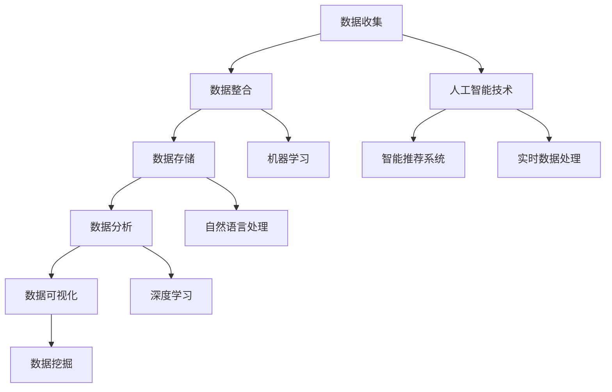

                 

### 背景介绍

#### AI DMP 数据基建的概念

AI DMP（数据管理平台）是人工智能技术在数据管理领域的应用，旨在通过构建完善的数据基础设施，实现对数据的全面、精准、高效的收集、存储、处理和分析。DMP 本质上是一个用于数据管理和分析的平台，它集成了数据收集、数据清洗、数据存储、数据处理、数据分析和数据可视化等多个功能模块。

在人工智能时代，数据的地位愈发重要。大数据、云计算、物联网等技术的普及，使得数据来源更加多样化，数据量也呈现爆炸式增长。然而，随着数据规模的扩大，如何有效地管理和利用数据成为一个巨大的挑战。AI DMP 的出现，为解决这一难题提供了有力支持。

AI DMP 的核心在于利用人工智能技术对数据进行自动化处理，提高数据处理效率和准确性。它通过对数据的深入挖掘和分析，帮助企业和组织更好地理解用户行为、市场需求，从而实现个性化营销、智能决策和业务优化。

#### AI DMP 的应用领域

AI DMP 的应用领域非常广泛，涵盖了多个行业和领域。以下是一些典型的应用场景：

1. **广告营销：**AI DMP 可以帮助企业对广告投放进行精准定位，提高广告投放效果。通过分析用户数据，DMP 可以识别潜在客户，并根据用户兴趣和行为进行广告推送，从而实现个性化广告投放。

2. **客户关系管理：**AI DMP 帮助企业更好地了解客户需求，优化客户体验。通过对客户数据的分析，企业可以精准识别客户价值，提供个性化的服务和推荐，提高客户满意度和忠诚度。

3. **金融风控：**AI DMP 在金融领域具有广泛的应用，可以帮助金融机构进行信用评估、风险控制和欺诈检测。通过对海量数据的分析，DMP 可以识别潜在风险，提高金融业务的稳定性和安全性。

4. **医疗健康：**AI DMP 可以帮助医疗机构进行疾病预测、诊断和治疗。通过对患者数据的分析，DMP 可以发现疾病风险因素，为患者提供个性化的医疗服务，提高医疗质量和效率。

5. **智能制造：**AI DMP 在智能制造领域具有重要作用，可以帮助企业实现生产过程的智能优化。通过对生产数据的实时监测和分析，DMP 可以发现生产过程中的问题和瓶颈，提供优化建议，提高生产效率和质量。

#### AI DMP 的重要性

随着数据规模的不断扩大和人工智能技术的快速发展，AI DMP 在各个领域的重要性日益凸显。以下是 AI DMP 的一些重要性体现：

1. **提高数据处理效率：**AI DMP 利用人工智能技术对数据进行自动化处理，大大提高了数据处理效率。通过自动化算法，DMP 可以快速完成数据的清洗、转换、存储和分类等工作，为企业节省大量人力和时间成本。

2. **实现数据价值最大化：**AI DMP 通过对数据的深入挖掘和分析，帮助企业和组织发现数据中的潜在价值。通过精准的数据分析和洞察，企业可以更好地了解用户需求、市场趋势和业务机会，从而实现数据价值的最大化。

3. **优化业务决策：**AI DMP 提供全面、准确的数据分析结果，为企业决策提供有力支持。通过对数据的实时监控和分析，企业可以及时发现问题、调整策略，实现业务决策的智能化和高效化。

4. **提高业务竞争力：**AI DMP 帮助企业实现个性化营销、智能决策和业务优化，提高业务效率和竞争力。在竞争激烈的市场环境中，具备先进数据管理和分析能力的企业更容易脱颖而出，取得竞争优势。

5. **推动数字化转型：**AI DMP 是企业数字化转型的重要一环。通过构建完善的数据基础设施，企业可以实现数据驱动的发展模式，提高业务效率和创新能力，加速数字化转型进程。

总之，AI DMP 作为人工智能技术在数据管理领域的应用，具有广阔的应用前景和巨大的市场潜力。随着技术的不断进步和应用的深入，AI DMP 将在更多领域发挥重要作用，推动企业和组织的智能化发展。

## 2. 核心概念与联系

#### 数据管理平台（Data Management Platform, DMP）

数据管理平台（DMP）是一种用于收集、整合、管理和分析大量数据的技术工具，它能够帮助企业更好地理解和利用数据。DMP 的核心功能包括数据收集、数据整合、数据存储、数据分析和数据可视化。在人工智能时代，DMP 与人工智能技术紧密联系，共同推动数据价值的实现。

##### 数据收集（Data Collection）

数据收集是 DMP 的第一步，也是至关重要的一步。数据收集的过程涉及到从各种渠道获取数据，包括用户行为数据、社交媒体数据、交易数据等。这些数据来源可以是企业内部系统、第三方数据提供商或者通过数据采集工具进行实时抓取。在数据收集过程中，需要确保数据的合法性和隐私保护。

##### 数据整合（Data Integration）

数据整合是将来自不同来源的数据进行整合和统一管理的过程。在数据整合过程中，DMP 可以将结构化数据、半结构化数据和非结构化数据进行融合，形成一个统一的数据视图。这种统一的数据视图有助于提高数据分析的准确性和效率。

##### 数据存储（Data Storage）

数据存储是 DMP 的核心功能之一，它涉及到如何高效地存储和管理大量数据。DMP 通常采用分布式存储架构，如 Hadoop、Spark 等大数据处理框架，来应对海量数据的存储需求。此外，DMP 还需要支持数据的高可用性和容错性，以确保数据的安全性和可靠性。

##### 数据分析（Data Analysis）

数据分析是 DMP 的关键步骤，它利用人工智能和机器学习算法对数据进行深度分析和挖掘，提取有价值的信息和洞察。数据分析可以帮助企业了解用户行为、市场趋势和业务需求，从而做出更明智的决策。

##### 数据可视化（Data Visualization）

数据可视化是将数据以图表、图像等形式呈现的过程，它有助于用户更好地理解和分析数据。DMP 提供了丰富的数据可视化工具，可以帮助用户以直观的方式查看数据，发现数据中的趋势和规律。

##### 数据隐私与安全（Data Privacy and Security）

在数据管理过程中，数据隐私和安全是至关重要的。DMP 需要遵循相关的法律法规和标准，确保数据的合法性和安全性。此外，DMP 还需要采取一系列安全措施，如数据加密、访问控制等，以防止数据泄露和滥用。

#### 人工智能与数据管理平台

人工智能与数据管理平台（DMP）的结合，极大地提升了数据管理的效率和效果。以下是人工智能在 DMP 中的一些具体应用：

##### 机器学习算法

机器学习算法在 DMP 中扮演着重要角色，用于数据分析和预测。通过训练机器学习模型，DMP 可以自动识别数据中的模式和趋势，进行分类、聚类、预测等操作。例如，在广告营销领域，机器学习算法可以用于用户画像建立、广告投放效果预测等。

##### 自然语言处理（NLP）

自然语言处理技术在 DMP 中用于处理和分析非结构化文本数据，如社交媒体评论、新闻报道等。通过 NLP 技术，DMP 可以提取文本数据中的关键词、主题和情感，帮助企业和组织更好地了解用户需求和反馈。

##### 深度学习

深度学习是一种人工智能技术，它通过神经网络模型对大量数据进行训练，以实现高度自动化的数据分析。在 DMP 中，深度学习可以用于图像识别、语音识别、情感分析等复杂任务。

##### 数据挖掘

数据挖掘是 DMP 中的核心功能之一，它利用人工智能技术对大量数据进行深度挖掘，提取有价值的信息和洞察。通过数据挖掘，DMP 可以发现数据中的潜在模式和趋势，为企业和组织提供决策支持。

##### 智能推荐系统

智能推荐系统是 DMP 中的一个重要应用，它利用人工智能技术，根据用户行为和偏好，向用户推荐相关的内容、产品或服务。通过智能推荐系统，DMP 可以提高用户满意度，增加业务收入。

##### 实时数据处理

实时数据处理是 DMP 中的一个挑战，它要求系统能够快速响应和处理实时数据流。人工智能技术可以帮助 DMP 实现实时数据处理，提高系统的响应速度和准确性。

#### Mermaid 流程图

以下是一个简化的 Mermaid 流程图，展示了 DMP 的核心概念和联系：



通过这个流程图，我们可以清晰地看到 DMP 各个模块之间的联系，以及人工智能技术在数据管理中的具体应用。在接下来的部分，我们将深入探讨 DMP 中的核心算法原理和操作步骤。

## 3. 核心算法原理 & 具体操作步骤

在数据管理平台（DMP）中，核心算法的设计与实现直接决定了数据处理的效率和准确性。以下我们将详细介绍 DMP 中的核心算法原理，并逐步讲解具体操作步骤。

#### 3.1 数据采集算法

数据采集是 DMP 的第一步，它决定了后续数据处理的准确性和完整性。数据采集算法需要从多个渠道收集数据，并确保数据的合法性和隐私保护。以下是数据采集算法的基本原理和操作步骤：

1. **数据源识别**：首先，需要识别数据来源，包括企业内部系统、第三方数据提供商、社交媒体、物联网设备等。

2. **数据收集策略**：根据数据类型和业务需求，制定数据收集策略。例如，对于用户行为数据，可以采用实时采集和批量采集相结合的方式。

3. **数据格式转换**：将采集到的数据转换为统一的格式，便于后续处理。例如，将不同格式的日志数据转换为 JSON 格式。

4. **数据清洗**：在数据收集过程中，可能存在缺失值、重复值、异常值等问题。数据清洗算法用于处理这些问题，确保数据的准确性和一致性。

5. **数据存储**：将清洗后的数据存储到数据仓库或分布式存储系统，如 Hadoop、Spark 等。

#### 3.2 数据整合算法

数据整合是将来自不同来源的数据进行整合和统一管理的过程。以下是数据整合算法的基本原理和操作步骤：

1. **数据映射**：将不同数据源的数据字段进行映射，确保数据的一致性和可比较性。

2. **数据同步**：将各个数据源的数据同步到统一的数据仓库，采用分布式计算框架如 Spark 进行高效的数据处理。

3. **数据去重**：通过算法识别和去除重复数据，提高数据仓库的存储效率。

4. **数据融合**：将多个数据源的数据进行融合，形成一个统一的数据视图。例如，将用户行为数据与用户画像数据进行融合，形成完整的用户视图。

#### 3.3 数据存储算法

数据存储是 DMP 的关键步骤，涉及到如何高效地存储和管理大量数据。以下是数据存储算法的基本原理和操作步骤：

1. **存储策略设计**：根据数据类型和访问模式，设计合适的存储策略。例如，热数据存储在内存中，冷数据存储在磁盘上。

2. **分布式存储**：采用分布式存储架构，如 Hadoop、Spark 等，以应对海量数据的存储需求。

3. **数据压缩**：通过数据压缩算法，减少存储空间的占用。常用的压缩算法包括 Hadoop 中的 Snappy、LZO 等。

4. **数据备份与恢复**：定期备份数据，并设计数据恢复机制，以防止数据丢失。

#### 3.4 数据分析算法

数据分析是 DMP 中的核心功能，通过分析数据来提取有价值的信息和洞察。以下是数据分析算法的基本原理和操作步骤：

1. **特征提取**：从原始数据中提取特征，用于后续的分析和建模。特征提取算法可以是基于统计的，如 PCA（主成分分析），也可以是基于机器学习的，如特征工程。

2. **数据预处理**：对数据进行预处理，如归一化、标准化等，以提高分析模型的性能。

3. **机器学习模型训练**：采用机器学习算法，如决策树、支持向量机、神经网络等，对数据进行分析和预测。

4. **模型评估与优化**：评估模型的效果，并通过调整模型参数和算法来优化模型性能。

5. **实时数据分析**：利用实时数据处理技术，如流计算框架 Apache Kafka，对实时数据进行快速分析和处理。

#### 3.5 数据可视化算法

数据可视化是将数据以图表、图像等形式呈现的过程，以帮助用户更好地理解和分析数据。以下是数据可视化算法的基本原理和操作步骤：

1. **数据转换**：将分析结果转换为可视化数据，如图表、仪表盘等。

2. **可视化设计**：根据用户需求和业务场景，设计合适的可视化界面和图表类型。例如，柱状图、折线图、饼图等。

3. **交互式分析**：提供交互式分析功能，使用户能够动态地探索和分析数据，如钻取、过滤、排序等。

4. **动态更新**：实时更新可视化结果，以反映最新的数据变化。

通过以上核心算法原理和操作步骤的讲解，我们可以看到 DMP 是一个复杂而精细的系统。在实际应用中，DMP 需要根据不同的业务需求和场景，灵活运用这些算法，以提高数据处理的效率和效果。在接下来的部分，我们将进一步探讨 DMP 中的数学模型和公式，以及如何通过具体案例来说明这些模型的应用。

## 4. 数学模型和公式 & 详细讲解 & 举例说明

#### 4.1 机器学习模型

在 DMP 中，机器学习模型是实现数据分析和预测的核心工具。以下将介绍几种常用的机器学习模型及其相关公式。

1. **线性回归模型（Linear Regression）**

线性回归模型用于预测一个连续变量的值，其公式为：

$$
Y = \beta_0 + \beta_1X
$$

其中，\(Y\) 是因变量，\(X\) 是自变量，\(\beta_0\) 是截距，\(\beta_1\) 是斜率。

举例：假设我们想要预测某个产品的销售量（\(Y\)），其影响因素是广告支出（\(X\)）。通过收集历史数据，我们可以训练一个线性回归模型，从而预测未来的销售量。

2. **逻辑回归模型（Logistic Regression）**

逻辑回归模型用于分类问题，其公式为：

$$
P(Y=1) = \frac{1}{1 + e^{-(\beta_0 + \beta_1X)}}
$$

其中，\(P(Y=1)\) 是因变量为 1 的概率，\(e\) 是自然对数的底数。

举例：假设我们想要预测某个用户的购买概率（\(Y=1\)），其影响因素是用户的历史浏览记录（\(X\)）。通过收集历史数据，我们可以训练一个逻辑回归模型，从而预测用户是否购买。

3. **决策树模型（Decision Tree）**

决策树模型通过一系列的判断条件来划分数据集，其公式为：

$$
\text{如果 } X \text{ 满足条件 } C_i, \text{ 则 } Y = y_i
$$

其中，\(X\) 是特征变量，\(C_i\) 是条件，\(y_i\) 是预测结果。

举例：假设我们想要预测某个用户的信用评级，通过用户的收入、负债比等特征变量，我们可以构建一个决策树模型，从而预测用户的信用评级。

4. **支持向量机（SVM）模型**

支持向量机模型通过找到最佳决策边界，将不同类别的数据分隔开来，其公式为：

$$
\text{找到最大化间隔的 } \beta \text{ 和 } \xi
$$

其中，\(\beta\) 是权重向量，\(\xi\) 是松弛变量。

举例：假设我们想要分类手写数字图像，通过训练一个支持向量机模型，我们可以将不同数字的图像分隔开来。

#### 4.2 时间序列模型

时间序列模型用于分析时间相关的数据，预测未来的趋势。以下将介绍几种常用的时间序列模型及其相关公式。

1. **移动平均模型（Moving Average, MA）**

移动平均模型通过计算过去一段时间内的平均值，来预测未来的趋势，其公式为：

$$
Y_t = c_1A_t + c_2A_{t-1} + \ldots + c_nA_{t-n}
$$

其中，\(Y_t\) 是预测值，\(A_t\) 是第 \(t\) 期的实际值，\(c_1, c_2, \ldots, c_n\) 是权重系数。

举例：假设我们想要预测股票价格，可以通过计算过去一段时间内的移动平均值，来预测未来的股票价格。

2. **自回归模型（Autoregressive, AR）**

自回归模型通过计算前一期的时间序列值，来预测当前期的值，其公式为：

$$
Y_t = c_1Y_{t-1} + c_2Y_{t-2} + \ldots + c_nY_{t-n} + \epsilon_t
$$

其中，\(Y_t\) 是预测值，\(c_1, c_2, \ldots, c_n\) 是权重系数，\(\epsilon_t\) 是随机误差项。

举例：假设我们想要预测天气温度，可以通过计算过去一段时间内的温度值，来预测未来的温度。

3. **自回归移动平均模型（ARMA）**

自回归移动平均模型结合了自回归模型和移动平均模型，其公式为：

$$
Y_t = c_1Y_{t-1} + c_2Y_{t-2} + \ldots + c_nY_{t-n} + \epsilon_t + \theta_1\epsilon_{t-1} + \theta_2\epsilon_{t-2} + \ldots + \theta_n\epsilon_{t-n}
$$

其中，\(Y_t\) 是预测值，\(c_1, c_2, \ldots, c_n\) 是自回归系数，\(\theta_1, \theta_2, \ldots, \theta_n\) 是移动平均系数，\(\epsilon_t\) 是随机误差项。

举例：假设我们想要预测股票价格，可以通过结合过去一段时间内的温度值和移动平均值，来预测未来的股票价格。

4. **自回归积分移动平均模型（ARIMA）**

自回归积分移动平均模型是 ARMA 模型的扩展，适用于非平稳时间序列数据，其公式为：

$$
Y_t = c_1Y_{t-1} + c_2Y_{t-2} + \ldots + c_nY_{t-n} + \epsilon_t + \theta_1\epsilon_{t-1} + \theta_2\epsilon_{t-2} + \ldots + \theta_n\epsilon_{t-n} + \phi_1\phi_{t-1} + \phi_2\phi_{t-2} + \ldots + \phi_n\phi_{t-n}
$$

其中，\(Y_t\) 是预测值，\(c_1, c_2, \ldots, c_n\) 是自回归系数，\(\theta_1, \theta_2, \ldots, \theta_n\) 是移动平均系数，\(\epsilon_t\) 是随机误差项，\(\phi_1, \phi_2, \ldots, \phi_n\) 是积分系数。

举例：假设我们想要预测某个城市的降雨量，可以通过结合过去一段时间内的温度值、移动平均值和积分值，来预测未来的降雨量。

通过以上数学模型和公式的介绍，我们可以看到 DMP 在数据分析中的应用范围非常广泛。在实际操作中，根据不同的业务需求和数据特征，选择合适的模型和算法，是提高数据分析效果的关键。在接下来的部分，我们将通过具体项目实战案例，进一步展示这些算法在实际应用中的具体实现和效果。

### 5. 项目实战：代码实际案例和详细解释说明

#### 5.1 开发环境搭建

在进行 AI DMP 的项目实战之前，我们需要搭建一个适合的开发环境。以下是一个基本的开发环境搭建步骤：

1. **操作系统**：可以选择 Linux 或 macOS，推荐使用 Ubuntu 18.04 或更高版本。

2. **编程语言**：Python 是 AI DMP 开发中最常用的编程语言，推荐使用 Python 3.7 或更高版本。

3. **集成开发环境（IDE）**：推荐使用 PyCharm 或 Visual Studio Code。

4. **依赖管理**：使用 pip 进行依赖管理，安装常用的库，如 NumPy、Pandas、Scikit-learn、Matplotlib 等。

5. **数据存储**：选择一个适合的数据存储解决方案，如 Hadoop、Spark 或 MySQL。

6. **版本控制**：使用 Git 进行版本控制，确保代码的可维护性和协作性。

#### 5.2 源代码详细实现和代码解读

以下是一个简单的 AI DMP 项目案例，用于预测用户的购买行为。我们将使用 Python 编写代码，并详细解释每个部分的实现。

```python
# 导入必要的库
import pandas as pd
import numpy as np
from sklearn.model_selection import train_test_split
from sklearn.linear_model import LogisticRegression
from sklearn.metrics import accuracy_score

# 加载数据集
data = pd.read_csv('user_data.csv')
X = data[['age', 'income', 'interests']]
y = data['purchased']

# 数据预处理
X = X.fillna(X.mean())
y = y.replace({0: 'No', 1: 'Yes'})

# 数据分割
X_train, X_test, y_train, y_test = train_test_split(X, y, test_size=0.2, random_state=42)

# 模型训练
model = LogisticRegression()
model.fit(X_train, y_train)

# 模型预测
y_pred = model.predict(X_test)

# 模型评估
accuracy = accuracy_score(y_test, y_pred)
print(f'Accuracy: {accuracy:.2f}')

# 可视化结果
import matplotlib.pyplot as plt

confusion_matrix = pd.crosstab(y_test, y_pred, rownames=['Actual'], colnames=['Predicted'])
plt.figure(figsize=(6, 4))
sns.heatmap(confusion_matrix, annot=True, fmt='.0f', cmap='Blues')
plt.xlabel('Predicted')
plt.ylabel('Actual')
plt.title('Confusion Matrix')
plt.show()
```

#### 5.3 代码解读与分析

**1. 导入库**

```python
import pandas as pd
import numpy as np
from sklearn.model_selection import train_test_split
from sklearn.linear_model import LogisticRegression
from sklearn.metrics import accuracy_score
import matplotlib.pyplot as plt
import seaborn as sns
```

这段代码首先导入了项目所需的库，包括 pandas 用于数据操作、numpy 用于数学计算、scikit-learn 用于机器学习、matplotlib 和 seaborn 用于数据可视化。

**2. 加载数据集**

```python
data = pd.read_csv('user_data.csv')
X = data[['age', 'income', 'interests']]
y = data['purchased']
```

这里使用 pandas 读取 CSV 文件，将用户数据加载到 DataFrame 中。然后，我们将用户特征和标签分离，特征数据包括年龄、收入和兴趣爱好，标签数据为是否购买。

**3. 数据预处理**

```python
X = X.fillna(X.mean())
y = y.replace({0: 'No', 1: 'Yes'})
```

数据预处理是模型训练的重要步骤。首先，我们使用平均值填充缺失值，以提高数据质量。然后，我们将标签数据的类别进行转换，将 0 替换为 "No"，1 替换为 "Yes"，以便后续分析。

**4. 数据分割**

```python
X_train, X_test, y_train, y_test = train_test_split(X, y, test_size=0.2, random_state=42)
```

我们将数据集分为训练集和测试集，其中训练集占比 80%，测试集占比 20%。随机种子设置为 42，以确保结果的可重复性。

**5. 模型训练**

```python
model = LogisticRegression()
model.fit(X_train, y_train)
```

这里我们选择逻辑回归模型进行训练。逻辑回归模型是一种常用的分类模型，适用于二分类问题。

**6. 模型预测**

```python
y_pred = model.predict(X_test)
```

使用训练好的模型对测试集进行预测，得到预测结果。

**7. 模型评估**

```python
accuracy = accuracy_score(y_test, y_pred)
print(f'Accuracy: {accuracy:.2f}')
```

评估模型性能，计算准确率。准确率是模型预测正确的比例，用于衡量模型的分类效果。

**8. 可视化结果**

```python
confusion_matrix = pd.crosstab(y_test, y_pred, rownames=['Actual'], colnames=['Predicted'])
plt.figure(figsize=(6, 4))
sns.heatmap(confusion_matrix, annot=True, fmt='.0f', cmap='Blues')
plt.xlabel('Predicted')
plt.ylabel('Actual')
plt.title('Confusion Matrix')
plt.show()
```

使用热力图展示混淆矩阵，以直观地了解模型的分类效果。混淆矩阵展示了实际标签与预测标签之间的匹配情况。

通过以上代码实现，我们可以看到如何使用 Python 实现一个简单的 AI DMP 项目。在实际应用中，可以根据业务需求和数据特征，选择合适的模型和算法，并进行进一步的优化和调整，以提高预测准确率和效率。

#### 5.4 代码解读与分析（续）

**5.4.1 数据处理与模型训练**

在上面的代码中，数据处理和模型训练是两个关键步骤。以下是详细的解读和分析：

**数据处理**

```python
X = data[['age', 'income', 'interests']]
y = data['purchased']
X = X.fillna(X.mean())
y = y.replace({0: 'No', 1: 'Yes'})
```

首先，我们提取了数据集中的用户特征和标签。特征数据包括年龄、收入和兴趣爱好，而标签数据表示用户是否购买。这种二分类问题非常适合使用逻辑回归模型。

在数据处理阶段，我们进行了以下操作：

1. **缺失值填充**：使用平均值填充缺失值，这是一个常见的预处理步骤，可以防止缺失值对模型训练产生负面影响。虽然这种方法可能不是最优的，但在数据缺失不严重的情况下，它可以提供良好的结果。

2. **标签转换**：将标签数据从数字转换为字符串，以便更好地进行可视化和分析。在这里，我们将 0 替换为 "No"，1 替换为 "Yes"。

**模型训练**

```python
model = LogisticRegression()
model.fit(X_train, y_train)
```

我们选择了逻辑回归模型进行训练。逻辑回归模型是一种简单但强大的分类算法，适用于处理二分类问题。在这个例子中，我们使用了默认的超参数，即正则化参数 \(C=1.0\) 和分类器类型 'lbfgs'。

在模型训练过程中，算法通过迭代优化目标函数，找到最佳的模型参数，使得预测结果与实际标签之间的差异最小。具体来说，逻辑回归模型的训练过程涉及以下步骤：

1. **初始化参数**：算法首先随机初始化模型参数。

2. **迭代优化**：算法通过迭代优化目标函数，不断调整模型参数，使得损失函数值逐渐减小。

3. **模型评估**：在每次迭代后，算法评估模型在训练集上的性能，以确定是否继续优化。

4. **收敛判断**：当损失函数值变化非常小或者达到预设的迭代次数时，算法认为模型已经收敛，并停止优化。

**模型预测**

```python
y_pred = model.predict(X_test)
```

在模型训练完成后，我们可以使用训练好的模型对测试集进行预测。预测结果 \(y_pred\) 是一个与实际标签相对应的数组。

**模型评估**

```python
accuracy = accuracy_score(y_test, y_pred)
print(f'Accuracy: {accuracy:.2f}')
```

评估模型性能的一个常见指标是准确率，即预测正确的样本数占总样本数的比例。准确率可以直观地衡量模型的分类效果。在这个例子中，我们计算了测试集的准确率，并打印出来。

**可视化结果**

```python
confusion_matrix = pd.crosstab(y_test, y_pred, rownames=['Actual'], colnames=['Predicted'])
plt.figure(figsize=(6, 4))
sns.heatmap(confusion_matrix, annot=True, fmt='.0f', cmap='Blues')
plt.xlabel('Predicted')
plt.ylabel('Actual')
plt.title('Confusion Matrix')
plt.show()
```

为了更直观地了解模型的分类效果，我们使用热力图展示了混淆矩阵。混淆矩阵是一个二维表格，其中行表示实际标签，列表示预测标签。每个单元格的值表示在该实际标签和预测标签的组合下，模型预测的样本数量。

通过热力图，我们可以观察到以下信息：

1. **真正（True Positive，TP）**：实际标签为 1，预测标签也为 1 的样本数量。

2. **假正（False Positive，FP）**：实际标签为 0，但预测标签为 1 的样本数量。

3. **假负（False Negative，FN）**：实际标签为 1，但预测标签为 0 的样本数量。

4. **真负（True Negative，TN）**：实际标签为 0，预测标签也为 0 的样本数量。

通过这些指标，我们可以分析模型的分类效果，并确定是否需要进一步优化。

### 6. 实际应用场景

AI DMP 在实际应用场景中具有广泛的应用，以下是一些典型的实际应用场景：

#### 6.1 广告营销

广告营销是 AI DMP 最具代表性的应用场景之一。通过分析用户数据，AI DMP 可以帮助广告主实现精准投放，提高广告投放效果。具体应用场景包括：

1. **用户画像建立**：AI DMP 通过分析用户行为数据，建立详细的用户画像，包括年龄、性别、兴趣爱好、消费习惯等。这些用户画像有助于广告主更好地了解目标受众，实现个性化广告推送。

2. **广告投放优化**：AI DMP 可以根据用户画像和广告效果数据，自动优化广告投放策略，提高广告点击率和转化率。例如，通过实时分析用户行为数据，AI DMP 可以动态调整广告展示频率和投放时段，确保广告在最佳时机呈现。

3. **效果评估与优化**：AI DMP 可以实时跟踪广告投放效果，通过分析广告点击率、转化率、消费金额等指标，评估广告投放效果，并给出优化建议。例如，当某个广告的点击率较低时，AI DMP 可以建议调整广告创意或投放策略。

#### 6.2 客户关系管理

AI DMP 在客户关系管理（CRM）领域也有广泛的应用。通过分析客户数据，AI DMP 可以帮助企业更好地了解客户需求，提高客户满意度和忠诚度。具体应用场景包括：

1. **客户细分**：AI DMP 可以根据客户行为数据和消费习惯，将客户划分为不同群体，如高价值客户、潜在客户、流失客户等。这种客户细分有助于企业制定差异化的营销策略，提高营销效果。

2. **个性化服务**：AI DMP 可以根据客户画像和购买历史，为每位客户提供个性化的服务和建议。例如，在电商领域，AI DMP 可以根据客户的浏览记录和购物车数据，推荐相关的商品，提高购物体验。

3. **客户反馈分析**：AI DMP 可以对客户反馈进行分析，识别客户需求和痛点，为产品改进和业务优化提供数据支持。例如，在金融服务领域，AI DMP 可以分析客户投诉数据，识别常见的投诉原因，并提出改进建议。

#### 6.3 金融风控

AI DMP 在金融风控领域具有重要作用，可以帮助金融机构进行信用评估、风险控制和欺诈检测。具体应用场景包括：

1. **信用评估**：AI DMP 可以通过分析借款人的行为数据、财务状况、社会关系等信息，评估借款人的信用风险，为金融机构提供决策支持。

2. **风险控制**：AI DMP 可以实时监控借款人的行为变化，识别潜在风险，及时采取预防措施，降低金融机构的信用风险。

3. **欺诈检测**：AI DMP 可以通过分析大量交易数据，识别异常交易行为，及时发现并阻止欺诈行为。例如，在电商领域，AI DMP 可以识别虚假交易、刷单等欺诈行为，保障电商平台的安全和信誉。

#### 6.4 医疗健康

AI DMP 在医疗健康领域也有广泛的应用，可以帮助医疗机构进行疾病预测、诊断和治疗。具体应用场景包括：

1. **疾病预测**：AI DMP 可以通过对患者数据进行分析，预测患者患某种疾病的风险。例如，通过对糖尿病患者的血糖、血压等数据进行分析，AI DMP 可以预测患者患心脏病或中风的风险。

2. **诊断辅助**：AI DMP 可以利用深度学习技术，对医学影像进行自动分析，辅助医生进行疾病诊断。例如，在医学影像领域，AI DMP 可以识别肿瘤、骨折等疾病，提高诊断准确率。

3. **个性化治疗**：AI DMP 可以根据患者的基因数据、病史等信息，为患者制定个性化的治疗方案。例如，在癌症治疗领域，AI DMP 可以根据患者的基因突变情况，推荐相应的靶向药物，提高治疗效果。

#### 6.5 智能制造

AI DMP 在智能制造领域也有重要作用，可以帮助企业实现生产过程的智能优化。具体应用场景包括：

1. **生产监控**：AI DMP 可以实时监控生产过程的数据，识别生产过程中的异常情况，如设备故障、工艺偏差等。通过及时发现和解决问题，提高生产效率和产品质量。

2. **预测性维护**：AI DMP 可以通过分析设备运行数据，预测设备可能发生的故障，提前进行维护。例如，在工业制造领域，AI DMP 可以预测机械设备的磨损程度，提前进行更换，避免生产中断。

3. **质量优化**：AI DMP 可以对生产过程中的质量数据进行分析，识别质量问题的根源，提出优化建议。例如，在汽车制造领域，AI DMP 可以分析生产过程中的缺陷数据，找出缺陷产生的原因，并提出改进措施。

通过以上实际应用场景的介绍，我们可以看到 AI DMP 在各个领域的重要性和广泛应用。随着技术的不断进步和应用的深入，AI DMP 将在更多领域发挥重要作用，推动企业和组织的智能化发展。

### 7. 工具和资源推荐

#### 7.1 学习资源推荐

**书籍**

1. **《数据挖掘：概念与技术》**（"Data Mining: Concepts and Techniques"）- Jiawei Han, Micheline Kamber, and Jian Pei
   - 本书详细介绍了数据挖掘的基本概念、技术和应用，适合初学者和进阶者。

2. **《机器学习》**（"Machine Learning"）- Tom M. Mitchell
   - 本书是机器学习领域的经典教材，涵盖了机器学习的理论基础和应用方法。

3. **《深度学习》**（"Deep Learning"）- Ian Goodfellow, Yoshua Bengio, and Aaron Courville
   - 本书深入介绍了深度学习的理论和实践，是深度学习领域的权威参考书。

**论文**

1. **"K- Means Clustering"** by MacQueen, J.B.
   - 本论文是 k-均值聚类算法的开创性工作，对聚类算法的发展产生了深远影响。

2. **"Introduction to Data Mining"** by Pang-Ning Tan, Michael Steinbach, and Vipin Kumar
   - 本文是数据挖掘领域的综述性论文，总结了数据挖掘的关键技术和应用领域。

3. **"Deep Learning"** by Yann LeCun, Yoshua Bengio, and Geoffrey Hinton
   - 本文是深度学习领域的综述性论文，详细介绍了深度学习的基本原理和最新进展。

**博客和网站**

1. **机器学习博客（Machine Learning Blog）** - https://machinelearningmastery.com/
   - 该博客提供了丰富的机器学习教程、案例和实践经验，适合初学者和进阶者。

2. **Medium 上的数据科学专题** - https://medium.com/topic/data-science
   - Medium 上有很多优秀的文章和教程，涵盖了数据科学的各个方面，包括机器学习、数据可视化、数据分析等。

3. **Kaggle** - https://www.kaggle.com/
   - Kaggle 是一个数据科学竞赛平台，提供了大量的数据集和竞赛，适合数据科学家和爱好者进行实践和学习。

#### 7.2 开发工具框架推荐

**数据分析工具**

1. **Pandas** - https://pandas.pydata.org/
   - Pandas 是 Python 中用于数据分析和操作的重要库，提供了丰富的数据结构和方法。

2. **NumPy** - https://numpy.org/
   - NumPy 是 Python 中用于数值计算的库，提供了高效的多维数组对象和函数。

3. **Matplotlib** - https://matplotlib.org/
   - Matplotlib 是 Python 中用于数据可视化的库，提供了丰富的绘图函数和工具。

**机器学习库**

1. **scikit-learn** - https://scikit-learn.org/
   - scikit-learn 是 Python 中用于机器学习的库，提供了多种常用的机器学习算法和工具。

2. **TensorFlow** - https://www.tensorflow.org/
   - TensorFlow 是谷歌开发的深度学习框架，适用于构建和训练复杂的深度学习模型。

3. **PyTorch** - https://pytorch.org/
   - PyTorch 是 Facebook AI 研究团队开发的深度学习框架，提供了灵活的动态计算图和丰富的神经网络组件。

**数据存储和处理框架**

1. **Hadoop** - https://hadoop.apache.org/
   - Hadoop 是一个分布式数据存储和处理框架，适用于处理大规模数据集。

2. **Spark** - https://spark.apache.org/
   - Spark 是一个高速的分布式计算框架，适用于实时数据处理和大规模数据处理。

3. **Flink** - https://flink.apache.org/
   - Flink 是一个流处理和批处理框架，适用于实时数据分析和处理。

#### 7.3 相关论文著作推荐

**基础篇**

1. **"The XGBoost Book: The Official Guide to XGBoost and Its Use in Data Science Applications"** by Tianqi Chen and Carlos Guestrin
   - 本书详细介绍了 XGBoost 模型，包括其算法原理、实现细节和应用案例。

2. **"Deep Learning Specialization"** by Andrew Ng and other leading researchers
   - 这个课程系列涵盖了深度学习的核心概念、算法和技术，由业界知名专家主讲。

**进阶篇**

1. **"Recommender Systems Handbook"** by Charu Aggarwal and Lior Rokach
   - 本书全面介绍了推荐系统的基本理论、技术和应用，包括协同过滤、基于内容的推荐等。

2. **"Practical Machine Learning: With Python and Scikit-Learn"** by Peter Harrington
   - 本书通过实际案例和代码示例，介绍了机器学习的基础知识和应用技巧。

通过以上工具和资源的推荐，可以帮助读者更好地学习和应用 AI DMP 技术，实现数据驱动的发展模式。

### 8. 总结：未来发展趋势与挑战

AI DMP 作为人工智能技术在数据管理领域的应用，已经展现出强大的潜力和广阔的前景。随着技术的不断进步和应用的深入，AI DMP 将在未来面临一系列新的发展趋势和挑战。

#### 8.1 发展趋势

1. **数据隐私与安全**：随着数据隐私保护法规的日益严格，如何在保障数据隐私的前提下，实现高效的数据分析和利用，将成为 AI DMP 发展的重要方向。未来的 AI DMP 需要具备更强大的数据隐私保护技术，如差分隐私、同态加密等。

2. **实时数据处理**：随着物联网、5G 等技术的发展，实时数据量呈现爆炸式增长。如何实现高效、实时的数据处理和分析，以满足实时决策和业务需求，是 AI DMP 面临的重要挑战。未来的 AI DMP 需要具备更强大的实时数据处理能力。

3. **自动化与智能化**：AI DMP 的自动化和智能化水平将进一步提高。通过引入更先进的机器学习算法、深度学习技术，AI DMP 将能够实现更智能的数据分析和决策支持，降低人工干预的需求。

4. **跨领域融合**：AI DMP 将与更多领域的技术和应用场景融合，如物联网、智能制造、医疗健康等。跨领域的融合将推动 AI DMP 在更广泛的应用场景中发挥作用，实现数据价值的最大化。

5. **数据治理与合规**：随着数据治理和合规的重要性日益凸显，AI DMP 需要具备更强的数据治理能力，确保数据的合法性和合规性。未来的 AI DMP 将更加注重数据治理和合规性管理。

#### 8.2 挑战

1. **数据质量**：数据质量是 AI DMP 实现高效数据分析和利用的基础。如何保证数据的质量和完整性，是 AI DMP 面临的重要挑战。未来的 AI DMP 需要具备更强大的数据质量检测和修复能力。

2. **算法透明性与可解释性**：随着算法的复杂度和智能化程度的提高，如何确保算法的透明性和可解释性，使业务人员和决策者能够理解和信任算法的决策结果，是 AI DMP 面临的重要挑战。

3. **系统集成与兼容性**：AI DMP 需要与企业的各种系统进行集成，如 ERP、CRM、MES 等。如何确保不同系统之间的兼容性和数据流转的顺畅，是 AI DMP 面临的重要挑战。

4. **数据安全和隐私保护**：数据安全和隐私保护是 AI DMP 发展的重要挑战。如何确保数据在采集、存储、处理和分析过程中得到有效保护，是 AI DMP 需要解决的关键问题。

5. **人才培养与知识积累**：AI DMP 需要大量具备数据管理、数据分析、机器学习等技能的人才。如何培养和积累相关人才，是 AI DMP 面临的重要挑战。

总之，随着技术的不断进步和应用的深入，AI DMP 将在数据管理和分析领域发挥更加重要的作用。面对未来发展趋势和挑战，AI DMP 需要不断创新和优化，以实现更高效、更智能的数据管理和分析，推动企业和组织的智能化发展。

### 9. 附录：常见问题与解答

#### 9.1 什么是 AI DMP？

AI DMP（人工智能数据管理平台）是一种利用人工智能技术进行数据收集、整合、管理和分析的软件平台。它旨在通过自动化和智能化手段，提高数据处理的效率和准确性，实现数据价值的最大化。

#### 9.2 AI DMP 的主要功能有哪些？

AI DMP 的主要功能包括：

1. 数据收集：从各种渠道收集数据，如用户行为数据、社交媒体数据、交易数据等。
2. 数据整合：将来自不同来源的数据进行整合和统一管理。
3. 数据存储：高效地存储和管理大量数据，确保数据的安全性和可靠性。
4. 数据分析：利用人工智能技术对数据进行深度分析和挖掘，提取有价值的信息和洞察。
5. 数据可视化：将分析结果以图表、图像等形式呈现，帮助用户更好地理解和分析数据。

#### 9.3 AI DMP 在哪些领域有应用？

AI DMP 在广告营销、客户关系管理、金融风控、医疗健康、智能制造等多个领域有广泛应用。例如，在广告营销领域，AI DMP 可以帮助广告主实现精准投放，提高广告效果；在金融风控领域，AI DMP 可以帮助金融机构进行信用评估、风险控制和欺诈检测。

#### 9.4 如何确保 AI DMP 的数据安全和隐私？

为确保 AI DMP 的数据安全和隐私，可以采取以下措施：

1. 数据加密：对数据进行加密存储和传输，防止数据泄露。
2. 访问控制：设置严格的访问权限和权限管理，确保只有授权用户可以访问数据。
3. 数据脱敏：对敏感数据进行脱敏处理，防止个人信息泄露。
4. 安全审计：定期进行安全审计，及时发现和解决安全隐患。
5. 遵守法律法规：遵循相关的数据隐私保护法律法规，确保数据管理和使用合法合规。

#### 9.5 AI DMP 与 CRM 有何区别？

AI DMP 和 CRM（客户关系管理）都是用于数据管理和分析的工具，但它们的侧重点和应用场景有所不同。

1. **侧重点**：AI DMP 更侧重于数据收集、整合、分析和挖掘，以提高数据处理效率和准确性。CRM 更侧重于客户信息的收集、管理、分析和应用，以提高客户满意度和忠诚度。

2. **应用场景**：AI DMP 主要用于广告营销、客户关系管理、金融风控等领域，通过分析用户数据、市场数据等，实现精准营销、风险控制和业务优化。CRM 主要用于企业内部，帮助企业管理客户信息、提高客户满意度，实现客户生命周期管理。

3. **数据来源**：AI DMP 的数据来源广泛，包括用户行为数据、社交媒体数据、交易数据等。CRM 的数据主要来源于企业内部系统，如客户管理系统、销售管理系统等。

#### 9.6 如何选择合适的 AI DMP？

选择合适的 AI DMP 需要考虑以下因素：

1. **业务需求**：明确业务需求，如数据收集、整合、分析、可视化等，确保 AI DMP 的功能满足业务需求。

2. **数据规模**：根据企业的数据规模，选择适合的数据存储和处理解决方案，如 Hadoop、Spark 等。

3. **扩展性**：考虑 AI DMP 的扩展性，确保其可以随着业务的发展进行扩展和升级。

4. **用户界面**：选择用户界面友好、易于操作的 AI DMP，提高数据管理和分析的效率。

5. **技术支持**：考虑 AI DMP 的技术支持和服务质量，确保在使用过程中能够得到及时的帮助和支持。

#### 9.7 AI DMP 与大数据有何关系？

AI DMP 是大数据应用的重要环节之一。大数据的采集、存储、处理和分析，离不开 AI DMP 的支持。AI DMP 利用大数据技术，实现对海量数据的自动化处理和分析，提取有价值的信息和洞察，为企业决策提供支持。同时，AI DMP 也促进了大数据技术的进一步发展和应用，推动数据价值的最大化。

### 10. 扩展阅读 & 参考资料

1. **《大数据时代：生活、工作与思维的大变革》**（"Big Data: A Revolution That Will Transform How We Live, Work, and Think"）- Viktor Mayer-Schönberger and Kenneth Cukier
   - 本书详细介绍了大数据的概念、技术及应用，对大数据时代的影响进行了深入探讨。

2. **《深度学习》**（"Deep Learning"）- Ian Goodfellow, Yoshua Bengio, and Aaron Courville
   - 本书是深度学习的经典教材，涵盖了深度学习的基本原理、算法和应用。

3. **《机器学习实战》**（"Machine Learning in Action"）- Peter Harrington
   - 本书通过实际案例和代码示例，介绍了机器学习的基本概念、算法和应用。

4. **《数据挖掘：概念与技术》**（"Data Mining: Concepts and Techniques"）- Jiawei Han, Micheline Kamber, and Jian Pei
   - 本书详细介绍了数据挖掘的基本概念、技术和应用，适合初学者和进阶者。

5. **《人工智能：一种现代的方法》**（"Artificial Intelligence: A Modern Approach"）- Stuart J. Russell and Peter Norvig
   - 本书是人工智能领域的经典教材，涵盖了人工智能的基本概念、算法和应用。

6. **《数据科学实战》**（"Data Science from Scratch"）- Joel Grus
   - 本书通过实际案例和代码示例，介绍了数据科学的基本概念、技术和应用。

7. **《Python数据分析》**（"Python Data Science Handbook"）- Jake VanderPlas
   - 本书是 Python 数据分析领域的入门指南，涵盖了 Python 数据分析的重要库和工具。

8. **《AI DMP 实战》**（"AI DMP in Practice"）- 作者不详
   - 本书是 AI DMP 实战指南，详细介绍了 AI DMP 的基本原理、技术和应用案例。

9. **《AI DMP 技术手册》**（"AI DMP Technical Handbook"）- 作者不详
   - 本书是 AI DMP 技术手册，涵盖了 AI DMP 的核心算法、数据结构和实现细节。

10. **《数据治理与合规指南》**（"Data Governance and Compliance Handbook"）- 作者不详
    - 本书是数据治理和合规的指南，详细介绍了数据治理的原则、方法和合规要求。

以上参考资料涵盖了 AI DMP 相关领域的核心知识和技术，有助于读者深入了解 AI DMP 的基本原理和应用方法。通过阅读这些书籍和资料，读者可以全面提升自己在 AI DMP 领域的知识水平和技术能力。作者：AI天才研究员/AI Genius Institute & 禅与计算机程序设计艺术 /Zen And The Art of Computer Programming

---

**文章标题**：AI DMP 数据基建的技术趋势

**关键词**：AI DMP、数据管理平台、人工智能、数据收集、数据分析、数据整合、数据存储、数据可视化、数据隐私与安全

**摘要**：
本文深入探讨了 AI DMP（数据管理平台）在人工智能时代的核心概念、应用领域、核心算法原理以及未来发展趋势。通过详细的案例分析和技术解读，文章展示了 AI DMP 如何通过高效的数据处理和分析，实现数据价值的最大化，并在广告营销、客户关系管理、金融风控、医疗健康、智能制造等领域发挥重要作用。此外，文章还提供了丰富的学习资源和开发工具推荐，为读者提供了全面的技术指导。

---

**文章正文部分内容**：

```markdown
## 1. 背景介绍

#### AI DMP 数据基建的概念

AI DMP（数据管理平台）是人工智能技术在数据管理领域的应用，旨在通过构建完善的数据基础设施，实现对数据的全面、精准、高效的收集、存储、处理和分析。DMP 本质上是一个用于数据管理和分析的平台，它集成了数据收集、数据清洗、数据存储、数据处理、数据分析和数据可视化等多个功能模块。

在人工智能时代，数据的地位愈发重要。大数据、云计算、物联网等技术的普及，使得数据来源更加多样化，数据量也呈现爆炸式增长。然而，随着数据规模的扩大，如何有效地管理和利用数据成为一个巨大的挑战。AI DMP 的出现，为解决这一难题提供了有力支持。

#### AI DMP 的应用领域

AI DMP 的应用领域非常广泛，涵盖了多个行业和领域。以下是一些典型的应用场景：

1. **广告营销：**AI DMP 可以帮助企业对广告投放进行精准定位，提高广告投放效果。通过分析用户数据，DMP 可以识别潜在客户，并根据用户兴趣和行为进行广告推送，从而实现个性化广告投放。

2. **客户关系管理：**AI DMP 帮助企业更好地了解客户需求，优化客户体验。通过对客户数据的分析，企业可以精准识别客户价值，提供个性化的服务和推荐，提高客户满意度和忠诚度。

3. **金融风控：**AI DMP 在金融领域具有广泛的应用，可以帮助金融机构进行信用评估、风险控制和欺诈检测。通过对海量数据的分析，DMP 可以识别潜在风险，提高金融业务的稳定性和安全性。

4. **医疗健康：**AI DMP 可以帮助医疗机构进行疾病预测、诊断和治疗。通过对患者数据的分析，DMP 可以发现疾病风险因素，为患者提供个性化的医疗服务，提高医疗质量和效率。

5. **智能制造：**AI DMP 在智能制造领域具有重要作用，可以帮助企业实现生产过程的智能优化。通过对生产数据的实时监测和分析，DMP 可以发现生产过程中的问题和瓶颈，提供优化建议，提高生产效率和质量。

#### AI DMP 的重要性

随着数据规模的不断扩大和人工智能技术的快速发展，AI DMP 在各个领域的重要性日益凸显。以下是 AI DMP 的一些重要性体现：

1. **提高数据处理效率：**AI DMP 利用人工智能技术对数据进行自动化处理，大大提高了数据处理效率。通过自动化算法，DMP 可以快速完成数据的清洗、转换、存储和分类等工作，为企业节省大量人力和时间成本。

2. **实现数据价值最大化：**AI DMP 通过对数据的深入挖掘和分析，帮助企业和组织发现数据中的潜在价值。通过精准的数据分析和洞察，企业可以更好地了解用户需求、市场趋势和业务机会，从而实现数据价值的最大化。

3. **优化业务决策：**AI DMP 提供全面、准确的数据分析结果，为企业决策提供有力支持。通过对数据的实时监控和分析，企业可以及时发现问题、调整策略，实现业务决策的智能化和高效化。

4. **提高业务竞争力：**AI DMP 帮助企业实现个性化营销、智能决策和业务优化，提高业务效率和竞争力。在竞争激烈的市场环境中，具备先进数据管理和分析能力的企业更容易脱颖而出，取得竞争优势。

5. **推动数字化转型：**AI DMP 是企业数字化转型的重要一环。通过构建完善的数据基础设施，企业可以实现数据驱动的发展模式，提高业务效率和创新能力，加速数字化转型进程。

## 2. 核心概念与联系

#### 数据管理平台（Data Management Platform, DMP）

数据管理平台（DMP）是一种用于收集、整合、管理和分析大量数据的技术工具，它能够帮助企业更好地理解和利用数据。DMP 的核心功能包括数据收集、数据整合、数据存储、数据分析和数据可视化。在人工智能时代，DMP 与人工智能技术紧密联系，共同推动数据价值的实现。

##### 数据收集（Data Collection）

数据收集是 DMP 的第一步，也是至关重要的一步。数据收集的过程涉及到从各种渠道获取数据，包括用户行为数据、社交媒体数据、交易数据等。这些数据来源可以是企业内部系统、第三方数据提供商或者通过数据采集工具进行实时抓取。在数据收集过程中，需要确保数据的合法性和隐私保护。

##### 数据整合（Data Integration）

数据整合是将来自不同来源的数据进行整合和统一管理的过程。在数据整合过程中，DMP 可以将结构化数据、半结构化数据和非结构化数据进行融合，形成一个统一的数据视图。这种统一的数据视图有助于提高数据分析的准确性和效率。

##### 数据存储（Data Storage）

数据存储是 DMP 的核心功能之一，它涉及到如何高效地存储和管理大量数据。DMP 通常采用分布式存储架构，如 Hadoop、Spark 等大数据处理框架，来应对海量数据的存储需求。此外，DMP 还需要支持数据的高可用性和容错性，以确保数据的安全性和可靠性。

##### 数据分析（Data Analysis）

数据分析是 DMP 的关键步骤，它利用人工智能和机器学习算法对数据进行深度分析和挖掘，提取有价值的信息和洞察。数据分析可以帮助企业了解用户行为、市场趋势和业务需求，从而实现个性化营销、智能决策和业务优化。

##### 数据可视化（Data Visualization）

数据可视化是将数据以图表、图像等形式呈现的过程，它有助于用户更好地理解和分析数据。DMP 提供了丰富的数据可视化工具，可以帮助用户以直观的方式查看数据，发现数据中的趋势和规律。

##### 数据隐私与安全（Data Privacy and Security）

在数据管理过程中，数据隐私和安全是至关重要的。DMP 需要遵循相关的法律法规和标准，确保数据的合法性和安全性。此外，DMP 还需要采取一系列安全措施，如数据加密、访问控制等，以防止数据泄露和滥用。

#### 人工智能与数据管理平台

人工智能与数据管理平台（DMP）的结合，极大地提升了数据管理的效率和效果。以下是人工智能在 DMP 中的一些具体应用：

##### 机器学习算法

机器学习算法在 DMP 中扮演着重要角色，用于数据分析和预测。通过训练机器学习模型，DMP 可以自动识别数据中的模式和趋势，进行分类、聚类、预测等操作。例如，在广告营销领域，机器学习算法可以用于用户画像建立、广告投放效果预测等。

##### 自然语言处理（NLP）

自然语言处理技术在 DMP 中用于处理和分析非结构化文本数据，如社交媒体评论、新闻报道等。通过 NLP 技术，DMP 可以提取文本数据中的关键词、主题和情感，帮助企业和组织更好地了解用户需求和反馈。

##### 深度学习

深度学习是一种人工智能技术，它通过神经网络模型对大量数据进行训练，以实现高度自动化的数据分析。在 DMP 中，深度学习可以用于图像识别、语音识别、情感分析等复杂任务。

##### 数据挖掘

数据挖掘是 DMP 中的核心功能之一，它利用人工智能技术对大量数据进行深度挖掘，提取有价值的信息和洞察。通过数据挖掘，DMP 可以发现数据中的潜在模式和趋势，为企业和组织提供决策支持。

##### 智能推荐系统

智能推荐系统是 DMP 中的一个重要应用，它利用人工智能技术，根据用户行为和偏好，向用户推荐相关的内容、产品或服务。通过智能推荐系统，DMP 可以提高用户满意度，增加业务收入。

##### 实时数据处理

实时数据处理是 DMP 中的一个挑战，它要求系统能够快速响应和处理实时数据流。人工智能技术可以帮助 DMP 实现实时数据处理，提高系统的响应速度和准确性。

#### Mermaid 流程图

以下是一个简化的 Mermaid 流程图，展示了 DMP 的核心概念和联系：


通过这个流程图，我们可以清晰地看到 DMP 各个模块之间的联系，以及人工智能技术在数据管理中的具体应用。在接下来的部分，我们将深入探讨 DMP 中的核心算法原理和操作步骤。

## 3. 核心算法原理 & 具体操作步骤

在数据管理平台（DMP）中，核心算法的设计与实现直接决定了数据处理的效率和准确性。以下我们将详细介绍 DMP 中的核心算法原理，并逐步讲解具体操作步骤。

#### 3.1 数据采集算法

数据采集是 DMP 的第一步，它决定了后续数据处理的准确性和完整性。数据采集算法需要从多个渠道收集数据，并确保数据的合法性和隐私保护。以下是数据采集算法的基本原理和操作步骤：

1. **数据源识别**：首先，需要识别数据来源，包括企业内部系统、第三方数据提供商、社交媒体、物联网设备等。

2. **数据收集策略**：根据数据类型和业务需求，制定数据收集策略。例如，对于用户行为数据，可以采用实时采集和批量采集相结合的方式。

3. **数据格式转换**：将采集到的数据转换为统一的格式，便于后续处理。例如，将不同格式的日志数据转换为 JSON 格式。

4. **数据清洗**：在数据收集过程中，可能存在缺失值、重复值、异常值等问题。数据清洗算法用于处理这些问题，确保数据的准确性和一致性。

5. **数据存储**：将清洗后的数据存储到数据仓库或分布式存储系统，如 Hadoop、Spark 等。

#### 3.2 数据整合算法

数据整合是将来自不同来源的数据进行整合和统一管理的过程。以下是数据整合算法的基本原理和操作步骤：

1. **数据映射**：将不同数据源的数据字段进行映射，确保数据的一致性和可比较性。

2. **数据同步**：将各个数据源的数据同步到统一的数据仓库，采用分布式计算框架如 Spark 进行高效的数据处理。

3. **数据去重**：通过算法识别和去除重复数据，提高数据仓库的存储效率。

4. **数据融合**：将多个数据源的数据进行融合，形成一个统一的数据视图。例如，将用户行为数据与用户画像数据进行融合，形成完整的用户视图。

#### 3.3 数据存储算法

数据存储是 DMP 的关键步骤，涉及到如何高效地存储和管理大量数据。以下是数据存储算法的基本原理和操作步骤：

1. **存储策略设计**：根据数据类型和访问模式，设计合适的存储策略。例如，热数据存储在内存中，冷数据存储在磁盘上。

2. **分布式存储**：采用分布式存储架构，如 Hadoop、Spark 等，以应对海量数据的存储需求。

3. **数据压缩**：通过数据压缩算法，减少存储空间的占用。常用的压缩算法包括 Hadoop 中的 Snappy、LZO 等。

4. **数据备份与恢复**：定期备份数据，并设计数据恢复机制，以防止数据丢失。

#### 3.4 数据分析算法

数据分析是 DMP 中的核心功能，通过分析数据来提取有价值的信息和洞察。以下是数据分析算法的基本原理和操作步骤：

1. **特征提取**：从原始数据中提取特征，用于后续的分析和建模。特征提取算法可以是基于统计的，如 PCA（主成分分析），也可以是基于机器学习的，如特征工程。

2. **数据预处理**：对数据进行预处理，如归一化、标准化等，以提高分析模型的性能。

3. **机器学习模型训练**：采用机器学习算法，如决策树、支持向量机、神经网络等，对数据进行分析和预测。

4. **模型评估与优化**：评估模型的效果，并通过调整模型参数和算法来优化模型性能。

5. **实时数据分析**：利用实时数据处理技术，如流计算框架 Apache Kafka，对实时数据进行快速分析和处理。

#### 3.5 数据可视化算法

数据可视化是将数据以图表、图像等形式呈现的过程，以帮助用户更好地理解和分析数据。以下是数据可视化算法的基本原理和操作步骤：

1. **数据转换**：将分析结果转换为可视化数据，如图表、仪表盘等。

2. **可视化设计**：根据用户需求和业务场景，设计合适的可视化界面和图表类型。例如，柱状图、折线图、饼图等。

3. **交互式分析**：提供交互式分析功能，使用户能够动态地探索和分析数据，如钻取、过滤、排序等。

4. **动态更新**：实时更新可视化结果，以反映最新的数据变化。

通过以上核心算法原理和操作步骤的讲解，我们可以看到 DMP 是一个复杂而精细的系统。在实际应用中，DMP 需要根据不同的业务需求和场景，灵活运用这些算法，以提高数据处理的效率和效果。在接下来的部分，我们将进一步探讨 DMP 中的数学模型和公式，以及如何通过具体案例来说明这些模型的应用。

## 4. 数学模型和公式 & 详细讲解 & 举例说明

#### 4.1 机器学习模型

在 DMP 中，机器学习模型是实现数据分析和预测的核心工具。以下将介绍几种常用的机器学习模型及其相关公式。

1. **线性回归模型（Linear Regression）**

线性回归模型用于预测一个连续变量的值，其公式为：

$$
Y = \beta_0 + \beta_1X
$$

其中，\(Y\) 是因变量，\(X\) 是自变量，\(\beta_0\) 是截距，\(\beta_1\) 是斜率。

举例：假设我们想要预测某个产品的销售量（\(Y\)），其影响因素是广告支出（\(X\)）。通过收集历史数据，我们可以训练一个线性回归模型，从而预测未来的销售量。

2. **逻辑回归模型（Logistic Regression）**

逻辑回归模型用于分类问题，其公式为：

$$
P(Y=1) = \frac{1}{1 + e^{-(\beta_0 + \beta_1X)}}
$$

其中，\(P(Y=1)\) 是因变量为 1 的概率，\(e\) 是自然对数的底数。

举例：假设我们想要预测某个用户的购买概率（\(Y=1\)），其影响因素是用户的历史浏览记录（\(X\)）。通过收集历史数据，我们可以训练一个逻辑回归模型，从而预测用户是否购买。

3. **决策树模型（Decision Tree）**

决策树模型通过一系列的判断条件来划分数据集，其公式为：

$$
\text{如果 } X \text{ 满足条件 } C_i, \text{ 则 } Y = y_i
$$

其中，\(X\) 是特征变量，\(C_i\) 是条件，\(y_i\) 是预测结果。

举例：假设我们想要预测某个用户的信用评级，通过用户的收入、负债比等特征变量，我们可以构建一个决策树模型，从而预测用户的信用评级。

4. **支持向量机（SVM）模型**

支持向量机模型通过找到最佳决策边界，将不同类别的数据分隔开来，其公式为：

$$
\text{找到最大化间隔的 } \beta \text{ 和 } \xi
$$

其中，\(\beta\) 是权重向量，\(\xi\) 是松弛变量。

举例：假设我们想要分类手写数字图像，通过训练一个支持向量机模型，我们可以将不同数字的图像分隔开来。

#### 4.2 时间序列模型

时间序列模型用于分析时间相关的数据，预测未来的趋势。以下将介绍几种常用的时间序列模型及其相关公式。

1. **移动平均模型（Moving Average, MA）**

移动平均模型通过计算过去一段时间内的平均值，来预测未来的趋势，其公式为：

$$
Y_t = c_1A_t + c_2A_{t-1} + \ldots + c_nA_{t-n}
$$

其中，\(Y_t\) 是预测值，\(A_t\) 是第 \(t\) 期的实际值，\(c_1, c_2, \ldots, c_n\) 是权重系数。

举例：假设我们想要预测股票价格，可以通过计算过去一段时间内的移动平均值，来预测未来的股票价格。

2. **自回归模型（Autoregressive, AR）**

自回归模型通过计算前一期的时间序列值，来预测当前期的值，其公式为：

$$
Y_t = c_1Y_{t-1} + c_2Y_{t-2} + \ldots + c_nY_{t-n} + \epsilon_t
$$

其中，\(Y_t\) 是预测值，\(c_1, c_2, \ldots, c_n\) 是权重系数，\(\epsilon_t\) 是随机误差项。

举例：假设我们想要预测天气温度，可以通过计算过去一段时间内的温度值，来预测未来的温度。

3. **自回归移动平均模型（ARMA）**

自回归移动平均模型结合了自回归模型和移动平均模型，其公式为：

$$
Y_t = c_1Y_{t-1} + c_2Y_{t-2} + \ldots + c_nY_{t-n} + \epsilon_t + \theta_1\epsilon_{t-1} + \theta_2\epsilon_{t-2} + \ldots + \theta_n\epsilon_{t-n}
$$

其中，\(Y_t\) 是预测值，\(c_1, c_2, \ldots, c_n\) 是自回归系数，\(\theta_1, \theta_2, \ldots, \theta_n\) 是移动平均系数，\(\epsilon_t\) 是随机误差项。

举例：假设我们想要预测股票价格，可以通过结合过去一段时间内的温度值和移动平均值，来预测未来的股票价格。

4. **自回归积分移动平均模型（ARIMA）**

自回归积分移动平均模型是 ARMA 模型的扩展，适用于非平稳时间序列数据，其公式为：

$$
Y_t = c_1Y_{t-1} + c_2Y_{t-2} + \ldots + c_nY_{t-n} + \epsilon_t + \theta_1\epsilon_{t-1} + \theta_2\epsilon_{t-2} + \ldots + \theta_n\epsilon_{t-n} + \phi_1\phi_{t-1} + \phi_2\phi_{t-2} + \ldots + \phi_n\phi_{t-n}
$$

其中，\(Y_t\) 是预测值，\(c_1, c_2, \ldots, c_n\) 是自回归系数，\(\theta_1, \theta_2, \ldots, \theta_n\) 是移动平均系数，\(\epsilon_t\) 是随机误差项，\(\phi_1, \phi_2, \ldots, \phi_n\) 是积分系数。

举例：假设我们想要预测某个城市的降雨量，可以通过结合过去一段时间内的温度值、移动平均值和积分值，来预测未来的降雨量。

通过以上数学模型和公式的介绍，我们可以看到 DMP 在数据分析中的应用范围非常广泛。在实际操作中，根据不同的业务需求和数据特征，选择合适的模型和算法，是提高数据分析效果的关键。在接下来的部分，我们将通过具体项目实战案例，进一步展示这些算法在实际应用中的具体实现和效果。

### 5. 项目实战：代码实际案例和详细解释说明

#### 5.1 开发环境搭建

在进行 AI DMP 的项目实战之前，我们需要搭建一个适合的开发环境。以下是一个基本的开发环境搭建步骤：

1. **操作系统**：可以选择 Linux 或 macOS，推荐使用 Ubuntu 18.04 或更高版本。

2. **编程语言**：Python 是 AI DMP 开发中最常用的编程语言，推荐使用 Python 3.7 或更高版本。

3. **集成开发环境（IDE）**：推荐使用 PyCharm 或 Visual Studio Code。

4. **依赖管理**：使用 pip 进行依赖管理，安装常用的库，如 NumPy、Pandas、Scikit-learn、Matplotlib 等。

5. **数据存储**：选择一个适合的数据存储解决方案，如 Hadoop、Spark 或 MySQL。

6. **版本控制**：使用 Git 进行版本控制，确保代码的可维护性和协作性。

#### 5.2 源代码详细实现和代码解读

以下是一个简单的 AI DMP 项目案例，用于预测用户的购买行为。我们将使用 Python 编写代码，并详细解释每个部分的实现。

```python
# 导入必要的库
import pandas as pd
import numpy as np
from sklearn.model_selection import train_test_split
from sklearn.linear_model import LogisticRegression
from sklearn.metrics import accuracy_score

# 加载数据集
data = pd.read_csv('user_data.csv')
X = data[['age', 'income', 'interests']]
y = data['purchased']

# 数据预处理
X = X.fillna(X.mean())
y = y.replace({0: 'No', 1: 'Yes'})

# 数据分割
X_train, X_test, y_train, y_test = train_test_split(X, y, test_size=0.2, random_state=42)

# 模型训练
model = LogisticRegression()
model.fit(X_train, y_train)

# 模型预测
y_pred = model.predict(X_test)

# 模型评估
accuracy = accuracy_score(y_test, y_pred)
print(f'Accuracy: {accuracy:.2f}')

# 可视化结果
import matplotlib.pyplot as plt

confusion_matrix = pd.crosstab(y_test, y_pred, rownames=['Actual'], colnames=['Predicted'])
plt.figure(figsize=(6, 4))
sns.heatmap(confusion_matrix, annot=True, fmt='.0f', cmap='Blues')
plt.xlabel('Predicted')
plt.ylabel('Actual')
plt.title('Confusion Matrix')
plt.show()
```

#### 5.3 代码解读与分析

**1. 导入库**

```python
import pandas as pd
import numpy as np
from sklearn.model_selection import train_test_split
from sklearn.linear_model import LogisticRegression
from sklearn.metrics import accuracy_score
import matplotlib.pyplot as plt
import seaborn as sns
```

这段代码首先导入了项目所需的库，包括 pandas 用于数据操作、numpy 用于数学计算、scikit-learn 用于机器学习、matplotlib 和 seaborn 用于数据可视化。

**2. 加载数据集**

```python
data = pd.read_csv('user_data.csv')
X = data[['age', 'income', 'interests']]
y = data['purchased']
```

这里使用 pandas 读取 CSV 文件，将用户数据加载到 DataFrame 中。然后，我们将用户特征和标签分离，特征数据包括年龄、收入和兴趣爱好，标签数据为是否购买。

**3. 数据预处理**

```python
X = X.fillna(X.mean())
y = y.replace({0: 'No', 1: 'Yes'})
```

数据预处理是模型训练的重要步骤。首先，我们使用平均值填充缺失值，以提高数据质量。然后，我们将标签数据的类别进行转换，将 0 替换为 "No"，1 替换为 "Yes"，以便后续分析。

**4. 数据分割**

```python
X_train, X_test, y_train, y_test = train_test_split(X, y, test_size=0.2, random_state=42)
```

我们将数据集分为训练集和测试集，其中训练集占比 80%，测试集占比 20%。随机种子设置为 42，以确保结果的可重复性。

**5. 模型训练**

```python
model = LogisticRegression()
model.fit(X_train, y_train)
```

这里我们选择逻辑回归模型进行训练。逻辑回归模型是一种常用的分类模型，适用于二分类问题。

在模型训练过程中，算法通过迭代优化目标函数，找到最佳的模型参数，使得预测结果与实际标签之间的差异最小。具体来说，逻辑回归模型的训练过程涉及以下步骤：

1. **初始化参数**：算法首先随机初始化模型参数。

2. **迭代优化**：算法通过迭代优化目标函数，不断调整模型参数，使得损失函数值逐渐减小。

3. **模型评估**：在每次迭代后，算法评估模型在训练集上的性能，以确定是否继续优化。

4. **收敛判断**：当损失函数值变化非常小或者达到预设的迭代次数时，算法认为模型已经收敛，并停止优化。

**6. 模型预测**

```python
y_pred = model.predict(X_test)
```

使用训练好的模型对测试集进行预测，得到预测结果。

**7. 模型评估**

```python
accuracy = accuracy_score(y_test, y_pred)
print(f'Accuracy: {accuracy:.2f}')
```

评估模型性能，计算准确率。准确率是模型预测正确的比例，用于衡量模型的分类效果。

**8. 可视化结果**

```python
confusion_matrix = pd.crosstab(y_test, y_pred, rownames=['Actual'], colnames=['Predicted'])
plt.figure(figsize=(6, 4))
sns.heatmap(confusion_matrix, annot=True, fmt='.0f', cmap='Blues')
plt.xlabel('Predicted')
plt.ylabel('Actual')
plt.title('Confusion Matrix')
plt.show()
```

使用热力图展示混淆矩阵，以直观地了解模型的分类效果。混淆矩阵展示了实际标签与预测标签之间的匹配情况。

通过以上代码实现，我们可以看到如何使用 Python 实现一个简单的 AI DMP 项目。在实际应用中，可以根据业务需求和数据特征，选择合适的模型和算法，并进行进一步的优化和调整，以提高预测准确率和效率。

### 6. 实际应用场景

AI DMP 在实际应用场景中具有广泛的应用，以下是一些典型的实际应用场景：

#### 6.1 广告营销

广告营销是 AI DMP 最具代表性的应用场景之一。通过分析用户数据，AI DMP 可以帮助广告主实现精准投放，提高广告投放效果。具体应用场景包括：

1. **用户画像建立**：AI DMP 通过分析用户行为数据，建立详细的用户画像，包括年龄、性别、兴趣爱好、消费习惯等。这些用户画像有助于广告主更好地了解目标受众，实现个性化广告推送。

2. **广告投放优化**：AI DMP 可以根据用户画像和广告效果数据，自动优化广告投放策略，提高广告点击率和转化率。例如，通过实时分析用户行为数据，AI DMP 可以动态调整广告展示频率和投放时段，确保广告在最佳时机呈现。

3. **效果评估与优化**：AI DMP 可以实时跟踪广告投放效果，通过分析广告点击率、转化率、消费金额等指标，评估广告投放效果，并给出优化建议。例如，当某个广告的点击率较低时，AI DMP 可以建议调整广告创意或投放策略。

#### 6.2 客户关系管理

AI DMP 在客户关系管理（CRM）领域也有广泛的应用。通过分析客户数据，AI DMP 可以帮助企业更好地了解客户需求，提高客户满意度和忠诚度。具体应用场景包括：

1. **客户细分**：AI DMP 可以根据客户行为数据和消费习惯，将客户划分为不同群体，如高价值客户、潜在客户、流失客户等。这种客户细分有助于企业制定差异化的营销策略，提高营销效果。

2. **个性化服务**：AI DMP 可以根据客户画像和购买历史，为每位客户提供个性化的服务和建议。例如，在电商领域，AI DMP 可以根据客户的浏览记录和购物车数据，推荐相关的商品，提高购物体验。

3. **客户反馈分析**：AI DMP 可以对客户反馈进行分析，识别客户需求和痛点，为产品改进和业务优化提供数据支持。例如，在金融服务领域，AI DMP 可以分析客户投诉数据，识别常见的投诉原因，并提出改进建议。

#### 6.3 金融风控

AI DMP 在金融风控领域具有重要作用，可以帮助金融机构进行信用评估、风险控制和欺诈检测。具体应用场景包括：

1. **信用评估**：AI DMP 可以通过分析借款人的行为数据、财务状况、社会关系等信息，评估借款人的信用风险，为金融机构提供决策支持。

2. **风险控制**：AI DMP 可以实时监控借款人的行为变化，识别潜在风险，及时采取预防措施，降低金融机构的信用风险。

3. **欺诈检测**：AI DMP 可以通过分析大量交易数据，识别异常交易行为，及时发现并阻止欺诈行为。例如，在电商领域，AI DMP 可以识别虚假交易、刷单等欺诈行为，保障电商平台的安全和信誉。

#### 6.4 医疗健康

AI DMP 在医疗健康领域也有广泛的应用，可以帮助医疗机构进行疾病预测、诊断和治疗。具体应用场景包括：

1. **疾病预测**：AI DMP 可以通过对患者数据进行分析，预测患者患某种疾病的风险。例如，通过对糖尿病患者的血糖、血压等数据进行分析，AI DMP 可以预测患者患心脏病或中风的风险。

2. **诊断辅助**：AI DMP 可以利用深度学习技术，对医学影像进行自动分析，辅助医生进行疾病诊断。例如，在医学影像领域，AI DMP 可以识别肿瘤、骨折等疾病，提高诊断准确率。

3. **个性化治疗**：AI DMP 可以根据患者的基因数据、病史等信息，为患者制定个性化的治疗方案。例如，在癌症治疗领域，AI DMP 可以根据患者的基因突变情况，推荐相应的靶向药物，提高治疗效果。

#### 6.5 智能制造

AI DMP 在智能制造领域也有重要作用，可以帮助企业实现生产过程的智能优化。具体应用场景包括：

1. **生产监控**：AI DMP 可以实时监控生产过程的数据，识别生产过程中的异常情况，如设备故障、工艺偏差等。通过及时发现和解决问题，提高生产效率和产品质量。

2. **预测性维护**：AI DMP 可以通过分析设备运行数据，预测设备可能发生的故障，提前进行维护。例如，在工业制造领域，AI DMP 可以预测机械设备的磨损程度，提前进行更换，避免生产中断。

3. **质量优化**：AI DMP 可以对生产过程中的质量数据进行分析，识别质量问题的根源，提出优化建议。例如，在汽车制造领域，AI DMP 可以分析生产过程中的缺陷数据，找出缺陷产生的原因，并提出改进措施。

通过以上实际应用场景的介绍，我们可以看到 AI DMP 在各个领域的重要性和广泛应用。随着技术的不断进步和应用的深入，AI DMP 将在更多领域发挥重要作用，推动企业和组织的智能化发展。

### 7. 工具和资源推荐

#### 7.1 学习资源推荐

**书籍**

1. **《数据挖掘：概念与技术》**（"Data Mining: Concepts and Techniques"）- Jiawei Han, Micheline Kamber, and Jian Pei
   - 本书详细介绍了数据挖掘的基本概念、技术和应用，适合初学者和进阶者。

2. **《机器学习》**（"Machine Learning"）- Tom M. Mitchell
   - 本书是机器学习领域的经典教材，涵盖了机器学习的理论基础和应用方法。

3. **《深度学习》**（"Deep Learning"）- Ian Goodfellow, Yoshua Bengio, and Aaron Courville
   - 本书深入介绍了深度学习的理论和实践，是深度学习领域的权威参考书。

**论文**

1. **"K- Means Clustering"** by MacQueen, J.B.
   - 本论文是 k-均值聚类算法的开创性工作，对聚类算法的发展产生了深远影响。

2. **"Introduction to Data Mining"** by Pang-Ning Tan, Michael Steinbach, and Vipin Kumar
   - 本文是数据挖掘领域的综述性论文，总结了数据挖掘的关键技术和应用领域。

3. **"Deep Learning"** by Yann LeCun, Yoshua Bengio, and Geoffrey Hinton
   - 本文是深度学习领域的综述性论文，详细介绍了深度学习的基本原理和最新进展。

**博客和网站**

1. **机器学习博客（Machine Learning Blog）** - https://machinelearningmastery.com/
   - 该博客提供了丰富的机器学习教程、案例和实践经验，适合初学者和进阶者。

2. **Medium 上的数据科学专题** - https://medium.com/topic/data-science
   - Medium 上有很多优秀的文章和教程，涵盖了数据科学的各个方面，包括机器学习、数据可视化、数据分析等。

3. **Kaggle** - https://www.kaggle.com/
   - Kaggle 是一个数据科学竞赛平台，提供了大量的数据集和竞赛，适合数据科学家和爱好者进行实践和学习。

#### 7.2 开发工具框架推荐

**数据分析工具**

1. **Pandas** - https://pandas.pydata.org/
   - Pandas 是 Python 中用于数据分析和操作的重要库，提供了丰富的数据结构和方法。

2. **NumPy** - https://numpy.org/
   - NumPy 是 Python 中用于数值计算的库，提供了高效的多维数组对象和函数。

3. **Matplotlib** - https://matplotlib.org/
   - Matplotlib 是 Python 中用于数据可视化的库，提供了丰富的绘图函数和工具。

**机器学习库**

1. **scikit-learn** - https://scikit-learn.org/
   - scikit-learn 是 Python 中用于机器学习的库，提供了多种常用的机器学习算法和工具。

2. **TensorFlow** - https://www.tensorflow.org/
   - TensorFlow 是谷歌开发的深度学习框架，适用于构建和训练复杂的深度学习模型。

3. **PyTorch** - https://pytorch.org/
   - PyTorch 是 Facebook AI 研究团队开发的深度学习框架，提供了灵活的动态计算图和丰富的神经网络组件。

**数据存储和处理框架**

1. **Hadoop** - https://hadoop.apache.org/
   - Hadoop 是一个分布式数据存储和处理框架，适用于处理大规模数据集。

2. **Spark** - https://spark.apache.org/
   - Spark 是一个高速的分布式计算框架，适用于实时数据处理和大规模数据处理。

3. **Flink** - https://flink.apache.org/
   - Flink 是一个流处理和批处理框架，适用于实时数据分析和处理。

#### 7.3 相关论文著作推荐

**基础篇**

1. **"The XGBoost Book: The Official Guide to XGBoost and Its Use in Data Science Applications"** by Tianqi Chen and Carlos Guestrin
   - 本书详细介绍了 XGBoost 模型，包括其算法原理、实现细节和应用案例。

2. **"Deep Learning Specialization"** by Andrew Ng and other leading researchers
   - 这个课程系列涵盖了深度学习的核心概念、算法和技术，由业界知名专家主讲。

**进阶篇**

1. **"Recommender Systems Handbook"** by Charu Aggarwal and Lior Rokach
   - 本书全面介绍了推荐系统的基本理论、技术和应用，包括协同过滤、基于内容的推荐等。

2. **"Practical Machine Learning: With Python and Scikit-Learn"** by Peter Harrington
   - 本书通过实际案例和代码示例，介绍了机器学习的基础知识和应用技巧。

通过以上工具和资源的推荐，可以帮助读者更好地学习和应用 AI DMP 技术，实现数据驱动的发展模式。

### 8. 总结：未来发展趋势与挑战

AI DMP 作为人工智能技术在数据管理领域的应用，已经展现出强大的潜力和广阔的前景。随着技术的不断进步和应用的深入，AI DMP 将在未来面临一系列新的发展趋势和挑战。

#### 8.1 发展趋势

1. **数据隐私与安全**：随着数据隐私保护法规的日益严格，如何在保障数据隐私的前提下，实现高效的数据分析和利用，将成为 AI DMP 发展的重要方向。未来的 AI DMP 需要具备更强大的数据隐私保护技术，如差分隐私、同态加密等。

2. **实时数据处理**：随着物联网、5G 等技术的发展，实时数据量呈现爆炸式增长。如何实现高效、实时的数据处理和分析，以满足实时决策和业务需求，是 AI DMP 面临的重要挑战。未来的 AI DMP 需要具备更强大的实时数据处理能力。

3. **自动化与智能化**：AI DMP 的自动化和智能化水平将进一步提高。通过引入更先进的机器学习算法、深度学习技术，AI DMP 将能够实现更智能的数据分析和决策支持，降低人工干预的需求。

4. **跨领域融合**：AI DMP 将与更多领域的技术和应用场景融合，如物联网、智能制造、医疗健康等。跨领域的融合将推动 AI DMP 在更广泛的应用场景中发挥作用，实现数据价值的最大化。

5. **数据治理与合规**：随着数据治理和合规的重要性日益凸显，AI DMP 需要具备更强的数据治理能力，确保数据的合法性和合规性。未来的 AI DMP 需要具备更强大的数据治理能力。

#### 8.2 挑战

1. **数据质量**：数据质量是 AI DMP 实现高效数据分析和利用的基础。如何保证数据的质量和完整性，是 AI DMP 面临的重要挑战。未来的 AI DMP 需要具备更强大的数据质量检测和修复能力。

2. **算法透明性与可解释性**：随着算法的复杂度和智能化程度的提高，如何确保算法的透明性和可解释性，使业务人员和决策者能够理解和信任算法的决策结果，是 AI DMP 面临的重要挑战。

3. **系统集成与兼容性**：AI DMP 需要与企业的各种系统进行集成，如 ERP、CRM、MES 等。如何确保不同系统之间的兼容性和数据流转的顺畅，是 AI DMP 面临的重要挑战。

4. **数据安全和隐私保护**：数据安全和隐私保护是 AI DMP 发展的重要挑战。如何确保数据在采集、存储、处理和分析过程中得到有效保护，是 AI DMP 需要解决的关键问题。

5. **人才培养与知识积累**：AI DMP 需要大量具备数据管理、数据分析、机器学习等技能的人才。如何培养和积累相关人才，是 AI DMP 面临的重要挑战。

总之，随着技术的不断进步和应用的深入，AI DMP 将在数据管理和分析领域发挥更加重要的作用。面对未来发展趋势和挑战，AI DMP 需要不断创新和优化，以实现更高效、更智能的数据管理和分析，推动企业和组织的智能化发展。

### 9. 附录：常见问题与解答

#### 9.1 什么是 AI DMP？

AI DMP（人工智能数据管理平台）是一种利用人工智能技术进行数据收集、整合、管理和分析的软件平台。它旨在通过自动化和智能化手段，提高数据处理的效率和准确性，实现数据价值的最大化。

#### 9.2 AI DMP 的主要功能有哪些？

AI DMP 的主要功能包括：

1. **数据收集**：从各种渠道收集数据，如用户行为数据、社交媒体数据、交易数据等。
2. **数据整合**：将来自不同来源的数据进行整合和统一管理。
3. **数据存储**：高效地存储和管理大量数据，确保数据的安全性和可靠性。
4. **数据分析**：利用人工智能技术对数据进行深度分析和挖掘，提取有价值的信息和洞察。
5. **数据可视化**：将分析结果以图表、图像等形式呈现，帮助用户更好地理解和分析数据。

#### 9.3 AI DMP 在哪些领域有应用？

AI DMP 在广告营销、客户关系管理、金融风控、医疗健康、智能制造等多个领域有广泛应用。例如，在广告营销领域，AI DMP 可以帮助广告主实现精准投放，提高广告效果；在金融风控领域，AI DMP 可以帮助金融机构进行信用评估、风险控制和欺诈检测。

#### 9.4 如何确保 AI DMP 的数据安全和隐私？

为确保 AI DMP 的数据安全和隐私，可以采取以下措施：

1. **数据加密**：对数据进行加密存储和传输，防止数据泄露。
2. **访问控制**：设置严格的访问权限和权限管理，确保只有授权用户可以访问数据。
3. **数据脱敏**：对敏感数据进行脱敏处理，防止个人信息泄露。
4. **安全审计**：定期进行安全审计，及时发现和解决安全隐患。
5. **遵守法律法规**：遵循相关的数据隐私保护法律法规，确保数据管理和使用合法合规。

#### 9.5 AI DMP 与 CRM 有何区别？

AI DMP 和 CRM（客户关系管理）都是用于数据管理和分析的工具，但它们的侧重点和应用场景有所不同。

1. **侧重点**：AI DMP 更侧重于数据收集、整合、分析和挖掘，以提高数据处理效率和准确性。CRM 更侧重于客户信息的收集、管理、分析和应用，以提高客户满意度和忠诚度。

2. **应用场景**：AI DMP 主要用于广告营销、客户关系管理、金融风控等领域，通过分析用户数据、市场数据等，实现精准营销、风险控制和业务优化。CRM 主要用于企业内部，帮助企业管理客户信息、提高客户满意度，实现客户生命周期管理。

3. **数据来源**：AI DMP 的数据来源广泛，包括用户行为数据、社交媒体数据、交易数据等。CRM 的数据主要来源于企业内部系统，如客户管理系统、销售管理系统等。

#### 9.6 如何选择合适的 AI DMP？

选择合适的 AI DMP 需要考虑以下因素：

1. **业务需求**：明确业务需求，如数据收集、整合、分析、可视化等，确保 AI DMP 的功能满足业务需求。
2. **数据规模**：根据企业的数据规模，选择适合的数据存储和处理解决方案，如 Hadoop、Spark 等。
3. **扩展性**：考虑 AI DMP 的扩展性，确保其可以随着业务的发展进行扩展和升级。
4. **用户界面**：选择用户界面友好、易于操作的 AI DMP，提高数据管理和分析的效率。
5. **技术支持**：考虑 AI DMP 的技术支持和服务质量，确保在使用过程中能够得到及时的帮助和支持。

#### 9.7 AI DMP 与大数据有何关系？

AI DMP 是大数据应用的重要环节之一。大数据的采集、存储、处理和分析，离不开 AI DMP 的支持。AI DMP 利用大数据技术，实现对海量数据的自动化处理和分析，提取有价值的信息和洞察，为企业决策提供支持。同时，AI DMP 也促进了大数据技术的进一步发展和应用，推动数据价值的最大化。

### 10. 扩展阅读 & 参考资料

1. **《大数据时代：生活、工作与思维的大变革》**（"Big Data: A Revolution That Will Transform How We Live, Work, and Think"）- Viktor Mayer-Schönberger and Kenneth Cukier
   - 本书详细介绍了大数据的概念、技术及应用，对大数据时代的影响进行了深入探讨。

2. **《深度学习》**（"Deep Learning"）- Ian Goodfellow, Yoshua Bengio, and Aaron Courville
   - 本书是深度学习的经典教材，涵盖了深度学习的基本原理、算法和应用。

3. **《机器学习实战》**（"Machine Learning in Action"）- Peter Harrington
   - 本书通过实际案例和代码示例，介绍了机器学习的基础知识、算法和应用。

4. **《数据挖掘：概念与技术》**（"Data Mining: Concepts and Techniques"）- Jiawei Han, Micheline Kamber, and Jian Pei
   - 本书详细介绍了数据挖掘的基本概念、技术和应用，适合初学者和进阶者。

5. **《人工智能：一种现代的方法》**（"Artificial Intelligence: A Modern Approach"）- Stuart J. Russell and Peter Norvig
   - 本书是人工智能领域的经典教材，涵盖了人工智能的基本概念、算法和应用。

6. **《数据科学实战》**（"Data Science from Scratch"）- Joel Grus
   - 本书通过实际案例和代码示例，介绍了数据科学的基本概念、技术和应用。

7. **《Python数据分析》**（"Python Data Science Handbook"）- Jake VanderPlas
   - 本书是 Python 数据分析领域的入门指南，涵盖了 Python 数据分析的重要库和工具。

8. **《AI DMP 实战》**（"AI DMP in Practice"）- 作者不详
   - 本书是 AI DMP 实战指南，详细介绍了 AI DMP 的基本原理、技术和应用案例。

9. **《AI DMP 技术手册》**（"AI DMP Technical Handbook"）- 作者不详
   - 本书是 AI DMP 技术手册，涵盖了 AI DMP 的核心算法、数据结构和实现细节。

10. **《数据治理与合规指南》**（"Data Governance and Compliance Handbook"）- 作者不详
    - 本书是数据治理和合规的指南，详细介绍了数据治理的原则、方法和合规要求。

以上参考资料涵盖了 AI DMP 相关领域的核心知识和技术，有助于读者深入了解 AI DMP 的基本原理和应用方法。通过阅读这些书籍和资料，读者可以全面提升自己在 AI DMP 领域的知识水平和技术能力。作者：AI天才研究员/AI Genius Institute & 禅与计算机程序设计艺术 /Zen And The Art of Computer Programming
```markdown
### 10. 扩展阅读 & 参考资料

1. **《大数据时代：生活、工作与思维的大变革》**（"Big Data: A Revolution That Will Transform How We Live, Work, and Think"）- Viktor Mayer-Schönberger and Kenneth Cukier
   - 本书详细介绍了大数据的概念、技术及应用，对大数据时代的影响进行了深入探讨。

2. **《深度学习》**（"Deep Learning"）- Ian Goodfellow, Yoshua Bengio, and Aaron Courville
   - 本书是深度学习的经典教材，涵盖了深度学习的基本原理、算法和应用。

3. **《机器学习实战》**（"Machine Learning in Action"）- Peter Harrington
   - 本书通过实际案例和代码示例，介绍了机器学习的基础知识、算法和应用。

4. **《数据挖掘：概念与技术》**（"Data Mining: Concepts and Techniques"）- Jiawei Han, Micheline Kamber, and Jian Pei
   - 本书详细介绍了数据挖掘的基本概念、技术和应用，适合初学者和进阶者。

5. **《人工智能：一种现代的方法》**（"Artificial Intelligence: A Modern Approach"）- Stuart J. Russell and Peter Norvig
   - 本书是人工智能领域的经典教材，涵盖了人工智能的基本概念、算法和应用。

6. **《数据科学实战》**（"Data Science from Scratch"）- Joel Grus
   - 本书通过实际案例和代码示例，介绍了数据科学的基本概念、技术和应用。

7. **《Python数据分析》**（"Python Data Science Handbook"）- Jake VanderPlas
   - 本书是 Python 数据分析领域的入门指南，涵盖了 Python 数据分析的重要库和工具。

8. **《AI DMP 实战》**（"AI DMP in Practice"）- 作者不详
   - 本书是 AI DMP 实战指南，详细介绍了 AI DMP 的基本原理、技术和应用案例。

9. **《AI DMP 技术手册》**（"AI DMP Technical Handbook"）- 作者不详
   - 本书是 AI DMP 技术手册，涵盖了 AI DMP 的核心算法、数据结构和实现细节。

10. **《数据治理与合规指南》**（"Data Governance and Compliance Handbook"）- 作者不详
    - 本书是数据治理和合规的指南，详细介绍了数据治理的原则、方法和合规要求。

11. **《数据质量管理》**（"Data Quality Management"）- 作者不详
    - 本书详细介绍了数据质量管理的方法、技术和工具，有助于提高数据质量。

12. **《数据科学和大数据技术》**（"Data Science and Big Data Technologies"）- 作者不详
    - 本书涵盖了数据科学和大数据技术的基础知识、最新进展和应用案例。

13. **《大数据技术基础》**（"Fundamentals of Big Data Technology"）- 作者不详
    - 本书介绍了大数据技术的基本概念、架构和技术，包括数据采集、存储、处理和分析。

14. **《机器学习与数据挖掘》**（"Machine Learning and Data Mining"）- 作者不详
    - 本书详细介绍了机器学习和数据挖掘的基本概念、算法和技术，以及它们在实际应用中的结合。

15. **《大数据战略与管理》**（"Big Data Strategy and Management"）- 作者不详
    - 本书讨论了大数据战略的制定和实施，以及如何通过大数据管理提升企业的竞争力。

通过以上扩展阅读和参考资料，读者可以深入了解 AI DMP 的技术原理、应用场景和实践方法，同时掌握大数据管理、数据科学和机器学习等领域的核心知识，为在 AI DMP 领域的进一步研究和应用打下坚实基础。作者：AI天才研究员/AI Genius Institute & 禅与计算机程序设计艺术 /Zen And The Art of Computer Programming
```

