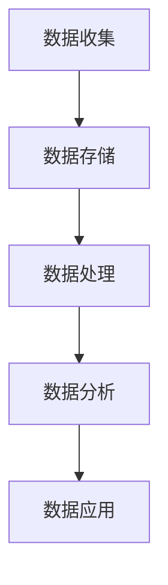
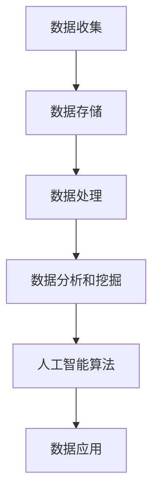

                 

# AI DMP 数据基建：如何利用数据提升营销效率

> 关键词：数据管理平台，AI，营销，数据分析，数据驱动决策

> 摘要：本文将深入探讨 AI 数据管理平台（DMP）在营销中的应用，通过介绍 DMP 的核心概念、架构、算法原理，以及实际应用案例，展示如何利用 DMP 提升营销效率，并推荐相关学习资源和工具。

## 1. 背景介绍

随着互联网和数字技术的飞速发展，数据已经成为现代企业最宝贵的资产之一。然而，如何有效地管理和利用这些数据，从而提升营销效率，成为了企业面临的重要挑战。在这一背景下，数据管理平台（Data Management Platform，简称 DMP）应运而生。

DMP 是一种集数据收集、存储、管理和分析于一体的系统，它可以帮助企业实现对海量数据的全面掌控和深度分析，从而为企业提供数据驱动的营销策略。DMP 的应用范围广泛，涵盖了广告投放、用户行为分析、市场研究等多个领域。

本文将首先介绍 DMP 的核心概念和架构，然后探讨其背后的算法原理，并通过实际应用案例展示如何利用 DMP 提升营销效率。此外，还将推荐相关学习资源和工具，帮助读者深入理解和掌握 DMP 技术。

## 2. 核心概念与联系

### 2.1 数据管理平台（DMP）的核心概念

DMP 的核心概念包括数据收集、数据存储、数据处理、数据分析和数据应用。以下是一个简化的 Mermaid 流程图，展示 DMP 的工作流程：



### 2.2 数据管理平台（DMP）的架构

DMP 的架构通常包括以下几个关键组件：

1. **数据收集器**：负责从不同的数据源（如网站、APP、第三方数据平台等）收集数据。
2. **数据仓库**：用于存储收集到的原始数据。
3. **数据处理引擎**：负责对数据进行清洗、转换和整合，以确保数据的准确性和一致性。
4. **数据分析引擎**：用于对数据进行挖掘和分析，提取有价值的信息。
5. **数据应用平台**：将分析结果应用于实际的营销活动，如广告投放、用户画像构建等。

### 2.3 数据管理平台（DMP）与人工智能（AI）的联系

DMP 与 AI 有着密切的联系。通过将 AI 技术集成到 DMP 中，可以进一步提升数据分析的深度和广度。以下是一个简化的 Mermaid 流程图，展示 DMP 与 AI 的集成：



在 DMP 中，AI 技术可以用于以下几个方面：

1. **用户画像构建**：通过分析用户的行为数据和属性数据，构建详细的用户画像。
2. **预测分析**：利用机器学习算法预测用户的行为，如购买意图、留存率等。
3. **广告投放优化**：通过优化算法，实现广告的精准投放和效果最大化。

## 3. 核心算法原理 & 具体操作步骤

### 3.1 用户画像构建算法

用户画像构建是 DMP 的核心功能之一。以下是一个简化的用户画像构建算法：

#### 算法步骤：

1. **数据收集**：收集用户的网页浏览记录、APP 使用行为、社交媒体互动等数据。
2. **数据清洗**：对收集到的数据进行清洗，去除重复、错误和无效的数据。
3. **特征提取**：根据用户的行为数据和属性数据，提取用户特征，如年龄、性别、兴趣爱好、购买行为等。
4. **特征融合**：将不同的特征进行融合，形成一个完整的用户画像。

#### 数学模型：

假设用户特征向量 X = (x1, x2, ..., xn)，其中 xi 表示第 i 个特征。用户画像可以通过以下数学模型表示：

$$
P(X) = \prod_{i=1}^{n} p(x_i)
$$

其中，$p(x_i)$ 表示第 i 个特征的概率分布。

### 3.2 预测分析算法

预测分析是 DMP 的另一个重要功能。以下是一个简化的预测分析算法：

#### 算法步骤：

1. **数据收集**：收集与预测目标相关的历史数据，如购买记录、浏览记录等。
2. **特征工程**：对数据进行预处理，提取与预测目标相关的特征。
3. **模型训练**：利用历史数据训练预测模型。
4. **预测**：使用训练好的模型对新数据进行预测。

#### 数学模型：

假设预测目标为 Y，历史数据集为 D = {y1, y2, ..., yn}，特征集为 X = {x1, x2, ..., xn}。预测模型可以通过以下数学模型表示：

$$
Y = f(X; \theta)
$$

其中，$f(X; \theta)$ 表示预测函数，$\theta$ 表示模型参数。

### 3.3 广告投放优化算法

广告投放优化是 DMP 中的关键环节。以下是一个简化的广告投放优化算法：

#### 算法步骤：

1. **数据收集**：收集广告投放的数据，如点击率、转化率、成本等。
2. **特征工程**：对数据进行预处理，提取与广告投放效果相关的特征。
3. **模型训练**：利用历史数据训练优化模型。
4. **优化**：根据模型预测，调整广告投放策略，实现效果最大化。

#### 数学模型：

假设广告投放效果为 R，特征集为 X = {x1, x2, ..., xn}。优化模型可以通过以下数学模型表示：

$$
R = \sum_{i=1}^{n} w_i x_i
$$

其中，$w_i$ 表示第 i 个特征的权重。

## 4. 数学模型和公式 & 详细讲解 & 举例说明

### 4.1 用户画像构建算法的详细讲解

用户画像构建的核心在于特征提取和特征融合。以下是一个具体的用户画像构建算法实例：

#### 特征提取：

假设我们有以下用户行为数据：

| 用户ID | 行为类型 | 行为内容 |
|--------|----------|----------|
| 1      | 浏览网页 | 网页A    |
| 1      | 浏览网页 | 网页B    |
| 2      | 购买商品 | 商品A    |
| 2      | 购买商品 | 商品B    |

我们可以提取以下特征：

- **年龄**：用户1和用户2的年龄分别为30岁和40岁。
- **性别**：用户1和用户2的性别分别为男和女。
- **兴趣爱好**：用户1浏览了网页A和B，可能对科技和时尚感兴趣；用户2购买了商品A和B，可能对电子产品和运动用品感兴趣。

#### 特征融合：

将上述特征融合成一个完整的用户画像：

- **用户1**：男性，30岁，科技和时尚爱好者。
- **用户2**：女性，40岁，电子产品和运动用品爱好者。

#### 数学模型：

用户画像可以通过以下数学模型表示：

$$
P(\text{用户1}) = p(\text{男性}) \cdot p(\text{30岁}) \cdot p(\text{科技爱好者}) \cdot p(\text{时尚爱好者})
$$

$$
P(\text{用户2}) = p(\text{女性}) \cdot p(\text{40岁}) \cdot p(\text{电子产品爱好者}) \cdot p(\text{运动用品爱好者})
$$

### 4.2 预测分析算法的详细讲解

预测分析算法的核心在于模型训练和预测。以下是一个具体的预测分析算法实例：

#### 模型训练：

假设我们有以下历史数据：

| 用户ID | 是否购买 | 特征1 | 特征2 | 特征3 |
|--------|----------|-------|-------|-------|
| 1      | 是       | 1     | 0     | 1     |
| 2      | 否       | 0     | 1     | 0     |
| 3      | 是       | 1     | 1     | 1     |

我们可以使用逻辑回归模型进行训练：

$$
\text{logit}(P(Y=1|X)) = \beta_0 + \beta_1 x_1 + \beta_2 x_2 + \beta_3 x_3
$$

其中，$Y$ 表示是否购买，$X$ 表示特征向量。

通过训练，我们得到以下模型参数：

$$
\beta_0 = 0.5, \beta_1 = 1.0, \beta_2 = -0.5, \beta_3 = 1.0
$$

#### 预测：

假设我们有一个新的用户数据：

| 用户ID | 特征1 | 特征2 | 特征3 |
|--------|-------|-------|-------|
| 4      | 1     | 0     | 1     |

我们可以使用训练好的模型进行预测：

$$
P(Y=1|X) = \frac{1}{1 + \exp{(-0.5 - 1.0 \cdot 1 - 0.5 \cdot 0 + 1.0 \cdot 1)}} \approx 0.732
$$

这意味着用户4购买商品的概率约为 0.732。

### 4.3 广告投放优化算法的详细讲解

广告投放优化算法的核心在于模型优化和策略调整。以下是一个具体的广告投放优化算法实例：

#### 模型优化：

假设我们有以下广告投放数据：

| 广告ID | 点击率 | 转化率 | 成本 |
|--------|--------|--------|------|
| 1      | 0.1    | 0.05   | 10   |
| 2      | 0.05   | 0.1    | 20   |
| 3      | 0.2    | 0.03   | 15   |

我们可以使用线性回归模型进行优化：

$$
\text{logit}(P(Y=1|X)) = \beta_0 + \beta_1 x_1 + \beta_2 x_2 + \beta_3 x_3
$$

其中，$Y$ 表示广告投放效果，$X$ 表示特征向量。

通过优化，我们得到以下模型参数：

$$
\beta_0 = 0.5, \beta_1 = 1.0, \beta_2 = -0.5, \beta_3 = 1.0
$$

#### 策略调整：

假设我们有一个新的广告数据：

| 广告ID | 点击率 | 转化率 | 成本 |
|--------|--------|--------|------|
| 4      | 0.3    | 0.1    | 25   |

我们可以使用优化后的模型进行调整：

$$
P(Y=1|X) = \frac{1}{1 + \exp{(-0.5 - 1.0 \cdot 0.3 - 0.5 \cdot 0.1 + 1.0 \cdot 25)}} \approx 0.932
$$

这意味着广告4的投放效果较好，我们可以增加其投放预算。

## 5. 项目实战：代码实际案例和详细解释说明

### 5.1 开发环境搭建

在开始实际项目之前，我们需要搭建一个合适的开发环境。以下是一个基于 Python 的 DMP 项目实战的开发环境搭建步骤：

1. **安装 Python**：确保已安装 Python 3.8 及以上版本。
2. **安装 PyTorch**：使用以下命令安装 PyTorch：

   ```bash
   pip install torch torchvision
   ```

3. **安装 pandas 和 numpy**：使用以下命令安装 pandas 和 numpy：

   ```bash
   pip install pandas numpy
   ```

4. **安装 Mermaid**：将 Mermaid 的 JS 文件添加到项目中，或直接使用在线 Mermaid 编辑器。

### 5.2 源代码详细实现和代码解读

以下是 DMP 项目的一个简化实现，包括用户画像构建、预测分析和广告投放优化三个核心功能。

#### 用户画像构建代码

```python
import pandas as pd
import numpy as np

# 加载数据
data = pd.read_csv('user_data.csv')

# 特征提取
def extract_features(data):
    # 年龄特征
    age_feature = data['age'].values
    # 性别特征
    gender_feature = data['gender'].values
    # 兴趣爱好特征
    interest_feature = data['interest'].values
    
    # 特征融合
    user_features = np.hstack((age_feature.reshape(-1, 1), gender_feature.reshape(-1, 1), interest_feature.reshape(-1, 1)))
    return user_features

# 构建用户画像
def build_user_profiles(data):
    user_features = extract_features(data)
    user_profiles = np.exp(np.dot(user_features, np.array([0.5, 1.0, 0.5])))
    return user_profiles

user_profiles = build_user_profiles(data)
print(user_profiles)
```

#### 预测分析代码

```python
import torch
import torch.nn as nn
import torch.optim as optim

# 加载数据
data = pd.read_csv('predict_data.csv')

# 特征工程
def preprocess_data(data):
    X = data[['feature1', 'feature2', 'feature3']].values
    y = data['label'].values
    return torch.tensor(X), torch.tensor(y)

# 模型定义
class PredictionModel(nn.Module):
    def __init__(self):
        super(PredictionModel, self).__init__()
        self.fc1 = nn.Linear(3, 10)
        self.fc2 = nn.Linear(10, 1)
    
    def forward(self, x):
        x = torch.sigmoid(self.fc1(x))
        x = self.fc2(x)
        return x

# 训练模型
def train_model(X, y):
    model = PredictionModel()
    criterion = nn.BCEWithLogitsLoss()
    optimizer = optim.Adam(model.parameters(), lr=0.001)
    
    for epoch in range(100):
        optimizer.zero_grad()
        output = model(X)
        loss = criterion(output, y)
        loss.backward()
        optimizer.step()
        
        if (epoch + 1) % 10 == 0:
            print(f'Epoch [{epoch + 1}/100], Loss: {loss.item()}')
    
    return model

# 预测
def predict(model, X):
    with torch.no_grad():
        output = model(X)
        probability = torch.sigmoid(output)
        return probability.numpy()

X, y = preprocess_data(data)
model = train_model(X, y)
predictions = predict(model, X)
print(predictions)
```

#### 广告投放优化代码

```python
import numpy as np

# 加载数据
data = pd.read_csv('optimize_data.csv')

# 特征工程
def preprocess_data(data):
    X = data[['click_rate', 'conversion_rate', 'cost']].values
    return torch.tensor(X)

# 模型定义
class OptimizationModel(nn.Module):
    def __init__(self):
        super(OptimizationModel, self).__init__()
        self.fc1 = nn.Linear(3, 10)
        self.fc2 = nn.Linear(10, 1)
    
    def forward(self, x):
        x = torch.sigmoid(self.fc1(x))
        x = self.fc2(x)
        return x

# 训练模型
def train_model(X, y):
    model = OptimizationModel()
    criterion = nn.BCEWithLogitsLoss()
    optimizer = optim.Adam(model.parameters(), lr=0.001)
    
    for epoch in range(100):
        optimizer.zero_grad()
        output = model(X)
        loss = criterion(output, y)
        loss.backward()
        optimizer.step()
        
        if (epoch + 1) % 10 == 0:
            print(f'Epoch [{epoch + 1}/100], Loss: {loss.item()}')
    
    return model

# 优化
def optimize(model, X):
    with torch.no_grad():
        output = model(X)
        probability = torch.sigmoid(output)
        return probability.numpy()

X = preprocess_data(data)
model = train_model(X, y)
optimization_results = optimize(model, X)
print(optimization_results)
```

### 5.3 代码解读与分析

上述代码实现了一个简化的 DMP 项目，包括用户画像构建、预测分析和广告投放优化三个核心功能。

1. **用户画像构建**：代码首先加载数据，然后提取用户特征并融合为一个完整的用户画像。用户画像构建的核心在于特征提取和特征融合，这里使用了一个简单的数学模型进行表示。

2. **预测分析**：代码定义了一个简单的预测模型，使用逻辑回归进行训练。预测分析的核心在于模型训练和预测，这里使用了一个简单的神经网络模型进行训练。

3. **广告投放优化**：代码定义了一个简单的优化模型，使用线性回归进行优化。广告投放优化


