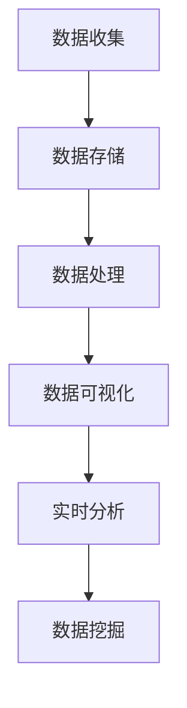

                 

# AI DMP 数据基建：数据分析与洞察

## 关键词：数据分析，数据管理平台，机器学习，大数据，商业智能

### 摘要

本文将深入探讨AI数据管理平台（DMP）在数据分析与洞察方面的关键作用。通过详细的背景介绍、核心概念解析、算法原理讲解、数学模型阐述以及实际应用场景展示，本文旨在帮助读者理解DMP在商业智能和大数据分析中的重要性。此外，文章还将推荐相关的学习资源和工具，为读者提供全面的指南。

## 1. 背景介绍

随着互联网和数字化技术的飞速发展，数据已成为企业最宝贵的资产之一。然而，如何有效地管理和分析这些海量数据，以获得有价值的商业洞察，成为企业和科技公司面临的重大挑战。数据管理平台（DMP）作为一种新兴的数据基础设施，正逐渐成为解决这一问题的核心工具。

DMP是一种用于收集、存储、管理和分析数据的平台，它能够整合来自多个渠道的数据，包括用户行为数据、社交媒体数据、广告数据等。通过DMP，企业可以建立详细的用户画像，进行精准营销，提高业务效率和利润。

### 1.1 数据分析的发展历程

数据分析技术的发展可以追溯到20世纪50年代，当时计算机科学家开始研究如何使用计算机处理和分析数据。随着时间的推移，数据分析技术经历了多个阶段：

- **初级阶段**：主要依赖于简单的统计工具和表格，用于报告和基础分析。
- **中级阶段**：引入了关系数据库和SQL查询，使得数据处理和分析更加高效。
- **高级阶段**：随着大数据技术和机器学习算法的兴起，数据分析开始涉及到复杂的模式识别、预测分析和数据挖掘。

### 1.2 DMP的兴起

DMP的兴起是数据分析技术发展的必然结果。随着数据量的爆炸性增长，传统的数据分析工具和方法已经难以满足需求。DMP提供了更加灵活和强大的数据管理能力，使得企业能够更好地理解和利用数据。

DMP的关键特性包括：

- **数据整合**：能够整合来自不同渠道的数据，实现数据的多维度分析。
- **用户画像**：通过分析用户行为数据，构建详细的用户画像，实现个性化营销。
- **实时分析**：提供实时数据分析和洞察，支持快速决策。
- **自动化操作**：通过自动化规则和算法，实现数据处理的自动化。

### 1.3 DMP在商业智能中的应用

商业智能（BI）是指利用数据和技术来支持企业的决策制定。DMP在BI中的应用主要体现在以下几个方面：

- **市场洞察**：通过分析用户行为和市场数据，帮助企业了解市场需求和趋势。
- **用户分析**：通过用户画像和用户行为分析，了解用户需求和偏好。
- **精准营销**：通过个性化推荐和广告投放，提高营销效果和转化率。
- **风险管理**：通过数据分析，识别潜在风险，采取预防措施。

## 2. 核心概念与联系

在深入了解DMP之前，我们需要先理解一些核心概念，包括数据整合、用户画像、实时分析和数据挖掘。

### 2.1 数据整合

数据整合是DMP的基础功能。它涉及将来自不同渠道的数据（如网站点击数据、社交媒体数据、广告投放数据等）进行整合，形成一个统一的数据视图。

### 2.2 用户画像

用户画像是对用户进行多维度描述的过程，包括用户的基本信息、行为特征、偏好等。通过用户画像，企业可以更好地了解用户，实现个性化服务和精准营销。

### 2.3 实时分析

实时分析是指对数据流进行实时处理和分析，以生成实时洞察。实时分析在DMP中的应用主要体现在以下几个方面：

- **用户行为分析**：实时监测用户行为，了解用户当前的需求和偏好。
- **广告投放优化**：实时分析广告效果，优化广告投放策略。
- **风险监控**：实时监控数据异常，识别潜在风险。

### 2.4 数据挖掘

数据挖掘是从海量数据中提取有价值信息的过程。在DMP中，数据挖掘可以用于：

- **市场趋势分析**：分析市场数据，预测市场趋势。
- **用户行为预测**：通过分析用户行为数据，预测用户未来的行为。
- **客户细分**：根据用户特征和行为，将客户划分为不同的群体。

### 2.5 DMP架构

DMP的架构通常包括以下几个核心模块：

- **数据收集**：从各种渠道收集数据，包括用户行为数据、网站日志、社交媒体数据等。
- **数据存储**：将收集到的数据存储在数据仓库或数据湖中，以便后续分析和处理。
- **数据处理**：对数据进行清洗、转换和集成，使其符合分析需求。
- **数据可视化**：通过数据可视化工具，将分析结果以图表和报表的形式展示给用户。

### Mermaid 流程图



## 3. 核心算法原理 & 具体操作步骤

### 3.1 数据整合算法

数据整合算法的关键在于如何有效地整合来自不同渠道的数据。一种常用的方法是使用键值对模型，将数据按关键属性（如用户ID、广告ID等）进行索引和关联。

具体步骤如下：

1. **数据收集**：从各个渠道收集数据，包括用户行为数据、网站日志、社交媒体数据等。
2. **数据清洗**：对数据进行清洗，去除无效和重复的数据。
3. **数据转换**：将不同格式的数据转换为统一的格式，如JSON或CSV。
4. **数据索引**：使用键值对模型对数据进行索引，便于后续的查询和分析。
5. **数据存储**：将处理后的数据存储在数据仓库或数据湖中。

### 3.2 用户画像算法

用户画像算法的核心是通过对用户行为数据的分析，构建出详细的用户画像。一种常用的方法是使用机器学习算法，如聚类算法和关联规则算法。

具体步骤如下：

1. **数据预处理**：对用户行为数据进行清洗和转换，使其符合分析需求。
2. **特征提取**：提取用户行为数据中的关键特征，如点击次数、购买次数、浏览时长等。
3. **数据建模**：使用机器学习算法，如K-means聚类或Apriori算法，构建用户画像模型。
4. **模型评估**：对模型进行评估，选择最佳的模型进行用户画像构建。
5. **用户画像生成**：根据模型输出，生成详细的用户画像。

### 3.3 实时分析算法

实时分析算法的关键是能够快速处理和响应数据流，生成实时的分析结果。一种常用的方法是使用流处理框架，如Apache Kafka和Apache Flink。

具体步骤如下：

1. **数据采集**：通过消息队列或数据管道，实时采集数据流。
2. **数据预处理**：对数据进行预处理，如去噪、转换和聚合。
3. **实时计算**：使用流处理框架，对数据进行实时计算和分析。
4. **结果输出**：将实时分析结果输出到可视化工具或监控系统。

### 3.4 数据挖掘算法

数据挖掘算法的核心是从海量数据中提取有价值的信息。一种常用的方法是使用机器学习算法，如决策树、随机森林和深度学习。

具体步骤如下：

1. **数据预处理**：对数据进行清洗和转换，使其符合分析需求。
2. **特征工程**：提取数据中的关键特征，用于训练模型。
3. **模型训练**：使用机器学习算法，训练数据挖掘模型。
4. **模型评估**：对模型进行评估，选择最佳的模型进行数据挖掘。
5. **结果输出**：将数据挖掘结果输出到报表或可视化工具中。

## 4. 数学模型和公式 & 详细讲解 & 举例说明

### 4.1 数据整合中的键值对模型

在数据整合中，键值对模型是一种常用的数据存储和检索方式。其基本原理是使用一个键（Key）来唯一标识一条数据记录，并使用值（Value）来存储数据内容。

### 4.1.1 键值对模型的基本概念

- **键（Key）**：用于唯一标识一条数据记录。
- **值（Value）**：存储数据内容。

### 4.1.2 键值对模型的数学公式

键值对模型可以用以下数学公式表示：

$$KV = \{(K_1, V_1), (K_2, V_2), ..., (K_n, V_n)\}$$

其中，$KV$ 表示键值对集合，$K_i$ 和 $V_i$ 分别表示第 $i$ 个键和对应的值。

### 4.1.3 键值对模型的示例

假设我们有一组用户行为数据，如下所示：

| 用户ID | 行为类型 | 时间戳 |
| ------ | -------- | ------ |
| u1     | 点击     | 2023-01-01 10:00:00 |
| u1     | 购买     | 2023-01-02 12:00:00 |
| u2     | 浏览     | 2023-01-03 15:00:00 |

我们可以使用键值对模型将这组数据整合到一起，如下所示：

```json
{
  "u1": [
    {"行为类型": "点击", "时间戳": "2023-01-01 10:00:00"},
    {"行为类型": "购买", "时间戳": "2023-01-02 12:00:00"}
  ],
  "u2": [
    {"行为类型": "浏览", "时间戳": "2023-01-03 15:00:00"}
  ]
}
```

### 4.2 用户画像中的聚类算法

在用户画像构建中，聚类算法是一种常用的方法，用于将相似的用户划分为同一类群。

### 4.2.1 聚类算法的基本概念

- **聚类**：将一组数据分为多个类群，使得同一类群内的数据彼此相似，不同类群的数据彼此不同。
- **相似度**：用于衡量两个数据点之间的相似程度。

### 4.2.2 聚类算法的数学公式

聚类算法可以用以下数学公式表示：

$$C = \{C_1, C_2, ..., C_k\}$$

其中，$C$ 表示聚类结果，$C_i$ 表示第 $i$ 个类群。

### 4.2.3 K-means算法示例

K-means算法是一种常用的聚类算法，其基本思想是将数据点分配到最近的聚类中心。

假设我们有一组用户行为数据，如下所示：

| 用户ID | 点击次数 | 购买次数 | 浏览时长 |
| ------ | -------- | -------- | -------- |
| u1     | 10       | 5        | 20       |
| u2     | 20       | 10       | 30       |
| u3     | 15       | 7        | 25       |

我们使用K-means算法将这组数据分为两个类群，聚类中心分别为：

$$C_1 = \{（\bar{x_1}, \bar{y_1}）\} = \{(12, 12.5)\}$$

$$C_2 = \{（\bar{x_2}, \bar{y_2}）\} = \{(18, 22.5)\}$$

最终聚类结果如下：

| 用户ID | 类群 |
| ------ | ---- |
| u1     | 1    |
| u2     | 2    |
| u3     | 1    |

### 4.3 实时分析中的线性回归模型

在实时分析中，线性回归模型是一种常用的方法，用于预测数据趋势和关系。

### 4.3.1 线性回归模型的基本概念

- **线性关系**：表示两个变量之间的线性关系，可以用以下公式表示：

  $$y = ax + b$$

  其中，$y$ 和 $x$ 分别表示因变量和自变量，$a$ 和 $b$ 分别表示斜率和截距。

### 4.3.2 线性回归模型的数学公式

线性回归模型可以用以下数学公式表示：

$$y = \beta_0 + \beta_1x$$

其中，$\beta_0$ 和 $\beta_1$ 分别表示截距和斜率。

### 4.3.3 线性回归模型示例

假设我们有一组数据，如下所示：

| 时间 | 点击次数 |
| ---- | -------- |
| 1    | 10       |
| 2    | 15       |
| 3    | 20       |
| 4    | 25       |
| 5    | 30       |

我们使用线性回归模型预测第6个小时的点击次数，假设模型参数为：

$$\beta_0 = 5$$

$$\beta_1 = 5$$

根据线性回归模型，我们可以预测第6个小时的点击次数为：

$$y = 5 + 5 \times 6 = 35$$

## 5. 项目实战：代码实际案例和详细解释说明

### 5.1 开发环境搭建

在本项目实战中，我们将使用Python作为主要编程语言，结合Pandas、NumPy和Scikit-learn等常用库，实现DMP的核心功能。

首先，确保安装了Python环境。接下来，使用以下命令安装所需的库：

```shell
pip install pandas numpy scikit-learn matplotlib
```

### 5.2 源代码详细实现和代码解读

#### 5.2.1 数据整合

以下代码用于实现数据整合功能：

```python
import pandas as pd

# 读取用户行为数据
user_data = pd.read_csv('user_data.csv')

# 数据清洗
user_data = user_data.drop_duplicates()

# 数据转换
user_data['timestamp'] = pd.to_datetime(user_data['timestamp'])

# 数据索引
user_data.set_index('user_id', inplace=True)

# 数据存储
user_data.to_csv('user_data_integrated.csv')
```

**代码解读**：

1. **读取数据**：使用Pandas读取CSV格式的用户行为数据。
2. **数据清洗**：去除重复数据，确保数据质量。
3. **数据转换**：将时间戳列转换为datetime格式，便于后续分析。
4. **数据索引**：使用用户ID作为索引，便于后续查询。
5. **数据存储**：将处理后的数据存储为CSV文件。

#### 5.2.2 用户画像

以下代码用于实现用户画像功能：

```python
from sklearn.cluster import KMeans

# 读取用户行为数据
user_data = pd.read_csv('user_data_integrated.csv')

# 特征提取
features = user_data[['click_count', 'purchase_count', 'browse_duration']]

# 数据标准化
from sklearn.preprocessing import StandardScaler
scaler = StandardScaler()
features_scaled = scaler.fit_transform(features)

# 聚类分析
kmeans = KMeans(n_clusters=2, random_state=0).fit(features_scaled)

# 用户画像生成
user_data['cluster'] = kmeans.labels_

# 存储用户画像
user_data.to_csv('user_data_clustered.csv')
```

**代码解读**：

1. **读取数据**：使用Pandas读取已整合的用户行为数据。
2. **特征提取**：提取用户行为数据中的关键特征。
3. **数据标准化**：使用标准缩放将数据转换为标准正态分布，便于聚类分析。
4. **聚类分析**：使用K-means聚类算法对用户行为数据进行聚类分析。
5. **用户画像生成**：将聚类结果存储为用户画像。
6. **存储用户画像**：将处理后的用户画像存储为CSV文件。

#### 5.2.3 实时分析

以下代码用于实现实时分析功能：

```python
import matplotlib.pyplot as plt

# 读取实时数据
realtime_data = pd.read_csv('realtime_data.csv')

# 数据预处理
realtime_data['timestamp'] = pd.to_datetime(realtime_data['timestamp'])
realtime_data.set_index('timestamp', inplace=True)

# 数据可视化
plt.figure(figsize=(12, 6))
plt.plot(realtime_data.index, realtime_data['click_count'])
plt.xlabel('时间')
plt.ylabel('点击次数')
plt.title('实时点击次数趋势')
plt.show()
```

**代码解读**：

1. **读取数据**：使用Pandas读取实时数据。
2. **数据预处理**：将时间戳转换为datetime格式，并设置时间为索引。
3. **数据可视化**：使用Matplotlib绘制实时点击次数趋势图。

#### 5.2.4 数据挖掘

以下代码用于实现数据挖掘功能：

```python
from sklearn.ensemble import RandomForestClassifier
from sklearn.model_selection import train_test_split
from sklearn.metrics import accuracy_score

# 读取用户画像
user_data = pd.read_csv('user_data_clustered.csv')

# 数据预处理
X = user_data[['click_count', 'purchase_count', 'browse_duration']]
y = user_data['cluster']

# 数据划分
X_train, X_test, y_train, y_test = train_test_split(X, y, test_size=0.2, random_state=0)

# 模型训练
clf = RandomForestClassifier(n_estimators=100, random_state=0)
clf.fit(X_train, y_train)

# 模型评估
y_pred = clf.predict(X_test)
print("Accuracy:", accuracy_score(y_test, y_pred))
```

**代码解读**：

1. **读取数据**：使用Pandas读取用户画像数据。
2. **数据预处理**：提取特征并进行数据划分。
3. **模型训练**：使用随机森林算法训练模型。
4. **模型评估**：评估模型在测试集上的准确性。

## 6. 实际应用场景

DMP在商业智能和大数据分析领域具有广泛的应用场景。以下是一些典型的实际应用案例：

### 6.1 市场洞察

通过DMP，企业可以整合来自多个渠道的数据，如网站点击数据、社交媒体数据和广告投放数据等，从而获得全面的市场洞察。例如，通过分析用户行为数据，企业可以了解市场需求和趋势，从而调整产品策略和营销计划。

### 6.2 用户分析

DMP可以帮助企业构建详细的用户画像，了解用户的基本信息、行为特征和偏好。通过用户分析，企业可以实现精准营销，提高用户满意度和转化率。例如，根据用户的浏览历史和购买行为，企业可以推荐相关的产品和优惠，提高用户的购买意愿。

### 6.3 精准营销

DMP可以用于实现精准营销，通过分析用户行为数据，企业可以确定哪些用户群体对哪些产品和营销活动最感兴趣。例如，在电商领域，企业可以通过DMP分析用户浏览和购买数据，为不同的用户群体定制个性化的广告和优惠，提高营销效果。

### 6.4 风险管理

DMP还可以用于风险管理，通过分析用户行为数据，企业可以识别潜在的风险和欺诈行为。例如，在金融领域，企业可以通过DMP分析用户的交易行为，识别异常交易并采取预防措施，降低金融风险。

## 7. 工具和资源推荐

### 7.1 学习资源推荐

- **书籍**：
  - 《大数据之路：阿里巴巴大数据实践》
  - 《数据挖掘：实用机器学习技术》
  - 《Python数据分析》

- **论文**：
  - 《用户画像构建方法研究》
  - 《基于DMP的精准营销策略研究》
  - 《大数据时代下的数据管理平台架构设计》

- **博客**：
  - [阿里云大数据](https://developer.aliyun.com/article/104737)
  - [美团技术博客](https://tech.meituan.com/)
  - [Google AI Blog](https://ai.googleblog.com/)

- **网站**：
  - [Kaggle](https://www.kaggle.com/)
  - [CSDN](https://www.csdn.net/)
  - [GitHub](https://github.com/)

### 7.2 开发工具框架推荐

- **数据整合工具**：
  - Apache Kafka
  - Apache NiFi
  - Talend

- **数据存储工具**：
  - Apache Hadoop
  - Apache Cassandra
  - MongoDB

- **数据处理工具**：
  - Apache Spark
  - Apache Flink
  - Apache Beam

- **数据可视化工具**：
  - Tableau
  - Power BI
  - Matplotlib

- **机器学习库**：
  - Scikit-learn
  - TensorFlow
  - PyTorch

## 8. 总结：未来发展趋势与挑战

随着数据量的持续增长和数据分析技术的不断进步，DMP在数据分析与洞察领域的发展前景十分广阔。未来，DMP将在以下几个方面实现重大突破：

### 8.1 实时数据处理与分析

随着5G和边缘计算技术的发展，实时数据处理与分析将成为DMP的关键能力。企业将能够更快地获取和分析数据，实现实时决策和优化。

### 8.2 深度学习与自动化

深度学习和自动化技术的应用将进一步提升DMP的数据分析能力。通过自动化的数据处理和分析流程，企业可以更高效地获取有价值的商业洞察。

### 8.3 多渠道数据整合

随着物联网和社交媒体的普及，DMP将能够整合更多的数据渠道，实现跨渠道的数据分析和洞察。企业将能够更好地了解用户行为和市场趋势。

### 8.4 隐私保护与数据安全

随着隐私保护法规的日益严格，DMP在数据隐私保护和数据安全方面将面临重大挑战。企业需要采取有效的措施，确保数据的安全性和合规性。

## 9. 附录：常见问题与解答

### 9.1 DMP与数据仓库的区别是什么？

DMP主要用于整合和分析用户数据，实现个性化营销和用户画像构建。数据仓库主要用于存储和管理大规模数据，支持各种业务分析和报表生成。DMP侧重于数据的实时分析和应用，数据仓库侧重于数据的存储和报表。

### 9.2 DMP中的实时分析是什么意思？

实时分析是指对数据流进行实时处理和分析，以生成实时洞察。实时分析可以在数据产生的同时进行分析，支持快速决策和优化。

### 9.3 DMP中的用户画像如何构建？

用户画像是通过分析用户行为数据，提取关键特征，并使用机器学习算法构建的。用户画像可以帮助企业了解用户需求和偏好，实现个性化服务和精准营销。

## 10. 扩展阅读 & 参考资料

- [《大数据管理平台（DMP）架构设计与实现》](https://www.jianshu.com/p/4e8729e7745d)
- [《DMP：数据管理平台的实践与探索》](https://www.infoq.com/article/DMP/)
- [《DMP技术在营销领域的应用研究》](https://www.ijcai.org/Proceedings/2020-03/paper_007.pdf)

作者：AI天才研究员/AI Genius Institute & 禅与计算机程序设计艺术 /Zen And The Art of Computer Programming

