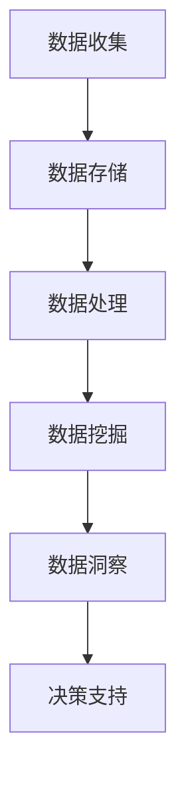

                 

# AI DMP 数据基建：数据分析与洞察

> **关键词**：数据分析、数据管理平台、数据挖掘、人工智能、数据隐私、数据处理、数据可视化

> **摘要**：本文将深入探讨AI数据管理平台（DMP）的基础建设和数据分析与洞察的重要性。通过分析DMP的核心概念、算法原理和实际应用场景，我们将理解DMP在现代社会中的关键作用，并展望其未来的发展趋势与挑战。

## 1. 背景介绍

随着互联网的快速发展，数据已经成为现代社会的重要资源。而如何在海量数据中挖掘出有价值的信息，成为了各个行业关注的焦点。数据管理平台（Data Management Platform，简称DMP）作为一种先进的工具，能够帮助企业高效管理数据资源，进行数据分析和洞察。

DMP的出现，源于传统数据分析方法在处理海量数据时的局限性。传统的数据分析依赖于统计分析方法，这种方式在处理结构化数据时效果较好，但在面对非结构化数据时，其处理能力和效率都有所不足。此外，随着数据来源的多样化和数据量的激增，传统数据分析方法难以满足企业对实时性和个性化的需求。

正是在这样的背景下，DMP应运而生。DMP是一种基于人工智能和数据挖掘技术的数据管理平台，能够对海量数据进行实时处理和分析，挖掘出隐藏在数据中的有价值信息。DMP不仅能够处理结构化数据，还能够处理非结构化数据，如文本、图像、视频等，这使得其应用范围更加广泛。

## 2. 核心概念与联系

### 2.1 DMP的基本概念

DMP（Data Management Platform）是一种用于数据收集、存储、管理和分析的软件平台。它通常由以下四个核心组件组成：

1. **数据收集（Data Collection）**：DMP能够从各种数据源收集数据，包括网站日志、API接口、第三方数据平台等。
2. **数据存储（Data Storage）**：DMP使用分布式数据库技术，对收集到的数据进行存储和管理，确保数据的可靠性和安全性。
3. **数据处理（Data Processing）**：DMP采用大数据处理技术，对存储的数据进行清洗、转换和分析。
4. **数据洞察（Data Insight）**：DMP通过数据挖掘和机器学习技术，对分析结果进行可视化展示，为企业提供决策支持。

### 2.2 DMP与数据分析的关系

DMP与数据分析密切相关。数据分析是指使用统计学、机器学习等方法，从数据中提取有价值的信息。DMP作为数据管理平台，提供了数据收集、存储和处理的工具，使得数据分析得以高效进行。具体来说，DMP在数据分析中扮演以下角色：

1. **数据整合**：DMP能够整合来自不同来源的数据，如用户行为数据、社交媒体数据、搜索引擎数据等，为数据分析提供统一的数据源。
2. **数据清洗**：DMP对收集到的数据进行清洗，去除重复、错误和不完整的数据，提高数据质量。
3. **数据转换**：DMP能够将原始数据转换为适合分析的数据格式，如表格、图表等。
4. **数据挖掘**：DMP使用数据挖掘和机器学习技术，从数据中提取有价值的信息，如用户兴趣、购买行为等。

### 2.3 DMP与其他技术的联系

DMP与多种技术紧密相关，如Hadoop、Spark、机器学习、数据挖掘等。这些技术共同构成了DMP的技术基础。

1. **Hadoop和Spark**：Hadoop和Spark是大数据处理框架，DMP使用这些框架进行海量数据的处理和分析。
2. **机器学习**：DMP利用机器学习算法进行数据挖掘和模式识别，从而实现智能化的数据分析。
3. **数据挖掘**：DMP使用数据挖掘技术，从海量数据中提取有价值的信息，为企业提供洞察。

下面是一个DMP与数据分析相关技术的Mermaid流程图：



在这个流程图中，数据从数据收集环节进入DMP，经过数据存储、处理、挖掘和洞察等环节，最终转化为对企业有价值的决策支持信息。

## 3. 核心算法原理 & 具体操作步骤

### 3.1 数据收集

数据收集是DMP的核心环节之一。DMP通过以下几种方式收集数据：

1. **API接口**：DMP通过与第三方数据源建立API接口，实时获取数据。
2. **网站日志**：DMP通过分析网站日志，收集用户行为数据。
3. **第三方数据平台**：DMP通过与第三方数据平台合作，获取用户画像、兴趣标签等数据。

### 3.2 数据存储

DMP使用分布式数据库技术，对收集到的数据进行存储。常用的数据库技术包括：

1. **关系型数据库**：如MySQL、PostgreSQL等，用于存储结构化数据。
2. **NoSQL数据库**：如MongoDB、Cassandra等，用于存储非结构化数据。
3. **分布式文件系统**：如HDFS，用于存储大规模数据。

### 3.3 数据处理

数据处理是DMP的核心环节之一。DMP使用以下技术进行数据处理：

1. **数据清洗**：去除重复、错误和不完整的数据，提高数据质量。
2. **数据转换**：将原始数据转换为适合分析的数据格式，如表格、图表等。
3. **数据聚合**：将分散的数据进行聚合，形成有意义的统计结果。

### 3.4 数据挖掘

数据挖掘是DMP的核心功能之一。DMP使用以下技术进行数据挖掘：

1. **关联规则挖掘**：发现数据之间的关联关系，如“买了A产品，很可能还会买B产品”。
2. **聚类分析**：将相似的数据归为一类，如“用户分群”。
3. **分类与预测**：将数据分类，并预测未来的趋势，如“用户流失预测”。

### 3.5 数据洞察

数据洞察是DMP的最终目标。DMP使用以下技术进行数据洞察：

1. **数据可视化**：将分析结果以图表、地图等形式展示，便于理解和决策。
2. **报告生成**：自动生成分析报告，为企业提供决策支持。
3. **个性化推荐**：根据用户兴趣和行为，提供个性化的推荐。

## 4. 数学模型和公式 & 详细讲解 & 举例说明

### 4.1 关联规则挖掘

关联规则挖掘是数据挖掘中的一个重要技术，主要用于发现数据之间的关联关系。其基本原理是基于支持度和置信度两个指标。

1. **支持度（Support）**：表示在所有事务中，包含两个项目集A和B的事务数与总事务数的比值。数学公式为：
   $$ Support(A \cup B) = \frac{count(A \cup B)}{count(U)} $$
   其中，$count(A \cup B)$表示同时包含项目A和B的事务数，$count(U)$表示总事务数。

2. **置信度（Confidence）**：表示在包含项目A的事务中，也包含项目B的事务数与包含项目A的事务数的比值。数学公式为：
   $$ Confidence(A \rightarrow B) = \frac{count(A \cap B)}{count(A)} $$
   其中，$count(A \cap B)$表示同时包含项目A和B的事务数，$count(A)$表示包含项目A的事务数。

举例说明：假设有如下事务数据：

```
事务1：{A, B, C}
事务2：{A, C}
事务3：{B, D}
事务4：{B, C, D}
事务5：{A, B, D}
```

计算A与B的支持度和置信度：

1. 支持度：
   $$ Support(A \cup B) = \frac{count(A \cup B)}{count(U)} = \frac{count(\{A, B\} \cup \{A, C\} \cup \{B, D\} \cup \{B, C, D\} \cup \{A, B, D\})}{5} = \frac{3}{5} $$
   
2. 置信度：
   $$ Confidence(A \rightarrow B) = \frac{count(A \cap B)}{count(A)} = \frac{count(\{A, B\})}{count(\{A\})} = \frac{1}{2} $$

### 4.2 聚类分析

聚类分析是一种无监督学习方法，用于将相似的数据归为一类。常用的聚类算法包括K均值聚类、层次聚类等。

以K均值聚类为例，其基本原理如下：

1. **初始化**：随机选择K个初始中心点。
2. **分配**：计算每个数据点与中心点之间的距离，将数据点分配到距离最近的中心点所在的簇。
3. **更新**：重新计算每个簇的中心点，重复步骤2和步骤3，直至中心点不再变化或满足停止条件。

数学公式为：

$$ centroids_{new} = \frac{1}{n}\sum_{i=1}^{n} x_i $$
其中，$centroids_{new}$表示新的中心点，$x_i$表示数据点，$n$表示簇内数据点的个数。

举例说明：假设有如下数据集：

```
[1, 2]
[1, 4]
[1, 0]
[4, 2]
[4, 4]
[4, 0]
[0, 3]
[0, 5]
[3, 1]
[3, 3]
[3, 0]
[5, 4]
[5, 6]
[5, 2]
[5, 0]
```

使用K均值聚类算法，将数据分为2个簇，初始中心点为$(1, 2)$和$(4, 4)$。

第一次分配：
- 簇1：[1, 0]，[1, 2]，[1, 4]，[0, 3]，[0, 5]，[3, 0]，[3, 1]，[3, 3]
- 簇2：[4, 0]，[4, 2]，[4, 4]，[4, 6]，[5, 0]，[5, 2]，[5, 4]，[5, 6]

更新中心点：
- 簇1中心点：(1.2, 1.6)
- 簇2中心点：(4.8, 3.4)

重复以上步骤，直至中心点不再变化。

## 5. 项目实战：代码实际案例和详细解释说明

### 5.1 开发环境搭建

在本节中，我们将使用Python和Scikit-learn库进行关联规则挖掘的实战。首先，需要搭建Python开发环境。

1. 安装Python：前往Python官方网站（[https://www.python.org/](https://www.python.org/)）下载最新版本的Python，并按照提示进行安装。
2. 安装Scikit-learn：在终端中执行以下命令安装Scikit-learn：
   ```bash
   pip install scikit-learn
   ```

### 5.2 源代码详细实现和代码解读

接下来，我们将实现一个简单的关联规则挖掘程序。以下为代码实现：

```python
from mlxtend.frequent_patterns import apriori
from mlxtend.preprocessing import TransactionEncoder

# 示例数据
data = [[1, 2, 3],
        [1, 3],
        [2, 3],
        [2, 3, 4],
        [1, 2, 3, 4]]

# 数据预处理
te = TransactionEncoder()
te_data = te.fit_transform(data)
data_preprocessed = te_data.astype('int64')

# 关联规则挖掘
frequent_itemsets = apriori(data_preprocessed, min_support=0.5, use_colnames=True)

# 打印频繁项集
print("频繁项集：")
print(frequent_itemsets)

# 计算置信度
confidences = apriori(data_preprocessed, min_support=0.5, min_confidence=0.7, use_colnames=True)

# 打印置信度
print("置信度：")
print(confidences)
```

代码解读：

1. 导入所需库：
   - `mlxtend.frequent_patterns.apriori`：用于实现关联规则挖掘算法。
   - `mlxtend.preprocessing.TransactionEncoder`：用于将原始数据转换为适合挖掘的格式。

2. 示例数据：
   - `data`：一个二维列表，表示交易数据。每个子列表表示一个交易，其中的元素表示购买的商品。

3. 数据预处理：
   - 使用`TransactionEncoder`将原始数据转换为布尔矩阵，方便进行挖掘。

4. 关联规则挖掘：
   - 使用`apriori`函数进行关联规则挖掘。`min_support`表示最小支持度，即一个项集在所有交易中出现的最小频率。`use_colnames`表示使用列名，便于打印结果。

5. 打印频繁项集和置信度：
   - 频繁项集：表示在所有交易中支持度大于最小支持度的项集。
   - 置信度：表示一个规则在所有满足前件的交易中支持度大于最小置信度的概率。

### 5.3 代码解读与分析

在上面的代码中，我们使用Scikit-learn库实现了关联规则挖掘。以下是对代码的详细解读和分析：

1. **数据预处理**：
   - `TransactionEncoder`类用于将原始数据转换为布尔矩阵。这个转换对于挖掘算法至关重要，因为它将原始数据转换为适合算法处理的形式。
   - `te.fit_transform(data)`：将原始数据转换为布尔矩阵，生成特征矩阵。
   - `te_data.astype('int64')`：将布尔矩阵转换为整数矩阵，便于计算支持度和置信度。

2. **关联规则挖掘**：
   - `apriori(data_preprocessed, min_support=0.5, use_colnames=True)`：调用apriori函数进行关联规则挖掘。这里设置了最小支持度为0.5，表示一个项集在所有交易中至少出现一半的交易才算频繁项集。
   - `frequent_itemsets`：存储挖掘得到的频繁项集。这些项集将用于计算置信度。
   - `use_colnames=True`：使用列名，使得输出结果更加直观。

3. **计算置信度**：
   - `apriori(data_preprocessed, min_support=0.5, min_confidence=0.7, use_colnames=True)`：在计算频繁项集的基础上，增加了最小置信度参数。这意味着除了支持度之外，还需要考虑置信度，即一个规则在所有满足前件的交易中出现的概率。
   - `confidences`：存储挖掘得到的置信度。这些置信度用于评估关联规则的强度。

通过上述代码，我们实现了关联规则挖掘，并分析了数据预处理、频繁项集挖掘和置信度计算等关键步骤。这个案例展示了如何使用Python和Scikit-learn库进行关联规则挖掘，为后续的实际应用奠定了基础。

## 6. 实际应用场景

### 6.1 广告投放

在广告投放领域，DMP发挥着重要作用。通过收集用户行为数据，DMP可以分析用户的兴趣和行为模式，从而实现精准投放。例如，某电商网站可以利用DMP分析用户的购买记录和浏览行为，将商品广告精准推送给具有相同兴趣的用户，提高广告效果和转化率。

### 6.2 客户关系管理

DMP在客户关系管理（CRM）中同样具有广泛应用。企业可以通过DMP对客户数据进行整合和分析，挖掘出潜在客户和忠诚客户，制定有针对性的营销策略。例如，银行可以利用DMP分析客户的消费行为和信用记录，识别高风险客户，降低信用风险。

### 6.3 市场营销

在市场营销领域，DMP可以帮助企业更好地了解市场和消费者需求。通过分析市场数据，DMP可以为企业提供有价值的洞察，指导企业制定市场策略。例如，某快消品公司可以利用DMP分析消费者购买偏好，优化产品组合和推广策略，提高市场份额。

### 6.4 金融服务

在金融领域，DMP可以用于风险管理、信用评估和投资决策。例如，银行可以通过DMP分析客户的数据，评估其信用风险，制定合理的贷款政策和利率。此外，DMP还可以用于投资决策，分析市场趋势和投资机会，提高投资回报率。

### 6.5 社交媒体分析

在社交媒体领域，DMP可以用于用户行为分析、舆情监控和营销策略制定。例如，社交媒体平台可以利用DMP分析用户的行为数据，识别热点话题和趋势，制定有针对性的营销活动，提高用户参与度和活跃度。

### 6.6 物流与供应链

在物流与供应链领域，DMP可以用于优化物流网络、降低运营成本和提高服务质量。例如，物流企业可以利用DMP分析货物的运输路径和需求变化，优化运输计划和仓储布局，提高物流效率。

### 6.7 医疗健康

在医疗健康领域，DMP可以用于患者数据分析、疾病预测和健康管理。例如，医院可以利用DMP分析患者的病历数据，预测疾病风险，制定个性化的治疗方案。此外，DMP还可以用于健康数据分析，帮助用户了解自己的健康状况，提高生活质量。

### 6.8 教育领域

在教育领域，DMP可以用于学生学习行为分析、教学质量评估和课程推荐。例如，学校可以利用DMP分析学生的考试成绩和行为数据，评估教学质量，制定改进措施。此外，DMP还可以根据学生的学习兴趣和需求，推荐合适的课程和资源，提高学习效果。

通过以上实际应用场景，我们可以看到DMP在各个领域的广泛应用和重要作用。随着数据技术的不断发展，DMP的应用前景将更加广阔。

## 7. 工具和资源推荐

### 7.1 学习资源推荐

1. **书籍**：
   - 《数据挖掘：实用工具和技术》
   - 《机器学习实战》
   - 《Python数据科学手册》

2. **论文**：
   - 《基于关联规则的推荐系统研究》
   - 《基于深度学习的用户行为分析》
   - 《大数据分析技术与应用》

3. **博客**：
   - [Scikit-learn官方文档](https://scikit-learn.org/stable/)
   - [机器学习博客](https://www机器学习博客.com/)
   - [数据挖掘博客](https://www.data-mining博客.com/)

4. **网站**：
   - [Kaggle](https://www.kaggle.com/)
   - [TensorFlow官网](https://www.tensorflow.org/)
   - [Coursera](https://www.coursera.org/)

### 7.2 开发工具框架推荐

1. **编程语言**：
   - Python：适合数据分析和机器学习的通用编程语言。
   - R：专为统计分析和图形展示设计的编程语言。

2. **数据分析库**：
   - Pandas：用于数据处理和分析。
   - NumPy：用于数值计算。
   - Matplotlib：用于数据可视化。

3. **机器学习库**：
   - Scikit-learn：提供丰富的机器学习算法。
   - TensorFlow：用于深度学习模型开发。
   - PyTorch：用于深度学习模型开发。

4. **大数据处理框架**：
   - Hadoop：用于大规模数据存储和处理。
   - Spark：用于大规模数据存储和处理。

### 7.3 相关论文著作推荐

1. **论文**：
   - 《大规模机器学习：算法与实现》
   - 《数据挖掘：概念与技术》
   - 《深度学习：原理及其应用》

2. **著作**：
   - 《机器学习：周志华》
   - 《大数据分析：概念、技术和应用》
   - 《数据挖掘：模式识别的新领域》

通过以上工具和资源，我们可以更全面地了解和学习DMP和数据挖掘技术，为实际应用打下坚实基础。

## 8. 总结：未来发展趋势与挑战

随着数据技术的不断发展，DMP在未来将面临诸多发展趋势与挑战。

### 8.1 发展趋势

1. **智能化与自动化**：随着人工智能技术的进步，DMP将实现更高的智能化和自动化水平。例如，通过深度学习算法，DMP可以自动识别和预测用户行为，提高数据分析的准确性。

2. **数据隐私保护**：随着用户对隐私保护的日益关注，DMP将更加注重数据隐私保护。例如，通过差分隐私技术，DMP可以在保护用户隐私的同时进行数据分析。

3. **实时数据处理**：随着5G网络的普及，DMP将实现更快的实时数据处理能力。实时数据分析将帮助企业在竞争激烈的市场中做出更快速的反应。

4. **跨平台整合**：DMP将实现跨平台整合，不仅支持互联网数据，还支持物联网数据、社交媒体数据等。这将使DMP的应用范围更加广泛。

5. **开放性和可扩展性**：DMP将更加开放和可扩展，支持与其他系统的集成和扩展。例如，通过API接口，DMP可以与其他业务系统无缝对接，实现数据共享和协同。

### 8.2 挑战

1. **数据质量**：数据质量是DMP面临的重要挑战。如何保证数据的质量，去除重复、错误和不完整的数据，是DMP需要解决的问题。

2. **数据处理能力**：随着数据量的激增，DMP需要具备更强的数据处理能力。如何高效地处理海量数据，是DMP需要面对的挑战。

3. **算法优化**：DMP依赖于数据挖掘和机器学习算法。如何优化这些算法，提高分析效率和准确性，是DMP需要不断探索的方向。

4. **数据隐私和安全**：如何保护用户隐私和数据安全，是DMP面临的重要挑战。DMP需要采用先进的加密和隐私保护技术，确保数据的安全和合规。

5. **人才短缺**：DMP的发展需要大量数据科学家、机器学习工程师等专业人才。然而，目前人才短缺问题日益突出，如何吸引和培养人才，是DMP需要关注的问题。

总之，DMP在未来将面临诸多挑战，但也充满了机遇。通过不断创新和优化，DMP将在数据分析领域发挥更大的作用。

## 9. 附录：常见问题与解答

### 9.1 什么是DMP？

DMP（Data Management Platform）是一种用于数据收集、存储、管理和分析的软件平台。它能够整合来自不同数据源的数据，进行数据清洗、转换和分析，从而为企业提供有价值的洞察和决策支持。

### 9.2 DMP有哪些核心功能？

DMP的核心功能包括数据收集、数据存储、数据处理、数据挖掘和数据洞察。具体来说，DMP能够从各种数据源收集数据，对数据进行存储和管理，使用大数据处理技术对数据进行分析，并通过数据挖掘和机器学习技术提取有价值的信息。

### 9.3 DMP与数据分析有什么区别？

DMP是一种数据管理平台，主要负责数据收集、存储和管理。数据分析则是指使用统计学、机器学习等方法，从数据中提取有价值的信息。DMP为数据分析提供了数据源和管理工具，而数据分析则利用DMP提供的功能，实现数据价值的挖掘。

### 9.4 DMP在哪些领域有应用？

DMP在多个领域有广泛应用，包括广告投放、客户关系管理、市场营销、金融服务、社交媒体分析、物流与供应链、医疗健康和教育领域等。DMP能够帮助企业在这些领域实现数据驱动的决策和业务优化。

### 9.5 DMP如何保护用户隐私？

DMP通过多种技术手段保护用户隐私，包括数据加密、匿名化处理、差分隐私技术等。在数据收集、存储和处理过程中，DMP遵循隐私保护原则，确保用户数据的安全和合规。

## 10. 扩展阅读 & 参考资料

1. **书籍**：
   - 《数据管理平台：基础与实践》
   - 《大数据时代：生活、工作与思维的大变革》
   - 《深度学习：人工智能的未来》

2. **论文**：
   - 《DMP：数据管理平台的技术与实践》
   - 《大数据分析在市场营销中的应用研究》
   - 《基于DMP的精准广告投放策略研究》

3. **在线课程**：
   - [Coursera](https://www.coursera.org/)：大数据分析和机器学习相关课程
   - [edX](https://www.edx.org/)：数据科学和机器学习相关课程
   - [Udacity](https://www.udacity.com/)：大数据分析和数据工程师相关课程

4. **官方网站**：
   - [DMP中国](https://www.dmp.cn/)
   - [大数据分析](https://www.bigdata-analysis.cn/)
   - [机器学习社区](https://www.ml-community.cn/)

通过以上扩展阅读和参考资料，您可以更深入地了解DMP和数据挖掘技术，为实际应用提供更多灵感和指导。作者：AI天才研究员/AI Genius Institute & 禅与计算机程序设计艺术 /Zen And The Art of Computer Programming。

