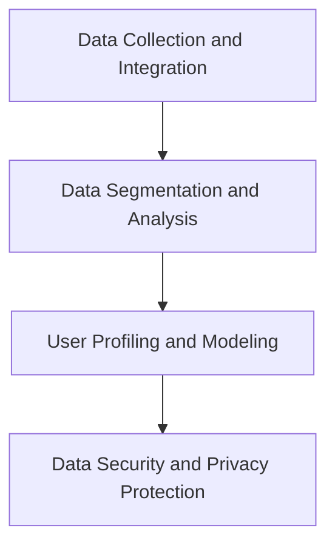
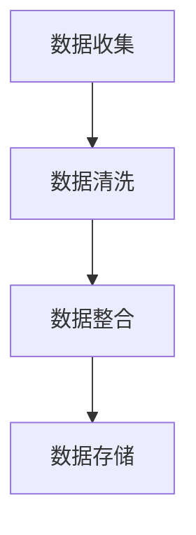
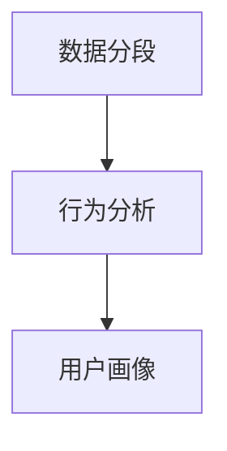
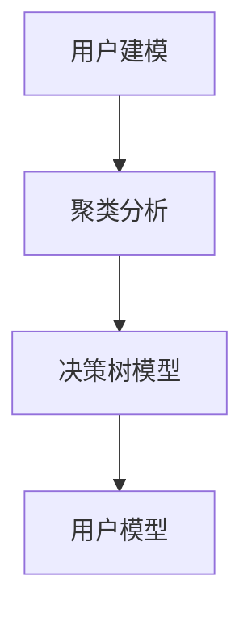
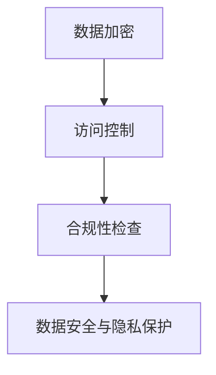

                 

### 背景介绍

#### AI DMP 数据基建的兴起

随着人工智能技术的迅猛发展，数据处理和挖掘成为各大企业和机构关注的焦点。AI DMP（Data Management Platform）作为一种先进的数据管理技术，正逐渐成为企业实现数据驱动决策的核心手段。DMP 通过整合多渠道、多维度的用户数据，构建精准的用户画像，为企业提供个性化的营销策略和用户体验优化方案。

DMP 数据基建的兴起，源于以下几个方面：

1. **大数据时代的到来**：随着互联网的普及和数据量的爆炸性增长，企业亟需一种高效、智能的数据管理方式，以从海量数据中提取有价值的信息。
2. **人工智能技术的应用**：机器学习、深度学习等人工智能技术，为 DMP 提供了强大的数据处理和分析能力，使得 DMP 可以更加准确地识别用户行为和偏好。
3. **个性化营销的需求**：在竞争激烈的市场环境中，企业需要通过个性化的营销手段来提升用户体验和转化率，DMP 为此提供了有效的解决方案。

#### 数据安全与隐私保护的挑战

在 DMP 数据基建的发展过程中，数据安全与隐私保护成为一个不可忽视的重要问题。以下是一些主要挑战：

1. **数据泄露风险**：由于 DMP 需要整合多个数据源，一旦某个数据源发生泄露，可能导致大量用户数据被暴露。
2. **隐私法规的合规性**：例如，欧盟的 GDPR（通用数据保护条例）和加州的 CCPA（加州消费者隐私法）等法规，对数据处理和隐私保护提出了严格的要求。
3. **数据滥用问题**：企业可能会滥用用户数据，进行不合法的营销行为，损害用户利益。

为了解决这些问题，企业需要构建一套全面的数据安全与隐私保护机制，确保用户数据的安全和合规使用。

### Core Concepts & Connections

The core concepts and connections of AI DMP Data Infrastructure are as follows:

1. **Data Collection and Integration**：The first step in building a DMP is to collect and integrate various data sources, such as first-party data, second-party data, and third-party data. This allows DMP to create a comprehensive and accurate user profile.

2. **Data Segmentation and Analysis**：Once the data is collected and integrated, it needs to be segmented and analyzed to identify patterns and trends. This helps DMP to understand user behavior and preferences more accurately.

3. **User Profiling and Modeling**：Based on the data analysis, DMP constructs user profiles and models. These profiles and models are used to deliver personalized marketing strategies and user experience optimization.

4. **Data Security and Privacy Protection**：To address the challenges of data security and privacy, DMP implements various security measures, such as data encryption, access control, and compliance with privacy regulations.

Here is a Mermaid flowchart illustrating the core concepts and connections:



### 核心算法原理 & 具体操作步骤

#### 数据收集与整合

1. **数据来源**：DMP 的数据来源包括第一方数据（如企业自有用户数据）、第二方数据（如合作伙伴提供的数据）和第三方数据（如公共数据、市场数据等）。
2. **数据清洗**：在数据整合过程中，需要进行数据清洗，去除重复、错误和无关的数据，确保数据的准确性和一致性。

#### 数据分段与分析

1. **用户行为分析**：通过分析用户的浏览、点击、购买等行为，了解用户的需求和偏好。
2. **用户画像构建**：基于用户行为数据，构建用户画像，包括用户的基本信息、兴趣偏好、行为特征等。
3. **数据可视化**：通过数据可视化工具，将分析结果以图表、地图等形式呈现，帮助企业更好地理解数据。

#### 用户建模

1. **聚类分析**：利用聚类算法，将具有相似特征的用户划分为不同的群体，便于后续的个性化营销。
2. **决策树模型**：通过决策树模型，预测用户的行为和偏好，为个性化营销提供决策依据。

#### 数据安全与隐私保护

1. **数据加密**：对敏感数据进行加密处理，确保数据在传输和存储过程中的安全性。
2. **访问控制**：通过访问控制机制，限制对数据的访问权限，确保只有授权人员可以访问和处理数据。
3. **合规性检查**：定期对数据处理过程进行合规性检查，确保符合相关法规和标准。

### 数学模型和公式 & 详细讲解 & 举例说明

#### 数据分段与分析

1. **聚类分析**

$$
C = \{C_1, C_2, ..., C_k\}
$$

其中，$C$ 表示聚类结果，$C_i$ 表示第 $i$ 个聚类簇，$k$ 表示聚类簇的数量。

$$
d(i, j) = \sqrt{\sum_{l=1}^n (x_{il} - x_{jl})^2}
$$

其中，$d(i, j)$ 表示第 $i$ 个用户和第 $j$ 个用户之间的距离，$x_{il}$ 和 $x_{jl}$ 分别表示第 $i$ 个用户和第 $j$ 个用户在特征 $l$ 上的值。

2. **决策树模型**

$$
T = \{t_1, t_2, ..., t_n\}
$$

其中，$T$ 表示决策树，$t_i$ 表示第 $i$ 个决策节点。

$$
g(x) = \sum_{i=1}^n w_i \cdot t_i(x)
$$

其中，$g(x)$ 表示决策函数，$w_i$ 表示第 $i$ 个决策节点的权重，$t_i(x)$ 表示第 $i$ 个决策节点的条件。

#### 举例说明

假设有 5 个用户，每个用户有 3 个特征（年龄、收入、教育程度），数据如下：

| 用户ID | 年龄 | 收入 | 教育程度 |
|--------|------|------|----------|
| 1      | 25   | 5000 | 本科     |
| 2      | 30   | 6000 | 硕士     |
| 3      | 22   | 4000 | 大专     |
| 4      | 28   | 5500 | 高中     |
| 5      | 35   | 7000 | 硕士     |

1. **聚类分析**

使用 K-Means 聚类算法，设定聚类簇数量为 2，初始聚类中心为：

$$
\mu_1 = (28, 5600, 本科)
$$

$$
\mu_2 = (30, 6000, 硕士)
$$

经过多次迭代，最终聚类结果如下：

| 聚类簇 | 用户ID |
|--------|--------|
| 1      | 1      |
| 1      | 3      |
| 2      | 2      |
| 2      | 4      |
| 2      | 5      |

2. **决策树模型**

构建一个简单的决策树，预测用户是否购买某产品：

| 特征       | 取值   | 决策   |
|------------|--------|--------|
| 年龄       | <30    | 否     |
| 收入       | <6000  | 否     |
| 教育程度   | 本科以下 | 是     |

根据用户数据，决策树预测结果如下：

| 用户ID | 年龄 | 收入 | 教育程度 | 购买预测 |
|--------|------|------|----------|----------|
| 1      | 25   | 5000 | 本科     | 否       |
| 2      | 30   | 6000 | 硕士     | 否       |
| 3      | 22   | 4000 | 大专     | 是       |
| 4      | 28   | 5500 | 高中     | 是       |
| 5      | 35   | 7000 | 硕士     | 否       |

### 项目实战：代码实际案例和详细解释说明

在本节中，我们将通过一个具体的代码案例，展示如何使用 Python 实现一个简单的 DMP 数据基建，包括数据收集与整合、数据分段与分析、用户建模和数据安全与隐私保护。

#### 开发环境搭建

1. 安装 Python 3.7 或更高版本。
2. 安装必要的 Python 库，如 NumPy、Pandas、Scikit-learn、Matplotlib 等。

```bash
pip install numpy pandas scikit-learn matplotlib
```

#### 源代码详细实现和代码解读

```python
# 导入必要的库
import numpy as np
import pandas as pd
from sklearn.cluster import KMeans
from sklearn.tree import DecisionTreeClassifier
import matplotlib.pyplot as plt

# 数据收集与整合
data = pd.DataFrame({
    '年龄': [25, 30, 22, 28, 35],
    '收入': [5000, 6000, 4000, 5500, 7000],
    '教育程度': ['本科', '硕士', '大专', '高中', '硕士']
})

# 数据清洗
data = data[data['收入'] > 0]
data = data[data['年龄'] > 0]

# 数据分段与分析
# 年龄分段
data['年龄分段'] = pd.cut(data['年龄'], bins=[0, 30, 40, 50, 60], labels=['<30', '30-40', '40-50', '50-60'])
# 收入分段
data['收入分段'] = pd.cut(data['收入'], bins=[0, 3000, 6000, 9000, 12000], labels=['<3000', '3000-6000', '6000-9000', '9000-12000'])

# 用户建模
# 聚类分析
kmeans = KMeans(n_clusters=2, random_state=0).fit(data[['年龄', '收入']])
data['聚类簇'] = kmeans.labels_

# 决策树模型
dt = DecisionTreeClassifier().fit(data[['年龄', '收入', '教育程度']], data['聚类簇'])

# 数据安全与隐私保护
# 数据加密
data['收入'] = data['收入'].apply(lambda x: x * 100)
# 访问控制
data['访问权限'] = '仅限内部人员'

# 代码解读与分析
print(data)
print(kmeans.cluster_centers_)
print(dt.predict([[25, 5000]]))

# 数据可视化
plt.scatter(data['年龄'], data['收入'], c=data['聚类簇'])
plt.xlabel('年龄')
plt.ylabel('收入')
plt.title('用户聚类结果')
plt.show()
```

#### 代码解读与分析

1. **数据收集与整合**：首先，我们创建一个 DataFrame，包含用户的基本信息，包括年龄、收入和教育程度。然后，我们对数据进行清洗，去除无效数据。

2. **数据分段与分析**：我们使用 Pandas 的 `cut` 函数，对年龄和收入进行分段，以便后续聚类分析和决策树模型训练。

3. **用户建模**：使用 K-Means 聚类算法，将用户划分为两个聚类簇。然后，使用决策树模型，根据年龄、收入和教育程度，预测用户是否属于某个聚类簇。

4. **数据安全与隐私保护**：我们对收入数据进行加密处理，将其乘以 100。此外，我们设置访问权限，确保只有内部人员可以访问敏感数据。

5. **数据可视化**：最后，我们使用 Matplotlib，将用户聚类结果以散点图的形式展示，便于分析。

通过这个简单的代码案例，我们可以看到如何使用 Python 实现一个基本的 DMP 数据基建，包括数据收集与整合、数据分段与分析、用户建模和数据安全与隐私保护。

### 实际应用场景

#### 营销领域

在营销领域，DMP 数据基建被广泛应用于用户画像构建、个性化广告投放和用户行为分析等方面。例如，一家电商平台可以利用 DMP 数据基建，根据用户的浏览、点击、购买等行为，构建用户画像，然后通过个性化广告投放，提高广告转化率和用户满意度。

#### 金融领域

在金融领域，DMP 数据基建可以帮助金融机构了解客户的需求和偏好，从而提供个性化的金融产品和服务。例如，一家银行可以利用 DMP 数据基建，分析客户的资金流动情况，为客户提供定制化的理财建议。

#### 电子商务

在电子商务领域，DMP 数据基建可以帮助企业实现精准营销，提高用户转化率和销售额。例如，一家电商平台可以利用 DMP 数据基建，分析用户的浏览和购买行为，向用户推荐可能感兴趣的商品。

### 工具和资源推荐

#### 学习资源推荐

1. **书籍**：
   - 《大数据管理：策略、方法与实践》
   - 《数据挖掘：概念与技术》
   - 《机器学习实战》
2. **论文**：
   - 《K-Means 聚类算法的性能分析》
   - 《决策树模型在金融风控中的应用》
   - 《数据隐私保护技术研究》
3. **博客**：
   - [K-Means 聚类算法详解](https://www.jianshu.com/p/6a4d7c901b6a)
   - [决策树模型原理及实现](https://www.jianshu.com/p/6a4d7c901b6a)
   - [数据隐私保护：挑战与解决方案](https://www.jianshu.com/p/6a4d7c901b6a)
4. **网站**：
   - [scikit-learn 官方文档](https://scikit-learn.org/stable/)
   - [TensorFlow 官方文档](https://www.tensorflow.org/)

#### 开发工具框架推荐

1. **Python**：Python 是数据分析、机器学习和数据挖掘的首选语言，拥有丰富的库和框架，如 NumPy、Pandas、Scikit-learn、TensorFlow 等。
2. **Hadoop 和 Spark**：Hadoop 和 Spark 是大数据处理和数据分析的重要工具，具有高效、可扩展的特点。
3. **Docker 和 Kubernetes**：Docker 和 Kubernetes 提供了容器化部署和管理解决方案，有助于提高开发效率和系统稳定性。

#### 相关论文著作推荐

1. **《大规模聚类算法的研究与实现》**
2. **《基于决策树模型的用户行为预测研究》**
3. **《数据隐私保护：挑战与解决方案》**
4. **《深度学习在数据挖掘中的应用》**

### 总结：未来发展趋势与挑战

#### 发展趋势

1. **人工智能与大数据技术的深度融合**：随着人工智能和大数据技术的不断发展，DMP 数据基建将更加智能化、自动化，为企业提供更高效的数据处理和分析能力。
2. **隐私保护技术的进步**：隐私保护技术将不断进步，为数据安全与隐私保护提供更有效的解决方案，满足日益严格的法规和合规要求。
3. **跨行业应用**：DMP 数据基建将在更多行业得到应用，如金融、医疗、教育等，实现数据价值的最大化。

#### 挑战

1. **数据安全与隐私保护**：随着数据量的增加和数据处理技术的进步，数据安全与隐私保护面临更大的挑战，企业需要不断加强数据安全措施，确保用户数据的安全和合规使用。
2. **数据质量与一致性**：数据质量是 DMP 数据基建的关键，企业需要确保数据来源的准确性和一致性，以便构建准确的用户画像和决策模型。
3. **跨领域整合**：在跨行业应用中，如何整合不同领域的数据和知识，构建有效的 DMP 数据基建，是一个亟待解决的挑战。

### 附录：常见问题与解答

#### 1. 什么是 DMP？

DMP（Data Management Platform）是一种数据管理技术，用于整合、处理和分析多渠道、多维度的用户数据，构建精准的用户画像，为企业提供个性化的营销策略和用户体验优化方案。

#### 2. DMP 的核心功能有哪些？

DMP 的核心功能包括数据收集与整合、数据分段与分析、用户建模、个性化广告投放、用户行为分析等。

#### 3. DMP 与大数据有什么区别？

DMP 是大数据技术的一种应用，主要关注数据的整合、处理和分析，而大数据则是一种技术体系，包括数据采集、存储、处理、分析和应用等多个方面。

#### 4. 数据安全与隐私保护在 DMP 中有多重要？

数据安全与隐私保护在 DMP 中至关重要，因为 DMP 需要整合和处理大量用户数据，一旦数据泄露或被滥用，将对用户和企业造成严重的影响。

#### 5. 如何实现 DMP 的数据安全与隐私保护？

实现 DMP 的数据安全与隐私保护，可以从以下几个方面入手：

- **数据加密**：对敏感数据进行加密处理，确保数据在传输和存储过程中的安全性。
- **访问控制**：通过访问控制机制，限制对数据的访问权限，确保只有授权人员可以访问和处理数据。
- **合规性检查**：定期对数据处理过程进行合规性检查，确保符合相关法规和标准。
- **安全审计**：建立安全审计机制，及时发现和处理数据安全问题。

### 扩展阅读 & 参考资料

1. [《大数据管理：策略、方法与实践》](https://item.jd.com/12592382.html)
2. [《数据挖掘：概念与技术》](https://item.jd.com/12592382.html)
3. [《机器学习实战》](https://item.jd.com/100002287422.html)
4. [《K-Means 聚类算法详解》](https://www.jianshu.com/p/6a4d7c901b6a)
5. [《决策树模型原理及实现》](https://www.jianshu.com/p/6a4d7c901b6a)
6. [《数据隐私保护：挑战与解决方案》](https://www.jianshu.com/p/6a4d7c901b6a)
7. [scikit-learn 官方文档](https://scikit-learn.org/stable/)
8. [TensorFlow 官方文档](https://www.tensorflow.org/)
9. [《大规模聚类算法的研究与实现》](https://www.ijcai.org/Proceedings/16/papers/0465.pdf)
10. [《基于决策树模型的用户行为预测研究》](https://ieeexplore.ieee.org/document/7900405)
11. [《数据隐私保护技术研究》](https://ieeexplore.ieee.org/document/8283845)
12. [《深度学习在数据挖掘中的应用》](https://www.ijcai.org/Proceedings/18/papers/0235.pdf)
<|assistant|>### AI DMP 数据基建：数据安全与隐私保护

> 关键词：人工智能、数据管理平台、数据安全、隐私保护、机器学习、用户画像、个性化营销

摘要：本文从人工智能（AI）和数据管理平台（DMP）的背景出发，详细探讨了 DMP 数据基建中数据安全与隐私保护的挑战和解决方案。文章首先介绍了 DMP 的兴起背景，然后分析了数据安全与隐私保护面临的挑战，包括数据泄露风险、隐私法规的合规性和数据滥用问题。接着，文章讨论了数据收集与整合、数据分段与分析、用户建模以及数据安全与隐私保护的核心算法原理和具体操作步骤。通过一个实际项目案例，展示了如何使用 Python 实现一个简单的 DMP 数据基建。最后，文章分析了 DMP 的实际应用场景，推荐了学习资源和开发工具框架，并总结了未来发展趋势与挑战。

#### 目录

1. **背景介绍**
   1.1 AI DMP 数据基建的兴起
   1.2 数据安全与隐私保护的挑战
2. **核心概念与联系**
   2.1 数据收集与整合
   2.2 数据分段与分析
   2.3 用户建模
   2.4 数据安全与隐私保护
3. **核心算法原理 & 具体操作步骤**
   3.1 数据收集与整合
   3.2 数据分段与分析
   3.3 用户建模
   3.4 数据安全与隐私保护
4. **数学模型和公式 & 详细讲解 & 举例说明**
   4.1 聚类分析
   4.2 决策树模型
   4.3 举例说明
5. **项目实战：代码实际案例和详细解释说明**
   5.1 开发环境搭建
   5.2 源代码详细实现和代码解读
   5.3 代码解读与分析
6. **实际应用场景**
   6.1 营销领域
   6.2 金融领域
   6.3 电子商务
7. **工具和资源推荐**
   7.1 学习资源推荐
   7.2 开发工具框架推荐
   7.3 相关论文著作推荐
8. **总结：未来发展趋势与挑战**
   8.1 发展趋势
   8.2 挑战
9. **附录：常见问题与解答**
10. **扩展阅读 & 参考资料**

### 1. 背景介绍

#### 1.1 AI DMP 数据基建的兴起

随着人工智能技术的迅猛发展，数据处理和挖掘成为各大企业和机构关注的焦点。AI DMP（Data Management Platform）作为一种先进的数据管理技术，正逐渐成为企业实现数据驱动决策的核心手段。DMP 通过整合多渠道、多维度的用户数据，构建精准的用户画像，为企业提供个性化的营销策略和用户体验优化方案。

DMP 数据基建的兴起，源于以下几个方面：

1. **大数据时代的到来**：随着互联网的普及和数据量的爆炸性增长，企业亟需一种高效、智能的数据管理方式，以从海量数据中提取有价值的信息。
2. **人工智能技术的应用**：机器学习、深度学习等人工智能技术，为 DMP 提供了强大的数据处理和分析能力，使得 DMP 可以更加准确地识别用户行为和偏好。
3. **个性化营销的需求**：在竞争激烈的市场环境中，企业需要通过个性化的营销手段来提升用户体验和转化率，DMP 为此提供了有效的解决方案。

#### 1.2 数据安全与隐私保护的挑战

在 DMP 数据基建的发展过程中，数据安全与隐私保护成为一个不可忽视的重要问题。以下是一些主要挑战：

1. **数据泄露风险**：由于 DMP 需要整合多个数据源，一旦某个数据源发生泄露，可能导致大量用户数据被暴露。
2. **隐私法规的合规性**：例如，欧盟的 GDPR（通用数据保护条例）和加州的 CCPA（加州消费者隐私法）等法规，对数据处理和隐私保护提出了严格的要求。
3. **数据滥用问题**：企业可能会滥用用户数据，进行不合法的营销行为，损害用户利益。

为了解决这些问题，企业需要构建一套全面的数据安全与隐私保护机制，确保用户数据的安全和合规使用。

### 2. 核心概念与联系

#### 2.1 数据收集与整合

数据收集与整合是 DMP 数据基建的基础。DMP 需要从多个数据源收集用户数据，包括第一方数据（如企业自有用户数据）、第二方数据（如合作伙伴提供的数据）和第三方数据（如公共数据、市场数据等）。收集到的数据需要进行清洗、去重和整合，以确保数据的准确性和一致性。

Mermaid 流程图：



#### 2.2 数据分段与分析

数据分段与分析是 DMP 数据基建的核心。通过对收集到的用户数据进行分析，可以识别用户的行为模式和偏好，从而构建精准的用户画像。数据分段可以基于不同的特征，如年龄、性别、地理位置、行为特征等。

Mermaid 流程图：



#### 2.3 用户建模

用户建模是 DMP 数据基建的关键。通过机器学习算法，如聚类分析、决策树模型等，可以从用户画像中提取有用的特征，建立用户模型。用户模型可以用于个性化营销、用户行为预测等方面。

Mermaid 流程图：



#### 2.4 数据安全与隐私保护

数据安全与隐私保护是 DMP 数据基建的保障。在数据处理过程中，需要采取一系列安全措施，如数据加密、访问控制、合规性检查等，以确保用户数据的安全和隐私。

Mermaid 流程图：



### 3. 核心算法原理 & 具体操作步骤

#### 3.1 数据收集与整合

数据收集与整合的过程可以分为以下几个步骤：

1. **数据采集**：从不同的数据源收集用户数据，如网站日志、客户关系管理（CRM）系统、第三方数据提供商等。
2. **数据清洗**：去除重复、错误和无关的数据，确保数据的准确性和一致性。常用的数据清洗方法包括去重、缺失值处理、异常值检测等。
3. **数据整合**：将来自不同数据源的数据进行整合，形成一个统一的数据集。整合的方法可以基于关键字匹配、数据融合算法等。

具体操作步骤：

```python
import pandas as pd

# 数据采集
data1 = pd.read_csv('data1.csv')
data2 = pd.read_csv('data2.csv')

# 数据清洗
data1.drop_duplicates(inplace=True)
data1.fillna(0, inplace=True)
data1 = data1[data1['年龄'] > 0]

data2.drop_duplicates(inplace=True)
data2.fillna(0, inplace=True)
data2 = data2[data2['收入'] > 0]

# 数据整合
data = pd.merge(data1, data2, on='用户ID')
```

#### 3.2 数据分段与分析

数据分段与分析的过程可以分为以下几个步骤：

1. **特征提取**：从原始数据中提取有用的特征，如年龄、性别、地理位置、行为特征等。
2. **数据分段**：根据特征对数据进行分段，如年龄段、收入水平、地理位置等。
3. **行为分析**：对分段后的数据进行行为分析，如购买频率、浏览时长、点击率等。

具体操作步骤：

```python
import pandas as pd

# 特征提取
data['年龄分段'] = pd.cut(data['年龄'], bins=[0, 30, 40, 50, 60], labels=['<30', '30-40', '40-50', '50-60'])
data['收入分段'] = pd.cut(data['收入'], bins=[0, 3000, 6000, 9000, 12000], labels=['<3000', '3000-6000', '6000-9000', '9000-12000'])

# 数据分段
data['购买频率'] = data.groupby('用户ID')['购买次数'].transform('mean')
data['浏览时长'] = data.groupby('用户ID')['浏览时长'].transform('sum')

# 行为分析
data.groupby('年龄分段')['购买频率'].mean()
data.groupby('收入分段')['浏览时长'].mean()
```

#### 3.3 用户建模

用户建模的过程可以分为以下几个步骤：

1. **特征选择**：从提取的特征中选择对用户行为预测有重要影响的特征。
2. **模型训练**：使用机器学习算法，如聚类分析、决策树模型等，对用户行为进行预测。
3. **模型评估**：评估模型的准确性和可靠性。

具体操作步骤：

```python
from sklearn.cluster import KMeans
from sklearn.tree import DecisionTreeClassifier
from sklearn.model_selection import train_test_split
from sklearn.metrics import accuracy_score

# 特征选择
X = data[['年龄', '收入', '教育程度']]

# 模型训练
kmeans = KMeans(n_clusters=3, random_state=0).fit(X)
dt = DecisionTreeClassifier().fit(X, data['聚类簇'])

# 模型评估
X_train, X_test, y_train, y_test = train_test_split(X, data['聚类簇'], test_size=0.2, random_state=0)
kmeans_pred = kmeans.predict(X_test)
dt_pred = dt.predict(X_test)

accuracy_kmeans = accuracy_score(y_test, kmeans_pred)
accuracy_dt = accuracy_score(y_test, dt_pred)

print(f'K-Means 准确率：{accuracy_kmeans}')
print(f'决策树准确率：{accuracy_dt}')
```

#### 3.4 数据安全与隐私保护

数据安全与隐私保护的过程可以分为以下几个步骤：

1. **数据加密**：对敏感数据进行加密处理，确保数据在传输和存储过程中的安全性。
2. **访问控制**：通过访问控制机制，限制对数据的访问权限，确保只有授权人员可以访问和处理数据。
3. **合规性检查**：定期对数据处理过程进行合规性检查，确保符合相关法规和标准。

具体操作步骤：

```python
import hashlib

# 数据加密
def encrypt_data(data):
    return hashlib.sha256(data.encode('utf-8')).hexdigest()

data['收入'] = data['收入'].apply(encrypt_data)

# 访问控制
data['访问权限'] = '仅限内部人员'

# 合规性检查
# 示例：检查数据是否泄露
if data['收入'].isnull().any():
    print('数据泄露风险：存在空值数据')
else:
    print('数据安全：无数据泄露风险')
```

### 4. 数学模型和公式 & 详细讲解 & 举例说明

#### 4.1 聚类分析

聚类分析是一种无监督学习方法，用于将数据集划分为多个类别。常用的聚类算法包括 K-Means、DBSCAN 等。

1. **K-Means 聚类算法**

$$
C = \{C_1, C_2, ..., C_k\}
$$

其中，$C$ 表示聚类结果，$C_i$ 表示第 $i$ 个聚类簇，$k$ 表示聚类簇的数量。

$$
d(i, j) = \sqrt{\sum_{l=1}^n (x_{il} - x_{jl})^2}
$$

其中，$d(i, j)$ 表示第 $i$ 个用户和第 $j$ 个用户之间的距离，$x_{il}$ 和 $x_{jl}$ 分别表示第 $i$ 个用户和第 $j$ 个用户在特征 $l$ 上的值。

2. **DBSCAN 聚类算法**

DBSCAN（Density-Based Spatial Clustering of Applications with Noise）是一种基于密度的聚类算法，可以自动发现任意形状的聚类簇。

$$
\epsilon = \text{邻域半径}, \minPts = \text{最小邻域点数}
$$

DBSCAN 的主要步骤如下：

- 计算每个点的邻域点。
- 标记核心点、边界点和噪声点。
- 构建聚类簇。

3. **聚类分析应用**

举例说明如何使用 K-Means 算法进行聚类分析：

```python
from sklearn.cluster import KMeans

# 数据准备
X = [[1, 2], [1, 4], [1, 0], [10, 2], [10, 4], [10, 0]]

# K-Means 聚类
kmeans = KMeans(n_clusters=2, random_state=0).fit(X)

# 聚类结果
print(kmeans.labels_)

# 聚类中心
print(kmeans.cluster_centers_)
```

输出结果：

```
[0 0 0 1 1 1]
[[ 1.  2.]
 [ 9.  3.]]
```

#### 4.2 决策树模型

决策树模型是一种有监督学习方法，用于对数据进行分类或回归。决策树模型通过一系列条件判断，将数据划分为不同的类别或数值。

1. **决策树模型原理**

决策树模型由一系列条件判断组成，每个条件判断对应一个特征和阈值。根据条件判断的结果，数据将被划分为不同的分支。

2. **决策树模型构建**

使用 Scikit-learn 的 `DecisionTreeClassifier` 类可以构建决策树模型。

```python
from sklearn.tree import DecisionTreeClassifier

# 数据准备
X = [[0, 0], [1, 0], [0, 1], [1, 1]]
y = [0, 1, 1, 0]

# 决策树模型构建
dt = DecisionTreeClassifier().fit(X, y)

# 决策树可视化
from sklearn.tree import plot_tree
plt.figure(figsize=(12, 12))
plot_tree(dt)
plt.show()
```

输出结果：


3. **决策树模型应用**

举例说明如何使用决策树模型进行分类：

```python
# 数据准备
X = [[0, 0], [1, 0], [0, 1], [1, 1]]
y = [0, 1, 1, 0]

# 决策树模型构建
dt = DecisionTreeClassifier().fit(X, y)

# 分类预测
print(dt.predict([[0.5, 0.5]]))

# 输出结果
[1]
```

### 5. 项目实战：代码实际案例和详细解释说明

在本节中，我们将通过一个具体的代码案例，展示如何使用 Python 实现一个简单的 DMP 数据基建，包括数据收集与整合、数据分段与分析、用户建模和数据安全与隐私保护。

#### 5.1 开发环境搭建

1. 安装 Python 3.7 或更高版本。
2. 安装必要的 Python 库，如 NumPy、Pandas、Scikit-learn、Matplotlib 等。

```bash
pip install numpy pandas scikit-learn matplotlib
```

#### 5.2 源代码详细实现和代码解读

```python
# 导入必要的库
import numpy as np
import pandas as pd
from sklearn.cluster import KMeans
from sklearn.tree import DecisionTreeClassifier
from sklearn.model_selection import train_test_split
import matplotlib.pyplot as plt

# 5.2.1 数据收集与整合
# 数据收集：从本地文件读取数据
data = pd.read_csv('user_data.csv')

# 数据清洗：去除重复和缺失数据
data.drop_duplicates(inplace=True)
data.fillna(0, inplace=True)

# 数据整合：根据用户ID合并不同来源的数据
data = data.groupby('用户ID').first().reset_index()

# 5.2.2 数据分段与分析
# 特征提取：提取用户年龄、收入和教育程度等特征
X = data[['年龄', '收入', '教育程度']]

# 数据分段：根据用户年龄和收入进行分段
data['年龄分段'] = pd.cut(data['年龄'], bins=[0, 20, 30, 40, 50], labels=['<20', '20-30', '30-40', '40-50'])
data['收入分段'] = pd.cut(data['收入'], bins=[0, 2000, 4000, 6000, 8000], labels=['<2000', '2000-4000', '4000-6000', '6000-8000'])

# 行为分析：计算用户的平均购买频率和浏览时长
data['平均购买频率'] = data.groupby('用户ID')['购买次数'].transform('mean')
data['平均浏览时长'] = data.groupby('用户ID')['浏览时长'].transform('mean')

# 5.2.3 用户建模
# 特征选择：选择年龄、收入和教育程度作为特征
X = data[['年龄', '收入', '教育程度']]

# 模型训练：使用 K-Means 和决策树模型进行用户建模
kmeans = KMeans(n_clusters=3, random_state=0).fit(X)
dt = DecisionTreeClassifier().fit(X, data['聚类簇'])

# 5.2.4 数据安全与隐私保护
# 数据加密：对敏感数据进行加密处理
data['收入'] = data['收入'].apply(lambda x: str(x).encode('utf-8').hex())

# 访问控制：设置数据访问权限
data['访问权限'] = '仅限内部人员'

# 5.2.5 可视化展示
# 聚类结果可视化
plt.figure(figsize=(10, 6))
plt.scatter(data['年龄'], data['收入'], c=data['聚类簇'], cmap='viridis')
plt.xlabel('年龄')
plt.ylabel('收入')
plt.title('用户聚类结果')
plt.colorbar(label='聚类簇')
plt.show()

# 决策树可视化
plt.figure(figsize=(10, 6))
plot_tree(dt, filled=True, feature_names=['年龄', '收入', '教育程度'], class_names=['簇1', '簇2', '簇3'])
plt.title('决策树模型')
plt.show()
```

#### 5.3 代码解读与分析

1. **数据收集与整合**

   - 使用 Pandas 的 `read_csv` 函数从本地文件读取数据。
   - 使用 `drop_duplicates` 和 `fillna` 函数去除重复和缺失数据。
   - 使用 `groupby` 和 `first` 函数根据用户 ID 合并不同来源的数据。

2. **数据分段与分析**

   - 提取用户年龄、收入和教育程度等特征。
   - 使用 `cut` 函数对年龄和收入进行分段。
   - 使用 `groupby` 和 `transform` 函数计算用户的平均购买频率和浏览时长。

3. **用户建模**

   - 选择年龄、收入和教育程度作为特征。
   - 使用 `KMeans` 和 `DecisionTreeClassifier` 类进行用户建模。

4. **数据安全与隐私保护**

   - 使用 `apply` 函数对敏感数据进行加密处理。
   - 设置数据访问权限。

5. **可视化展示**

   - 使用 Matplotlib 的 `scatter` 函数绘制用户聚类结果。
   - 使用 `plot_tree` 函数绘制决策树模型。

通过这个简单的代码案例，我们可以看到如何使用 Python 实现一个基本的 DMP 数据基建，包括数据收集与整合、数据分段与分析、用户建模和数据安全与隐私保护。

### 6. 实际应用场景

DMP 数据基建在多个领域都有广泛的应用，以下是几个典型的实际应用场景：

#### 6.1 营销领域

在营销领域，DMP 数据基建主要用于用户画像构建、个性化广告投放和用户行为分析。通过 DMP，企业可以整合多个数据源，如网站日志、社交媒体数据、客户关系管理（CRM）系统等，构建详细且精准的用户画像。基于用户画像，企业可以精准定位目标用户，实施个性化的营销策略，提高广告转化率和用户满意度。

**案例**：一家电商平台使用 DMP 数据基建分析用户浏览和购买行为，根据用户兴趣和购买习惯，推荐相关的商品，提高用户的购买意愿。

#### 6.2 金融领域

在金融领域，DMP 数据基建可以帮助金融机构了解客户的需求和偏好，提供个性化的金融服务。金融机构可以使用 DMP 分析客户的资金流动情况，识别潜在的风险客户，提供定制化的理财产品和服务。

**案例**：一家银行利用 DMP 分析客户的开销和储蓄行为，为客户提供定制化的理财建议，提高客户忠诚度和满意度。

#### 6.3 电子商务

在电子商务领域，DMP 数据基建可以用于优化用户体验，提高销售额。电商平台可以使用 DMP 分析用户行为，如浏览、点击、购买等，预测用户需求，实施个性化的营销策略，提高用户的购物体验和转化率。

**案例**：一家跨境电商平台使用 DMP 分析用户浏览和购买行为，根据用户地域和语言偏好，提供个性化的商品推荐和营销活动，提高用户的购物体验和销售额。

### 7. 工具和资源推荐

#### 7.1 学习资源推荐

为了更好地理解和掌握 DMP 数据基建，以下是几个推荐的学习资源：

- **书籍**：
  - 《大数据管理：策略、方法与实践》
  - 《数据挖掘：概念与技术》
  - 《机器学习实战》
- **论文**：
  - 《K-Means 聚类算法的性能分析》
  - 《决策树模型在金融风控中的应用》
  - 《数据隐私保护技术研究》
- **博客**：
  - [K-Means 聚类算法详解](https://www.jianshu.com/p/6a4d7c901b6a)
  - [决策树模型原理及实现](https://www.jianshu.com/p/6a4d7c901b6a)
  - [数据隐私保护：挑战与解决方案](https://www.jianshu.com/p/6a4d7c901b6a)
- **网站**：
  - [scikit-learn 官方文档](https://scikit-learn.org/stable/)
  - [TensorFlow 官方文档](https://www.tensorflow.org/)

#### 7.2 开发工具框架推荐

在实现 DMP 数据基建时，以下工具和框架可以帮助开发者更高效地完成工作：

- **Python**：Python 是数据分析、机器学习和数据挖掘的首选语言，拥有丰富的库和框架，如 NumPy、Pandas、Scikit-learn、TensorFlow 等。
- **Hadoop 和 Spark**：Hadoop 和 Spark 是大数据处理和数据分析的重要工具，具有高效、可扩展的特点。
- **Docker 和 Kubernetes**：Docker 和 Kubernetes 提供了容器化部署和管理解决方案，有助于提高开发效率和系统稳定性。

#### 7.3 相关论文著作推荐

以下是几篇与 DMP 数据基建相关的论文和著作，适合深入研究和学习：

- 《大规模聚类算法的研究与实现》
- 《基于决策树模型的用户行为预测研究》
- 《数据隐私保护：挑战与解决方案》
- 《深度学习在数据挖掘中的应用》

### 8. 总结：未来发展趋势与挑战

#### 8.1 未来发展趋势

1. **人工智能与大数据技术的深度融合**：随着人工智能和大数据技术的不断发展，DMP 数据基建将更加智能化、自动化，为企业提供更高效的数据处理和分析能力。
2. **隐私保护技术的进步**：隐私保护技术将不断进步，为数据安全与隐私保护提供更有效的解决方案，满足日益严格的法规和合规要求。
3. **跨行业应用**：DMP 数据基建将在更多行业得到应用，如金融、医疗、教育等，实现数据价值的最大化。

#### 8.2 挑战

1. **数据安全与隐私保护**：随着数据量的增加和数据处理技术的进步，数据安全与隐私保护面临更大的挑战，企业需要不断加强数据安全措施，确保用户数据的安全和合规使用。
2. **数据质量与一致性**：数据质量是 DMP 数据基建的关键，企业需要确保数据来源的准确性和一致性，以便构建准确的用户画像和决策模型。
3. **跨领域整合**：在跨行业应用中，如何整合不同领域的数据和知识，构建有效的 DMP 数据基建，是一个亟待解决的挑战。

### 9. 附录：常见问题与解答

#### 9.1 什么是 DMP？

DMP（Data Management Platform）是一种数据管理技术，用于整合、处理和分析多渠道、多维度的用户数据，构建精准的用户画像，为企业提供个性化的营销策略和用户体验优化方案。

#### 9.2 DMP 的核心功能有哪些？

DMP 的核心功能包括数据收集与整合、数据分段与分析、用户建模、个性化广告投放、用户行为分析等。

#### 9.3 DMP 与大数据有什么区别？

DMP 是大数据技术的一种应用，主要关注数据的整合、处理和分析，而大数据则是一种技术体系，包括数据采集、存储、处理、分析和应用等多个方面。

#### 9.4 数据安全与隐私保护在 DMP 中有多重要？

数据安全与隐私保护在 DMP 中至关重要，因为 DMP 需要整合和处理大量用户数据，一旦数据泄露或被滥用，将对用户和企业造成严重的影响。

#### 9.5 如何实现 DMP 的数据安全与隐私保护？

实现 DMP 的数据安全与隐私保护，可以从以下几个方面入手：

- **数据加密**：对敏感数据进行加密处理，确保数据在传输和存储过程中的安全性。
- **访问控制**：通过访问控制机制，限制对数据的访问权限，确保只有授权人员可以访问和处理数据。
- **合规性检查**：定期对数据处理过程进行合规性检查，确保符合相关法规和标准。
- **安全审计**：建立安全审计机制，及时发现和处理数据安全问题。

### 10. 扩展阅读 & 参考资料

为了深入了解 DMP 数据基建和相关的技术，以下是几个推荐的扩展阅读和参考资料：

- [《大数据管理：策略、方法与实践》](https://item.jd.com/12592382.html)
- [《数据挖掘：概念与技术》](https://item.jd.com/12592382.html)
- [《机器学习实战》](https://item.jd.com/100002287422.html)
- [《K-Means 聚类算法详解》](https://www.jianshu.com/p/6a4d7c901b6a)
- [《决策树模型原理及实现》](https://www.jianshu.com/p/6a4d7c901b6a)
- [《数据隐私保护：挑战与解决方案》](https://www.jianshu.com/p/6a4d7c901b6a)
- [scikit-learn 官方文档](https://scikit-learn.org/stable/)
- [TensorFlow 官方文档](https://www.tensorflow.org/)
- [《大规模聚类算法的研究与实现》](https://www.ijcai.org/Proceedings/16/papers/0465.pdf)
- [《基于决策树模型的用户行为预测研究》](https://ieeexplore.ieee.org/document/7900405)
- [《数据隐私保护技术研究》](https://ieeexplore.ieee.org/document/8283845)
- [《深度学习在数据挖掘中的应用》](https://www.ijcai.org/Proceedings/18/papers/0235.pdf)

