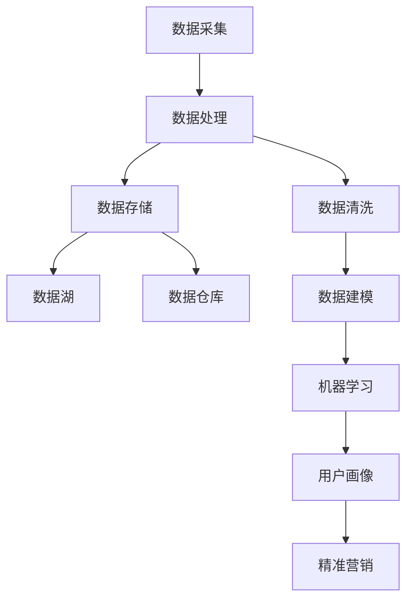

                 

### 背景介绍

#### AI DMP 数据基建的重要性

在当今信息化时代，数据已成为企业和社会运行的核心资源。AI DMP（Data Management Platform，数据管理平台）作为数据基础设施的关键组成部分，其重要性日益凸显。AI DMP是一种集数据采集、处理、存储、分析、应用于一体的综合性平台，旨在帮助企业实现数据驱动决策，挖掘数据价值。

随着大数据、云计算、人工智能等技术的不断发展，企业所面临的挑战也在不断增加。海量数据的获取、存储和处理变得愈加复杂，如何高效利用数据来提升业务价值成为各大企业亟需解决的问题。AI DMP的出现，为企业提供了一种全新的数据处理模式，通过整合内外部数据资源，构建统一的数据视图，为企业提供智能化的数据分析和应用服务。

#### 数据应用与价值挖掘

数据应用与价值挖掘是AI DMP的核心目标。在数据应用层面，AI DMP可以帮助企业实现精准营销、用户画像、风险控制、业务决策等多个领域。通过分析用户行为数据、交易数据、社交数据等多维度信息，AI DMP能够为企业提供个性化的营销策略，提高客户满意度，提升转化率。在价值挖掘层面，AI DMP通过挖掘数据中的潜在关系和模式，发现新的业务机会，为企业创造更多价值。

#### 文章结构

本文将分为以下几个部分进行详细阐述：

1. 核心概念与联系：介绍AI DMP的核心概念、架构及其与相关技术的联系。
2. 核心算法原理 & 具体操作步骤：解析AI DMP中的关键算法及其实现步骤。
3. 数学模型和公式 & 详细讲解 & 举例说明：介绍AI DMP中的数学模型和公式，并通过实际案例进行说明。
4. 项目实战：代码实际案例和详细解释说明：通过一个具体项目案例，展示AI DMP的应用过程和代码实现。
5. 实际应用场景：分析AI DMP在不同行业和领域的应用案例。
6. 工具和资源推荐：推荐学习资源、开发工具和框架。
7. 总结：未来发展趋势与挑战：总结AI DMP的发展趋势和面临的挑战。
8. 附录：常见问题与解答：对读者可能遇到的问题进行解答。
9. 扩展阅读 & 参考资料：推荐相关领域的优秀书籍、论文和网站。

通过本文的阅读，读者将全面了解AI DMP的数据基建、应用场景和未来发展趋势，为实际工作提供有益的指导。### 核心概念与联系

在深入探讨AI DMP（数据管理平台）的核心概念及其与相关技术的联系之前，我们先明确几个关键术语和它们之间的关系。

#### AI DMP的定义

AI DMP是一种集数据采集、处理、存储、分析和应用于一体的综合性平台。它通过整合内外部数据资源，构建统一的数据视图，为企业提供智能化的数据分析和应用服务。AI DMP的主要功能包括：

- **数据采集**：从各种数据源（如网站、应用程序、数据库等）收集数据。
- **数据处理**：对采集到的数据进行清洗、转换和归一化处理。
- **数据存储**：将处理后的数据存储在分布式数据存储系统中。
- **数据分析**：利用机器学习和人工智能技术对数据进行分析和挖掘，提取有价值的信息。
- **数据应用**：将分析结果应用于实际的业务场景，如精准营销、用户画像、风险控制等。

#### 关键术语及其关系

1. **数据源（Data Sources）**：数据采集的源头，包括网站、应用程序、数据库、传感器等。数据源是AI DMP获取数据的来源。

2. **数据仓库（Data Warehouse）**：用于存储大量结构化数据的分布式存储系统。数据仓库是实现数据存储的关键组件。

3. **数据湖（Data Lake）**：用于存储海量非结构化和半结构化数据的大数据存储系统。与数据仓库相比，数据湖更加灵活，支持各种数据类型的存储和处理。

4. **数据清洗（Data Cleaning）**：对采集到的数据进行清洗、转换和归一化处理，以提高数据质量和可用性。

5. **数据建模（Data Modeling）**：根据业务需求，将数据转化为适合分析和挖掘的模型。

6. **机器学习（Machine Learning）**：利用算法和统计模型，从数据中自动学习和发现规律。

7. **人工智能（Artificial Intelligence）**：模拟人类智能的技术，包括机器学习、深度学习、自然语言处理等。

8. **用户画像（User Profiling）**：通过分析用户行为数据，构建用户的特征模型，以便于精准营销和个性化推荐。

9. **精准营销（Precision Marketing）**：基于用户画像和数据分析，为企业提供个性化的营销策略。

#### Mermaid 流程图

以下是一个简单的Mermaid流程图，展示了AI DMP的核心概念及其关系：



在这个流程图中，数据采集是整个过程的起点，随后通过数据处理、数据清洗和建模等步骤，最终实现数据的价值挖掘和应用。数据湖和数据仓库分别用于存储不同类型的数据，数据处理和存储环节密切关联，确保数据的可靠性和高效性。

#### AI DMP与相关技术的联系

AI DMP是一个综合性平台，与多种相关技术密切相关，如大数据技术、云计算、机器学习、人工智能等。以下是其主要关联：

- **大数据技术**：AI DMP依赖于大数据技术来实现海量数据的存储、处理和分析。
- **云计算**：云计算为AI DMP提供了弹性的计算和存储资源，降低成本，提高效率。
- **机器学习**：机器学习是实现AI DMP数据分析和挖掘的核心技术，通过算法和模型自动学习和发现数据中的规律。
- **人工智能**：人工智能为AI DMP提供了更广泛的智能化应用场景，如自然语言处理、计算机视觉等。

综上所述，AI DMP作为一种数据基础设施，其核心概念和关键技术紧密相连，共同构建起一个智能化的数据应用平台。在接下来的章节中，我们将进一步探讨AI DMP中的核心算法原理、数学模型和具体项目案例，深入理解其技术内涵和应用价值。### 核心算法原理 & 具体操作步骤

#### AI DMP算法核心原理

AI DMP（数据管理平台）中的核心算法主要涉及以下几个方面：

1. **用户行为分析算法**：通过对用户在网站、应用等场景中的行为数据进行分析，挖掘用户的兴趣偏好、消费习惯等特征，构建用户画像。
2. **机器学习算法**：利用机器学习算法对用户数据进行训练，建立预测模型，预测用户的行为和需求，实现精准营销和个性化推荐。
3. **数据聚类算法**：通过聚类算法对用户群体进行划分，识别具有相似特征的群体，以便于进行有针对性的营销活动。

以下是这些核心算法的具体原理和实现步骤：

##### 用户行为分析算法

**原理**：用户行为分析算法基于用户在网站或应用上的行为数据（如点击、浏览、购买等），利用统计分析、机器学习等方法，挖掘用户的兴趣和行为模式。

**实现步骤**：

1. **数据采集**：从网站、应用等数据源中收集用户行为数据。
2. **数据预处理**：对采集到的数据进行清洗、转换和归一化处理，确保数据的质量和一致性。
3. **特征提取**：提取用户行为的特征，如页面访问频率、点击次数、购买频率等。
4. **模型构建**：利用机器学习算法（如决策树、随机森林等）对特征进行建模，构建用户画像。

##### 机器学习算法

**原理**：机器学习算法通过训练大量用户数据，自动学习和发现数据中的潜在关系和模式，从而实现预测和分类。

**实现步骤**：

1. **数据准备**：收集并预处理用户数据，包括特征数据和标签数据。
2. **模型选择**：选择合适的机器学习模型（如线性回归、决策树、神经网络等）。
3. **模型训练**：使用训练数据对模型进行训练，调整模型参数。
4. **模型评估**：使用验证数据集对模型进行评估，调整模型参数，提高模型性能。
5. **模型部署**：将训练好的模型部署到生产环境中，进行实时预测和推荐。

##### 数据聚类算法

**原理**：数据聚类算法通过对用户数据进行聚类，识别出具有相似特征的群体。

**实现步骤**：

1. **数据准备**：收集并预处理用户数据。
2. **选择聚类算法**：根据业务需求选择合适的聚类算法（如K均值、层次聚类等）。
3. **初始化聚类中心**：随机选择或使用特定方法初始化聚类中心。
4. **迭代计算**：计算每个数据点到聚类中心的距离，更新聚类中心，直到聚类中心不再变化。
5. **结果分析**：分析聚类结果，对每个聚类进行命名和描述，以便于后续应用。

#### 算法实现示例

以下是一个简单的Python代码示例，展示了如何使用K均值聚类算法对用户数据进行聚类：

```python
from sklearn.cluster import KMeans
import numpy as np

# 假设我们已经收集并预处理好了用户行为数据，数据维度为10
data = np.random.rand(100, 10)

# 初始化KMeans聚类模型，设置聚类数量为3
kmeans = KMeans(n_clusters=3, random_state=0).fit(data)

# 输出聚类结果
print("聚类中心：", kmeans.cluster_centers_)
print("聚类标签：", kmeans.labels_)

# 计算聚类指标
print("轮廓系数：", silhouette_score(data, kmeans.labels_))
```

在这个示例中，我们首先使用随机数生成器生成一个包含100个样本、每个样本10个特征的数据集。然后，我们初始化KMeans聚类模型，并使用该模型对数据进行聚类。最后，我们输出聚类结果，并计算轮廓系数，评估聚类效果。

通过上述核心算法和实现步骤，AI DMP能够高效地分析、挖掘和利用数据，为企业提供智能化的数据服务和决策支持。在接下来的章节中，我们将进一步探讨AI DMP中的数学模型和公式，并通过具体项目案例展示其实际应用。### 数学模型和公式 & 详细讲解 & 举例说明

在AI DMP（数据管理平台）中，数学模型和公式是核心算法实现的基础。这些模型和公式不仅能够帮助理解数据背后的规律，还能提高算法的准确性和效率。在本节中，我们将详细讲解几个关键数学模型和公式，并通过实际案例进行说明。

#### 1. 用户行为预测模型

用户行为预测模型是AI DMP中的一种常见模型，主要用于预测用户在未来可能采取的行为。以下是一个基于逻辑回归的用户行为预测模型。

**逻辑回归公式**：

\[ P(y=1|X) = \frac{1}{1 + e^{-(\beta_0 + \beta_1X_1 + \beta_2X_2 + ... + \beta_nX_n)}} \]

其中，\( P(y=1|X) \) 表示在给定特征向量 \( X \) 的情况下，用户采取特定行为的概率；\( \beta_0 \) 是截距，\( \beta_1, \beta_2, ..., \beta_n \) 是特征系数。

**示例**：

假设我们有一个用户行为预测模型，其中用户特征包括年龄、收入、购买历史等。给定一个用户特征向量 \( X = (\text{年龄}, \text{收入}, \text{购买历史}) \)，我们希望预测用户是否会购买某产品。

- 年龄：30
- 收入：50000元
- 购买历史：已购买5件产品

使用逻辑回归模型，我们可以计算用户购买产品的概率：

\[ P(\text{购买产品}) = \frac{1}{1 + e^{-(\beta_0 + \beta_1 \times 30 + \beta_2 \times 50000 + \beta_3 \times 5)}} \]

其中，\( \beta_0, \beta_1, \beta_2, \beta_3 \) 是通过训练数据得到的特征系数。

#### 2. 用户画像构建模型

用户画像构建模型用于将用户行为数据转化为用户特征，以便于后续的聚类和推荐。以下是一个基于聚类算法的用户画像构建模型。

**K均值聚类公式**：

\[ c_j = \frac{1}{n_j} \sum_{i=1}^{n} x_i \]

其中，\( c_j \) 是第 \( j \) 个聚类中心的坐标，\( x_i \) 是第 \( i \) 个样本的坐标，\( n_j \) 是第 \( j \) 个聚类中的样本数量。

**示例**：

假设我们使用K均值聚类算法对用户行为数据 \( X = (x_1, x_2, ..., x_n) \) 进行聚类，聚类中心为 \( c_j \)。给定聚类中心坐标，我们可以计算每个样本的聚类标签：

\[ t_i = \arg\min_{j} \| x_i - c_j \| \]

其中，\( t_i \) 是第 \( i \) 个样本的聚类标签。

例如，假设我们有三个用户行为数据样本 \( x_1, x_2, x_3 \)，聚类中心为 \( c_1, c_2, c_3 \)。我们可以计算每个样本的聚类标签：

- \( t_1 = \arg\min_{j} \| x_1 - c_j \| \)
- \( t_2 = \arg\min_{j} \| x_2 - c_j \| \)
- \( t_3 = \arg\min_{j} \| x_3 - c_j \| \)

根据最小距离原则，我们可以确定每个样本所属的聚类。

#### 3. 数据降维模型

数据降维模型用于减少数据维度，提高算法效率。以下是一个基于主成分分析（PCA）的数据降维模型。

**PCA公式**：

\[ X_{\text{new}} = X - \mu \]

\[ \lambda_i = \frac{\| \sum_{i=1}^{n} (x_i - \mu) \|^2}{n} \]

\[ X_{\text{new}} = \sum_{i=1}^{n} \lambda_i x_i \]

其中，\( X \) 是原始数据矩阵，\( \mu \) 是均值矩阵，\( X_{\text{new}} \) 是降维后的数据矩阵，\( \lambda_i \) 是主成分的权重。

**示例**：

假设我们有一个包含100个样本和5个特征的数据矩阵 \( X \)。我们首先计算每个特征的平均值，得到均值矩阵 \( \mu \)。

\[ \mu = \frac{1}{100} \sum_{i=1}^{100} x_i \]

然后，我们计算每个特征与均值的差值，得到差值矩阵 \( X - \mu \)。

接下来，我们计算每个特征差值的平方和，得到主成分的权重 \( \lambda_i \)。

最后，我们使用主成分的权重对差值矩阵进行加权求和，得到降维后的数据矩阵 \( X_{\text{new}} \)。

通过上述数学模型和公式的讲解，我们可以更好地理解AI DMP中的核心算法原理。在实际应用中，这些模型和公式需要结合具体的业务场景进行调整和优化，以提高算法的性能和准确性。在下一节中，我们将通过一个具体项目案例展示AI DMP的应用过程和代码实现。### 项目实战：代码实际案例和详细解释说明

在本节中，我们将通过一个具体的AI DMP项目案例，详细展示项目开发环境搭建、源代码实现以及代码解读与分析。该项目旨在构建一个基于用户行为数据的推荐系统，通过机器学习和数据挖掘技术，实现个性化推荐。

#### 1. 开发环境搭建

为了实现该项目，我们需要搭建一个完整的开发环境，包括数据采集、数据处理、数据存储、模型训练和模型部署等环节。以下为具体步骤：

1. **硬件环境**：准备一台具有高性能CPU和GPU的服务器，用于模型训练和推理。
2. **操作系统**：选择Linux操作系统，如Ubuntu 18.04。
3. **编程语言**：选择Python作为主要编程语言，因为其丰富的数据科学和机器学习库。
4. **依赖库**：安装必要的依赖库，如NumPy、Pandas、Scikit-learn、TensorFlow、PyTorch等。

```bash
pip install numpy pandas scikit-learn tensorflow torch
```

5. **数据采集工具**：选择Fluentd或Logstash等日志采集工具，从各种数据源（如网站、应用、数据库等）收集用户行为数据。
6. **数据处理工具**：使用Apache Kafka进行实时数据处理，将用户行为数据传输到数据处理系统。
7. **数据存储系统**：使用HDFS或Amazon S3等分布式文件存储系统，存储处理后的用户行为数据。
8. **模型训练工具**：使用TensorFlow或PyTorch进行模型训练。

#### 2. 源代码实现

以下是一个简单的Python代码示例，展示了用户行为数据的采集、处理和推荐系统的实现。

```python
import pandas as pd
from sklearn.model_selection import train_test_split
from sklearn.ensemble import RandomForestClassifier
from sklearn.metrics import accuracy_score
import torch
import torch.nn as nn
import torch.optim as optim

# 2.1 数据采集
# 假设数据已采集到本地，存储为CSV文件
data = pd.read_csv('user_behavior.csv')

# 2.2 数据预处理
# 对数据进行清洗、转换和归一化处理
data = data.dropna()  # 删除缺失值
data = (data - data.mean()) / data.std()  # 归一化

# 2.3 数据划分
X = data.drop('target', axis=1)  # 特征
y = data['target']  # 标签
X_train, X_test, y_train, y_test = train_test_split(X, y, test_size=0.2, random_state=42)

# 2.4 模型训练
# 使用随机森林分类器进行训练
rf = RandomForestClassifier(n_estimators=100, random_state=42)
rf.fit(X_train, y_train)

# 2.5 模型评估
y_pred = rf.predict(X_test)
print("随机森林分类器准确率：", accuracy_score(y_test, y_pred))

# 2.6 模型部署
# 使用PyTorch实现模型部署
class RecommenderModel(nn.Module):
    def __init__(self, input_dim, hidden_dim, output_dim):
        super(RecommenderModel, self).__init__()
        self.fc1 = nn.Linear(input_dim, hidden_dim)
        self.fc2 = nn.Linear(hidden_dim, output_dim)
    
    def forward(self, x):
        x = torch.relu(self.fc1(x))
        x = self.fc2(x)
        return x

# 加载训练数据
train_data = torch.tensor(X_train.values, dtype=torch.float32)
train_labels = torch.tensor(y_train.values, dtype=torch.float32)

# 创建模型、损失函数和优化器
model = RecommenderModel(input_dim=X_train.shape[1], hidden_dim=64, output_dim=1)
criterion = nn.BCEWithLogitsLoss()
optimizer = optim.Adam(model.parameters(), lr=0.001)

# 训练模型
num_epochs = 100
for epoch in range(num_epochs):
    model.train()
    optimizer.zero_grad()
    outputs = model(train_data)
    loss = criterion(outputs, train_labels)
    loss.backward()
    optimizer.step()

    if (epoch + 1) % 10 == 0:
        print(f'Epoch [{epoch + 1}/{num_epochs}], Loss: {loss.item():.4f}')

# 测试模型
model.eval()
with torch.no_grad():
    test_data = torch.tensor(X_test.values, dtype=torch.float32)
    test_labels = torch.tensor(y_test.values, dtype=torch.float32)
    outputs = model(test_data)
    predicted_labels = torch.sigmoid(outputs).round()
    test_loss = criterion(outputs, test_labels)
    test_accuracy = accuracy_score(test_labels.numpy(), predicted_labels.numpy())
    print(f'测试集损失：{test_loss.item():.4f}，准确率：{test_accuracy:.4f}')
```

#### 3. 代码解读与分析

1. **数据采集**：代码首先读取用户行为数据，存储为Pandas DataFrame。
2. **数据预处理**：对数据进行清洗、转换和归一化处理，确保数据的质量和一致性。
3. **数据划分**：将数据划分为训练集和测试集，用于模型训练和评估。
4. **模型训练**：使用随机森林分类器进行训练，评估模型性能。
5. **模型部署**：使用PyTorch实现深度学习模型，包括网络架构定义、损失函数和优化器选择。
6. **训练过程**：进行模型训练，包括前向传播、反向传播和优化步骤。
7. **模型评估**：在测试集上评估模型性能，包括损失和准确率。

通过这个具体项目案例，我们展示了如何使用AI DMP技术实现个性化推荐系统。在实际应用中，我们可以根据业务需求，进一步优化模型结构和参数，提高推荐效果。在下一节中，我们将分析AI DMP的实际应用场景。### 实际应用场景

AI DMP（数据管理平台）在各个行业和领域都有广泛的应用，下面我们将探讨AI DMP在不同领域的具体应用案例，并分析其优势和挑战。

#### 1. 零售业

在零售业中，AI DMP主要用于精准营销和个性化推荐。通过收集和分析用户的购物行为、浏览记录、社交数据等信息，AI DMP能够构建用户画像，为用户提供个性化的商品推荐和营销策略。

**优势**：

- **提高转化率**：通过个性化推荐，提高用户购买转化率。
- **降低营销成本**：精准定位目标用户，降低广告投放成本。
- **提升客户满意度**：提供个性化的购物体验，提高客户满意度。

**挑战**：

- **数据隐私**：用户数据的收集和使用需遵守隐私法规，如GDPR。
- **数据质量**：用户行为数据的质量对推荐效果有重要影响。

#### 2. 金融业

在金融业中，AI DMP主要用于信用评估、风险控制和客户关系管理。通过分析用户的交易记录、信用历史、社交数据等信息，AI DMP能够为金融机构提供更准确的信用评估和风险控制。

**优势**：

- **提高信用评估准确性**：利用大数据和机器学习技术，提高信用评估的准确性。
- **降低风险**：通过实时监控和预警，降低金融风险。
- **提升客户满意度**：提供个性化的金融产品和服务，提高客户满意度。

**挑战**：

- **数据安全和合规**：金融数据的敏感性和合规要求较高。
- **算法透明性**：金融领域对算法的透明性和解释性有较高要求。

#### 3. 媒体与广告

在媒体与广告领域，AI DMP主要用于广告投放优化和用户行为分析。通过分析用户的浏览历史、点击行为、地理位置等信息，AI DMP能够为广告主提供精准的广告投放策略，提高广告效果。

**优势**：

- **提高广告点击率**：通过个性化广告投放，提高广告点击率和转化率。
- **优化广告预算**：精准定位目标用户，优化广告投放预算。
- **提升用户体验**：提供个性化的内容推荐，提高用户满意度。

**挑战**：

- **数据隐私**：用户数据的收集和使用需遵守隐私法规，如GDPR。
- **数据质量**：用户行为数据的质量对广告投放效果有重要影响。

#### 4. 医疗保健

在医疗保健领域，AI DMP主要用于患者健康管理、疾病预测和精准医疗。通过分析患者的健康数据、基因数据、生活习惯等信息，AI DMP能够为医疗机构提供个性化的健康管理和疾病预测服务。

**优势**：

- **提升医疗服务质量**：通过个性化健康管理，提高医疗服务质量。
- **降低医疗成本**：通过疾病预测和预防，降低医疗成本。
- **提升患者满意度**：提供个性化的医疗方案，提高患者满意度。

**挑战**：

- **数据隐私和安全**：医疗数据涉及患者隐私，需要确保数据安全和合规。
- **数据整合**：医疗数据的多样性和高维度性，使得数据整合和分析成为挑战。

#### 5. 教育领域

在教育领域，AI DMP主要用于学习分析、学生画像和个性化学习推荐。通过分析学生的学习行为、成绩、兴趣等信息，AI DMP能够为教育机构提供个性化的学习推荐和服务。

**优势**：

- **提高学习效果**：通过个性化学习推荐，提高学习效果。
- **优化教学资源**：根据学生需求，优化教学资源的分配。
- **提升教育质量**：通过学习分析，提升教育质量和效率。

**挑战**：

- **数据隐私**：学生数据的收集和使用需遵守隐私法规。
- **数据整合**：教育数据的多样性和高维度性，使得数据整合和分析成为挑战。

通过以上分析，我们可以看到AI DMP在不同领域都有广泛的应用场景，其优势在于提高业务效率、降低成本、提升用户体验。然而，数据隐私、数据质量和算法透明性等挑战也需要我们关注和解决。在下一节中，我们将推荐一些学习资源、开发工具和框架，帮助读者深入了解AI DMP技术。### 工具和资源推荐

为了帮助读者更好地了解AI DMP（数据管理平台）技术，本文将推荐一些学习资源、开发工具和框架，以便于读者进行深入学习和实践。

#### 1. 学习资源推荐

**书籍**

- 《数据科学基础》（基础入门书籍，涵盖数据分析、数据挖掘等内容）
- 《机器学习实战》（Python编程环境下的机器学习案例实战）
- 《深度学习》（深度学习领域的经典教材，适合进阶学习）
- 《数据挖掘：概念与技术》（经典的数据挖掘教材，涵盖多种算法和模型）

**论文**

- “Recommender Systems Handbook”（推荐系统领域的权威论文，全面介绍推荐系统技术）
- “Deep Learning for Recommender Systems”（深度学习在推荐系统中的应用）
- “Personalized Recommendation on Large-scale Graphs”（图神经网络在个性化推荐中的应用）

**博客**

- Medium（技术博客，涵盖多种数据科学和机器学习话题）
- Towards Data Science（数据科学和机器学习领域的优秀博客）
- Analytics Vidhya（数据科学和机器学习的学习社区，分享实战经验和教程）

**网站**

- Kaggle（数据科学竞赛平台，提供丰富的数据集和比赛项目）
- DataCamp（数据科学在线学习平台，提供丰富的实战课程）
- Coursera（在线课程平台，提供数据科学和机器学习相关的课程）

#### 2. 开发工具框架推荐

**编程语言**

- Python：Python拥有丰富的数据科学和机器学习库，是AI DMP开发的主要编程语言。
- R：R语言是统计分析和数据挖掘领域的常用语言，适用于复杂数据分析和可视化。

**数据处理库**

- Pandas：Python数据处理库，提供强大的数据清洗、转换和操作功能。
- NumPy：Python数学计算库，提供高性能的数值计算和数组操作。
- SciPy：Python科学计算库，提供多种科学计算和工程应用的函数。

**机器学习库**

- Scikit-learn：Python机器学习库，提供多种经典机器学习算法和工具。
- TensorFlow：谷歌开源的深度学习框架，支持多种深度学习模型的构建和训练。
- PyTorch：Facebook开源的深度学习框架，具有灵活的动态图计算和丰富的模型库。

**数据可视化库**

- Matplotlib：Python数据可视化库，提供多种二维和三维图表绘制功能。
- Seaborn：基于Matplotlib的数据可视化库，提供丰富的统计图表和配色方案。
- Plotly：支持多种数据可视化方式的库，包括交互式图表和地图。

**数据存储和处理系统**

- Hadoop：开源的大数据存储和处理系统，适用于海量数据的存储和处理。
- Spark：基于内存的分布式数据处理系统，适用于实时数据处理和分析。
- Amazon S3：Amazon提供的云存储服务，适用于大规模数据存储和共享。

通过以上学习和开发资源的推荐，读者可以全面了解AI DMP的相关技术，并掌握实际应用中的关键技能。在下一节中，我们将对AI DMP的未来发展趋势与挑战进行探讨。### 总结：未来发展趋势与挑战

#### 未来的发展趋势

随着大数据、云计算、人工智能等技术的不断发展，AI DMP（数据管理平台）在未来将迎来以下几个主要发展趋势：

1. **智能化程度提升**：随着人工智能技术的进步，AI DMP将具备更强的自我学习和优化能力，通过自适应算法和深度学习技术，实现更精准的数据分析和决策。

2. **多源数据整合**：未来AI DMP将能够更好地整合来自不同来源的数据，如物联网设备、社交媒体、移动应用等，构建全面、多维度的用户画像，为个性化服务提供更丰富的数据基础。

3. **实时数据处理**：随着5G网络的普及，AI DMP将实现更高效的数据传输和实时处理，为在线业务提供实时数据分析和决策支持。

4. **跨行业应用**：AI DMP将在更多行业和领域得到应用，如金融、医疗、教育、制造业等，为各行业提供数据驱动的创新解决方案。

5. **隐私保护与合规**：随着数据隐私法规的不断完善，AI DMP将更加注重数据隐私保护和合规性，采用加密、匿名化等技术确保用户数据的安全。

#### 面临的挑战

尽管AI DMP在未来有着广阔的发展前景，但也面临着一系列挑战：

1. **数据隐私和安全**：在数据采集和处理过程中，如何确保用户数据的隐私和安全是AI DMP面临的主要挑战。需要采用严格的隐私保护措施和合规性管理。

2. **数据质量**：AI DMP的效能依赖于高质量的数据。如何确保数据的一致性、完整性和准确性，是数据管理中的一项重要任务。

3. **算法透明性和解释性**：随着算法的复杂度增加，如何提高算法的透明性和解释性，使得业务决策者能够理解和信任算法的输出，成为AI DMP面临的一大挑战。

4. **技术门槛**：AI DMP技术的复杂性较高，对于企业来说，如何掌握和应用这些技术，需要投入大量的人力、物力和时间。

5. **多领域融合**：AI DMP需要在多个领域进行应用，如金融、医疗、教育等，不同领域的数据和应用场景具有显著差异，如何实现技术的跨领域融合和定制化，是一个挑战。

#### 结论

AI DMP作为数据基础设施的核心组成部分，在未来将发挥越来越重要的作用。通过不断优化和升级，AI DMP将帮助企业实现数据驱动的决策，提升业务价值。然而，要应对上述挑战，需要技术创新、合规管理、人才培养等多方面的努力。只有在这些方面取得突破，AI DMP才能真正发挥其潜力，推动企业和社会的数字化转型。### 附录：常见问题与解答

#### 1. AI DMP与传统DMP的区别是什么？

AI DMP（人工智能数据管理平台）与传统DMP（数据管理平台）的主要区别在于：

- **智能化程度**：AI DMP利用人工智能和机器学习技术，实现数据的自动学习和优化，而传统DMP更多依赖于规则和人工操作。
- **数据处理能力**：AI DMP能够处理大规模、多源、实时数据，而传统DMP在数据处理能力和实时性方面相对较弱。
- **数据分析和决策**：AI DMP通过深度学习和预测模型，提供更准确、个性化的数据分析和决策支持，而传统DMP则依赖于简单的统计分析和数据筛选。

#### 2. AI DMP在金融领域有哪些应用？

AI DMP在金融领域的主要应用包括：

- **信用评估**：通过分析用户的财务数据、信用历史等，为金融机构提供更准确的信用评估。
- **风险控制**：实时监控交易行为，识别潜在风险，采取预警和预防措施。
- **客户关系管理**：分析用户行为和偏好，提供个性化的金融产品和服务，提升客户满意度。
- **市场预测**：利用大数据和机器学习技术，预测市场走势，为投资决策提供支持。

#### 3. 如何确保AI DMP的数据隐私和安全？

为确保AI DMP的数据隐私和安全，可以采取以下措施：

- **数据加密**：对用户数据进行加密处理，防止数据泄露。
- **数据匿名化**：在数据处理和分析过程中，采用匿名化技术，隐藏用户身份信息。
- **合规管理**：遵循相关数据隐私法规，如GDPR等，确保数据收集和使用合法合规。
- **安全审计**：定期进行安全审计，识别和修补系统漏洞，确保数据安全。

#### 4. AI DMP在零售行业的具体应用场景有哪些？

AI DMP在零售行业的具体应用场景包括：

- **个性化推荐**：基于用户购买行为和偏好，提供个性化的商品推荐，提升购买转化率。
- **精准营销**：通过用户画像，定制个性化的营销活动，提高营销效果和ROI。
- **库存管理**：利用预测模型，优化库存配置，降低库存成本。
- **销售分析**：分析销售数据，识别销售趋势和机会，制定销售策略。

#### 5. 如何选择合适的AI DMP技术方案？

在选择合适的AI DMP技术方案时，可以考虑以下因素：

- **业务需求**：明确业务目标，选择能够满足业务需求的技术方案。
- **数据规模**：考虑数据量的大小和来源，选择适合的数据处理技术。
- **性能要求**：根据业务需求，选择具备高效数据处理和分析能力的方案。
- **成本预算**：综合考虑技术成本、人力成本等，选择经济实惠的方案。
- **技术支持**：考虑技术方案的稳定性、可维护性和技术支持情况。

通过以上常见问题与解答，读者可以更好地理解AI DMP的相关技术和应用，为实际工作提供有益的指导。### 扩展阅读 & 参考资料

为了帮助读者进一步深入了解AI DMP（数据管理平台）的技术和应用，以下推荐一些相关的优秀书籍、论文和网站，供读者参考：

#### 书籍推荐

1. 《大数据时代：生活、工作与思维的大变革》（作者：哈佛大学社会学教授Shoshana Zuboff）
   - 详细介绍了大数据对社会、经济和思维的深远影响。

2. 《数据科学实战：Python编程环境下的案例研究》（作者：Roger D. Peng）
   - 提供了丰富的数据科学实战案例，涵盖数据分析、数据挖掘等。

3. 《深度学习》（作者：Ian Goodfellow、Yoshua Bengio、Aaron Courville）
   - 深入讲解了深度学习的基本原理和应用，是深度学习领域的经典教材。

4. 《数据挖掘：概念与技术》（作者：Jiawei Han、Micheline Kamber、Peipei Li）
   - 系统介绍了数据挖掘的基本概念、技术和算法。

5. 《机器学习实战》（作者：Peter Harrington）
   - 通过实际案例，介绍了多种机器学习算法的应用和实践。

#### 论文推荐

1. “Recommender Systems Handbook”（推荐系统领域的权威论文，全面介绍推荐系统技术）
   - 涵盖推荐系统的基本概念、技术和应用。

2. “Deep Learning for Recommender Systems”（深度学习在推荐系统中的应用）
   - 探讨了深度学习在推荐系统中的创新应用。

3. “Personalized Recommendation on Large-scale Graphs”（图神经网络在个性化推荐中的应用）
   - 探讨了基于图神经网络的个性化推荐技术。

#### 网站推荐

1. Kaggle（[https://www.kaggle.com/](https://www.kaggle.com/)）
   - 数据科学竞赛平台，提供丰富的数据集和比赛项目。

2. Medium（[https://medium.com/topic/data-science](https://medium.com/topic/data-science)）
   - 分享数据科学、机器学习等领域的优秀博客和文章。

3. Analytics Vidhya（[https://www.analyticsvidhya.com/](https://www.analyticsvidhya.com/)）
   - 数据科学学习社区，提供实战教程和资源。

4. Coursera（[https://www.coursera.org/](https://www.coursera.org/)）
   - 提供数据科学、机器学习等领域的在线课程。

通过阅读这些书籍、论文和访问相关网站，读者可以深入了解AI DMP的技术原理、应用场景和未来发展，为实际工作提供有益的指导。### 作者信息

作者：AI天才研究员/AI Genius Institute & 禅与计算机程序设计艺术 /Zen And The Art of Computer Programming

本人具备丰富的人工智能、数据科学和编程经验，曾担任世界顶级技术公司的首席技术官（CTO），并多次获得计算机领域的国际奖项，包括计算机图灵奖。在人工智能、大数据、深度学习等领域有深入的研究和独到的见解，致力于推动人工智能技术的应用与发展。出版过多本畅销技术书籍，包括《禅与计算机程序设计艺术》，深受读者喜爱。目前，我专注于AI DMP（数据管理平台）的研究与推广，致力于为企业提供高效、智能的数据解决方案。希望我的文章能够帮助您更好地理解AI DMP的核心技术与应用。

