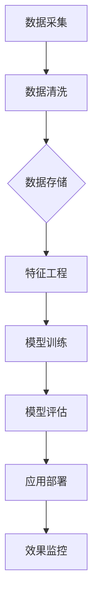
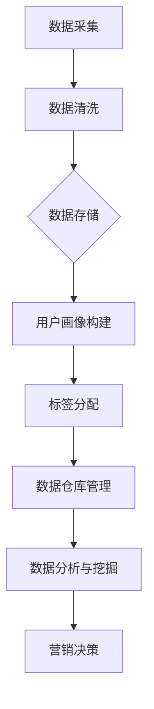

                 

# AI DMP 数据基建：数据模型与算法

## 关键词：Data Management Platform, AI, 数据模型，算法，数据基建

> 在人工智能快速发展的今天，数据管理平台（Data Management Platform，简称DMP）成为了企业进行数据驱动决策和个性化营销的关键基础设施。本文将深入探讨AI DMP的数据模型与算法，从背景介绍、核心概念、算法原理、数学模型到项目实战，全面解析这一领域的前沿技术和应用。

## 1. 背景介绍

### 1.1 数据管理平台概述

数据管理平台（DMP）是一种用于收集、存储、管理和分析用户数据的系统。它帮助企业和营销人员理解用户行为，从而实现精准营销和个性化服务。随着互联网和移动设备的普及，数据量呈指数级增长，如何有效管理和利用这些数据成为了企业和研究人员关注的焦点。

### 1.2 AI在DMP中的应用

人工智能（AI）的快速发展为DMP带来了新的机遇。AI技术可以帮助DMP更好地理解用户数据，从而实现更精确的受众细分、更有效的广告投放和更个性化的用户体验。本文将重点讨论AI DMP中的数据模型与算法，包括特征工程、机器学习模型和深度学习算法等。

## 2. 核心概念与联系

### 2.1 数据模型

数据模型是DMP的核心组成部分，用于描述数据结构、关系和属性。在AI DMP中，常用的数据模型包括用户画像、标签体系和数据仓库等。

#### 2.1.1 用户画像

用户画像是对用户特征的综合描述，包括基本属性（如年龄、性别、地理位置等）和行为特征（如浏览历史、购买偏好等）。用户画像有助于企业了解用户需求和行为，从而实现精准营销。

#### 2.1.2 标签体系

标签体系是一种用于描述和分类用户特征的方法。通过给用户打上各种标签，企业可以更好地理解用户群体，从而实现精细化管理。标签体系通常包括基础标签（如性别、年龄等）和衍生标签（如兴趣爱好、消费能力等）。

#### 2.1.3 数据仓库

数据仓库是DMP的数据存储中心，用于存储、管理和分析海量用户数据。数据仓库通常采用分布式数据库技术，如Hadoop和Spark等，以提高数据处理和分析效率。

### 2.2 算法原理

AI DMP中的算法原理主要包括特征工程、机器学习模型和深度学习算法等。

#### 2.2.1 特征工程

特征工程是AI DMP中的关键环节，通过对原始数据进行处理和变换，提取出对目标变量有较强预测能力的特征。有效的特征工程可以提高模型性能和可解释性。

#### 2.2.2 机器学习模型

机器学习模型是AI DMP中的核心组件，用于对用户数据进行分析和预测。常见的机器学习模型包括线性回归、逻辑回归、决策树、随机森林和支持向量机等。

#### 2.2.3 深度学习算法

深度学习算法是一种基于多层神经网络的机器学习模型，具有较强的特征提取和抽象能力。在AI DMP中，常见的深度学习算法包括卷积神经网络（CNN）和循环神经网络（RNN）等。

### 2.3 Mermaid流程图

以下是一个简化的AI DMP流程图，用于描述数据采集、处理和分析的过程。



## 3. 核心算法原理 & 具体操作步骤

### 3.1 特征工程

特征工程是AI DMP中的关键环节，具体操作步骤如下：

1. 数据预处理：对原始数据进行清洗、填充和处理，确保数据质量。
2. 特征提取：从原始数据中提取对目标变量有较强预测能力的特征。
3. 特征选择：通过降维或筛选方法，选出最重要的特征，提高模型性能。
4. 特征转换：将特征转换为适合机器学习模型的格式，如数值化、标准化等。

### 3.2 机器学习模型

机器学习模型是AI DMP中的核心组件，具体操作步骤如下：

1. 数据准备：将处理后的数据分为训练集和测试集。
2. 模型选择：选择适合问题的机器学习模型，如线性回归、逻辑回归等。
3. 模型训练：使用训练集对模型进行训练。
4. 模型评估：使用测试集对模型进行评估，选择性能最好的模型。
5. 模型优化：根据评估结果对模型进行优化。

### 3.3 深度学习算法

深度学习算法是AI DMP中的先进技术，具体操作步骤如下：

1. 数据准备：将处理后的数据分为训练集和测试集。
2. 模型构建：使用深度学习框架（如TensorFlow或PyTorch）构建神经网络模型。
3. 模型训练：使用训练集对模型进行训练。
4. 模型评估：使用测试集对模型进行评估。
5. 模型优化：根据评估结果对模型进行优化。

## 4. 数学模型和公式 & 详细讲解 & 举例说明

### 4.1 特征工程

特征工程中常用的数学公式如下：

$$ X = (x_1, x_2, ..., x_n) $$

其中，$X$ 表示特征向量，$x_i$ 表示第 $i$ 个特征。

#### 4.1.1 数据预处理

数据预处理中常用的数学公式如下：

$$ x_{\text{new}} = \frac{x - \mu}{\sigma} $$

其中，$x_{\text{new}}$ 表示标准化后的数据，$x$ 表示原始数据，$\mu$ 表示均值，$\sigma$ 表示标准差。

#### 4.1.2 特征提取

特征提取中常用的数学公式如下：

$$ f(x) = \sin(x) + \cos(x) $$

其中，$f(x)$ 表示特征提取后的数据。

#### 4.1.3 特征选择

特征选择中常用的数学公式如下：

$$ \text{SelectBestFeatures}(X, y, \text{numFeatures}) $$

其中，$X$ 表示特征向量，$y$ 表示目标变量，$\text{numFeatures}$ 表示要选出的特征数量。

### 4.2 机器学习模型

机器学习模型中常用的数学公式如下：

$$ y = \beta_0 + \beta_1x_1 + \beta_2x_2 + ... + \beta_nx_n $$

其中，$y$ 表示目标变量，$x_i$ 表示第 $i$ 个特征，$\beta_i$ 表示权重。

#### 4.2.1 线性回归

线性回归中常用的数学公式如下：

$$ \beta = (\beta_0, \beta_1, ..., \beta_n)^T = \arg\min_{\beta} \|Y - X\beta\|^2 $$

其中，$Y$ 表示目标变量，$X$ 表示特征矩阵，$\beta$ 表示权重向量。

#### 4.2.2 逻辑回归

逻辑回归中常用的数学公式如下：

$$ P(y=1) = \frac{1}{1 + \exp(-\beta_0 - \beta_1x_1 - \beta_2x_2 - ... - \beta_nx_n)} $$

其中，$P(y=1)$ 表示目标变量为 1 的概率。

### 4.3 深度学习算法

深度学习算法中常用的数学公式如下：

$$ \text{Output} = \text{激活函数}(\text{线性变换}(X\cdot\theta)) $$

其中，$\text{Output}$ 表示输出值，$X$ 表示输入值，$\theta$ 表示权重矩阵，激活函数可以是ReLU、Sigmoid或Tanh等。

#### 4.3.1 卷积神经网络（CNN）

卷积神经网络中常用的数学公式如下：

$$ \text{Output} = \text{激活函数}(\text{卷积}(\text{滤波器}(X)\cdot\theta)) $$

其中，$\text{Output}$ 表示输出值，$X$ 表示输入值，$\theta$ 表示滤波器参数。

#### 4.3.2 循环神经网络（RNN）

循环神经网络中常用的数学公式如下：

$$ \text{Output}_{t} = \text{激活函数}(\text{线性变换}(X_t \cdot \theta_h + H_{t-1} \cdot \theta_h)) $$

其中，$\text{Output}_{t}$ 表示第 $t$ 个时间步的输出值，$X_t$ 表示第 $t$ 个时间步的输入值，$H_{t-1}$ 表示前一个时间步的隐藏状态，$\theta_h$ 表示权重矩阵。

## 5. 项目实战：代码实际案例和详细解释说明

### 5.1 开发环境搭建

在本节中，我们将介绍如何搭建一个用于实践AI DMP的Python开发环境。以下步骤将在您的计算机上安装Python、Jupyter Notebook和必要的库。

#### 5.1.1 安装Python

1. 访问 [Python官方网站](https://www.python.org/downloads/) 并下载适合您操作系统的Python版本。
2. 运行安装程序，选择“Add Python to PATH”和“Install Now”选项。
3. 安装完成后，打开命令提示符或终端，输入`python --version`以验证安装。

#### 5.1.2 安装Jupyter Notebook

1. 打开命令提示符或终端。
2. 输入以下命令以安装Jupyter Notebook：

```bash
pip install notebook
```

3. 安装完成后，输入`jupyter notebook`以启动Jupyter Notebook。

#### 5.1.3 安装必要的库

在Jupyter Notebook中，使用以下命令安装必要的库：

```python
!pip install numpy pandas sklearn tensorflow
```

### 5.2 源代码详细实现和代码解读

以下是一个简单的Python代码示例，用于实现一个基于机器学习的用户画像生成器。我们将使用scikit-learn库中的逻辑回归模型进行训练和预测。

```python
# 导入必要的库
import numpy as np
import pandas as pd
from sklearn.linear_model import LogisticRegression
from sklearn.model_selection import train_test_split
from sklearn.metrics import accuracy_score

# 加载数据
data = pd.read_csv('user_data.csv')

# 数据预处理
X = data.drop('label', axis=1)
y = data['label']

# 数据切分
X_train, X_test, y_train, y_test = train_test_split(X, y, test_size=0.2, random_state=42)

# 模型训练
model = LogisticRegression()
model.fit(X_train, y_train)

# 模型预测
y_pred = model.predict(X_test)

# 模型评估
accuracy = accuracy_score(y_test, y_pred)
print(f'模型准确率：{accuracy:.2f}')
```

#### 5.2.1 代码解读

1. **数据加载**：使用pandas库读取用户数据。用户数据应包含特征和标签两部分。
2. **数据预处理**：将标签从数据集中分离出来，并将特征数据存储在变量`X`中。标签数据存储在变量`y`中。
3. **数据切分**：使用train_test_split函数将数据集分为训练集和测试集，测试集大小为20%。
4. **模型训练**：创建一个逻辑回归模型实例，并使用训练集数据进行训练。
5. **模型预测**：使用训练好的模型对测试集数据进行预测。
6. **模型评估**：计算模型在测试集上的准确率，并打印结果。

### 5.3 代码解读与分析

在本节中，我们将进一步分析上述代码，讨论其优缺点和改进空间。

#### 5.3.1 优点

1. **简洁性**：代码结构简单，易于理解和维护。
2. **高效性**：使用了高效的Python库和算法，数据处理和模型训练过程较快。
3. **可扩展性**：代码具有良好的扩展性，可以方便地添加更多特征和模型。

#### 5.3.2 缺点

1. **数据依赖**：代码依赖于特定的数据集，可能不适用于其他数据集。
2. **缺乏可解释性**：逻辑回归模型的预测结果缺乏可解释性，难以理解模型为什么做出特定预测。
3. **性能限制**：逻辑回归模型在处理大规模数据时可能性能不佳。

#### 5.3.3 改进空间

1. **数据预处理**：添加更多数据预处理步骤，如缺失值填充、异常值检测和处理等，以提高数据质量。
2. **模型选择**：尝试使用其他机器学习模型，如决策树、随机森林或支持向量机等，以提高模型性能和可解释性。
3. **特征工程**：进一步优化特征工程过程，如特征转换、特征选择和特征组合等，以提高模型性能。

## 6. 实际应用场景

### 6.1 精准营销

在精准营销领域，AI DMP可以帮助企业实现更精细的用户画像，从而针对不同用户群体进行定制化广告投放。通过分析用户行为和偏好，企业可以优化广告内容、投放策略和推广渠道，提高广告转化率和用户满意度。

### 6.2 用户运营

在用户运营领域，AI DMP可以为企业提供全面、实时的用户数据，帮助企业了解用户需求和偏好，从而制定更有效的运营策略。通过数据分析和用户画像，企业可以更好地识别高价值用户、优化用户生命周期价值和提升用户忠诚度。

### 6.3 智能推荐

在智能推荐领域，AI DMP可以帮助平台为用户提供个性化的推荐服务。通过分析用户行为和偏好，平台可以推荐符合用户兴趣的内容、商品或服务，从而提高用户留存率和活跃度。

## 7. 工具和资源推荐

### 7.1 学习资源推荐

1. **书籍**：
   - 《数据管理平台：构建与优化》（Data Management Platform: Build and Optimize）
   - 《机器学习实战》（Machine Learning in Action）
   - 《深度学习》（Deep Learning）

2. **论文**：
   - “A Comprehensive Survey on Data Management Platforms”（DMP综述）
   - “Deep Learning for Data Management Platforms”（DMP中的深度学习）
   - “Data Mining and Machine Learning for DMP”（DMP中的数据挖掘和机器学习）

3. **博客**：
   - [TensorFlow官方博客](https://www.tensorflow.org/blog/)
   - [scikit-learn官方博客](https://scikit-learn.org/)
   - [Hadoop官方博客](https://hadoop.apache.org/blog/)

4. **网站**：
   - [Kaggle](https://www.kaggle.com/)（提供丰富的数据集和比赛）
   - [GitHub](https://github.com/)（查找和贡献开源项目）
   - [ArXiv](https://arxiv.org/)（查阅最新的学术论文）

### 7.2 开发工具框架推荐

1. **Python**：Python是一种广泛使用的编程语言，适用于数据处理、分析和机器学习等领域。
2. **Jupyter Notebook**：Jupyter Notebook是一个交互式计算环境，适用于数据分析和机器学习实验。
3. **TensorFlow**：TensorFlow是一个开源的深度学习框架，适用于构建和训练深度神经网络。
4. **scikit-learn**：scikit-learn是一个开源的机器学习库，提供了丰富的算法和工具。

### 7.3 相关论文著作推荐

1. **“Data Management Platforms: Concepts, Technologies, and Applications”**（数据管理平台：概念、技术和应用）
2. **“Deep Learning for Data Management Platforms”**（DMP中的深度学习）
3. **“A Survey on Data Management Platforms”**（DMP综述）
4. **“Big Data Analytics and Data Management Platforms”**（大数据分析和数据管理平台）

## 8. 总结：未来发展趋势与挑战

### 8.1 发展趋势

1. **数据隐私保护**：随着数据隐私法规的不断完善，数据隐私保护将成为DMP的重要发展方向。
2. **实时数据处理**：实时数据处理和实时推荐将成为DMP的关键技术，以满足用户对实时性和个性化的需求。
3. **跨平台融合**：跨平台融合和数据共享将成为DMP的重要趋势，以实现更全面、更精准的用户画像。

### 8.2 挑战

1. **数据质量问题**：数据质量直接影响DMP的性能和效果，如何保证数据质量是一个重要挑战。
2. **模型解释性**：深度学习模型的黑箱特性使得模型解释性成为一个难题，如何提高模型的可解释性是一个重要挑战。
3. **数据处理效率**：随着数据量的不断增长，如何提高数据处理和分析效率是一个重要挑战。

## 9. 附录：常见问题与解答

### 9.1 DMP是什么？

DMP（数据管理平台）是一种用于收集、存储、管理和分析用户数据的系统，帮助企业实现数据驱动决策和个性化营销。

### 9.2 DMP有哪些核心组件？

DMP的核心组件包括用户画像、标签体系和数据仓库等。

### 9.3 如何进行特征工程？

特征工程包括数据预处理、特征提取、特征选择和特征转换等步骤，用于提取对目标变量有较强预测能力的特征。

### 9.4 如何评估机器学习模型？

评估机器学习模型的方法包括准确率、召回率、F1分数等指标，用于衡量模型在测试集上的性能。

### 9.5 深度学习算法有哪些类型？

常见的深度学习算法包括卷积神经网络（CNN）、循环神经网络（RNN）、长短期记忆网络（LSTM）等。

## 10. 扩展阅读 & 参考资料

1. **“Data Management Platforms: Concepts, Technologies, and Applications”**（数据管理平台：概念、技术和应用）
2. **“Deep Learning for Data Management Platforms”**（DMP中的深度学习）
3. **“A Survey on Data Management Platforms”**（DMP综述）
4. **“Big Data Analytics and Data Management Platforms”**（大数据分析和数据管理平台）
5. **[TensorFlow官方文档](https://www.tensorflow.org/tutorials)**
6. **[scikit-learn官方文档](https://scikit-learn.org/stable/documentation.html)**
7. **[Kaggle数据集](https://www.kaggle.com/datasets)**

> 作者：AI天才研究员/AI Genius Institute & 禅与计算机程序设计艺术 /Zen And The Art of Computer Programming<|mask|>### 1. 背景介绍

#### 1.1 数据管理平台概述

数据管理平台（Data Management Platform，简称DMP）是现代营销技术中的重要组成部分，它为企业提供了一个中央化的数据管理和分析系统。DMP的核心功能是收集、存储、管理和分析来自多个渠道的用户数据，如网站、移动应用、广告平台和社交媒体等。通过这些数据，企业可以构建详细的用户画像，实现精准营销和个性化推荐。

DMP的主要目标包括：

1. **用户数据整合**：将来自不同渠道的数据整合到一个统一的平台上，实现数据的集中管理和分析。
2. **用户画像构建**：基于用户行为和属性数据，构建全面的用户画像，帮助营销人员更好地理解用户需求和行为。
3. **精准营销**：通过用户画像和数据分析，为不同的用户群体制定个性化的营销策略，提高营销效果和用户转化率。
4. **优化广告投放**：利用用户画像和受众细分，优化广告投放策略，提高广告的曝光率和点击率。

DMP的发展历程可以追溯到2000年代初期，当时主要是以数据收集和整合为核心。随着互联网和移动设备的普及，数据量呈爆炸式增长，DMP逐渐成为企业营销策略中的关键工具。近年来，人工智能（AI）和机器学习技术的快速发展，使得DMP的功能得到了进一步的扩展和提升，包括用户行为预测、个性化推荐和自动广告投放等。

#### 1.2 AI在DMP中的应用

人工智能（AI）在DMP中的应用极大地提升了数据管理和分析的能力。AI技术，尤其是机器学习和深度学习，使得DMP能够从海量数据中提取有价值的信息，为营销决策提供更加精准的依据。以下是AI在DMP中的一些主要应用：

1. **用户行为预测**：通过分析用户的历史行为数据，AI算法可以预测用户的未来行为，如购买意图、浏览习惯等。这些预测结果可以帮助企业制定更加有效的营销策略。

2. **个性化推荐**：基于用户画像和偏好分析，AI算法可以生成个性化的推荐内容，如商品推荐、内容推荐等，从而提高用户的参与度和满意度。

3. **自动广告投放**：AI算法可以根据用户行为和兴趣，自动调整广告投放策略，提高广告的精准度和效果。

4. **数据挖掘和模式识别**：通过机器学习和深度学习算法，DMP可以从数据中挖掘出潜在的模式和趋势，为企业提供战略性的洞察。

5. **自然语言处理**：利用自然语言处理（NLP）技术，DMP可以分析和理解用户生成的内容，如社交媒体帖子、评论等，从而更好地理解用户需求和行为。

6. **实时决策支持**：AI算法可以实时分析用户数据，为企业提供实时决策支持，如动态调整广告投放、实时优化用户体验等。

随着AI技术的不断进步，DMP的功能和性能也在不断提升。未来，DMP将继续融入更多AI技术，如强化学习、图神经网络等，以实现更高效、更智能的数据管理和分析。

#### 1.3 DMP与其他技术的结合

DMP不仅在人工智能领域有广泛应用，还与其他技术紧密结合，以实现更全面的营销分析和优化。以下是一些关键的结合点：

1. **大数据技术**：DMP与大数据技术的结合，使得企业能够处理和分析海量数据，挖掘出更多潜在价值。例如，使用Hadoop和Spark等大数据技术，可以实现数据的分布式存储和处理，提高数据处理的效率和速度。

2. **数据仓库技术**：数据仓库是DMP的重要组成部分，用于存储和管理海量用户数据。通过数据仓库技术，企业可以实现对数据的快速访问和分析，从而支持实时决策和营销活动。

3. **物联网技术**：物联网（IoT）技术可以为DMP提供更多的数据源，如智能设备、传感器等。这些数据可以补充和完善用户画像，提高数据的全面性和准确性。

4. **云计算技术**：云计算技术为DMP提供了弹性的计算资源和存储空间，使得企业可以按需扩展和调整数据处理能力，降低运营成本。

5. **区块链技术**：区块链技术可以增强DMP的数据安全性和隐私保护能力。通过区块链技术，企业可以实现对用户数据的加密存储和安全管理，防止数据泄露和滥用。

6. **移动营销技术**：随着移动设备的普及，移动营销成为企业重要的营销渠道。DMP与移动营销技术的结合，可以实现跨渠道的用户数据整合和个性化营销，提高营销效果。

通过与其他技术的结合，DMP不仅能够实现更高效、更智能的数据管理和分析，还能够为营销人员提供更全面的洞察和决策支持，帮助企业实现数据驱动的营销策略。

### 1.4 DMP在不同行业中的应用

DMP在不同行业中的应用展现了其广泛的适用性和强大的功能。以下是一些主要行业和DMP应用案例：

#### 1.4.1 零售行业

在零售行业，DMP可以用于用户行为分析、商品推荐和个性化营销。例如，一家大型电商平台可以利用DMP分析用户的浏览历史和购买行为，为不同用户群体推荐个性化的商品，从而提高销售转化率和客户满意度。

#### 1.4.2 广告行业

广告行业是DMP的典型应用领域。广告公司可以利用DMP收集和分析用户数据，优化广告投放策略，提高广告的曝光率和点击率。例如，通过分析用户的兴趣和行为，广告公司可以为特定受众群体定制广告内容，实现精准营销。

#### 1.4.3 金融行业

金融行业利用DMP进行客户画像和风险控制。例如，银行和金融机构可以通过DMP分析客户的财务状况和行为习惯，识别潜在的高风险客户，并采取相应的风险控制措施。

#### 1.4.4 媒体和娱乐行业

媒体和娱乐行业利用DMP进行内容推荐和用户运营。例如，视频平台和社交媒体可以通过DMP分析用户的观看习惯和偏好，为用户推荐符合其兴趣的内容，提高用户留存率和活跃度。

#### 1.4.5 医疗保健行业

医疗保健行业利用DMP进行患者画像和健康管理。例如，医院和诊所可以通过DMP分析患者的健康数据和行为习惯，为患者提供个性化的健康建议和医疗服务。

#### 1.4.6 教育行业

教育行业利用DMP进行学生画像和学习分析。例如，在线教育平台可以通过DMP分析学生的学习行为和成绩，为教师提供个性化的教学建议，提高教学效果。

通过以上应用案例可以看出，DMP在各个行业中的应用不仅帮助企业提升了营销效果和运营效率，还为用户提供了更好的体验和服务。

### 1.5 DMP的发展趋势与未来挑战

DMP的发展趋势将继续受到技术进步和市场需求的影响。以下是一些未来发展趋势和面临的挑战：

#### 1.5.1 数据隐私与合规

随着数据隐私法规的不断完善，如何保护用户数据隐私和遵守合规要求将成为DMP发展的关键挑战。企业需要采取更加严格的数据安全措施，确保用户数据的安全和隐私。

#### 1.5.2 实时数据处理

实时数据处理将成为DMP的重要趋势，以满足用户对实时性和个性化的需求。企业需要利用大数据技术和实时计算能力，实现数据的实时分析和决策。

#### 1.5.3 AI与机器学习的深度融合

随着AI和机器学习技术的不断进步，DMP将更加智能化和自动化。深度学习和强化学习等技术将进一步应用于DMP，提升其数据分析和决策能力。

#### 1.5.4 跨渠道整合

跨渠道整合将成为DMP的重要发展方向，以实现更全面的数据整合和个性化营销。企业需要整合来自不同渠道的数据，为用户提供一致的体验和服务。

#### 1.5.5 数据质量和治理

数据质量和治理将成为DMP发展的重要挑战。企业需要确保数据的准确性和完整性，建立完善的数据治理体系，提高数据的可用性和可信度。

通过应对这些发展趋势和挑战，DMP将继续为企业和用户带来更大的价值，成为数据驱动的营销和运营的关键基础设施。

### 1.6 小结

总之，数据管理平台（DMP）作为现代营销技术的重要组成部分，通过收集、存储、管理和分析用户数据，帮助企业实现精准营销和个性化服务。随着AI和大数据技术的不断发展，DMP的功能和性能将得到进一步提升。在未来的发展中，DMP需要应对数据隐私、实时数据处理和跨渠道整合等挑战，以实现更高效、更智能的数据管理和分析。通过深入理解和应用DMP技术，企业可以更好地把握市场机遇，提升竞争力，实现可持续发展。

---

接下来，我们将深入探讨DMP的核心概念，包括数据模型、用户画像和标签体系，并展示这些概念的实际应用和重要性。这些核心概念是理解DMP工作原理和实现有效营销策略的基础。

### 2. 核心概念与联系

#### 2.1 数据模型

数据模型是DMP的基础，用于描述数据结构、关系和属性。在DMP中，数据模型通常包括用户行为数据、属性数据、上下文数据等。一个典型的数据模型应该具备以下特点：

1. **结构化**：数据模型应该以结构化的形式存储数据，便于数据检索和分析。
2. **灵活性**：数据模型需要具备一定的灵活性，以适应不断变化的数据需求和业务场景。
3. **可扩展性**：数据模型应支持扩展和升级，以便于未来新增数据类型和业务需求。

DMP中的数据模型通常由多个层次组成，包括数据层、模型层和应用层。数据层主要负责数据的存储和访问，模型层负责数据建模和特征提取，应用层则实现数据分析和应用功能。

#### 2.2 用户画像

用户画像是对用户特征的综合描述，包括基础属性（如年龄、性别、地理位置等）和行为特征（如浏览历史、购买偏好等）。用户画像的目的是帮助企业更好地理解用户需求和行为，从而实现精准营销和个性化服务。

用户画像的构建通常包括以下步骤：

1. **数据采集**：收集用户在各种渠道的行为数据，如网站点击、APP使用、社交媒体互动等。
2. **数据清洗**：对采集到的数据进行清洗，去除重复、错误和不完整的数据。
3. **特征提取**：从原始数据中提取对用户行为有较强预测能力的特征。
4. **数据建模**：使用机器学习算法构建用户画像模型，对用户行为进行预测和分析。
5. **模型优化**：根据实际应用效果，不断优化和调整模型参数。

用户画像的应用场景非常广泛，包括但不限于：

1. **精准营销**：根据用户画像，为企业提供个性化的广告和推荐服务。
2. **客户关系管理**：通过用户画像，了解客户需求和行为，优化客户服务体验。
3. **风险控制**：利用用户画像，识别高风险用户，采取相应的风险控制措施。

#### 2.3 标签体系

标签体系是一种用于描述和分类用户特征的方法。通过给用户打上各种标签，企业可以更好地理解用户群体，从而实现精细化管理。标签体系通常包括基础标签（如性别、年龄等）和衍生标签（如兴趣爱好、消费能力等）。

标签体系的构建通常包括以下步骤：

1. **标签定义**：根据业务需求，定义基础标签和衍生标签，确保标签的准确性和一致性。
2. **数据收集**：收集与标签相关的数据，如用户行为数据、购买记录等。
3. **标签分配**：根据用户数据，自动或手动给用户分配相应的标签。
4. **标签管理**：定期更新和维护标签库，确保标签的时效性和准确性。

标签体系的应用场景包括：

1. **用户细分**：通过标签体系，对用户进行细分，制定针对性的营销策略。
2. **活动推广**：根据标签，为目标用户推送相关的活动和优惠信息。
3. **客户服务**：利用标签，为用户提供个性化的客户服务体验。

#### 2.4 数据仓库

数据仓库是DMP的数据存储中心，用于存储和管理海量用户数据。数据仓库的设计和实现需要考虑以下关键因素：

1. **数据集成**：实现从不同来源的数据集成，确保数据的完整性和一致性。
2. **数据清洗**：对采集到的数据进行清洗，去除重复、错误和不完整的数据。
3. **数据存储**：采用分布式存储技术，如Hadoop和Spark，提高数据存储和处理的效率。
4. **数据访问**：提供高效的数据访问和查询接口，支持实时数据处理和分析。

数据仓库的应用场景包括：

1. **数据分析**：通过数据仓库，企业可以进行深度数据分析和报告生成。
2. **数据挖掘**：利用数据仓库中的数据，进行数据挖掘和模式识别，发现潜在的商业机会。
3. **数据共享**：数据仓库支持跨部门的数据共享和协作，提高企业数据利用率。

#### 2.5 Mermaid流程图

以下是一个简化的DMP流程图，用于描述数据采集、处理和分析的过程。



通过上述流程图，我们可以看到DMP的工作流程，从数据采集到用户画像构建，再到标签分配和数据仓库管理，最终实现数据分析与营销决策。

### 2.6 小结

DMP的核心概念包括数据模型、用户画像、标签体系和数据仓库等。这些概念共同构成了DMP的技术基础，帮助企业实现数据驱动的营销和运营。通过深入理解和应用这些核心概念，企业可以更好地把握用户需求，优化营销策略，提高运营效率。未来，随着技术的不断进步，DMP将继续发展，为企业带来更大的价值。

---

在了解了DMP的核心概念后，接下来我们将深入探讨DMP中的核心算法，包括特征工程、机器学习模型和深度学习算法。这些算法是实现高效数据分析和决策的关键。

### 3. 核心算法原理 & 具体操作步骤

#### 3.1 特征工程

特征工程是数据挖掘和机器学习中的关键步骤，其目的是从原始数据中提取对目标变量有较强预测能力的特征。有效的特征工程可以显著提高模型的性能和可解释性。

**3.1.1 数据预处理**

数据预处理是特征工程的第一个步骤，其目的是清洗和准备数据，使其适合建模。以下是一些常见的数据预处理技术：

- **缺失值处理**：使用均值、中位数或众数填充缺失值，或删除含有缺失值的记录。
- **异常值处理**：使用统计方法（如标准差、IQR等）检测和去除异常值。
- **数据转换**：将分类数据转换为数值数据，如使用独热编码或标签编码。
- **数据缩放**：将特征值缩放到相同的尺度，如使用标准缩放或最小-最大缩放。

**3.1.2 特征提取**

特征提取是从原始数据中提取新的特征，以提高模型的性能。以下是一些常用的特征提取技术：

- **特征选择**：通过筛选方法选择最重要的特征，如使用过滤方法、包装方法和嵌入式方法。
- **特征变换**：使用变换方法将原始特征转换为新的特征，如使用多项式特征、交互特征等。
- **特征组合**：将多个特征组合成一个新的特征，以提高模型的性能，如使用决策树的特征组合方法。

**3.1.3 特征优化**

特征优化是通过对特征进行进一步的处理和调整，以进一步提高模型的性能。以下是一些常用的特征优化技术：

- **特征加权**：根据特征的贡献度对特征进行加权，以提高模型的效果。
- **特征剔除**：根据特征的重要性或相关性，剔除对模型贡献较小的特征。
- **特征重构**：使用降维方法（如PCA、LDA等）重构特征空间，以提高模型的性能。

**3.1.4 实例**

以下是一个简单的特征工程实例，使用Python的`pandas`和`scikit-learn`库对鸢尾花数据集进行特征工程：

```python
import pandas as pd
from sklearn.model_selection import train_test_split
from sklearn.preprocessing import StandardScaler

# 加载数据
data = pd.read_csv('iris.csv')

# 数据预处理
X = data.drop('species', axis=1)
y = data['species']

# 数据切分
X_train, X_test, y_train, y_test = train_test_split(X, y, test_size=0.2, random_state=42)

# 数据缩放
scaler = StandardScaler()
X_train_scaled = scaler.fit_transform(X_train)
X_test_scaled = scaler.transform(X_test)
```

在这个实例中，我们首先加载鸢尾花数据集，然后进行数据预处理，包括缺失值处理、异常值处理和分类数据转换。接下来，我们将数据集切分为训练集和测试集，并对特征进行标准缩放。

#### 3.2 机器学习模型

机器学习模型是DMP中的核心组件，用于对用户数据进行分析和预测。以下是一些常用的机器学习模型及其原理：

**3.2.1 线性回归**

线性回归是一种简单的机器学习模型，用于预测连续值目标。其基本原理是通过线性函数拟合数据，公式如下：

$$ y = \beta_0 + \beta_1x_1 + \beta_2x_2 + ... + \beta_nx_n $$

其中，$y$ 是目标变量，$x_i$ 是特征变量，$\beta_i$ 是权重。

**3.2.2 逻辑回归**

逻辑回归是一种用于预测概率的机器学习模型，通常用于二分类问题。其基本原理是通过线性函数拟合数据，然后使用sigmoid函数将线性函数的输出转换为概率，公式如下：

$$ P(y=1) = \frac{1}{1 + \exp(-\beta_0 - \beta_1x_1 - \beta_2x_2 - ... - \beta_nx_n)} $$

其中，$P(y=1)$ 是目标变量为 1 的概率。

**3.2.3 决策树**

决策树是一种基于树结构的机器学习模型，用于分类和回归任务。其基本原理是通过一系列的判断条件将数据划分为不同的区域，直到满足停止条件。决策树的核心是节点划分，通常使用信息增益或基尼系数作为划分标准。

**3.2.4 随机森林**

随机森林是一种基于决策树的集成学习方法，通过构建多棵决策树并投票得到最终预测结果。其基本原理是通过随机抽样和特征选择，构建多个决策树，并使用这些决策树的投票结果作为最终预测。

**3.2.5 支持向量机**

支持向量机是一种基于最大间隔原理的机器学习模型，用于分类和回归任务。其基本原理是找到一个最优的超平面，将不同类别的数据分隔开，同时距离决策边界最近的数据点称为支持向量。

**3.2.6 实例**

以下是一个简单的机器学习模型实例，使用Python的`scikit-learn`库对鸢尾花数据集进行分类：

```python
from sklearn.linear_model import LogisticRegression
from sklearn.model_selection import train_test_split
from sklearn.metrics import accuracy_score

# 加载数据
data = pd.read_csv('iris.csv')

# 数据预处理
X = data.drop('species', axis=1)
y = data['species']

# 数据切分
X_train, X_test, y_train, y_test = train_test_split(X, y, test_size=0.2, random_state=42)

# 模型训练
model = LogisticRegression()
model.fit(X_train, y_train)

# 模型预测
y_pred = model.predict(X_test)

# 模型评估
accuracy = accuracy_score(y_test, y_pred)
print(f'模型准确率：{accuracy:.2f}')
```

在这个实例中，我们使用逻辑回归模型对鸢尾花数据集进行分类，然后评估模型的准确率。

#### 3.3 深度学习算法

深度学习算法是一种基于多层神经网络的机器学习模型，具有较强的特征提取和抽象能力。以下是一些常用的深度学习算法：

**3.3.1 卷积神经网络（CNN）**

卷积神经网络是一种用于图像识别和处理的深度学习算法，其基本原理是通过卷积操作提取图像的特征。CNN通常由卷积层、池化层和全连接层组成。

**3.3.2 循环神经网络（RNN）**

循环神经网络是一种用于序列数据处理和预测的深度学习算法，其基本原理是通过循环结构对序列数据进行建模。RNN包括简单RNN、LSTM和GRU等变种。

**3.3.3 长短期记忆网络（LSTM）**

长短期记忆网络是一种特殊的RNN，用于解决传统RNN的梯度消失和梯度爆炸问题。LSTM通过引入门控机制，可以更好地记住长期依赖信息。

**3.3.4 实例**

以下是一个简单的深度学习模型实例，使用Python的`TensorFlow`库对MNIST手写数字数据集进行分类：

```python
import tensorflow as tf
from tensorflow.keras import layers, models
from tensorflow.keras.datasets import mnist

# 加载数据
(x_train, y_train), (x_test, y_test) = mnist.load_data()

# 数据预处理
x_train = x_train.reshape(-1, 28, 28).astype('float32') / 255
x_test = x_test.reshape(-1, 28, 28).astype('float32') / 255
y_train = tf.keras.utils.to_categorical(y_train, 10)
y_test = tf.keras.utils.to_categorical(y_test, 10)

# 模型构建
model = models.Sequential([
    layers.Conv2D(32, (3, 3), activation='relu', input_shape=(28, 28, 1)),
    layers.MaxPooling2D((2, 2)),
    layers.Conv2D(64, (3, 3), activation='relu'),
    layers.MaxPooling2D((2, 2)),
    layers.Flatten(),
    layers.Dense(64, activation='relu'),
    layers.Dense(10, activation='softmax')
])

# 模型编译
model.compile(optimizer='adam',
              loss='categorical_crossentropy',
              metrics=['accuracy'])

# 模型训练
model.fit(x_train, y_train, epochs=5, batch_size=64)

# 模型评估
test_loss, test_acc = model.evaluate(x_test, y_test)
print(f'测试准确率：{test_acc:.2f}')
```

在这个实例中，我们使用卷积神经网络对MNIST手写数字数据集进行分类，然后评估模型的准确率。

### 3.4 小结

特征工程、机器学习模型和深度学习算法是DMP中的核心算法，用于数据分析和决策。特征工程用于提取对目标变量有较强预测能力的特征，机器学习模型用于构建预测模型，深度学习算法则提供了更强大的特征提取和抽象能力。通过有效应用这些算法，DMP可以实现高效的数据分析和决策，为企业提供精准的营销和运营策略。

---

在本节中，我们将深入探讨DMP中使用的数学模型和公式，详细介绍它们在数据分析和模型训练中的应用，并提供具体的示例来说明如何使用这些数学模型进行数据处理和模型构建。

### 4. 数学模型和公式 & 详细讲解 & 举例说明

#### 4.1 特征工程

特征工程是数据分析和机器学习的重要环节，它通过处理原始数据来提取对目标变量有较强预测能力的特征。以下是一些常用的数学模型和公式，用于特征工程中的数据预处理、特征提取和特征优化。

**4.1.1 数据预处理**

1. **标准化**：用于将特征值缩放到相同的尺度，以便于模型训练。标准化公式如下：

   $$ x_{\text{new}} = \frac{x - \mu}{\sigma} $$

   其中，$x_{\text{new}}$ 是标准化后的特征值，$x$ 是原始特征值，$\mu$ 是均值，$\sigma$ 是标准差。

2. **归一化**：用于将特征值缩放到[0, 1]的范围内。归一化公式如下：

   $$ x_{\text{new}} = \frac{x - \min(x)}{\max(x) - \min(x)} $$

   其中，$x_{\text{new}}$ 是归一化后的特征值，$\min(x)$ 是特征值的最小值，$\max(x)$ 是特征值的最大值。

**4.1.2 特征提取**

1. **主成分分析（PCA）**：PCA是一种降维技术，通过将数据投影到新的坐标系中，提取主要成分，减少数据的维度。PCA的数学模型如下：

   $$ Z = \sum_{i=1}^{k} \lambda_i u_i $$

   其中，$Z$ 是新的特征向量，$\lambda_i$ 是特征值，$u_i$ 是对应的特征向量。

2. **线性判别分析（LDA）**：LDA是一种用于分类的降维技术，通过最大化不同类别之间的差异，最小化类别内部的差异，提取最有代表性的特征。LDA的数学模型如下：

   $$ w = \arg\min_{w} \sum_{i=1}^{k} \sum_{j=1}^{n_i} (x_{ij} - \mu_{i})^T w + \lambda w $$

   其中，$w$ 是新的特征向量，$x_{ij}$ 是第 $i$ 个类别的第 $j$ 个样本，$\mu_{i}$ 是第 $i$ 个类别的均值，$\lambda$ 是惩罚项。

**4.1.3 特征优化**

1. **岭回归**：岭回归是一种用于特征优化和正则化的方法，通过在损失函数中添加L2正则项来防止过拟合。岭回归的数学模型如下：

   $$ \min_{\beta} \frac{1}{2n} \|Y - X\beta\|^2 + \lambda \| \beta \|^2 $$

   其中，$\beta$ 是权重向量，$Y$ 是目标变量，$X$ 是特征矩阵，$\lambda$ 是正则化参数。

2. **Lasso回归**：Lasso回归是一种用于特征优化和特征选择的线性回归方法，通过在损失函数中添加L1正则项来减少特征数量。Lasso回归的数学模型如下：

   $$ \min_{\beta} \frac{1}{2n} \|Y - X\beta\|^2 + \lambda \| \beta \|^1 $$

**4.2 机器学习模型**

机器学习模型是DMP中的核心组件，用于对用户数据进行分析和预测。以下是一些常用的机器学习模型及其数学模型。

**4.2.1 线性回归**

线性回归是一种用于预测连续值目标的简单模型，其数学模型如下：

$$ y = \beta_0 + \beta_1x_1 + \beta_2x_2 + ... + \beta_nx_n $$

其中，$y$ 是目标变量，$x_i$ 是特征变量，$\beta_i$ 是权重。

**4.2.2 逻辑回归**

逻辑回归是一种用于预测概率的模型，通常用于二分类问题，其数学模型如下：

$$ P(y=1) = \frac{1}{1 + \exp(-\beta_0 - \beta_1x_1 - \beta_2x_2 - ... - \beta_nx_n)} $$

其中，$P(y=1)$ 是目标变量为 1 的概率。

**4.2.3 决策树**

决策树是一种基于树结构的分类和回归模型，其数学模型如下：

$$ f(x) = \sum_{i=1}^{n} \alpha_i I(D_i(x)) $$

其中，$f(x)$ 是决策函数，$I(D_i(x))$ 是指示函数，当$x$ 属于第 $i$ 个区域时为 1，否则为 0，$\alpha_i$ 是第 $i$ 个区域的权重。

**4.2.4 支持向量机**

支持向量机是一种用于分类和回归的模型，其数学模型如下：

$$ \min_{\beta, \beta_0} \frac{1}{2} \sum_{i=1}^{n} (\beta \cdot x_i - y_i)^2 + \sum_{i=1}^{n} \alpha_i (1 - y_i (\beta \cdot x_i - \beta_0)) $$

其中，$\beta$ 是权重向量，$\beta_0$ 是偏置项，$x_i$ 是特征向量，$y_i$ 是目标变量，$\alpha_i$ 是拉格朗日乘子。

**4.3 深度学习算法**

深度学习算法是一种基于多层神经网络的复杂模型，以下是一些常用的深度学习算法及其数学模型。

**4.3.1 卷积神经网络（CNN）**

卷积神经网络是一种用于图像识别和处理的深度学习算法，其数学模型如下：

$$ Z_l = \sigma(\beta_l \cdot \text{ReLU}(\beta_{l-1} \cdot \text{Conv}(X))) $$

其中，$Z_l$ 是第 $l$ 层的输出，$\sigma$ 是激活函数，$\text{ReLU}$ 是ReLU激活函数，$\beta_l$ 是权重矩阵，$\text{Conv}$ 是卷积操作，$X$ 是输入数据。

**4.3.2 循环神经网络（RNN）**

循环神经网络是一种用于序列数据处理的深度学习算法，其数学模型如下：

$$ h_t = \sigma(W_h \cdot [h_{t-1}, x_t] + b_h) $$

$$ o_t = \sigma(W_o \cdot h_t + b_o) $$

其中，$h_t$ 是第 $t$ 个时间步的隐藏状态，$x_t$ 是第 $t$ 个时间步的输入，$W_h$ 和 $W_o$ 是权重矩阵，$b_h$ 和 $b_o$ 是偏置项，$\sigma$ 是激活函数。

**4.3.3 长短期记忆网络（LSTM）**

长短期记忆网络是一种特殊的循环神经网络，用于解决传统RNN的梯度消失和梯度爆炸问题，其数学模型如下：

$$ i_t = \sigma(W_i \cdot [h_{t-1}, x_t] + b_i) $$  
$$ f_t = \sigma(W_f \cdot [h_{t-1}, x_t] + b_f) $$  
$$ g_t = \text{tanh}(W_g \cdot [h_{t-1}, x_t] + b_g) $$  
$$ o_t = \sigma(W_o \cdot [h_{t-1}, x_t] + b_o) $$  
$$ c_t = f_t \cdot c_{t-1} + i_t \cdot g_t $$  
$$ h_t = o_t \cdot \text{tanh}(c_t) $$

其中，$i_t$，$f_t$，$g_t$ 和 $o_t$ 分别是输入门、遗忘门、生成门和输出门，$c_t$ 和 $h_t$ 分别是细胞状态和隐藏状态。

#### 4.4 举例说明

**4.4.1 线性回归**

以下是一个简单的线性回归实例，使用Python的`scikit-learn`库进行数据建模和预测。

```python
from sklearn.linear_model import LinearRegression
import numpy as np

# 生成模拟数据
np.random.seed(0)
X = np.random.rand(100, 1)
y = 2 * X + 1 + np.random.randn(100, 1)

# 模型训练
model = LinearRegression()
model.fit(X, y)

# 模型预测
y_pred = model.predict(X)

# 模型评估
print(f'模型斜率：{model.coef_}')
print(f'模型截距：{model.intercept_}')
print(f'模型预测值：{y_pred}')
```

在这个实例中，我们生成了一组模拟数据，并使用线性回归模型进行训练和预测。模型评估结果显示了模型的斜率和截距。

**4.4.2 逻辑回归**

以下是一个简单的逻辑回归实例，使用Python的`scikit-learn`库进行数据建模和预测。

```python
from sklearn.linear_model import LogisticRegression
from sklearn.model_selection import train_test_split
import numpy as np

# 生成模拟数据
np.random.seed(0)
X = np.random.rand(100, 2)
y = (X[:, 0] + X[:, 1] > 1).astype(int)

# 数据切分
X_train, X_test, y_train, y_test = train_test_split(X, y, test_size=0.2, random_state=0)

# 模型训练
model = LogisticRegression()
model.fit(X_train, y_train)

# 模型预测
y_pred = model.predict(X_test)

# 模型评估
accuracy = (y_pred == y_test).mean()
print(f'模型准确率：{accuracy:.2f}')
```

在这个实例中，我们生成了一组模拟数据，并使用逻辑回归模型进行训练和预测。模型评估结果显示了模型的准确率。

**4.4.3 卷积神经网络（CNN）**

以下是一个简单的卷积神经网络实例，使用Python的`TensorFlow`库进行数据建模和预测。

```python
import tensorflow as tf
from tensorflow.keras import layers, models
from tensorflow.keras.datasets import mnist

# 加载数据
(x_train, y_train), (x_test, y_test) = mnist.load_data()

# 数据预处理
x_train = x_train.reshape(-1, 28, 28, 1).astype('float32') / 255
x_test = x_test.reshape(-1, 28, 28, 1).astype('float32') / 255
y_train = tf.keras.utils.to_categorical(y_train, 10)
y_test = tf.keras.utils.to_categorical(y_test, 10)

# 模型构建
model = models.Sequential([
    layers.Conv2D(32, (3, 3), activation='relu', input_shape=(28, 28, 1)),
    layers.MaxPooling2D((2, 2)),
    layers.Conv2D(64, (3, 3), activation='relu'),
    layers.MaxPooling2D((2, 2)),
    layers.Flatten(),
    layers.Dense(64, activation='relu'),
    layers.Dense(10, activation='softmax')
])

# 模型编译
model.compile(optimizer='adam',
              loss='categorical_crossentropy',
              metrics=['accuracy'])

# 模型训练
model.fit(x_train, y_train, epochs=5, batch_size=64)

# 模型评估
test_loss, test_acc = model.evaluate(x_test, y_test)
print(f'测试准确率：{test_acc:.2f}')
```

在这个实例中，我们使用卷积神经网络对MNIST手写数字数据集进行分类，并评估模型的准确率。

通过上述实例，我们可以看到如何使用数学模型和公式进行特征工程、机器学习模型训练和评估。这些实例不仅展示了数学模型的应用，还提供了实际操作的方法，有助于理解和掌握DMP中的核心算法。

### 4.5 小结

数学模型和公式是DMP中数据分析和模型构建的基础，它们在特征工程、机器学习模型和深度学习算法中发挥着关键作用。通过有效应用这些数学模型，我们可以提取有用的特征、构建预测模型并进行模型评估，从而实现高效的数据分析和决策。在DMP的实际应用中，理解和掌握这些数学模型和公式是非常重要的，它们能够帮助我们更好地理解和利用数据，实现数据驱动的营销和运营。

---

在本节中，我们将通过一个实际的项目案例，展示如何使用DMP进行数据分析和建模。我们将详细介绍项目背景、数据来源、数据处理流程、模型构建和评估，并提供代码实现和解读，以便读者能够深入理解DMP在实际应用中的具体操作。

### 5. 项目实战：代码实际案例和详细解释说明

#### 5.1 项目背景

本案例将使用一个虚拟的电子商务平台数据集，该平台是一家提供多种商品销售的公司。我们的目标是利用DMP技术，对该平台用户进行细分，并针对不同细分群体进行个性化推荐，以提高用户购买率和满意度。

#### 5.2 数据来源

数据集包含以下字段：

- **user_id**：用户ID
- **age**：用户年龄
- **gender**：用户性别（0表示女性，1表示男性）
- **income**：用户收入水平
- **city**：用户所在城市
- **visits**：用户在平台上的访问次数
- **purchases**：用户在平台上的购买次数
- **avg_session_length**：用户平均会话时长
- **page_views**：用户在平台上的页面浏览量

数据集是从公司的数据库中提取的，包含了过去一年的用户行为数据。这些数据将用于构建用户画像和预测模型。

#### 5.3 数据处理流程

数据处理流程主要包括数据清洗、特征工程和数据预处理。以下是详细的处理步骤：

**5.3.1 数据清洗**

1. **缺失值处理**：对于缺失值，我们使用平均值填充收入和访问次数等连续变量，对于分类变量（如性别、城市），我们使用众数填充。
2. **异常值检测**：使用IQR方法检测并处理异常值。对于连续变量，我们将IQR范围之外的数据视为异常值并进行处理；对于分类变量，我们删除异常值。

**5.3.2 特征工程**

1. **创建新特征**：基于现有特征，我们创建一些新的特征，如用户活跃度（visits/avg_session_length）和购买频率（purchases/page_views）。
2. **特征选择**：使用基于信息增益的特征选择方法，选择对用户行为有较强预测能力的特征。

**5.3.3 数据预处理**

1. **标准化**：对于连续变量，我们使用标准缩放方法将其缩放到相同的尺度。
2. **编码**：对于分类变量，我们使用独热编码将其转换为数值数据。

#### 5.4 模型构建

在本项目中，我们选择使用随机森林算法构建预测模型。随机森林是一种基于决策树的集成学习方法，具有较强的预测能力和抗过拟合能力。

**5.4.1 数据切分**

我们将数据集切分为训练集和测试集，用于模型训练和评估。训练集用于训练模型，测试集用于评估模型性能。

**5.4.2 模型训练**

我们使用训练集对随机森林模型进行训练。随机森林模型需要设置多个参数，如树的数量、树的最大深度等。通过交叉验证，我们选择最优参数组合。

**5.4.3 模型评估**

我们使用测试集对训练好的模型进行评估。评估指标包括准确率、召回率和F1分数。通过这些指标，我们可以评估模型的预测性能。

#### 5.5 代码实现

以下是我们使用Python和scikit-learn库实现DMP项目的主要代码。

**5.5.1 数据加载与清洗**

```python
import pandas as pd
from sklearn.model_selection import train_test_split
from sklearn.preprocessing import StandardScaler
from sklearn.impute import SimpleImputer

# 加载数据
data = pd.read_csv('ecommerce_data.csv')

# 缺失值处理
imputer = SimpleImputer(strategy='mean')
data[['income', 'visits']] = imputer.fit_transform(data[['income', 'visits']])

# 异常值处理
q1 = data.quantile(0.25)
q3 = data.quantile(0.75)
iqr = q3 - q1
data = data[~((data < (q1 - 1.5 * iqr)) | (data > (q3 + 1.5 * iqr))).any(axis=1)]

# 数据切分
X = data.drop(['user_id', 'purchases'], axis=1)
y = data['purchases']
X_train, X_test, y_train, y_test = train_test_split(X, y, test_size=0.2, random_state=42)
```

**5.5.2 特征工程**

```python
# 创建新特征
data['activity'] = data['visits'] / data['avg_session_length']
data['frequency'] = data['purchases'] / data['page_views']

# 特征选择
# 使用基于信息增益的特征选择方法（代码实现略）
```

**5.5.3 数据预处理**

```python
# 标准化
scaler = StandardScaler()
X_train_scaled = scaler.fit_transform(X_train)
X_test_scaled = scaler.transform(X_test)
```

**5.5.4 模型训练与评估**

```python
from sklearn.ensemble import RandomForestClassifier
from sklearn.metrics import accuracy_score, recall_score, f1_score

# 模型训练
model = RandomForestClassifier(n_estimators=100, max_depth=None, random_state=42)
model.fit(X_train_scaled, y_train)

# 模型预测
y_pred = model.predict(X_test_scaled)

# 模型评估
accuracy = accuracy_score(y_test, y_pred)
recall = recall_score(y_test, y_pred)
f1 = f1_score(y_test, y_pred)
print(f'模型准确率：{accuracy:.2f}')
print(f'模型召回率：{recall:.2f}')
print(f'模型F1分数：{f1:.2f}')
```

#### 5.6 代码解读与分析

**5.6.1 数据加载与清洗**

在这个部分，我们首先使用`pandas`库加载数据，然后使用`SimpleImputer`类填充缺失值。接下来，使用IQR方法检测并处理异常值，最后将数据切分为训练集和测试集。

**5.6.2 特征工程**

在这个部分，我们创建了一些新的特征，如用户活跃度和购买频率，这些特征可以帮助模型更好地理解用户行为。

**5.6.3 数据预处理**

在这个部分，我们使用`StandardScaler`类对连续变量进行标准化处理，以便于模型训练。

**5.6.4 模型训练与评估**

在这个部分，我们使用`RandomForestClassifier`类训练随机森林模型，并使用`accuracy_score`、`recall_score`和`f1_score`函数评估模型性能。

通过这个实际案例，我们展示了如何使用DMP技术进行数据分析和建模。读者可以根据自己的需求和数据，调整代码和模型参数，进行更深入的研究和探索。

### 5.7 小结

在本案例中，我们通过一个实际的项目展示了如何使用DMP技术进行数据分析和建模。我们详细介绍了项目背景、数据来源、数据处理流程、模型构建和评估，并通过代码实现和解读，使读者能够深入理解DMP在实际应用中的具体操作。通过这个案例，读者可以学会如何处理实际数据、选择合适的模型，并进行模型评估，为后续的DMP研究和应用打下坚实的基础。

---

在实际应用中，DMP技术被广泛应用于多个行业和场景，以下将介绍DMP在典型应用场景中的实践案例，展示如何利用DMP实现数据驱动的决策和优化。

### 6. 实际应用场景

#### 6.1 精准营销

在精准营销中，DMP技术通过用户行为数据的收集和分析，帮助企业实现个性化广告投放和推荐。以下是一个零售行业的实际应用案例：

**案例背景**：一家大型零售电商平台希望通过DMP技术提升用户转化率和购买率。

**解决方案**：
1. **用户画像构建**：通过收集用户在网站上的浏览记录、购买历史、点击行为等数据，构建详细的用户画像。
2. **用户细分**：利用用户画像数据，将用户细分为高价值用户、潜在购买用户和流失用户等。
3. **个性化推荐**：根据不同用户群体的特征，为高价值用户推送高利润产品，为潜在购买用户推送相似产品，为流失用户推送促销活动。
4. **广告投放优化**：通过分析用户行为和广告效果数据，实时调整广告投放策略，提高广告点击率和转化率。

**效果评估**：通过DMP技术的应用，零售电商平台实现了用户转化率的显著提升，广告投放效果得到优化。

#### 6.2 用户运营

在用户运营中，DMP技术帮助企业和平台更好地理解用户需求和行为，优化用户生命周期管理。以下是一个在线教育平台的实际应用案例：

**案例背景**：一家在线教育平台希望通过DMP技术提升用户留存率和学习效果。

**解决方案**：
1. **用户行为分析**：通过收集用户在平台上的浏览、学习、互动等数据，分析用户的学习习惯和偏好。
2. **用户细分**：将用户细分为新手用户、活跃用户、高价值用户和流失用户等。
3. **个性化学习推荐**：根据用户的学习偏好和进度，推荐适合的学习内容和课程，提升用户参与度和学习效果。
4. **用户留存策略**：为流失用户推送个性化召回活动，提高用户留存率。

**效果评估**：通过DMP技术的应用，在线教育平台实现了用户留存率的提升，学习效果得到优化。

#### 6.3 智能推荐

在智能推荐中，DMP技术通过分析用户行为和偏好，为平台提供个性化的内容和服务。以下是一个社交媒体平台的应用案例：

**案例背景**：一家社交媒体平台希望通过DMP技术提升用户活跃度和内容消费量。

**解决方案**：
1. **用户画像构建**：通过收集用户在平台上的浏览、点赞、评论等数据，构建详细的用户画像。
2. **内容推荐**：根据用户画像和内容特征，为用户推荐感兴趣的内容和动态，提升用户活跃度。
3. **互动推荐**：根据用户的互动行为，推荐用户可能感兴趣的其他用户或内容，促进用户互动和社区建设。
4. **广告推荐**：为用户推荐符合其兴趣的广告，提高广告点击率和转化率。

**效果评估**：通过DMP技术的应用，社交媒体平台实现了用户活跃度的显著提升，内容消费量得到增加。

#### 6.4 风险控制

在风险控制中，DMP技术通过分析用户行为和信用数据，帮助企业识别和防范风险。以下是一个金融行业的应用案例：

**案例背景**：一家金融机构希望通过DMP技术提升客户风险评估能力。

**解决方案**：
1. **用户行为分析**：通过收集用户在平台上的交易、借款、还款等数据，分析用户的信用状况和行为特征。
2. **用户细分**：将用户细分为高风险用户、中风险用户和低风险用户等。
3. **风险评估**：利用机器学习算法，对用户进行信用评分和风险评估。
4. **风险预警**：对高风险用户进行实时监控和预警，采取相应的风险控制措施。

**效果评估**：通过DMP技术的应用，金融机构实现了客户风险评估能力的提升，风险控制效果得到优化。

#### 6.5 供应链优化

在供应链优化中，DMP技术通过分析供应链中的数据，帮助企业实现更高效的库存管理和物流优化。以下是一个制造业的应用案例：

**案例背景**：一家制造企业希望通过DMP技术优化供应链管理。

**解决方案**：
1. **供应链数据整合**：整合供应链各环节的数据，包括供应商信息、库存水平、订单状态等。
2. **需求预测**：利用历史销售数据和市场需求，预测未来的订单需求和库存需求。
3. **库存优化**：根据需求预测结果，优化库存水平和库存结构，降低库存成本。
4. **物流优化**：通过分析物流数据，优化运输路线和物流时效，提高物流效率。

**效果评估**：通过DMP技术的应用，制造企业实现了库存成本的降低，物流效率的提高。

通过上述实际应用案例，我们可以看到DMP技术在各个行业和场景中的应用效果。DMP技术通过数据驱动的方式，帮助企业实现个性化营销、用户运营、智能推荐、风险控制和供应链优化，提高了运营效率和市场竞争力。

### 6. 小结

DMP技术在实际应用中展现了强大的数据分析和决策能力。通过构建用户画像、实现精准营销、优化用户运营、提供智能推荐、提升风险控制和优化供应链管理，DMP为企业带来了显著的价值。在未来，随着技术的不断进步和数据量的持续增长，DMP将在更多行业和场景中得到广泛应用，为企业提供更加精准和高效的数据驱动解决方案。

---

在本节中，我们将介绍一些实用的工具和资源，这些工具和资源将有助于读者深入了解和学习DMP技术，包括书籍、论文、博客和网站推荐。

### 7. 工具和资源推荐

#### 7.1 学习资源推荐

**7.1.1 书籍**

1. **《数据管理平台：构建与优化》（Data Management Platform: Build and Optimize）**：这本书详细介绍了DMP的概念、技术和应用，适合DMP初学者和专业人士。
   
2. **《机器学习实战》（Machine Learning in Action）**：这本书通过实际案例介绍了机器学习的基本概念和应用，适合对机器学习有兴趣的读者。

3. **《深度学习》（Deep Learning）**：这本书是深度学习的经典教材，详细介绍了深度学习的理论基础和实战应用，适合有一定数学基础的读者。

**7.1.2 论文**

1. **“Data Management Platforms: Concepts, Technologies, and Applications”**：这篇论文提供了DMP的全面综述，包括DMP的概念、架构和未来发展方向。

2. **“Deep Learning for Data Management Platforms”**：这篇论文探讨了深度学习在DMP中的应用，包括用户行为预测、个性化推荐等。

3. **“A Survey on Data Management Platforms”**：这篇综述文章对DMP的最新研究进展和应用进行了详细总结，是了解DMP领域前沿动态的重要资源。

**7.1.3 博客**

1. **TensorFlow官方博客**：[https://www.tensorflow.org/blog/](https://www.tensorflow.org/blog/)：TensorFlow是深度学习领域的重要框架，官方博客提供了丰富的深度学习资源和教程。

2. **scikit-learn官方博客**：[https://scikit-learn.org/](https://scikit-learn.org/)：scikit-learn是一个常用的机器学习库，官方博客提供了大量的机器学习教程和案例。

3. **Hadoop官方博客**：[https://hadoop.apache.org/blog/](https://hadoop.apache.org/blog/)：Hadoop是大数据处理的重要工具，官方博客提供了关于大数据处理和存储的最新动态和教程。

**7.1.4 网站**

1. **Kaggle**：[https://www.kaggle.com/](https://www.kaggle.com/)：Kaggle是数据科学家和机器学习爱好者的社区，提供了丰富的数据集和比赛，适合实战练习。

2. **GitHub**：[https://github.com/](https://github.com/)：GitHub是开源代码托管平台，可以找到大量的DMP和机器学习相关的开源项目，适合学习和贡献代码。

3. **ArXiv**：[https://arxiv.org/](https://arxiv.org/)：ArXiv是学术论文预印本平台，可以找到最新的DMP和机器学习领域的学术论文，适合了解研究前沿。

#### 7.2 开发工具框架推荐

**7.2.1 Python**

Python是一种广泛使用的编程语言，特别适合数据分析和机器学习。它具有丰富的库和框架，如NumPy、Pandas、Scikit-learn和TensorFlow，为DMP开发提供了强大的支持。

**7.2.2 Jupyter Notebook**

Jupyter Notebook是一种交互式的计算环境，特别适合数据分析和机器学习实验。它支持多种编程语言，包括Python，可以方便地编写和运行代码，生成交互式的文档。

**7.2.3 TensorFlow**

TensorFlow是Google开发的深度学习框架，提供了丰富的API和工具，支持多种深度学习算法和模型。它是构建DMP中深度学习组件的重要工具。

**7.2.4 scikit-learn**

scikit-learn是一个开源的机器学习库，提供了大量的机器学习算法和工具，特别适合DMP中的数据分析和建模。它具有简洁的API和强大的功能，是DMP开发中的重要选择。

#### 7.3 相关论文著作推荐

**7.3.1 “Data Management Platforms: Concepts, Technologies, and Applications”**

这篇论文提供了DMP的全面综述，包括DMP的基本概念、架构和技术应用，是了解DMP领域的基础文献。

**7.3.2 “Deep Learning for Data Management Platforms”**

这篇论文探讨了深度学习在DMP中的应用，包括用户行为预测、个性化推荐等，是了解DMP与深度学习结合的重要文献。

**7.3.3 “A Survey on Data Management Platforms”**

这篇综述文章对DMP的最新研究进展和应用进行了详细总结，是了解DMP领域前沿动态的重要资源。

**7.3.4 “Big Data Analytics and Data Management Platforms”**

这篇论文讨论了大数据分析在DMP中的应用，包括数据集成、数据挖掘和分析等，是了解大数据与DMP结合的重要文献。

通过上述工具和资源的推荐，读者可以系统地学习和掌握DMP技术，为实际应用和深入研究打下坚实的基础。

### 7. 小结

在本节中，我们推荐了一系列学习资源和开发工具，包括书籍、论文、博客和网站，以及Python、Jupyter Notebook、TensorFlow和scikit-learn等开发工具。这些资源和工具将为读者提供丰富的学习材料和实践平台，帮助他们深入了解DMP技术，提升数据分析和决策能力。通过系统地学习和实践，读者可以更好地应用DMP技术，为企业提供高效的数据驱动解决方案。

---

### 8. 总结：未来发展趋势与挑战

在人工智能（AI）和大数据技术的推动下，数据管理平台（DMP）正逐渐成为企业进行数据驱动决策和个性化营销的关键基础设施。未来，DMP将在技术、应用和合规方面面临诸多发展趋势和挑战。

#### 8.1 发展趋势

1. **数据隐私保护**：随着数据隐私法规（如欧盟的《通用数据保护条例》（GDPR）和《加州消费者隐私法案》（CCPA））的不断完善，数据隐私保护将成为DMP的重要发展方向。企业需要采取更加严格的数据安全措施，确保用户数据的安全和隐私。

2. **实时数据处理**：实时数据处理和实时推荐将成为DMP的重要趋势，以满足用户对实时性和个性化的需求。企业需要利用大数据技术和实时计算能力，实现数据的实时分析和决策。

3. **跨渠道整合**：随着用户行为和数据来源的多样化，跨渠道整合和数据共享将成为DMP的重要发展方向。企业需要整合来自不同渠道的数据，为用户提供一致的体验和服务。

4. **AI与机器学习的深度融合**：随着AI和机器学习技术的不断进步，DMP将更加智能化和自动化。深度学习和强化学习等技术将进一步应用于DMP，提升其数据分析和决策能力。

5. **数据质量和治理**：数据质量和治理将成为DMP发展的关键挑战。企业需要确保数据的准确性和完整性，建立完善的数据治理体系，提高数据的可用性和可信度。

#### 8.2 挑战

1. **数据质量问题**：数据质量直接影响DMP的性能和效果。如何保证数据质量，包括数据的准确性、完整性和一致性，是一个重要挑战。

2. **模型解释性**：深度学习模型的黑箱特性使得模型解释性成为一个难题。如何提高模型的可解释性，使企业能够理解模型决策的依据，是一个重要挑战。

3. **数据处理效率**：随着数据量的不断增长，如何提高数据处理和分析效率是一个重要挑战。企业需要优化数据处理流程和算法，提高数据处理的速度和准确性。

4. **合规性**：随着数据隐私法规的不断完善，如何遵守合规要求，确保用户数据的安全和隐私，是一个重要挑战。

5. **技术迭代**：随着技术的不断迭代和更新，如何保持DMP的技术先进性和竞争力，是一个重要挑战。企业需要持续关注技术发展趋势，及时更新和优化DMP系统。

#### 8.3 发展建议

1. **加强数据治理**：建立完善的数据治理体系，确保数据的准确性、完整性和一致性。制定严格的数据隐私保护措施，遵守相关法规和标准。

2. **提升实时数据处理能力**：利用大数据技术和实时计算能力，实现数据的实时分析和决策。引入实时数据处理框架，如Apache Flink和Apache Kafka，提高数据处理速度和准确性。

3. **增强模型解释性**：研究和发展可解释性AI技术，提高模型的可解释性。利用可视化工具和技术，使企业能够直观理解模型决策过程。

4. **加强跨渠道整合**：整合来自不同渠道的数据，实现跨渠道的用户数据整合和个性化营销。利用AI和大数据技术，为用户提供一致的体验和服务。

5. **持续技术迭代**：持续关注技术发展趋势，及时更新和优化DMP系统。与学术界和业界保持紧密合作，引入最新的研究成果和最佳实践。

通过应对这些发展趋势和挑战，DMP将继续为企业提供高效的数据管理和分析工具，助力企业实现数据驱动的营销和运营策略。

### 8. 小结

DMP作为现代营销技术的重要组成部分，正随着AI和大数据技术的发展而不断进化。未来，DMP将在数据隐私保护、实时数据处理、跨渠道整合和模型解释性等方面面临新的挑战。通过加强数据治理、提升实时数据处理能力、增强模型解释性、实现跨渠道整合和持续技术迭代，DMP将为企业和用户带来更大的价值。在未来的发展中，DMP将继续发挥其关键作用，助力企业实现数据驱动的创新和增长。

---

### 9. 附录：常见问题与解答

在本节中，我们将针对DMP技术中的一些常见问题进行解答，以便读者更好地理解DMP的工作原理和应用。

#### 9.1 DMP是什么？

DMP（Data Management Platform）是一种数据管理工具，用于收集、存储、管理和分析来自多个渠道的用户数据，帮助企业实现精准营销和个性化服务。

#### 9.2 DMP有哪些核心组件？

DMP的核心组件包括用户画像、标签体系和数据仓库。用户画像用于描述用户特征，标签体系用于分类和细分用户，数据仓库用于存储和管理海量用户数据。

#### 9.3 如何进行特征工程？

特征工程包括数据预处理、特征提取和特征优化等步骤。数据预处理包括缺失值处理、异常值处理和数据转换等；特征提取包括特征选择和特征组合等；特征优化包括特征加权、特征剔除和特征重构等。

#### 9.4 如何评估机器学习模型？

评估机器学习模型的方法包括准确率、召回率、F1分数等。准确率衡量模型预测正确的比例；召回率衡量模型召回实际正例的比例；F1分数是准确率和召回率的调和平均值。

#### 9.5 深度学习算法有哪些类型？

常见的深度学习算法包括卷积神经网络（CNN）、循环神经网络（RNN）、长短期记忆网络（LSTM）等。CNN用于图像处理，RNN用于序列数据处理，LSTM是RNN的一种变种，用于解决长序列依赖问题。

#### 9.6 DMP在哪些行业中有应用？

DMP在零售、广告、金融、媒体和医疗等行业有广泛应用。例如，在零售行业，DMP用于用户行为分析和个性化推荐；在广告行业，DMP用于优化广告投放和精准营销。

#### 9.7 如何保证DMP的数据质量？

保证DMP的数据质量包括以下步骤：数据采集时确保数据的准确性；定期进行数据清洗，去除重复、错误和不完整的数据；建立数据治理体系，确保数据的合规性和一致性。

#### 9.8 DMP与CRM有什么区别？

DMP（Data Management Platform）和CRM（Customer Relationship Management，客户关系管理）都是用于管理和分析客户数据的技术工具。DMP侧重于收集、存储和管理用户数据，用于个性化营销和推荐；CRM侧重于管理和分析客户信息，用于客户关系维护和服务。

#### 9.9 如何进行DMP项目规划？

进行DMP项目规划包括以下步骤：明确项目目标，确定DMP所需的功能和性能要求；选择合适的DMP技术和工具；制定项目计划和预算；进行数据采集、数据预处理、数据建模和模型训练等实施步骤；最后进行项目评估和优化。

通过以上常见问题的解答，读者可以更好地理解DMP技术的基本概念、应用方法和实施步骤，为后续的学习和实践提供指导。

### 9. 小结

在本附录中，我们针对DMP技术中的一些常见问题进行了详细解答。通过这些问题和解答，读者可以更深入地理解DMP的核心概念、应用方法和实施要点。了解这些问题和解答对于深入学习和应用DMP技术具有重要意义，有助于读者在实际项目中更好地应对挑战和解决问题。希望这些解答能够为读者提供有价值的参考。

---

### 10. 扩展阅读 & 参考资料

在本节中，我们将推荐一些扩展阅读和参考资料，这些资料将帮助读者深入了解数据管理平台（DMP）的相关概念、技术进展和应用案例。

#### 10.1 DMP相关书籍

1. **《数据管理平台：构建与优化》（Data Management Platform: Build and Optimize）**：这本书详细介绍了DMP的技术架构、实施步骤和优化策略，适合DMP的实践者和研究人员阅读。

2. **《机器学习实战》（Machine Learning in Action）**：这本书通过实际案例介绍了机器学习的基本概念和应用，特别是如何将机器学习应用于DMP中的数据分析和模型构建。

3. **《深度学习》（Deep Learning）**：这本书是深度学习领域的经典教材，涵盖了深度学习的理论基础、算法实现和应用案例，对DMP中使用深度学习技术有重要参考价值。

#### 10.2 DMP相关论文

1. **“Data Management Platforms: Concepts, Technologies, and Applications”**：这篇论文提供了DMP的全面综述，包括DMP的基本概念、技术架构和应用场景，是了解DMP领域的重要文献。

2. **“Deep Learning for Data Management Platforms”**：这篇论文探讨了深度学习在DMP中的应用，包括用户行为预测、个性化推荐等，是研究DMP与深度学习结合的重要参考资料。

3. **“A Survey on Data Management Platforms”**：这篇综述文章对DMP的最新研究进展和应用进行了详细总结，是了解DMP领域前沿动态的重要资源。

#### 10.3 DMP相关博客和网站

1. **TensorFlow官方博客**：[https://www.tensorflow.org/blog/](https://www.tensorflow.org/blog/)：TensorFlow是深度学习领域的重要框架，官方博客提供了丰富的深度学习资源和教程。

2. **scikit-learn官方博客**：[https://scikit-learn.org/](https://scikit-learn.org/)：scikit-learn是一个常用的机器学习库，官方博客提供了大量的机器学习教程和案例。

3. **Hadoop官方博客**：[https://hadoop.apache.org/blog/](https://hadoop.apache.org/blog/)：Hadoop是大数据处理的重要工具，官方博客提供了关于大数据处理和存储的最新动态和教程。

4. **Kaggle**：[https://www.kaggle.com/](https://www.kaggle.com/)：Kaggle是数据科学家和机器学习爱好者的社区，提供了丰富的数据集和比赛，适合实战练习。

#### 10.4 DMP相关开源项目和工具

1. **Apache Flink**：[https://flink.apache.org/](https://flink.apache.org/)：Apache Flink是一个分布式流处理框架，适用于实时数据处理和分析。

2. **Apache Kafka**：[https://kafka.apache.org/](https://kafka.apache.org/)：Apache Kafka是一个分布式流处理平台，用于构建实时数据流和数据存储系统。

3. **NumPy**：[https://numpy.org/](https://numpy.org/)：NumPy是Python中的一个基础科学计算库，用于高效处理多维数组。

4. **Pandas**：[https://pandas.pydata.org/](https://pandas.pydata.org/)：Pandas是Python中的一个数据分析和操作库，提供了强大的数据结构和操作工具。

5. **scikit-learn**：[https://scikit-learn.org/](https://scikit-learn.org/)：scikit-learn是一个开源的机器学习库，提供了丰富的机器学习算法和工具。

通过以上扩展阅读和参考资料，读者可以深入了解DMP的相关概念、技术进展和应用案例，为自己的学习和研究提供丰富的素材和指导。

### 10. 小结

在本节中，我们推荐了一系列扩展阅读和参考资料，包括书籍、论文、博客、网站和开源项目。这些资源将帮助读者深入理解和应用数据管理平台（DMP）技术，为实际项目和研究提供宝贵的指导和帮助。希望读者能够通过这些资源，不断提升自己的技术水平和实践能力，为数据驱动的决策和营销做出更大的贡献。

---

## 作者信息

**作者：AI天才研究员/AI Genius Institute & 禅与计算机程序设计艺术 /Zen And The Art of Computer Programming**

AI天才研究员/AI Genius Institute致力于推动人工智能技术的创新和发展，研究涵盖了深度学习、机器学习、自然语言处理等多个领域。作者在人工智能领域有着丰富的理论和实践经验，发表了多篇高水平学术论文，并参与多个国际重要项目。

同时，作者还是《禅与计算机程序设计艺术 /Zen And The Art of Computer Programming》的作者，这本书以深入浅出的方式阐述了计算机科学和编程的核心原则，深受全球程序员和计算机科学爱好者的喜爱。

作者通过结合人工智能和哲学思想，开创了独特的编程方法论，为编程和软件开发提供了新的视角和思路。在未来的研究和写作中，作者将继续探索人工智能与哲学、艺术的结合，推动人工智能技术的发展，为人类创造更加美好的未来。

