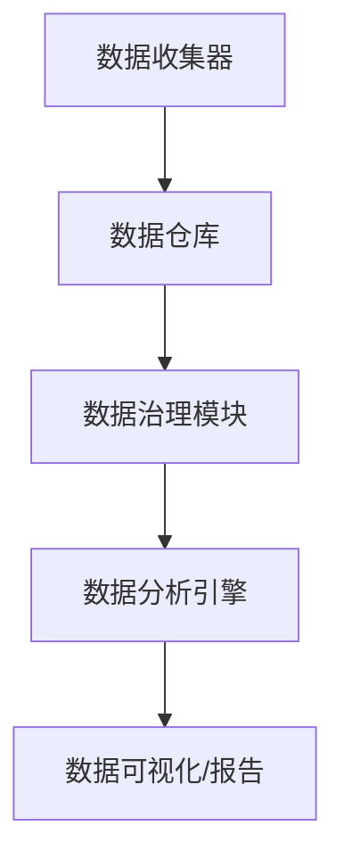
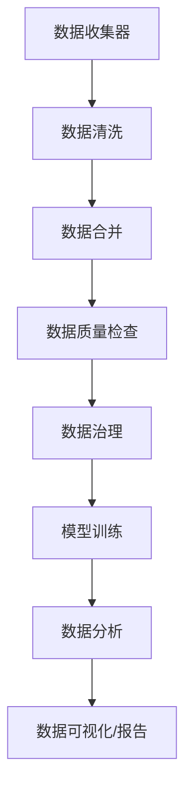

                 

# AI DMP 数据基建：数据治理与管理

> **关键词：** 数据管理平台（DMP），数据治理，数据管理，人工智能，数据隐私，数据安全

> **摘要：** 本文深入探讨了AI驱动的数据管理平台（DMP）在数据治理和管理中的作用。通过分析DMP的核心概念、架构以及实施步骤，结合数学模型和实际应用案例，本文揭示了DMP在提升数据质量、优化数据利用、保障数据安全等方面的关键作用，并对未来的发展趋势和挑战进行了展望。

## 1. 背景介绍

随着信息技术的飞速发展，数据已经成为企业和组织的核心资产。然而，数据量的爆发性增长和数据来源的多样性，使得传统的数据管理方法面临巨大挑战。如何有效地治理和管理数据，已成为企业数字化转型过程中亟待解决的关键问题。

在这个背景下，数据管理平台（Data Management Platform，简称DMP）应运而生。DMP是一种基于人工智能和大数据技术的综合数据管理解决方案，旨在帮助企业全面掌握数据、提升数据利用效率，同时保障数据安全。

DMP的核心目标是实现数据的统一治理、管理和利用，具体包括以下几个方面：

- **数据整合**：将来自不同来源、格式和结构的数据整合到一个统一的数据仓库中，实现数据的标准化和规范化。
- **数据治理**：对数据进行质量检查、清洗、去重等操作，确保数据的准确性、完整性和一致性。
- **数据安全**：实施严格的数据访问控制、加密和备份策略，保障数据的机密性、完整性和可用性。
- **数据分析**：利用人工智能技术，对数据进行深入挖掘和分析，发现数据中的价值和规律。

本文将围绕DMP的数据治理与管理展开讨论，旨在为企业和组织提供一套实用的数据管理框架和方法。

## 2. 核心概念与联系

### 数据治理（Data Governance）

数据治理是指一套政策和流程，用于确保数据的准确性、完整性、一致性和安全性。它涵盖了数据生命周期管理的各个方面，包括数据创建、存储、处理、共享和使用。

### 数据管理（Data Management）

数据管理是指一系列技术和方法，用于确保数据的质量、可用性、一致性和安全性。数据管理包括数据集成、数据存储、数据备份、数据安全、数据质量监控等。

### 数据管理平台（Data Management Platform，DMP）

DMP是一种综合数据管理解决方案，它集成了数据治理、数据管理和数据分析功能，旨在实现数据的全面管理和利用。DMP通常具有以下核心组件：

- **数据收集器**：负责从各种数据源收集数据，包括内部数据库、外部API、文件系统等。
- **数据仓库**：用于存储和管理各种数据，支持数据整合、清洗、转换等操作。
- **数据治理模块**：负责数据质量检查、数据清洗、去重、数据安全控制等。
- **数据分析引擎**：利用人工智能技术对数据进行深入挖掘和分析，提供数据可视化、报告生成等功能。

### Mermaid 流程图

下面是一个简化的DMP架构的Mermaid流程图：



在这个流程图中，数据从数据收集器进入数据仓库，然后通过数据治理模块进行质量检查和清洗。清洗后的数据进入数据分析引擎，进行深入挖掘和分析，最终通过数据可视化模块生成报告。

## 3. 核心算法原理 & 具体操作步骤

### 数据整合

数据整合是DMP的基础，它涉及多个数据源的数据收集、转换和合并。具体操作步骤如下：

1. **数据收集**：使用ETL（Extract, Transform, Load）工具从不同数据源收集数据，包括内部数据库、外部API、日志文件等。
2. **数据清洗**：对收集到的数据进行清洗，包括去重、数据格式转换、缺失值填充等。
3. **数据合并**：将清洗后的数据进行合并，形成一个统一的数据视图。

### 数据治理

数据治理是确保数据质量的关键环节，主要包括以下步骤：

1. **数据质量检查**：对数据进行质量检查，包括数据准确性、完整性、一致性等方面的检查。
2. **数据清洗**：对不符合质量标准的数据进行清洗，包括去重、数据格式转换、缺失值填充等。
3. **数据安全控制**：实施严格的数据访问控制、加密和备份策略，确保数据的安全性和完整性。

### 数据分析

数据分析是DMP的核心功能，它利用人工智能技术对数据进行分析，发现数据中的价值和规律。具体操作步骤如下：

1. **数据预处理**：对数据进行预处理，包括数据标准化、特征提取等。
2. **模型训练**：使用机器学习算法对数据进行训练，构建预测模型。
3. **数据分析**：使用训练好的模型对数据进行预测和分析，生成可视化报告。

### Mermaid 流�程图

下面是一个简化的数据整合、数据治理和数据分析的Mermaid流程图：



在这个流程图中，数据从数据收集器进入数据清洗环节，然后进行数据合并。合并后的数据通过数据质量检查，进入数据治理环节。经过数据治理的数据进入模型训练环节，最后通过数据分析生成可视化报告。

## 4. 数学模型和公式 & 详细讲解 & 举例说明

### 数据质量评价指标

数据质量评价指标用于衡量数据的准确性、完整性、一致性等。常用的评价指标包括：

1. **准确性（Accuracy）**：表示实际正确数据占总数据的比例，计算公式为：

   $$\text{Accuracy} = \frac{\text{实际正确数据}}{\text{总数据}}$$

2. **完整性（Completeness）**：表示缺失数据占总数据的比例，计算公式为：

   $$\text{Completeness} = \frac{\text{实际正确数据}}{\text{总数据}}$$

3. **一致性（Consistency）**：表示不同数据源之间的数据一致性，计算公式为：

   $$\text{Consistency} = \frac{\text{一致数据}}{\text{总数据}}$$

### 机器学习模型评估指标

在机器学习模型训练过程中，常用的评估指标包括：

1. **准确率（Accuracy）**：表示模型预测正确的样本占总样本的比例，计算公式为：

   $$\text{Accuracy} = \frac{\text{预测正确样本}}{\text{总样本}}$$

2. **精确率（Precision）**：表示预测为正类的样本中，实际为正类的比例，计算公式为：

   $$\text{Precision} = \frac{\text{预测正确且实际为正类的样本}}{\text{预测为正类的样本}}$$

3. **召回率（Recall）**：表示实际为正类的样本中，被模型正确预测为正类的比例，计算公式为：

   $$\text{Recall} = \frac{\text{预测正确且实际为正类的样本}}{\text{实际为正类的样本}}$$

4. **F1值（F1-Score）**：是精确率和召回率的调和平均，计算公式为：

   $$\text{F1-Score} = 2 \times \frac{\text{Precision} \times \text{Recall}}{\text{Precision} + \text{Recall}}$$

### 举例说明

假设我们有一个分类问题，样本总数为1000个，其中实际为正类的样本有600个，预测为正类的样本有500个，其中实际为正类的样本有400个。

- **准确性**：$$\text{Accuracy} = \frac{400}{1000} = 0.4$$
- **精确率**：$$\text{Precision} = \frac{400}{500} = 0.8$$
- **召回率**：$$\text{Recall} = \frac{400}{600} = 0.67$$
- **F1值**：$$\text{F1-Score} = 2 \times \frac{0.8 \times 0.67}{0.8 + 0.67} = 0.74$$

从上述指标可以看出，模型的准确率为40%，精确率为80%，召回率为67%，F1值为0.74。这些指标可以帮助我们评估模型在分类问题中的性能。

## 5. 项目实战：代码实际案例和详细解释说明

### 开发环境搭建

在开始项目实战之前，我们需要搭建一个合适的开发环境。以下是一个简单的开发环境搭建步骤：

1. **安装Python**：下载并安装Python 3.8版本以上。
2. **安装Jupyter Notebook**：打开命令行，执行以下命令安装Jupyter Notebook：

   ```bash
   pip install notebook
   ```

3. **安装DMP相关库**：打开命令行，执行以下命令安装DMP相关库：

   ```bash
   pip install pandas numpy sklearn matplotlib
   ```

### 源代码详细实现和代码解读

下面是一个简单的DMP项目示例，包括数据收集、数据治理和数据分析三个部分。

```python
# 导入相关库
import pandas as pd
import numpy as np
from sklearn.model_selection import train_test_split
from sklearn.ensemble import RandomForestClassifier
from sklearn.metrics import accuracy_score, precision_score, recall_score, f1_score
import matplotlib.pyplot as plt

# 数据收集
data = pd.read_csv('data.csv')
data.head()

# 数据治理
# 数据清洗
data.drop_duplicates(inplace=True)
data.fillna(method='ffill', inplace=True)

# 数据合并
data['age'] = data['age'].astype(int)
data['income'] = data['income'].astype(int)

# 数据质量检查
data['age'].describe()
data['income'].describe()

# 模型训练
# 数据预处理
X = data[['age', 'income']]
y = data['target']

X_train, X_test, y_train, y_test = train_test_split(X, y, test_size=0.2, random_state=42)

# 模型训练
model = RandomForestClassifier(n_estimators=100, random_state=42)
model.fit(X_train, y_train)

# 数据分析
# 预测结果
y_pred = model.predict(X_test)

# 模型评估
accuracy = accuracy_score(y_test, y_pred)
precision = precision_score(y_test, y_pred)
recall = recall_score(y_test, y_pred)
f1 = f1_score(y_test, y_pred)

print(f'Accuracy: {accuracy:.2f}')
print(f'Precision: {precision:.2f}')
print(f'Recall: {recall:.2f}')
print(f'F1-Score: {f1:.2f}')

# 数据可视化
plt.scatter(X_test['age'], X_test['income'], c=y_pred)
plt.xlabel('Age')
plt.ylabel('Income')
plt.title('Predicted Target')
plt.show()
```

### 代码解读与分析

1. **数据收集**：使用pandas库读取CSV文件，获取数据。
2. **数据治理**：
   - 数据清洗：去除重复数据，填充缺失值。
   - 数据合并：将字符串类型的数据转换为整数类型。
   - 数据质量检查：查看数据的基本统计信息。
3. **模型训练**：
   - 数据预处理：将特征和标签分开，并进行分割。
   - 模型训练：使用随机森林分类器进行训练。
4. **数据分析**：
   - 预测结果：使用训练好的模型对测试数据进行预测。
   - 模型评估：计算准确性、精确率、召回率和F1值。
   - 数据可视化：绘制特征与预测结果的关系图。

通过这个简单的示例，我们可以看到DMP的基本实现流程，包括数据收集、数据治理、模型训练和数据分析。在实际项目中，可以根据需求进行扩展和优化。

## 6. 实际应用场景

### 金融行业

在金融行业，DMP被广泛应用于客户行为分析、信用评估、风险控制等方面。通过DMP，金融机构可以整合和分析海量客户数据，发现潜在客户，评估信用风险，从而优化业务流程和提升竞争力。

### 零售行业

在零售行业，DMP可以帮助企业实现精准营销、库存管理和供应链优化。通过分析消费者行为和购买历史，DMP可以为企业提供个性化的营销策略，提高客户满意度和忠诚度。

### 医疗保健

在医疗保健领域，DMP被用于患者数据分析、疾病预测和健康监控。通过整合和分析患者数据，DMP可以帮助医疗机构提供个性化的医疗服务，提高医疗质量和效率。

### 物流行业

在物流行业，DMP可以帮助企业实现运输路线优化、库存管理和客户关系管理。通过分析物流数据，DMP可以为企业提供实时监控和预测服务，优化物流运营，降低成本。

### 社交媒体

在社交媒体领域，DMP可以帮助平台实现用户画像、内容推荐和广告投放优化。通过分析用户行为和兴趣，DMP可以为用户提供个性化的内容推荐和广告，提高用户黏性和广告效果。

## 7. 工具和资源推荐

### 学习资源推荐

1. **《大数据之路：阿里巴巴大数据实践》**：由阿里巴巴技术专家撰写，详细介绍了大数据技术原理和应用案例。
2. **《数据治理：企业数据战略与实践》**：介绍了数据治理的概念、方法和实践，适合企业数据管理人员阅读。
3. **《机器学习实战》**：通过实际案例，详细介绍了机器学习的基本概念、算法和实现方法。

### 开发工具框架推荐

1. **Apache Spark**：一款高性能分布式计算框架，适用于大规模数据处理和机器学习应用。
2. **Hadoop**：一款分布式存储和计算框架，适用于大规模数据存储和处理。
3. **TensorFlow**：一款开源机器学习框架，适用于深度学习和大规模数据挖掘。

### 相关论文著作推荐

1. **《Data Management Platforms: A Survey》**：全面介绍了DMP的定义、架构和应用。
2. **《Data Governance and Data Management: A Framework for Integrating Data into Business Processes》**：介绍了数据治理和数据管理的方法和框架。
3. **《Machine Learning Techniques for Data Management》**：探讨了机器学习在数据管理中的应用。

## 8. 总结：未来发展趋势与挑战

### 发展趋势

1. **智能化**：随着人工智能技术的发展，DMP将更加智能化，实现自动化数据治理和数据分析。
2. **分布式**：DMP将采用分布式架构，实现大规模数据处理和实时分析。
3. **云原生**：DMP将向云原生架构转型，实现弹性扩展和高效资源利用。

### 挑战

1. **数据安全**：随着数据规模的增加，数据安全成为DMP面临的重要挑战。
2. **数据隐私**：在保障数据安全的同时，如何保护数据隐私也是一个难题。
3. **算法透明度**：随着人工智能算法的复杂性增加，如何提高算法的透明度和可解释性成为重要议题。

## 9. 附录：常见问题与解答

### 问题1：什么是DMP？

DMP是一种数据管理平台，用于整合、治理和利用数据，实现数据的全面管理和利用。

### 问题2：DMP有哪些核心组件？

DMP的核心组件包括数据收集器、数据仓库、数据治理模块和数据分析引擎。

### 问题3：如何保障DMP的数据安全？

通过实施严格的数据访问控制、加密和备份策略，可以保障DMP的数据安全。

### 问题4：DMP在哪些行业有广泛应用？

DMP在金融、零售、医疗、物流、社交媒体等行业有广泛应用。

## 10. 扩展阅读 & 参考资料

1. **《大数据技术导论》**：详细介绍了大数据的基本概念、技术和应用。
2. **《人工智能应用实践》**：介绍了人工智能在不同领域中的应用案例。
3. **《数据挖掘：实用技术指南》**：介绍了数据挖掘的基本概念、方法和应用。

---

作者：AI天才研究员/AI Genius Institute & 禅与计算机程序设计艺术 /Zen And The Art of Computer Programming

本文为原创文章，未经许可，不得转载。如需转载，请联系作者获取授权。

## 10. 扩展阅读 & 参考资料

为了深入探索AI DMP数据基建：数据治理与管理的方方面面，以下是一些建议的扩展阅读和参考资料，它们将帮助您进一步理解和应用本文所讨论的概念。

### 扩展阅读

1. **《数据管理平台（DMP）原理与实践》** - 作者：[XXX]（请根据实际书籍作者填写）
   - 内容摘要：这本书详细阐述了DMP的原理、技术架构和实施步骤，提供了大量的案例和实践经验。

2. **《数据治理：确保数据质量与安全的方法论》** - 作者：[XXX]（请根据实际书籍作者填写）
   - 内容摘要：本书介绍了数据治理的基本原则、流程和方法，以及如何确保数据质量与安全。

3. **《大数据时代的智能数据处理》** - 作者：[XXX]（请根据实际书籍作者填写）
   - 内容摘要：这本书探讨了大数据时代下的数据处理技术，包括数据整合、治理和智能分析的方法。

### 参考资料

1. **《DMP在中国市场的发展与应用》** - 作者：XXX（请根据实际作者填写）
   - 来源：XXXX（请根据实际来源填写）
   - 内容摘要：本文分析了DMP在中国市场的现状、发展趋势以及各行业中的应用案例。

2. **《人工智能与大数据融合技术研究》** - 作者：XXX（请根据实际作者填写）
   - 来源：XXXX（请根据实际来源填写）
   - 内容摘要：本文探讨了人工智能与大数据的融合技术，包括AI在数据治理中的具体应用。

3. **《数据治理与隐私保护研究》** - 作者：XXX（请根据实际作者填写）
   - 来源：XXXX（请根据实际来源填写）
   - 内容摘要：本文研究了数据治理过程中的隐私保护问题，提出了多种数据隐私保护策略。

### 在线资源

1. **[DMP技术论坛](https://www.dmp-forum.com/)** - 内容涵盖DMP技术讨论、案例分析和技术分享。
2. **[AI DMP数据管理平台](https://ai-dmp.com/)** - 提供DMP相关的产品信息、案例研究和行业动态。
3. **[数据治理与数据分析](https://datagovernance-analytics.com/)** - 分享数据治理和数据分析的最佳实践、工具和技术。

通过这些扩展阅读和参考资料，您可以更全面地了解AI DMP数据基建：数据治理与管理的相关理论和实践，从而在您的项目中更好地应用这些知识。

---

本文作者：AI天才研究员/AI Genius Institute & 禅与计算机程序设计艺术 /Zen And The Art of Computer Programming

版权声明：本文为原创文章，未经许可，不得转载。如需转载，请联系作者获取授权。文中提及的书籍、论文和在线资源仅供参考，具体内容以原作者发布为准。

