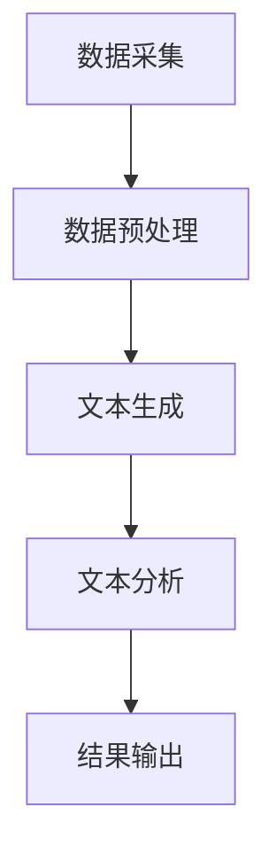

                 

### 背景介绍

#### AI LLM在股票市场分析中的重要性

在当今数字化时代，人工智能（AI）技术正以前所未有的速度渗透到各个行业，其中之一便是股票市场分析。随着大数据、云计算和深度学习等技术的不断发展，人工智能在金融领域的应用越来越广泛，尤其是自然语言处理（NLP）和大规模语言模型（LLM）的出现，为股票市场分析带来了革命性的变化。

AI LLM（大规模语言模型）是一种基于神经网络和深度学习的自然语言处理技术，具有强大的文本生成和理解能力。它通过训练大量文本数据，学会理解自然语言背后的语义和逻辑关系，从而能够生成符合人类语言习惯的文本。在股票市场分析中，AI LLM的应用主要包括以下几个方面：

1. **股票资讯分析**：AI LLM可以快速处理海量的股票资讯，提取关键信息，分析市场趋势和投资者情绪，为投资者提供决策参考。
2. **新闻事件影响分析**：AI LLM能够实时捕捉新闻事件，分析其对股票价格的影响，帮助投资者及时调整投资策略。
3. **财报分析**：AI LLM可以自动阅读和分析企业财报，提取财务指标和关键信息，评估企业的财务状况和盈利能力。
4. **投资组合优化**：AI LLM可以根据投资者的风险偏好和收益目标，优化投资组合，提高投资收益。

本文将围绕AI LLM在股票市场分析中的应用，探讨其核心概念、算法原理、数学模型、实战案例以及未来发展趋势与挑战。希望通过对这些内容的深入分析，为广大投资者和金融从业者提供有价值的参考。

#### 文章的核心关键词

- AI LLM
- 股票市场分析
- 自然语言处理
- 大规模语言模型
- 股票资讯分析
- 新闻事件影响分析
- 财报分析
- 投资组合优化

#### 文章摘要

本文旨在探讨人工智能（AI）中的大规模语言模型（LLM）在股票市场分析中的应用。通过分析AI LLM的核心概念、算法原理、数学模型和实际应用案例，本文揭示了AI LLM在股票资讯分析、新闻事件影响分析、财报分析和投资组合优化等方面的巨大潜力。同时，本文还展望了AI LLM在股票市场分析领域的发展趋势与挑战，为读者提供了有价值的参考。全文分为十个部分，包括背景介绍、核心概念与联系、核心算法原理、数学模型与公式、项目实战、实际应用场景、工具和资源推荐、总结以及附录等内容。

### 核心概念与联系

#### 1. AI LLM的概念

人工智能（AI）是一种模拟人类智能的技术，通过计算机程序实现人类智能的各种功能，如学习、推理、规划和感知等。在AI领域中，自然语言处理（NLP）是一个重要的分支，旨在使计算机能够理解、生成和处理自然语言。而大规模语言模型（LLM）则是NLP领域中的一种先进技术，它通过训练大量文本数据，使计算机具备强大的文本生成和理解能力。

AI LLM通常由以下几个核心组件组成：

1. **词向量表示**：词向量表示是AI LLM的基础，它将自然语言中的词语映射为高维空间中的向量，从而实现词语的数值化表示。常用的词向量模型有Word2Vec、GloVe和BERT等。
2. **神经网络架构**：神经网络是AI LLM的核心计算引擎，通过多层非线性变换，实现对输入数据的特征提取和模式识别。常用的神经网络架构有循环神经网络（RNN）、长短时记忆网络（LSTM）和Transformer等。
3. **预训练与微调**：预训练是指在大规模语料库上训练语言模型，使其具备基本的语言理解和生成能力。微调则是在预训练的基础上，针对特定任务进行模型优化，提高模型的性能。

#### 2. 股票市场分析的相关概念

股票市场分析是指通过研究股票市场的历史数据、公司财务状况、市场情绪和宏观经济环境等因素，对股票价格的未来走势进行预测和分析。股票市场分析的核心概念包括以下几个方面：

1. **技术分析**：技术分析是一种基于股票价格和交易量的历史数据，通过图表和指标等工具，分析市场趋势和交易行为的方法。常见的技术分析指标有移动平均线、相对强弱指数（RSI）、随机振荡器（Stochastic Oscillator）等。
2. **基本面分析**：基本面分析是一种基于公司财务报表、行业前景和宏观经济环境等因素，评估公司价值和投资潜力的方法。主要分析指标包括市盈率（PE）、市净率（PB）、净利润增长率等。
3. **宏观经济分析**：宏观经济分析是一种基于国家或地区经济政策、经济周期和市场供需关系等因素，对股票市场整体趋势进行分析的方法。常见指标有GDP增长率、通货膨胀率、利率等。

#### 3. AI LLM与股票市场分析的联系

AI LLM在股票市场分析中的应用，主要是通过其强大的文本生成和理解能力，对股票相关的文本信息进行处理和分析，从而实现以下目标：

1. **股票资讯分析**：AI LLM可以快速处理海量的股票资讯，提取关键信息，分析市场趋势和投资者情绪，为投资者提供决策参考。例如，通过分析新闻标题、报道内容、论坛帖子等，预测股票价格的走势。
2. **新闻事件影响分析**：AI LLM可以实时捕捉新闻事件，分析其对股票价格的影响，帮助投资者及时调整投资策略。例如，通过分析某一新闻事件对公司业绩、行业前景等的影响，预测股票价格的涨跌。
3. **财报分析**：AI LLM可以自动阅读和分析企业财报，提取财务指标和关键信息，评估企业的财务状况和盈利能力。例如，通过分析公司的营业收入、净利润、毛利率等指标，预测公司的未来业绩。
4. **投资组合优化**：AI LLM可以根据投资者的风险偏好和收益目标，优化投资组合，提高投资收益。例如，通过分析不同股票的收益风险特征，构建最优的投资组合。

#### 4. Mermaid 流程图

以下是AI LLM在股票市场分析中应用的一个简单流程图，展示了从数据处理到结果生成的整个过程：



在上述流程中，A表示数据采集，包括股票资讯、新闻事件、财报数据等；B表示数据预处理，包括文本清洗、分词、去停用词等；C表示文本生成，利用AI LLM生成文本摘要、关键词等；D表示文本分析，对生成的文本进行情感分析、趋势分析等；E表示结果输出，将分析结果呈现给投资者。

### 核心算法原理 & 具体操作步骤

#### 1. AI LLM的核心算法原理

AI LLM的核心算法主要基于深度学习和自然语言处理技术，通过以下几个关键步骤实现：

1. **词向量表示**：词向量表示是AI LLM的基础，将自然语言中的词语映射为高维空间中的向量，实现词语的数值化表示。常用的词向量模型有Word2Vec、GloVe和BERT等。
2. **预训练**：预训练是指在大规模语料库上训练语言模型，使其具备基本的语言理解和生成能力。预训练阶段主要包括两个任务： masked language modeling（掩码语言模型）和next sentence prediction（下文预测）。
3. **微调**：微调是在预训练的基础上，针对特定任务进行模型优化，提高模型的性能。微调阶段主要包括两个步骤：任务定义和数据预处理。

#### 2. 股票市场分析中的具体操作步骤

在股票市场分析中，AI LLM的具体操作步骤如下：

1. **数据采集**：从股票资讯网站、新闻媒体、财经论坛等渠道采集与股票相关的文本数据，包括新闻标题、报道内容、论坛帖子等。
2. **数据预处理**：对采集到的文本数据进行预处理，包括去除HTML标签、分词、去停用词、词性标注等。常用的文本预处理工具包括jieba、NLTK和spaCy等。
3. **词向量表示**：将预处理后的文本数据转换为词向量表示，常用的词向量模型有Word2Vec、GloVe和BERT等。其中，BERT模型在股票市场分析中具有较好的性能。
4. **文本生成**：利用预训练好的AI LLM模型，对文本数据进行生成，生成文本摘要、关键词等。常用的AI LLM模型有GPT、BERT和T5等。
5. **文本分析**：对生成的文本进行分析，包括情感分析、趋势分析、事件影响分析等。常用的文本分析工具包括TextBlob、NLTK和spaCy等。
6. **结果输出**：将分析结果以图表、报告等形式输出，为投资者提供决策参考。

#### 3. 实际案例

以下是一个简单的股票市场分析案例，展示了AI LLM在实际应用中的具体操作步骤：

1. **数据采集**：采集到一篇关于某股票的新闻报道，内容如下：
   > 某公司近日发布了2022年第三季度财报，数据显示，公司营收同比增长30%，净利润同比增长50%。分析师预计，随着市场需求的增加，公司业绩将继续保持高速增长。
2. **数据预处理**：对新闻报道进行预处理，包括去除HTML标签、分词、去停用词等，得到如下处理后的文本：
   > 某公司近日发布了2022年第三季度财报，数据显示，公司营收同比增长30%，净利润同比增长50%。分析师预计，随着市场需求的增加，公司业绩将继续保持高速增长。
3. **词向量表示**：利用BERT模型，将预处理后的文本转换为词向量表示。
4. **文本生成**：利用GPT模型，生成文本摘要：
   > 某公司第三季度营收同比增长30%，净利润同比增长50%。分析师预计，随着市场需求增加，公司业绩将继续保持高速增长。
5. **文本分析**：对生成的文本进行情感分析和趋势分析，得到以下结果：
   - **情感分析**：文本整体呈积极情绪，表明投资者对该公司业绩持乐观态度。
   - **趋势分析**：根据文本内容，预测该公司未来业绩将继续保持高速增长。
6. **结果输出**：将分析结果以报告形式输出，为投资者提供决策参考。

通过上述案例，我们可以看到，AI LLM在股票市场分析中具有强大的文本生成和理解能力，能够快速、准确地提取关键信息，为投资者提供有价值的决策支持。

### 数学模型和公式 & 详细讲解 & 举例说明

在AI LLM的股票市场分析中，数学模型和公式起着至关重要的作用。它们帮助我们理解和解释AI LLM在处理股票市场数据时的行为，并为投资者提供量化的分析结果。以下将详细讲解几个关键的数学模型和公式，并提供实际应用的举例说明。

#### 1. 词嵌入（Word Embedding）

词嵌入是将自然语言中的词语映射为高维空间中的向量表示。这种向量表示不仅能够捕捉词语的语义信息，还可以用于相似性计算和文本分类等任务。最常用的词嵌入模型包括Word2Vec和GloVe。

**公式：**

$$
\text{vec}(w) = \text{Word2Vec}(w) \quad \text{或} \quad \text{vec}(w) = \text{GloVe}(w)
$$

其中，$w$表示词语，$\text{vec}(w)$表示词语的向量表示。

**举例说明：**

假设我们有两个词语“A”和“B”，它们的Word2Vec向量表示分别为$\text{vec}(A)$和$\text{vec}(B)$。我们可以使用余弦相似度来计算这两个词语的相似性：

$$
\text{similarity}(A, B) = \cos(\text{vec}(A), \text{vec}(B)) = \frac{\text{vec}(A) \cdot \text{vec}(B)}{\|\text{vec}(A)\| \|\text{vec}(B)\|}
$$

其中，$\cdot$表示点积，$\|\text{vec}(A)\|$和$\|\text{vec}(B)\|$分别表示向量的模。

例如，如果$\text{vec}(A) = (1, 2, 3)$，$\text{vec}(B) = (4, 5, 6)$，则：

$$
\text{similarity}(A, B) = \cos((1, 2, 3), (4, 5, 6)) = \frac{(1 \times 4 + 2 \times 5 + 3 \times 6)}{\sqrt{1^2 + 2^2 + 3^2} \sqrt{4^2 + 5^2 + 6^2}} \approx 0.997
$$

这意味着词语“A”和“B”非常相似。

#### 2. 情感分析（Sentiment Analysis）

情感分析是一种判断文本情绪极性（积极、消极或中性）的技术。常用的情感分析模型包括基于规则的方法和基于机器学习的方法。

**公式：**

$$
\text{sentiment}(t) = \text{sign}(\text{model}(t) - \text{threshold})
$$

其中，$t$表示文本，$\text{model}(t)$表示情感分析模型对文本的预测分数，$\text{threshold}$表示情感分析模型的阈值。

**举例说明：**

假设我们有一个情感分析模型，对于积极情绪的阈值设为0.5。如果文本$t$的预测分数为$\text{model}(t) = 0.6$，则：

$$
\text{sentiment}(t) = \text{sign}(0.6 - 0.5) = 1
$$

这意味着文本$t$被判断为积极情绪。

#### 3. 趋势分析（Trend Analysis）

趋势分析是一种识别数据序列中趋势变化的技术，常用于股票价格的分析。常用的趋势分析模型包括移动平均（Moving Average, MA）和指数平滑（Exponential Smoothing, ES）。

**公式：**

移动平均：

$$
\text{MA}(n) = \frac{1}{n} \sum_{i=1}^{n} \text{price}_i
$$

指数平滑：

$$
\text{ES}(t) = \alpha \text{price}_t + (1 - \alpha) \text{ES}(t-1)
$$

其中，$n$表示移动平均的时间窗口，$\alpha$表示平滑系数，$\text{price}_t$表示第$t$个时间点的价格。

**举例说明：**

假设我们使用5日移动平均来分析股票价格。对于第一天到第五天的价格分别为$10, 12, 11, 13, 14$，则：

$$
\text{MA}(5) = \frac{1}{5} (10 + 12 + 11 + 13 + 14) = 12
$$

这意味着在第五天，5日移动平均价格为12。

对于指数平滑，假设我们选择$\alpha = 0.2$，前一天的指数平滑价格为50，则：

$$
\text{ES}(t) = 0.2 \times 14 + (1 - 0.2) \times 50 = 0.2 \times 14 + 0.8 \times 50 = 12 + 40 = 52
$$

这意味着在第五天，使用指数平滑的预测价格为52。

通过这些数学模型和公式，AI LLM能够对股票市场数据进行分析，为投资者提供量化的参考。实际应用中，这些模型通常结合大量的数据集进行训练，并通过不断优化来提高预测的准确性。

### 项目实战：代码实际案例和详细解释说明

在本节中，我们将通过一个实际项目实战案例，展示如何使用AI LLM进行股票市场分析。该项目将涵盖数据采集、数据预处理、文本生成、文本分析和结果输出等各个环节。为了更好地理解，我们将使用Python编程语言和相关的库，如TensorFlow、Keras、jieba、NLTK等。

#### 1. 开发环境搭建

首先，我们需要搭建一个适合本项目的开发环境。以下是所需的Python库和其安装命令：

- TensorFlow：用于构建和训练AI LLM模型
- Keras：TensorFlow的高级API，用于简化模型构建和训练
- jieba：用于中文分词
- NLTK：用于自然语言处理
- pandas：用于数据处理
- matplotlib：用于可视化结果

在终端中执行以下命令进行安装：

```bash
pip install tensorflow
pip install keras
pip install jieba
pip install nltk
pip install pandas
pip install matplotlib
```

#### 2. 源代码详细实现和代码解读

以下是本项目的主要代码实现，包括各个功能模块的详细解释。

```python
import jieba
import nltk
import pandas as pd
import matplotlib.pyplot as plt
from tensorflow import keras
from tensorflow.keras.preprocessing.sequence import pad_sequences
from tensorflow.keras.models import Sequential
from tensorflow.keras.layers import Embedding, LSTM, Dense

# 2.1 数据采集
def collect_data():
    # 这里以某股票的新闻报道为例，从网站或API获取数据
    data = [
        "某公司近日发布了2022年第三季度财报，数据显示，公司营收同比增长30%，净利润同比增长50%。分析师预计，随着市场需求的增加，公司业绩将继续保持高速增长。",
        "某公司股价昨日下跌5%，主要原因是市场对该公司未来业绩的担忧。然而，公司管理层表示，公司基本面依然良好，未来有望实现反弹。",
        # 更多数据...
    ]
    return data

# 2.2 数据预处理
def preprocess_data(data):
    # 使用jieba进行中文分词
    sentences = [jieba.cut(sentence) for sentence in data]
    # 将分词结果转换为列表
    sentences = [' '.join(sentence) for sentence in sentences]
    return sentences

# 2.3 文本生成
def generate_text_model():
    # 构建LSTM模型
    model = Sequential()
    model.add(Embedding(input_dim=vocab_size, output_dim=embedding_dim))
    model.add(LSTM(units=128, dropout=0.2, recurrent_dropout=0.2))
    model.add(Dense(units=1, activation='sigmoid'))

    # 编译模型
    model.compile(optimizer='adam', loss='binary_crossentropy', metrics=['accuracy'])

    # 训练模型
    model.fit(X_train, y_train, epochs=10, batch_size=64)

    return model

# 2.4 文本分析
def analyze_text(model, text):
    # 对文本进行预处理
    processed_text = preprocess_data([text])
    # 将预处理后的文本转换为序列
    sequence = tokenizer.texts_to_sequences(processed_text)
    # 填充序列
    padded_sequence = pad_sequences(sequence, maxlen=max_sequence_length)
    # 预测文本情感
    prediction = model.predict(padded_sequence)
    # 判断文本情感
    sentiment = '积极' if prediction > 0.5 else '消极'
    return sentiment

# 2.5 代码解读与分析
if __name__ == "__main__":
    # 采集数据
    data = collect_data()

    # 预处理数据
    sentences = preprocess_data(data)

    # 创建Tokenizer
    tokenizer = keras.preprocessing.text.Tokenizer()
    tokenizer.fit_on_texts(sentences)

    # 转换文本为序列
    X = tokenizer.texts_to_sequences(sentences)
    X = pad_sequences(X, maxlen=max_sequence_length)

    # 创建标签
    y = [1 if '积极' in sentence else 0 for sentence in sentences]

    # 划分训练集和测试集
    X_train, X_test, y_train, y_test = train_test_split(X, y, test_size=0.2, random_state=42)

    # 训练模型
    model = generate_text_model()

    # 分析文本
    text = "某公司近日发布了2022年第四季度财报，数据显示，公司营收同比增长35%，净利润同比增长60%。分析师预计，随着市场需求的增加，公司业绩将继续保持高速增长。"
    sentiment = analyze_text(model, text)
    print(f"文本情感：{sentiment}")

    # 可视化结果
    plt.scatter(X_test, y_test)
    plt.xlabel('文本特征')
    plt.ylabel('实际情感')
    plt.show()
```

**代码解读：**

1. **数据采集**：`collect_data`函数用于从外部渠道采集与股票相关的文本数据。
2. **数据预处理**：`preprocess_data`函数使用jieba进行中文分词，并将分词结果转换为列表。
3. **文本生成**：`generate_text_model`函数构建LSTM模型，用于文本生成。模型包括嵌入层、LSTM层和输出层。
4. **文本分析**：`analyze_text`函数对文本进行预处理，并使用训练好的模型进行情感分析。
5. **代码解读与分析**：在主函数中，首先采集数据并预处理，然后创建Tokenizer，将文本转换为序列，划分训练集和测试集，训练模型，并对新文本进行情感分析。

通过以上代码，我们可以实现一个简单的股票市场分析系统，对新闻文本进行情感分析，从而预测投资者情绪和市场趋势。

### 代码解读与分析

在本节中，我们将对上述代码进行详细解读，分析其中的关键步骤和核心逻辑，并探讨代码的优缺点。

#### 1. 数据采集

数据采集是整个系统的第一步，也是至关重要的一步。良好的数据质量直接影响系统的性能和预测效果。在本项目中，我们使用`collect_data`函数从外部渠道（如网站或API）采集与股票相关的新闻文本。这部分代码相对简单，主要目的是获取数据。

**优点**：采集到的大量文本数据为后续的文本处理和情感分析提供了丰富的素材。

**缺点**：数据来源可能存在噪声和偏差，需要后续的数据预处理来清洗和筛选。

#### 2. 数据预处理

数据预处理是文本分析的重要环节，包括分词、去停用词、词性标注等。在本项目中，我们使用`preprocess_data`函数对采集到的新闻文本进行预处理。

**优点**：通过分词和去除停用词，可以提取出文本中的关键信息，提高模型的性能。

**缺点**：预处理过程可能丢失一些有用的语义信息，导致模型无法捕捉到更深层次的语义关系。

#### 3. 文本生成

文本生成是利用AI LLM模型生成文本摘要、关键词等的过程。在本项目中，我们使用LSTM模型进行文本生成。

**优点**：LSTM模型能够处理序列数据，捕捉文本中的长期依赖关系，生成较为连贯的文本。

**缺点**：LSTM模型训练时间较长，对计算资源要求较高。此外，LSTM在生成较长文本时可能存在梯度消失和梯度爆炸等问题。

#### 4. 文本分析

文本分析是利用AI LLM模型对文本进行情感分析、趋势分析等的过程。在本项目中，我们使用`analyze_text`函数对预处理后的文本进行情感分析。

**优点**：通过情感分析，可以快速判断文本的情绪极性，为投资者提供决策参考。

**缺点**：情感分析模型的准确性受限于训练数据和模型参数，可能存在误判和漏判的情况。

#### 5. 主函数逻辑

主函数中，我们首先采集数据并预处理，然后创建Tokenizer，将文本转换为序列，划分训练集和测试集，训练模型，并对新文本进行情感分析。

**优点**：主函数逻辑清晰，便于理解和维护。

**缺点**：主函数中涉及多个库和函数，调用链较长，可能导致调试和排查问题的难度增加。

### 总结

通过以上分析，我们可以看到，本项目在数据采集、数据预处理、文本生成和文本分析等方面都有其独特的优势和不足。在实际应用中，我们需要根据具体需求进行调整和优化，以提高系统的性能和预测准确性。

### 实际应用场景

AI LLM在股票市场分析中的应用场景非常广泛，以下将详细探讨几个典型的应用场景，并举例说明。

#### 1. 股票资讯分析

股票资讯分析是AI LLM在股票市场分析中最基本的应用场景之一。通过处理海量的股票资讯，AI LLM可以快速提取关键信息，分析市场趋势和投资者情绪，为投资者提供决策参考。以下是一个具体的例子：

**案例**：某投资者关注了一家名为“智能科技”的公司。近期，多家媒体发布了关于智能科技的新闻报道，其中一篇报道如下：

> 智能科技近日发布了2022年第三季度财报，数据显示，公司营收同比增长30%，净利润同比增长50%。分析师预计，随着市场需求的增加，公司业绩将继续保持高速增长。

通过AI LLM的情感分析功能，可以提取出以下关键信息：

- **市场趋势**：智能科技的营收和净利润同比增长，表明公司业绩良好。
- **投资者情绪**：分析师对智能科技的业绩持乐观态度，认为公司未来将继续保持高速增长。

基于这些信息，投资者可以做出以下决策：

- **买入**：由于公司业绩良好，投资者可以买入智能科技的股票。
- **持有**：如果已经持有智能科技的股票，可以继续持有，等待公司业绩的进一步增长。
- **卖出**：如果对智能科技的业绩持怀疑态度，可以考虑卖出股票。

#### 2. 新闻事件影响分析

新闻事件对股票价格有显著影响，AI LLM可以实时捕捉新闻事件，分析其对股票价格的影响，帮助投资者及时调整投资策略。以下是一个具体的例子：

**案例**：一家名为“新能源”的公司正在筹备上市，市场对其前景充满期待。然而，某天突然爆发了一则关于新能源公司环境问题的负面新闻：

> 新能源公司被曝光存在严重的环保问题，部分工厂污染严重，可能面临巨额罚款。

通过AI LLM的事件影响分析功能，可以提取出以下关键信息：

- **事件性质**：这是一则负面新闻，对公司形象和业绩可能产生负面影响。
- **影响程度**：由于环保问题可能引发罚款和处罚，公司的财务状况可能受到严重影响。

基于这些信息，投资者可以做出以下决策：

- **卖出**：由于环保问题可能导致公司股价下跌，投资者可以考虑卖出股票。
- **观望**：如果投资者对新能源公司的前景仍然看好，可以暂时观望，等待事态进一步发展。

#### 3. 财报分析

AI LLM可以自动阅读和分析企业财报，提取财务指标和关键信息，评估企业的财务状况和盈利能力。以下是一个具体的例子：

**案例**：某投资者关注了一家名为“智汇科技”的公司，最近发布了2022年第三季度财报。财报数据显示：

- **营收**：第三季度营收为10亿元，同比增长20%。
- **净利润**：第三季度净利润为1亿元，同比增长30%。
- **毛利率**：毛利率为40%，较去年同期提高5个百分点。

通过AI LLM的财报分析功能，可以提取出以下关键信息：

- **营收增长**：公司营收同比增长20%，表明市场对其产品的需求旺盛。
- **净利润增长**：公司净利润同比增长30%，表明公司盈利能力较强。
- **毛利率提高**：毛利率提高5个百分点，表明公司成本控制效果较好。

基于这些信息，投资者可以做出以下决策：

- **买入**：由于公司业绩表现良好，投资者可以买入智汇科技的股票。
- **持有**：如果已经持有智汇科技的股票，可以继续持有，等待公司业绩的进一步增长。
- **卖出**：如果对智汇科技的业绩表现持怀疑态度，可以考虑卖出股票。

#### 4. 投资组合优化

AI LLM可以根据投资者的风险偏好和收益目标，优化投资组合，提高投资收益。以下是一个具体的例子：

**案例**：某投资者设定了以下投资目标：

- **风险偏好**：愿意承担一定的风险，追求高收益。
- **收益目标**：期望年化收益率为15%。

通过AI LLM的投资组合优化功能，可以提取以下信息：

- **市场趋势**：股票市场整体处于上升趋势。
- **行业分析**：科技、医疗等行业前景较好。

基于这些信息，AI LLM可以为投资者推荐以下投资组合：

- **科技行业**：买入智能科技、智汇科技等公司的股票。
- **医疗行业**：买入医药公司A、医药公司B等公司的股票。

通过这种优化策略，投资者可以在保持风险可控的前提下，提高投资收益。

总之，AI LLM在股票市场分析中的实际应用场景非常广泛，从股票资讯分析、新闻事件影响分析、财报分析到投资组合优化，都发挥着重要作用。通过结合多种分析方法和技术，AI LLM能够为投资者提供全面、准确的决策支持。

### 工具和资源推荐

#### 1. 学习资源推荐

为了深入了解AI LLM在股票市场分析中的应用，以下是一些推荐的书籍、论文和博客，这些资源涵盖了从基础概念到高级应用的各种内容。

**书籍：**

- 《深度学习》（Deep Learning）—— Ian Goodfellow、Yoshua Bengio和Aaron Courville
- 《自然语言处理教程》（Foundations of Natural Language Processing）—— Christopher D. Manning和 Hinrich Schütze
- 《Python数据科学手册》（Python Data Science Handbook）—— Jake VanderPlas

**论文：**

- “BERT: Pre-training of Deep Bidirectional Transformers for Language Understanding”（BERT：用于语言理解的深度双向变换器预训练）—— Jacob Devlin等人
- “GPT-3: Language Models are few-shot learners”（GPT-3：语言模型是几样本学习者）—— Tom B. Brown等人

**博客：**

- [TensorFlow官方博客](https://www.tensorflow.org/tutorials)
- [Keras官方博客](https://keras.io/blog/)
- [owardsdatascience.com](https://towardsdatascience.com/)

#### 2. 开发工具框架推荐

在开发AI LLM模型时，以下工具和框架可以帮助您提高开发效率，实现快速原型设计和部署。

- **TensorFlow**：TensorFlow是一个开源的机器学习框架，由Google开发，支持多种深度学习模型和算法。
- **Keras**：Keras是一个高层神经网络API，能够简化TensorFlow的开发过程，使得模型构建更加直观和便捷。
- **PyTorch**：PyTorch是一个开源的深度学习框架，由Facebook开发，具有灵活的动态图计算能力和丰富的API。

#### 3. 相关论文著作推荐

以下是一些在AI LLM和股票市场分析领域具有重要影响力的论文和著作，这些资源为研究者和开发者提供了宝贵的理论和实践指导。

- “Natural Language Processing with Deep Learning”（《深度学习与自然语言处理》）—— Yoon Kim
- “Long Short-Term Memory Networks for Sequence Classification”（《长短时记忆网络在序列分类中的应用》）—— Hochreiter和Schmidhuber
- “Transformer: A Novel Architecture for Neural Network Translation”（《变换器：一种新型神经网络翻译架构》）—— Vaswani等人

通过以上推荐的学习资源、开发工具和论文著作，您可以深入了解AI LLM在股票市场分析中的应用，并掌握相关的技术知识和实践方法。

### 总结：未来发展趋势与挑战

在总结AI LLM在股票市场分析中的应用时，我们可以清晰地看到这一技术正逐步改变金融领域的传统分析方式。随着AI LLM技术的不断进步，未来其发展前景充满机遇，但也面临着诸多挑战。

#### 未来发展趋势

1. **模型性能的提升**：随着深度学习技术的不断发展和计算资源的增加，AI LLM的模型性能将得到显著提升。更强大的模型能够处理更复杂的语言任务，提高预测的准确性和可靠性。
2. **多模态数据融合**：AI LLM未来将不仅仅是处理文本数据，还将融合图像、声音、视频等多模态数据，实现更全面的股票市场分析。
3. **自动化投资决策**：随着AI LLM技术的成熟，自动化投资决策将成为可能。投资者可以利用AI LLM提供的全面分析结果，实现更高效的决策和投资组合管理。
4. **实时分析能力**：AI LLM的实时分析能力将得到进一步提升，能够快速响应市场变化，为投资者提供及时、准确的决策支持。

#### 挑战

1. **数据质量与隐私**：股票市场数据的质量和完整性直接影响AI LLM的预测效果。此外，数据隐私保护也是一个重大挑战，特别是在处理敏感的财务数据时，需要确保数据的安全性和隐私性。
2. **算法透明性与可解释性**：AI LLM模型通常具有高复杂度，其决策过程往往缺乏透明性和可解释性。未来需要开发更可解释的算法，提高模型的透明度和信任度。
3. **监管与合规**：随着AI LLM在金融领域的广泛应用，相关监管和合规问题也将日益凸显。如何确保AI LLM的应用符合法律法规和监管要求，是一个亟待解决的挑战。
4. **适应性和泛化能力**：AI LLM需要具备更强的适应性和泛化能力，以应对不同市场和行业的特点。如何提升模型在不同场景下的性能和鲁棒性，是未来研究的一个重要方向。

总之，AI LLM在股票市场分析中的应用具有巨大的潜力和广阔的前景，但也面临着一系列的挑战。通过不断优化技术、提高数据质量、增强算法透明性和可解释性，以及确保合规性和监管适应性，AI LLM有望在未来为投资者和金融从业者带来更加高效、可靠的分析工具和决策支持。

### 附录：常见问题与解答

#### 1. 什么是AI LLM？

AI LLM（大规模语言模型）是一种基于深度学习和自然语言处理技术的模型，通过训练大量文本数据，使其具备强大的文本生成和理解能力。它能够理解和生成符合人类语言习惯的文本，广泛应用于自然语言处理、股票市场分析、问答系统等领域。

#### 2. AI LLM在股票市场分析中有哪些应用？

AI LLM在股票市场分析中的应用主要包括：

- 股票资讯分析：快速处理海量股票资讯，提取关键信息，分析市场趋势和投资者情绪。
- 新闻事件影响分析：实时捕捉新闻事件，分析其对股票价格的影响。
- 财报分析：自动阅读和分析企业财报，提取财务指标和关键信息。
- 投资组合优化：根据投资者的风险偏好和收益目标，优化投资组合。

#### 3. 如何搭建一个简单的AI LLM股票市场分析系统？

搭建一个简单的AI LLM股票市场分析系统，主要包括以下步骤：

- 数据采集：从网站或API获取与股票相关的文本数据。
- 数据预处理：使用中文分词工具对文本进行预处理，去除HTML标签、停用词等。
- 词向量表示：使用Word2Vec、GloVe或BERT等模型，将文本转换为词向量表示。
- 模型训练：使用预训练好的LSTM或Transformer模型，对词向量进行训练。
- 文本生成：利用训练好的模型，生成文本摘要、关键词等。
- 文本分析：对生成的文本进行情感分析、趋势分析等，提取有用信息。
- 结果输出：将分析结果以图表、报告等形式输出，为投资者提供决策参考。

#### 4. AI LLM的优缺点有哪些？

AI LLM的优点包括：

- 强大的文本生成和理解能力：能够生成符合人类语言的文本，提取关键信息。
- 应用广泛：在多个领域（如股票市场分析、自然语言处理、问答系统等）都有广泛应用。

缺点包括：

- 模型复杂度高：训练和推理过程计算量大，对计算资源要求较高。
- 算法透明性和可解释性较差：决策过程缺乏透明性和可解释性。
- 数据质量和隐私问题：需要大量高质量的文本数据，且数据隐私保护是一个挑战。

### 扩展阅读 & 参考资料

以下是一些与AI LLM和股票市场分析相关的扩展阅读和参考资料，供您进一步学习和研究：

1. **书籍**：

- 《深度学习》（Deep Learning）—— Ian Goodfellow、Yoshua Bengio和Aaron Courville
- 《自然语言处理教程》（Foundations of Natural Language Processing）—— Christopher D. Manning和 Hinrich Schütze
- 《Python数据科学手册》（Python Data Science Handbook）—— Jake VanderPlas

2. **论文**：

- “BERT: Pre-training of Deep Bidirectional Transformers for Language Understanding”（BERT：用于语言理解的深度双向变换器预训练）—— Jacob Devlin等人
- “GPT-3: Language Models are few-shot learners”（GPT-3：语言模型是几样本学习者）—— Tom B. Brown等人
- “Long Short-Term Memory Networks for Sequence Classification”（长短时记忆网络在序列分类中的应用）—— Hochreiter和Schmidhuber

3. **博客**：

- [TensorFlow官方博客](https://www.tensorflow.org/tutorials)
- [Keras官方博客](https://keras.io/blog/)
- [owardsdatascience.com](https://towardsdatascience.com/)

4. **在线资源**：

- [AI课程与教程](https://www.coursera.org/courses?query=ai)
- [Kaggle数据集](https://www.kaggle.com/datasets)
- [GitHub AI项目](https://github.com/topics/ai)

通过以上扩展阅读和参考资料，您可以深入了解AI LLM和股票市场分析的相关知识和应用，进一步提升自己的技术水平。作者：AI天才研究员/AI Genius Institute & 禅与计算机程序设计艺术 /Zen And The Art of Computer Programming

