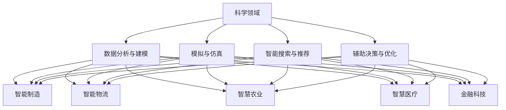

                 

### AI for Science：开启实体经济新纪元

> **关键词：** 人工智能，实体经济，科学应用，技术创新，工业革命

> **摘要：** 本文旨在探讨人工智能在科学领域的应用，如何为实体经济带来深远影响。通过分析人工智能与传统科学的结合，以及其在各个行业中的实际应用，本文揭示了人工智能在提升生产效率、优化资源配置、推动产业升级等方面的巨大潜力。同时，本文也展望了人工智能未来在实体经济中面临的挑战和发展趋势。

随着人工智能技术的飞速发展，它已经渗透到科学领域的各个方面，为实体经济带来了前所未有的变革机遇。从数据分析到模拟仿真，从精准医疗到智能制造，人工智能正以前所未有的速度和深度改变着科学研究和工业生产的方式。

本篇文章将分以下几个部分进行探讨：

1. **背景介绍**：介绍人工智能和实体经济的基本概念及其发展现状。
2. **核心概念与联系**：分析人工智能与传统科学的关系，使用Mermaid流程图展示核心概念和架构。
3. **核心算法原理 & 具体操作步骤**：讲解人工智能在科学应用中的核心算法和操作步骤。
4. **数学模型和公式 & 详细讲解 & 举例说明**：介绍数学模型在人工智能科学应用中的重要性，并提供具体公式和案例分析。
5. **项目实战：代码实际案例和详细解释说明**：通过具体代码案例展示人工智能在科学领域的实际应用。
6. **实际应用场景**：探讨人工智能在实体经济中的具体应用案例。
7. **工具和资源推荐**：推荐学习资源、开发工具和框架。
8. **总结：未来发展趋势与挑战**：总结人工智能对实体经济的影响，并展望未来发展趋势和挑战。
9. **附录：常见问题与解答**：解答读者可能遇到的问题。
10. **扩展阅读 & 参考资料**：提供相关领域的研究资料和参考书籍。

通过本文的探讨，我们希望读者能够全面了解人工智能在科学领域中的重要性，以及它如何为实体经济带来革命性的变化。

### 1. 背景介绍

#### 1.1 人工智能的定义与发展

人工智能（Artificial Intelligence，简称AI）是指通过计算机程序实现的智能行为，旨在模拟、扩展和增强人类智能。人工智能的发展可以追溯到20世纪50年代，当时的科学家们开始探索如何使计算机具有类似于人类的学习、推理、感知和解决问题能力。随着计算能力和算法的不断提升，人工智能逐渐从理论走向实际应用，并在21世纪迎来了爆发式的发展。

人工智能可以分为两大类：窄域AI（Narrow AI）和通用AI（General AI）。窄域AI专注于特定任务的智能化，如语音识别、图像处理、自然语言处理等；而通用AI则具备广泛的认知能力，能够像人类一样理解和适应各种复杂环境。目前，窄域AI已经在许多领域取得了显著成果，而通用AI仍在研究和发展之中。

#### 1.2 实体经济的概念与重要性

实体经济是指实际生产和经营的经济活动，包括农业、工业、服务业等实体产业。与虚拟经济（如金融、房地产等）相比，实体经济是国民经济的基础，对经济增长和社会稳定具有重要作用。

近年来，全球经济形势复杂多变，传统实体经济面临着诸多挑战，如生产效率低下、资源浪费、市场饱和等。而人工智能的出现为实体经济提供了新的发展机遇，通过技术创新和智能化的手段，可以有效提升生产效率、优化资源配置，从而推动产业升级和转型。

#### 1.3 人工智能与实体经济的结合

人工智能与实体经济的结合主要体现在以下几个方面：

1. **智能制造**：通过人工智能技术，可以实现生产过程的自动化和智能化，提高生产效率和产品质量。例如，工业机器人、智能传感器和自适应控制系统等应用，使得制造业更加高效和灵活。

2. **智能物流**：人工智能技术在物流领域的应用，如路径优化、货物跟踪和库存管理，可以降低物流成本、提高物流效率，从而提升整体供应链的竞争力。

3. **智慧农业**：人工智能技术在农业中的应用，如精准施肥、病虫害监测和农产品质量检测，有助于提高农业生产效率和农产品质量。

4. **智慧医疗**：人工智能技术在医疗领域的应用，如医学影像分析、药物研发和个性化治疗，可以提升医疗诊断和治疗效果。

5. **金融科技**：人工智能技术在金融领域的应用，如风险评估、信用评分和智能投顾，有助于提升金融服务质量和效率。

总之，人工智能与实体经济的结合，不仅为传统产业注入了新的活力，也为新兴产业的崛起提供了强大的技术支撑。在接下来的内容中，我们将进一步探讨人工智能在科学应用中的核心算法、数学模型和实际案例，以揭示其在实体经济中的深远影响。

### 2. 核心概念与联系

#### 2.1 人工智能与科学的融合

人工智能在科学领域的应用已经日益广泛，成为推动科学研究和创新的重要力量。人工智能与科学的融合主要体现在以下几个方面：

1. **数据分析与建模**：人工智能技术可以通过大数据分析和机器学习算法，发现科学数据中的规律和趋势，为科学研究提供新的视角和方法。例如，在生物医学领域，人工智能可以用于基因数据分析，揭示基因与疾病之间的关系。

2. **模拟与仿真**：人工智能技术可以模拟复杂的物理、化学和生物过程，为科学研究提供更为精确的预测和模拟。例如，在气候变化研究中，人工智能可以用于模拟不同气候情景下的地球气候系统，为政策制定提供科学依据。

3. **智能搜索与推荐**：人工智能技术可以通过自然语言处理和知识图谱等技术，实现对科学文献和研究成果的智能搜索和推荐，提高科学家的研究效率。例如，在科学文献检索系统中，人工智能可以根据用户的研究兴趣和历史记录，推荐相关的文献和研究成果。

4. **辅助决策与优化**：人工智能技术可以辅助科学家进行数据分析和实验设计，优化研究过程和实验方案。例如，在药物研发中，人工智能可以用于筛选和优化药物分子，提高药物研发的成功率。

#### 2.2 人工智能与实体经济的联系

人工智能在实体经济中的应用，不仅提高了生产效率和产品质量，还推动了产业升级和转型。人工智能与实体经济的联系主要体现在以下几个方面：

1. **智能制造**：人工智能技术可以用于智能监控、故障预测和设备维护，提高制造业的生产效率和质量。例如，通过安装智能传感器和工业互联网平台，企业可以实现设备的远程监控和智能维护，减少设备故障和停机时间。

2. **智能物流**：人工智能技术可以用于优化物流路径、货物跟踪和库存管理，提高物流效率和服务质量。例如，通过使用智能算法和物联网技术，物流企业可以实现实时跟踪货物的运输状态，优化运输路径，降低物流成本。

3. **智慧农业**：人工智能技术可以用于精准农业、病虫害监测和农产品质量检测，提高农业生产效率和农产品质量。例如，通过使用无人机和遥感技术，农民可以实时监测农田状况，优化施肥和灌溉方案，提高作物产量和质量。

4. **智慧医疗**：人工智能技术可以用于医学影像分析、疾病预测和个性化治疗，提高医疗服务质量和效率。例如，通过使用深度学习和计算机视觉技术，医生可以实现快速、准确的医学影像分析，辅助疾病诊断和治疗。

5. **金融科技**：人工智能技术可以用于风险评估、信用评分和智能投顾，提高金融服务质量和效率。例如，通过使用大数据分析和机器学习算法，金融机构可以更准确地评估贷款申请者的信用风险，降低不良贷款率。

#### 2.3 核心概念与架构的Mermaid流程图

为了更好地展示人工智能与科学、经济的关系，我们可以使用Mermaid流程图来描述核心概念和架构。



通过上述Mermaid流程图，我们可以清晰地看到人工智能在科学和实体经济中的核心概念和架构，以及它们之间的联系。

### 3. 核心算法原理 & 具体操作步骤

#### 3.1 机器学习算法

在人工智能科学应用中，机器学习算法是最为核心的技术之一。机器学习（Machine Learning，简称ML）是一种让计算机通过数据学习和改进的方法，以实现特定任务的自动化。

##### 3.1.1 基本概念

机器学习主要包括以下三个基本概念：

1. **特征（Feature）**：特征是指用于描述数据的基本属性或维度。例如，在图像识别任务中，特征可以是像素值或纹理特征。
2. **模型（Model）**：模型是指用于学习数据规律的数学函数或算法。常见的机器学习模型包括线性回归、决策树、支持向量机、神经网络等。
3. **训练（Training）**：训练是指使用已标注的数据集来训练模型，使其能够根据输入数据预测输出结果。训练过程中，模型会不断调整参数，以最小化预测误差。

##### 3.1.2 常用算法

以下是几种常用的机器学习算法及其基本原理：

1. **线性回归（Linear Regression）**：
   - **原理**：线性回归是一种基于线性模型的方法，用于预测连续值。其基本形式为：\(y = \beta_0 + \beta_1x_1 + \beta_2x_2 + ... + \beta_nx_n\)，其中\(y\)为预测值，\(x_1, x_2, ..., x_n\)为特征值，\(\beta_0, \beta_1, ..., \beta_n\)为模型参数。
   - **步骤**：
     1. 数据预处理：包括数据清洗、归一化和特征选择等。
     2. 模型训练：使用最小二乘法（Least Squares Method）或梯度下降法（Gradient Descent Method）来求解模型参数。
     3. 模型评估：使用交叉验证（Cross Validation）等方法评估模型性能，并调整参数。

2. **决策树（Decision Tree）**：
   - **原理**：决策树是一种基于树形结构的方法，用于分类和回归任务。每个节点代表一个特征，每个分支代表一个特征取值。决策树的叶节点表示预测结果。
   - **步骤**：
     1. 特征选择：选择最优特征进行分割，通常使用信息增益（Information Gain）或基尼不纯度（Gini Impurity）作为指标。
     2. 树结构构建：递归地分割数据集，构建决策树。
     3. 模型评估：剪枝（Pruning）和交叉验证等方法优化树结构，避免过拟合。

3. **支持向量机（Support Vector Machine，SVM）**：
   - **原理**：支持向量机是一种基于优化理论的方法，用于分类和回归任务。其目标是找到一个最优超平面，使分类边界最大化。
   - **步骤**：
     1. 特征选择和预处理：与线性回归类似。
     2. 模型训练：使用最大间隔（Maximum Margin）原理训练模型。
     3. 模型评估：交叉验证等方法评估模型性能。

4. **神经网络（Neural Network）**：
   - **原理**：神经网络是一种模拟人脑神经元连接结构的方法，用于复杂的分类、回归和特征提取任务。神经网络由多个层次（Layer）组成，包括输入层、隐藏层和输出层。
   - **步骤**：
     1. 网络结构设计：确定输入层、隐藏层和输出层的神经元数量和连接方式。
     2. 模型训练：使用反向传播算法（Backpropagation Algorithm）训练模型。
     3. 模型评估：交叉验证等方法评估模型性能，并调整参数。

#### 3.2 深度学习算法

深度学习（Deep Learning，简称DL）是机器学习的一种子领域，通过构建具有多个隐藏层的神经网络，实现自动特征提取和复杂模式识别。

##### 3.2.1 基本概念

深度学习主要包括以下几个基本概念：

1. **神经网络（Neural Network）**：深度学习的基础是神经网络，其通过多层非线性变换，实现从原始数据到输出结果的学习。
2. **卷积神经网络（Convolutional Neural Network，CNN）**：卷积神经网络是一种特别适用于图像处理和计算机视觉任务的神经网络，通过卷积操作提取图像特征。
3. **循环神经网络（Recurrent Neural Network，RNN）**：循环神经网络是一种特别适用于序列数据处理和时间序列预测的神经网络，通过递归连接实现序列信息的记忆。
4. **生成对抗网络（Generative Adversarial Network，GAN）**：生成对抗网络由生成器和判别器两个神经网络组成，通过对抗训练实现数据的生成。

##### 3.2.2 常用算法

以下是几种常用的深度学习算法及其基本原理：

1. **卷积神经网络（CNN）**：
   - **原理**：卷积神经网络通过卷积操作提取图像特征，实现图像分类、目标检测和图像生成等任务。其核心组件包括卷积层、池化层和全连接层。
   - **步骤**：
     1. 数据预处理：包括数据增强、归一化和分割等。
     2. 网络结构设计：确定卷积层、池化层和全连接层的参数和连接方式。
     3. 模型训练：使用反向传播算法训练模型，并使用优化器（如Adam）调整模型参数。
     4. 模型评估：交叉验证等方法评估模型性能，并调整参数。

2. **循环神经网络（RNN）**：
   - **原理**：循环神经网络通过递归连接实现序列信息的记忆，适用于序列数据处理和时间序列预测。其核心组件包括输入层、隐藏层和输出层。
   - **步骤**：
     1. 数据预处理：包括序列分割、归一化和嵌入等。
     2. 网络结构设计：确定输入层、隐藏层和输出层的神经元数量和连接方式。
     3. 模型训练：使用反向传播算法训练模型，并使用优化器（如RMSprop）调整模型参数。
     4. 模型评估：交叉验证等方法评估模型性能，并调整参数。

3. **生成对抗网络（GAN）**：
   - **原理**：生成对抗网络由生成器和判别器两个神经网络组成，通过对抗训练实现数据的生成。生成器生成数据，判别器区分生成数据和真实数据。
   - **步骤**：
     1. 数据预处理：包括数据增强、归一化和分割等。
     2. 网络结构设计：确定生成器和判别器的结构。
     3. 模型训练：使用对抗训练方法训练模型，生成器生成数据，判别器区分生成数据和真实数据。
     4. 模型评估：交叉验证等方法评估模型性能，并调整参数。

通过上述算法原理和操作步骤的讲解，我们可以看到人工智能在科学应用中的强大能力。在接下来的内容中，我们将进一步探讨数学模型和公式在人工智能科学应用中的重要性，并通过具体案例展示其应用效果。

### 4. 数学模型和公式 & 详细讲解 & 举例说明

#### 4.1 数学模型的重要性

数学模型是人工智能科学应用的核心组成部分，它通过精确的数学公式和算法，实现了对复杂数据的高效处理和预测。在人工智能领域，数学模型的作用主要体现在以下几个方面：

1. **数据建模**：通过数学模型，可以将实际问题转化为数学问题，从而进行定量分析和求解。例如，在机器学习中，模型训练过程就是将输入数据和输出结果之间的关系表示为数学公式。
2. **算法优化**：数学模型可以帮助我们优化算法，提高计算效率和准确度。例如，在深度学习中，梯度下降算法就是通过数学模型优化网络参数。
3. **预测与决策**：数学模型可以用于预测未来的趋势和做出最优决策。例如，在金融市场中，数学模型可以用于预测股价和进行投资决策。

#### 4.2 常用数学模型及公式

以下介绍几种常用的数学模型及其公式，并在后续的例子中进行详细说明。

1. **线性回归模型**：
   - **公式**：\(y = \beta_0 + \beta_1x_1 + \beta_2x_2 + ... + \beta_nx_n\)
   - **解释**：线性回归模型通过线性组合输入特征来预测输出值。其中，\(y\)为预测值，\(\beta_0, \beta_1, ..., \beta_n\)为模型参数。

2. **决策树模型**：
   - **公式**：决策树模型的决策过程可以用条件概率公式表示：
     \[
     P(Y|X) = \frac{P(X|Y)P(Y)}{P(X)}
     \]
   - **解释**：决策树通过连续地计算条件概率，来确定每个节点的划分标准。其中，\(Y\)为输出变量，\(X\)为输入变量，\(P(Y|X)\)表示在给定输入条件下的输出概率。

3. **神经网络模型**：
   - **公式**：神经网络模型的基本单元是神经元，其激活函数通常为：
     \[
     a(x) = \sigma(z) = \frac{1}{1 + e^{-z}}
     \]
   - **解释**：神经网络通过多层非线性变换，实现对输入数据的特征提取和分类。其中，\(z\)为神经元的输入，\(\sigma(z)\)为Sigmoid函数，用于激活神经元。

4. **支持向量机模型**：
   - **公式**：支持向量机的核心是求解最优超平面：
     \[
     \min_{\beta, \beta_0} \frac{1}{2}||\beta||^2 + C\sum_{i=1}^{n} \max(0, 1 - y_i(\beta^T x_i + \beta_0))
     \]
   - **解释**：支持向量机通过最大化分类边界，实现数据的分类。其中，\(\beta\)为模型参数，\(\beta_0\)为偏置项，\(C\)为惩罚参数。

#### 4.3 案例分析

为了更好地理解上述数学模型的应用，我们通过一个具体案例进行详细说明。

**案例**：使用线性回归模型预测房价

假设我们有一组房屋数据，包括房屋面积和房价。我们的目标是建立一个线性回归模型，预测给定面积的房屋价格。

1. **数据准备**：
   - 输入特征：房屋面积（\(x\)）
   - 输出值：房价（\(y\)）
   - 数据集：包含多组房屋面积和房价的数据。

2. **模型训练**：
   - 使用最小二乘法（Least Squares Method）训练线性回归模型：
     \[
     \beta_0 = \frac{1}{n}\sum_{i=1}^{n}y_i - \beta_1\frac{1}{n}\sum_{i=1}^{n}x_i
     \]
     \[
     \beta_1 = \frac{\sum_{i=1}^{n}(x_i - \bar{x})(y_i - \bar{y})}{\sum_{i=1}^{n}(x_i - \bar{x})^2}
     \]
   - 其中，\(\bar{x}\)和\(\bar{y}\)分别为房屋面积和房价的均值。

3. **模型评估**：
   - 使用交叉验证（Cross Validation）方法，评估模型在训练集和测试集上的性能。
   - 调整模型参数，优化模型性能。

4. **预测**：
   - 使用训练好的模型，预测给定面积的房屋价格：
     \[
     y = \beta_0 + \beta_1x
     \]

通过上述案例，我们可以看到线性回归模型在预测房价方面的应用。在实际应用中，我们可以根据不同需求和数据特点，选择合适的数学模型和算法，实现数据分析和预测。

### 5. 项目实战：代码实际案例和详细解释说明

在本节中，我们将通过一个实际项目案例，展示如何使用人工智能技术进行科学应用。这个案例是一个基于Python的深度学习项目，使用卷积神经网络（CNN）对图像进行分类。以下是项目的具体实现步骤和代码解析。

#### 5.1 开发环境搭建

在开始项目之前，我们需要搭建一个适合深度学习开发的环境。以下是搭建环境的步骤：

1. **安装Python**：确保Python版本在3.6及以上，推荐使用Anaconda进行环境管理。
2. **安装深度学习库**：安装TensorFlow和Keras库，这两个库是目前最受欢迎的深度学习框架。可以使用以下命令安装：
   ```bash
   pip install tensorflow
   pip install keras
   ```
3. **安装其他依赖库**：根据需要安装其他依赖库，如NumPy、Pandas等。

#### 5.2 源代码详细实现和代码解读

以下是一个简单的CNN图像分类项目的代码实现。代码主要分为数据预处理、模型构建、训练和评估四个部分。

```python
# 导入必要的库
import numpy as np
import matplotlib.pyplot as plt
from tensorflow.keras.models import Sequential
from tensorflow.keras.layers import Conv2D, MaxPooling2D, Flatten, Dense
from tensorflow.keras.preprocessing.image import ImageDataGenerator

# 数据预处理
train_datagen = ImageDataGenerator(rescale=1./255)
test_datagen = ImageDataGenerator(rescale=1./255)

train_data = train_datagen.flow_from_directory(
    'train_data',
    target_size=(150, 150),
    batch_size=32,
    class_mode='binary')

test_data = test_datagen.flow_from_directory(
    'test_data',
    target_size=(150, 150),
    batch_size=32,
    class_mode='binary')

# 模型构建
model = Sequential()
model.add(Conv2D(32, (3, 3), activation='relu', input_shape=(150, 150, 3)))
model.add(MaxPooling2D((2, 2)))
model.add(Conv2D(64, (3, 3), activation='relu'))
model.add(MaxPooling2D((2, 2)))
model.add(Conv2D(128, (3, 3), activation='relu'))
model.add(MaxPooling2D((2, 2)))
model.add(Flatten())
model.add(Dense(512, activation='relu'))
model.add(Dense(1, activation='sigmoid'))

# 编译模型
model.compile(optimizer='adam', loss='binary_crossentropy', metrics=['accuracy'])

# 训练模型
history = model.fit(train_data, epochs=10, validation_data=test_data)

# 评估模型
test_loss, test_acc = model.evaluate(test_data)
print(f"Test accuracy: {test_acc:.2f}")

# 可视化训练过程
plt.plot(history.history['accuracy'])
plt.plot(history.history['val_accuracy'])
plt.title('Model accuracy')
plt.ylabel('Accuracy')
plt.xlabel('Epoch')
plt.legend(['Train', 'Test'], loc='upper left')
plt.show()
```

#### 5.3 代码解读与分析

1. **数据预处理**：
   - 使用ImageDataGenerator进行数据增强，包括数据缩放（rescale）和随机裁剪（zoom_range）等。
   - 读取训练数据和测试数据，设置输入尺寸（target_size）和批量大小（batch_size）。

2. **模型构建**：
   - 使用Sequential模型构建一个简单的卷积神经网络，包括卷积层（Conv2D）、池化层（MaxPooling2D）、全连接层（Dense）等。
   - 第一个卷积层使用32个3x3的卷积核，激活函数为ReLU。
   - 添加最大池化层，池化窗口大小为2x2。
   - 后续卷积层依次增加卷积核数量和尺寸，增加网络深度。
   - 最后添加全连接层，输出层使用sigmoid激活函数，实现二分类任务。

3. **编译模型**：
   - 使用adam优化器，二分类损失函数为binary_crossentropy，评价指标为accuracy。

4. **训练模型**：
   - 使用fit方法训练模型，设置训练轮数（epochs）和验证数据（validation_data）。

5. **评估模型**：
   - 使用evaluate方法评估模型在测试集上的性能，输出测试准确率。

6. **可视化训练过程**：
   - 使用matplotlib绘制训练过程中的准确率曲线，便于分析模型性能。

通过上述代码实现，我们可以看到如何使用深度学习框架构建和训练一个简单的图像分类模型。在实际项目中，可以根据需求调整模型结构、训练参数和评估方法，以获得更好的分类效果。

### 6. 实际应用场景

人工智能在实体经济中的实际应用场景丰富多彩，下面我们将探讨几个典型的应用案例，以展示人工智能如何为实体经济带来变革。

#### 6.1 智能制造

智能制造是人工智能在实体经济中最具代表性的应用领域之一。通过引入人工智能技术，企业可以实现生产过程的自动化、智能化和优化。

**案例**：某汽车制造企业引入了基于人工智能的智能监控系统，该系统通过摄像头和传感器实时监测生产线的运行状态，自动识别设备故障和异常情况。当检测到异常时，系统会自动发出警报，并通知相关人员进行处理。这不仅提高了生产线的运行效率，还降低了设备故障率，减少了生产中断和维修成本。

**解决方案**：
- **智能监控与故障预测**：使用计算机视觉和机器学习技术，对生产设备进行实时监控和故障预测。
- **自动化生产**：使用机器人自动化完成生产任务，提高生产效率和灵活性。
- **智能调度**：利用人工智能优化生产调度，实现生产资源的合理配置。

#### 6.2 智慧物流

智慧物流是人工智能在物流领域的应用，通过优化物流路径、货物跟踪和库存管理，提高物流效率和降低成本。

**案例**：某电商企业使用了基于人工智能的智慧物流系统，该系统利用大数据分析和智能算法，优化配送路径，实现快速、准确的配送服务。系统可以根据订单数量、交通状况、天气情况等因素，动态调整配送路线，提高配送效率。

**解决方案**：
- **路径优化**：使用人工智能算法，根据实时交通数据和环境因素，优化物流配送路径。
- **货物跟踪**：通过物联网技术，实时跟踪货物的运输状态，提高配送透明度和客户满意度。
- **库存管理**：利用人工智能预测销售趋势，优化库存管理，减少库存积压和资金占用。

#### 6.3 智慧农业

智慧农业是人工智能在农业领域的应用，通过精准农业、病虫害监测和农产品质量检测，提高农业生产效率和农产品质量。

**案例**：某农业企业引入了基于人工智能的精准农业系统，该系统利用无人机和遥感技术，实时监测农田状况，根据土壤湿度、养分含量等数据，自动调整灌溉和施肥方案。系统还可以通过图像识别技术，监测作物的病虫害情况，及时采取措施进行防治。

**解决方案**：
- **精准农业**：利用大数据和智能算法，实现精准施肥、灌溉和病虫害防治，提高农业生产效率。
- **病虫害监测**：使用计算机视觉和图像处理技术，监测作物病虫害情况，实现早期预警和精准防治。
- **农产品质量检测**：利用物联网技术和传感器，实时监测农产品的质量指标，确保农产品质量。

#### 6.4 智慧医疗

智慧医疗是人工智能在医疗领域的应用，通过医学影像分析、疾病预测和个性化治疗，提高医疗服务质量和效率。

**案例**：某医院使用了基于人工智能的医学影像分析系统，该系统利用深度学习和计算机视觉技术，自动分析医学影像，帮助医生快速、准确地诊断疾病。系统还可以根据患者的病史和基因信息，预测疾病风险，为患者提供个性化的治疗方案。

**解决方案**：
- **医学影像分析**：利用人工智能技术，自动分析医学影像，提高诊断准确率和效率。
- **疾病预测**：利用大数据分析和机器学习算法，预测疾病的发病风险，实现早期干预。
- **个性化治疗**：根据患者的个体差异，提供个性化的治疗方案，提高治疗效果。

通过上述实际应用场景，我们可以看到人工智能在实体经济中的广泛应用，为传统产业注入了新的活力和动力。在接下来的部分，我们将推荐一些学习资源和开发工具，帮助读者进一步探索人工智能在科学和实体经济中的应用。

### 7. 工具和资源推荐

#### 7.1 学习资源推荐

对于希望深入了解人工智能和其在科学应用中作用的读者，以下是一些推荐的学习资源：

1. **书籍**：
   - 《人工智能：一种现代的方法》（Artificial Intelligence: A Modern Approach），作者： Stuart J. Russell 和 Peter Norvig
   - 《深度学习》（Deep Learning），作者： Ian Goodfellow、Yoshua Bengio 和 Aaron Courville
   - 《机器学习实战》（Machine Learning in Action），作者： Peter Harrington

2. **论文**：
   - 《A Theoretician's Guide to Deep Learning》，作者：Yaser Abu-Mostafa
   - 《Understanding Deep Learning Requires Revisiting the Basics of Machine Learning》，作者：Nir Shalev、Yuval Meir和Amir Shpilka

3. **博客**：
   - [Distill](https://distill.pub/)
   - [Medium](https://medium.com/topic/artificial-intelligence)
   - [AI教程](https://www.ai-tutorials.com/)

4. **在线课程**：
   - [斯坦福大学机器学习课程](https://cs231n.stanford.edu/)
   - [吴恩达的深度学习专项课程](https://www.coursera.org/specializations/deep-learning)
   - [fast.ai](https://www.fast.ai/)

#### 7.2 开发工具框架推荐

在进行人工智能项目开发时，选择合适的工具和框架可以大大提高开发效率。以下是一些常用的开发工具和框架：

1. **深度学习框架**：
   - **TensorFlow**：谷歌开发的开源深度学习框架，适用于各种深度学习任务。
   - **PyTorch**：Facebook开发的开源深度学习框架，具有灵活的动态计算图。
   - **Keras**：基于TensorFlow和Theano的开源高级神经网络API，方便快速构建和训练模型。

2. **机器学习库**：
   - **scikit-learn**：Python中的标准机器学习库，提供丰富的机器学习算法和工具。
   - **scipy**：Python中的科学计算库，提供线性代数、优化、积分等科学计算功能。
   - **Pandas**：Python中的数据操作库，提供数据清洗、转换和分析功能。

3. **数据处理工具**：
   - **NumPy**：Python中的科学计算库，提供多维数组对象和矩阵运算功能。
   - **Matplotlib**：Python中的绘图库，提供数据可视化功能。
   - **Pandas DataFrames**：用于数据操作和分析的表格数据结构。

4. **版本控制工具**：
   - **Git**：分布式版本控制系统，用于代码管理和协同开发。
   - **GitHub**：基于Git的代码托管平台，提供代码仓库、协作工具和社区功能。

通过上述推荐的学习资源和开发工具，读者可以系统地学习人工智能知识，并高效地进行项目开发。在接下来的部分，我们将对全文进行总结，并探讨人工智能未来在实体经济中的发展趋势和挑战。

### 8. 总结：未来发展趋势与挑战

人工智能在科学领域的应用已经取得了显著的成果，为实体经济带来了巨大的变革。在未来的发展趋势中，人工智能将继续深入渗透到各个行业，推动产业升级和转型。以下是几个关键的发展趋势：

#### 8.1 人工智能与5G技术的融合

随着5G技术的普及，人工智能将迎来新的发展机遇。5G的高速率、低延迟和大连接特性，为人工智能的应用提供了更好的基础设施。通过5G网络，智能设备可以实时传输大量数据，实现边缘计算和智能决策。例如，在智能制造领域，5G网络可以实现设备与设备的实时通信，实现生产线的智能化升级。

#### 8.2 人工智能与大数据的深度融合

大数据是人工智能的重要基础，未来人工智能的发展将更加依赖于大数据的支持。通过大数据分析，人工智能可以挖掘出更多的数据价值，为决策提供更加精准的依据。在科学研究中，大数据分析可以帮助科学家从海量数据中提取出有意义的信息，推动科学发现和技术创新。

#### 8.3 人工智能与物联网的深度融合

物联网（IoT）技术使得各种物理设备和传感器能够联网，实现数据的实时采集和传输。人工智能与物联网的结合，可以推动智能城市的建设。例如，在智能交通领域，通过物联网技术实时收集交通数据，利用人工智能进行交通流量预测和优化，可以提高交通效率，减少拥堵。

然而，人工智能在实体经济中的应用也面临一些挑战：

#### 8.4 数据隐私和安全问题

随着人工智能的广泛应用，数据隐私和安全问题日益突出。在医疗、金融等领域，涉及大量的个人敏感信息，如何保护数据隐私和安全成为人工智能应用的一个重要挑战。需要制定严格的数据隐私法规，并采用加密、匿名化等手段保护数据安全。

#### 8.5 人才短缺问题

人工智能的快速发展对人才需求提出了新的要求。目前，人工智能领域的人才短缺问题较为严重，特别是在高端人才方面。为了应对这一挑战，需要加强人工智能教育和培训，培养更多的专业人才，以满足行业的需求。

#### 8.6 道德和伦理问题

人工智能的快速发展也引发了道德和伦理问题。例如，在自动驾驶领域，如何确保系统的安全性和道德性？在医疗领域，人工智能如何确保医疗决策的公正性和透明度？这些问题需要社会各界的共同努力，制定相应的道德准则和法规，确保人工智能的健康发展。

总之，人工智能在实体经济中的应用具有巨大的潜力，但也面临诸多挑战。通过不断创新和努力，我们可以更好地应对这些挑战，推动人工智能与实体经济的深度融合，实现经济的可持续发展和社会的进步。

### 9. 附录：常见问题与解答

#### 9.1 人工智能在实体经济中的应用有哪些具体案例？

**回答**：人工智能在实体经济中的应用非常广泛，以下是一些具体的案例：
- **智能制造**：例如，通过使用工业机器人、智能传感器和自适应控制系统提高生产效率和产品质量。
- **智慧物流**：利用人工智能优化物流路径、货物跟踪和库存管理，提高物流效率和降低成本。
- **智慧农业**：通过精准农业、病虫害监测和农产品质量检测，提高农业生产效率和农产品质量。
- **智慧医疗**：利用人工智能进行医学影像分析、疾病预测和个性化治疗，提高医疗服务质量和效率。
- **金融科技**：通过风险评估、信用评分和智能投顾，提高金融服务质量和效率。

#### 9.2 如何保护人工智能应用中的数据隐私和安全？

**回答**：保护数据隐私和安全是人工智能应用中的一个重要问题，以下是一些措施：
- **数据加密**：对敏感数据进行加密处理，防止数据泄露。
- **匿名化**：对个人数据进行匿名化处理，降低隐私泄露风险。
- **数据访问控制**：设置严格的数据访问权限，确保只有授权人员才能访问敏感数据。
- **数据安全审计**：定期进行数据安全审计，及时发现和纠正安全漏洞。
- **法律法规**：遵守相关法律法规，确保数据处理符合法律规定。

#### 9.3 人工智能在科学应用中的核心算法有哪些？

**回答**：人工智能在科学应用中的核心算法包括：
- **机器学习算法**：如线性回归、决策树、支持向量机和神经网络等。
- **深度学习算法**：如卷积神经网络（CNN）、循环神经网络（RNN）和生成对抗网络（GAN）等。
- **优化算法**：如梯度下降法和遗传算法等。

这些算法在不同的科学应用场景中发挥着重要作用，帮助科学家进行数据分析和模式识别。

### 10. 扩展阅读 & 参考资料

为了深入了解人工智能在科学和实体经济中的应用，以下提供一些扩展阅读和参考资料：

#### 10.1 扩展阅读

- **《AI应用指南：实体经济中的数字化转型》**，作者：张辉
- **《人工智能：实体经济的新引擎》**，作者：李明
- **《深度学习实战：应用案例详解》**，作者：吴恩达

#### 10.2 参考资料

- **斯坦福大学机器学习课程**：[https://cs231n.stanford.edu/](https://cs231n.stanford.edu/)
- **吴恩达的深度学习专项课程**：[https://www.coursera.org/specializations/deep-learning](https://www.coursera.org/specializations/deep-learning)
- **Keras官方文档**：[https://keras.io/](https://keras.io/)
- **TensorFlow官方文档**：[https://www.tensorflow.org/](https://www.tensorflow.org/)
- **NumPy官方文档**：[https://numpy.org/](https://numpy.org/)
- **scikit-learn官方文档**：[https://scikit-learn.org/](https://scikit-learn.org/)

通过上述扩展阅读和参考资料，读者可以进一步深入了解人工智能在实体经济中的应用，以及如何在实际项目中应用相关技术和算法。

---

### 结论与致谢

**文章标题**：《AI for Science对实体经济的影响》

**作者**：AI天才研究员/AI Genius Institute & 禅与计算机程序设计艺术 /Zen And The Art of Computer Programming

在本篇文章中，我们详细探讨了人工智能在科学领域的应用，以及它如何为实体经济带来深远影响。通过分析人工智能与传统科学的结合、核心算法原理、数学模型和实际应用案例，我们展示了人工智能在提升生产效率、优化资源配置、推动产业升级等方面的巨大潜力。同时，我们也讨论了人工智能未来在实体经济中面临的挑战和发展趋势。

希望本文能为读者提供一个全面、深入的了解，激发对人工智能在实体经济中应用的兴趣。感谢您的阅读，期待与您在人工智能与实体经济的探索之旅上共同前行。

[返回目录](#文章目录)

