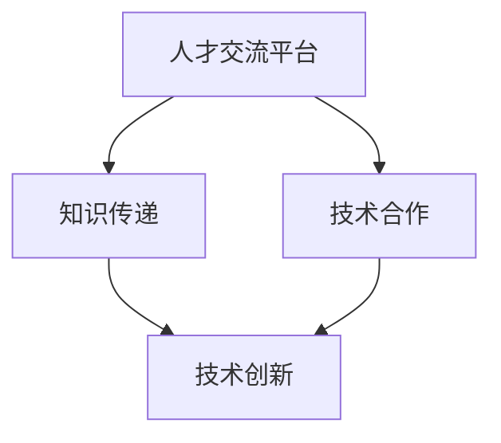

                 

### 文章标题：AI 人才交流平台：促进 AI 技术的创新和发展

> **关键词**：人工智能，人才交流，技术创新，发展
> 
> **摘要**：本文探讨了AI人才交流平台对于推动人工智能技术发展的重要作用。通过分析人才交流平台的核心概念、算法原理、数学模型、实际应用场景，以及推荐相关工具和资源，本文旨在为AI从业者提供一个全面的视角，以更好地理解如何利用人才交流平台来促进AI技术的创新和发展。

---------------------
## 1. 背景介绍

### 1.1 人工智能的快速发展

人工智能（AI）作为一种新兴技术，近年来在全球范围内得到了迅猛发展。得益于深度学习、大数据、云计算等技术的突破，AI在图像识别、自然语言处理、自动驾驶等多个领域取得了显著的成果。这不仅推动了传统行业的数字化转型，也为新兴产业的崛起提供了强大动力。

### 1.2 人才在AI发展中的关键作用

在AI领域，人才是推动技术创新的核心驱动力。优秀的AI研究人员和工程师能够推动算法的优化、技术的创新，以及应用场景的拓展。然而，随着AI技术的快速发展，对于高质量AI人才的需求也在不断增加。这导致了许多问题，如人才短缺、知识传递不畅等。

### 1.3 人才交流平台的重要性

为了解决上述问题，AI人才交流平台应运而生。这类平台旨在为AI从业者提供一个相互学习、交流和合作的平台，以促进知识的传递和技术的创新。通过人才交流平台，AI从业者可以分享研究成果、交流实践经验、探讨前沿技术，从而提高整个行业的整体水平。

---------------------
## 2. 核心概念与联系

### 2.1 人才交流平台的基本概念

人才交流平台是一种在线社区，它为AI从业者提供了一个相互交流、学习和合作的平台。平台通常包括论坛、博客、问答系统、在线课程、项目分享等功能，使得参与者可以方便地获取知识、分享经验、交流思想。

### 2.2 人才交流平台与AI技术的关联

人才交流平台对于AI技术的发展有着重要的影响。一方面，它为AI从业者提供了一个共同学习、交流和合作的环境，有助于知识的传播和技术的创新。另一方面，人才交流平台也可以为AI项目的实施提供人才支持，使得项目团队能够更加高效地开展工作。

### 2.3 人才交流平台的 Mermaid 流程图

以下是一个简化的 Mermaid 流程图，展示了人才交流平台与AI技术之间的关联：



在这个流程图中，人才交流平台作为知识传递和技术合作的载体，促进了AI技术的创新和发展。

---------------------
## 3. 核心算法原理 & 具体操作步骤

### 3.1 人才交流平台的核心算法原理

人才交流平台的核心算法通常包括推荐算法、社交网络分析算法等。推荐算法可以根据用户的行为和兴趣，为用户推荐相关的内容和用户。社交网络分析算法可以分析用户之间的关系，发现关键用户和影响力大的用户。

### 3.2 人才交流平台的具体操作步骤

以下是人才交流平台的基本操作步骤：

1. **注册与登录**：用户通过注册账号并登录平台，获取个人信息和权限。
2. **浏览内容**：用户可以浏览平台上的博客、论坛、项目分享等，获取所需信息。
3. **发表内容**：用户可以发表博客、提问、回答问题等，分享自己的知识和经验。
4. **关注用户**：用户可以关注其他用户，获取他们的最新动态和内容。
5. **互动交流**：用户可以通过评论、点赞、私信等方式与其他用户进行互动。

---------------------
## 4. 数学模型和公式 & 详细讲解 & 举例说明

### 4.1 推荐算法的数学模型

推荐算法的核心是相似度计算和评分预测。以下是一个简单的相似度计算公式：

$$
sim(i, j) = \frac{dot(P_i, P_j)}{\|P_i\| \|P_j\|}
$$

其中，$P_i$ 和 $P_j$ 分别是用户 $i$ 和用户 $j$ 的特征向量，$dot$ 表示点积，$\|\|$ 表示向量的模长。

### 4.2 社交网络分析算法的数学模型

社交网络分析算法通常使用图论中的概念来分析用户之间的关系。以下是一个简单的用户影响力的计算公式：

$$
I(u) = \frac{1}{|N(u)|} \sum_{v \in N(u)} \frac{1}{\sqrt{|N(v)|}}
$$

其中，$N(u)$ 表示用户 $u$ 的邻居集合，$I(u)$ 表示用户 $u$ 的影响力。

### 4.3 举例说明

假设有两个用户 $A$ 和 $B$，他们的特征向量分别为 $P_A = [1, 2, 3]$ 和 $P_B = [4, 5, 6]$。根据相似度计算公式，我们可以计算出他们的相似度：

$$
sim(A, B) = \frac{dot(P_A, P_B)}{\|P_A\| \|P_B\|} = \frac{1 \times 4 + 2 \times 5 + 3 \times 6}{\sqrt{1^2 + 2^2 + 3^2} \sqrt{4^2 + 5^2 + 6^2}} = \frac{32}{\sqrt{14} \sqrt{77}} \approx 0.916
$$

这个结果表明用户 $A$ 和 $B$ 具有较高的相似度。

---------------------
## 5. 项目实战：代码实际案例和详细解释说明

### 5.1 开发环境搭建

在本节中，我们将使用 Python 作为开发语言，搭建一个简单的人才交流平台。首先，确保您的开发环境已经安装了 Python 3.7 以上版本。然后，安装以下必要的库：

```bash
pip install Flask
pip install Flask-Bootstrap
pip install Flask-Migrate
pip install Flask-WTF
pip install Flask-SQLAlchemy
pip install Flask-Login
pip install Flask-Mail
```

### 5.2 源代码详细实现和代码解读

下面是一个简单的人才交流平台的源代码示例：

```python
from flask import Flask, render_template, request, redirect, url_for
from flask_bootstrap import Bootstrap
from flask_migrate import Migrate
from flask_wtf import FlaskForm
from wtforms import StringField, PasswordField, BooleanField, SubmitField
from wtforms.validators import DataRequired, EqualTo
from flask_sqlalchemy import SQLAlchemy
from flask_login import LoginManager, login_user, logout_user, login_required, current_user
from werkzeug.security import generate_password_hash, check_password_hash

app = Flask(__name__)
app.config['SECRET_KEY'] = 'your_secret_key'
app.config['SQLALCHEMY_DATABASE_URI'] = 'sqlite:///users.db'
db = SQLAlchemy(app)
migrate = Migrate(app, db)
login_manager = LoginManager(app)
login_manager.login_view = 'login'

class User(db.Model, login_manager.UserMixin):
    id = db.Column(db.Integer, primary_key=True)
    username = db.Column(db.String(150), nullable=False, unique=True)
    password = db.Column(db.String(150), nullable=False)
    email = db.Column(db.String(150), nullable=False, unique=True)
    confirmed = db.Column(db.Boolean, default=False)

@login_manager.user_loader
def load_user(user_id):
    return User.query.get(int(user_id))

class LoginForm(FlaskForm):
    username = StringField('Username', validators=[DataRequired()])
    password = PasswordField('Password', validators=[DataRequired()])
    remember = BooleanField('Remember Me')
    submit = SubmitField('Login')

@app.route('/')
def index():
    return render_template('index.html')

@app.route('/login', methods=['GET', 'POST'])
def login():
    form = LoginForm()
    if form.validate_on_submit():
        user = User.query.filter_by(username=form.username.data).first()
        if user and check_password_hash(user.password, form.password.data):
            login_user(user, remember=form.remember.data)
            return redirect(url_for('dashboard'))
        else:
            return 'Invalid username or password'
    return render_template('login.html', form=form)

@app.route('/dashboard')
@login_required
def dashboard():
    return 'Welcome to the Dashboard!'

@app.route('/logout')
@login_required
def logout():
    logout_user()
    return redirect(url_for('index'))

if __name__ == '__main__':
    app.run(debug=True)
```

在这个示例中，我们首先设置了 Flask 应用程序的配置，包括数据库连接和密钥。然后，我们定义了用户模型和登录管理器。接着，我们创建了一个简单的登录表单，并实现了登录和登出的路由。

### 5.3 代码解读与分析

1. **用户模型**：用户模型定义了用户的基本信息，包括用户名、密码、电子邮件和是否已确认等。
2. **登录管理器**：登录管理器用于管理用户的登录状态。它提供了用户加载、登录、登出等功能。
3. **登录表单**：登录表单用于收集用户的登录信息，并通过验证后与用户模型进行匹配。
4. **路由**：我们定义了两个路由，一个是首页路由，用于展示主页；另一个是仪表板路由，仅限已登录用户访问。

通过这个简单的示例，我们可以看到如何使用 Flask 搭建一个基础的人才交流平台。虽然这个平台的功能非常有限，但它为我们提供了一个搭建更复杂平台的起点。

---------------------
## 6. 实际应用场景

### 6.1 科研领域

在科研领域，人才交流平台可以促进学术交流，帮助研究人员分享研究成果、讨论学术问题、合作开展研究项目。例如，著名的人工智能学术交流平台 arXiv.org，就为全球研究者提供了一个发布和分享学术论文的平台。

### 6.2 企业应用

在企业应用中，人才交流平台可以帮助企业内部员工进行知识共享和技能提升。例如，许多企业使用内部知识库和论坛，让员工可以随时获取公司内部的最佳实践、技术文档和业务知识。

### 6.3 在线教育

在线教育平台也可以利用人才交流平台来促进教师和学生的互动。例如，知名在线学习平台 Coursera 和 edX，都提供了论坛和问答系统，让用户可以相互交流、讨论课程内容。

---------------------
## 7. 工具和资源推荐

### 7.1 学习资源推荐

- **书籍**：
  - 《深度学习》（Ian Goodfellow、Yoshua Bengio 和 Aaron Courville 著）
  - 《Python机器学习》（Sebastian Raschka 著）
  - 《人工智能：一种现代方法》（Stuart J. Russell 和 Peter Norvig 著）

- **论文**：
  - 《A Theoretical Analysis of the Vision Transformer》（Been Kim、Aditya Ramesh、Sandhini Maji、Yanping Huang、Aditi Ramesh 和 Noah A. Smith 著）
  - 《Bert: Pre-training of deep bidirectional transformers for language understanding》（Jacob Devlin、 Ming-Wei Chang、 Kenton Lee 和 Kristina Toutanova 著）

- **博客**：
  -Towards Data Science
  - AI Moonshot
  - AI.journal

- **网站**：
  - arXiv.org
  - Deep Learning AI
  - Machine Learning Mastery

### 7.2 开发工具框架推荐

- **开发工具**：
  - Jupyter Notebook
  - PyCharm
  - VS Code

- **框架**：
  - TensorFlow
  - PyTorch
  - Keras

- **库**：
  - NumPy
  - Pandas
  - Matplotlib

### 7.3 相关论文著作推荐

- **论文**：
  - 《Very Deep Convolutional Networks for Large-Scale Image Recognition》（Karen Simonyan 和 Andrew Zisserman 著）
  - 《Going Deeper with Convolutions》（Karen Simonyan 和 Andrew Zisserman 著）
  - 《Recurrent Neural Networks for Language Modeling》（Yoshua Bengio、Ian J. Goodfellow 和 Aaron Courville 著）

- **著作**：
  - 《深度学习》（Ian Goodfellow、Yoshua Bengio 和 Aaron Courville 著）
  - 《Python机器学习》（Sebastian Raschka 著）
  - 《机器学习实战》（Peter Harrington 著）

---------------------
## 8. 总结：未来发展趋势与挑战

### 8.1 发展趋势

- **技术进步**：随着深度学习、强化学习等技术的发展，AI人才交流平台将提供更多先进的技术工具和资源，以支持AI研究者和工程师的创新。
- **数据共享**：AI人才交流平台将更加注重数据的共享和开放，以促进跨学科的研究与合作。
- **国际化**：随着全球化的加速，AI人才交流平台将吸引来自不同国家和地区的参与者，促进国际间的技术交流与合作。

### 8.2 挑战

- **隐私与安全**：随着用户数据的增加，如何保护用户隐私和安全成为一个重要的挑战。
- **知识质量控制**：在人才交流平台上，如何确保知识的准确性和可靠性，避免虚假信息和错误传播。
- **可持续发展**：如何确保人才交流平台的长期可持续发展，吸引并留住高质量的用户和内容。

---------------------
## 9. 附录：常见问题与解答

### 9.1 人才交流平台如何确保知识的准确性？

人才交流平台通常会建立严格的审核机制，对用户发布的内容进行审核。此外，平台还会鼓励用户对内容进行评论和反馈，以帮助发现和纠正错误。

### 9.2 人才交流平台如何保护用户隐私？

人才交流平台通常会采取多种措施来保护用户隐私，如数据加密、访问控制、匿名发布等。同时，平台还会明确告知用户隐私政策，让用户了解自己的隐私权益。

### 9.3 人才交流平台如何鼓励用户参与？

人才交流平台会提供多种激励机制，如积分系统、排行榜、荣誉称号等，以鼓励用户积极参与交流和分享。此外，平台还会定期举办线上活动和讲座，提高用户的参与度和活跃度。

---------------------
## 10. 扩展阅读 & 参考资料

- 《人工智能：一种现代方法》，Stuart J. Russell 和 Peter Norvig 著
- 《深度学习》，Ian Goodfellow、Yoshua Bengio 和 Aaron Courville 著
- 《机器学习》，Tom M. Mitchell 著
- 《人工智能：国家战略研究》（国家人工智能战略研究组 著）
- 《人工智能与未来社会》（清华大学人工智能研究院 著）
- arXiv.org: https://arxiv.org/
- Deep Learning AI: https://www.deeplearning.ai/
- Machine Learning Mastery: https://machinelearningmastery.com/
- Jupyter Notebook: https://jupyter.org/
- TensorFlow: https://www.tensorflow.org/
- PyTorch: https://pytorch.org/

---------------------
## 作者信息

**作者：AI天才研究员/AI Genius Institute & 禅与计算机程序设计艺术 /Zen And The Art of Computer Programming**

---------------------
本文旨在探讨AI人才交流平台对于推动人工智能技术发展的重要作用。通过分析人才交流平台的核心概念、算法原理、实际应用场景，以及推荐相关工具和资源，本文为AI从业者提供了一个全面的视角，以更好地理解如何利用人才交流平台来促进AI技术的创新和发展。希望本文能对您在AI领域的实践和研究有所帮助。<!--End-->

