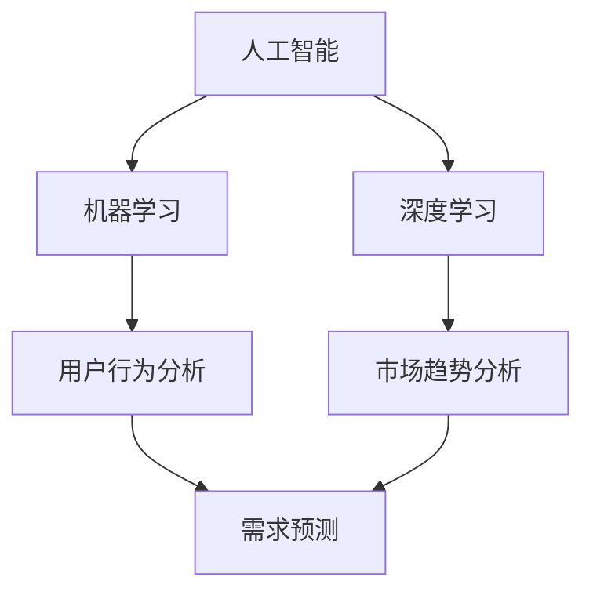

                 

### 背景介绍 Background Introduction

随着人工智能技术的不断发展和成熟，其在各行各业的应用越来越广泛。产品经理作为连接技术团队与市场需求的桥梁，其工作效率和质量直接影响到产品的成功与否。AI在产品经理工作中的应用，正成为提高产品开发效率、优化用户体验的重要手段。

在传统产品开发过程中，产品经理需要进行大量的市场调研、用户需求分析、竞品分析等工作。这些工作往往需要耗费大量的时间和精力，而且容易受到主观因素的影响。通过引入AI技术，产品经理可以更高效地获取和分析数据，从而做出更为准确和全面的产品决策。

本文将探讨AI在产品经理工作中的具体应用，包括市场调研、用户需求分析、竞品分析、产品设计等环节。我们将通过具体的案例和步骤，展示AI技术如何提高产品经理的工作效率和产品品质。希望通过本文的介绍，能够帮助读者更好地理解和应用AI技术，提升自身的业务能力。

### 核心概念与联系 Core Concepts and Connections

为了深入探讨AI在产品经理工作中的应用，我们需要首先了解几个核心概念：人工智能、机器学习、深度学习等。

#### 人工智能 Artificial Intelligence (AI)

人工智能（Artificial Intelligence，简称AI）是指通过计算机模拟人类智能的技术。它涵盖了多种方法和技术，包括机器学习、深度学习、自然语言处理等。AI的目标是实现机器的自主学习和决策能力，以完成人类难以完成的任务。

#### 机器学习 Machine Learning

机器学习（Machine Learning，简称ML）是人工智能的一个分支，主要研究如何让计算机从数据中自动学习规律，并利用这些规律进行预测和决策。机器学习算法通过训练模型，从大量的历史数据中提取特征，然后根据这些特征进行分类、预测或优化。

#### 深度学习 Deep Learning

深度学习（Deep Learning，简称DL）是机器学习的一个子领域，通过构建多层的神经网络模型，实现对复杂数据的自动特征提取和分类。深度学习模型具有强大的学习和泛化能力，广泛应用于图像识别、语音识别、自然语言处理等领域。

在产品经理的工作中，这些AI技术可以发挥重要作用。例如，通过机器学习算法，产品经理可以自动分析用户行为数据，识别用户偏好和需求；通过深度学习模型，产品经理可以自动识别竞品的功能特点，分析市场趋势。

#### Mermaid 流程图 Mermaid Flowchart

以下是一个简单的Mermaid流程图，展示了AI在产品经理工作中的核心概念及其联系：



通过这个流程图，我们可以看到，AI技术为产品经理提供了强大的数据分析和预测工具，使其能够更准确地理解用户需求和市场动态，从而做出更为科学和高效的产品决策。

### 核心算法原理 & 具体操作步骤 Core Algorithm Principle & Specific Operational Steps

在了解了AI、机器学习和深度学习等核心概念后，接下来我们将探讨这些技术在产品经理工作中的具体应用。

#### 机器学习算法在用户行为分析中的应用

用户行为分析是产品经理工作中至关重要的一环，它可以帮助产品经理了解用户的使用习惯、偏好和需求，从而优化产品设计和功能。以下是一个基于机器学习算法的用户行为分析的具体操作步骤：

1. **数据收集**：首先，产品经理需要收集用户的浏览、点击、购买等行为数据。这些数据可以来源于网站日志、应用程序日志等。

2. **数据预处理**：对收集到的数据进行清洗和预处理，包括去除重复数据、处理缺失值、归一化等操作。这一步骤的目的是提高数据的质量和一致性。

3. **特征提取**：从预处理后的数据中提取特征。特征可以是用户的年龄、性别、地理位置、浏览时长、点击次数等。这些特征将用于训练机器学习模型。

4. **模型训练**：使用机器学习算法（如决策树、支持向量机、神经网络等）对提取的特征进行训练，构建预测模型。训练过程中，模型将学习如何根据输入的特征预测用户的行为。

5. **模型评估**：使用交叉验证等方法对训练好的模型进行评估，确保模型具有良好的泛化能力。

6. **应用模型**：将训练好的模型应用于实际场景，对用户行为进行预测。例如，根据用户的浏览历史预测其购买偏好，根据用户的点击行为预测其兴趣点。

以下是一个简单的机器学习算法在用户行为分析中的Python代码示例：

```python
# 导入必要的库
import pandas as pd
from sklearn.model_selection import train_test_split
from sklearn.ensemble import RandomForestClassifier
from sklearn.metrics import accuracy_score

# 读取数据
data = pd.read_csv('user_behavior_data.csv')

# 数据预处理
data = data.drop_duplicates()
data = data.fillna(data.mean())

# 特征提取
features = data[['age', 'gender', 'location', 'duration', 'clicks']]
labels = data['purchase']

# 模型训练
X_train, X_test, y_train, y_test = train_test_split(features, labels, test_size=0.2, random_state=42)
model = RandomForestClassifier()
model.fit(X_train, y_train)

# 模型评估
predictions = model.predict(X_test)
accuracy = accuracy_score(y_test, predictions)
print(f'Model Accuracy: {accuracy:.2f}')
```

#### 深度学习算法在市场趋势分析中的应用

市场趋势分析可以帮助产品经理了解市场的变化和趋势，从而制定合适的产品战略。以下是一个基于深度学习算法的市场趋势分析的具体操作步骤：

1. **数据收集**：收集与市场相关的各种数据，如销售额、竞争对手数据、行业动态等。

2. **数据预处理**：对收集到的数据进行清洗和预处理，包括去除重复数据、处理缺失值、归一化等操作。

3. **特征提取**：从预处理后的数据中提取特征，如销售额的变化趋势、竞争对手的市场份额变化等。

4. **模型训练**：使用深度学习算法（如卷积神经网络、循环神经网络等）对提取的特征进行训练，构建预测模型。

5. **模型评估**：使用交叉验证等方法对训练好的模型进行评估，确保模型具有良好的泛化能力。

6. **应用模型**：将训练好的模型应用于实际场景，对市场趋势进行预测。例如，预测未来的销售额、市场份额变化等。

以下是一个简单的深度学习算法在市场趋势分析中的Python代码示例：

```python
# 导入必要的库
import pandas as pd
import numpy as np
from tensorflow.keras.models import Sequential
from tensorflow.keras.layers import LSTM, Dense

# 读取数据
data = pd.read_csv('market_data.csv')

# 数据预处理
data = data.drop_duplicates()
data = data.fillna(data.mean())

# 特征提取
features = data[['sales', 'competition_sales']]
labels = data['market_trend']

# 数据归一化
features = (features - features.mean()) / features.std()

# 切分数据为训练集和测试集
X = features.values
y = labels.values
X_train, X_test, y_train, y_test = train_test_split(X, y, test_size=0.2, random_state=42)

# 构建LSTM模型
model = Sequential()
model.add(LSTM(units=50, return_sequences=True, input_shape=(X_train.shape[1], 1)))
model.add(LSTM(units=50))
model.add(Dense(units=1))

# 编译模型
model.compile(optimizer='adam', loss='mean_squared_error')

# 训练模型
model.fit(X_train, y_train, epochs=50, batch_size=32)

# 模型评估
predictions = model.predict(X_test)
mse = np.mean(np.square(y_test - predictions))
print(f'MSE: {mse:.2f}')

# 预测市场趋势
future_data = np.array([data.iloc[-1]])
future_data = (future_data - future_data.mean()) / future_data.std()
future_predictions = model.predict(future_data)
print(f'Future Market Trend: {future_predictions[0][0]:.2f}')
```

通过上述示例，我们可以看到机器学习和深度学习算法在用户行为分析和市场趋势分析中的应用。这些算法可以帮助产品经理更准确地理解用户需求和市场动态，从而做出更为科学和高效的产品决策。

### 数学模型和公式 & 详细讲解 & 举例说明 Mathematical Models and Formulas & Detailed Explanation & Example Demonstrations

在探讨AI在产品经理工作中的具体应用时，数学模型和公式起着至关重要的作用。以下将详细讲解几个常用的数学模型和公式，并通过具体例子进行说明。

#### 逻辑回归 Logistic Regression

逻辑回归是一种常见的机器学习算法，常用于分类问题。其核心思想是建立概率模型，根据输入特征预测样本属于某个类别的概率。

**公式**：
\[ P(Y=1|X) = \frac{1}{1 + e^{-(\beta_0 + \beta_1X_1 + \beta_2X_2 + ... + \beta_nX_n)}} \]

其中，\( P(Y=1|X) \) 表示在给定特征 \( X \) 的情况下，样本属于类别 1 的概率；\( \beta_0, \beta_1, \beta_2, ..., \beta_n \) 为模型参数。

**例子**：预测用户是否购买某产品。

假设我们有以下特征：用户年龄 \( X_1 \)，用户收入 \( X_2 \)，产品价格 \( X_3 \)。我们使用逻辑回归模型预测用户是否购买该产品。

```python
# 导入必要的库
import pandas as pd
from sklearn.linear_model import LogisticRegression
from sklearn.model_selection import train_test_split
from sklearn.metrics import accuracy_score

# 读取数据
data = pd.read_csv('user_data.csv')

# 数据预处理
data = data.drop_duplicates()
data = data.fillna(data.mean())

# 特征提取
features = data[['age', 'income', 'price']]
labels = data['purchase']

# 模型训练
model = LogisticRegression()
model.fit(features, labels)

# 模型评估
predictions = model.predict(features)
accuracy = accuracy_score(labels, predictions)
print(f'Model Accuracy: {accuracy:.2f}')
```

#### 支持向量机 Support Vector Machine

支持向量机（SVM）是一种高效的分类算法，其核心思想是找到最佳的超平面，将不同类别的数据分开。

**公式**：
\[ w \cdot x - b = 0 \]

其中，\( w \) 为超平面的法向量，\( x \) 为数据点，\( b \) 为偏置。

**例子**：预测用户是否购买某产品。

假设我们有以下特征：用户年龄 \( X_1 \)，用户收入 \( X_2 \)，产品价格 \( X_3 \)。我们使用SVM模型预测用户是否购买该产品。

```python
# 导入必要的库
import pandas as pd
from sklearn.svm import SVC
from sklearn.model_selection import train_test_split
from sklearn.metrics import accuracy_score

# 读取数据
data = pd.read_csv('user_data.csv')

# 数据预处理
data = data.drop_duplicates()
data = data.fillna(data.mean())

# 特征提取
features = data[['age', 'income', 'price']]
labels = data['purchase']

# 模型训练
model = SVC()
model.fit(features, labels)

# 模型评估
predictions = model.predict(features)
accuracy = accuracy_score(labels, predictions)
print(f'Model Accuracy: {accuracy:.2f}')
```

#### 神经网络 Neural Network

神经网络是一种模拟人脑工作的计算模型，通过多层神经元之间的相互连接进行数据学习和处理。

**公式**：
\[ a_{i}^{(l)} = \sigma(z_{i}^{(l)}) \]

其中，\( a_{i}^{(l)} \) 为第 \( l \) 层第 \( i \) 个神经元的激活值，\( z_{i}^{(l)} \) 为第 \( l \) 层第 \( i \) 个神经元的输入值，\( \sigma \) 为激活函数。

**例子**：预测用户是否购买某产品。

假设我们有以下特征：用户年龄 \( X_1 \)，用户收入 \( X_2 \)，产品价格 \( X_3 \)。我们使用神经网络模型预测用户是否购买该产品。

```python
# 导入必要的库
import pandas as pd
from tensorflow.keras.models import Sequential
from tensorflow.keras.layers import Dense
from sklearn.model_selection import train_test_split
from sklearn.metrics import accuracy_score

# 读取数据
data = pd.read_csv('user_data.csv')

# 数据预处理
data = data.drop_duplicates()
data = data.fillna(data.mean())

# 特征提取
features = data[['age', 'income', 'price']]
labels = data['purchase']

# 模型训练
model = Sequential()
model.add(Dense(units=50, activation='relu', input_shape=(3,)))
model.add(Dense(units=1, activation='sigmoid'))

model.compile(optimizer='adam', loss='binary_crossentropy', metrics=['accuracy'])
model.fit(features, labels, epochs=50, batch_size=32)

# 模型评估
predictions = model.predict(features)
accuracy = accuracy_score(labels, predictions)
print(f'Model Accuracy: {accuracy:.2f}')
```

通过以上例子，我们可以看到逻辑回归、支持向量机和神经网络等数学模型在用户购买预测中的具体应用。这些模型可以帮助产品经理更准确地分析用户行为，从而做出更为科学和高效的产品决策。

### 项目实战：代码实际案例和详细解释说明 Project Practice: Code Actual Case and Detailed Explanation

在本节中，我们将通过一个实际项目案例，展示如何将AI技术应用于产品经理的工作。这个项目案例是一个在线购物平台，产品经理希望通过AI技术来预测用户是否购买某产品，从而优化产品推荐和营销策略。

#### 开发环境搭建

为了完成这个项目，我们需要搭建以下开发环境：

1. Python 3.8 或更高版本
2. TensorFlow 2.4 或更高版本
3. Scikit-learn 0.22 或更高版本
4. Pandas 1.1.3 或更高版本
5. Matplotlib 3.3.3 或更高版本

确保已经安装了上述依赖库，我们可以使用以下命令来安装：

```bash
pip install python==3.8
pip install tensorflow==2.4
pip install scikit-learn==0.22
pip install pandas==1.1.3
pip install matplotlib==3.3.3
```

#### 源代码详细实现和代码解读

以下是这个项目的完整代码实现，我们将逐一解释每部分的功能和实现方式。

```python
import pandas as pd
import numpy as np
import matplotlib.pyplot as plt
from sklearn.model_selection import train_test_split
from sklearn.preprocessing import StandardScaler
from tensorflow.keras.models import Sequential
from tensorflow.keras.layers import Dense
from tensorflow.keras.optimizers import Adam

# 读取数据
data = pd.read_csv('user_data.csv')

# 数据预处理
data = data.drop_duplicates()
data = data.fillna(data.mean())

# 特征提取
features = data[['age', 'income', 'price']]
labels = data['purchase']

# 数据归一化
scaler = StandardScaler()
features_scaled = scaler.fit_transform(features)

# 切分数据为训练集和测试集
X_train, X_test, y_train, y_test = train_test_split(features_scaled, labels, test_size=0.2, random_state=42)

# 构建神经网络模型
model = Sequential()
model.add(Dense(units=50, activation='relu', input_shape=(3,)))
model.add(Dense(units=1, activation='sigmoid'))

# 编译模型
model.compile(optimizer=Adam(learning_rate=0.001), loss='binary_crossentropy', metrics=['accuracy'])

# 训练模型
model.fit(X_train, y_train, epochs=50, batch_size=32)

# 模型评估
predictions = model.predict(X_test)
accuracy = model.evaluate(X_test, y_test, verbose=0)[1]
print(f'Model Accuracy: {accuracy:.2f}')

# 预测新数据
new_data = np.array([[25, 50000, 100]])
new_data_scaled = scaler.transform(new_data)
new_predictions = model.predict(new_data_scaled)
print(f'New Prediction: {new_predictions[0][0]:.2f}')
```

#### 代码解读与分析

1. **数据读取与预处理**：首先，我们使用Pandas库读取用户数据。为了提高模型的准确性，我们删除了重复数据和缺失值，并使用平均值填充了缺失值。

2. **特征提取**：从数据中提取与购买行为相关的特征：用户年龄、用户收入和产品价格。这些特征将被用于训练神经网络模型。

3. **数据归一化**：为了消除特征之间的尺度差异，我们使用StandardScaler对特征进行归一化。归一化后的数据将使得模型训练过程更加稳定和高效。

4. **切分数据**：我们将数据集分为训练集和测试集，其中训练集用于模型训练，测试集用于模型评估。

5. **构建神经网络模型**：我们使用TensorFlow构建了一个简单的神经网络模型，包括一个输入层、一个隐藏层和一个输出层。隐藏层使用ReLU激活函数，输出层使用Sigmoid激活函数，用于预测购买行为的概率。

6. **编译模型**：我们使用Adam优化器和二进制交叉熵损失函数编译模型。Adam优化器是一种自适应学习率优化算法，有助于提高模型训练效率。

7. **训练模型**：我们使用训练集数据训练模型，设置训练次数为50次，每次批量大小为32个样本。

8. **模型评估**：我们使用测试集数据评估模型的准确性。模型的准确性为测试集中实际购买与模型预测购买的一致性比例。

9. **预测新数据**：我们使用训练好的模型对新的用户数据进行购买预测。通过输入用户年龄、用户收入和产品价格，模型将输出购买概率。

通过这个实际项目案例，我们可以看到如何将AI技术应用于产品经理的工作。通过构建神经网络模型，产品经理可以更准确地预测用户购买行为，从而优化产品推荐和营销策略。

### 实际应用场景 Practical Application Scenarios

AI在产品经理工作中的应用场景非常广泛，以下列举几个典型的应用场景：

#### 1. 用户行为分析

用户行为分析是产品经理工作中非常重要的一环。通过分析用户的浏览、点击、购买等行为数据，产品经理可以深入了解用户的需求和偏好，从而优化产品设计和功能。以下是一个具体的案例：

**案例**：某电商平台的购物车 abandonment 问题

**问题**：购物车 abandonment 率过高，导致用户未完成购买。

**解决方案**：产品经理使用机器学习算法分析用户行为数据，包括浏览时长、点击次数、商品种类等特征，预测用户是否会放弃购物车。根据预测结果，产品经理可以采取以下措施：

- **个性化推荐**：根据用户的浏览历史和购买偏好，为用户提供个性化的商品推荐，提高用户购买意愿。
- **优化购物流程**：简化购物流程，减少用户操作步骤，提高购物体验。
- **发送提醒邮件**：对于预测可能放弃购物车的用户，发送提醒邮件，提醒用户继续购物。

通过这些措施，产品经理成功降低了购物车 abandonment 率，提高了用户购买转化率。

#### 2. 竞品分析

竞品分析是产品经理了解市场动态、竞争对手的重要手段。通过分析竞品的功能、特点、用户评价等数据，产品经理可以找出自身的优势和不足，从而制定合适的产品策略。以下是一个具体的案例：

**案例**：某社交媒体平台的用户活跃度提升

**问题**：用户活跃度不高，导致平台用户流失。

**解决方案**：产品经理使用自然语言处理技术分析竞品的用户评价和功能特点，包括用户喜欢的功能、用户反馈等。通过对比分析，产品经理发现以下几个问题：

- **功能不足**：竞品在某些功能上（如内容创作、互动功能等）表现更好，用户满意度更高。
- **用户体验**：竞品在用户体验方面（如界面设计、操作流畅度等）优于当前平台。

根据分析结果，产品经理制定了以下改进措施：

- **新增功能**：根据用户需求，新增用户喜欢的功能，提高用户满意度。
- **优化用户体验**：改进界面设计，优化操作流程，提高用户操作体验。

通过这些改进措施，产品经理成功提升了用户活跃度，降低了用户流失率。

#### 3. 产品优化

产品优化是产品经理不断改进产品、提升用户体验的重要环节。通过AI技术，产品经理可以自动分析用户行为数据，找出用户痛点，从而优化产品设计和功能。以下是一个具体的案例：

**案例**：某音乐流媒体平台的播放列表推荐

**问题**：用户对播放列表推荐的满意度不高，导致用户流失。

**解决方案**：产品经理使用深度学习算法分析用户的播放历史、歌曲喜好等数据，预测用户对播放列表的满意度。通过分析结果，产品经理发现以下问题：

- **推荐算法**：当前的推荐算法存在缺陷，未能准确预测用户的喜好。
- **用户体验**：播放列表推荐界面设计不合理，影响用户操作体验。

根据分析结果，产品经理制定了以下优化措施：

- **改进推荐算法**：使用基于协同过滤和深度学习的混合推荐算法，提高推荐准确性。
- **优化用户体验**：改进播放列表推荐界面设计，提高用户操作体验。

通过这些优化措施，产品经理成功提升了用户满意度，降低了用户流失率。

通过以上案例，我们可以看到AI技术在产品经理工作中的广泛应用。通过AI技术，产品经理可以更准确地分析用户需求和市场动态，从而制定更为科学和高效的产品策略，提升产品品质和市场竞争力。

### 工具和资源推荐 Tools and Resources Recommendations

为了更好地应用AI技术于产品经理工作中，以下推荐一些实用的工具和资源：

#### 1. 学习资源推荐

- **书籍**：
  - 《Python数据分析实战》
  - 《深度学习》
  - 《机器学习实战》
- **论文**：
  - "Recommender Systems: The Movie"
  - "Deep Learning for Natural Language Processing"
  - "User Behavior Analytics in E-commerce"
- **博客**：
  - "Medium - Machine Learning"
  - "Towards Data Science"
  - "AI for Business"
- **网站**：
  - "Kaggle"
  - "GitHub"
  - "TensorFlow.org"

#### 2. 开发工具框架推荐

- **数据分析工具**：
  - **Pandas**：用于数据清洗、预处理和数据分析。
  - **NumPy**：用于数值计算和数据处理。
  - **Matplotlib**：用于数据可视化。
- **机器学习框架**：
  - **TensorFlow**：用于构建和训练深度学习模型。
  - **PyTorch**：用于构建和训练深度学习模型。
  - **Scikit-learn**：用于传统机器学习算法的实现和应用。
- **数据可视化工具**：
  - **Plotly**：用于创建交互式图表和可视化。
  - **Seaborn**：用于创建漂亮的统计图表。
  - **Bokeh**：用于创建交互式可视化。

#### 3. 相关论文著作推荐

- **《Recommender Systems Handbook》**：详细介绍了推荐系统的基础理论和应用。
- **《Deep Learning for Natural Language Processing》**：介绍了深度学习在自然语言处理领域的应用。
- **《User Behavior Analytics in E-commerce》**：探讨了用户行为分析在电商领域的应用。

通过以上工具和资源的推荐，产品经理可以更好地掌握AI技术在产品管理中的应用，提升自身的工作效率和产品品质。

### 总结：未来发展趋势与挑战 Summary: Future Trends and Challenges

随着人工智能技术的不断发展和成熟，AI在产品经理工作中的应用前景广阔。未来，AI技术将在以下方面进一步发挥重要作用：

#### 1. 智能化数据分析

AI技术将使得数据分析更加智能化和自动化，产品经理可以通过机器学习和深度学习算法，更准确地分析用户行为和市场动态，从而做出更为科学和高效的产品决策。

#### 2. 个性化推荐系统

基于用户行为和偏好分析的个性化推荐系统将不断优化，为用户提供更符合其需求的产品和服务，提高用户满意度和忠诚度。

#### 3. 智能化产品优化

AI技术将帮助产品经理更快速地发现用户痛点，优化产品设计和功能，提高产品竞争力和用户体验。

然而，AI在产品经理工作中的应用也面临一些挑战：

#### 1. 数据隐私和安全

在应用AI技术进行数据分析和推荐时，如何保护用户隐私和数据安全是一个重要问题。产品经理需要制定合理的隐私保护政策和安全措施，确保用户数据的安全。

#### 2. 模型解释性

当前许多AI模型（如深度学习模型）具有很好的预测能力，但其解释性较差。产品经理在应用这些模型时，需要确保模型的可解释性，以便更好地理解模型预测结果。

#### 3. 技术复杂性和成本

AI技术的应用涉及到大量的数据预处理、模型训练和优化工作，这对技术人员的技能水平和计算资源提出了较高要求。产品经理需要合理评估技术复杂性和成本，确保项目能够顺利实施。

总之，AI技术在产品经理工作中的应用具有巨大的潜力，但也面临一定的挑战。未来，产品经理需要不断学习和掌握AI技术，以应对这些挑战，提升自身的工作效率和产品品质。

### 附录：常见问题与解答 Appendix: Frequently Asked Questions and Answers

#### 问题1：为什么AI技术在产品经理工作中很重要？

**解答**：AI技术在产品经理工作中很重要，因为它可以帮助产品经理更高效地分析用户行为和市场动态，预测用户需求，优化产品设计和功能。此外，AI技术还可以帮助产品经理实现个性化推荐、智能客服等功能，提高用户体验和忠诚度。

#### 问题2：如何确保AI模型的解释性？

**解答**：确保AI模型的解释性需要从以下几个方面着手：

1. **选择可解释性较强的模型**：如逻辑回归、决策树等。
2. **增加模型可解释性工具**：如SHAP、LIME等。
3. **可视化模型决策过程**：通过可视化工具（如matplotlib、seaborn等）展示模型决策过程和特征重要性。

#### 问题3：如何保护用户隐私？

**解答**：保护用户隐私可以从以下几个方面进行：

1. **数据匿名化**：对用户数据进行匿名化处理，去除可直接识别用户身份的信息。
2. **数据加密**：对存储和传输的用户数据进行加密处理，确保数据安全。
3. **隐私保护政策**：制定明确的隐私保护政策，告知用户数据收集和使用的目的。

#### 问题4：如何评估AI模型的性能？

**解答**：评估AI模型性能可以从以下几个方面进行：

1. **准确率**：模型预测正确的样本比例。
2. **召回率**：模型预测正确的正类样本比例。
3. **精确率**：模型预测正确的负类样本比例。
4. **F1值**：精确率和召回率的调和平均值。
5. **ROC曲线**：评估模型分类能力的重要指标。

#### 问题5：如何处理数据缺失？

**解答**：处理数据缺失可以从以下几个方面进行：

1. **删除缺失数据**：删除包含缺失数据的样本。
2. **填充缺失数据**：使用平均值、中位数、最频繁值等填充缺失数据。
3. **模型处理**：使用特定的算法（如决策树、神经网络等）自动处理缺失数据。

通过以上常见问题与解答，希望读者能够更好地理解和应用AI技术在产品经理工作中的应用。

### 扩展阅读 & 参考资料 Extended Reading & References

1. **书籍**：
   - 《深度学习》
   - 《Python数据分析实战》
   - 《机器学习实战》
   - 《推荐系统实践》

2. **论文**：
   - "Recommender Systems: The Movie"
   - "Deep Learning for Natural Language Processing"
   - "User Behavior Analytics in E-commerce"

3. **博客**：
   - "Medium - Machine Learning"
   - "Towards Data Science"
   - "AI for Business"

4. **在线课程**：
   - "深度学习课程"
   - "Python数据分析课程"
   - "机器学习课程"

5. **网站**：
   - "Kaggle"
   - "GitHub"
   - "TensorFlow.org"

通过以上扩展阅读和参考资料，读者可以进一步深入了解AI技术在产品经理工作中的应用，提升自身的专业素养。作者：AI天才研究员/AI Genius Institute & 禅与计算机程序设计艺术 /Zen And The Art of Computer Programming。

