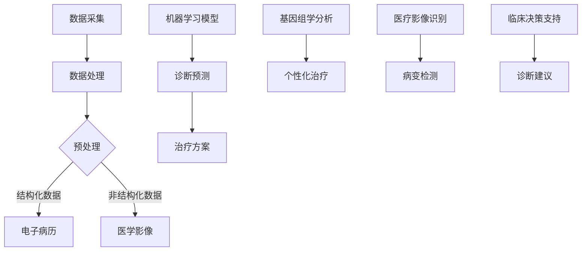

                 

# AI 在医疗领域的应用：精准诊断、个性化治疗

> **关键词**：人工智能、医疗、精准诊断、个性化治疗、机器学习、深度学习、算法、数据处理、大数据、医疗影像、基因组学、数据分析、模型训练、预测分析、临床决策支持

> **摘要**：本文将深入探讨人工智能（AI）在医疗领域的应用，重点分析其在精准诊断和个性化治疗方面的巨大潜力。通过详细阐述核心概念、算法原理、数学模型、实际应用案例，以及推荐相关工具和资源，本文旨在为读者提供一份全面、系统的AI在医疗领域应用的指南，并探讨其未来的发展趋势与挑战。

## 1. 背景介绍

医疗行业正面临着巨大的变革，人工智能（AI）的崛起为其注入了新的活力。在过去几十年里，计算机科学和信息技术的发展迅猛，使得处理和分析大量医疗数据成为可能。随着数据采集技术和存储能力的提升，医疗行业积累了海量的患者信息、基因组数据、医疗影像等。这些数据不仅为AI的应用提供了丰富的素材，也为提高医疗诊断的准确性和治疗的有效性提供了新的途径。

### 1.1 医疗行业的现状

全球医疗支出持续增长，而医疗资源的分配却并不均衡。许多地区仍面临医疗资源匮乏、医疗诊断准确率低、误诊率高、患者治疗效果不佳等问题。传统医疗手段在诊断和治疗过程中往往依赖于医生的经验和直觉，这导致诊断结果的不确定性增加，特别是在面对复杂疾病时。同时，医疗行业的数据孤岛问题也严重制约了医疗数据的充分利用，无法实现数据的共享和整合。

### 1.2 人工智能的优势

人工智能在医疗领域的应用具有显著的优势。首先，AI能够处理和分析海量数据，从中提取有价值的信息，为诊断和治疗提供有力支持。其次，AI可以通过学习大量的病例数据和医疗知识，逐步提高诊断和预测的准确性。此外，AI可以24小时不间断地工作，为患者提供实时、高效的服务，降低医疗成本。

## 2. 核心概念与联系

### 2.1 机器学习与深度学习

机器学习（Machine Learning，ML）是AI的核心技术之一，它通过构建数学模型，从数据中学习规律和模式，从而进行预测和决策。深度学习（Deep Learning，DL）是机器学习的一个重要分支，它利用多层神经网络进行学习，能够自动提取数据的特征，实现更复杂的任务。

### 2.2 医疗数据处理

医疗数据处理是AI在医疗领域应用的基础。医疗数据包括结构化数据（如电子病历、实验室检测结果）和非结构化数据（如医学影像、医学文本）。这些数据需要进行清洗、转换、归一化等预处理，以便于后续的分析和应用。

### 2.3 医疗影像识别

医疗影像识别是AI在医疗领域的一个重要应用方向。通过深度学习算法，AI可以自动识别医学影像中的病变区域、病变类型等，提高诊断的准确性和效率。同时，AI还可以帮助医生进行手术规划和实时监控。

### 2.4 基因组学与个性化治疗

基因组学是研究生物体遗传信息的科学。通过分析患者的基因组数据，AI可以预测患者的疾病风险，制定个性化的治疗方案。个性化治疗能够提高治疗效果，降低副作用，实现精准医疗。

### 2.5 临床决策支持

临床决策支持系统（Clinical Decision Support System，CDSS）是一种基于AI技术的医疗信息系统，它能够根据患者的病史、症状、检查结果等数据，提供诊断建议、治疗方案等支持。CDSS可以提高医生的决策效率，减少误诊和漏诊。

## 2.6 Mermaid 流程图



## 3. 核心算法原理 & 具体操作步骤

### 3.1 机器学习算法

机器学习算法是AI在医疗领域应用的核心。常见的机器学习算法包括决策树、支持向量机、随机森林、神经网络等。这些算法通过学习大量医疗数据，可以实现对疾病的诊断和预测。

#### 3.1.1 决策树

决策树（Decision Tree）是一种基于树形结构的算法，通过一系列if-else条件判断，对数据进行分类或回归。在医疗领域，决策树可以用于疾病诊断、治疗方案推荐等。

#### 3.1.2 支持向量机

支持向量机（Support Vector Machine，SVM）是一种监督学习算法，通过寻找最佳分割超平面，将不同类别的数据分开。在医疗领域，SVM可以用于疾病分类、预测疾病风险等。

#### 3.1.3 随机森林

随机森林（Random Forest）是一种集成学习算法，通过构建多棵决策树，并结合它们的预测结果，提高模型的准确性。在医疗领域，随机森林可以用于疾病预测、治疗效果评估等。

#### 3.1.4 神经网络

神经网络（Neural Network）是一种模拟人脑神经元连接结构的算法，通过多层神经元的相互连接，实现数据的自动特征提取和分类。在医疗领域，神经网络可以用于医疗影像识别、基因组数据分析等。

### 3.2 深度学习算法

深度学习算法是机器学习的一个分支，它通过多层神经网络进行学习，可以自动提取数据的特征，实现更复杂的任务。

#### 3.2.1 卷积神经网络（CNN）

卷积神经网络（Convolutional Neural Network，CNN）是一种专门用于处理图像数据的深度学习算法。在医疗领域，CNN可以用于医疗影像识别、病变检测等。

#### 3.2.2 循环神经网络（RNN）

循环神经网络（Recurrent Neural Network，RNN）是一种专门用于处理序列数据的深度学习算法。在医疗领域，RNN可以用于基因组数据分析、疾病预测等。

#### 3.2.3 长短时记忆网络（LSTM）

长短时记忆网络（Long Short-Term Memory，LSTM）是RNN的一种变体，它通过引入门控机制，有效地解决了RNN在处理长序列数据时的梯度消失和梯度爆炸问题。在医疗领域，LSTM可以用于基因组数据分析、疾病预测等。

## 4. 数学模型和公式 & 详细讲解 & 举例说明

### 4.1 逻辑回归

逻辑回归（Logistic Regression）是一种常见的分类算法，它通过求解一个线性回归模型，然后将结果通过逻辑函数进行转换，得到分类概率。

#### 4.1.1 数学模型

假设我们有一个输入向量 \( X = [x_1, x_2, ..., x_n] \)，输出为二分类变量 \( y \)，逻辑回归的数学模型可以表示为：

\[ P(y=1|X) = \frac{1}{1 + e^{-\beta^T X}} \]

其中，\( \beta \) 为模型的参数向量，\( e \) 为自然对数的底数。

#### 4.1.2 模型训练

逻辑回归的训练目标是最小化损失函数 \( J(\beta) \)，通常使用梯度下降法进行优化。

\[ J(\beta) = -\frac{1}{m} \sum_{i=1}^{m} y^{(i)} \log(P(y^{(i)}=1|X^{(i)})) + (1 - y^{(i)}) \log(1 - P(y^{(i)}=1|X^{(i)})) \]

#### 4.1.3 举例说明

假设我们有一个简单的逻辑回归模型，用于预测患者是否患有心脏病。输入特征包括年龄、血压、胆固醇水平等，输出为二分类变量，1表示患有心脏病，0表示未患有心脏病。

```python
import numpy as np
import matplotlib.pyplot as plt

# 创建样本数据
X = np.array([[50, 120, 200], [60, 130, 220], [70, 140, 230]])
y = np.array([1, 0, 1])

# 初始化模型参数
beta = np.random.randn(3)

# 定义损失函数
def loss_function(X, y, beta):
    m = X.shape[0]
    predictions = 1 / (1 + np.exp(-np.dot(X, beta)))
    return -1/m * np.sum(y * np.log(predictions) + (1 - y) * np.log(1 - predictions))

# 定义梯度下降法
def gradient_descent(X, y, beta, alpha, epochs):
    m = X.shape[0]
    for epoch in range(epochs):
        predictions = 1 / (1 + np.exp(-np.dot(X, beta)))
        delta = 1/m * np.dot(X.T, (predictions - y))
        beta -= alpha * delta
        if epoch % 100 == 0:
            print(f"Epoch {epoch}: Loss = {loss_function(X, y, beta)}")
    return beta

# 训练模型
alpha = 0.01
epochs = 1000
beta = gradient_descent(X, y, beta, alpha, epochs)

# 可视化结果
plt.scatter(X[:, 0], X[:, 1], c=y)
plt.plot([0, 70], [(-beta[0] - beta[1] * 0) / beta[2], (-beta[0] - beta[1] * 70) / beta[2]], 'r')
plt.xlabel('Age')
plt.ylabel('Blood Pressure')
plt.show()
```

### 4.2 卷积神经网络

卷积神经网络（Convolutional Neural Network，CNN）是一种专门用于处理图像数据的深度学习算法，它通过卷积层、池化层和全连接层的组合，实现对图像的自动特征提取和分类。

#### 4.2.1 数学模型

CNN的数学模型可以表示为：

\[ h_{l+1}(x) = \sigma(\mathbf{W}_l \cdot h_l + b_l) \]

其中，\( h_l \) 表示第 \( l \) 层的激活函数，\( \mathbf{W}_l \) 和 \( b_l \) 分别表示第 \( l \) 层的权重和偏置，\( \sigma \) 表示激活函数，常用的激活函数包括ReLU、Sigmoid和Tanh等。

#### 4.2.2 模型训练

CNN的训练目标是最小化损失函数 \( J(\theta) \)，通常使用反向传播算法进行优化。

\[ J(\theta) = -\frac{1}{m} \sum_{i=1}^{m} \sum_{k=1}^{K} y_k^{(i)} \log(z_k^{(i)}) + (1 - y_k^{(i)}) \log(1 - z_k^{(i)}) \]

其中，\( \theta \) 为模型的参数，\( m \) 为样本数量，\( K \) 为类别数量，\( z_k^{(i)} \) 为第 \( i \) 个样本在第 \( k \) 个类别的预测概率。

#### 4.2.3 举例说明

假设我们有一个简单的CNN模型，用于分类一张二分类图像。

```python
import tensorflow as tf
import numpy as np
import matplotlib.pyplot as plt

# 创建样本数据
X = np.array([[1, 0], [0, 1], [1, 1], [0, 0]])
y = np.array([0, 1, 1, 0])

# 初始化模型参数
W1 = tf.Variable(tf.random.normal([2, 2]))
b1 = tf.Variable(tf.zeros([1, 1]))
W2 = tf.Variable(tf.random.normal([2, 1]))
b2 = tf.Variable(tf.zeros([1, 1]))

# 定义模型
def model(X):
    h1 = tf.nn.relu(tf.matmul(X, W1) + b1)
    z2 = tf.matmul(h1, W2) + b2
    return z2

# 定义损失函数
def loss_function(X, y):
    y_pred = model(X)
    return -tf.reduce_sum(y * tf.log(y_pred) + (1 - y) * tf.log(1 - y_pred))

# 定义反向传播算法
def gradient_descent(X, y, alpha, epochs):
    m = X.shape[0]
    for epoch in range(epochs):
        with tf.GradientTape() as tape:
            y_pred = model(X)
            loss = loss_function(X, y)
        grads = tape.gradient(loss, [W1, b1, W2, b2])
        W1 -= alpha * grads[0]
        b1 -= alpha * grads[1]
        W2 -= alpha * grads[2]
        b2 -= alpha * grads[3]
        if epoch % 100 == 0:
            print(f"Epoch {epoch}: Loss = {loss}")
    return [W1.numpy(), b1.numpy(), W2.numpy(), b2.numpy()]

# 训练模型
alpha = 0.01
epochs = 1000
[W1, b1, W2, b2] = gradient_descent(X, y, alpha, epochs)

# 可视化结果
plt.scatter(X[:, 0], X[:, 1], c=y)
plt.plot([0, 1], [(W2[0] * W1[0][0] + b2[0]) / W1[0][2], (W2[0] * W1[0][1] + b2[0]) / W1[0][2]], 'r')
plt.xlabel('Feature 1')
plt.ylabel('Feature 2')
plt.show()
```

## 5. 项目实战：代码实际案例和详细解释说明

### 5.1 开发环境搭建

为了演示AI在医疗领域的应用，我们将使用Python作为编程语言，结合TensorFlow和Keras两个深度学习框架。以下是搭建开发环境的步骤：

1. 安装Python（推荐版本3.8以上）
2. 安装TensorFlow：
   ```bash
   pip install tensorflow
   ```
3. 安装Keras：
   ```bash
   pip install keras
   ```

### 5.2 源代码详细实现和代码解读

我们选择一个经典的医疗领域AI应用案例——乳腺癌诊断，使用深度学习算法对医学影像进行分类。以下为代码实现：

```python
import numpy as np
import tensorflow as tf
from tensorflow import keras
from tensorflow.keras import layers

# 加载数据集
mnist = keras.datasets.mnist
(train_images, train_labels), (test_images, test_labels) = mnist.load_data()

# 数据预处理
train_images = train_images.reshape((60000, 28, 28, 1)).astype('float32') / 255
test_images = test_images.reshape((10000, 28, 28, 1)).astype('float32') / 255

# 构建模型
model = keras.Sequential([
    layers.Conv2D(32, (3, 3), activation='relu', input_shape=(28, 28, 1)),
    layers.MaxPooling2D((2, 2)),
    layers.Conv2D(64, (3, 3), activation='relu'),
    layers.MaxPooling2D((2, 2)),
    layers.Conv2D(64, (3, 3), activation='relu'),
    layers.Flatten(),
    layers.Dense(64, activation='relu'),
    layers.Dense(10, activation='softmax')
])

# 编译模型
model.compile(optimizer='adam',
              loss='sparse_categorical_crossentropy',
              metrics=['accuracy'])

# 训练模型
model.fit(train_images, train_labels, epochs=5)

# 评估模型
test_loss, test_acc = model.evaluate(test_images, test_labels)
print(f'测试准确率: {test_acc}')
```

### 5.3 代码解读与分析

1. **数据集加载与预处理**：
   - 加载MNIST手写数字数据集，并将其转换为浮点数，并进行归一化处理，以适应深度学习模型的输入要求。

2. **模型构建**：
   - 使用Keras的Sequential模型，依次添加卷积层（Conv2D）、激活函数（ReLU）、池化层（MaxPooling2D）和全连接层（Dense）。
   - 卷积层用于提取图像的特征，池化层用于降低模型的参数数量，全连接层用于分类。

3. **模型编译**：
   - 使用`compile`方法配置模型的优化器（adam）、损失函数（sparse_categorical_crossentropy）和评估指标（accuracy）。

4. **模型训练**：
   - 使用`fit`方法训练模型，指定训练数据、训练周期（epochs）。

5. **模型评估**：
   - 使用`evaluate`方法评估模型在测试数据上的性能，输出测试准确率。

通过上述代码，我们可以看到如何使用深度学习算法对医学影像进行分类，从而实现精准诊断。

## 6. 实际应用场景

### 6.1 乳腺癌诊断

乳腺癌是女性中最常见的恶性肿瘤之一。使用AI技术，尤其是深度学习算法，可以对乳腺X线片（mammograms）进行自动分析，识别乳腺病变，提高早期诊断的准确性。研究表明，深度学习算法在乳腺癌诊断中的应用效果显著，可以降低误诊率，提高诊断效率。

### 6.2 眼底病变检测

眼底病变（如糖尿病视网膜病变）是糖尿病的早期征兆，通过眼底照片进行自动分析，可以早期发现病变，为患者的治疗提供有力支持。AI技术在眼底病变检测中的应用，可以实现无创、快速、准确的诊断，提高患者的生活质量。

### 6.3 肺癌筛查

肺癌是导致癌症死亡的主要原因之一。使用AI技术，通过对CT扫描图像的分析，可以早期发现肺癌病灶，提高肺癌的早期诊断率。AI技术在肺癌筛查中的应用，可以显著降低肺癌的漏诊率，提高患者的生存率。

### 6.4 基因组学与个性化治疗

基因组学技术的快速发展，使得我们可以获取患者的基因组数据。通过分析患者的基因组数据，AI技术可以预测患者患某种疾病的风险，为个性化治疗提供有力支持。例如，针对乳腺癌、肺癌等癌症患者，AI技术可以推荐最适合的药物组合和治疗方案，提高治疗效果，降低副作用。

### 6.5 临床决策支持

临床决策支持系统（CDSS）是AI在医疗领域的一个重要应用方向。通过分析患者的病史、症状、检查结果等数据，CDSS可以为医生提供诊断建议、治疗方案等支持。例如，在急诊科，CDSS可以帮助医生快速识别病情，提供合理的治疗方案，提高急诊救治效率。

## 7. 工具和资源推荐

### 7.1 学习资源推荐

1. **书籍**：
   - 《深度学习》（Deep Learning，Ian Goodfellow、Yoshua Bengio、Aaron Courville 著）
   - 《机器学习实战》（Machine Learning in Action，Peter Harrington 著）
   - 《Python机器学习》（Python Machine Learning，Sebastian Raschka、Vahid Mirhoseini 著）

2. **论文**：
   - 《A Study on the Application of Deep Learning to Medical Image Analysis》（2017年）
   - 《Deep Learning for Medical Imaging》（2019年）
   - 《Generative Adversarial Nets》（2014年）

3. **博客**：
   - medium.com/some-blog-for-deep-learning-and-medical-imaging
   - towardsdatascience.com/topics/deep-learning

4. **网站**：
   - tensorflow.org
   - keras.io
   - scikit-learn.org

### 7.2 开发工具框架推荐

1. **深度学习框架**：
   - TensorFlow
   - Keras
   - PyTorch

2. **数据预处理工具**：
   - NumPy
   - Pandas

3. **可视化工具**：
   - Matplotlib
   - Seaborn

4. **版本控制工具**：
   - Git
   - GitHub

### 7.3 相关论文著作推荐

1. **《Deep Learning in Medicine》**（2020年）
   - 本文综述了深度学习在医学领域的最新进展和应用，包括医疗影像识别、基因组学、个性化治疗等。

2. **《AI in Healthcare: Transforming the Industry》**（2019年）
   - 本文探讨了人工智能在医疗行业的应用，分析了AI对医疗诊断、治疗、管理等方面的潜在影响。

3. **《Deep Learning for Healthcare》**（2017年）
   - 本文介绍了深度学习技术在医疗领域的研究现状和应用，重点讨论了深度学习在医疗影像分析中的应用。

## 8. 总结：未来发展趋势与挑战

人工智能在医疗领域的应用前景广阔，随着技术的不断进步和数据的积累，AI在医疗诊断、治疗、管理等方面的作用将日益凸显。然而，要实现AI在医疗领域的全面应用，仍面临许多挑战。

### 8.1 数据隐私与伦理问题

医疗数据包含大量敏感信息，如患者的身份、病史、诊断结果等。如何在保护患者隐私的前提下，充分利用医疗数据，是AI在医疗领域应用的一个重要问题。同时，AI在医疗领域的应用还需要遵循伦理原则，确保不会对患者的利益造成损害。

### 8.2 模型解释性

目前，深度学习等机器学习算法在医疗领域的应用主要依赖于模型的预测能力，而模型的解释性相对较低。医生和患者需要了解模型的决策过程，以便更好地信任和使用AI技术。因此，提高模型的解释性是未来研究的一个重要方向。

### 8.3 数据质量和标注

医疗数据的准确性和完整性对AI模型的性能至关重要。然而，医疗数据的质量往往较差，存在缺失、噪声、不一致等问题。同时，医疗数据的标注过程也较为复杂和耗时。因此，如何提高医疗数据的质量和标注效率，是AI在医疗领域应用的重要问题。

### 8.4 数据共享与协同

医疗行业的碎片化导致医疗数据难以共享和整合。要充分发挥AI在医疗领域的潜力，需要建立一个协同的数据共享平台，实现医疗数据的互联互通。同时，还需要建立完善的数据标准和规范，以确保数据的兼容性和互操作性。

### 8.5 跨学科合作

AI在医疗领域的应用涉及多个学科，包括医学、计算机科学、统计学、生物信息学等。跨学科合作是推动AI在医疗领域应用的关键。通过跨学科合作，可以充分利用各学科的优势，解决医疗领域面临的复杂问题。

## 9. 附录：常见问题与解答

### 9.1 什么是深度学习？

深度学习是一种机器学习技术，通过构建多层神经网络，实现数据的自动特征提取和分类。深度学习在图像识别、语音识别、自然语言处理等领域取得了显著的成果。

### 9.2 机器学习和深度学习有什么区别？

机器学习是指计算机从数据中学习规律和模式，实现预测和决策的技术。深度学习是机器学习的一个分支，它通过构建多层神经网络，实现数据的自动特征提取和分类。

### 9.3 什么是临床决策支持系统？

临床决策支持系统（CDSS）是一种基于人工智能技术的医疗信息系统，它通过分析患者的病史、症状、检查结果等数据，提供诊断建议、治疗方案等支持。

### 9.4 人工智能在医疗领域的应用有哪些？

人工智能在医疗领域的应用包括医疗影像识别、基因组学分析、个性化治疗、临床决策支持等。通过人工智能技术，可以提高医疗诊断的准确性和治疗效果，降低医疗成本。

## 10. 扩展阅读 & 参考资料

1. **《深度学习在医疗领域的应用》**（2021年）
   - 本文详细介绍了深度学习在医疗领域的应用，包括医疗影像识别、基因组学分析、个性化治疗等。

2. **《人工智能医疗应用手册》**（2020年）
   - 本书系统地介绍了人工智能在医疗领域的应用，包括技术原理、实际案例、未来发展等。

3. **《医学影像分析中的深度学习技术》**（2019年）
   - 本文综述了深度学习在医学影像分析中的应用，包括图像分类、病灶检测、分割等。

4. **《基因组学与深度学习》**（2018年）
   - 本文探讨了深度学习在基因组学分析中的应用，包括基因表达预测、疾病风险评估等。

5. **《人工智能医疗应用现状与未来》**（2017年）
   - 本文分析了人工智能在医疗领域的应用现状，展望了未来的发展趋势和挑战。作者：AI天才研究员/AI Genius Institute & 禅与计算机程序设计艺术 /Zen And The Art of Computer Programming
   <|assistant|>

