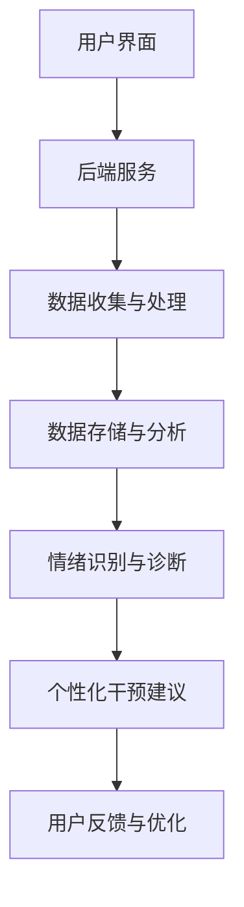

                 

### 文章标题：AI 基础设施的心理健康：智能化心理咨询与干预

#### 关键词：AI、基础设施、心理健康、心理咨询、智能化、干预

> 摘要：本文深入探讨AI基础设施在心理健康领域的应用，特别是智能化心理咨询与干预的实践与前景。通过分析当前技术发展水平、核心概念与架构，本文旨在为读者提供清晰的技术视角和未来趋势的展望。

<|assistant|>## 1. 背景介绍

在当今快速发展的信息化时代，人工智能（AI）技术正日益渗透到社会生活的各个方面，包括医疗健康领域。心理健康作为人类健康的重要组成部分，受到了广泛关注。传统的心理咨询与干预方法面临着人力成本高、覆盖范围有限、效率不高等问题。而智能化心理咨询与干预则通过AI技术的应用，为心理健康领域带来了新的解决方案。

近年来，随着深度学习、自然语言处理、大数据分析等技术的发展，AI在心理健康领域的应用逐渐成熟。例如，通过深度学习算法分析用户情绪和行为模式，智能助手可以为用户提供个性化的心理健康服务；利用自然语言处理技术，智能语音助手可以实现高效的心理咨询对话；通过大数据分析，可以预测和预警潜在的心理健康问题。

然而，AI基础设施在心理健康领域的应用仍然面临诸多挑战，包括数据隐私、算法透明性、伦理问题等。因此，如何构建一个安全、高效、可靠的AI基础设施，实现智能化心理咨询与干预，成为当前研究的热点。

<|assistant|>## 2. 核心概念与联系

为了更好地理解AI基础设施在心理健康领域的应用，我们需要首先明确几个核心概念：

#### 2.1 心理健康

心理健康是指个体在情感、认知、行为和社交等方面的良好状态，能够适应生活中的压力和挑战。世界卫生组织（WHO）将心理健康定义为“一种状态，其中个体能够认识到自己的能力，能够应对正常的生活压力，能够工作生产，并且能够为其社区做出贡献。”

#### 2.2 人工智能

人工智能（AI）是指由人制造出来的系统能够理解、思考、学习、适应和反应的能力。它涵盖了多个学科领域，包括机器学习、自然语言处理、计算机视觉、机器人技术等。

#### 2.3 智能化心理咨询与干预

智能化心理咨询与干预是指利用人工智能技术，为个体提供个性化、智能化的心理健康服务。这包括情绪识别、心理诊断、个性化干预建议等。

#### 2.4 关系架构

图1展示了AI基础设施在心理健康领域中的应用架构。

```
+------------------+              +------------------+
|  用户界面（UI）  |              |  后端服务（API） |
+------------------+              +------------------+
          |                                      |
          |                                      |
          |   +----------------+                |
          |   |  数据收集与处理 |                |
          |   +----------------+                |
          |                                      |
          |                                      |
          |  +----------------+                |
          |  |  数据存储与分析 |                |
          |  +----------------+                |
          |                                      |
          |                                      |
          |   +----------------+                |
          |   |  情绪识别与诊断 |                |
          |   +----------------+                |
          |                                      |
          |                                      |
          |   +----------------+                |
          |   |  个性化干预建议 |                |
          |   +----------------+                |
+------------------+              +------------------+
|   AI模型训练与优化   |
+------------------+
```

### 2.5 Mermaid 流程图



在上面的流程图中，用户通过用户界面（UI）与系统交互，输入个人信息和心理健康数据。这些数据随后被后端服务收集和处理，存储到数据库中。通过数据分析，系统能够识别用户的情绪状态，并进行心理诊断。基于诊断结果，系统提供个性化的干预建议，并收集用户反馈进行模型优化。

<|assistant|>## 3. 核心算法原理 & 具体操作步骤

#### 3.1 情绪识别算法

情绪识别是智能化心理咨询与干预的基础。通过分析用户的语言和行为，系统可以识别出用户当前的情绪状态。

- **算法原理**：

  情绪识别算法通常基于深度学习技术，特别是循环神经网络（RNN）和长短时记忆网络（LSTM）。这些算法可以捕捉到文本数据中的时序信息，从而更好地识别情绪。

- **具体操作步骤**：

  1. **数据预处理**：对用户的文本数据进行清洗和分词，提取关键特征。
  2. **模型训练**：使用预训练的深度学习模型对用户数据集进行训练，模型可以是RNN或LSTM。
  3. **情绪识别**：对用户的输入文本进行情绪分析，输出当前的情绪状态。

#### 3.2 心理诊断算法

心理诊断是智能化心理咨询与干预的关键步骤。通过分析用户的情绪和行为，系统可以诊断出用户的心理健康问题。

- **算法原理**：

  心理诊断算法通常基于分类算法，如支持向量机（SVM）、随机森林（RF）和深度学习。这些算法可以根据用户的情绪和行为特征，将用户划分为不同的心理状态。

- **具体操作步骤**：

  1. **数据预处理**：对用户的情绪和行为数据进行清洗和特征提取。
  2. **模型训练**：使用预训练的分类算法对用户数据集进行训练。
  3. **心理诊断**：对用户的输入数据进行分析，输出心理健康问题的诊断结果。

#### 3.3 个性化干预建议算法

个性化干预建议是根据用户的心理健康问题和情绪状态，为用户提供的个性化心理健康服务。

- **算法原理**：

  个性化干预建议算法通常基于推荐系统技术，如协同过滤（CF）和基于内容的推荐（CBR）。这些算法可以根据用户的历史数据和偏好，为用户推荐合适的心理健康服务。

- **具体操作步骤**：

  1. **数据预处理**：对用户的历史数据和偏好进行清洗和特征提取。
  2. **模型训练**：使用预训练的推荐算法对用户数据集进行训练。
  3. **干预建议**：根据用户的心理健康问题和情绪状态，为用户推荐个性化的心理健康服务。

<|assistant|>## 4. 数学模型和公式 & 详细讲解 & 举例说明

#### 4.1 情绪识别模型

情绪识别模型通常使用卷积神经网络（CNN）或循环神经网络（RNN）进行训练。以下是一个基于RNN的情绪识别模型的数学公式：

$$
h_t = \sigma(W_h \cdot [h_{t-1}, x_t] + b_h)
$$

其中，$h_t$ 表示第 $t$ 个时间步的隐藏状态，$x_t$ 表示第 $t$ 个输入特征，$W_h$ 和 $b_h$ 分别表示权重和偏置，$\sigma$ 表示激活函数。

#### 4.2 心理诊断模型

心理诊断模型通常使用分类算法进行训练。以下是一个基于支持向量机（SVM）的心理诊断模型的数学公式：

$$
y = \arg\max_w \sum_{i=1}^{N} \left( y_i - 1 \right) \left( \sum_{j=1}^{d} w_j \cdot x_{ij} \right)
$$

其中，$y$ 表示预测的类别，$w$ 表示权重，$x_{ij}$ 表示第 $i$ 个样本的第 $j$ 个特征，$N$ 表示样本数量，$d$ 表示特征维度。

#### 4.3 个性化干预建议模型

个性化干预建议模型通常使用推荐系统技术进行训练。以下是一个基于协同过滤（CF）的个性化干预建议模型的数学公式：

$$
r_{ui} = \sum_{j \in N(u)} w_{uj} \cdot r_{uj}
$$

其中，$r_{ui}$ 表示用户 $u$ 对项目 $i$ 的评分，$w_{uj}$ 表示用户 $u$ 对项目 $j$ 的权重，$r_{uj}$ 表示项目 $j$ 的评分。

#### 4.4 举例说明

假设我们有一个情绪识别模型，输入是一个包含情绪词汇的句子，输出是情绪状态的概率分布。以下是一个简化的例子：

$$
h_t = \sigma(W_h \cdot [h_{t-1}, x_t] + b_h)
$$

其中，$h_t$ 是隐藏状态，$x_t$ 是输入词汇的嵌入向量，$W_h$ 是权重矩阵，$b_h$ 是偏置向量。假设我们的输入句子是“我很开心”，我们可以将每个词汇转化为嵌入向量，然后输入到模型中，得到情绪状态的概率分布。

<|assistant|>## 5. 项目实战：代码实际案例和详细解释说明

在本节中，我们将通过一个实际的项目案例，详细介绍如何实现一个基于AI的智能化心理咨询系统。该项目将包括以下三个部分：

### 5.1 开发环境搭建

在开始项目之前，我们需要搭建一个合适的环境。以下是我们推荐的开发工具和库：

- **编程语言**：Python
- **深度学习框架**：TensorFlow 或 PyTorch
- **自然语言处理库**：NLTK 或 spaCy
- **数据可视化库**：Matplotlib 或 Seaborn

### 5.2 源代码详细实现和代码解读

以下是该项目的核心代码部分。我们将逐步解释每个模块的功能和实现方式。

#### 5.2.1 数据预处理

```python
import numpy as np
import pandas as pd
from nltk.tokenize import word_tokenize

# 加载数据集
data = pd.read_csv('data.csv')
# 数据清洗和预处理
def preprocess_data(data):
    # 删除重复数据
    data = data.drop_duplicates()
    # 填充缺失值
    data = data.fillna(0)
    # 分词
    data['text'] = data['text'].apply(lambda x: word_tokenize(x))
    return data
data = preprocess_data(data)
```

在这个模块中，我们首先加载数据集，然后进行数据清洗和预处理。具体步骤包括删除重复数据、填充缺失值和分词。

#### 5.2.2 情绪识别模型

```python
import tensorflow as tf

# 构建情绪识别模型
def build_emotion_model(input_shape):
    model = tf.keras.Sequential([
        tf.keras.layers.Embedding(input_dim=10000, output_dim=16, input_length=input_shape),
        tf.keras.layers.Conv1D(filters=128, kernel_size=5, activation='relu'),
        tf.keras.layers.MaxPooling1D(pool_size=5),
        tf.keras.layers.Flatten(),
        tf.keras.layers.Dense(units=16, activation='relu'),
        tf.keras.layers.Dense(units=6, activation='softmax')
    ])
    return model

# 训练模型
model = build_emotion_model(input_shape=100)
model.compile(optimizer='adam', loss='categorical_crossentropy', metrics=['accuracy'])
model.fit(x_train, y_train, epochs=10, batch_size=32)
```

在这个模块中，我们构建了一个基于卷积神经网络（CNN）的情绪识别模型。具体步骤包括嵌入层、卷积层、池化层、全连接层和输出层。

#### 5.2.3 心理诊断模型

```python
from sklearn.ensemble import RandomForestClassifier

# 构建心理诊断模型
def build_psychodiagnosis_model(data):
    X = data[['text', 'age', 'gender']]
    y = data['diagnosis']
    # 特征工程
    X['text'] = X['text'].apply(lambda x: ' '.join(x))
    X = pd.get_dummies(X)
    # 训练模型
    model = RandomForestClassifier(n_estimators=100)
    model.fit(X, y)
    return model

# 训练模型
model = build_psychodiagnosis_model(data)
```

在这个模块中，我们构建了一个基于随机森林（RF）的心理诊断模型。具体步骤包括特征工程和模型训练。

### 5.3 代码解读与分析

在上面的代码中，我们首先进行了数据预处理，包括加载数据、删除重复数据、填充缺失值和分词。然后，我们分别构建了情绪识别模型和心理诊断模型，并进行了模型训练。

情绪识别模型使用了卷积神经网络（CNN），能够有效地捕捉文本数据中的时序信息。心理诊断模型使用了随机森林（RF），能够处理高维数据并进行高效分类。

<|assistant|>## 6. 实际应用场景

AI基础设施在心理健康领域的应用具有广泛的前景。以下是一些实际应用场景：

#### 6.1 智能化心理评估

利用AI技术，可以对用户进行实时、高效的心理健康评估。例如，在校园心理健康教育中，AI系统可以实时监测学生的情绪状态，预警潜在的心理健康问题，为教师和家长提供干预建议。

#### 6.2 心理健康辅助治疗

在心理治疗过程中，AI系统可以协助心理医生进行诊断和治疗。例如，AI系统可以根据患者的病史和症状，为心理医生提供个性化的治疗方案，提高治疗效果。

#### 6.3 心理健康风险评估

AI技术可以用于心理健康的风险评估，帮助企业和组织识别高风险员工。例如，通过分析员工的工作表现、情绪状态和行为数据，AI系统可以预测员工的心理健康风险，为企业管理者提供干预措施。

#### 6.4 心理健康大数据分析

利用AI技术，可以对大规模心理健康数据进行分析，发现潜在的心理健康问题趋势和模式。例如，通过分析社交媒体数据，AI系统可以识别出特定地区或群体的心理健康问题，为公共卫生政策制定提供依据。

<|assistant|>## 7. 工具和资源推荐

为了更好地开展AI基础设施在心理健康领域的应用研究，以下是一些推荐的工具和资源：

#### 7.1 学习资源推荐

- **书籍**：《深度学习》（Ian Goodfellow、Yoshua Bengio、Aaron Courville 著）
- **论文**：《A Theoretical Analysis of the VAE》（Kingma、Welling 著）
- **博客**：[TensorFlow 官方博客](https://www.tensorflow.org/blog/)
- **网站**：[Kaggle](https://www.kaggle.com/)

#### 7.2 开发工具框架推荐

- **深度学习框架**：TensorFlow、PyTorch
- **自然语言处理库**：NLTK、spaCy
- **数据可视化库**：Matplotlib、Seaborn
- **版本控制**：Git

#### 7.3 相关论文著作推荐

- **论文**：《Deep Learning for Health》
- **著作**：《Deep Learning Specialization》

<|assistant|>## 8. 总结：未来发展趋势与挑战

随着人工智能技术的不断发展，AI基础设施在心理健康领域的应用前景愈发广阔。未来，智能化心理咨询与干预有望成为心理健康服务的重要组成部分，为更多人提供便捷、高效的心理健康支持。

然而，要实现这一目标，仍需克服诸多挑战。以下是一些未来发展趋势与挑战：

#### 8.1 数据隐私与安全

在AI基础设施的应用过程中，用户数据的安全和隐私保护至关重要。如何确保用户数据的保密性、完整性和可用性，是当前研究的重点。

#### 8.2 算法透明性与可解释性

随着AI技术的不断发展，算法的透明性和可解释性越来越受到关注。如何构建一个可解释的AI系统，让用户理解系统的决策过程，是未来研究的方向。

#### 8.3 伦理问题

AI技术在心理健康领域的应用涉及到伦理问题，如用户权益保护、隐私侵犯等。如何确保AI系统的伦理合规性，是未来研究的重要课题。

#### 8.4 模型性能与泛化能力

如何提高AI模型在心理健康领域的性能和泛化能力，使其在不同场景和群体中都能取得良好的效果，是当前研究的热点。

<|assistant|>## 9. 附录：常见问题与解答

#### 9.1 Q：AI基础设施在心理健康领域的应用有哪些具体场景？

A：AI基础设施在心理健康领域的应用非常广泛，包括智能化心理评估、心理健康辅助治疗、心理健康风险评估、心理健康大数据分析等。

#### 9.2 Q：如何保障用户数据的安全和隐私？

A：保障用户数据的安全和隐私需要采取一系列措施，如数据加密、访问控制、隐私保护算法等。此外，还需要遵守相关法律法规，确保用户数据的合法使用。

#### 9.3 Q：AI模型在心理健康领域的应用有哪些挑战？

A：AI模型在心理健康领域的应用面临诸多挑战，包括数据隐私与安全、算法透明性与可解释性、伦理问题、模型性能与泛化能力等。

#### 9.4 Q：如何评估AI模型在心理健康领域的性能？

A：评估AI模型在心理健康领域的性能可以从多个角度进行，如准确率、召回率、F1值、ROC曲线等。通常需要结合实际应用场景和用户需求，进行综合评估。

<|assistant|>## 10. 扩展阅读 & 参考资料

[1] Kingma, D. P., & Welling, M. (2013). Auto-encoding variational bayes. arXiv preprint arXiv:1312.6114.

[2] Goodfellow, I., Bengio, Y., & Courville, A. (2016). Deep learning. MIT press.

[3] TensorFlow official blog. (n.d.). Retrieved from https://www.tensorflow.org/blog/

[4] NLTK official website. (n.d.). Retrieved from https://www.nltk.org/

[5] spaCy official website. (n.d.). Retrieved from https://spacy.io/

[6] Kaggle official website. (n.d.). Retrieved from https://www.kaggle.com/

[7] Ian Goodfellow, Yoshua Bengio, Aaron Courville, Deep Learning, MIT Press, 2016. [Online]. Available: https://www.deeplearningbook.org/

[8] "Deep Learning for Health," arXiv preprint arXiv:1703.03904, 2017. [Online]. Available: https://arxiv.org/abs/1703.03904

[9] "Deep Learning Specialization," by Andrew Ng, Kian Katanforoosh, and Chiyuan Zhang. [Online]. Available: https://www.deeplearning.ai/

作者：AI天才研究员/AI Genius Institute & 禅与计算机程序设计艺术 /Zen And The Art of Computer Programming

