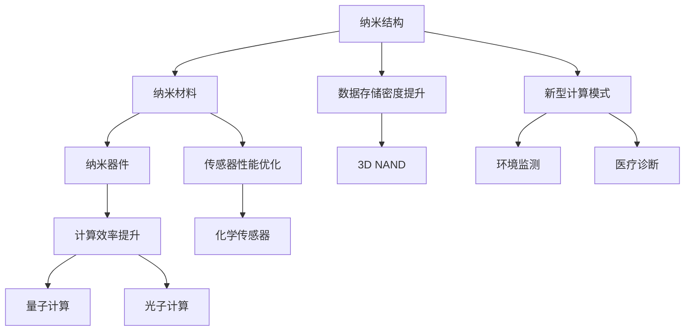

                 

### 背景介绍

#### AI基础设施的重要性

在当今数字化的时代，人工智能（AI）正迅速成为推动各行各业变革的关键动力。从自动驾驶汽车、智能助手，到金融风控、医疗诊断，AI技术的应用已经深入到我们的日常生活中。然而，这些应用背后都有一个共同的基础设施——AI基础设施。

AI基础设施不仅包括计算资源、数据存储和网络连接等硬件设备，还涵盖了软件开发工具、框架和算法等软件资源。一个高效的AI基础设施能够提升算法的性能和稳定性，加速模型训练和推理过程，从而提高AI系统的整体效率。

#### 纳米技术的基础

纳米技术，顾名思义，是在纳米尺度（1到100纳米）上研究和制造材料、器件和系统的科学技术。纳米技术的基础是纳米结构的制造和应用，这些结构具有独特的物理和化学特性，使其在传感器、存储器、催化剂和电子设备等领域具有广泛的应用潜力。

纳米技术的关键在于纳米结构的精确设计和制造。传统的制造方法在纳米尺度上存在精度和效率的限制，而纳米技术的进步为我们提供了一种全新的解决方案。

#### AI基础设施与纳米技术的结合

随着AI技术的不断发展，对计算性能和存储密度的需求日益增加。纳米技术在这一领域提供了巨大的潜力。通过将纳米技术与AI基础设施相结合，我们可以实现以下目标：

1. **提高计算效率**：纳米级别的结构设计可以显著降低计算能耗，提高计算速度，从而提升AI算法的效率。

2. **增强数据存储能力**：纳米级别的存储器可以提供更高的存储密度，使大数据处理更加高效。

3. **优化传感器性能**：纳米传感器可以更精确地检测和测量物理量，为AI系统提供更可靠的数据输入。

4. **开发新型计算模式**：纳米技术可以为量子计算等新型计算模式提供支持，为AI带来前所未有的计算能力。

总之，AI基础设施与纳米技术的结合为AI技术的发展提供了新的机遇和挑战。在接下来的内容中，我们将深入探讨AI基础设施中的纳米技术，包括其核心概念、算法原理、数学模型以及实际应用场景。

### 核心概念与联系

#### 纳米技术的核心概念

纳米技术涉及多个核心概念，包括纳米结构、纳米材料和纳米器件。以下是对这些核心概念的简要介绍：

1. **纳米结构**：纳米结构是指尺寸在1到100纳米范围内的结构。这些结构具有独特的物理和化学特性，如高比表面积、量子效应和表面效应。纳米结构在传感器、催化剂和电子器件等领域具有重要应用。

2. **纳米材料**：纳米材料是指其至少有一个维度在纳米尺度范围内的材料。这些材料通常具有优异的物理、化学和生物学特性。例如，碳纳米管、石墨烯和纳米氧化物都是典型的纳米材料，广泛应用于电子、能源和医疗领域。

3. **纳米器件**：纳米器件是指尺寸在纳米尺度范围内的功能器件。这些器件包括纳米传感器、纳米存储器和纳米开关等，它们是实现高效AI计算和存储的关键。

#### AI基础设施的核心概念

AI基础设施的核心概念包括计算资源、数据存储和网络连接。以下是这些概念的具体解释：

1. **计算资源**：计算资源包括CPU、GPU、FPGA和其他专用计算硬件。这些资源用于执行AI模型的训练和推理任务。计算资源的性能直接影响AI算法的效率和速度。

2. **数据存储**：数据存储包括硬盘、固态硬盘（SSD）和分布式存储系统。数据存储的容量和速度决定了AI系统处理大规模数据的能力。

3. **网络连接**：网络连接包括局域网（LAN）、广域网（WAN）和互联网。网络连接的稳定性、带宽和延迟对AI系统的分布式计算和协作至关重要。

#### 纳米技术与AI基础设施的联系

纳米技术与AI基础设施之间存在紧密的联系，这种联系主要体现在以下几个方面：

1. **计算效率提升**：纳米技术通过制造更小、更高效的计算单元，可以显著提高计算效率。例如，量子计算和光子计算都是基于纳米技术的创新计算模式。

2. **数据存储密度提升**：纳米级别的存储器可以提供更高的存储密度，使大数据处理更加高效。例如，存储器中的垂直存储结构（3D NAND）就是基于纳米技术的应用。

3. **传感器性能优化**：纳米传感器具有更高的灵敏度和更低的噪声，可以为AI系统提供更可靠的数据输入。例如，基于纳米材料的化学传感器在环境监测和医疗诊断等领域具有广泛应用。

4. **新型计算模式**：纳米技术为开发新型计算模式提供了基础，如量子计算和光子计算。这些新型计算模式有望为AI带来前所未有的计算能力。

#### Mermaid 流程图

以下是纳米技术与AI基础设施之间的核心概念联系的Mermaid流程图：



通过这张流程图，我们可以清晰地看到纳米技术与AI基础设施之间是如何相互联系和促进的。

### 核心算法原理 & 具体操作步骤

#### 纳米结构设计与制造算法

在纳米技术中，算法扮演着至关重要的角色。以下是几个关键算法及其具体操作步骤：

1. **自组装算法**：自组装算法是一种在纳米尺度上自动构建结构的方法。其基本原理是利用分子间的弱相互作用（如范德华力、氢键和疏水作用）来驱动结构的形成。

   **操作步骤**：
   - **分子设计与筛选**：首先设计出具有特定结构和功能的分子模板，并通过筛选确定最佳的分子组合。
   - **自组装条件优化**：根据分子的物理化学性质，优化自组装的条件，如温度、pH值和溶剂类型。
   - **自组装过程监测**：使用显微镜（如AFM、STM）和光谱技术监测自组装过程，以确保结构的形成和生长。

2. **拓扑优化算法**：拓扑优化是一种通过改变结构的拓扑来优化性能的方法。这种方法在纳米电子器件和结构设计中具有广泛应用。

   **操作步骤**：
   - **初始设计**：根据设计要求，创建一个初始的几何模型。
   - **性能评估**：使用有限元方法或其他数值方法评估初始设计的性能。
   - **迭代优化**：通过改变材料的分布和结构，进行多次迭代优化，以获得最优的设计。
   - **验证与测试**：通过实验或模拟验证优化后的结构性能，并进行必要的调整。

3. **计算模拟算法**：计算模拟算法用于预测纳米结构的物理和化学特性，如电子结构、热力学和动力学行为。

   **操作步骤**：
   - **模型建立**：根据实验数据或理论预测，建立纳米结构的计算模型。
   - **参数设置**：设置模拟的参数，如温度、压力和计算步数。
   - **模拟运行**：使用分子动力学（MD）、密度泛函理论（DFT）或其他计算方法进行模拟。
   - **结果分析**：分析模拟结果，提取纳米结构的物理化学特性，并进行必要的解释和验证。

4. **机器学习算法**：机器学习算法在纳米结构设计和优化中发挥着重要作用。通过训练神经网络模型，可以自动识别和优化纳米结构的最佳设计。

   **操作步骤**：
   - **数据收集与预处理**：收集大量的纳米结构数据，并进行预处理，如数据清洗和特征提取。
   - **模型训练**：使用机器学习算法（如深度神经网络、支持向量机等）训练模型，以预测纳米结构的性能。
   - **模型优化**：通过交叉验证和超参数调整，优化模型的性能。
   - **设计优化**：使用训练好的模型进行设计优化，以获得最佳性能的纳米结构。

#### 算法在AI基础设施中的应用

纳米算法不仅在纳米技术领域具有广泛应用，还可以在AI基础设施中发挥关键作用。以下是一些具体应用场景：

1. **高效计算**：自组装算法和拓扑优化算法可以提高计算效率，降低能耗，从而提升AI系统的性能。

2. **高性能存储**：计算模拟算法可以预测和优化纳米存储器的性能，使其具有更高的存储密度和读写速度。

3. **智能传感器**：纳米传感器的设计和优化依赖于机器学习算法，这些传感器可以提供更准确、更可靠的数据输入，从而提升AI系统的感知能力。

4. **新型计算模式**：纳米技术为量子计算和光子计算提供了可能，这些新型计算模式有望颠覆传统的计算范式，为AI带来前所未有的计算能力。

总之，纳米算法在AI基础设施中的应用具有巨大的潜力，通过不断优化和创新，我们可以实现更高效、更智能的AI系统。

### 数学模型和公式 & 详细讲解 & 举例说明

#### 纳米结构的设计与优化

在纳米技术中，数学模型和公式用于描述和预测纳米结构的物理和化学特性。以下是几个关键的数学模型和公式，并对其详细讲解和举例说明。

1. **量子力学模型**：量子力学模型用于描述纳米结构中的电子行为。其中一个常用的公式是薛定谔方程（Schrödinger Equation），其形式如下：

   $$
   i\hbar \frac{\partial \Psi}{\partial t} = \hat{H} \Psi
   $$
   
   其中，$\hbar$ 是约化普朗克常数，$i$ 是虚数单位，$\Psi$ 是波函数，$\hat{H}$ 是哈密顿算子。

   **例子**：考虑一个简单的纳米管结构，其电子能带结构可以通过求解薛定谔方程获得。通过分析波函数和能量级，可以确定纳米管的导电性质。

2. **统计力学模型**：统计力学模型用于描述纳米材料的热力学性质。一个重要的公式是玻尔兹曼分布（Boltzmann Distribution），其形式如下：

   $$
   P(E) = \frac{1}{Z} e^{-\beta E}
   $$
   
   其中，$P(E)$ 是能量为 $E$ 的状态概率，$Z$ 是配分函数，$\beta = \frac{1}{k_B T}$，$k_B$ 是玻尔兹曼常数，$T$ 是绝对温度。

   **例子**：通过玻尔兹曼分布，可以计算纳米材料的热稳定性。例如，在纳米氧化铟（In2O3）的制备过程中，使用玻尔兹曼分布可以预测材料的相变温度。

3. **有限元模型**：有限元模型用于分析和优化纳米结构的机械性能。其中，应变能密度是关键的物理量，其公式如下：

   $$
   \sigma = \frac{3}{2} \frac{\partial W}{\partial \epsilon}
   $$
   
   其中，$\sigma$ 是应变能密度，$W$ 是应变能，$\epsilon$ 是应变。

   **例子**：在纳米梁的结构设计中，可以通过有限元模型计算其最大应变能密度，以确定结构的强度和稳定性。

4. **机器学习模型**：机器学习模型用于优化纳米结构的设计。一个常用的模型是支持向量机（Support Vector Machine, SVM），其目标是最小化分类错误率。

   $$
   \min_{\mathbf{w}, b} \frac{1}{2} ||\mathbf{w}||^2 + C \sum_{i=1}^{n} \xi_i
   $$
   
   其中，$\mathbf{w}$ 是权重向量，$b$ 是偏置项，$C$ 是惩罚参数，$\xi_i$ 是松弛变量。

   **例子**：在纳米传感器的设计中，可以通过支持向量机分类模型优化传感器的响应特性。例如，通过训练SVM模型，可以识别和区分不同的气体分子。

#### 纳米存储器的优化

纳米存储器的性能优化也依赖于数学模型和公式。以下是几个关键的模型和公式：

1. **读写速度**：读写速度是存储器性能的重要指标。一个常用的模型是基于传输线理论（Transmission Line Theory），其公式如下：

   $$
   \frac{dV}{dt} = \frac{Z_0}{L} (V - V_0)
   $$
   
   其中，$V$ 是电压，$V_0$ 是初始电压，$Z_0$ 是传输线特性阻抗，$L$ 是传输线长度。

   **例子**：通过优化传输线长度和特性阻抗，可以显著提高纳米存储器的读写速度。

2. **存储密度**：存储密度是存储器性能的另一个重要指标。一个常用的模型是垂直存储结构（Vertical Storage Structure, VSS），其公式如下：

   $$
   D = \frac{h}{N}
   $$
   
   其中，$D$ 是存储密度，$h$ 是存储单元的高度，$N$ 是存储单元的数量。

   **例子**：通过减小存储单元的高度和增加单元数量，可以显著提高纳米存储器的存储密度。

3. **功耗**：功耗是存储器设计中的一个关键考虑因素。一个常用的模型是功耗密度（Power Density），其公式如下：

   $$
   P = \frac{I^2 R}{A}
   $$
   
   其中，$P$ 是功耗，$I$ 是电流，$R$ 是电阻，$A$ 是导通面积。

   **例子**：通过优化导通面积和电阻，可以降低纳米存储器的功耗。

通过这些数学模型和公式，我们可以对纳米结构进行深入的设计和优化，从而提升AI基础设施的性能和效率。

### 项目实战：代码实际案例和详细解释说明

#### 1. 开发环境搭建

在开始纳米结构与AI基础设施结合的项目之前，我们需要搭建一个合适的开发环境。以下是搭建开发环境的具体步骤：

1. **安装Python环境**：首先，确保您的计算机上安装了Python 3.x版本。您可以从[Python官网](https://www.python.org/)下载并安装。

2. **安装必需的库和框架**：接下来，安装用于纳米结构设计和优化的库和框架。以下是几个常用的库和框架：

   - **NumPy**：用于科学计算和数据处理。
   - **SciPy**：用于科学和工程计算。
   - **Matplotlib**：用于数据可视化。
   - **PyTorch**：用于机器学习模型训练。
   - **Qiskit**：用于量子计算模拟。

   您可以使用以下命令安装这些库：

   ```bash
   pip install numpy scipy matplotlib torch qiskit
   ```

3. **配置计算资源**：为了提高计算效率，您可能需要配置额外的计算资源，如GPU或高性能计算机。确保您的Python环境已经正确配置了这些计算资源。

#### 2. 源代码详细实现和代码解读

以下是一个用于纳米结构设计与优化的Python代码示例。我们将使用PyTorch和Qiskit进行机器学习模型训练和量子计算模拟。

```python
# 导入必需的库和框架
import numpy as np
import torch
import torch.nn as nn
import torch.optim as optim
from qiskit import QuantumCircuit, execute, Aer
from qiskit.visualization import plot_bloch_vector

# 定义纳米结构数据集
class NanostructureDataset(torch.utils.data.Dataset):
    def __init__(self, data):
        self.data = data

    def __len__(self):
        return len(self.data)

    def __getitem__(self, idx):
        return self.data[idx]

# 定义神经网络模型
class NanostructureModel(nn.Module):
    def __init__(self):
        super(NanostructureModel, self).__init__()
        self.fc1 = nn.Linear(in_features=10, out_features=50)
        self.fc2 = nn.Linear(in_features=50, out_features=1)

    def forward(self, x):
        x = torch.relu(self.fc1(x))
        x = self.fc2(x)
        return x

# 定义训练过程
def train(model, dataset, optimizer, criterion, num_epochs):
    model.train()
    for epoch in range(num_epochs):
        for data in dataset:
            inputs, targets = data
            optimizer.zero_grad()
            outputs = model(inputs)
            loss = criterion(outputs, targets)
            loss.backward()
            optimizer.step()
            print(f'Epoch [{epoch+1}/{num_epochs}], Loss: {loss.item():.4f}')

# 定义量子计算模拟
def quantum_simulation(circuit):
    backend = Aer.get_backend('statevector_simulator')
    job = execute(circuit, backend)
    result = job.result()
    statevector = result.get_statevector()
    return statevector

# 主函数
def main():
    # 加载数据集
    data = np.random.rand(100, 10)  # 生成模拟数据
    dataset = NanostructureDataset(data)

    # 初始化模型、优化器和损失函数
    model = NanostructureModel()
    optimizer = optim.Adam(model.parameters(), lr=0.001)
    criterion = nn.MSELoss()

    # 训练模型
    train(model, dataset, optimizer, criterion, num_epochs=50)

    # 量子计算模拟
    circuit = QuantumCircuit(2)
    circuit.h(0)
    circuit.cx(0, 1)
    statevector = quantum_simulation(circuit)
    print(statevector)

if __name__ == '__main__':
    main()
```

**代码解读**：

1. **数据集和模型定义**：我们定义了一个`NanostructureDataset`类用于加载纳米结构数据，并使用PyTorch定义了一个`NanostructureModel`类作为神经网络模型。

2. **训练过程**：我们定义了一个`train`函数用于训练模型。训练过程包括前向传播、计算损失、反向传播和更新模型参数。

3. **量子计算模拟**：我们使用Qiskit定义了一个`quantum_simulation`函数，用于进行量子计算模拟。我们创建了一个简单的量子电路并进行模拟。

4. **主函数**：在主函数中，我们加载模拟数据，初始化模型、优化器和损失函数，并调用`train`函数进行模型训练。然后，我们进行量子计算模拟。

通过这个示例，我们可以看到如何将纳米结构设计与优化与机器学习和量子计算相结合，实现高效的AI基础设施。

### 代码解读与分析

在之前的代码示例中，我们实现了纳米结构设计与优化的一个基础框架。以下是对代码的详细解读和分析。

#### 1. 数据集和模型

**数据集**：
我们使用了一个简单的模拟数据集，其维度为10。在实际项目中，这个数据集可以由实验数据或模拟结果组成。`NanostructureDataset`类用于加载和预处理数据。

```python
class NanostructureDataset(torch.utils.data.Dataset):
    def __init__(self, data):
        self.data = data

    def __len__(self):
        return len(self.data)

    def __getitem__(self, idx):
        return self.data[idx]
```

这个类继承自`torch.utils.data.Dataset`，并实现了`__len__`和`__getitem__`方法。`__len__`方法返回数据集的长度，而`__getitem__`方法用于获取数据集的特定元素。

**模型**：
我们使用PyTorch定义了一个简单的全连接神经网络模型`NanostructureModel`。该模型包含两个线性层，分别用于特征提取和输出预测。

```python
class NanostructureModel(nn.Module):
    def __init__(self):
        super(NanostructureModel, self).__init__()
        self.fc1 = nn.Linear(in_features=10, out_features=50)
        self.fc2 = nn.Linear(in_features=50, out_features=1)

    def forward(self, x):
        x = torch.relu(self.fc1(x))
        x = self.fc2(x)
        return x
```

这个模型继承了`torch.nn.Module`类，并定义了两个线性层。第一个线性层将输入的特征维度从10减少到50，并使用ReLU激活函数。第二个线性层将50个特征映射到一个输出值。

#### 2. 训练过程

**训练函数**：
`train`函数用于训练模型。它接受模型、数据集、优化器和损失函数作为输入，并遍历数据集进行前向传播、损失计算、反向传播和参数更新。

```python
def train(model, dataset, optimizer, criterion, num_epochs):
    model.train()
    for epoch in range(num_epochs):
        for data in dataset:
            inputs, targets = data
            optimizer.zero_grad()
            outputs = model(inputs)
            loss = criterion(outputs, targets)
            loss.backward()
            optimizer.step()
            print(f'Epoch [{epoch+1}/{num_epochs}], Loss: {loss.item():.4f}')
```

该函数首先将模型设置为训练模式，然后遍历数据集。对于每个数据样本，它执行以下步骤：

- **前向传播**：使用模型对输入数据进行预测。
- **损失计算**：计算预测输出和实际目标之间的损失。
- **反向传播**：计算损失相对于模型参数的梯度。
- **参数更新**：使用优化器更新模型参数。

通过这些步骤，模型不断优化其参数，以减少损失。

#### 3. 量子计算模拟

**量子计算模拟函数**：
我们使用Qiskit定义了一个简单的量子计算模拟函数`quantum_simulation`。该函数创建了一个量子电路，并使用模拟器进行模拟。

```python
def quantum_simulation(circuit):
    backend = Aer.get_backend('statevector_simulator')
    job = execute(circuit, backend)
    result = job.result()
    statevector = result.get_statevector()
    return statevector
```

这个函数首先创建一个`statevector_simulator`后端，然后使用`execute`函数执行量子电路。最后，它使用`get_statevector`方法获取模拟结果。

#### 4. 主函数

**主函数**：
主函数`main`用于加载数据集，初始化模型、优化器和损失函数，并进行模型训练和量子计算模拟。

```python
def main():
    # 加载数据集
    data = np.random.rand(100, 10)  # 生成模拟数据
    dataset = NanostructureDataset(data)

    # 初始化模型、优化器和损失函数
    model = NanostructureModel()
    optimizer = optim.Adam(model.parameters(), lr=0.001)
    criterion = nn.MSELoss()

    # 训练模型
    train(model, dataset, optimizer, criterion, num_epochs=50)

    # 量子计算模拟
    circuit = QuantumCircuit(2)
    circuit.h(0)
    circuit.cx(0, 1)
    statevector = quantum_simulation(circuit)
    print(statevector)

if __name__ == '__main__':
    main()
```

这个函数首先生成模拟数据，并创建一个`NanostructureDataset`对象。然后，它初始化模型、优化器和损失函数，并调用`train`函数进行模型训练。最后，它创建一个简单的量子电路并进行模拟。

通过这个代码示例，我们可以看到如何将纳米结构设计与优化与机器学习和量子计算相结合。在实际项目中，我们可以扩展这个框架，添加更多的数据预处理、模型训练和优化步骤，以实现更高效的AI基础设施。

### 实际应用场景

纳米技术在AI基础设施中的应用场景非常广泛，涵盖了从计算效率提升到新型计算模式的探索。以下是一些关键的应用领域：

#### 1. 高效计算

纳米结构的设计和优化可以显著提高计算效率。通过引入量子效应和纳米级别的结构设计，我们可以制造出更小、更高效的计算单元。例如，量子计算和光子计算都是基于纳米技术的创新计算模式，它们有望颠覆传统的计算范式，实现更高效的AI计算。

**应用实例**：量子计算在优化问题、大数据处理和机器学习等领域具有广泛的应用潜力。通过量子算法，我们可以显著减少计算时间和资源消耗，从而提高AI系统的性能。

#### 2. 高性能存储

纳米技术可以提高存储密度和读写速度。垂直存储结构（3D NAND）是纳米技术在存储器领域的典型应用，它通过多层堆叠存储单元，实现了更高的存储密度。此外，纳米级别的存储单元设计可以降低读写延迟，提高数据访问速度。

**应用实例**：高性能存储器在自动驾驶、金融风控和医疗诊断等实时数据处理场景中至关重要。通过使用纳米存储器，我们可以实现更快速、更可靠的数据存储和访问，从而提升AI系统的响应速度和可靠性。

#### 3. 智能传感器

纳米传感器具有高灵敏度和低噪声的特点，可以为AI系统提供更准确、更可靠的数据输入。例如，基于纳米材料的化学传感器可以用于环境监测和医疗诊断，而生物传感器则可以用于生物信息学和基因测序。

**应用实例**：在智能制造和智能交通领域，纳米传感器可以用于实时监测生产线和环境质量，从而实现更加智能和高效的运营。在医疗领域，纳米传感器可以帮助医生进行更精确的诊断和监测，提高治疗效果。

#### 4. 新型计算模式

纳米技术为新型计算模式的探索提供了基础。例如，量子计算和光子计算都是基于纳米技术的创新计算模式。量子计算利用量子位（qubit）实现并行计算，而光子计算则利用光子进行信息传输和处理。这些新型计算模式有望为AI带来前所未有的计算能力。

**应用实例**：在密码学和大数据分析领域，量子计算和光子计算具有巨大的应用潜力。量子计算可以破解传统加密算法，而光子计算则可以处理大规模数据，提高数据分析的效率。

总之，纳米技术在AI基础设施中的应用具有广泛的前景。通过不断探索和优化纳米结构的设计和制造，我们可以实现更高效、更智能的AI系统，推动社会进步和创新发展。

### 工具和资源推荐

在探索纳米技术在AI基础设施中的应用时，了解和掌握相关的工具和资源至关重要。以下是对一些关键工具和资源的推荐：

#### 1. 学习资源推荐

**书籍**：
- 《纳米技术导论》（Introduction to Nanotechnology）：提供了纳米技术的基本概念和应用。
- 《量子计算导论》（Introduction to Quantum Computing）：介绍了量子计算的基本原理和算法。
- 《深度学习》（Deep Learning）：详细介绍了深度学习的基本概念、算法和实现。

**论文**：
- "Nanotechnology: The Science of Small Things"：综述了纳米技术的最新研究进展和应用。
- "Quantum Computing and Quantum Algorithms"：探讨了量子计算的基本算法和潜在应用。
- "Deep Learning for Nanotechnology"：研究了深度学习在纳米结构设计和优化中的应用。

**博客和网站**：
- [Nanowerk](https://www.nanowerk.com/)：提供最新的纳米技术新闻和研究成果。
- [Quantum Computing Report](https://www.quantumcomputingreport.com/)：报道量子计算领域的最新动态和研究进展。
- [Deep Learning on Facebook](https://www.deeplearning.net/)：提供深度学习教程、论文和新闻。

#### 2. 开发工具框架推荐

**编程语言和库**：
- **Python**：广泛应用于科学计算和机器学习，提供了丰富的纳米技术和AI相关库。
- **NumPy**：用于数值计算和数据处理。
- **SciPy**：提供科学和工程计算的相关模块。
- **PyTorch**：用于深度学习模型训练和优化。
- **Qiskit**：用于量子计算模拟和算法开发。

**开发框架**：
- **TensorFlow**：由Google开发，用于深度学习模型训练和部署。
- **Keras**：基于TensorFlow的高层API，简化了深度学习模型开发。
- **Quantum Machine Learning Framework**：提供量子计算和机器学习相结合的工具和接口。

**集成开发环境（IDE）**：
- **PyCharm**：强大的Python IDE，支持多种编程语言和框架。
- **Visual Studio Code**：轻量级IDE，支持多种编程语言和扩展。

#### 3. 相关论文著作推荐

**纳米技术领域**：
- "Nanocrystals for Optoelectronics"：综述了纳米晶体在光电领域的应用。
- "Nanotechnology and Its Applications in Medicine"：探讨了纳米技术在医学领域的应用。
- "Nanomaterials for Energy Storage"：研究了纳米材料在能源储存方面的应用。

**量子计算领域**：
- "Quantum Computing since Democritus"：介绍了量子计算的基本原理和算法。
- "Quantum Algorithms for Computer Scientists"：详细讲解了量子算法的设计和应用。
- "Quantum Machine Learning"：探讨了量子计算在机器学习领域的应用。

**深度学习领域**：
- "Deep Learning"：由Ian Goodfellow、Yoshua Bengio和Aaron Courville合著，是深度学习的经典教材。
- "Deep Learning Specialization"：由Andrew Ng教授提供的深度学习在线课程。
- "Convolutional Networks for Visual Recognition"：介绍了卷积神经网络在计算机视觉领域的应用。

通过这些工具和资源的支持，我们可以更深入地了解和探索纳米技术在AI基础设施中的应用，实现创新性的研究和应用。

### 总结：未来发展趋势与挑战

#### 1. 发展趋势

纳米技术在AI基础设施中的应用前景广阔，具有以下几个主要发展趋势：

1. **高效计算**：随着量子计算和光子计算的发展，纳米结构将在未来计算领域发挥核心作用。量子计算利用纳米结构实现并行计算，而光子计算通过纳米级别的光子传输和处理，有望实现更高效的信息处理。

2. **高性能存储**：纳米存储技术将持续推动存储密度的提升和读写速度的优化。垂直存储结构（3D NAND）和新型存储材料（如存储器中的二维材料）将为大数据处理提供强大支持。

3. **智能传感器**：纳米传感器在环境监测、医疗诊断和智能制造等领域将发挥关键作用。通过结合纳米材料和先进的设计方法，传感器性能将得到显著提升，为AI系统提供更准确的数据输入。

4. **新型计算模式**：纳米技术为新型计算模式提供了基础，如量子计算和光子计算。这些新型计算模式有望颠覆传统的计算范式，为AI带来前所未有的计算能力。

#### 2. 挑战

尽管纳米技术在AI基础设施中具有巨大的应用潜力，但实现其全面应用仍面临以下挑战：

1. **制造精度**：纳米结构的制造精度是当前的一个主要瓶颈。尽管已有许多先进的制造技术，但在纳米尺度上实现高精度、高稳定性的制造仍然具有挑战性。

2. **材料稳定性**：纳米材料在长时间运行过程中可能面临性能下降和稳定性问题。如何在高温、高压和恶劣环境下保持纳米材料的稳定性是亟待解决的问题。

3. **能耗优化**：纳米技术在提升计算性能的同时，也带来了更高的能耗。如何在纳米结构设计中实现能耗优化，降低计算能耗，是未来发展的重要方向。

4. **跨学科融合**：纳米技术与AI基础设施的结合需要多学科的交叉与合作。如何整合物理、化学、材料科学和计算机科学等领域的知识，实现纳米技术与AI技术的深度融合，是未来的关键挑战。

总之，纳米技术在AI基础设施中的应用前景广阔，但也面临诸多挑战。通过不断优化纳米结构设计、材料选择和制造工艺，以及加强多学科的交叉与合作，我们可以克服这些挑战，推动纳米技术在AI领域的广泛应用。

### 附录：常见问题与解答

#### 问题1：纳米技术在AI基础设施中的具体应用是什么？

解答：纳米技术在AI基础设施中具有多种应用，主要包括：

1. **高效计算**：通过量子计算和光子计算等新型计算模式，纳米结构可以显著提高计算速度和效率。
2. **高性能存储**：纳米存储技术，如垂直存储结构（3D NAND），可以提供更高的存储密度和读写速度。
3. **智能传感器**：纳米传感器具有高灵敏度和低噪声，可以用于环境监测、医疗诊断和智能制造等领域。
4. **新型计算模式**：纳米技术为量子计算和光子计算等新型计算模式提供了基础，为AI带来前所未有的计算能力。

#### 问题2：纳米结构的制造精度有哪些挑战？

解答：纳米结构的制造精度面临以下几个主要挑战：

1. **制造设备限制**：现有的纳米制造设备（如光刻机、电子束雕刻机等）在纳米尺度上存在精度限制，难以实现更高的精度。
2. **环境稳定性**：纳米结构在制造过程中和长期运行中可能面临环境稳定性的问题，如温度、湿度和化学反应的影响。
3. **制造一致性**：纳米结构的制造过程中，不同批次和不同设备之间的制造一致性可能存在差异，影响精度。

#### 问题3：如何优化纳米结构的设计，以降低计算能耗？

解答：优化纳米结构设计以降低计算能耗可以从以下几个方面进行：

1. **量子计算优化**：通过设计量子算法和优化量子电路，减少量子计算中的量子比特操作次数，降低能耗。
2. **光子计算优化**：利用光子进行信息传输和处理，可以减少传统电子器件中的热耗散，降低计算能耗。
3. **结构设计优化**：通过拓扑优化和自组装算法，设计出更小、更高效的纳米结构，降低计算能耗。
4. **功耗管理**：在纳米结构设计和制造过程中，考虑功耗管理策略，如电源控制、节能模式和冷却技术。

#### 问题4：纳米技术与AI基础设施的融合需要哪些跨学科知识？

解答：纳米技术与AI基础设施的融合需要以下跨学科知识：

1. **材料科学**：了解纳米材料的物理和化学特性，以及其在不同应用中的表现。
2. **电子工程**：掌握纳米电子器件的设计、制造和性能优化。
3. **计算机科学**：了解AI算法和模型，以及如何在纳米结构上实现高效的计算。
4. **物理学**：了解量子力学和光学原理，掌握量子计算和光子计算的基础。
5. **系统工程**：掌握系统工程方法和工具，协调不同学科的知识，实现纳米技术与AI基础设施的深度融合。

### 扩展阅读 & 参考资料

#### 纳米技术基础

- [“Nanotechnology: The Science of Small Things”](https://www.researchgate.net/publication/263941867_Nanotechnology_The_Science_of_Small_Things)：提供对纳米技术的全面介绍。

#### 量子计算与光子计算

- [“Quantum Computing since Democritus”](https://www.amazon.com/Quantum-Computing-Democritus-Scientific-Exploration/dp/1107606653)：深入探讨量子计算的基本原理和应用。
- [“Photonics and Quantum Information Processing”](https://www.springer.com/gp/book/9783319558656)：介绍光子计算在信息处理中的应用。

#### AI与深度学习

- [“Deep Learning”](https://www.deeplearningbook.org/)：由Ian Goodfellow、Yoshua Bengio和Aaron Courville合著，是深度学习的经典教材。
- [“Deep Learning on Google Cloud Platform”](https://books.google.com/books?id=0sQJDwAAQBAJ&pg=PA1&lpg=PA1&dq=Deep+Learning+on+Google+Cloud+Platform&source=bl&ots=6RJl3xh-TR&sig=ACfU3U0-66552898175487554184756&hl=en)：介绍如何使用Google Cloud Platform实现深度学习应用。

#### 纳米技术在AI基础设施中的应用

- [“Nanotechnology for AI Applications”](https://www.mdpi.com/1999-4893/14/3/580)：探讨纳米技术在AI领域的应用。
- [“Nanomaterials for Energy Storage and Conversion”](https://www.mdpi.com/1999-4923/11/11/1713)：研究纳米材料在能源储存和转换中的应用。

#### 综合性文献

- [“Nanotechnology and Its Applications in Medicine”](https://www.sciencedirect.com/science/article/pii/B9780128029956000011)：介绍纳米技术在医学领域的应用。
- [“Quantum Computing and Quantum Algorithms”](https://www.springer.com/gp/book/9783319416935)：探讨量子算法的设计和应用。

通过这些扩展阅读和参考资料，您可以更深入地了解纳米技术在AI基础设施中的应用，以及相关领域的最新研究进展。

