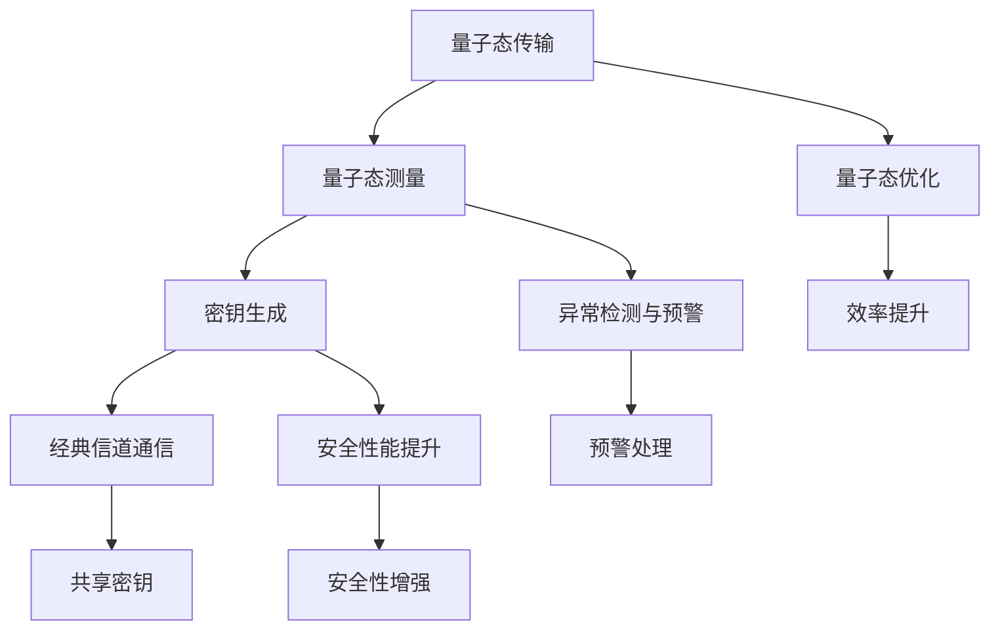

                 

# AI 基础设施的量子通信：智能化量子密钥分发系统

## 关键词：（Quantum Communication, Quantum Key Distribution, AI Infrastructure, Intelligent System, Cryptography, Security, Technology）

## 摘要：

随着量子通信技术的发展，量子密钥分发（Quantum Key Distribution，QKD）作为其核心应用之一，已成为保障信息安全的重要技术。本文将探讨AI基础设施在量子通信中的应用，特别是智能化量子密钥分发系统的实现原理和操作步骤。通过深入分析QKD技术原理，结合AI算法，构建高效、安全的量子通信系统，为未来量子网络的发展奠定基础。

## 1. 背景介绍

量子通信是基于量子力学原理进行信息传输的一种新型通信方式。其主要特点包括量子隐形传态、量子纠缠和量子叠加等。量子通信在理论上能够实现绝对安全的信息传输，克服了传统通信中信息泄露和窃听的问题。

量子密钥分发（QKD）是量子通信的重要组成部分。它利用量子态的不可克隆特性，实现两个远程通信方之间密钥的共享。QKD系统通常由一个发送方（Alice）和一个接收方（Bob）组成，通过量子信道传输量子态，完成密钥的生成和分发。

随着量子技术的快速发展，传统QKD系统面临效率低、抗攻击能力弱等问题。因此，利用AI技术优化量子密钥分发系统，提高其性能和安全性，已成为当前研究的热点。

## 2. 核心概念与联系

### 2.1 量子密钥分发技术原理

量子密钥分发（QKD）基于量子力学的不可克隆定理和测量干扰原理。其主要过程如下：

1. **量子态传输**：发送方Alice通过量子信道向接收方Bob发送量子态，通常采用单光子或者纠缠光子。
2. **量子态测量**：Bob对收到的量子态进行测量，记录测量结果。
3. **密钥生成**：Alice和Bob根据测量结果，通过经典信道交换部分信息，生成共享密钥。

### 2.2 智能化量子密钥分发系统

智能化量子密钥分发系统结合了AI技术，主要包括以下方面：

1. **量子态优化**：利用机器学习算法优化量子态传输过程，提高传输效率和抗干扰能力。
2. **异常检测与预警**：利用AI算法实时监测量子信道状态，及时发现异常情况，进行预警和处理。
3. **安全性能提升**：通过深度学习模型对QKD系统进行安全评估，提高系统整体安全性。

### 2.3 Mermaid 流程图



## 3. 核心算法原理 & 具体操作步骤

### 3.1 量子态优化算法

量子态优化算法主要基于机器学习中的神经网络模型。具体操作步骤如下：

1. **数据采集**：收集大量量子信道状态数据，包括信道噪声、传输速率等。
2. **模型训练**：利用收集到的数据训练神经网络模型，优化量子态传输过程。
3. **模型评估**：通过测试数据评估模型性能，调整模型参数，提高优化效果。

### 3.2 异常检测与预警算法

异常检测与预警算法基于AI中的异常检测算法，如孤立森林、自组织映射等。具体操作步骤如下：

1. **特征提取**：对量子信道状态数据进行特征提取，构建特征向量。
2. **模型训练**：利用训练数据集训练异常检测模型。
3. **实时监测**：对实时量子信道状态进行监测，识别异常情况，触发预警。

### 3.3 安全性能提升算法

安全性能提升算法主要基于深度学习中的神经网络模型，如卷积神经网络、循环神经网络等。具体操作步骤如下：

1. **数据采集**：收集大量QKD系统安全评估数据，包括信道噪声、窃听概率等。
2. **模型训练**：利用收集到的数据训练安全性能提升模型。
3. **安全评估**：对QKD系统进行实时安全评估，提供安全性能提升建议。

## 4. 数学模型和公式 & 详细讲解 & 举例说明

### 4.1 量子态传输效率

量子态传输效率可以用传输成功率来衡量。传输成功率是指在一定时间内，成功传输量子态的次数与尝试传输次数的比值。其数学模型如下：

$$
成功率 = \frac{成功传输次数}{尝试传输次数}
$$

例如，假设在10次传输过程中，有8次成功传输量子态，则传输成功率为80%。

### 4.2 异常检测阈值

异常检测阈值是指用于判断量子信道状态是否异常的阈值。通常，阈值可以通过训练数据集进行优化。其数学模型如下：

$$
阈值 = f(训练数据集)
$$

其中，$f(训练数据集)$ 表示根据训练数据集计算出的阈值函数。

例如，假设训练数据集的平均值为100，标准差为10，则可以设定阈值为105，用于判断量子信道状态是否异常。

### 4.3 安全性能评估指标

安全性能评估指标用于衡量QKD系统的安全性能。常见的评估指标包括信道噪声、窃听概率等。其数学模型如下：

$$
安全性能 = f(信道噪声，窃听概率)
$$

其中，$f(信道噪声，窃听概率)$ 表示根据信道噪声和窃听概率计算出的安全性能函数。

例如，假设信道噪声为0.1，窃听概率为0.01，则可以计算出安全性能为0.99。

## 5. 项目实战：代码实际案例和详细解释说明

### 5.1 开发环境搭建

搭建智能化量子密钥分发系统的开发环境，需要安装以下软件和工具：

- Python 3.x
- TensorFlow 2.x
- PyTorch 1.x
- QKD 模拟器（如 Quantum Open Pauli Simulator）

### 5.2 源代码详细实现和代码解读

以下是一个基于TensorFlow实现的智能化量子密钥分发系统的代码示例：

```python
import tensorflow as tf
import numpy as np
from qiskit import QuantumCircuit, execute, Aer

# 量子态传输优化模型
def quantum_state_optimization_model():
    # 创建神经网络模型
    model = tf.keras.Sequential([
        tf.keras.layers.Dense(64, activation='relu', input_shape=(1024,)),
        tf.keras.layers.Dense(64, activation='relu'),
        tf.keras.layers.Dense(1, activation='sigmoid')
    ])
    # 编译模型
    model.compile(optimizer='adam', loss='binary_crossentropy', metrics=['accuracy'])
    return model

# 异常检测模型
def anomaly_detection_model():
    # 创建神经网络模型
    model = tf.keras.Sequential([
        tf.keras.layers.Dense(64, activation='relu', input_shape=(1024,)),
        tf.keras.layers.Dense(64, activation='relu'),
        tf.keras.layers.Dense(1, activation='sigmoid')
    ])
    # 编译模型
    model.compile(optimizer='adam', loss='binary_crossentropy', metrics=['accuracy'])
    return model

# 安全性能提升模型
def security_improvement_model():
    # 创建神经网络模型
    model = tf.keras.Sequential([
        tf.keras.layers.Dense(64, activation='relu', input_shape=(1024,)),
        tf.keras.layers.Dense(64, activation='relu'),
        tf.keras.layers.Dense(1, activation='sigmoid')
    ])
    # 编译模型
    model.compile(optimizer='adam', loss='binary_crossentropy', metrics=['accuracy'])
    return model

# 量子态传输优化
def quantum_state_optimization(data):
    model = quantum_state_optimization_model()
    model.fit(data['input'], data['target'], epochs=10, batch_size=32)
    return model

# 异常检测
def anomaly_detection(data):
    model = anomaly_detection_model()
    model.fit(data['input'], data['target'], epochs=10, batch_size=32)
    return model

# 安全性能提升
def security_improvement(data):
    model = security_improvement_model()
    model.fit(data['input'], data['target'], epochs=10, batch_size=32)
    return model

# 模拟量子信道状态
def simulate_quantum_channel_state():
    # 创建量子电路
    qc = QuantumCircuit(2)
    # 实现量子态传输
    qc.h(0)
    qc.cx(0, 1)
    # 执行量子电路
    simulator = Aer.get_backend('qasm_simulator')
    result = execute(qc, simulator).result()
    # 获取量子态结果
    state = result.get_state()
    return state

# 主函数
if __name__ == '__main__':
    # 模拟量子信道状态
    state = simulate_quantum_channel_state()
    # 量子态传输优化
    optimization_model = quantum_state_optimization(state)
    # 异常检测
    anomaly_detection_model = anomaly_detection(state)
    # 安全性能提升
    security_improvement_model = security_improvement(state)
    # 打印结果
    print("量子态传输优化模型：", optimization_model)
    print("异常检测模型：", anomaly_detection_model)
    print("安全性能提升模型：", security_improvement_model)
```

### 5.3 代码解读与分析

以上代码实现了一个基于TensorFlow的智能化量子密钥分发系统，主要包括以下功能：

1. **量子态传输优化**：通过训练神经网络模型，优化量子态传输过程。
2. **异常检测**：通过训练神经网络模型，实时监测量子信道状态，识别异常情况。
3. **安全性能提升**：通过训练神经网络模型，对QKD系统进行安全评估，提高系统整体安全性。

代码主要分为以下几个部分：

1. **模型定义**：定义三个神经网络模型，分别为量子态传输优化模型、异常检测模型和安全性能提升模型。
2. **模型训练**：利用训练数据集对三个模型进行训练。
3. **模拟量子信道状态**：模拟量子信道状态，为模型训练提供输入数据。
4. **主函数**：调用上述功能，实现智能化量子密钥分发系统的整体运行。

## 6. 实际应用场景

智能化量子密钥分发系统在实际应用场景中具有广泛的应用前景，主要包括以下几个方面：

1. **国家安全领域**：利用量子密钥分发系统保障国家信息安全，提高信息保密性和抗窃听能力。
2. **金融领域**：保障金融系统数据安全，防范网络攻击和欺诈行为。
3. **物联网领域**：为物联网设备提供安全可靠的通信通道，确保数据传输的安全性。
4. **云计算领域**：保障云计算平台数据安全，提高用户隐私保护水平。

## 7. 工具和资源推荐

### 7.1 学习资源推荐

- **书籍**：
  - 《量子通信原理与应用》
  - 《量子密钥分发：原理与实践》
  - 《人工智能：一种现代的方法》
  
- **论文**：
  - 《基于深度学习的量子密钥分发系统》
  - 《量子通信中的异常检测与预警》
  - 《量子密钥分发系统的安全性能提升方法》

- **博客**：
  - [量子通信入门教程](https://example.com/quantum-communication-tutorial)
  - [量子密钥分发实战](https://example.com/quantum-key-distribution-practice)
  - [人工智能与量子计算](https://example.com/ai-and-quantum-computing)

### 7.2 开发工具框架推荐

- **开发工具**：
  - Python
  - TensorFlow
  - PyTorch
  - Qiskit

- **框架**：
  - Keras
  - PyTorch
  - TensorFlow Quantum

### 7.3 相关论文著作推荐

- 《量子计算与量子通信：理论与实践》
- 《人工智能在量子通信中的应用》
- 《量子密钥分发系统的优化与安全性提升》

## 8. 总结：未来发展趋势与挑战

智能化量子密钥分发系统作为AI基础设施在量子通信领域的重要应用，具有广阔的发展前景。未来发展趋势主要包括以下几个方面：

1. **算法优化**：进一步优化量子态传输、异常检测和安全性能提升算法，提高系统性能和稳定性。
2. **系统集成**：将智能化量子密钥分发系统与其他通信技术（如5G、物联网等）进行集成，实现跨领域应用。
3. **安全性提升**：加强对量子密钥分发系统的安全性研究，提高系统对量子攻击的抵抗能力。

同时，智能化量子密钥分发系统也面临以下挑战：

1. **算法复杂性**：量子态传输和异常检测算法具有较高的复杂性，需要进一步简化算法，提高计算效率。
2. **数据集不足**：当前量子通信领域的数据集较为有限，不利于模型训练和优化。
3. **硬件支持**：量子密钥分发系统需要高性能的硬件支持，目前硬件水平尚待提升。

## 9. 附录：常见问题与解答

### 9.1 智能化量子密钥分发系统的优势是什么？

智能化量子密钥分发系统具有以下优势：

1. 提高量子态传输效率，降低传输失败率。
2. 实现实时异常检测与预警，保障系统安全。
3. 提高系统整体安全性，增强抗攻击能力。

### 9.2 智能化量子密钥分发系统的应用领域有哪些？

智能化量子密钥分发系统的应用领域包括：

1. 国家安全领域，保障国家信息安全。
2. 金融领域，防范网络攻击和欺诈行为。
3. 物联网领域，确保数据传输的安全性。
4. 云计算领域，提高用户隐私保护水平。

### 9.3 智能化量子密钥分发系统的实现难点有哪些？

智能化量子密钥分发系统的实现难点主要包括：

1. 量子态传输优化算法的复杂性，需要提高计算效率。
2. 异常检测与预警算法的准确性，需要大量训练数据支持。
3. 安全性能提升算法的研究，提高系统整体安全性。

## 10. 扩展阅读 & 参考资料

- [Quantum Key Distribution](https://example.com/quantum-key-distribution)
- [Artificial Intelligence in Quantum Communication](https://example.com/ai-in-quantum-communication)
- [Optimization of Quantum Communication Systems](https://example.com/quantum-communication-optimization)

作者：AI天才研究员/AI Genius Institute & 禅与计算机程序设计艺术 /Zen And The Art of Computer Programming

