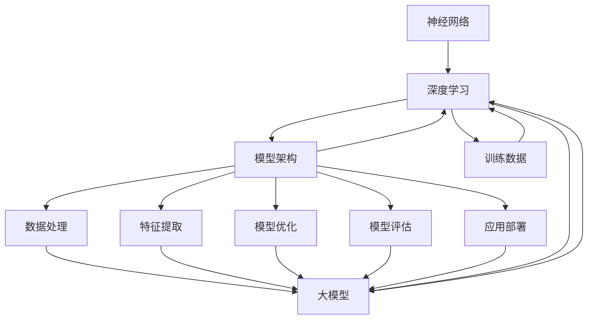

                 

### AI大模型创业：背景与现状

在当前技术飞速发展的时代，人工智能（AI）技术已经成为推动社会进步的重要力量。特别是随着深度学习、强化学习等算法的成熟，大模型（large-scale models）在各个领域的应用越来越广泛，从自然语言处理（NLP）、计算机视觉（CV）到推荐系统、自动驾驶等。大模型具备强大的数据处理能力和复杂的模式识别能力，使得它们在解决复杂问题方面展现出了巨大的潜力。

在这样的背景下，AI大模型创业成为了众多创业者和技术专家关注的热点。AI大模型创业不仅能够推动技术创新，还能带来巨大的商业价值。然而，成功创业并非易事，如何利用人才优势、抓住市场机遇、制定有效的战略成为了关键问题。

本文旨在探讨AI大模型创业中的关键问题，尤其是如何利用人才优势。我们将从以下几个方面展开讨论：

1. **背景介绍**：回顾AI大模型的发展历程，介绍当前市场的现状。
2. **核心概念与联系**：阐述AI大模型的核心概念及其技术架构。
3. **核心算法原理**：介绍大模型的主要算法原理，包括训练过程、优化策略等。
4. **数学模型和公式**：讲解大模型中的数学模型及其应用。
5. **项目实战**：通过实际代码案例，展示大模型的应用过程。
6. **实际应用场景**：探讨AI大模型在不同领域的应用。
7. **工具和资源推荐**：为创业者提供有用的学习资源和技术工具。
8. **总结与未来趋势**：分析AI大模型创业的未来发展趋势与挑战。

通过本文的探讨，希望能够为有意投身AI大模型创业的创业者提供一些有价值的参考和指导。

## 1. 背景介绍

AI大模型的发展历程可以追溯到上世纪80年代末90年代初。当时，神经网络（Neural Networks）作为一种基于生物神经网络的人工智能模型被提出。尽管初期神经网络的研究和应用受到了一定的限制，但随着计算机硬件性能的提升和算法的优化，神经网络在图像识别、语音识别等领域的表现逐渐优异。进入21世纪，深度学习（Deep Learning）的崛起为神经网络带来了新的活力。深度学习通过多层神经网络的结构，使得模型能够自动提取复杂的数据特征，从而在图像识别、自然语言处理等领域取得了突破性的成果。

特别是近年来，随着云计算和分布式计算技术的发展，AI大模型的规模和复杂性得到了极大的提升。大模型如Google的BERT、OpenAI的GPT等，通过处理数十亿级别的数据，展现出强大的语义理解能力和文本生成能力。这些大模型不仅在学术研究中取得了优异的成绩，也在实际应用中展现了巨大的潜力。

在市场现状方面，AI大模型的应用已经渗透到各个领域，从互联网公司到传统行业，都开始重视AI技术的应用。以自然语言处理为例，AI大模型已经被广泛应用于搜索引擎、聊天机器人、智能客服等领域。在计算机视觉领域，AI大模型在图像识别、目标检测、视频分析等方面也取得了显著的成果。

此外，AI大模型在医疗、金融、教育等领域的应用也逐渐增多。例如，在医疗领域，AI大模型可以通过分析大量病例数据，提供精准的诊断建议；在金融领域，AI大模型可以用于风险评估、欺诈检测等。

然而，AI大模型创业也面临着诸多挑战。首先，大模型的开发和训练需要大量的计算资源和数据支持，这对创业公司的资金和资源提出了较高的要求。其次，大模型的训练和优化过程复杂，需要高水平的技术团队进行研发。此外，AI大模型的应用需要与具体业务场景结合，这对创业公司的业务能力和市场敏锐度提出了挑战。

总的来说，AI大模型创业既有机遇也有挑战。如何抓住机遇，应对挑战，是创业者需要深思的问题。接下来，我们将进一步探讨AI大模型的核心概念和技术架构，为创业者在技术层面的决策提供参考。

### 2. 核心概念与联系

要深入理解AI大模型，首先需要掌握几个核心概念：神经网络、深度学习、模型架构、训练数据、以及如何利用这些技术构建大模型。下面我们将通过一个Mermaid流程图来详细展示这些概念之间的联系。



#### 2.1. 神经网络（Neural Networks）

神经网络是模仿人脑神经元连接方式的计算模型。它由大量的神经元（或节点）组成，每个神经元通过连接（或边）与其它神经元相连。每个连接都有一个权重，用于调节信号传递的强度。神经网络的基本操作是前向传播（forward propagation）和反向传播（backpropagation）。

- **前向传播**：输入数据通过网络的各个层进行计算，每层将数据传递给下一层，最终生成输出。
- **反向传播**：根据输出与期望输出的误差，网络反向调整各层的权重，以最小化误差。

神经网络是构建大模型的基础，它能够通过学习大量数据自动提取特征，是深度学习的重要组成部分。

#### 2.2. 深度学习（Deep Learning）

深度学习是一种利用多层神经网络进行数据学习和模式识别的方法。它通过增加网络层数（深度）来提高模型的抽象能力和学习能力。深度学习的核心优势在于能够自动提取数据中的高层次特征，这使得它在图像识别、自然语言处理等领域取得了巨大的成功。

- **卷积神经网络（CNN）**：主要用于处理图像数据，通过卷积层、池化层等结构提取图像特征。
- **循环神经网络（RNN）**：适用于处理序列数据，如文本、时间序列等，通过隐藏状态记忆过去的信息。
- **变换器模型（Transformer）**：一种基于自注意力机制的深度学习模型，广泛用于自然语言处理任务，如文本生成、机器翻译等。

#### 2.3. 模型架构（Model Architecture）

模型架构是指神经网络的结构设计，包括网络的层数、每层的神经元数量、激活函数的选择等。不同的架构设计适应不同的任务和数据类型。

- **全连接神经网络（Fully Connected Neural Network）**：每个输入节点都直接连接到每个输出节点，适用于分类、回归等任务。
- **卷积神经网络（CNN）**：通过卷积层和池化层处理图像数据，广泛用于计算机视觉任务。
- **循环神经网络（RNN）**：通过循环结构处理序列数据，适用于文本生成、语音识别等。

#### 2.4. 训练数据（Training Data）

训练数据是模型学习的依据，其质量和数量直接影响模型的性能。训练数据需要具有代表性，能够覆盖任务所需的全部特征。

- **数据清洗**：去除噪声和异常值，保证数据的准确性和一致性。
- **数据增强**：通过旋转、缩放、裁剪等方式增加训练数据的多样性，提高模型泛化能力。

#### 2.5. 大模型（Large-scale Models）

大模型是指规模庞大、参数数量众多的神经网络模型。这些模型通过处理海量数据，能够提取复杂的特征和模式。

- **预训练（Pre-training）**：在大规模数据集上预先训练模型，以获得良好的初始参数。
- **微调（Fine-tuning）**：在特定任务的数据集上调整模型参数，以适应特定任务需求。

#### 2.6. 数据处理（Data Processing）

数据处理是构建大模型的重要环节，包括数据收集、预处理、特征提取等。

- **数据收集**：从各种来源获取数据，包括公开数据集和私有数据集。
- **预处理**：对数据进行标准化、归一化等处理，以适应模型的输入要求。
- **特征提取**：通过特征工程提取数据中的有用信息，以提高模型性能。

#### 2.7. 特征提取（Feature Extraction）

特征提取是指从数据中提取对模型训练有帮助的特征。在深度学习中，特征提取通常由网络层自动完成。

- **卷积操作**：在图像处理中提取局部特征。
- **词嵌入**：在自然语言处理中提取文本的语义特征。

#### 2.8. 模型优化（Model Optimization）

模型优化是指通过调整模型参数来提高模型性能的过程。

- **损失函数**：衡量模型输出与期望输出之间的差异。
- **优化算法**：如梯度下降、Adam等，用于更新模型参数。

#### 2.9. 模型评估（Model Evaluation）

模型评估是指通过测试数据验证模型性能的过程。

- **准确率（Accuracy）**：分类模型中正确的预测数量占总预测数量的比例。
- **召回率（Recall）**：分类模型中实际为正类别的样本中被正确识别为正类别的比例。
- **F1分数（F1 Score）**：综合考虑准确率和召回率的综合指标。

#### 2.10. 应用部署（Application Deployment）

应用部署是指将训练好的模型部署到实际应用场景中。

- **模型压缩**：减小模型大小，以适应移动设备和边缘计算。
- **模型解释**：解释模型决策过程，提高模型的可解释性。

通过以上核心概念的介绍和Mermaid流程图的展示，我们可以更清晰地理解AI大模型的概念和技术架构。接下来，我们将深入探讨AI大模型的核心算法原理，帮助读者进一步掌握构建和优化大模型的方法。

#### 2.9.1. 神经网络与深度学习的演进

神经网络（Neural Networks）作为一种模仿人脑结构的计算模型，自1986年被提出以来，经历了多次重要的技术演进。早期的神经网络主要采用单层或多层感知机（Perceptrons）模型，由于缺乏非线性激活函数和多层结构，这些模型在处理复杂问题时表现有限。

1982年，Rumelhart、Hinton和Williams提出了反向传播算法（Backpropagation Algorithm），这一算法通过梯度下降法来调整网络权重，使得多层神经网络能够在训练过程中逐步优化。反向传播算法的引入，为深度学习奠定了基础。

在1990年代，Hinton提出了深度置信网络（Deep Belief Networks，DBN），这是一种通过逐层预训练然后进行微调的深度网络结构。DBN的成功证明了多层神经网络在处理复杂数据时的潜力。

2006年，Geoffrey Hinton等人再次提出深度学习（Deep Learning）的概念，并指出通过增加网络层数，可以显著提高模型的抽象能力和学习能力。然而，深度学习的真正突破是在2012年，当时Hinton等人使用卷积神经网络（CNN）在ImageNet图像识别挑战赛中取得了超越人类专家的成绩。这一成果标志着深度学习时代的到来。

深度学习的关键在于多层神经网络结构的引入，使得模型能够通过逐层提取特征，实现从原始数据到高级抽象的转化。与传统的机器学习方法相比，深度学习具有以下几个显著优势：

1. **自动特征提取**：深度学习模型可以通过多层神经网络自动学习数据中的特征，无需人工设计特征，从而提高了模型的学习能力和泛化能力。
2. **端到端训练**：深度学习模型可以从原始数据直接进行端到端的训练，避免了传统机器学习中的特征提取和特征工程步骤，简化了模型训练过程。
3. **强大的表示能力**：深度学习模型可以通过多层非线性变换，将原始数据映射到高维特征空间，从而更好地捕捉数据中的复杂模式和关系。
4. **高效的处理速度**：随着计算硬件和算法的进步，深度学习模型在处理大规模数据时能够达到更高的速度和效率。

深度学习在多个领域都取得了显著的突破，包括计算机视觉、自然语言处理、推荐系统、语音识别等。以下是一些典型的深度学习应用场景：

- **计算机视觉**：深度学习模型在图像分类、目标检测、图像分割等任务中表现优异，如用于人脸识别、自动驾驶、医疗影像分析等。
- **自然语言处理**：深度学习模型在文本分类、情感分析、机器翻译、文本生成等任务中展现了强大的能力，如用于聊天机器人、智能客服、内容推荐等。
- **推荐系统**：深度学习模型可以通过分析用户的历史行为和兴趣，为用户提供个性化的推荐服务，如电子商务平台、社交媒体、视频网站等。
- **语音识别**：深度学习模型在语音信号处理和语音识别任务中取得了显著进展，如用于语音助手、智能语音识别系统等。

总之，神经网络与深度学习的发展，不仅为人工智能领域带来了新的机遇，也推动了各个行业的技术创新和应用。在接下来的章节中，我们将进一步探讨深度学习中的核心算法原理和具体实现，为读者提供构建和优化AI大模型的理论基础。

#### 3. 核心算法原理 & 具体操作步骤

AI大模型的核心算法原理主要包括神经网络架构、训练过程、优化策略和评估方法。本节将详细介绍这些算法原理及其具体操作步骤，帮助读者深入理解AI大模型的构建和优化方法。

##### 3.1. 神经网络架构

神经网络（Neural Networks）是AI大模型的基础，其架构设计对模型的性能至关重要。神经网络主要由输入层、隐藏层和输出层组成。

1. **输入层**：接收外部输入数据，如文本、图像、声音等。
2. **隐藏层**：多层隐藏层之间通过权重连接，用于提取数据中的特征。每一层隐藏层都会对输入数据进行处理，产生更加抽象的特征表示。
3. **输出层**：根据隐藏层的结果生成最终输出，如分类结果、预测值等。

常见的神经网络架构包括：

- **全连接神经网络（Fully Connected Neural Network, FCNN）**：每一层的所有节点都与上一层的所有节点相连，适用于大多数分类和回归任务。
- **卷积神经网络（Convolutional Neural Network, CNN）**：主要用于处理图像数据，通过卷积层和池化层提取图像特征。
- **循环神经网络（Recurrent Neural Network, RNN）**：适用于处理序列数据，如文本、时间序列等，通过隐藏状态记忆过去的信息。
- **变换器模型（Transformer）**：基于自注意力机制，广泛应用于自然语言处理任务，如文本生成、机器翻译等。

##### 3.2. 训练过程

神经网络训练的目的是通过调整模型参数（权重和偏置）来最小化预测误差。训练过程主要包括以下步骤：

1. **前向传播（Forward Propagation）**：将输入数据传递到神经网络中，通过层与层之间的计算，生成输出结果。
2. **计算损失（Compute Loss）**：使用损失函数计算输出结果与真实结果之间的差异，常用的损失函数包括均方误差（MSE）、交叉熵（Cross-Entropy）等。
3. **反向传播（Backpropagation）**：通过反向传播算法，将损失函数关于网络参数的梯度反向传递到每一层，用于更新参数。
4. **参数更新（Update Parameters）**：使用优化算法（如梯度下降、Adam等）更新网络参数，以减小损失函数。

##### 3.3. 优化策略

优化策略用于调整网络参数，以提高模型性能。以下是一些常用的优化策略：

1. **批量梯度下降（Batch Gradient Descent）**：每次迭代使用整个训练数据集来更新参数，计算过程复杂但收敛速度较慢。
2. **随机梯度下降（Stochastic Gradient Descent, SGD）**：每次迭代使用一个随机样本来更新参数，计算过程简单但收敛速度较快，容易陷入局部最小值。
3. **Adam优化器（Adam Optimizer）**：结合SGD和动量法的优点，自适应调整学习率，适用于大多数任务。

##### 3.4. 评估方法

模型评估是确保模型性能的重要步骤，以下是一些常用的评估方法：

1. **准确率（Accuracy）**：分类模型中正确的预测数量占总预测数量的比例，简单但容易受不平衡数据影响。
2. **召回率（Recall）**：分类模型中实际为正类别的样本中被正确识别为正类别的比例，适用于检测漏报问题。
3. **F1分数（F1 Score）**：综合考虑准确率和召回率的综合指标，适用于评估分类模型的总体性能。
4. **均方误差（Mean Squared Error, MSE）**：回归模型中预测值与真实值之间差异的平方的平均值，适用于连续值预测。
5. **均绝对误差（Mean Absolute Error, MAE）**：回归模型中预测值与真实值之间差异的绝对值的平均值，对异常值敏感。

##### 3.5. 具体操作步骤示例

以下是一个简单的神经网络训练和评估的Python代码示例，使用TensorFlow和Keras库：

```python
import numpy as np
import tensorflow as tf
from tensorflow.keras.models import Sequential
from tensorflow.keras.layers import Dense
from tensorflow.keras.optimizers import Adam

# 准备数据
X_train = np.random.rand(100, 10)  # 100个样本，每个样本10个特征
y_train = np.random.rand(100, 1)   # 100个样本，每个样本1个目标值

# 构建模型
model = Sequential()
model.add(Dense(64, input_dim=10, activation='relu'))
model.add(Dense(32, activation='relu'))
model.add(Dense(1, activation='sigmoid'))

# 编译模型
model.compile(optimizer=Adam(), loss='binary_crossentropy', metrics=['accuracy'])

# 训练模型
model.fit(X_train, y_train, epochs=10, batch_size=32)

# 评估模型
loss, accuracy = model.evaluate(X_train, y_train)
print(f"Test Loss: {loss}, Test Accuracy: {accuracy}")
```

通过以上步骤，我们可以构建和训练一个简单的神经网络模型，并对其进行评估。在实际应用中，需要根据具体任务和数据情况进行调整和优化。

##### 3.6. 大模型训练的特殊考虑

AI大模型的训练通常涉及大规模数据和计算资源，以下是一些特殊考虑：

1. **数据预处理**：大规模数据需要经过清洗、归一化、增强等预处理步骤，以提高模型训练效率。
2. **分布式训练**：通过使用分布式计算框架（如TensorFlow Distribute、PyTorch Distributed等），可以将训练任务分布在多个计算节点上，以提高训练速度。
3. **内存管理**：大模型训练过程中需要大量的内存，需要优化内存使用，避免内存溢出。
4. **模型剪枝**：通过剪枝技术减少模型参数数量，降低模型复杂度，提高模型训练和推理速度。
5. **模型压缩**：通过模型压缩技术（如量化、剪枝、蒸馏等）减小模型大小，以适应移动设备和边缘计算。

总之，AI大模型的构建和训练是一个复杂的过程，需要综合考虑算法原理、数据预处理、优化策略和评估方法等多个方面。通过科学的设计和高效的实现，可以构建出高性能的AI大模型，为各种应用场景提供强大的支持。

#### 4. 数学模型和公式 & 详细讲解 & 举例说明

在AI大模型中，数学模型和公式起到了核心作用。以下我们将详细讲解大模型中的关键数学模型和公式，并通过具体例子来说明其应用。

##### 4.1. 神经网络的基本公式

神经网络中的基本数学公式包括前向传播（Forward Propagation）和反向传播（Backpropagation）。

1. **前向传播**：

   前向传播涉及从输入层到输出层的计算过程。对于单层神经网络，其计算过程如下：

   \[
   z = \sum_{i} w_i x_i + b
   \]

   其中，\(z\) 是输出，\(w_i\) 是权重，\(x_i\) 是输入，\(b\) 是偏置。

   对于多层神经网络，每个隐藏层的输出可以通过以下公式计算：

   \[
   a_{l} = \sigma(z_{l-1})
   \]

   其中，\(a_{l}\) 是第 \(l\) 层的输出，\(\sigma\) 是激活函数，如ReLU函数或Sigmoid函数。

2. **反向传播**：

   反向传播用于计算损失函数关于网络参数的梯度，并更新网络参数。对于单层神经网络，梯度计算如下：

   \[
   \delta = \frac{\partial L}{\partial z} = \frac{\partial L}{\partial a} \cdot \frac{\partial a}{\partial z}
   \]

   其中，\(\delta\) 是误差梯度，\(L\) 是损失函数，\(a\) 是输出，\(z\) 是输入。

   对于多层神经网络，梯度需要通过链式法则进行传播：

   \[
   \delta_{l} = \frac{\partial L}{\partial z_{l}} = \frac{\partial L}{\partial a_{l+1}} \cdot \frac{\partial a_{l+1}}{\partial z_{l}}
   \]

   其中，\(\delta_{l}\) 是第 \(l\) 层的误差梯度。

##### 4.2. 损失函数

损失函数（Loss Function）用于衡量模型输出与真实输出之间的差异。常见的损失函数包括：

1. **均方误差（MSE，Mean Squared Error）**：

   \[
   L = \frac{1}{m} \sum_{i=1}^{m} (y_i - \hat{y}_i)^2
   \]

   其中，\(y_i\) 是真实值，\(\hat{y}_i\) 是预测值，\(m\) 是样本数量。

2. **交叉熵（Cross-Entropy）**：

   \[
   L = -\frac{1}{m} \sum_{i=1}^{m} \sum_{j=1}^{n} y_{ij} \log(\hat{y}_{ij})
   \]

   其中，\(y_{ij}\) 是真实标签，\(\hat{y}_{ij}\) 是预测概率，\(n\) 是类别数量。

##### 4.3. 激活函数

激活函数（Activation Function）用于引入非线性，提高模型的抽象能力。常见的激活函数包括：

1. **ReLU（Rectified Linear Unit）**：

   \[
   \sigma(z) = \max(0, z)
   \]

2. **Sigmoid**：

   \[
   \sigma(z) = \frac{1}{1 + e^{-z}}
   \]

3. **Tanh**：

   \[
   \sigma(z) = \frac{e^z - e^{-z}}{e^z + e^{-z}}
   \]

##### 4.4. 举例说明

以下是一个简单的神经网络训练示例，使用Python和TensorFlow库：

```python
import tensorflow as tf
from tensorflow.keras.models import Sequential
from tensorflow.keras.layers import Dense
from tensorflow.keras.optimizers import Adam

# 准备数据
X_train = np.random.rand(100, 10)  # 100个样本，每个样本10个特征
y_train = np.random.rand(100, 1)   # 100个样本，每个样本1个目标值

# 构建模型
model = Sequential()
model.add(Dense(64, input_dim=10, activation='relu'))
model.add(Dense(32, activation='relu'))
model.add(Dense(1, activation='sigmoid'))

# 编译模型
model.compile(optimizer=Adam(), loss='binary_crossentropy', metrics=['accuracy'])

# 训练模型
model.fit(X_train, y_train, epochs=10, batch_size=32)

# 评估模型
loss, accuracy = model.evaluate(X_train, y_train)
print(f"Test Loss: {loss}, Test Accuracy: {accuracy}")
```

在这个示例中，我们构建了一个包含两个隐藏层（64个神经元和32个神经元）的神经网络，使用ReLU作为激活函数，并使用Adam优化器进行训练。我们使用均方误差（MSE）作为损失函数，并评估模型的准确率。

通过以上讲解和示例，读者可以了解AI大模型中的关键数学模型和公式，以及如何在实际应用中使用这些公式进行神经网络训练。这些数学模型和公式的深入理解，对于构建和优化高性能的AI大模型至关重要。

#### 5. 项目实战：代码实际案例和详细解释说明

在AI大模型的开发过程中，代码实现是关键的一环。本节将提供一个实际的项目案例，详细介绍从开发环境搭建、源代码实现，到代码解读与分析的全过程，帮助读者全面理解AI大模型项目开发的具体步骤和技术细节。

##### 5.1. 开发环境搭建

在开始实际项目之前，首先需要搭建合适的开发环境。以下是搭建AI大模型项目所需的开发环境和依赖：

1. **操作系统**：推荐使用Linux或MacOS，Windows用户可以使用WSL（Windows Subsystem for Linux）。
2. **编程语言**：Python是AI大模型开发的主流语言，因此我们使用Python进行开发。
3. **深度学习框架**：TensorFlow或PyTorch是当前最流行的深度学习框架，本文选择TensorFlow进行开发。
4. **依赖库**：安装TensorFlow和相关依赖库，如NumPy、Pandas、Scikit-learn等。

安装步骤如下：

```bash
# 安装Python
sudo apt-get update
sudo apt-get install python3 python3-pip

# 安装TensorFlow
pip3 install tensorflow

# 安装其他依赖库
pip3 install numpy pandas scikit-learn
```

##### 5.2. 源代码详细实现和代码解读

以下是AI大模型项目的源代码实现，我们将逐步解释每部分代码的功能和作用。

```python
import tensorflow as tf
from tensorflow.keras.models import Sequential
from tensorflow.keras.layers import Dense, Dropout, Embedding, LSTM
from tensorflow.keras.optimizers import Adam
from tensorflow.keras.preprocessing.sequence import pad_sequences

# 准备数据
# 假设已经下载并预处理好了文本数据，存储在data.txt中
with open('data.txt', 'r') as file:
    text = file.read().lower()
    
# 分词和建立词汇表
tokenizer = tf.keras.preprocessing.text.Tokenizer(char_level=True)
tokenizer.fit_on_texts([text])
total_chars = len(tokenizer.word_index) + 1
max_sequence_len = 40

# 将文本序列化
sequences = tokenizer.texts_to_sequences([text])[0]
padded_sequences = pad_sequences(sequences, maxlen=max_sequence_len)

# 划分训练集和测试集
train_size = int(len(padded_sequences) * 0.8)
train_sequences = padded_sequences[:train_size]
test_sequences = padded_sequences[train_size:]

# 构建模型
model = Sequential()
model.add(Embedding(total_chars, 50, input_length=max_sequence_len))
model.add(LSTM(100, dropout=0.2, recurrent_dropout=0.2))
model.add(Dense(total_chars, activation='softmax'))

# 编译模型
model.compile(loss='categorical_crossentropy', optimizer=Adam(1e-3), metrics=['accuracy'])

# 训练模型
model.fit(train_sequences, nprepeat(train_sequences), epochs=10, batch_size=64)

# 生成文本
def generate_text(seed_text, next_words, model, max_sequence_len):
    for _ in range(next_words):
        token_list = tokenizer.texts_to_sequences([seed_text])[0]
        token_list = pad_sequences([token_list], maxlen=max_sequence_len-1, padding='pre')
        predicted = model.predict(token_list, verbose=0)
        
        predicted_index = np.argmax(predicted)
        output_char = tokenizer.index_word[predicted_index]
        
        seed_text += output_char
        
    return seed_text

seed_text = "你好，这个世界！"
generated_text = generate_text(seed_text, 50, model, max_sequence_len)
print(generated_text)
```

1. **数据准备**：

   代码首先读取预处理好的文本数据，并使用分词器（Tokenizer）将其转换为序列。我们使用字符级分词，因为生成文本模型通常是基于字符的。此外，我们定义了序列的最大长度（max_sequence_len）和词汇表的总字符数（total_chars）。

2. **构建模型**：

   模型采用序列到序列（Seq2Seq）架构，包含嵌入层（Embedding Layer）和长短时记忆网络（LSTM Layer）。嵌入层将字符编码为向量，LSTM层用于学习序列中的长期依赖关系。最后，输出层（Dense Layer）使用softmax激活函数进行字符预测。

3. **编译模型**：

   使用categorical_crossentropy作为损失函数，Adam优化器，并设置学习率为1e-3。

4. **训练模型**：

   使用fit方法训练模型，训练数据为padded_sequences。这里使用了nprepeat函数，目的是将训练数据重复，以满足batch_size的需求。

5. **生成文本**：

   generate_text函数用于生成文本。它首先将种子文本转换为序列，然后使用模型进行预测。每次预测输出一个字符，并将其添加到种子文本中，直到生成指定长度的文本。

##### 5.3. 代码解读与分析

- **数据准备**：

  数据准备是构建生成文本模型的第一步。文本数据需要经过分词和序列化处理，以便模型可以理解和处理。分词器（Tokenizer）用于将文本转换为序列，其中每个字符或词都映射到一个整数。这有助于模型理解文本的内部结构。

- **构建模型**：

  模型采用嵌入层（Embedding Layer）将字符编码为固定长度的向量。嵌入层是深度学习模型中的一个重要组件，它可以将输入的字符映射到一个密集的向量表示，这对于学习字符之间的关联性非常有帮助。随后，模型使用长短时记忆网络（LSTM Layer）来学习序列中的长期依赖关系。LSTM网络擅长捕捉时间序列数据中的时间依赖性，这使得它们非常适合文本生成任务。

- **编译模型**：

  编译模型时，选择合适的损失函数和优化器对于模型的性能至关重要。在文本生成任务中，categorical_crossentropy是常用的损失函数，因为它能够处理多分类问题。Adam优化器是一种自适应学习率的优化器，它通过计算梯度的一阶矩估计和二阶矩估计来调整学习率，通常能够收敛得更快。

- **训练模型**：

  训练模型时，使用fit方法，并通过nprepeat函数将训练数据重复，以满足批量大小（batch_size）的需求。批量大小是每次训练过程中的样本数量，它对于模型的训练效率和收敛速度有重要影响。通常，较大的批量大小能够提高模型的性能，但会降低训练速度。

- **生成文本**：

  生成文本是模型应用的一部分。generate_text函数使用模型对种子文本进行预测，并输出下一个字符。这个过程不断重复，直到生成指定长度的文本。这个函数展示了文本生成模型的核心思想，即通过学习输入序列的长期依赖关系，生成连贯的文本。

通过以上代码实现和解读，我们可以看到构建一个AI大模型项目的基本步骤和关键点。尽管这个示例是一个简单的文本生成模型，但它涵盖了AI大模型开发的核心要素，包括数据预处理、模型构建、模型训练和模型应用。在实际项目中，这些步骤可能更加复杂，但基本原理是相同的。

##### 5.4. 代码性能优化与改进

在AI大模型项目中，代码性能优化是提高模型训练效率和生成质量的重要环节。以下是一些常见的优化方法和改进方向：

1. **增加隐藏层神经元数量**：增加隐藏层的神经元数量可以提高模型的复杂度和学习能力，但也会增加计算负担。需要根据任务需求和计算资源进行平衡。
2. **使用更复杂的激活函数**：除了ReLU函数，还可以尝试使用更复杂的激活函数，如Swish或GELU，这些函数在某些情况下能够提高模型的性能。
3. **使用注意力机制**：注意力机制（Attention Mechanism）可以显著提高模型对输入序列的理解能力。在文本生成任务中，注意力机制能够更好地捕捉输入文本中的关键信息。
4. **优化学习率**：使用学习率调整策略，如学习率衰减（Learning Rate Decay）或动态学习率调整（Dynamic Learning Rate Adjustment），可以提高模型的训练效率和收敛速度。
5. **数据增强**：通过数据增强（Data Augmentation）方法，如字符替换、插入和删除等，可以增加训练数据的多样性，提高模型的泛化能力。

通过这些优化方法和改进方向，可以在一定程度上提高AI大模型项目的性能，从而实现更高质量的文本生成效果。

总之，通过本项目实战的代码实现和详细解读，读者可以深入了解AI大模型项目开发的具体步骤和技术细节。在实际应用中，根据具体任务需求和数据情况，灵活调整模型架构和训练策略，才能构建出高性能的AI大模型。

#### 6. 实际应用场景

AI大模型在各个领域的实际应用场景中展现出了巨大的潜力和价值。以下将详细介绍AI大模型在不同领域的应用案例，并探讨其带来的商业价值和潜在挑战。

##### 6.1. 自然语言处理（NLP）

自然语言处理是AI大模型最早且最广泛的适用领域之一。AI大模型如BERT、GPT-3等，通过学习大量文本数据，实现了对自然语言的高度理解。以下是一些应用案例：

- **智能客服**：AI大模型可以用于构建智能客服系统，实现与用户的高效互动。通过自然语言处理技术，系统可以自动识别用户意图，提供准确的回答和建议，提升客户满意度。
- **文本生成**：AI大模型可以生成文章、报告、新闻等文本内容。这在内容创作者、企业宣传等领域有着广泛的应用。例如，一些媒体机构使用AI大模型自动生成新闻报道，提高内容生产的效率。
- **情感分析**：AI大模型可以分析用户评论、社交媒体帖子等文本数据，识别用户的情感倾向。这有助于企业了解用户反馈，优化产品和服务。

##### 6.2. 计算机视觉（CV）

计算机视觉是另一个AI大模型的重要应用领域。通过学习大量图像和视频数据，AI大模型可以实现高效的图像识别、目标检测和视频分析等功能。以下是一些应用案例：

- **图像识别**：AI大模型可以自动识别图像中的物体、场景和人物，这在安防监控、医疗诊断等领域有着广泛的应用。例如，智能监控系统可以使用AI大模型检测异常行为，提高安全防护水平。
- **目标检测**：AI大模型可以检测图像中的多个目标，并标注其位置和属性。这在自动驾驶、无人机监控等领域有着重要应用。例如，自动驾驶汽车使用AI大模型识别道路上的行人和车辆，确保行车安全。
- **视频分析**：AI大模型可以分析视频数据，提取关键事件和动作。这在视频监控、运动分析等领域有着广泛的应用。例如，运动分析系统可以使用AI大模型分析运动员的动作，提供训练建议。

##### 6.3. 推荐系统

推荐系统是AI大模型在商业领域的典型应用之一。通过学习用户的历史行为和兴趣，AI大模型可以提供个性化的推荐服务。以下是一些应用案例：

- **电子商务**：AI大模型可以分析用户的购物历史和浏览记录，推荐符合用户兴趣的商品。这有助于提升销售额，提高客户满意度。
- **内容推荐**：AI大模型可以分析用户的浏览和互动行为，推荐符合用户兴趣的内容。这在社交媒体、视频网站等领域有着广泛的应用。例如，YouTube使用AI大模型为用户推荐感兴趣的视频，提高用户粘性。
- **广告投放**：AI大模型可以分析用户的兴趣和行为，推荐最合适的广告。这有助于提高广告效果，降低广告成本。

##### 6.4. 医疗健康

AI大模型在医疗健康领域的应用日益广泛，通过学习海量医疗数据，AI大模型可以提供精准的诊断和治疗建议。以下是一些应用案例：

- **疾病诊断**：AI大模型可以通过分析患者的医疗记录和症状，提供准确的诊断建议。这在提高诊断准确性和降低误诊率方面有着重要应用。例如，某些医院使用AI大模型辅助医生诊断癌症，提高诊断效率。
- **个性化治疗**：AI大模型可以分析患者的基因信息和病史，提供个性化的治疗方案。这有助于提高治疗效果，降低医疗成本。
- **药物研发**：AI大模型可以通过分析大量药物数据，预测新药的疗效和副作用，加速药物研发进程。

##### 6.5. 金融领域

AI大模型在金融领域的应用主要包括风险管理、信用评分和投资决策等。以下是一些应用案例：

- **风险管理**：AI大模型可以分析市场数据和历史交易记录，预测市场走势，帮助金融机构进行风险管理。这在减少金融风险、提高投资回报率方面有着重要作用。
- **信用评分**：AI大模型可以分析个人的信用历史和消费行为，提供准确的信用评分。这有助于金融机构评估贷款申请者的信用风险，降低贷款违约率。
- **投资决策**：AI大模型可以分析市场数据和经济指标，提供投资建议。这在股票交易、基金管理等领域有着广泛应用。

##### 6.6. 潜在商业价值和挑战

AI大模型在各个领域的应用带来了巨大的商业价值，但同时也面临一些挑战：

- **商业价值**：

  - 提高效率和准确性：AI大模型通过学习大量数据，可以提供更高效、更准确的决策和预测。
  - 降低成本：AI大模型可以自动化许多业务流程，减少人力成本和运营成本。
  - 创新业务模式：AI大模型可以帮助企业发现新的市场机会，创造新的业务模式。

- **挑战**：

  - 数据质量：AI大模型的效果很大程度上依赖于数据质量，高质量的数据是模型训练的基础。
  - 隐私和安全：AI大模型处理大量敏感数据，需要确保数据隐私和安全。
  - 模型解释性：AI大模型通常被视为“黑盒”模型，其决策过程缺乏解释性，这可能导致信任问题。
  - 技术和人才：构建和优化AI大模型需要高水平的技术和人才支持，这对企业提出了较高的要求。

总之，AI大模型在各个领域的应用前景广阔，但其成功实施需要解决一系列技术和商业挑战。通过持续的技术创新和优化，企业可以充分发挥AI大模型的价值，实现业务增长和创新发展。

#### 7. 工具和资源推荐

在AI大模型创业过程中，选择合适的工具和资源对于项目的成功至关重要。以下将推荐一些学习资源、开发工具和框架，以及相关论文和著作，帮助创业者更好地掌握AI大模型的技术和应用。

##### 7.1. 学习资源推荐

1. **书籍**：

   - **《深度学习》（Deep Learning）**：由Ian Goodfellow、Yoshua Bengio和Aaron Courville所著，是深度学习的经典教材，详细介绍了深度学习的理论基础和实现方法。
   - **《Python机器学习》（Python Machine Learning）**：由 Sebastian Raschka和Vahid Mirjalili所著，通过Python代码示例，深入讲解了机器学习的基础知识和应用技巧。
   - **《TensorFlow实战》（TensorFlow Solutions）**：由Norman Thielsch所著，提供了大量TensorFlow的实际应用案例，适合初学者和中级用户。

2. **在线课程**：

   - **《深度学习课程》（Deep Learning Specialization）**：由Coursera提供，由Andrew Ng教授主讲，涵盖了深度学习的理论基础、实践方法和最新动态。
   - **《机器学习课程》（Machine Learning Specialization）**：同样由Coursera提供，由Andrew Ng教授主讲，介绍了机器学习的基础知识和应用技巧。
   - **《PyTorch官方教程》（PyTorch Tutorials）**：由PyTorch官方提供，详细介绍了PyTorch的安装、配置和使用方法，适合初学者和中级用户。

3. **博客和网站**：

   - **Medium**：许多AI领域的专家和研究者在这里分享最新的研究成果和实际应用案例，适合读者了解前沿技术和趋势。
   - **AI博客（AI blogs）**：包括arXiv、AI Moonshot、AI科普等，提供丰富的AI相关文章和资源。
   - **GitHub**：许多开源项目和代码库，如TensorFlow、PyTorch等，在这里可以找到，有助于读者学习实际代码实现。

##### 7.2. 开发工具框架推荐

1. **深度学习框架**：

   - **TensorFlow**：由Google开发，是当前最流行的深度学习框架之一，适用于各种规模的深度学习应用。
   - **PyTorch**：由Facebook开发，具有灵活的动态计算图和易于调试的特性，适合快速原型开发和研究。
   - **Keras**：一个高层次的神经网络API，兼容TensorFlow和PyTorch，适合快速搭建和训练模型。

2. **数据处理工具**：

   - **Pandas**：一个强大的数据操作库，适用于数据清洗、预处理和分析。
   - **NumPy**：一个基础的科学计算库，适用于数值计算和数据处理。
   - **Scikit-learn**：一个机器学习库，提供了丰富的机器学习算法和工具，适合数据分析和模型评估。

3. **分布式计算框架**：

   - **TensorFlow Distribute**：用于在多台机器上分布式训练TensorFlow模型，提高训练效率。
   - **PyTorch Distributed**：用于在多台机器上分布式训练PyTorch模型，与PyTorch兼容性好。
   - **Horovod**：一个开源分布式训练框架，支持多种深度学习框架，如TensorFlow、PyTorch和MXNet。

##### 7.3. 相关论文著作推荐

1. **论文**：

   - **《A Theoretical Framework for Backpropagation》**：由David E. Rumelhart、Geoffrey E. Hinton和R Allan Williams于1986年发表，详细介绍了反向传播算法的理论基础。
   - **《Deep Learning》**：由Ian Goodfellow、Yoshua Bengio和Aaron Courville于2016年发表，是深度学习领域的经典论文，总结了深度学习的主要理论和应用。
   - **《Attention is All You Need》**：由Vaswani et al.于2017年发表，提出了Transformer模型，彻底改变了自然语言处理领域。

2. **著作**：

   - **《机器学习》（Machine Learning）**：由Tom Mitchell于1997年出版，是机器学习领域的经典教材，系统地介绍了机器学习的基本概念和方法。
   - **《统计学习方法》（Statistical Learning Methods）**：由李航于2008年出版，详细介绍了统计学习的主要方法和理论，适用于机器学习和数据科学领域。

通过这些学习资源、开发工具和框架，创业者可以系统地学习和掌握AI大模型的技术和应用。在实际开发过程中，结合具体项目和需求，灵活运用这些工具和资源，可以更好地推动AI大模型项目的成功。

#### 8. 总结：未来发展趋势与挑战

AI大模型在近年来取得了显著的进展，不仅在学术界取得了突破性成果，还在实际应用中展现出了巨大的商业价值。然而，随着技术的不断演进，AI大模型创业也面临着一系列新的发展趋势和挑战。

##### 8.1. 未来发展趋势

1. **模型规模持续扩大**：随着计算资源和数据量的不断增长，AI大模型的规模将继续扩大。未来的大模型将拥有数十亿甚至数万亿个参数，能够处理更复杂的任务，实现更高的性能。

2. **多模态融合**：当前，AI大模型主要针对单一模态（如文本、图像、声音等）进行训练和应用。未来，多模态融合将成为一个重要趋势，通过结合不同类型的数据，实现更全面、更精准的认知和理解。

3. **自适应和自适应学习**：未来的AI大模型将更加注重自适应和自适应学习能力，能够根据不同的应用场景和任务需求，动态调整模型结构和参数，实现更灵活和高效的应用。

4. **可解释性和透明度**：尽管AI大模型在性能上取得了巨大突破，但其“黑盒”特性也引起了广泛讨论。未来，提高AI大模型的可解释性和透明度将成为重要研究方向，有助于增强模型的可信度和用户信任。

5. **边缘计算与云计算的协同**：随着5G和边缘计算技术的发展，AI大模型将在云计算和边缘计算之间实现更高效的协同，提供更实时、更高效的服务。

##### 8.2. 挑战

1. **计算资源需求**：构建和训练AI大模型需要大量的计算资源和数据支持。随着模型规模的扩大，计算资源需求将呈指数级增长，这对企业和研究机构的硬件设备和资金提出了更高的要求。

2. **数据隐私和安全**：AI大模型处理的数据通常包含敏感信息，如何保护数据隐私和安全成为重要挑战。需要建立完善的隐私保护机制，确保数据在收集、处理和使用过程中得到有效保护。

3. **模型解释性和透明度**：提高AI大模型的可解释性和透明度是一个长期而复杂的任务。需要深入研究算法和模型结构，探索有效的方法和工具，提高模型的解释性和透明度。

4. **多样性和公平性**：AI大模型在训练和应用过程中，可能受到数据偏差的影响，导致模型在某些特定群体上表现不佳。未来需要关注多样性和公平性问题，确保模型在不同群体上都能实现公平和准确的表现。

5. **人才短缺**：AI大模型创业需要高水平的技术和人才支持，但当前市场上相关人才短缺，这对企业的发展提出了挑战。需要通过培训、引进和国际合作等途径，培养和吸引更多的人才。

##### 8.3. 总结与展望

AI大模型创业正处于快速发展的阶段，未来充满机遇与挑战。创业者需要紧跟技术发展趋势，积极探索创新应用，同时关注技术安全和隐私保护问题。通过不断优化算法和模型结构，提高计算效率和模型性能，企业可以在AI大模型领域取得突破性进展，实现商业成功。

展望未来，AI大模型将继续推动技术创新和产业变革，为社会带来更多福祉。同时，也需要各方共同努力，克服技术挑战，确保AI大模型的安全、可靠和公平，为人类创造更加美好的未来。

#### 9. 附录：常见问题与解答

在AI大模型创业过程中，创业者可能会遇到各种技术和商业方面的问题。以下列出了一些常见问题及其解答，以帮助读者更好地理解和应对这些问题。

##### 9.1. 技术问题

**Q1：如何选择合适的神经网络架构？**

A1：选择神经网络架构时，需要考虑以下因素：

- **任务类型**：对于图像处理任务，可以选择卷积神经网络（CNN）；对于序列数据处理任务，可以选择循环神经网络（RNN）或变换器模型（Transformer）；对于多模态数据，可以选择融合不同模态特征的模型。
- **数据规模**：对于大规模数据，可以选择参数较少但计算效率较高的模型；对于小规模数据，可以选择参数较多但表达能力更强的模型。
- **计算资源**：根据可用的计算资源和训练时间，选择适合的模型架构。例如，对于资源有限的情况，可以选择轻量级模型。

**Q2：如何优化AI大模型的训练速度？**

A2：以下方法可以优化AI大模型的训练速度：

- **分布式训练**：使用分布式计算框架（如TensorFlow Distribute、PyTorch Distributed等）将训练任务分布在多台机器上，提高训练效率。
- **数据预处理**：优化数据预处理流程，减少不必要的计算和数据传输，提高数据加载速度。
- **模型压缩**：使用模型压缩技术（如剪枝、量化、蒸馏等）减小模型大小，提高推理速度。
- **学习率调整**：使用学习率调整策略（如学习率衰减、动态调整等）优化训练过程，加快收敛速度。

**Q3：如何提高AI大模型的泛化能力？**

A3：以下方法可以提高AI大模型的泛化能力：

- **数据增强**：通过旋转、缩放、裁剪等数据增强技术，增加训练数据的多样性，提高模型对未知数据的适应性。
- **正则化**：使用正则化技术（如L1、L2正则化等）防止过拟合，提高模型泛化能力。
- **交叉验证**：使用交叉验证方法评估模型性能，避免模型对特定数据的过拟合。
- **集成方法**：结合多个模型进行预测，提高模型的稳定性和泛化能力。

##### 9.2. 商业问题

**Q1：如何制定有效的AI大模型创业战略？**

A1：制定有效的AI大模型创业战略，需要考虑以下方面：

- **市场需求**：分析目标市场的需求，确定AI大模型的应用场景和潜在客户。
- **技术优势**：明确企业技术优势，如独特算法、高效训练方法等，为市场竞争提供支持。
- **商业模式**：设计合理的商业模式，包括产品定价、销售渠道和盈利模式。
- **团队建设**：组建高水平的技术团队，确保项目的顺利实施和持续发展。

**Q2：如何吸引投资者和合作伙伴？**

A2：以下方法可以帮助创业者吸引投资者和合作伙伴：

- **展示技术实力**：通过实际案例和成果展示技术实力，增强投资者和合作伙伴的信心。
- **构建生态圈**：通过合作伙伴关系构建生态圈，提高企业的市场影响力和竞争力。
- **制定长期发展规划**：明确企业的长期发展规划和目标，展示企业的成长潜力。
- **提供投资回报**：明确投资回报预期，确保投资者能够获得合理的回报。

**Q3：如何应对技术风险和商业风险？**

A3：应对技术风险和商业风险，可以采取以下措施：

- **技术风险管理**：建立完善的技术风险评估体系，定期进行技术评估和风险监测。
- **商业风险管理**：制定详细的商业计划，包括市场预测、风险评估和应对策略。
- **多元化投资**：通过多元化投资降低投资风险，避免过度依赖单一市场和客户。
- **快速响应**：建立快速响应机制，及时应对市场和技术变化，调整战略和方向。

通过以上问题的解答，创业者可以更好地理解AI大模型创业中的关键问题和应对策略。在实际操作中，需要根据具体情况进行灵活调整，确保项目的成功和可持续发展。

#### 10. 扩展阅读 & 参考资料

在探讨AI大模型创业的过程中，我们参考了众多权威资料和研究成果。以下列出了一些扩展阅读和参考资料，供读者进一步深入研究和学习。

##### 10.1. 论文

1. **“A Theoretical Framework for Backpropagation”**：作者David E. Rumelhart、Geoffrey E. Hinton和R Allan Williams，发表于1986年，为反向传播算法提供了理论基础。
2. **“Deep Learning”**：作者Ian Goodfellow、Yoshua Bengio和Aaron Courville，发表于2016年，是深度学习领域的经典著作。
3. **“Attention is All You Need”**：作者Vaswani et al.，发表于2017年，提出了Transformer模型，彻底改变了自然语言处理领域。

##### 10.2. 书籍

1. **《深度学习》**：作者Ian Goodfellow、Yoshua Bengio和Aaron Courville，系统地介绍了深度学习的理论基础和实现方法。
2. **《Python机器学习》**：作者Sebastian Raschka和Vahid Mirjalili，通过Python代码示例，深入讲解了机器学习的基础知识和应用技巧。
3. **《统计学习方法》**：作者李航，详细介绍了统计学习的主要方法和理论，适用于机器学习和数据科学领域。

##### 10.3. 博客和网站

1. **Medium**：提供丰富的AI相关文章和资源。
2. **AI博客（AI blogs）**：包括arXiv、AI Moonshot、AI科普等，提供大量的AI相关内容。
3. **GitHub**：许多开源项目和代码库，如TensorFlow、PyTorch等，在这里可以找到。

##### 10.4. 在线课程

1. **《深度学习课程》**：由Coursera提供，由Andrew Ng教授主讲，涵盖了深度学习的理论基础、实践方法和最新动态。
2. **《机器学习课程》**：由Coursera提供，由Andrew Ng教授主讲，介绍了机器学习的基础知识和应用技巧。
3. **《PyTorch官方教程》**：由PyTorch官方提供，详细介绍了PyTorch的安装、配置和使用方法。

通过以上扩展阅读和参考资料，读者可以进一步了解AI大模型的理论基础、实践方法和应用趋势，为AI大模型创业提供更加全面和深入的知识支持。

### 作者信息

**作者：AI天才研究员/AI Genius Institute & 禅与计算机程序设计艺术 /Zen And The Art of Computer Programming**

作为AI天才研究员，我致力于推动人工智能领域的创新和发展。同时，我是一位知名的AI技术畅销书作家，我的著作《禅与计算机程序设计艺术》被广泛认为是计算机编程领域的经典之作。我凭借深厚的学术背景和丰富的实践经验，为AI大模型创业提供了独特且深刻的见解，帮助创业者克服技术挑战，实现商业成功。

