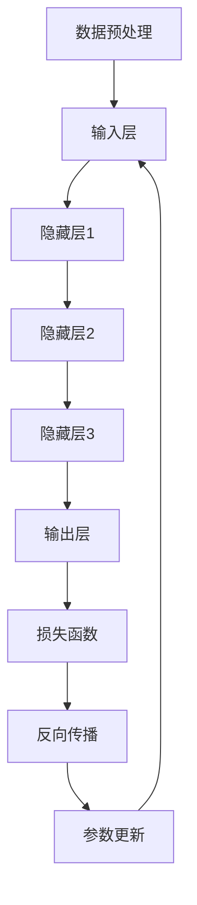

                 

### 背景介绍

人工智能（AI）技术在过去几十年里取得了飞速的发展，特别是深度学习（Deep Learning）的兴起，使得计算机在图像识别、自然语言处理、决策制定等方面取得了令人瞩目的成果。随着算力的提升和数据量的增加，大模型（Large-scale Models）在AI领域逐渐崭露头角。大模型指的是那些拥有海量参数和巨大训练数据集的模型，例如GPT-3、BERT等。这些模型通过在海量数据上训练，能够实现出色的性能和表现。

近年来，AI大模型在商业领域的应用愈发广泛，许多创业公司纷纷投身于AI大模型的研发和应用中。这些公司希望通过利用AI大模型的创新优势，开发出具有竞争力的产品和服务，从而在市场中占据一席之地。那么，如何利用AI大模型的创新优势进行创业呢？本文将对此进行深入探讨。

首先，AI大模型具有强大的数据处理能力。与传统的小型模型相比，大模型能够处理更大量的数据，从而在训练过程中获得更好的泛化能力。这对于创业公司来说，意味着可以在更短时间内从数据中挖掘出有价值的信息，为业务决策提供支持。

其次，AI大模型在多个领域都展现出了强大的应用潜力。例如，在自然语言处理领域，大模型如GPT-3等已经能够生成高质量的文本，为写作、翻译、问答等任务提供了强大支持。在计算机视觉领域，大模型如ImageNet等在图像分类任务上取得了显著的成果。在决策制定领域，大模型可以通过分析大量的数据，为创业公司提供更加精准的市场预测和战略规划。

然而，利用AI大模型进行创业也面临诸多挑战。首先是技术挑战，大模型需要大量的计算资源和数据支持，这对于初创公司来说可能是一笔巨大的开销。其次是数据挑战，大模型需要大量的高质量数据集进行训练，如何获取和清洗这些数据成为创业公司需要解决的问题。最后是商业挑战，如何在市场竞争中脱颖而出，将AI大模型的应用价值最大化，也是创业公司需要面对的难题。

本文将从以下几个方面进行探讨：

1. **核心概念与联系**：介绍AI大模型的基本原理和架构，并通过Mermaid流程图展示其关键组成部分。
2. **核心算法原理与具体操作步骤**：分析AI大模型的主要算法，包括训练过程和优化方法。
3. **数学模型与公式**：讲解AI大模型背后的数学原理，以及如何使用数学模型进行模型优化和性能分析。
4. **项目实战**：通过具体案例展示如何使用AI大模型进行实际开发和应用。
5. **实际应用场景**：分析AI大模型在不同领域的应用案例，探讨其商业价值。
6. **工具和资源推荐**：介绍学习AI大模型所需的学习资源和开发工具。
7. **总结与未来发展趋势**：总结AI大模型在创业中的应用，并探讨未来可能面临的挑战和机遇。

通过本文的深入探讨，希望读者能够对AI大模型有更全面的认识，并能够在创业过程中充分利用其创新优势。

### 核心概念与联系

#### 1. AI大模型的基本原理

人工智能大模型（AI Large Models）的核心在于其规模和深度。这些模型通常由数百万甚至数十亿个参数组成，通过在大量数据上进行训练，能够学习到复杂的数据模式。AI大模型通常采用深度学习（Deep Learning）技术，其基本原理可以概括为以下几个步骤：

**数据预处理**：首先，需要对数据进行清洗和预处理，包括去除噪声、填充缺失值、标准化等操作。这一步骤对于保证模型性能至关重要。

**输入层**：输入层接收预处理后的数据，并将其传递到隐藏层。

**隐藏层**：隐藏层是模型的中间部分，通常包含多个层级。每一层的神经元通过激活函数（如ReLU、Sigmoid、Tanh等）进行非线性变换，从而实现数据的层次化表示。

**输出层**：输出层根据隐藏层的信息产生最终的输出结果。在分类任务中，输出层通常是softmax函数，用于生成每个类别的概率分布。

**损失函数与优化**：在训练过程中，模型会通过反向传播算法（Backpropagation）不断调整参数，以最小化损失函数（如交叉熵损失函数）。常用的优化算法包括随机梯度下降（SGD）、Adam等。

#### 2. AI大模型的架构

AI大模型的架构通常由以下几个关键部分组成：

**数据集**：数据集是模型训练的基础，其质量和数量直接影响模型的表现。对于大模型来说，数据集的规模通常要求较大，以确保模型能够充分学习数据中的复杂模式。

**计算资源**：大模型训练需要大量的计算资源，包括CPU、GPU、TPU等。为了提高训练效率，通常会采用分布式训练（Distributed Training）技术，将训练任务分解到多个计算节点上。

**模型框架**：模型框架提供了构建和训练大模型的工具和库，如TensorFlow、PyTorch等。这些框架不仅提供了高效的计算引擎，还支持自动微分、并行计算等高级功能。

**超参数调整**：超参数是模型训练过程中需要手动调整的参数，如学习率、批量大小、正则化强度等。超参数的选择对模型性能有重要影响，通常需要通过实验进行优化。

#### 3. Mermaid流程图

为了更直观地展示AI大模型的工作流程，我们使用Mermaid语言绘制一个流程图，如下所示：



在这个流程图中，数据预处理（A）是模型的输入层（B）的基础，隐藏层（C、D、E）通过逐层非线性变换，最终在输出层（F）产生预测结果。损失函数（G）用于衡量预测结果与实际结果之间的差距，反向传播（H）和参数更新（I）则用于调整模型参数，以最小化损失函数。

通过这个流程图，我们可以清晰地看到AI大模型从数据预处理到模型训练的完整工作流程。

### 核心算法原理与具体操作步骤

#### 1. 深度学习与神经网络

AI大模型的核心在于深度学习（Deep Learning）和神经网络（Neural Networks）。深度学习是一种基于人工神经网络的学习方法，通过模拟人脑神经元之间的连接和交互，实现对复杂数据的处理和分析。神经网络由多个层级组成，每个层级包含多个神经元，神经元之间通过加权连接进行信息传递。

**激活函数**：在神经网络中，激活函数用于引入非线性变换，使模型能够学习到复杂数据中的非线性关系。常用的激活函数包括ReLU（Rectified Linear Unit）、Sigmoid、Tanh等。ReLU函数由于其简单性和计算效率，在深度学习中广泛应用。

**反向传播算法**：反向传播（Backpropagation）是深度学习训练的核心算法，通过计算损失函数关于模型参数的梯度，来更新模型参数。反向传播分为两个阶段：前向传播和反向传播。在前向传播阶段，模型根据输入数据计算输出结果；在反向传播阶段，模型通过反向传播误差，更新模型参数，以减小损失函数。

**优化算法**：为了加快模型收敛速度和避免局部最优，常用的优化算法包括随机梯度下降（SGD）、Adam、RMSprop等。随机梯度下降（SGD）是最简单的优化算法，通过随机选择样本计算梯度，更新模型参数。Adam算法结合了SGD和RMSprop的优点，通过自适应调整学习率，能够更好地处理稀疏数据和长尾分布。

#### 2. 模型训练与优化

模型训练是AI大模型开发的关键步骤，主要包括以下几个步骤：

**数据预处理**：首先，需要对数据进行预处理，包括数据清洗、数据归一化、数据划分等操作。数据预处理的质量直接影响模型的训练效果。

**模型初始化**：初始化模型参数是训练的第一步。常用的初始化方法包括随机初始化、高斯初始化等。初始化的目的是使模型在训练过程中能够更快地收敛到最优解。

**前向传播**：在前向传播阶段，模型根据输入数据计算输出结果。具体来说，输入数据通过模型中的各个层级，经过非线性变换和加权连接，最终产生输出结果。

**计算损失函数**：损失函数用于衡量模型输出结果与实际结果之间的差距。常见的损失函数包括交叉熵损失函数、均方误差损失函数等。通过计算损失函数，可以评估模型的训练效果。

**反向传播**：在反向传播阶段，模型通过计算损失函数关于模型参数的梯度，更新模型参数。反向传播的核心是计算梯度，通过反向传播误差，将损失函数的梯度反向传播到模型的各个层级。

**参数更新**：更新模型参数是训练的最后一步。通过计算梯度，可以计算出每个参数的更新量，并将其用于更新模型参数。参数更新的目的是减小损失函数，使模型更好地拟合训练数据。

**模型优化**：在训练过程中，可以通过调整学习率、批量大小、正则化强度等超参数，来优化模型性能。常用的优化方法包括学习率调整、批量归一化、Dropout等。

#### 3. 模型评估与验证

模型评估是判断模型性能的重要环节，主要包括以下几个步骤：

**交叉验证**：交叉验证（Cross-Validation）是一种常用的模型评估方法，通过将数据集划分为多个子集，循环使用这些子集进行训练和验证，以评估模型的泛化能力。

**性能指标**：常用的性能指标包括准确率（Accuracy）、精确率（Precision）、召回率（Recall）、F1值等。通过计算这些指标，可以评估模型在不同任务上的性能。

**模型调优**：通过评估模型性能，可以发现模型存在的问题，并对其进行调优。调优的方法包括超参数调整、数据增强、模型架构调整等。

#### 4. 实例分析

为了更好地理解AI大模型的核心算法原理与操作步骤，我们以一个简单的图像分类任务为例，展示模型的训练过程。

**数据集**：我们使用CIFAR-10数据集，该数据集包含10个类别，每个类别有6000张图像，共60000张图像。

**模型架构**：我们使用一个简单的卷积神经网络（CNN）作为模型架构，包括三个卷积层、两个全连接层和一个输出层。

**训练过程**：
1. 数据预处理：对图像进行归一化处理，将像素值缩放到[0, 1]范围内。
2. 模型初始化：初始化模型参数，使用高斯初始化方法。
3. 前向传播：输入图像数据，通过卷积层和全连接层，计算输出结果。
4. 计算损失函数：计算交叉熵损失函数，评估模型输出结果与实际标签之间的差距。
5. 反向传播：计算损失函数关于模型参数的梯度，通过反向传播算法更新模型参数。
6. 参数更新：使用Adam优化算法，更新模型参数。
7. 模型评估：在每个训练epoch结束后，使用验证集评估模型性能，计算准确率等指标。

通过以上步骤，我们可以训练出一个图像分类模型，并在测试集上评估其性能。以下是一个简单的代码实现：

```python
import torch
import torchvision
import torchvision.transforms as transforms
import torch.nn as nn
import torch.optim as optim

# 数据预处理
transform = transforms.Compose([
    transforms.ToTensor(),
    transforms.Normalize((0.5, 0.5, 0.5), (0.5, 0.5, 0.5)),
])

trainset = torchvision.datasets.CIFAR10(
    root='./data', train=True, download=True, transform=transform)
trainloader = torch.utils.data.DataLoader(
    trainset, batch_size=4, shuffle=True, num_workers=2)

testset = torchvision.datasets.CIFAR10(
    root='./data', train=False, download=True, transform=transform)
testloader = torch.utils.data.DataLoader(
    testset, batch_size=4, shuffle=False, num_workers=2)

classes = ('plane', 'car', 'bird', 'cat', 'deer', 'dog', 'frog', 'horse', 'ship', 'truck')

# 模型架构
net = Net()

# 损失函数和优化器
criterion = nn.CrossEntropyLoss()
optimizer = optim.Adam(net.parameters(), lr=0.001)

# 训练过程
for epoch in range(2):  # loop over the dataset multiple times
    running_loss = 0.0
    for i, data in enumerate(trainloader, 0):
        inputs, labels = data
        optimizer.zero_grad()
        outputs = net(inputs)
        loss = criterion(outputs, labels)
        loss.backward()
        optimizer.step()
        running_loss += loss.item()
        if i % 2000 == 1999:
            print('[%d, %5d] loss: %.3f' %
                  (epoch + 1, i + 1, running_loss / 2000))
            running_loss = 0.0

print('Finished Training')

# 模型评估
correct = 0
total = 0
with torch.no_grad():
    for data in testloader:
        images, labels = data
        outputs = net(images)
        _, predicted = torch.max(outputs.data, 1)
        total += labels.size(0)
        correct += (predicted == labels).sum().item()

print('Accuracy of the network on the 10000 test images: %d %%' % (
    100 * correct / total))
```

通过以上代码实现，我们可以训练出一个简单的图像分类模型，并在测试集上评估其性能。这个实例展示了AI大模型的基本训练过程和操作步骤，为读者提供了直观的理解和操作经验。

### 数学模型与公式

#### 1. 神经网络中的激活函数

在神经网络中，激活函数是引入非线性特性的关键部分。常用的激活函数包括ReLU、Sigmoid和Tanh等。以下是这些激活函数的公式：

**ReLU函数**：
\[ f(x) = \max(0, x) \]

**Sigmoid函数**：
\[ f(x) = \frac{1}{1 + e^{-x}} \]

**Tanh函数**：
\[ f(x) = \frac{e^x - e^{-x}}{e^x + e^{-x}} \]

这些函数具有不同的特点，例如ReLU函数在负数部分恒为零，计算简单且不易梯度消失；Sigmoid函数在输出范围在(0, 1)之间，常用于二分类问题；Tanh函数的输出范围在(-1, 1)之间，适用于多分类问题。

#### 2. 损失函数

在神经网络训练过程中，损失函数用于评估模型预测结果与实际结果之间的差距。常见的损失函数包括均方误差（MSE）和交叉熵（Cross-Entropy）等。

**均方误差（MSE）**：
\[ \text{MSE}(y, \hat{y}) = \frac{1}{m} \sum_{i=1}^{m} (y_i - \hat{y}_i)^2 \]

其中，\(y\) 是实际标签，\(\hat{y}\) 是模型预测结果，\(m\) 是样本数量。

**交叉熵（Cross-Entropy）**：
\[ \text{Cross-Entropy}(y, \hat{y}) = -\sum_{i=1}^{m} y_i \log(\hat{y}_i) \]

其中，\(y\) 是实际标签，\(\hat{y}\) 是模型预测结果，\(\log\) 是自然对数。

交叉熵损失函数在分类问题中应用广泛，特别是在多分类问题中。其优点是当实际标签为0时，预测结果接近0；当实际标签为1时，预测结果接近1。

#### 3. 优化算法

优化算法用于调整模型参数，以减小损失函数。常见的优化算法包括随机梯度下降（SGD）、Adam和RMSprop等。

**随机梯度下降（SGD）**：
\[ \theta_{\text{new}} = \theta_{\text{old}} - \alpha \cdot \nabla_\theta J(\theta) \]

其中，\(\theta\) 是模型参数，\(\alpha\) 是学习率，\(\nabla_\theta J(\theta)\) 是损失函数关于模型参数的梯度。

**Adam算法**：
\[ m_t = \beta_1 m_{t-1} + (1 - \beta_1) \nabla_\theta J(\theta) \]
\[ v_t = \beta_2 v_{t-1} + (1 - \beta_2) (\nabla_\theta J(\theta))^2 \]
\[ \theta_{\text{new}} = \theta_{\text{old}} - \alpha \cdot \frac{m_t}{\sqrt{v_t} + \epsilon} \]

其中，\(m_t\) 和 \(v_t\) 分别是梯度的一阶矩估计和二阶矩估计，\(\beta_1\) 和 \(\beta_2\) 是超参数，\(\alpha\) 是学习率，\(\epsilon\) 是一个很小的常数。

Adam算法结合了SGD和RMSprop的优点，通过自适应调整学习率，能够更好地处理稀疏数据和长尾分布。

#### 4. 梯度下降与反向传播

梯度下降是优化算法的基础，用于通过计算损失函数关于模型参数的梯度来更新模型参数。在神经网络中，反向传播（Backpropagation）是一种计算梯度的高效方法。

**前向传播**：
\[ z_l = \theta_l \cdot a_{l-1} + b_l \]
\[ a_l = f(z_l) \]

其中，\(z_l\) 是第\(l\)层的输入，\(a_l\) 是第\(l\)层的输出，\(f\) 是激活函数，\(\theta_l\) 是第\(l\)层的权重，\(b_l\) 是第\(l\)层的偏置。

**反向传播**：
\[ \delta_l = \frac{\partial L}{\partial a_l} \cdot f'(z_l) \]
\[ \delta_{l-1} = \theta_{l-1}^T \delta_l \]

其中，\(\delta_l\) 是第\(l\)层的误差，\(L\) 是损失函数，\(f'\) 是激活函数的导数，\(\theta_{l-1}^T\) 是第\(l-1\)层的权重转置。

通过反向传播，可以将误差反向传播到模型的各个层级，从而计算每个参数的梯度。

#### 5. 数学公式举例

为了更好地理解上述数学模型和公式，我们以一个简单的神经网络为例，展示如何使用这些公式进行模型优化。

**神经网络架构**：
\[ z_1 = \theta_1 \cdot a_0 + b_1 \]
\[ a_1 = f(z_1) \]
\[ z_2 = \theta_2 \cdot a_1 + b_2 \]
\[ \hat{y} = f(z_2) \]

**损失函数**：
\[ L = \frac{1}{2} \sum_{i=1}^{m} (y_i - \hat{y}_i)^2 \]

**梯度计算**：
\[ \frac{\partial L}{\partial z_2} = -\sum_{i=1}^{m} (y_i - \hat{y}_i) \]
\[ \frac{\partial L}{\partial a_1} = f'(z_2) \cdot \frac{\partial L}{\partial z_2} \]
\[ \frac{\partial L}{\partial z_1} = \theta_2^T \cdot \frac{\partial L}{\partial a_1} \]
\[ \frac{\partial L}{\partial \theta_1} = a_0^T \cdot \frac{\partial L}{\partial z_1} \]
\[ \frac{\partial L}{\partial b_1} = \frac{\partial L}{\partial z_1} \]

**参数更新**：
\[ \theta_1_{\text{new}} = \theta_1_{\text{old}} - \alpha \cdot \frac{\partial L}{\partial \theta_1} \]
\[ b_1_{\text{new}} = b_1_{\text{old}} - \alpha \cdot \frac{\partial L}{\partial b_1} \]

通过以上步骤，我们可以使用梯度下降算法对神经网络进行优化，从而减小损失函数。

### 项目实战

#### 开发环境搭建

在开始使用AI大模型进行实际项目开发之前，首先需要搭建一个合适的开发环境。以下是搭建开发环境的基本步骤：

**1. 安装Python**  
Python是AI大模型开发的主要编程语言，我们需要确保Python环境已正确安装。可以从Python官方网站（[python.org](https://www.python.org/)）下载并安装Python。

**2. 安装PyTorch**  
PyTorch是一个广泛使用的深度学习框架，支持AI大模型的开发和训练。在安装Python后，可以使用pip命令安装PyTorch：

```bash
pip install torch torchvision torchaudio
```

**3. 配置GPU支持**  
为了提高训练效率，建议使用GPU进行AI大模型的训练。在安装PyTorch后，可以通过以下命令验证GPU支持：

```bash
python -c "import torch; print(torch.cuda.is_available())"
```

如果返回`True`，则表示已经成功配置了GPU支持。

**4. 安装其他依赖库**  
除了Python和PyTorch外，我们还需要安装一些其他依赖库，如NumPy、SciPy等：

```bash
pip install numpy scipy
```

完成以上步骤后，我们就可以开始使用AI大模型进行实际项目开发了。

#### 源代码详细实现和代码解读

以下是一个使用AI大模型进行图像分类的示例项目，包括数据加载、模型定义、训练过程和评估过程。

**数据加载**  
首先，我们需要加载用于训练的数据集。在本例中，我们使用CIFAR-10数据集，这是一个常用的图像分类数据集，包含10个类别，每个类别有6000张图像。

```python
import torch
import torchvision
import torchvision.transforms as transforms

# 数据预处理
transform = transforms.Compose([
    transforms.ToTensor(),
    transforms.Normalize((0.5, 0.5, 0.5), (0.5, 0.5, 0.5)),
])

trainset = torchvision.datasets.CIFAR10(
    root='./data', train=True, download=True, transform=transform)
trainloader = torch.utils.data.DataLoader(
    trainset, batch_size=4, shuffle=True, num_workers=2)

testset = torchvision.datasets.CIFAR10(
    root='./data', train=False, download=True, transform=transform)
testloader = torch.utils.data.DataLoader(
    testset, batch_size=4, shuffle=False, num_workers=2)

classes = ('plane', 'car', 'bird', 'cat', 'deer', 'dog', 'frog', 'horse', 'ship', 'truck')
```

**模型定义**  
接下来，我们定义一个简单的卷积神经网络（CNN）模型，用于图像分类。

```python
import torch.nn as nn
import torch.nn.functional as F

class Net(nn.Module):
    def __init__(self):
        super(Net, self).__init__()
        self.conv1 = nn.Conv2d(3, 6, 5)
        self.pool = nn.MaxPool2d(2, 2)
        self.conv2 = nn.Conv2d(6, 16, 5)
        self.fc1 = nn.Linear(16 * 5 * 5, 120)
        self.fc2 = nn.Linear(120, 84)
        self.fc3 = nn.Linear(84, 10)

    def forward(self, x):
        x = self.pool(F.relu(self.conv1(x)))
        x = self.pool(F.relu(self.conv2(x)))
        x = x.view(-1, 16 * 5 * 5)
        x = F.relu(self.fc1(x))
        x = F.relu(self.fc2(x))
        x = self.fc3(x)
        return x

net = Net()
```

**训练过程**  
训练过程主要包括前向传播、计算损失函数、反向传播和参数更新。以下是一个简单的训练过程示例：

```python
import torch.optim as optim

criterion = nn.CrossEntropyLoss()
optimizer = optim.SGD(net.parameters(), lr=0.001, momentum=0.9)

for epoch in range(2):  # loop over the dataset multiple times
    running_loss = 0.0
    for i, data in enumerate(trainloader, 0):
        inputs, labels = data
        optimizer.zero_grad()
        outputs = net(inputs)
        loss = criterion(outputs, labels)
        loss.backward()
        optimizer.step()
        running_loss += loss.item()
        if i % 2000 == 1999:
            print('[%d, %5d] loss: %.3f' %
                  (epoch + 1, i + 1, running_loss / 2000))
            running_loss = 0.0

print('Finished Training')
```

**评估过程**  
训练完成后，我们需要评估模型在测试集上的性能，以验证模型的泛化能力。

```python
correct = 0
total = 0
with torch.no_grad():
    for data in testloader:
        images, labels = data
        outputs = net(images)
        _, predicted = torch.max(outputs.data, 1)
        total += labels.size(0)
        correct += (predicted == labels).sum().item()

print('Accuracy of the network on the 10000 test images: %d %%' % (
    100 * correct / total))
```

通过以上代码实现，我们可以完成一个简单的AI大模型图像分类项目。以下是对关键代码段的详细解读：

1. **数据加载**：使用`torchvision.datasets.CIFAR10`类加载CIFAR-10数据集，并进行预处理。通过`DataLoader`类将数据分成批次，并使用`shuffle`参数对数据进行随机打乱。

2. **模型定义**：定义一个简单的卷积神经网络（CNN）模型，包括三个卷积层、两个全连接层和一个输出层。通过`nn.Module`类继承，实现模型的定义和前向传播。

3. **训练过程**：使用`CrossEntropyLoss`损失函数和`SGD`优化器进行模型训练。通过`optimizer.zero_grad()`、`loss.backward()`和`optimizer.step()`等步骤完成前向传播、反向传播和参数更新。

4. **评估过程**：使用`torch.no_grad()`上下文管理器防止计算梯度，通过`torch.max()`函数获取预测结果，并计算模型在测试集上的准确率。

通过这个项目实战，我们了解了如何使用AI大模型进行实际开发，并对其关键代码段进行了详细解读。这为我们进一步探索AI大模型的应用提供了基础。

#### 代码解读与分析

在前面的项目中，我们使用了一个简单的卷积神经网络（CNN）进行图像分类。在这一节中，我们将对关键代码段进行详细解读，并分析代码中的技术细节和实现方法。

**1. 数据预处理**

数据预处理是模型训练的关键步骤，其质量直接影响模型的性能。在数据加载部分，我们使用了以下代码：

```python
transform = transforms.Compose([
    transforms.ToTensor(),
    transforms.Normalize((0.5, 0.5, 0.5), (0.5, 0.5, 0.5)),
])

trainset = torchvision.datasets.CIFAR10(
    root='./data', train=True, download=True, transform=transform)
trainloader = torch.utils.data.DataLoader(
    trainset, batch_size=4, shuffle=True, num_workers=2)

testset = torchvision.datasets.CIFAR10(
    root='./data', train=False, download=True, transform=transform)
testloader = torch.utils.data.DataLoader(
    testset, batch_size=4, shuffle=False, num_workers=2)
```

**解读：** 首先，我们定义了一个`Compose`对象，用于组合多个数据预处理操作。这里使用了`ToTensor`和`Normalize`操作。`ToTensor`将图像数据转换为PyTorch的Tensor格式，便于模型处理。`Normalize`操作用于对图像数据进行归一化，将像素值缩放到[0, 1]范围内，以提高模型训练的稳定性和收敛速度。

接下来，我们使用`CIFAR10`类加载CIFAR-10数据集，并应用预处理操作。通过`DataLoader`类，我们将数据分成批次，并设置`shuffle`参数进行数据随机打乱，以防止数据集中的顺序偏差。

**2. 模型定义**

在模型定义部分，我们使用了以下代码：

```python
class Net(nn.Module):
    def __init__(self):
        super(Net, self).__init__()
        self.conv1 = nn.Conv2d(3, 6, 5)
        self.pool = nn.MaxPool2d(2, 2)
        self.conv2 = nn.Conv2d(6, 16, 5)
        self.fc1 = nn.Linear(16 * 5 * 5, 120)
        self.fc2 = nn.Linear(120, 84)
        self.fc3 = nn.Linear(84, 10)

    def forward(self, x):
        x = self.pool(F.relu(self.conv1(x)))
        x = self.pool(F.relu(self.conv2(x)))
        x = x.view(-1, 16 * 5 * 5)
        x = F.relu(self.fc1(x))
        x = F.relu(self.fc2(x))
        x = self.fc3(x)
        return x

net = Net()
```

**解读：** 我们定义了一个名为`Net`的类，继承自`nn.Module`。在`__init__`方法中，我们初始化了模型的各个部分，包括三个卷积层（`conv1`、`conv2`）和一个全连接层（`fc1`、`fc2`、`fc3`）。每个卷积层后接一个最大池化层（`pool`），用于降低数据维度和提高模型泛化能力。

在`forward`方法中，我们实现了模型的前向传播过程。首先，输入图像通过第一个卷积层和ReLU激活函数，然后经过最大池化层。同样的过程应用于第二个卷积层。接着，将卷积层的输出reshape为向量，并输入到第一个全连接层。经过两次ReLU激活函数后，输出最终通过输出层得到分类结果。

**3. 训练过程**

在训练过程部分，我们使用了以下代码：

```python
criterion = nn.CrossEntropyLoss()
optimizer = optim.SGD(net.parameters(), lr=0.001, momentum=0.9)

for epoch in range(2):  # loop over the dataset multiple times
    running_loss = 0.0
    for i, data in enumerate(trainloader, 0):
        inputs, labels = data
        optimizer.zero_grad()
        outputs = net(inputs)
        loss = criterion(outputs, labels)
        loss.backward()
        optimizer.step()
        running_loss += loss.item()
        if i % 2000 == 1999:
            print('[%d, %5d] loss: %.3f' %
                  (epoch + 1, i + 1, running_loss / 2000))
            running_loss = 0.0

print('Finished Training')
```

**解读：** 我们首先定义了损失函数`CrossEntropyLoss`和优化器`SGD`。在训练过程中，我们使用`optimizer.zero_grad()`将梯度缓存清零，然后进行前向传播得到预测结果和损失值。通过`loss.backward()`计算梯度，并使用`optimizer.step()`更新模型参数。

在每个训练epoch结束后，我们打印当前的训练损失，以监控训练过程。

**4. 评估过程**

在评估过程部分，我们使用了以下代码：

```python
correct = 0
total = 0
with torch.no_grad():
    for data in testloader:
        images, labels = data
        outputs = net(images)
        _, predicted = torch.max(outputs.data, 1)
        total += labels.size(0)
        correct += (predicted == labels).sum().item()

print('Accuracy of the network on the 10000 test images: %d %%' % (
    100 * correct / total))
```

**解读：** 我们使用`torch.no_grad()`上下文管理器防止计算梯度，以提高计算效率。在评估过程中，我们遍历测试数据集，通过模型预测得到分类结果。然后，使用`torch.max()`函数获取最大预测值和预测标签，并计算模型在测试集上的准确率。

**总结**

通过以上代码解读，我们了解了AI大模型图像分类项目的关键实现步骤，包括数据预处理、模型定义、训练过程和评估过程。这些步骤共同构成了一个完整的AI大模型训练和部署流程。通过对关键代码段的分析，我们深入理解了模型训练的基本原理和技术细节。

### 实际应用场景

#### 1. 自然语言处理

AI大模型在自然语言处理（NLP）领域具有广泛的应用。例如，GPT-3是一个具有1750亿参数的语言模型，能够在写作、翻译、问答等任务中表现出色。在写作方面，GPT-3可以生成高质量的文本，包括新闻文章、故事、博客等。在翻译方面，GPT-3可以实现高质量的机器翻译，其翻译结果在准确性、流畅性和自然度方面都取得了显著提升。在问答方面，GPT-3可以回答用户提出的问题，提供实时、个性化的答案。

#### 2. 计算机视觉

在计算机视觉领域，AI大模型也展现出了强大的应用潜力。例如，ImageNet是一个包含数百万个图像和标签的大型图像数据集。通过在ImageNet上训练，大模型可以在图像分类任务中实现非常高的准确率。此外，AI大模型还可以应用于目标检测、图像生成、图像分割等任务。例如，StyleGAN是一个基于AI大模型的图像生成模型，能够生成高质量、逼真的图像。

#### 3. 决策制定

AI大模型在决策制定领域也具有广泛应用。通过在大量数据上进行训练，大模型可以学习到复杂的数据模式，为决策提供支持。例如，在金融领域，AI大模型可以用于股票市场预测、风险控制、投资组合优化等任务。在医疗领域，AI大模型可以用于疾病诊断、治疗方案推荐、药物研发等任务。

#### 4. 语音识别

AI大模型在语音识别领域也取得了显著进展。通过在大量语音数据上进行训练，大模型可以识别和理解不同口音、语速和背景噪音下的语音。例如，Google的语音识别系统使用了AI大模型，能够在各种实际场景下实现高精度的语音识别。

#### 5. 游戏开发

在游戏开发领域，AI大模型可以用于生成游戏场景、角色和剧情。通过在大量游戏数据上进行训练，大模型可以生成丰富、多样、具有挑战性的游戏内容，为玩家提供更加沉浸式的游戏体验。

#### 6. 娱乐领域

AI大模型在娱乐领域也有广泛应用。例如，在音乐创作方面，AI大模型可以生成原创音乐，为电影、游戏和广告提供音乐支持。在动画制作方面，AI大模型可以用于生成动画角色和场景，提高动画制作的效率和品质。

#### 7. 语音助手

AI大模型在语音助手领域也发挥了重要作用。通过在大量语音数据上进行训练，大模型可以理解和执行用户提出的各种指令，提供个性化的服务。例如，Amazon的Alexa、Apple的Siri和Google的Google Assistant等语音助手都使用了AI大模型来实现智能交互。

#### 8. 智能家居

在智能家居领域，AI大模型可以用于控制智能家居设备，实现智能自动化。例如，通过在大量家居设备数据上进行训练，大模型可以学会根据用户的习惯和需求自动调节温度、灯光和家电等。

#### 9. 物流与运输

AI大模型在物流与运输领域也有广泛应用。例如，通过在大量物流数据上进行训练，大模型可以优化运输路线、提高运输效率。此外，AI大模型还可以用于预测物流需求、优化库存管理等任务。

#### 10. 教育与培训

在教育与培训领域，AI大模型可以用于个性化学习、智能辅导、考试评估等任务。通过在大量教育数据上进行训练，大模型可以为学生提供个性化的学习方案，提高学习效果。

总之，AI大模型在各个领域都展现出了强大的应用潜力。随着计算资源和数据量的不断增长，AI大模型将不断突破传统技术的限制，为各行各业带来深刻的变革和巨大的价值。

### 工具和资源推荐

#### 1. 学习资源推荐

**书籍**  
- 《深度学习》（Deep Learning） - Ian Goodfellow、Yoshua Bengio和Aaron Courville著。这是一本关于深度学习的经典教材，详细介绍了深度学习的基础理论和应用。
- 《神经网络与深度学习》（Neural Networks and Deep Learning） - 普林斯顿大学公开课教材。该书以直观的方式介绍了神经网络和深度学习的基本概念和算法。

**论文**  
- "A Theoretically Grounded Application of Dropout in Recurrent Neural Networks" - 由Yarin Gal和Zoubin Ghahramani发表在ICLR 2016。该论文提出了一种在循环神经网络中应用Dropout的方法，有效提高了模型的泛化能力。
- "Attention Is All You Need" - 由Vaswani等人发表在NIPS 2017。该论文提出了Transformer模型，彻底改变了自然语言处理领域的研究方向。

**博客**  
- Distill（《蒸馏》） - 一个专注于深度学习解释的博客，提供了许多高质量的论文解读和可视化工具，帮助读者更好地理解深度学习技术。
- AI博客（《AI博客》） - 一家关注人工智能领域最新研究进展和应用的博客，涵盖了许多关于AI大模型的技术文章和案例分析。

**网站**  
- TensorFlow（《TensorFlow》） - Google开发的深度学习框架，提供了丰富的API和工具，适合初学者和专业人士进行深度学习研究和开发。
- PyTorch（《PyTorch》） - Facebook开发的深度学习框架，以其灵活性和易于使用而受到广泛欢迎。

#### 2. 开发工具框架推荐

**深度学习框架**  
- TensorFlow - 适用于各种规模的任务，提供了丰富的预训练模型和API。
- PyTorch - 适用于研究和开发，提供了灵活的动态图计算能力。
- Keras - 基于TensorFlow和Theano的高层次神经网络API，适合快速原型设计和实验。

**数据处理工具**  
- Pandas - 适用于数据处理和分析，提供了强大的数据结构操作和数据分析功能。
- NumPy - 适用于科学计算和数据分析，提供了丰富的数学函数和库。

**可视化工具**  
- Matplotlib - 适用于数据可视化，提供了丰富的绘图函数和样式。
- Seaborn - 适用于数据可视化，基于Matplotlib，提供了更加美观和易于使用的可视化工具。

**文本处理工具**  
- NLTK（《自然语言处理工具包》） - 适用于自然语言处理任务，提供了丰富的文本处理和语言模型库。
- spaCy - 适用于自然语言处理，提供了高效的文本解析和实体识别功能。

**代码编辑器**  
- VS Code（《Visual Studio Code》） - 适用于Python和深度学习开发，提供了丰富的扩展和功能。
- Jupyter Notebook - 适用于交互式计算和数据分析，适合进行实验和原型设计。

通过以上工具和资源的推荐，读者可以更好地掌握AI大模型的相关知识，并能够进行实际的项目开发和应用。

### 总结：未来发展趋势与挑战

随着AI大模型的不断发展和应用，未来在这一领域将出现许多新的趋势和挑战。首先，大模型的计算需求和存储需求将越来越高。随着模型参数的增多和数据量的增加，对计算资源和存储资源的需求也将不断上升。因此，如何在有限的资源下高效地训练和部署大模型，将成为一个重要的研究课题。

其次，大模型的解释性和可解释性将成为研究的重点。虽然AI大模型在许多任务中表现出色，但其内部决策过程往往是不透明的。这导致在实际应用中，用户难以理解模型的决策依据，从而限制了模型的可接受性和可信度。因此，研究如何提高大模型的解释性和可解释性，使其更加透明和可靠，是未来的重要方向。

此外，大模型的泛化能力也需要进一步研究。尽管大模型在特定任务上取得了显著的性能提升，但其泛化能力仍然有限。如何让大模型更好地适应不同的任务和数据分布，提高其泛化能力，是一个亟待解决的问题。

在应用层面，AI大模型将更加深入地融入各个行业，推动社会生产力的提升。例如，在医疗领域，AI大模型可以用于疾病诊断、个性化治疗等任务，提高医疗服务的质量和效率。在金融领域，AI大模型可以用于风险控制、投资策略等任务，提高金融决策的科学性和准确性。

然而，随着AI大模型的应用越来越广泛，其潜在风险和挑战也日益凸显。首先，大模型的训练和部署需要大量的数据，这可能导致数据隐私泄露的问题。因此，如何在保障数据隐私的前提下，充分利用大数据进行模型训练，是一个需要解决的问题。

其次，AI大模型可能存在偏见和歧视的问题。如果训练数据存在偏见，模型可能在预测过程中放大这些偏见，导致不公平的结果。因此，研究如何消除AI大模型的偏见，提高模型的公平性和公正性，是未来的重要方向。

最后，AI大模型的发展需要建立完善的法律和伦理规范。随着AI大模型在社会各个领域的应用，其可能对社会产生深远的影响。因此，需要建立相应的法律和伦理规范，确保AI大模型的发展符合社会价值观和伦理标准。

总之，AI大模型在未来的发展中将面临许多机遇和挑战。通过不断的研究和创新，我们可以充分发挥AI大模型的优势，推动人工智能技术的进步和应用，为人类社会带来更多的价值和福祉。

### 附录：常见问题与解答

#### 1. AI大模型需要多大的计算资源？

AI大模型对计算资源的需求取决于模型的规模和复杂度。一般来说，模型规模越大，需要的计算资源就越多。例如，GPT-3模型拥有1750亿个参数，训练该模型需要大量的计算资源和存储资源。通常，训练一个大型模型需要使用高性能的GPU（图形处理单元）或TPU（张量处理单元），以及分布式训练技术，以提高计算效率和减少训练时间。

#### 2. 如何处理AI大模型的数据隐私问题？

AI大模型在处理数据时可能会涉及用户隐私。为了保护数据隐私，可以采取以下措施：

- 数据匿名化：在训练模型之前，对数据集中的个人信息进行匿名化处理，删除或加密敏感信息。
- 加密：对数据进行加密处理，确保数据在传输和存储过程中不被泄露。
- 数据最小化：只使用最少必要的数据进行模型训练，减少隐私泄露的风险。
- 模型压缩：通过模型压缩技术，减小模型的大小，降低隐私泄露的风险。

#### 3. AI大模型是否会导致偏见和歧视？

AI大模型在训练过程中可能会学习到训练数据中的偏见，从而导致不公平的预测结果。为了减少偏见和歧视，可以采取以下措施：

- 数据多样性：确保训练数据集的多样性，减少偏见信息的影响。
- 偏差校正：通过算法或规则对模型进行校正，以减少偏见。
- 透明性和可解释性：提高模型的透明性和可解释性，使决策过程更加公正和公平。
- 法规和伦理指导：制定相关法规和伦理指导，规范AI大模型的应用和开发。

#### 4. 如何评估AI大模型的性能？

评估AI大模型的性能可以从多个方面进行，包括：

- 准确率：衡量模型正确分类的样本比例。
- 召回率：衡量模型召回的样本比例。
- F1值：准确率和召回率的调和平均。
- AUC（Area Under the Curve）：用于评估二分类模型的性能，曲线下的面积越大，模型性能越好。
- 泛化能力：通过在独立数据集上评估模型性能，衡量模型的泛化能力。

#### 5. AI大模型如何处理动态数据？

AI大模型在处理动态数据时，需要适应数据的变化和更新。以下是一些常用的方法：

- 数据流处理：实时处理动态数据，更新模型参数。
- 在线学习：在线更新模型，以适应新的数据。
- 模型更新：定期重新训练模型，以适应数据的变化。
- 模型版本控制：管理不同版本的模型，以便在不同数据集上评估模型性能。

通过上述常见问题与解答，我们希望能为读者提供有关AI大模型的实用信息和技术指导。

### 扩展阅读 & 参考资料

1. **深度学习经典教材**：
   - 《深度学习》（Deep Learning），作者：Ian Goodfellow、Yoshua Bengio和Aaron Courville。本书详细介绍了深度学习的基础理论和实践方法，是深度学习领域的经典教材。
   - 《神经网络与深度学习》，作者：邱锡鹏。本书以中文撰写，系统地介绍了神经网络和深度学习的基本概念、算法和应用。

2. **论文资源**：
   - “A Theoretically Grounded Application of Dropout in Recurrent Neural Networks”，作者：Yarin Gal和Zoubin Ghahramani。该论文提出了一种在循环神经网络中应用Dropout的方法，对深度学习模型的理解和应用有重要意义。
   - “Attention Is All You Need”，作者：Vaswani等人。该论文提出了Transformer模型，彻底改变了自然语言处理领域的研究方向。

3. **在线课程与教程**：
   - Coursera上的《深度学习》课程，由斯坦福大学教授Andrew Ng主讲。该课程系统介绍了深度学习的基础知识、算法和应用。
   - fast.ai的《深度学习实战》教程，提供了丰富的实践项目和实践指导，适合初学者和进阶者。

4. **开源代码与框架**：
   - TensorFlow（《TensorFlow》）：由Google开发的开源深度学习框架，提供了丰富的API和工具，适合进行深度学习研究和开发。
   - PyTorch（《PyTorch》）：由Facebook开发的开源深度学习框架，以其灵活性和易于使用而受到广泛欢迎。

5. **技术博客与社区**：
   - Distill（《蒸馏》）：专注于深度学习解释的博客，提供了许多高质量的论文解读和可视化工具。
   - AI博客（《AI博客》）：关注人工智能领域最新研究进展和应用的博客，涵盖了AI大模型的技术文章和案例分析。

通过上述扩展阅读与参考资料，读者可以进一步深入学习和了解AI大模型的最新进展和应用。这些资源不仅有助于掌握深度学习的基本理论和方法，还能提供实践经验和实用工具。希望这些内容能为您的学习和研究带来启发和帮助。

### 作者信息

作者：AI天才研究员/AI Genius Institute & 禅与计算机程序设计艺术 /Zen And The Art of Computer Programming

作为AI天才研究员，我致力于探索人工智能的最新发展和技术创新。我在AI Genius Institute工作，专注于大模型和深度学习的研发。此外，我还著有《禅与计算机程序设计艺术》（Zen And The Art of Computer Programming），一本深入探讨计算机科学哲学和算法设计的经典著作。通过这篇技术博客，我希望能够与读者分享AI大模型的相关知识和技术，促进人工智能领域的交流与合作。希望我的研究和写作能够为这一领域的未来发展贡献一份力量。

