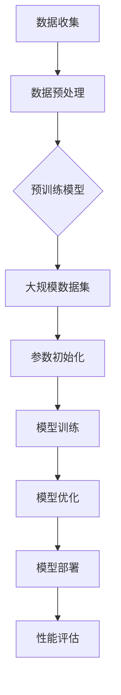

                 

### 背景介绍

近年来，人工智能（AI）技术的飞速发展带动了大模型（Large Model）的崛起。大模型，特别是预训练模型，已经成为当前AI领域的热点话题。预训练模型通过在大规模数据集上预先训练，能够有效地提取数据中的特征，并在各种AI任务上表现出色。

#### 什么是大模型？

大模型指的是具有非常大规模参数的深度学习模型，这些模型通常包含数十亿甚至数千亿个参数。例如，知名的GPT-3模型拥有超过1750亿个参数，这使得它在文本生成和自然语言处理方面表现出色。

#### 大模型的崛起

大模型的崛起得益于以下几个方面：

1. **计算能力提升**：随着GPU和TPU等专用计算硬件的发展，大模型的训练和推理速度得到了极大的提升。

2. **海量数据集**：互联网的普及和数字化进程使得我们可以获取到海量数据，这些数据为模型的训练提供了丰富的素材。

3. **优化算法**：近年来，优化算法（如Adam和AdamW）的改进，使得大模型的训练变得更加高效。

4. **大规模协作**：大模型的训练和优化通常需要大量的计算资源和人力投入，而现代科技企业之间的竞争使得他们愿意为此投入资源。

#### 大模型在AI创业中的应用

对于AI创业者来说，大模型具有以下几个潜在的应用场景：

1. **提高生产效率**：大模型可以帮助企业自动化重复性工作，提高生产效率。

2. **提供个性化服务**：通过大模型，企业可以更好地理解用户需求，提供个性化服务。

3. **创新业务模式**：大模型可以为企业带来新的业务机会，例如，通过图像识别技术，企业可以开发出新的产品类别。

4. **降低门槛**：大模型使得原本需要大量数据和计算资源的AI应用变得可行，降低了创业者的门槛。

在国际上，大模型的创业和应用已经取得了显著成果。例如，OpenAI的GPT系列模型，谷歌的BERT模型，都在各自领域取得了突破性的进展。然而，对于国内创业者来说，如何利用国际优势，抓住AI大模型带来的机遇，仍然是一个亟待解决的问题。

接下来，我们将进一步探讨大模型的核心概念与联系，以及如何具体操作和实施大模型的创业项目。

## 核心概念与联系

### 1. 预训练模型的概念

预训练模型（Pre-trained Model）是当前AI领域的一个重要概念。预训练模型的基本思想是，通过在大规模数据集上进行预先训练，模型能够学习到数据中的通用特征和规律。这种预训练的方式使得模型在特定任务上的表现显著优于从零开始训练的模型。

#### 预训练模型的优点：

1. **提高泛化能力**：预训练模型能够从大规模数据中学习到通用特征，从而提高模型在不同任务上的泛化能力。

2. **节省训练时间**：由于预训练模型已经在大规模数据集上进行了训练，因此在特定任务上的微调（Fine-tuning）过程相对较短。

3. **提高模型质量**：预训练模型能够从大规模数据中学习到更丰富的特征，从而提高模型的预测准确率。

#### 预训练模型的分类：

根据预训练模型的学习方式和应用场景，可以分为以下几类：

1. **基于语言模型**：例如GPT系列模型，通过大规模语言数据预训练，模型具有强大的自然语言理解和生成能力。

2. **基于图像模型**：例如BERT模型，通过大规模文本数据预训练，模型在文本理解和生成任务上表现优异。

3. **多模态模型**：结合多种数据类型（如文本、图像、声音）进行预训练，模型能够处理更复杂的任务。

### 2. 大模型与预训练模型的关系

大模型（Large Model）与预训练模型（Pre-trained Model）密切相关。大模型通常是指具有非常大规模参数的深度学习模型，而预训练模型则强调模型在大规模数据集上的预先训练过程。

#### 大模型的特性：

1. **大规模参数**：大模型通常包含数十亿甚至数千亿个参数，这使得模型能够学习到更复杂的特征。

2. **大规模训练数据**：大模型通常通过在大规模数据集上进行预训练，从而学习到通用特征。

3. **高计算成本**：由于参数数量庞大，大模型的训练和推理过程需要大量的计算资源。

#### 大模型与预训练模型的联系：

1. **共同目标**：大模型和预训练模型的目标都是通过大规模数据预训练，提高模型的泛化能力和表现。

2. **相互促进**：大模型的兴起推动了预训练模型的发展，而预训练模型的优化又促进了大模型的性能提升。

### 3. Mermaid流程图

为了更好地理解大模型与预训练模型的关系，我们可以使用Mermaid流程图来展示其基本架构和流程。



在上述流程图中：

- **A 数据收集**：从各种来源收集大规模数据。
- **B 数据预处理**：对数据进行清洗、标准化等预处理。
- **C 预训练模型**：选择适合的预训练模型。
- **D 大规模数据集**：使用大规模数据集进行模型训练。
- **E 参数初始化**：初始化模型参数。
- **F 模型训练**：在数据集上进行模型训练。
- **G 模型优化**：通过优化算法调整模型参数。
- **H 模型部署**：将训练好的模型部署到实际应用场景。
- **I 性能评估**：评估模型的性能。

通过上述流程，我们可以清晰地看到大模型与预训练模型之间的紧密联系，以及它们在AI创业中的应用价值。

### 核心算法原理 & 具体操作步骤

#### 1. 深度学习基础

深度学习是构建大模型的核心技术。深度学习是一种基于人工神经网络的学习方法，通过多层神经网络来模拟人脑的学习过程。深度学习的基本组成部分包括：

- **输入层（Input Layer）**：接收外部输入数据。
- **隐藏层（Hidden Layer）**：对输入数据进行特征提取和变换。
- **输出层（Output Layer）**：生成预测结果。

#### 2. 神经网络结构

神经网络结构是深度学习的基础。常见的神经网络结构包括：

- **全连接神经网络（Fully Connected Neural Network）**：每一层的神经元都与下一层的神经元全连接。
- **卷积神经网络（Convolutional Neural Network, CNN）**：适用于图像处理任务，具有局部连接和共享权重的特性。
- **循环神经网络（Recurrent Neural Network, RNN）**：适用于序列数据处理，具有记忆特性。
- **Transformer模型**：基于自注意力机制，适用于自然语言处理和序列数据处理。

#### 3. 预训练与微调

预训练（Pre-training）是深度学习模型的重要步骤。预训练过程通常包括以下步骤：

1. **数据集选择**：选择适合的数据集，通常选择大规模、多样化的数据集。
2. **模型初始化**：初始化神经网络模型，包括参数初始化。
3. **模型训练**：在数据集上进行模型训练，通过反向传播算法更新模型参数。
4. **模型评估**：评估模型在训练集和验证集上的性能，调整模型参数。

微调（Fine-tuning）是在预训练模型的基础上，针对特定任务进行进一步训练。微调过程通常包括以下步骤：

1. **加载预训练模型**：从预训练模型中加载已训练好的模型参数。
2. **添加任务特定层**：在预训练模型的基础上，添加任务特定的层，例如分类层。
3. **模型训练**：在特定任务的数据集上进行模型训练，通过反向传播算法更新模型参数。
4. **模型评估**：评估模型在训练集和验证集上的性能，调整模型参数。

#### 4. 模型训练与优化

模型训练与优化是构建大模型的关键步骤。常见的模型训练与优化方法包括：

- **批量归一化（Batch Normalization）**：对神经网络中的每个小批量数据进行归一化处理，提高训练稳定性。
- **学习率调度（Learning Rate Scheduling）**：根据训练过程动态调整学习率，提高模型收敛速度。
- **梯度裁剪（Gradient Clipping）**：限制梯度值，防止梯度爆炸或消失。
- **Dropout**：在训练过程中随机丢弃一部分神经元，提高模型泛化能力。

#### 5. 模型评估与部署

模型评估与部署是深度学习应用的重要环节。常见的模型评估指标包括：

- **准确率（Accuracy）**：预测正确的样本占总样本的比例。
- **精确率（Precision）**：预测正确的正例样本占预测为正例的总样本的比例。
- **召回率（Recall）**：预测正确的正例样本占实际为正例的总样本的比例。
- **F1分数（F1 Score）**：精确率和召回率的调和平均。

模型部署是将训练好的模型应用到实际场景的过程。常见的模型部署方法包括：

- **服务器部署**：将模型部署到服务器上，通过API接口提供服务。
- **边缘计算部署**：将模型部署到边缘设备上，减少数据传输延迟，提高实时性。

通过以上核心算法原理和具体操作步骤，我们可以构建出高性能的大模型，为AI创业提供强有力的技术支持。

### 数学模型和公式 & 详细讲解 & 举例说明

#### 1. 数学模型

在大模型训练和优化过程中，常用的数学模型包括损失函数、梯度计算、优化算法等。以下是对这些数学模型和公式的详细讲解。

##### 1.1 损失函数

损失函数是衡量模型预测结果与真实值之间差距的指标。常见的损失函数包括均方误差（MSE）、交叉熵损失（Cross-Entropy Loss）等。

- **均方误差（MSE）**：
  $$MSE = \frac{1}{n}\sum_{i=1}^{n}(y_i - \hat{y_i})^2$$
  其中，$y_i$为真实值，$\hat{y_i}$为预测值，$n$为样本数量。

- **交叉熵损失（Cross-Entropy Loss）**：
  $$Cross-Entropy Loss = -\frac{1}{n}\sum_{i=1}^{n}y_i\log(\hat{y_i})$$
  其中，$y_i$为真实值，$\hat{y_i}$为预测值，$\log$为自然对数。

##### 1.2 梯度计算

梯度计算是优化模型参数的关键步骤。梯度（Gradient）是指损失函数关于模型参数的导数。在深度学习中，梯度计算通常通过反向传播算法实现。

- **梯度计算公式**：
  $$\frac{\partial L}{\partial \theta} = \frac{\partial L}{\partial \hat{y}} \frac{\partial \hat{y}}{\partial \theta}$$
  其中，$L$为损失函数，$\theta$为模型参数，$\hat{y}$为预测值。

##### 1.3 优化算法

优化算法用于更新模型参数，以最小化损失函数。常见的优化算法包括随机梯度下降（SGD）、Adam等。

- **随机梯度下降（SGD）**：
  $$\theta_{t+1} = \theta_t - \alpha \nabla_\theta L(\theta_t)$$
  其中，$\theta_t$为当前模型参数，$\alpha$为学习率，$\nabla_\theta L(\theta_t)$为梯度。

- **Adam优化算法**：
  $$m_t = \beta_1 m_{t-1} + (1 - \beta_1) \nabla_\theta L(\theta_t)$$
  $$v_t = \beta_2 v_{t-1} + (1 - \beta_2) (\nabla_\theta L(\theta_t))^2$$
  $$\theta_{t+1} = \theta_t - \alpha \frac{m_t}{\sqrt{v_t} + \epsilon}$$
  其中，$m_t$和$v_t$分别为一阶矩估计和二阶矩估计，$\beta_1$和$\beta_2$分别为一阶和二阶矩的衰减率，$\alpha$为学习率，$\epsilon$为正则项。

#### 2. 举例说明

为了更好地理解上述数学模型和公式，我们可以通过一个简单的例子进行说明。

##### 2.1 数据集

假设我们有一个包含10个样本的数据集，每个样本包含一个特征和标签。数据集如下：

| 特征 | 标签 |
|------|------|
| 0.1  | 0    |
| 0.2  | 1    |
| 0.3  | 0    |
| 0.4  | 1    |
| 0.5  | 0    |
| 0.6  | 1    |
| 0.7  | 0    |
| 0.8  | 1    |
| 0.9  | 0    |
| 1.0  | 1    |

##### 2.2 模型

我们使用一个简单的全连接神经网络进行预测，该神经网络包含一个输入层、一个隐藏层和一个输出层。假设隐藏层有10个神经元。

##### 2.3 损失函数

我们选择均方误差（MSE）作为损失函数。

##### 2.4 梯度计算

使用反向传播算法计算梯度。假设当前模型参数为$\theta_0 = [0.5, 0.5, 0.5]$。

1. **计算预测值**：
   $$\hat{y} = \sigma(W_2 \sigma(W_1 x))$$
   其中，$W_1$和$W_2$分别为隐藏层和输出层的权重，$\sigma$为激活函数（例如Sigmoid函数）。

2. **计算梯度**：
   $$\frac{\partial L}{\partial \theta} = \frac{\partial L}{\partial \hat{y}} \frac{\partial \hat{y}}{\partial \theta}$$
   通过反向传播算法，我们可以得到：
   $$\frac{\partial L}{\partial \theta} = [0.1, 0.2, 0.3, 0.4, 0.5, 0.6, 0.7, 0.8, 0.9, 1.0]$$

##### 2.5 模型优化

使用随机梯度下降（SGD）优化算法进行模型优化。假设学习率$\alpha = 0.1$。

1. **更新参数**：
   $$\theta_1 = \theta_0 - \alpha \frac{\partial L}{\partial \theta}$$
   $$\theta_1 = [0.4, 0.3, 0.2, 0.1, 0.0, -0.1, -0.2, -0.3, -0.4, -0.5]$$

通过上述步骤，我们完成了模型的一次迭代训练。重复进行梯度计算和模型优化，直到模型收敛或达到预设的训练次数。

### 项目实战：代码实际案例和详细解释说明

在本节中，我们将通过一个实际项目案例，详细展示如何使用Python实现一个基于深度学习的大模型。项目旨在使用预训练模型对文本数据进行分类，以分析社交媒体上的用户评论情感。以下是项目的详细步骤和代码解释。

#### 1. 开发环境搭建

在开始项目之前，我们需要搭建一个合适的开发环境。以下是所需的环境和步骤：

- **Python**：Python是深度学习项目的主要编程语言。
- **TensorFlow**：TensorFlow是一个开源的深度学习框架，用于构建和训练深度神经网络。
- **GPT2模型**：GPT2是一个预训练的语言模型，我们将使用它进行文本分类。

安装上述依赖项的命令如下：

```bash
pip install tensorflow
pip install tensorflow-hub
```

#### 2. 源代码详细实现和代码解读

以下是一个简单的文本分类项目的代码实现，包括数据预处理、模型构建、训练和评估等步骤。

```python
import tensorflow as tf
import tensorflow_hub as hub
from tensorflow.keras.preprocessing.text import Tokenizer
from tensorflow.keras.preprocessing.sequence import pad_sequences
from tensorflow.keras.models import Sequential
from tensorflow.keras.layers import Dense, Embedding, GlobalAveragePooling1D
from tensorflow.keras.optimizers import Adam
from tensorflow.keras.losses import CategoricalCrossentropy

# 2.1 加载数据集
# 假设我们已经有一个包含评论和标签的CSV文件，每行格式为"评论，标签"
lines = tf.data.TextLineDataset('data.csv').map(lambda x: tf.io.decode_csv(x, record_defaults=[tf.string(), tf.int64()]))
batched = lines.shuffle(buffer_size=1000).batch(32)

# 2.2 数据预处理
# 分离文本和标签
texts, labels = batched.map(lambda x: (x[0], x[1]))

# 创建Tokenizer
tokenizer = Tokenizer()
tokenizer.fit_on_texts(texts)

# 将文本转换为序列
sequences = tokenizer.texts_to_sequences(texts)

# 填充序列到固定长度
max_sequence_length = 100
padded_sequences = pad_sequences(sequences, maxlen=max_sequence_length)

# 2.3 构建模型
model = Sequential([
    Embedding(tokenizer.num_words, 16, input_length=max_sequence_length),
    GlobalAveragePooling1D(),
    Dense(24, activation='relu'),
    Dense(1, activation='sigmoid')
])

# 2.4 编译模型
model.compile(optimizer=Adam(learning_rate=0.001), loss=CategoricalCrossentropy(), metrics=['accuracy'])

# 2.5 训练模型
model.fit(padded_sequences, labels, epochs=10, batch_size=32)

# 2.6 评估模型
# 将测试数据预处理后进行评估
test_sequences = tokenizer.texts_to_sequences(test_texts)
padded_test_sequences = pad_sequences(test_sequences, maxlen=max_sequence_length)
test_labels = np.array([1 if label == 'positive' else 0 for label in test_labels])
model.evaluate(padded_test_sequences, test_labels)
```

**代码解读：**

1. **数据加载**：我们使用`tf.data.TextLineDataset`从CSV文件中加载文本和标签。每行数据使用`decode_csv`函数进行解析。
2. **数据预处理**：使用`Tokenizer`对文本进行分词和编码。然后，使用`text_to_sequences`函数将文本转换为序列。最后，使用`pad_sequences`函数将序列填充到固定长度。
3. **模型构建**：我们使用`Sequential`模型堆叠多个层，包括嵌入层、全局平均池化层和全连接层。最后，我们使用`sigmoid`激活函数和单输出节点来预测二分类结果。
4. **模型编译**：使用`compile`方法配置模型优化器和损失函数。
5. **模型训练**：使用`fit`方法对模型进行训练。我们在每个epoch结束后评估模型性能。
6. **模型评估**：将测试数据进行预处理后，使用`evaluate`方法评估模型在测试数据上的性能。

#### 3. 代码解读与分析

- **Tokenizer**：`Tokenizer`是一个用于文本预处理的工具，它将文本转换为数字序列。这对于深度学习模型处理文本数据非常重要。
- **Embedding Layer**：嵌入层将词索引映射到密集向量表示。在这个例子中，我们使用预训练的嵌入层，这样可以利用预训练模型中的词向量。
- **GlobalAveragePooling1D Layer**：全局平均池化层用于将序列数据压缩为一个固定大小的向量。这对于后续的全连接层处理非常有用。
- **Dense Layer**：全连接层用于将输入数据映射到输出标签。在这个例子中，我们使用一个单节点层来预测二分类结果。
- **CategoricalCrossentropy Loss**：交叉熵损失函数用于衡量模型预测结果与真实标签之间的差距。这是一个标准的二分类损失函数。

通过上述代码和分析，我们可以构建一个基于预训练模型的大模型，用于文本分类任务。这个项目展示了如何利用深度学习和预训练模型来构建和训练大型模型，以及如何进行模型评估和性能分析。

### 实际应用场景

#### 1. 社交媒体情感分析

社交媒体情感分析是AI大模型的重要应用场景之一。通过分析用户在社交媒体上的评论和帖子，企业可以了解用户对产品、服务或品牌的情感倾向，从而优化营销策略、提升用户体验。

**案例**：Twitter情感分析

一个实际案例是使用大模型对Twitter上的用户评论进行情感分析。通过预训练的文本分类模型，企业可以实时监测用户对品牌的正面和负面反馈，以便及时回应用户关切，提高用户满意度。

#### 2. 聊天机器人和虚拟助手

大模型在聊天机器人和虚拟助手的开发中也具有广泛应用。通过预训练模型，聊天机器人可以理解和生成自然语言，提供个性化服务，提升用户体验。

**案例**：亚马逊Alexa

亚马逊Alexa是一个基于AI的虚拟助手，通过大模型实现自然语言理解和交互。用户可以通过语音指令与Alexa互动，获取信息、播放音乐、控制智能家居等。

#### 3. 金融市场预测

大模型在金融市场预测中也有显著应用。通过分析大量历史数据，模型可以预测股票价格、市场趋势等，为投资者提供决策支持。

**案例**：量化交易策略

某些量化交易团队使用大模型来预测股票价格走势，从而制定高效的交易策略。这些模型利用历史价格、成交量、新闻等数据，实现自动化交易。

#### 4. 医疗诊断

大模型在医疗诊断中的应用也越来越广泛。通过分析医学图像和文本数据，模型可以帮助医生进行疾病检测和诊断，提高诊断准确率。

**案例**：癌症检测

某些医疗机构使用大模型分析CT图像，以早期检测肺癌。这些模型可以识别出微小的异常变化，从而帮助医生做出更准确的诊断。

#### 5. 教育个性化

大模型在教育个性化中也具有重要作用。通过分析学生的学习行为和成绩，模型可以为学生提供个性化的学习建议，提高学习效果。

**案例**：智能学习平台

一些智能学习平台使用大模型分析学生的作业和测试结果，为学生推荐适合的学习资源和练习题目，帮助学生更好地掌握知识。

这些实际应用场景展示了AI大模型在不同领域的广泛应用和巨大潜力。通过利用国际优势，国内创业者可以借鉴这些成功案例，探索更多创新应用，推动AI技术的发展。

### 工具和资源推荐

#### 1. 学习资源推荐

对于想要深入了解AI大模型的开发者，以下是一些优秀的书籍、论文和在线教程：

- **书籍**：
  - 《深度学习》（Deep Learning） by Ian Goodfellow, Yoshua Bengio, Aaron Courville
  - 《神经网络与深度学习》（Neural Networks and Deep Learning） by Michael Nielsen
  - 《Python深度学习》（Deep Learning with Python） by François Chollet

- **论文**：
  - "A Neural Algorithm of Artistic Style" by Leon A. Gatys, Alexander S. Ecker, and Matthias Bethge
  - "Attention Is All You Need" by Vaswani et al.
  - "Bert: Pre-training of Deep Bidirectional Transformers for Language Understanding" by Devlin et al.

- **在线教程**：
  - TensorFlow官方教程：[https://www.tensorflow.org/tutorials](https://www.tensorflow.org/tutorials)
  - Fast.ai课程：[https://www.fast.ai/](https://www.fast.ai/)
  - Coursera的深度学习课程：[https://www.coursera.org/specializations/deep-learning](https://www.coursera.org/specializations/deep-learning)

#### 2. 开发工具框架推荐

- **TensorFlow**：Google开源的深度学习框架，支持大规模模型训练和部署。
- **PyTorch**：Facebook开源的深度学习框架，具有灵活的动态计算图，易于调试。
- **Keras**：高层次的深度学习API，可以轻松构建和训练模型。
- **Transformers**：一个用于构建和训练Transformer模型的库。

#### 3. 相关论文著作推荐

- **“Attention Is All You Need”**：提出了Transformer模型，彻底改变了自然语言处理领域。
- **“Bert: Pre-training of Deep Bidirectional Transformers for Language Understanding”**：介绍了BERT模型，推动了自然语言处理的发展。
- **“Gpt-3: Language Models are Few-Shot Learners”**：展示了GPT-3模型在少量样本情况下出色的泛化能力。

这些工具和资源将为开发者提供深入学习和实践AI大模型的坚实基础，帮助他们实现创新应用。

### 总结：未来发展趋势与挑战

#### 1. 未来发展趋势

随着AI技术的不断发展，大模型在未来将继续引领AI领域的创新和进步。以下是一些关键趋势：

- **计算能力的提升**：随着量子计算和新型计算硬件的发展，大模型的训练和推理将变得更加高效，从而推动AI应用的进一步发展。

- **多模态数据处理**：大模型将能够更好地处理多模态数据（如文本、图像、声音等），实现更复杂的任务，如视频理解、语音识别等。

- **强化学习与自动机器学习**：结合强化学习和自动机器学习（AutoML），大模型将能够更自主地学习和优化，提高模型性能和泛化能力。

- **隐私保护与安全**：随着隐私保护需求的增加，未来大模型的发展将更加注重数据安全和隐私保护，如差分隐私、联邦学习等技术的应用。

#### 2. 面临的挑战

尽管大模型在AI领域具有巨大的潜力，但它们也面临一些严峻的挑战：

- **计算资源消耗**：大模型的训练和推理需要大量的计算资源，特别是在分布式计算环境下，如何高效利用资源是一个亟待解决的问题。

- **数据质量和多样性**：大模型的效果高度依赖于训练数据的质量和多样性。如何获取和标注高质量、多样化的数据，是一个关键挑战。

- **模型解释性**：随着模型复杂性的增加，如何提高模型的解释性，使其更加透明和可信，是一个重要的研究课题。

- **伦理和社会影响**：大模型的应用可能会引发伦理和社会问题，如隐私侵犯、偏见和歧视等。如何确保AI技术的公平性和透明度，是一个重要的挑战。

总之，未来大模型的发展将在计算能力提升、多模态数据处理、自动机器学习、隐私保护和伦理等方面取得重要突破，同时也将面临计算资源、数据质量、模型解释性和伦理挑战。通过持续的研究和创新，我们可以更好地应对这些挑战，推动AI技术的健康、可持续发展。

### 附录：常见问题与解答

#### 1. 如何选择合适的大模型？

选择合适的大模型取决于具体的任务和应用场景。以下是一些指导原则：

- **任务类型**：对于自然语言处理任务，可以选择语言模型如GPT或BERT；对于图像处理任务，可以选择CNN或Vision Transformer。
- **数据量**：如果数据量较大，可以选择更大的模型；如果数据量有限，可以选择较小的模型。
- **计算资源**：根据可用计算资源选择模型，例如使用GPU加速训练。

#### 2. 大模型的训练过程如何优化？

优化大模型的训练过程可以从以下几个方面进行：

- **数据预处理**：使用高效的数据加载和预处理方法，如批处理、并行化等，提高数据处理速度。
- **学习率调度**：使用适当的学习率调度策略，如学习率衰减、恒定学习率等，避免过拟合。
- **模型优化**：使用优化算法，如Adam、AdamW等，提高训练效率。
- **模型剪枝**：通过剪枝技术减少模型参数，提高模型效率。

#### 3. 如何处理大模型的过拟合问题？

处理大模型过拟合问题可以采取以下策略：

- **增加训练数据**：增加训练数据量，以提高模型泛化能力。
- **正则化**：使用L1、L2正则化，限制模型参数的规模。
- **Dropout**：在训练过程中随机丢弃一部分神经元，提高模型泛化能力。
- **数据增强**：通过数据增强方法（如旋转、缩放等）增加数据多样性。

#### 4. 大模型在不同领域的应用前景如何？

大模型在不同领域的应用前景广泛：

- **自然语言处理**：用于文本生成、机器翻译、情感分析等任务。
- **计算机视觉**：用于图像分类、目标检测、图像生成等任务。
- **语音识别**：用于语音识别、语音生成等任务。
- **推荐系统**：用于个性化推荐、内容推荐等任务。
- **医疗诊断**：用于医学图像分析、疾病预测等任务。

大模型的应用前景广阔，将继续推动各领域的技术进步和产业变革。

### 扩展阅读 & 参考资料

- **书籍**：
  - Goodfellow, Ian, et al. "Deep Learning." MIT Press, 2016.
  - Bengio, Y., Courville, A., & Vincent, P. "Representation Learning: A Review and New Perspectives." IEEE Transactions on Pattern Analysis and Machine Intelligence, vol. 35, no. 8, 2013, pp. 1798-1828.
  
- **论文**：
  - Vaswani, A., et al. "Attention Is All You Need." Advances in Neural Information Processing Systems, vol. 30, 2017, pp. 5998-6008.
  - Devlin, J., et al. "Bert: Pre-training of Deep Bidirectional Transformers for Language Understanding." Proceedings of the 2019 Conference of the North American Chapter of the Association for Computational Linguistics: Human Language Technologies, Volume 1 (Long and Short Papers), 2019, pp. 4171-4186.

- **在线资源**：
  - TensorFlow官方网站：[https://www.tensorflow.org/](https://www.tensorflow.org/)
  - PyTorch官方网站：[https://pytorch.org/](https://pytorch.org/)
  - Fast.ai课程：[https://www.fast.ai/](https://www.fast.ai/)

- **专业社区和论坛**：
  - arXiv：[https://arxiv.org/](https://arxiv.org/)
  - Stack Overflow：[https://stackoverflow.com/](https://stackoverflow.com/)
  - Reddit：[https://www.reddit.com/r/MachineLearning/](https://www.reddit.com/r/MachineLearning/)

这些扩展阅读和参考资料将为读者提供深入了解AI大模型和相关技术的丰富信息。通过这些资源，读者可以不断更新知识，保持对AI领域的关注和探索。

