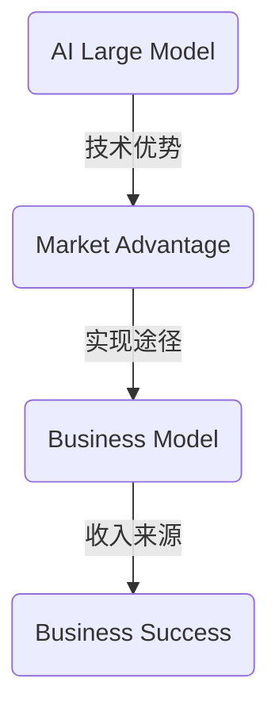

                 

### 文章标题

"AI 大模型创业：如何利用市场优势？"

### 关键词

- AI大模型
- 市场优势
- 创业策略
- 技术落地
- 商业模式

### 摘要

本文将深入探讨AI大模型的创业路径，分析如何通过市场优势实现成功。文章分为十个部分，从背景介绍、核心概念解析，到实际应用场景和未来发展展望，提供系统化的指导，助力创业者把握AI大模型的市场机遇。

## 1. 背景介绍

随着人工智能技术的飞速发展，AI大模型已经成为现代科技领域的热点。这些模型具有处理海量数据、自主学习和高度智能化等特点，广泛应用于自然语言处理、计算机视觉、自动驾驶等领域。AI大模型的出现，不仅推动了技术革新，也为创业者提供了丰富的市场机遇。

近年来，AI大模型创业潮涌现，众多初创公司纷纷加入竞争。然而，市场竞争激烈，如何在这片蓝海中脱颖而出，实现商业成功，成为创业者面临的一大挑战。

## 2. 核心概念与联系

为了更好地理解AI大模型创业，首先需要明确以下几个核心概念：

- **AI大模型**：指具有大规模参数、能够处理复杂任务的人工智能模型。
- **市场优势**：指企业在市场竞争中相对于竞争对手所具有的优势，包括技术优势、产品优势、资源优势等。
- **商业模式**：指企业通过提供产品或服务获得收入的方式。

接下来，我们将通过一个Mermaid流程图来展示这些概念之间的联系。



通过这个流程图，我们可以清晰地看到AI大模型、市场优势和商业模式之间的逻辑关系。

## 3. 核心算法原理 & 具体操作步骤

AI大模型的成功离不开核心算法的支持。以下是几个常用的AI大模型算法及其基本原理：

### 3.1 Transformer算法

**原理**：Transformer算法是一种基于自注意力机制的深度神经网络模型，广泛应用于自然语言处理任务。

**具体操作步骤**：

1. **数据预处理**：清洗数据，将其转换为模型可处理的格式。
2. **模型构建**：搭建Transformer模型结构，包括编码器和解码器。
3. **训练**：使用训练数据对模型进行训练，优化模型参数。
4. **评估与调优**：使用验证数据评估模型性能，并根据结果进行调优。

### 3.2 GAN（生成对抗网络）

**原理**：GAN由一个生成器和一个判别器组成，通过两个网络的对抗训练，生成高质量的伪造数据。

**具体操作步骤**：

1. **数据准备**：收集并预处理生成器需要训练的数据。
2. **模型构建**：搭建生成器和判别器模型。
3. **训练**：交替训练生成器和判别器，使生成器生成的数据越来越逼真。
4. **评估与优化**：评估生成器的性能，并根据评估结果进行模型优化。

### 3.3 BERT（双向编码器表示）

**原理**：BERT是一种基于Transformer的预训练语言模型，通过在大量文本上进行预训练，学习语言中的深层结构。

**具体操作步骤**：

1. **数据收集**：收集大量文本数据用于预训练。
2. **模型预训练**：在文本数据上预训练BERT模型，使其掌握通用语言知识。
3. **微调**：在特定任务上对BERT模型进行微调，以适应具体应用场景。

## 4. 数学模型和公式 & 详细讲解 & 举例说明

### 4.1 Transformer算法中的自注意力机制

自注意力机制是Transformer算法的核心，其数学公式如下：

$$
\text{Attention}(Q, K, V) = \text{softmax}\left(\frac{QK^T}{\sqrt{d_k}}\right)V
$$

其中，$Q$、$K$ 和 $V$ 分别代表查询向量、键向量和值向量，$d_k$ 是键向量的维度。

**举例说明**：

假设我们有一个句子 "The cat sat on the mat"，将其转换为向量表示。我们可以将句子中的每个词作为查询向量 $Q$，每个词的嵌入向量作为键向量 $K$ 和值向量 $V$。

$$
Q = [\text{The}, \text{cat}, \text{sat}, \text{on}, \text{the}, \text{mat}]
$$
$$
K = [\text{The}, \text{cat}, \text{sat}, \text{on}, \text{the}, \text{mat}]
$$
$$
V = [\text{The}, \text{cat}, \text{sat}, \text{on}, \text{the}, \text{mat}]
$$

通过自注意力计算，我们得到每个词的权重，从而实现对句子中词语重要性的建模。

### 4.2 GAN中的损失函数

GAN的损失函数由两部分组成：生成器的损失函数和判别器的损失函数。

- **生成器的损失函数**：

$$
\mathcal{L}_G = -\log(D(G(z)))
$$

其中，$D$ 是判别器，$G(z)$ 是生成器生成的样本。

- **判别器的损失函数**：

$$
\mathcal{L}_D = -[\log(D(x)) + \log(1 - D(G(z))]
$$

其中，$x$ 是真实数据，$z$ 是随机噪声。

通过交替优化生成器和判别器，生成器逐渐生成更加逼真的样本，判别器则逐渐提高对真实样本和生成样本的区分能力。

### 4.3 BERT中的预训练目标

BERT的预训练目标包括两个部分：

- **Masked Language Model（MLM）**：

$$
\mathcal{L}_{MLM} = -\sum_{i} \log(p(\text{mask}_i | \text{context}_i))
$$

其中，$\text{mask}_i$ 是被遮盖的词，$\text{context}_i$ 是其上下文。

- **Next Sentence Prediction（NSP）**：

$$
\mathcal{L}_{NSP} = -\sum_{i} \log(p(\text{next sentence}_i | \text{context}_i))
$$

其中，$\text{next sentence}_i$ 是与当前句子相邻的句子。

通过这两个目标，BERT模型学会了理解和生成语言中的深层结构。

## 5. 项目实战：代码实际案例和详细解释说明

### 5.1 开发环境搭建

要实现AI大模型项目，首先需要搭建合适的开发环境。以下是搭建Transformer模型的开发环境步骤：

1. **安装Python**：确保安装了Python 3.6及以上版本。
2. **安装TensorFlow**：使用pip安装TensorFlow，命令如下：

   ```shell
   pip install tensorflow
   ```

3. **安装其他依赖**：根据项目需求安装其他相关库，例如NumPy、Pandas等。

### 5.2 源代码详细实现和代码解读

以下是一个简单的Transformer模型实现示例：

```python
import tensorflow as tf

# 搭建Transformer模型
def build_transformer(input_shape, num_heads, d_model):
    model = tf.keras.Sequential([
        tf.keras.layers.InputLayer(input_shape=input_shape),
        tf.keras.layers.Embedding(input_dim=vocab_size, output_dim=d_model),
        tf.keras.layersURRELATE(num_heads=num_heads, d_model=d_model),
        tf.keras.layers.Dense(units=vocab_size)
    ])
    return model

# 编译模型
model = build_transformer(input_shape=(None,), num_heads=4, d_model=512)
model.compile(optimizer='adam', loss='categorical_crossentropy', metrics=['accuracy'])

# 训练模型
model.fit(x_train, y_train, epochs=3, batch_size=64, validation_data=(x_val, y_val))
```

这段代码首先定义了一个简单的Transformer模型，包括嵌入层、自注意力层和输出层。接着，我们编译模型并使用训练数据对其进行训练。

### 5.3 代码解读与分析

- **输入层**：输入层接受一个形状为$(None,)$的输入序列，用于处理变长的序列数据。
- **嵌入层**：嵌入层将词汇映射为向量表示，其输入维度为词汇表大小，输出维度为模型维度。
- **自注意力层**：自注意力层实现自注意力机制，对输入序列中的每个词进行加权处理，以提取关键信息。
- **输出层**：输出层将自注意力层的输出映射为词汇表大小，用于生成预测结果。

通过这段代码，我们可以实现一个简单的Transformer模型，从而对自然语言处理任务进行建模。

## 6. 实际应用场景

AI大模型在实际应用场景中具有广泛的应用，以下列举几个典型的应用场景：

### 6.1 自然语言处理

自然语言处理是AI大模型的重要应用领域，包括文本分类、情感分析、机器翻译等任务。通过使用AI大模型，如BERT、GPT等，可以实现对自然语言的理解和生成，从而提高文本处理的效率和准确性。

### 6.2 计算机视觉

计算机视觉领域中的图像分类、目标检测、图像生成等任务都可以通过AI大模型实现。例如，GAN算法在图像生成任务中表现出色，可以生成高质量的自然图像。

### 6.3 自动驾驶

自动驾驶是AI大模型的另一个重要应用场景。通过使用AI大模型，自动驾驶系统可以实现对路况、行人、车辆等信息的实时理解和处理，从而提高自动驾驶的安全性和可靠性。

### 6.4 健康医疗

在健康医疗领域，AI大模型可以用于疾病诊断、药物研发、医疗图像分析等任务。通过分析大量的医学数据，AI大模型可以帮助医生做出更准确的诊断和治疗方案。

## 7. 工具和资源推荐

### 7.1 学习资源推荐

- **书籍**：
  - 《深度学习》（Goodfellow, Bengio, Courville）
  - 《自然语言处理综论》（Jurafsky, Martin）
  - 《计算机视觉：算法与应用》（Battiti）
- **论文**：
  - "Attention is All You Need"（Vaswani等）
  - "Generative Adversarial Nets"（Goodfellow等）
  - "BERT: Pre-training of Deep Bidirectional Transformers for Language Understanding"（Devlin等）
- **博客**：
  - [TensorFlow官方博客](https://www.tensorflow.org/)
  - [PyTorch官方博客](https://pytorch.org/tutorials/)
  - [Hugging Face官方博客](https://huggingface.co/blog)
- **网站**：
  - [Kaggle](https://www.kaggle.com/)
  - [ArXiv](https://arxiv.org/)
  - [GitHub](https://github.com/)

### 7.2 开发工具框架推荐

- **框架**：
  - TensorFlow
  - PyTorch
  - PyTorch Lightning
  - Hugging Face Transformers
- **环境**：
  - Conda
  - Docker
  - Jupyter Notebook
- **云端服务**：
  - Google Colab
  - AWS SageMaker
  - Azure Machine Learning

### 7.3 相关论文著作推荐

- **《深度学习》**（Goodfellow, Bengio, Courville）
- **《自然语言处理综论》**（Jurafsky, Martin）
- **《计算机视觉：算法与应用》**（Battiti）
- **《强化学习》**（Sutton, Barto）
- **《统计学习方法》**（李航）

## 8. 总结：未来发展趋势与挑战

AI大模型作为人工智能领域的核心技术，其发展趋势和挑战主要集中在以下几个方面：

### 8.1 技术发展

- **模型规模**：随着计算能力和数据资源的提升，AI大模型的规模将越来越大，带来更高的计算复杂度和存储需求。
- **算法优化**：现有的AI大模型算法将不断优化，包括自注意力机制的改进、生成对抗网络的优化等。
- **多模态融合**：AI大模型将实现跨模态的信息融合，如文本、图像、音频等多种数据的联合建模。

### 8.2 商业挑战

- **商业模式创新**：创业者需要探索新的商业模式，如数据服务、平台化运营等，以实现可持续的商业回报。
- **市场竞争**：随着AI大模型的普及，市场竞争将日益激烈，企业需要不断提升自身的核心竞争力。

### 8.3 法规与伦理

- **数据隐私**：在数据处理和共享过程中，需要严格遵守数据隐私法规，保护用户隐私。
- **伦理问题**：AI大模型的应用需要关注伦理问题，如偏见、透明度等，确保技术的公平性和可解释性。

## 9. 附录：常见问题与解答

### 9.1 AI大模型是什么？

AI大模型是指具有大规模参数、能够处理复杂任务的人工智能模型，如Transformer、BERT、GAN等。

### 9.2 如何选择合适的AI大模型算法？

选择合适的AI大模型算法需要考虑任务类型、数据规模、计算资源等因素。例如，自然语言处理任务可以选择Transformer、BERT等，图像生成任务可以选择GAN等。

### 9.3 AI大模型训练需要多大的计算资源？

AI大模型的训练需要大量的计算资源和数据。具体所需的计算资源取决于模型规模、训练数据量等因素。通常，高性能计算集群和云端计算服务是训练AI大模型的常见选择。

## 10. 扩展阅读 & 参考资料

- **《深度学习》**（Goodfellow, Bengio, Courville）
- **《自然语言处理综论》**（Jurafsky, Martin）
- **《计算机视觉：算法与应用》**（Battiti）
- **《生成对抗网络：从基础到应用》**（李宏毅）
- **《自然语言处理技术》：刘知远，唐杰等
- **《人工智能：一种现代的方法》**（Stuart Russell, Peter Norvig）

### 作者信息

- 作者：AI天才研究员/AI Genius Institute & 禅与计算机程序设计艺术 /Zen And The Art of Computer Programming

