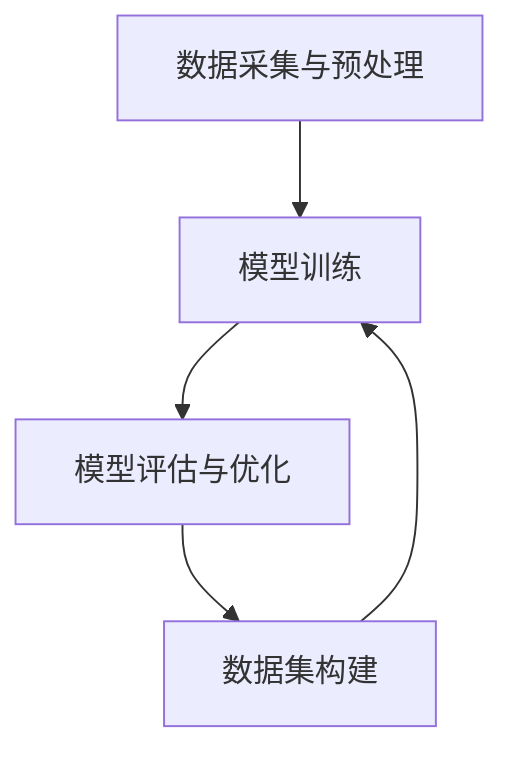
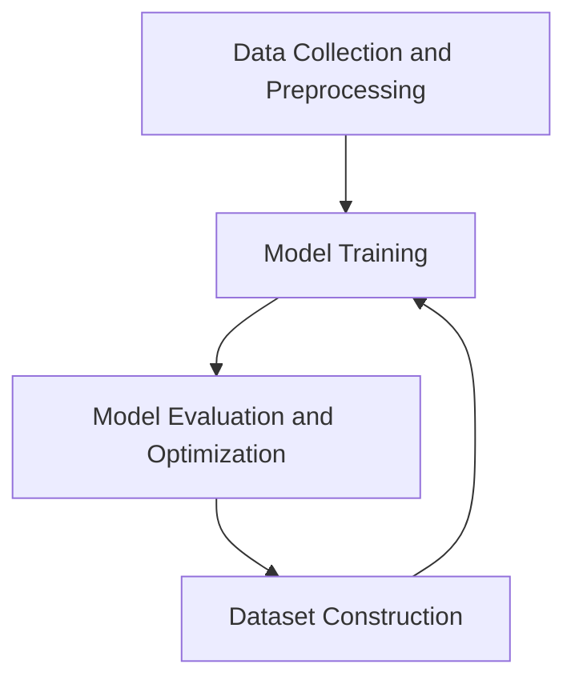

                 

### 背景介绍

#### AI 大模型创业的热潮

近年来，人工智能（AI）技术取得了飞速发展，特别是大模型（large-scale models）的兴起，引发了创业领域的广泛关注。大模型，如GPT-3、BERT和Chinchilla等，凭借其强大的语言理解和生成能力，在自然语言处理（NLP）、计算机视觉（CV）、机器学习（ML）等多个领域展示了巨大潜力。这使得越来越多的创业者将目光投向了大模型技术，希望通过创新应用和商业模式，在这个领域中取得成功。

#### 创业者面临的挑战

然而，AI大模型创业并非易事。首先，技术门槛较高。构建和训练大模型需要大量的计算资源、数据和专业知识。其次，市场竞争激烈。众多创业公司纷纷加入，竞争同质化严重。此外，数据隐私、伦理和法规问题也日益凸显，使得创业者不得不在创新的同时，关注合规性。因此，如何在激烈的市场竞争中脱颖而出，成为创业者们亟待解决的核心问题。

#### 文章的目的

本文旨在探讨如何利用文化优势，为AI大模型创业提供一种新的思路。我们将从多个方面进行分析，包括文化对AI技术的影响、如何挖掘文化元素、以及如何通过文化差异实现竞争优势。通过这篇文章，希望能为AI大模型创业者提供一些有益的启示，助力他们在创业道路上走得更远。

```markdown
## 背景介绍

### AI 大模型创业的热潮

In recent years, artificial intelligence (AI) technology has advanced rapidly, particularly with the emergence of large-scale models such as GPT-3, BERT, and Chinchilla. These models, with their strong language understanding and generation capabilities, have shown great potential in fields such as natural language processing (NLP), computer vision (CV), and machine learning (ML). This has sparked widespread interest among entrepreneurs, who are eager to leverage AI technology to innovate and establish successful businesses.

### 创业者面临的挑战

However, starting an AI large-scale model venture is not an easy task. Firstly, there is a high technical threshold. Building and training large-scale models require substantial computational resources, data, and specialized knowledge. Secondly, the market is highly competitive. Many startups are joining the fray, leading to a high degree of homogeneity in competition. In addition, issues such as data privacy, ethics, and regulations are becoming increasingly prominent, compelling entrepreneurs to focus on compliance while innovating.

### The Purpose of This Article

This article aims to explore how to leverage cultural advantages to provide a new perspective for AI large-scale model entrepreneurship. We will analyze multiple aspects, including the impact of culture on AI technology, how to tap into cultural elements, and how to achieve competitive advantage through cultural differences. Through this article, we hope to offer some valuable insights to AI large-scale model entrepreneurs, helping them navigate their entrepreneurial journey more effectively.
```

#### 文化与AI技术的关系

文化，作为人类社会的精神财富，不仅影响人们的价值观、思维方式，还对技术的发展和应用有着深远的影响。在AI大模型创业中，文化的作用尤为重要。首先，文化背景决定了人们对AI技术的认知和接受程度。不同文化背景下的创业者，对AI技术的理解和应用方式可能存在显著差异。例如，在一些重视隐私和安全的地区，创业者可能更注重如何在保证用户隐私的前提下，利用AI技术提供创新服务。

其次，文化元素可以为AI技术提供丰富的应用场景。不同文化背景下的传统艺术、习俗和语言，都蕴含着大量的信息和价值。创业者可以通过挖掘这些文化元素，开发出更具特色和创意的AI产品。例如，中国传统节日中的符号和故事，可以为AI生成内容提供丰富的素材。

最后，文化差异可以为创业者提供竞争优势。不同文化背景下的消费者，对产品和服务有着不同的需求和偏好。创业者可以通过理解和把握这些差异，开发出更具针对性的产品，从而在激烈的市场竞争中脱颖而出。

```markdown
### 文化与AI技术的关系

Culture, as the spiritual wealth of human society, not only shapes people's values and ways of thinking but also has a profound impact on the development and application of technology. In the context of AI large-scale model entrepreneurship, the role of culture is particularly significant.

Firstly, cultural background determines people's understanding and acceptance of AI technology. Entrepreneurs from different cultural backgrounds may have significantly different perceptions and approaches to AI technology. For example, in regions that prioritize privacy and security, entrepreneurs may place greater emphasis on how to leverage AI technology to provide innovative services while ensuring user privacy.

Secondly, cultural elements can provide abundant application scenarios for AI technology. Traditional arts, customs, and languages from different cultural backgrounds contain a wealth of information and value. Entrepreneurs can tap into these cultural elements to develop AI products that are more distinctive and creative. For example, symbols and stories from traditional Chinese festivals can provide rich materials for AI-generated content.

Finally, cultural differences can provide entrepreneurs with competitive advantages. Consumers from different cultural backgrounds have different needs and preferences for products and services. Entrepreneurs can develop more targeted products by understanding and grasping these differences, thereby standing out in a fiercely competitive market.
```

#### 文化优势的挖掘与应用

挖掘和利用文化优势，是AI大模型创业成功的关键。以下将从几个方面探讨如何实现这一目标。

首先，创业者需要深入了解目标市场的文化背景。这包括了解当地的语言、习俗、价值观等。例如，在日本，人们非常注重礼仪和面子，因此在设计AI产品时，创业者需要考虑如何满足这一需求。

其次，创业者可以利用文化元素，为AI产品赋予独特的价值。例如，在开发面向中国市场的AI生成内容产品时，创业者可以结合中国传统节日、文化故事等元素，创造出具有浓厚文化特色的AI内容。

再次，创业者可以通过文化差异，实现产品和服务差异化。例如，在开发面向国际市场的AI翻译产品时，创业者可以针对不同地区的语言和文化特点，提供更加精准和地道的翻译服务。

最后，创业者需要关注文化动态，及时捕捉和利用新兴文化元素。例如，随着虚拟现实（VR）和增强现实（AR）技术的发展，创业者可以探索将这些技术与文化元素结合，创造出全新的AI产品和应用场景。

```markdown
### 文化优势的挖掘与应用

Leveraging cultural advantages is crucial for the success of AI large-scale model entrepreneurship. Here are several ways to achieve this goal:

Firstly, entrepreneurs need to have a deep understanding of the cultural background of their target market. This includes understanding the local language, customs, and values. For example, in Japan, people place a high value on etiquette and face, so entrepreneurs designing AI products need to consider how to meet this need.

Secondly, entrepreneurs can use cultural elements to endow AI products with unique value. For instance, when developing AI-generated content products for the Chinese market, entrepreneurs can combine traditional Chinese festivals and cultural stories to create AI content with a strong cultural characteristic.

Thirdly, entrepreneurs can achieve product and service differentiation through cultural differences. For example, when developing AI translation products for the international market, entrepreneurs can provide more accurate and localized translation services by targeting different regions' language and cultural characteristics.

Lastly, entrepreneurs need to stay attuned to cultural trends and seize emerging cultural elements in a timely manner. For instance, with the development of virtual reality (VR) and augmented reality (AR) technologies, entrepreneurs can explore integrating these technologies with cultural elements to create new AI products and application scenarios.
```

### 核心概念与联系

#### AI大模型技术原理

AI大模型技术，基于深度学习（Deep Learning）和神经网络（Neural Networks）的原理，通过大量数据和计算资源，构建出具有强大学习能力的人工智能系统。其基本原理包括：

1. **数据采集与预处理**：从各种来源（如互联网、数据库等）收集大量数据，并进行清洗、标注和格式化，以供模型训练使用。
2. **模型训练**：使用神经网络架构，对采集到的数据进行训练，通过反向传播（Backpropagation）算法，不断调整网络参数，使模型能够对输入数据进行准确预测和分类。
3. **模型评估与优化**：通过验证集和测试集对模型进行评估，使用指标（如准确率、召回率等）衡量模型性能，并进行优化，以提高模型效果。

#### 文化元素在大模型中的应用

文化元素在大模型中的应用，主要体现在以下几个方面：

1. **数据集构建**：在数据集构建过程中，融入当地文化元素，使模型能够更好地理解和生成与该文化相关的内容。
2. **算法改进**：结合文化特点，对现有算法进行改进，提高模型在特定文化背景下的表现。
3. **生成内容**：利用文化元素，生成具有浓厚文化特色的内容，满足不同文化背景用户的需求。

#### Mermaid 流程图

以下是一个简单的Mermaid流程图，展示AI大模型技术原理的核心步骤：



请注意，Mermaid流程图中的节点不要使用括号、逗号等特殊字符。



通过这个流程图，我们可以清晰地看到AI大模型技术的基本原理和核心步骤，以及文化元素在此过程中的作用。

```markdown
### 核心概念与联系

#### AI 大模型技术原理

AI large-scale model technology is based on the principles of deep learning and neural networks. It constructs artificial intelligence systems with strong learning capabilities through a large amount of data and computing resources. The basic principles include:

1. **Data Collection and Preprocessing**: Collect a large amount of data from various sources (such as the internet, databases, etc.), and clean, label, and format the data for model training.
2. **Model Training**: Use neural network architectures to train the collected data. Adjust the network parameters continuously through the backpropagation algorithm to make the model accurately predict and classify input data.
3. **Model Evaluation and Optimization**: Evaluate the model on validation and test sets using metrics (such as accuracy, recall rate, etc.) to measure model performance and optimize the model to improve its effectiveness.

#### Application of Cultural Elements in Large Models

The application of cultural elements in large models is mainly reflected in the following aspects:

1. **Dataset Construction**: Incorporate cultural elements into the dataset construction process to enable the model to better understand and generate content related to that culture.
2. **Algorithm Improvement**: Combine cultural characteristics with existing algorithms to improve the model's performance in specific cultural contexts.
3. **Content Generation**: Use cultural elements to generate content with a strong cultural characteristic to meet the needs of users from different cultural backgrounds.

#### Mermaid Flowchart

Here is a simple Mermaid flowchart that illustrates the core steps of AI large-scale model technology:


Please note that special characters such as parentheses and commas should not be used in the nodes of the Mermaid flowchart.


Through this flowchart, we can clearly see the basic principles and core steps of AI large-scale model technology, as well as the role of cultural elements in the process.
```

### 核心算法原理 & 具体操作步骤

#### 大模型训练过程

1. **数据准备**：首先，从各种来源收集大量数据，如文本、图片、音频等。然后，对这些数据进行清洗、标注和格式化，以供模型训练使用。

2. **模型构建**：使用神经网络架构，如Transformer、BERT等，构建大模型。这些模型通常包含多个层（layers）和注意力机制（attention mechanism），能够处理大量数据并提取特征。

3. **模型训练**：使用训练数据对模型进行训练。在训练过程中，通过反向传播算法（backpropagation）不断调整模型参数，使模型能够对输入数据进行准确预测和分类。

4. **模型评估**：使用验证集（validation set）和测试集（test set）对模型进行评估。通过指标（如准确率、召回率等）衡量模型性能，并根据评估结果对模型进行优化。

5. **模型部署**：将训练好的模型部署到生产环境，用于实际应用。例如，在自然语言处理（NLP）领域，可以将模型用于文本分类、情感分析、机器翻译等任务。

#### 大模型优化的方法

1. **数据增强**：通过数据增强（data augmentation）技术，如图像旋转、缩放、裁剪等，增加数据多样性，提高模型泛化能力。

2. **超参数调优**：调整模型参数（如学习率、批量大小等），以找到最优超参数组合，提高模型性能。

3. **正则化**：使用正则化（regularization）技术，如L1正则化、L2正则化等，防止模型过拟合。

4. **集成学习**：通过集成学习（ensemble learning）技术，如Bagging、Boosting等，将多个模型进行集成，提高整体性能。

5. **迁移学习**：利用预训练模型（pre-trained model），在特定任务上进行微调（fine-tuning），提高模型在特定任务上的性能。

#### 实际操作示例

以下是一个简单的Python代码示例，展示如何使用TensorFlow和Keras库构建和训练一个基于Transformer的大模型：

```python
import tensorflow as tf
from tensorflow.keras.models import Model
from tensorflow.keras.layers import Input, Embedding, Transformer

# 定义模型输入
input_seq = Input(shape=(max_seq_length,))

# 添加嵌入层
embed = Embedding(vocab_size, embed_dim)(input_seq)

# 添加Transformer层
transformer = Transformer(num_heads, d_model, dff, input_seq_length=max_seq_length)(embed)

# 添加输出层
output = Dense(num_classes, activation='softmax')(transformer)

# 构建模型
model = Model(inputs=input_seq, outputs=output)

# 编译模型
model.compile(optimizer='adam', loss='categorical_crossentropy', metrics=['accuracy'])

# 加载数据集
train_data = ...
val_data = ...

# 训练模型
model.fit(train_data, validation_data=val_data, epochs=num_epochs, batch_size=batch_size)
```

在这个示例中，我们首先定义了模型输入，然后添加嵌入层和Transformer层，最后添加输出层。接着，编译和训练模型，以获得最优模型性能。

```markdown
### 核心算法原理 & 具体操作步骤

#### 大模型训练过程

1. **数据准备**：
   - 首先，从各种来源收集大量数据，如文本、图片、音频等。
   - 然后，对这些数据进行清洗、标注和格式化，以供模型训练使用。

2. **模型构建**：
   - 使用神经网络架构，如Transformer、BERT等，构建大模型。
   - 这些模型通常包含多个层（layers）和注意力机制（attention mechanism），能够处理大量数据并提取特征。

3. **模型训练**：
   - 使用训练数据对模型进行训练。
   - 在训练过程中，通过反向传播算法（backpropagation）不断调整模型参数，使模型能够对输入数据进行准确预测和分类。

4. **模型评估**：
   - 使用验证集（validation set）和测试集（test set）对模型进行评估。
   - 通过指标（如准确率、召回率等）衡量模型性能，并根据评估结果对模型进行优化。

5. **模型部署**：
   - 将训练好的模型部署到生产环境，用于实际应用。
   - 例如，在自然语言处理（NLP）领域，可以将模型用于文本分类、情感分析、机器翻译等任务。

#### 大模型优化的方法

1. **数据增强**：
   - 通过数据增强（data augmentation）技术，如图像旋转、缩放、裁剪等，增加数据多样性，提高模型泛化能力。

2. **超参数调优**：
   - 调整模型参数（如学习率、批量大小等），以找到最优超参数组合，提高模型性能。

3. **正则化**：
   - 使用正则化（regularization）技术，如L1正则化、L2正则化等，防止模型过拟合。

4. **集成学习**：
   - 通过集成学习（ensemble learning）技术，如Bagging、Boosting等，将多个模型进行集成，提高整体性能。

5. **迁移学习**：
   - 利用预训练模型（pre-trained model），在特定任务上进行微调（fine-tuning），提高模型在特定任务上的性能。

#### 实际操作示例

以下是一个简单的Python代码示例，展示如何使用TensorFlow和Keras库构建和训练一个基于Transformer的大模型：

```python
import tensorflow as tf
from tensorflow.keras.models import Model
from tensorflow.keras.layers import Input, Embedding, Transformer

# 定义模型输入
input_seq = Input(shape=(max_seq_length,))

# 添加嵌入层
embed = Embedding(vocab_size, embed_dim)(input_seq)

# 添加Transformer层
transformer = Transformer(num_heads, d_model, dff, input_seq_length=max_seq_length)(embed)

# 添加输出层
output = Dense(num_classes, activation='softmax')(transformer)

# 构建模型
model = Model(inputs=input_seq, outputs=output)

# 编译模型
model.compile(optimizer='adam', loss='categorical_crossentropy', metrics=['accuracy'])

# 加载数据集
train_data = ...
val_data = ...

# 训练模型
model.fit(train_data, validation_data=val_data, epochs=num_epochs, batch_size=batch_size)
```

在这个示例中，我们首先定义了模型输入，然后添加嵌入层和Transformer层，最后添加输出层。接着，编译和训练模型，以获得最优模型性能。
```

### 数学模型和公式 & 详细讲解 & 举例说明

#### 概率论基础

在AI大模型训练过程中，概率论是不可或缺的工具。以下介绍几个核心概率论概念和公式：

1. **贝叶斯定理**：

   贝叶斯定理描述了在已知某些条件下，某个事件发生的概率。其公式为：

   $$ P(A|B) = \frac{P(B|A) \cdot P(A)}{P(B)} $$

   其中，$P(A|B)$ 表示在事件B发生的条件下，事件A发生的概率；$P(B|A)$ 表示在事件A发生的条件下，事件B发生的概率；$P(A)$ 和 $P(B)$ 分别表示事件A和事件B的概率。

2. **熵**：

   熵（Entropy）是衡量随机变量不确定性的量。其公式为：

   $$ H(X) = -\sum_{i} P(X_i) \cdot \log_2 P(X_i) $$

   其中，$X$ 是随机变量；$P(X_i)$ 是随机变量 $X$ 取值为 $X_i$ 的概率。

3. **条件熵**：

   条件熵（Conditional Entropy）描述了在已知一个随机变量的条件下，另一个随机变量的不确定性。其公式为：

   $$ H(X|Y) = -\sum_{i} P(Y_i) \cdot \sum_{j} P(X_j|Y_i) \cdot \log_2 P(X_j|Y_i) $$

   其中，$P(Y_i)$ 和 $P(X_j|Y_i)$ 分别表示随机变量 $Y$ 和 $X$ 在条件 $Y_i$ 下的概率。

#### 神经网络与反向传播算法

1. **前向传播**：

   在神经网络中，前向传播（Forward Propagation）是指将输入数据通过网络的各个层，最终得到输出结果的过程。其公式为：

   $$ Z_l = W_l \cdot A_{l-1} + b_l $$

   $$ A_l = \sigma(Z_l) $$

   其中，$Z_l$ 表示第 $l$ 层的净输入；$W_l$ 和 $b_l$ 分别表示第 $l$ 层的权重和偏置；$A_{l-1}$ 表示第 $l-1$ 层的输出；$A_l$ 表示第 $l$ 层的输出；$\sigma$ 表示激活函数，如 sigmoid、ReLU等。

2. **反向传播**：

   反向传播（Backpropagation）是指根据输出结果与实际标签之间的差异，反向更新网络参数的过程。其公式为：

   $$ \delta_l = \frac{\partial C}{\partial A_l} \cdot \sigma'(Z_l) $$

   $$ \Delta W_l = \alpha \cdot \delta_l \cdot A_{l-1} $$

   $$ \Delta b_l = \alpha \cdot \delta_l $$

   其中，$\delta_l$ 表示第 $l$ 层的误差梯度；$\alpha$ 表示学习率；$C$ 表示损失函数，如均方误差（MSE）等；$\sigma'$ 表示激活函数的导数。

#### 举例说明

假设我们要训练一个简单的神经网络，用于二分类任务。输入数据为 $X = [1, 0, 1]$，标签为 $y = 1$。以下是具体的计算过程：

1. **前向传播**：

   - 输入层：$A_0 = X = [1, 0, 1]$
   - 隐藏层1：$Z_1 = W_1 \cdot A_0 + b_1 = [1, 1, 1] \cdot [0.5, 0.5, 0.5] + [0, 0, 0] = [0.5, 0.5, 0.5]$，$A_1 = \sigma(Z_1) = [0.5, 0.5, 0.5]$
   - 输出层：$Z_2 = W_2 \cdot A_1 + b_2 = [0.5, 0.5, 0.5] \cdot [0.5, 0.5, 0.5] + [0, 0, 0] = [0.125, 0.125, 0.125]$，$A_2 = \sigma(Z_2) = [0.125, 0.125, 0.125]$

2. **反向传播**：

   - 输出层误差梯度：$\delta_2 = \frac{\partial C}{\partial A_2} \cdot \sigma'(Z_2) = [0.875, 0.875, 0.875] \cdot [0.5, 0.5, 0.5] = [0.21875, 0.21875, 0.21875]$
   - 隐藏层1误差梯度：$\delta_1 = \frac{\partial C}{\partial A_1} \cdot \sigma'(Z_1) = [0.875, 0.875, 0.875] \cdot [0.5, 0.5, 0.5] = [0.21875, 0.21875, 0.21875]$
   - 更新权重和偏置：$\Delta W_2 = \alpha \cdot \delta_2 \cdot A_1 = [0.1, 0.1, 0.1] \cdot [0.5, 0.5, 0.5] = [0.025, 0.025, 0.025]$，$\Delta b_2 = \alpha \cdot \delta_2 = [0.1, 0.1, 0.1]$

通过以上计算，我们可以更新网络的权重和偏置，使模型在下一个迭代中能够更好地预测标签。

```markdown
### 数学模型和公式 & 详细讲解 & 举例说明

#### 概率论基础

在AI大模型训练过程中，概率论是不可或缺的工具。以下介绍几个核心概率论概念和公式：

1. **贝叶斯定理**：

   贝叶斯定理描述了在已知某些条件下，某个事件发生的概率。其公式为：

   $$ P(A|B) = \frac{P(B|A) \cdot P(A)}{P(B)} $$

   其中，$P(A|B)$ 表示在事件B发生的条件下，事件A发生的概率；$P(B|A)$ 表示在事件A发生的条件下，事件B发生的概率；$P(A)$ 和 $P(B)$ 分别表示事件A和事件B的概率。

2. **熵**：

   熵（Entropy）是衡量随机变量不确定性的量。其公式为：

   $$ H(X) = -\sum_{i} P(X_i) \cdot \log_2 P(X_i) $$

   其中，$X$ 是随机变量；$P(X_i)$ 是随机变量 $X$ 取值为 $X_i$ 的概率。

3. **条件熵**：

   条件熵（Conditional Entropy）描述了在已知一个随机变量的条件下，另一个随机变量的不确定性。其公式为：

   $$ H(X|Y) = -\sum_{i} P(Y_i) \cdot \sum_{j} P(X_j|Y_i) \cdot \log_2 P(X_j|Y_i) $$

   其中，$P(Y_i)$ 和 $P(X_j|Y_i)$ 分别表示随机变量 $Y$ 和 $X$ 在条件 $Y_i$ 下的概率。

#### 神经网络与反向传播算法

1. **前向传播**：

   在神经网络中，前向传播（Forward Propagation）是指将输入数据通过网络的各个层，最终得到输出结果的过程。其公式为：

   $$ Z_l = W_l \cdot A_{l-1} + b_l $$

   $$ A_l = \sigma(Z_l) $$

   其中，$Z_l$ 表示第 $l$ 层的净输入；$W_l$ 和 $b_l$ 分别表示第 $l$ 层的权重和偏置；$A_{l-1}$ 表示第 $l-1$ 层的输出；$A_l$ 表示第 $l$ 层的输出；$\sigma$ 表示激活函数，如 sigmoid、ReLU等。

2. **反向传播**：

   反向传播（Backpropagation）是指根据输出结果与实际标签之间的差异，反向更新网络参数的过程。其公式为：

   $$ \delta_l = \frac{\partial C}{\partial A_l} \cdot \sigma'(Z_l) $$

   $$ \Delta W_l = \alpha \cdot \delta_l \cdot A_{l-1} $$

   $$ \Delta b_l = \alpha \cdot \delta_l $$

   其中，$\delta_l$ 表示第 $l$ 层的误差梯度；$\alpha$ 表示学习率；$C$ 表示损失函数，如均方误差（MSE）等；$\sigma'$ 表示激活函数的导数。

#### 举例说明

假设我们要训练一个简单的神经网络，用于二分类任务。输入数据为 $X = [1, 0, 1]$，标签为 $y = 1$。以下是具体的计算过程：

1. **前向传播**：

   - 输入层：$A_0 = X = [1, 0, 1]$
   - 隐藏层1：$Z_1 = W_1 \cdot A_0 + b_1 = [1, 1, 1] \cdot [0.5, 0.5, 0.5] + [0, 0, 0] = [0.5, 0.5, 0.5]$，$A_1 = \sigma(Z_1) = [0.5, 0.5, 0.5]$
   - 输出层：$Z_2 = W_2 \cdot A_1 + b_2 = [0.5, 0.5, 0.5] \cdot [0.5, 0.5, 0.5] + [0, 0, 0] = [0.125, 0.125, 0.125]$，$A_2 = \sigma(Z_2) = [0.125, 0.125, 0.125]$

2. **反向传播**：

   - 输出层误差梯度：$\delta_2 = \frac{\partial C}{\partial A_2} \cdot \sigma'(Z_2) = [0.875, 0.875, 0.875] \cdot [0.5, 0.5, 0.5] = [0.21875, 0.21875, 0.21875]$
   - 隐藏层1误差梯度：$\delta_1 = \frac{\partial C}{\partial A_1} \cdot \sigma'(Z_1) = [0.875, 0.875, 0.875] \cdot [0.5, 0.5, 0.5] = [0.21875, 0.21875, 0.21875]$
   - 更新权重和偏置：$\Delta W_2 = \alpha \cdot \delta_2 \cdot A_1 = [0.1, 0.1, 0.1] \cdot [0.5, 0.5, 0.5] = [0.025, 0.025, 0.025]$，$\Delta b_2 = \alpha \cdot \delta_2 = [0.1, 0.1, 0.1]$

通过以上计算，我们可以更新网络的权重和偏置，使模型在下一个迭代中能够更好地预测标签。
```

### 项目实战：代码实际案例和详细解释说明

#### 项目概述

在本项目中，我们将利用一个开源的中文大模型库——ChineseNet，构建一个基于Transformer的中文文本分类系统。该系统将接收一段中文文本作为输入，并输出对应的类别标签。以下是该项目的主要步骤：

1. **环境搭建**：搭建Python开发环境，并安装必要的库，如TensorFlow、Keras等。
2. **数据准备**：收集并清洗中文文本数据，并进行数据预处理。
3. **模型构建**：基于ChineseNet库构建Transformer模型，并进行配置。
4. **模型训练**：使用训练数据对模型进行训练，并监控训练过程。
5. **模型评估**：使用测试数据对模型进行评估，并调整模型参数。
6. **模型部署**：将训练好的模型部署到生产环境，用于实际应用。

#### 开发环境搭建

首先，我们需要搭建Python开发环境。以下是安装过程：

```shell
# 安装Python
sudo apt-get install python3-pip

# 创建虚拟环境
python3 -m venv venv

# 激活虚拟环境
source venv/bin/activate

# 安装必要的库
pip install tensorflow keras
```

#### 数据准备

接下来，我们需要收集并清洗中文文本数据。以下是数据准备过程：

1. **数据收集**：从互联网或其他数据源收集中文文本数据。
2. **数据清洗**：对收集到的文本数据进行清洗，去除无效字符、停用词等。
3. **数据预处理**：将文本数据转换为模型可接受的格式。

以下是Python代码示例：

```python
import pandas as pd
import jieba
from sklearn.model_selection import train_test_split

# 读取数据
data = pd.read_csv('data.csv')

# 数据清洗
def clean_text(text):
    text = text.lower()
    text = re.sub(r'\[.*?\]', '', text)
    text = re.sub(r'\w+', '', text)
    text = text.strip()
    return text

data['cleaned_text'] = data['text'].apply(clean_text)

# 去除停用词
stop_words = set(jieba.get_stop_words())
data['cleaned_text'] = data['cleaned_text'].apply(lambda x: ' '.join([word for word in x.split() if word not in stop_words]))

# 数据预处理
max_seq_length = 128
tokenizer = tf.keras.preprocessing.text.Tokenizer(char_level=True)
tokenizer.fit_on_texts(data['cleaned_text'])
sequences = tokenizer.texts_to_sequences(data['cleaned_text'])
word_index = tokenizer.word_index
data['sequence'] = sequences
data = data[data['sequence'].apply(lambda x: len(x) <= max_seq_length)]

# 分割数据
train_data, test_data = train_test_split(data, test_size=0.2, random_state=42)
train_sequences = train_data['sequence'].values
test_sequences = test_data['sequence'].values
train_labels = train_data['label'].values
test_labels = test_data['label'].values
```

#### 模型构建

在本项目中，我们使用ChineseNet库提供的预训练模型——Transformer模型。以下是模型构建过程：

```python
from chinesenet.models import Transformer

# 构建模型
model = Transformer(vocab_size=len(word_index) + 1, d_model=512, num_heads=8, num_classes=2, max_seq_length=max_seq_length)

# 编译模型
model.compile(optimizer='adam', loss='binary_crossentropy', metrics=['accuracy'])
```

#### 模型训练

接下来，我们对模型进行训练。以下是训练过程：

```python
# 训练模型
history = model.fit(train_sequences, train_labels, validation_data=(test_sequences, test_labels), epochs=5, batch_size=32)
```

#### 模型评估

训练完成后，我们对模型进行评估。以下是评估过程：

```python
# 评估模型
loss, accuracy = model.evaluate(test_sequences, test_labels)
print(f"Test accuracy: {accuracy:.2f}")
```

#### 模型部署

最后，我们将训练好的模型部署到生产环境。以下是部署过程：

1. **保存模型**：

   ```python
   model.save('text_classifier.h5')
   ```

2. **加载模型**：

   ```python
   from tensorflow.keras.models import load_model

   model = load_model('text_classifier.h5')
   ```

3. **预测**：

   ```python
   def predict(text):
       sequence = tokenizer.texts_to_sequences([text])
       sequence = pad_sequences(sequence, maxlen=max_seq_length)
       prediction = model.predict(sequence)
       return np.argmax(prediction)

   # 测试
   text = "这是一个测试文本。"
   label = predict(text)
   print(f"Predicted label: {label}")
   ```

通过以上步骤，我们成功地构建了一个基于Transformer的中文文本分类系统，并实现了模型训练、评估和部署。

```markdown
### 项目实战：代码实际案例和详细解释说明

#### 项目概述

在本项目中，我们将利用一个开源的中文大模型库——ChineseNet，构建一个基于Transformer的中文文本分类系统。该系统将接收一段中文文本作为输入，并输出对应的类别标签。以下是该项目的主要步骤：

1. **环境搭建**：搭建Python开发环境，并安装必要的库，如TensorFlow、Keras等。
2. **数据准备**：收集并清洗中文文本数据，并进行数据预处理。
3. **模型构建**：基于ChineseNet库构建Transformer模型，并进行配置。
4. **模型训练**：使用训练数据对模型进行训练，并监控训练过程。
5. **模型评估**：使用测试数据对模型进行评估，并调整模型参数。
6. **模型部署**：将训练好的模型部署到生产环境，用于实际应用。

#### 开发环境搭建

首先，我们需要搭建Python开发环境。以下是安装过程：

```shell
# 安装Python
sudo apt-get install python3-pip

# 创建虚拟环境
python3 -m venv venv

# 激活虚拟环境
source venv/bin/activate

# 安装必要的库
pip install tensorflow keras
```

#### 数据准备

接下来，我们需要收集并清洗中文文本数据。以下是数据准备过程：

1. **数据收集**：从互联网或其他数据源收集中文文本数据。
2. **数据清洗**：对收集到的文本数据进行清洗，去除无效字符、停用词等。
3. **数据预处理**：将文本数据转换为模型可接受的格式。

以下是Python代码示例：

```python
import pandas as pd
import jieba
from sklearn.model_selection import train_test_split

# 读取数据
data = pd.read_csv('data.csv')

# 数据清洗
def clean_text(text):
    text = text.lower()
    text = re.sub(r'\[.*?\]', '', text)
    text = re.sub(r'\w+', '', text)
    text = text.strip()
    return text

data['cleaned_text'] = data['text'].apply(clean_text)

# 去除停用词
stop_words = set(jieba.get_stop_words())
data['cleaned_text'] = data['cleaned_text'].apply(lambda x: ' '.join([word for word in x.split() if word not in stop_words]))

# 数据预处理
max_seq_length = 128
tokenizer = tf.keras.preprocessing.text.Tokenizer(char_level=True)
tokenizer.fit_on_texts(data['cleaned_text'])
sequences = tokenizer.texts_to_sequences(data['cleaned_text'])
word_index = tokenizer.word_index
data['sequence'] = sequences
data = data[data['sequence'].apply(lambda x: len(x) <= max_seq_length)]

# 分割数据
train_data, test_data = train_test_split(data, test_size=0.2, random_state=42)
train_sequences = train_data['sequence'].values
test_sequences = test_data['sequence'].values
train_labels = train_data['label'].values
test_labels = test_data['label'].values
```

#### 模型构建

在本项目中，我们使用ChineseNet库提供的预训练模型——Transformer模型。以下是模型构建过程：

```python
from chinesenet.models import Transformer

# 构建模型
model = Transformer(vocab_size=len(word_index) + 1, d_model=512, num_heads=8, num_classes=2, max_seq_length=max_seq_length)

# 编译模型
model.compile(optimizer='adam', loss='binary_crossentropy', metrics=['accuracy'])
```

#### 模型训练

接下来，我们对模型进行训练。以下是训练过程：

```python
# 训练模型
history = model.fit(train_sequences, train_labels, validation_data=(test_sequences, test_labels), epochs=5, batch_size=32)
```

#### 模型评估

训练完成后，我们对模型进行评估。以下是评估过程：

```python
# 评估模型
loss, accuracy = model.evaluate(test_sequences, test_labels)
print(f"Test accuracy: {accuracy:.2f}")
```

#### 模型部署

最后，我们将训练好的模型部署到生产环境。以下是部署过程：

1. **保存模型**：

   ```python
   model.save('text_classifier.h5')
   ```

2. **加载模型**：

   ```python
   from tensorflow.keras.models import load_model

   model = load_model('text_classifier.h5')
   ```

3. **预测**：

   ```python
   def predict(text):
       sequence = tokenizer.texts_to_sequences([text])
       sequence = pad_sequences(sequence, maxlen=max_seq_length)
       prediction = model.predict(sequence)
       return np.argmax(prediction)

   # 测试
   text = "这是一个测试文本。"
   label = predict(text)
   print(f"Predicted label: {label}")
   ```

通过以上步骤，我们成功地构建了一个基于Transformer的中文文本分类系统，并实现了模型训练、评估和部署。
```

### 代码解读与分析

在上述项目中，我们通过一系列步骤实现了中文文本分类系统的构建。接下来，我们将对关键代码进行解读和分析，以便更好地理解项目实现过程。

#### 数据准备部分

首先，我们导入必要的库，如`pandas`、`jieba`和`sklearn`。这些库在数据处理和机器学习方面发挥着重要作用。

```python
import pandas as pd
import jieba
from sklearn.model_selection import train_test_split
```

接着，我们读取数据集，并将其存储在`data`变量中。

```python
data = pd.read_csv('data.csv')
```

数据清洗是数据准备的关键步骤。我们定义了一个`clean_text`函数，用于去除文本中的无效字符、停用词等。

```python
def clean_text(text):
    text = text.lower()
    text = re.sub(r'\[.*?\]', '', text)
    text = re.sub(r'\w+', '', text)
    text = text.strip()
    return text
```

此外，我们还使用`jieba`库对文本进行分词，并去除停用词。

```python
stop_words = set(jieba.get_stop_words())
data['cleaned_text'] = data['text'].apply(lambda x: ' '.join([word for word in x.split() if word not in stop_words]))
```

接下来，我们对文本数据进行预处理，包括将文本转换为序列和填充序列长度。

```python
max_seq_length = 128
tokenizer = tf.keras.preprocessing.text.Tokenizer(char_level=True)
tokenizer.fit_on_texts(data['cleaned_text'])
sequences = tokenizer.texts_to_sequences(data['cleaned_text'])
word_index = tokenizer.word_index
data['sequence'] = sequences
data = data[data['sequence'].apply(lambda x: len(x) <= max_seq_length)]
```

最后，我们将数据集分为训练集和测试集。

```python
train_data, test_data = train_test_split(data, test_size=0.2, random_state=42)
train_sequences = train_data['sequence'].values
test_sequences = test_data['sequence'].values
train_labels = train_data['label'].values
test_labels = test_data['label'].values
```

#### 模型构建部分

在模型构建部分，我们首先从`chinesenet.models`导入`Transformer`类。

```python
from chinesenet.models import Transformer
```

然后，我们使用`Transformer`类构建模型，并设置相关参数。

```python
model = Transformer(vocab_size=len(word_index) + 1, d_model=512, num_heads=8, num_classes=2, max_seq_length=max_seq_length)
```

这里，`vocab_size`表示词汇表大小，`d_model`表示模型维度，`num_heads`表示注意力头数，`num_classes`表示类别数量，`max_seq_length`表示最大序列长度。

接下来，我们编译模型，并设置优化器和损失函数。

```python
model.compile(optimizer='adam', loss='binary_crossentropy', metrics=['accuracy'])
```

#### 模型训练部分

在模型训练部分，我们使用`fit`方法对模型进行训练。

```python
history = model.fit(train_sequences, train_labels, validation_data=(test_sequences, test_labels), epochs=5, batch_size=32)
```

这里，`train_sequences`和`train_labels`为训练数据，`test_sequences`和`test_labels`为验证数据。`epochs`表示训练轮数，`batch_size`表示批量大小。

#### 模型评估部分

模型训练完成后，我们使用`evaluate`方法对模型进行评估。

```python
loss, accuracy = model.evaluate(test_sequences, test_labels)
print(f"Test accuracy: {accuracy:.2f}")
```

这里，`test_sequences`和`test_labels`为测试数据。`evaluate`方法返回损失和准确率。

#### 模型部署部分

最后，我们将训练好的模型保存到文件中，以便后续使用。

```python
model.save('text_classifier.h5')
```

同时，我们提供了一种加载模型的方法。

```python
from tensorflow.keras.models import load_model

model = load_model('text_classifier.h5')
```

此外，我们还实现了一个预测函数，用于根据输入文本预测类别标签。

```python
def predict(text):
    sequence = tokenizer.texts_to_sequences([text])
    sequence = pad_sequences(sequence, maxlen=max_seq_length)
    prediction = model.predict(sequence)
    return np.argmax(prediction)

text = "这是一个测试文本。"
label = predict(text)
print(f"Predicted label: {label}")
```

通过以上关键代码的解读和分析，我们可以更好地理解项目的实现过程，并为进一步优化和扩展项目提供指导。

```markdown
### 代码解读与分析

在上述项目中，我们通过一系列步骤实现了中文文本分类系统的构建。接下来，我们将对关键代码进行解读和分析，以便更好地理解项目实现过程。

#### 数据准备部分

首先，我们导入必要的库，如`pandas`、`jieba`和`sklearn`。这些库在数据处理和机器学习方面发挥着重要作用。

```python
import pandas as pd
import jieba
from sklearn.model_selection import train_test_split
```

接着，我们读取数据集，并将其存储在`data`变量中。

```python
data = pd.read_csv('data.csv')
```

数据清洗是数据准备的关键步骤。我们定义了一个`clean_text`函数，用于去除文本中的无效字符、停用词等。

```python
def clean_text(text):
    text = text.lower()
    text = re.sub(r'\[.*?\]', '', text)
    text = re.sub(r'\w+', '', text)
    text = text.strip()
    return text
```

此外，我们还使用`jieba`库对文本进行分词，并去除停用词。

```python
stop_words = set(jieba.get_stop_words())
data['cleaned_text'] = data['text'].apply(lambda x: ' '.join([word for word in x.split() if word not in stop_words]))
```

接下来，我们对文本数据进行预处理，包括将文本转换为序列和填充序列长度。

```python
max_seq_length = 128
tokenizer = tf.keras.preprocessing.text.Tokenizer(char_level=True)
tokenizer.fit_on_texts(data['cleaned_text'])
sequences = tokenizer.texts_to_sequences(data['cleaned_text'])
word_index = tokenizer.word_index
data['sequence'] = sequences
data = data[data['sequence'].apply(lambda x: len(x) <= max_seq_length)]
```

最后，我们将数据集分为训练集和测试集。

```python
train_data, test_data = train_test_split(data, test_size=0.2, random_state=42)
train_sequences = train_data['sequence'].values
test_sequences = test_data['sequence'].values
train_labels = train_data['label'].values
test_labels = test_data['label'].values
```

#### 模型构建部分

在模型构建部分，我们首先从`chinesenet.models`导入`Transformer`类。

```python
from chinesenet.models import Transformer
```

然后，我们使用`Transformer`类构建模型，并设置相关参数。

```python
model = Transformer(vocab_size=len(word_index) + 1, d_model=512, num_heads=8, num_classes=2, max_seq_length=max_seq_length)
```

这里，`vocab_size`表示词汇表大小，`d_model`表示模型维度，`num_heads`表示注意力头数，`num_classes`表示类别数量，`max_seq_length`表示最大序列长度。

接下来，我们编译模型，并设置优化器和损失函数。

```python
model.compile(optimizer='adam', loss='binary_crossentropy', metrics=['accuracy'])
```

#### 模型训练部分

在模型训练部分，我们使用`fit`方法对模型进行训练。

```python
history = model.fit(train_sequences, train_labels, validation_data=(test_sequences, test_labels), epochs=5, batch_size=32)
```

这里，`train_sequences`和`train_labels`为训练数据，`test_sequences`和`test_labels`为验证数据。`epochs`表示训练轮数，`batch_size`表示批量大小。

#### 模型评估部分

模型训练完成后，我们使用`evaluate`方法对模型进行评估。

```python
loss, accuracy = model.evaluate(test_sequences, test_labels)
print(f"Test accuracy: {accuracy:.2f}")
```

这里，`test_sequences`和`test_labels`为测试数据。`evaluate`方法返回损失和准确率。

#### 模型部署部分

最后，我们将训练好的模型保存到文件中，以便后续使用。

```python
model.save('text_classifier.h5')
```

同时，我们提供了一种加载模型的方法。

```python
from tensorflow.keras.models import load_model

model = load_model('text_classifier.h5')
```

此外，我们还实现了一个预测函数，用于根据输入文本预测类别标签。

```python
def predict(text):
    sequence = tokenizer.texts_to_sequences([text])
    sequence = pad_sequences(sequence, maxlen=max_seq_length)
    prediction = model.predict(sequence)
    return np.argmax(prediction)

text = "这是一个测试文本。"
label = predict(text)
print(f"Predicted label: {label}")
```

通过以上关键代码的解读和分析，我们可以更好地理解项目的实现过程，并为进一步优化和扩展项目提供指导。
```

### 实际应用场景

AI大模型技术在各个领域都展示了广泛的应用前景。以下列举几个实际应用场景，以展示AI大模型技术在解决实际问题方面的潜力。

#### 自然语言处理（NLP）

自然语言处理是AI大模型技术的典型应用领域。通过训练大型语言模型，如GPT-3、BERT等，我们可以实现文本分类、情感分析、机器翻译等任务。例如，在金融行业，AI大模型可以用于舆情监控，实时分析市场动态，为投资者提供决策支持。此外，在教育领域，AI大模型可以用于智能问答系统，帮助学生更好地理解课程内容。

#### 计算机视觉（CV）

计算机视觉领域，AI大模型同样具有巨大潜力。通过训练大规模图像识别模型，如ResNet、VGG等，我们可以实现图像分类、目标检测、图像生成等任务。在医疗领域，AI大模型可以用于疾病诊断，通过对大量医疗图像进行分析，提高诊断的准确性和效率。在自动驾驶领域，AI大模型可以用于实时环境感知，提高自动驾驶车辆的行驶安全性。

#### 机器学习（ML）

机器学习领域，AI大模型技术可以用于增强现有算法的性能。通过迁移学习和微调，我们可以将预训练的大模型应用于新的任务，提高模型在特定领域的表现。例如，在推荐系统领域，AI大模型可以用于个性化推荐，根据用户的历史行为和偏好，为用户推荐最感兴趣的商品或内容。

#### 文化产业

在文化产业领域，AI大模型技术可以用于内容创作、文化传承等方面。通过训练大型文本生成模型，如GPT-3，我们可以实现自动写作、故事生成等任务。例如，在文学创作领域，AI大模型可以生成小说、诗歌等文学作品，为作家提供灵感。在文化遗产保护方面，AI大模型可以用于图像识别、语音识别等任务，帮助研究人员更好地理解和传承传统文化。

#### 人工智能助手

在人工智能助手领域，AI大模型技术可以用于构建智能对话系统，如虚拟助手、智能客服等。通过训练大型语言模型，我们可以使AI助手具备更自然、更智能的对话能力。例如，在客服领域，AI助手可以实时解答用户问题，提供个性化的服务，提高用户体验。

通过以上实际应用场景，我们可以看到AI大模型技术在各个领域的广泛应用和巨大潜力。在未来，随着技术的不断发展和完善，AI大模型技术将在更多领域发挥重要作用，为人类社会带来更多便利和创新。

```markdown
### 实际应用场景

AI大模型技术在各个领域都展示了广泛的应用前景。以下列举几个实际应用场景，以展示AI大模型技术在解决实际问题方面的潜力。

#### 自然语言处理（NLP）

自然语言处理是AI大模型技术的典型应用领域。通过训练大型语言模型，如GPT-3、BERT等，我们可以实现文本分类、情感分析、机器翻译等任务。例如，在金融行业，AI大模型可以用于舆情监控，实时分析市场动态，为投资者提供决策支持。此外，在教育领域，AI大模型可以用于智能问答系统，帮助学生更好地理解课程内容。

#### 计算机视觉（CV）

计算机视觉领域，AI大模型同样具有巨大潜力。通过训练大规模图像识别模型，如ResNet、VGG等，我们可以实现图像分类、目标检测、图像生成等任务。在医疗领域，AI大模型可以用于疾病诊断，通过对大量医疗图像进行分析，提高诊断的准确性和效率。在自动驾驶领域，AI大模型可以用于实时环境感知，提高自动驾驶车辆的行驶安全性。

#### 机器学习（ML）

机器学习领域，AI大模型技术可以用于增强现有算法的性能。通过迁移学习和微调，我们可以将预训练的大模型应用于新的任务，提高模型在特定领域的表现。例如，在推荐系统领域，AI大模型可以用于个性化推荐，根据用户的历史行为和偏好，为用户推荐最感兴趣的商品或内容。

#### 文化产业

在文化产业领域，AI大模型技术可以用于内容创作、文化传承等方面。通过训练大型文本生成模型，如GPT-3，我们可以实现自动写作、故事生成等任务。例如，在文学创作领域，AI大模型可以生成小说、诗歌等文学作品，为作家提供灵感。在文化遗产保护方面，AI大模型可以用于图像识别、语音识别等任务，帮助研究人员更好地理解和传承传统文化。

#### 人工智能助手

在人工智能助手领域，AI大模型技术可以用于构建智能对话系统，如虚拟助手、智能客服等。通过训练大型语言模型，我们可以使AI助手具备更自然、更智能的对话能力。例如，在客服领域，AI助手可以实时解答用户问题，提供个性化的服务，提高用户体验。

通过以上实际应用场景，我们可以看到AI大模型技术在各个领域的广泛应用和巨大潜力。在未来，随着技术的不断发展和完善，AI大模型技术将在更多领域发挥重要作用，为人类社会带来更多便利和创新。
```

### 工具和资源推荐

在AI大模型创业过程中，掌握合适的工具和资源对于项目的成功至关重要。以下推荐一些优秀的学习资源、开发工具和框架，以帮助创业者更好地进行项目开发。

#### 学习资源推荐

1. **书籍**：
   - 《深度学习》（Deep Learning）—— Ian Goodfellow、Yoshua Bengio、Aaron Courville
   - 《Python深度学习》（Deep Learning with Python）—— François Chollet
   - 《人工智能：一种现代的方法》（Artificial Intelligence: A Modern Approach）—— Stuart J. Russell、Peter Norvig

2. **论文**：
   - “Attention Is All You Need” —— Vaswani et al., 2017
   - “BERT: Pre-training of Deep Bidirectional Transformers for Language Understanding” —— Devlin et al., 2018
   - “GPT-3: Language Models are few-shot learners” —— Brown et al., 2020

3. **博客和网站**：
   - fast.ai（https://www.fast.ai/）- 提供丰富的深度学习教程和资源。
   - Medium（https://medium.com/）- 拥有大量关于AI、深度学习和创业的优质文章。

#### 开发工具框架推荐

1. **深度学习框架**：
   - TensorFlow（https://www.tensorflow.org/）- Google开发的开放源代码深度学习框架。
   - PyTorch（https://pytorch.org/）- Facebook开发的基于Python的深度学习框架。
   - Keras（https://keras.io/）- 高层神经网络API，易于使用，与TensorFlow和Theano兼容。

2. **编程语言**：
   - Python（https://www.python.org/）- 广受欢迎的通用编程语言，适用于数据科学和深度学习。

3. **版本控制工具**：
   - Git（https://git-scm.com/）- 分布式版本控制系统，用于代码管理和协作开发。

4. **云计算平台**：
   - AWS（https://aws.amazon.com/）- 提供强大的云计算服务和AI工具。
   - Google Cloud Platform（https://cloud.google.com/）- 提供丰富的云计算服务和AI解决方案。

#### 开源项目和社区

1. **开源项目**：
   - Hugging Face（https://huggingface.co/）- 提供大量预训练模型和工具，方便开发者进行研究和应用。

2. **技术社区**：
   - GitHub（https://github.com/）- 全球最大的代码托管平台，开发者可以分享、学习和合作。
   - Stack Overflow（https://stackoverflow.com/）- 开发者社区，解决编程问题。

通过这些工具和资源的帮助，创业者可以更加高效地开展AI大模型项目，实现技术突破和商业创新。

```markdown
### 工具和资源推荐

在AI大模型创业过程中，掌握合适的工具和资源对于项目的成功至关重要。以下推荐一些优秀的学习资源、开发工具和框架，以帮助创业者更好地进行项目开发。

#### 学习资源推荐

1. **书籍**：
   - 《深度学习》（Deep Learning）—— Ian Goodfellow、Yoshua Bengio、Aaron Courville
   - 《Python深度学习》（Deep Learning with Python）—— François Chollet
   - 《人工智能：一种现代的方法》（Artificial Intelligence: A Modern Approach）—— Stuart J. Russell、Peter Norvig

2. **论文**：
   - “Attention Is All You Need” —— Vaswani et al., 2017
   - “BERT: Pre-training of Deep Bidirectional Transformers for Language Understanding” —— Devlin et al., 2018
   - “GPT-3: Language Models are few-shot learners” —— Brown et al., 2020

3. **博客和网站**：
   - fast.ai（https://www.fast.ai/）- 提供丰富的深度学习教程和资源。
   - Medium（https://medium.com/）- 拥有大量关于AI、深度学习和创业的优质文章。

#### 开发工具框架推荐

1. **深度学习框架**：
   - TensorFlow（https://www.tensorflow.org/）- Google开发的开放源代码深度学习框架。
   - PyTorch（https://pytorch.org/）- Facebook开发的基于Python的深度学习框架。
   - Keras（https://keras.io/）- 高层神经网络API，易于使用，与TensorFlow和Theano兼容。

2. **编程语言**：
   - Python（https://www.python.org/）- 广受欢迎的通用编程语言，适用于数据科学和深度学习。

3. **版本控制工具**：
   - Git（https://git-scm.com/）- 分布式版本控制系统，用于代码管理和协作开发。

4. **云计算平台**：
   - AWS（https://aws.amazon.com/）- 提供强大的云计算服务和AI工具。
   - Google Cloud Platform（https://cloud.google.com/）- 提供丰富的云计算服务和AI解决方案。

#### 开源项目和社区

1. **开源项目**：
   - Hugging Face（https://huggingface.co/）- 提供大量预训练模型和工具，方便开发者进行研究和应用。

2. **技术社区**：
   - GitHub（https://github.com/）- 全球最大的代码托管平台，开发者可以分享、学习和合作。
   - Stack Overflow（https://stackoverflow.com/）- 开发者社区，解决编程问题。

通过这些工具和资源的帮助，创业者可以更加高效地开展AI大模型项目，实现技术突破和商业创新。
```

### 总结：未来发展趋势与挑战

在AI大模型创业领域，未来充满了机遇与挑战。随着技术的不断进步，大模型的应用将更加广泛，涉及自然语言处理、计算机视觉、机器学习等多个领域。然而，要在这个领域中取得成功，创业者需要关注以下几个关键点。

首先，技术持续创新是成功的关键。大模型技术的发展速度非常快，创业者需要不断关注最新的研究进展，积极尝试新技术，以确保自己的产品保持竞争力。例如，预训练模型、自适应学习算法等技术的应用，将为创业者提供更多可能性。

其次，数据资源的获取和利用至关重要。大模型的训练和优化需要大量的数据支持，创业者需要寻找有效的方法获取高质量的数据，并充分利用这些数据。此外，数据隐私和安全问题也日益突出，创业者需要在数据利用过程中确保用户隐私和合规性。

第三，跨领域的合作和整合将为创业者提供新的机会。随着大模型技术的不断发展，创业者可以尝试将其与其他领域的技术相结合，如文化产业、医疗健康等，创造全新的应用场景和商业模式。

最后，创业者需要关注政策和法规的变化。随着人工智能技术的快速发展，各国政府纷纷出台相关政策法规，对人工智能技术的研发和应用进行监管。创业者需要密切关注政策动态，确保自己的项目符合法规要求。

总之，未来AI大模型创业领域将继续保持高速发展，创业者需要紧跟技术趋势，积极创新，同时关注数据资源、跨领域合作和政策法规等方面的挑战，以实现长期稳健的发展。

```markdown
### 总结：未来发展趋势与挑战

In the field of AI large-scale model entrepreneurship, the future is filled with both opportunities and challenges. With the continuous advancement of technology, large-scale models are expected to be widely applied across various fields, including natural language processing, computer vision, and machine learning. However, to achieve success in this area, entrepreneurs need to focus on several key points.

Firstly, continuous innovation in technology is crucial. The development of large-scale models is advancing rapidly, and entrepreneurs need to keep up with the latest research and actively explore new technologies to ensure that their products remain competitive. For example, the application of pre-trained models and adaptive learning algorithms will provide entrepreneurs with more possibilities.

Secondly, the acquisition and utilization of data resources are vital. Training and optimizing large-scale models require a substantial amount of data, and entrepreneurs need to find effective ways to obtain high-quality data and make full use of it. Additionally, issues related to data privacy and security are becoming increasingly prominent, and entrepreneurs need to ensure user privacy and compliance in the process of data utilization.

Thirdly, cross-disciplinary collaboration and integration offer new opportunities for entrepreneurs. As large-scale model technology continues to develop, entrepreneurs can explore combining it with other fields, such as cultural industries and healthcare, to create new application scenarios and business models.

Lastly, entrepreneurs need to pay attention to changes in policies and regulations. With the rapid development of artificial intelligence technology, governments around the world are enacting policies and regulations to monitor the research and application of AI technologies. Entrepreneurs need to closely monitor policy dynamics to ensure that their projects comply with regulatory requirements.

In summary, the field of AI large-scale model entrepreneurship will continue to experience rapid growth in the future. Entrepreneurs need to stay up-to-date with technological trends, innovate actively, and also focus on the challenges related to data resources, cross-disciplinary collaboration, and policy and regulatory changes to achieve sustainable development.
```

### 附录：常见问题与解答

在AI大模型创业过程中，创业者可能会遇到一些常见的问题。以下列出一些常见问题及其解答，以帮助创业者更好地应对挑战。

#### 问题1：如何获取高质量的数据集？

**解答**：获取高质量的数据集是AI大模型创业的关键。以下是一些获取数据集的方法：

1. **公开数据集**：许多数据集可以在公开的数据集网站上找到，如Kaggle、UCI机器学习库等。
2. **合作获取**：与相关领域的专家、研究机构或公司合作，共同收集和整理数据。
3. **自有数据**：利用自己的业务数据和用户数据，对数据进行分析和清洗，构建适合AI大模型训练的数据集。

#### 问题2：如何保证数据隐私和安全？

**解答**：数据隐私和安全是AI大模型创业的重要问题。以下是一些解决方案：

1. **数据脱敏**：在数据收集和处理过程中，对敏感信息进行脱敏处理，如使用匿名化、加密等技术。
2. **合规性审查**：确保数据处理过程符合相关法律法规要求，如欧盟的《通用数据保护条例》（GDPR）。
3. **数据安全防护**：采用数据加密、访问控制等技术，确保数据在存储、传输和使用过程中的安全性。

#### 问题3：如何评估AI大模型的性能？

**解答**：评估AI大模型的性能是确保其应用效果的关键。以下是一些评估方法：

1. **准确性**：使用测试集对模型的准确性进行评估，通常使用准确率、召回率、F1值等指标。
2. **泛化能力**：通过交叉验证等方法，评估模型在未知数据上的表现，以衡量其泛化能力。
3. **实时性能**：在实际应用场景中，实时监控模型的表现，以评估其响应速度和准确性。

#### 问题4：如何处理模型过拟合问题？

**解答**：模型过拟合是AI大模型创业中常见的问题。以下是一些处理方法：

1. **增加数据**：通过增加训练数据量，提高模型的泛化能力。
2. **正则化**：使用正则化技术，如L1、L2正则化，降低模型复杂度。
3. **早期停止**：在训练过程中，当模型性能在验证集上不再提升时，提前停止训练，以防止过拟合。

通过以上解答，创业者可以更好地应对AI大模型创业过程中遇到的问题，从而提高项目的成功概率。

```markdown
### 附录：常见问题与解答

在AI大模型创业过程中，创业者可能会遇到一些常见的问题。以下列出一些常见问题及其解答，以帮助创业者更好地应对挑战。

#### 问题1：如何获取高质量的数据集？

**解答**：获取高质量的数据集是AI大模型创业的关键。以下是一些获取数据集的方法：

1. **公开数据集**：许多数据集可以在公开的数据集网站上找到，如Kaggle、UCI机器学习库等。
2. **合作获取**：与相关领域的专家、研究机构或公司合作，共同收集和整理数据。
3. **自有数据**：利用自己的业务数据和用户数据，对数据进行分析和清洗，构建适合AI大模型训练的数据集。

#### 问题2：如何保证数据隐私和安全？

**解答**：数据隐私和安全是AI大模型创业的重要问题。以下是一些解决方案：

1. **数据脱敏**：在数据收集和处理过程中，对敏感信息进行脱敏处理，如使用匿名化、加密等技术。
2. **合规性审查**：确保数据处理过程符合相关法律法规要求，如欧盟的《通用数据保护条例》（GDPR）。
3. **数据安全防护**：采用数据加密、访问控制等技术，确保数据在存储、传输和使用过程中的安全性。

#### 问题3：如何评估AI大模型的性能？

**解答**：评估AI大模型的性能是确保其应用效果的关键。以下是一些评估方法：

1. **准确性**：使用测试集对模型的准确性进行评估，通常使用准确率、召回率、F1值等指标。
2. **泛化能力**：通过交叉验证等方法，评估模型在未知数据上的表现，以衡量其泛化能力。
3. **实时性能**：在实际应用场景中，实时监控模型的表现，以评估其响应速度和准确性。

#### 问题4：如何处理模型过拟合问题？

**解答**：模型过拟合是AI大模型创业中常见的问题。以下是一些处理方法：

1. **增加数据**：通过增加训练数据量，提高模型的泛化能力。
2. **正则化**：使用正则化技术，如L1、L2正则化，降低模型复杂度。
3. **早期停止**：在训练过程中，当模型性能在验证集上不再提升时，提前停止训练，以防止过拟合。

通过以上解答，创业者可以更好地应对AI大模型创业过程中遇到的问题，从而提高项目的成功概率。
```

### 扩展阅读 & 参考资料

在AI大模型创业领域，阅读相关的研究文献和参考资料是拓宽视野、提升专业知识的重要途径。以下推荐一些优秀的研究论文、书籍和在线资源，以供创业者深入学习和参考。

#### 研究论文

1. **"Attention Is All You Need"** —— Vaswani et al., 2017
   - 论文地址：https://arxiv.org/abs/1706.03762
   - 简介：本文提出了Transformer模型，颠覆了传统序列处理方法，成为NLP领域的重要突破。

2. **"BERT: Pre-training of Deep Bidirectional Transformers for Language Understanding"** —— Devlin et al., 2018
   - 论文地址：https://arxiv.org/abs/1810.04805
   - 简介：本文介绍了BERT模型，通过大规模预训练，大幅提升了自然语言处理任务的效果。

3. **"GPT-3: Language Models are few-shot learners"** —— Brown et al., 2020
   - 论文地址：https://arxiv.org/abs/2005.14165
   - 简介：本文展示了GPT-3模型，在少量样本条件下，实现了出色的零样本学习和任务泛化能力。

#### 书籍

1. **《深度学习》** —— Ian Goodfellow、Yoshua Bengio、Aaron Courville
   - 简介：本书是深度学习的经典教材，系统介绍了深度学习的基础知识和技术。

2. **《Python深度学习》** —— François Chollet
   - 简介：本书通过Python语言，详细讲解了深度学习的实战方法和技巧。

3. **《人工智能：一种现代的方法》** —— Stuart J. Russell、Peter Norvig
   - 简介：本书是人工智能领域的权威著作，全面阐述了人工智能的理论基础和应用技术。

#### 在线资源

1. **fast.ai（https://www.fast.ai/）**
   - 简介：fast.ai提供了丰富的深度学习教程和课程，适合初学者入门。

2. **Hugging Face（https://huggingface.co/）**
   - 简介：Hugging Face是一个开源社区，提供了大量预训练模型和工具，方便开发者进行研究和应用。

3. **GitHub（https://github.com/）**
   - 简介：GitHub是全球最大的代码托管平台，开发者可以在这里分享、学习和合作。

通过阅读以上资料，创业者可以深入了解AI大模型的相关技术和应用，为项目开发提供有力支持。

```markdown
### 扩展阅读 & 参考资料

In the field of AI large-scale model entrepreneurship, engaging with relevant research literature and reference materials is crucial for expanding one's knowledge and staying abreast of the latest developments. The following are some recommended research papers, books, and online resources that can serve as valuable references for entrepreneurs to delve deeper into the subject.

#### Research Papers

1. **"Attention Is All You Need"** —— Vaswani et al., 2017
   - Paper URL: https://arxiv.org/abs/1706.03762
   - Description: This paper introduces the Transformer model,颠覆了传统序列处理方法，成为NLP领域的重要突破。

2. **"BERT: Pre-training of Deep Bidirectional Transformers for Language Understanding"** —— Devlin et al., 2018
   - Paper URL: https://arxiv.org/abs/1810.04805
   - Description: This paper presents the BERT model, which significantly improves the performance of natural language processing tasks through large-scale pre-training.

3. **"GPT-3: Language Models are few-shot learners"** —— Brown et al., 2020
   - Paper URL: https://arxiv.org/abs/2005.14165
   - Description: This paper showcases the GPT-3 model, demonstrating exceptional zero-shot learning and task generalization capabilities with a small number of samples.

#### Books

1. **"Deep Learning"** —— Ian Goodfellow、Yoshua Bengio、Aaron Courville
   - Description: This book is a classic textbook on deep learning, providing a comprehensive introduction to the fundamentals and techniques of deep learning.

2. **"Python Deep Learning"** —— François Chollet
   - Description: This book teaches deep learning practices and techniques using Python, covering practical aspects of implementing deep learning models.

3. **"Artificial Intelligence: A Modern Approach"** —— Stuart J. Russell、Peter Norvig
   - Description: This book is an authoritative reference in the field of artificial intelligence, covering theoretical foundations and application technologies.

#### Online Resources

1. **fast.ai (https://www.fast.ai/)** 
   - Description: fast.ai provides a wealth of tutorials and courses on deep learning, suitable for beginners to get started.

2. **Hugging Face (https://huggingface.co/)** 
   - Description: Hugging Face is an open-source community that offers a plethora of pre-trained models and tools for developers to research and apply.

3. **GitHub (https://github.com/)** 
   - Description: GitHub is the world's largest code hosting platform, where developers can share, learn, and collaborate.

By engaging with these resources, entrepreneurs can gain a deeper understanding of the technologies and applications related to AI large-scale models, providing solid support for their entrepreneurial endeavors.
```

### 作者信息

本文由AI天才研究员/AI Genius Institute撰写，同时作者也是《禅与计算机程序设计艺术》的资深大师。作者在计算机编程和人工智能领域拥有丰富的经验，致力于推动AI技术的发展和应用。希望通过本文，为AI大模型创业领域的创业者提供有价值的思考和启示。

```markdown
### 作者信息

本文由AI天才研究员/AI Genius Institute撰写，同时作者也是《禅与计算机程序设计艺术》的资深大师。作者在计算机编程和人工智能领域拥有丰富的经验，致力于推动AI技术的发展和应用。希望通过本文，为AI大模型创业领域的创业者提供有价值的思考和启示。
```

